# 9：形式化推理与大语言模型：面向数学与验证的人工智能

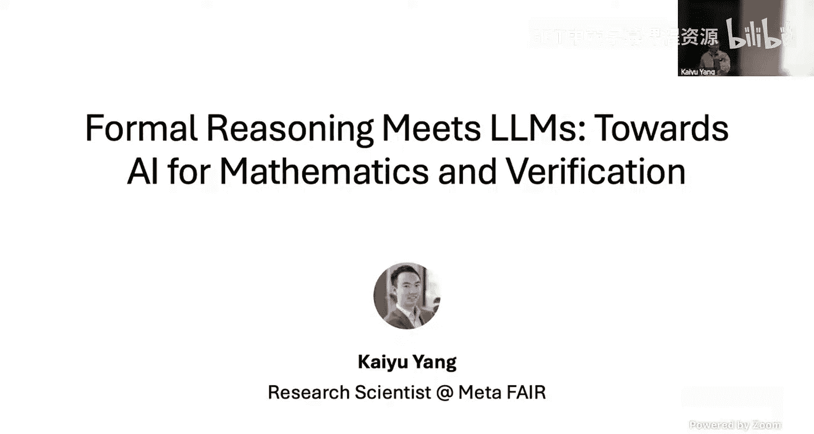

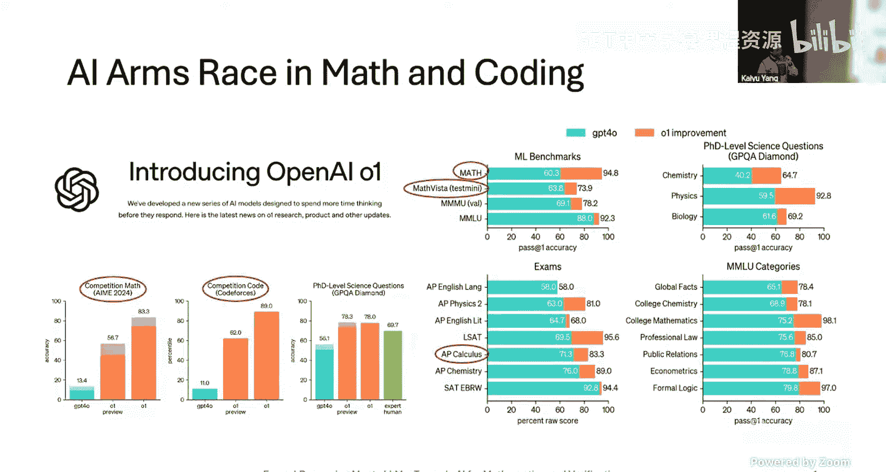

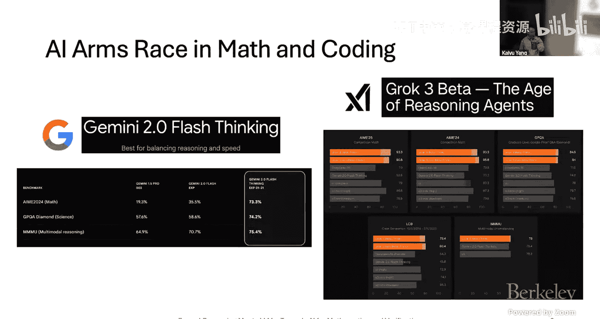

在本节课中，我们将探讨如何将形式化推理与大语言模型相结合，以解决数学和程序验证领域的挑战。我们将了解当前大语言模型在数学和编码任务上的表现、其背后的核心技术，以及如何通过形式化系统来弥补现有方法的不足。

## 大语言模型在数学与编码领域的军备竞赛

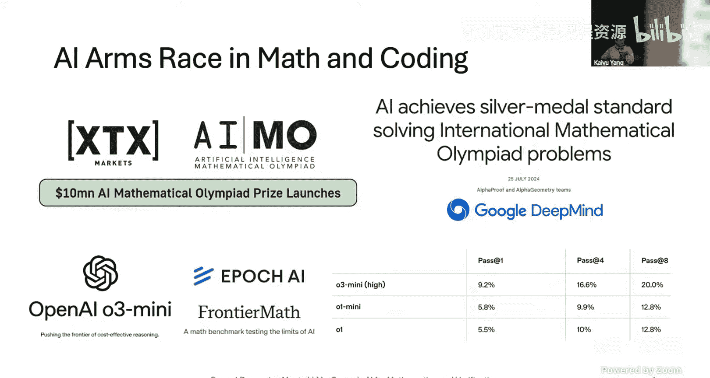

当前，各大领先公司正进行着一场大语言模型的军备竞赛，每隔几个月就会发布新模型。这场竞赛的核心是数学和编码能力。例如，当 OpenAI 发布 GPT-4o 时，通常会展示其在各种基准测试中的能力，其中数学竞赛（如 AI Math Olympiad）和编码竞赛（如 Codeforces）的表现常被重点强调。

同样，当 Google 发布 Gemini 和 X AI 发布 Grok 时，它们也着重突出了在数学和编码方面的能力。

2023年11月，英国对冲基金 XTX Markets 设立了 AI Math Olympiad 奖，为能在国际数学奥林匹克竞赛中获得金牌的 AI 提供1000万美元奖金。不久之后，2024年7月，Google DeepMind 宣布其 AlphaProof 和 AlphaGeometry 已达到银牌水平。

如果我们想超越高中数学竞赛，还有 Frontier Math 基准测试，它包含了由专业数学家策划的研究级数学问题。不久后，OpenAI 的 o3 模型宣布可以解决其中超过20%的问题，这令人惊讶，因为当 Frontier Math 基准发布时，人们认为语言模型需要数年时间才能取得真正进展。

## 为何关注数学与编码？

人们关注数学和编码主要有两个原因。
1.  数学和编码是复杂推理与规划的代理任务。推理和规划不仅是人类智能的重要组成部分，也是当前大语言模型面临的主要挑战之一。如果能让语言模型具备推理和规划能力，将能解锁无限的应用，例如旅行规划或日程安排。
2.  数学和编码相对容易评估。对于数学问题，可以检查答案是否正确；对于编码，可以运行单元测试来验证。相比之下，要求语言模型写犯罪小说或创作交响乐则难以评估，尽管这些任务同样需要推理和规划。我们在此使用“相对容易”，是因为检查答案或运行测试并非完美的评估方式，但它是合理的评估方法，我们将在后续讨论中重新审视这一点。

## 训练数学语言模型的核心技术

我们知道语言模型竞相在数学和编码方面表现出色。接下来，我们将简要介绍其背后的主要技术。我们主要关注数学，但讨论在很大程度上也适用于编码。我们稍后会看到，数学和编码是深度关联的。

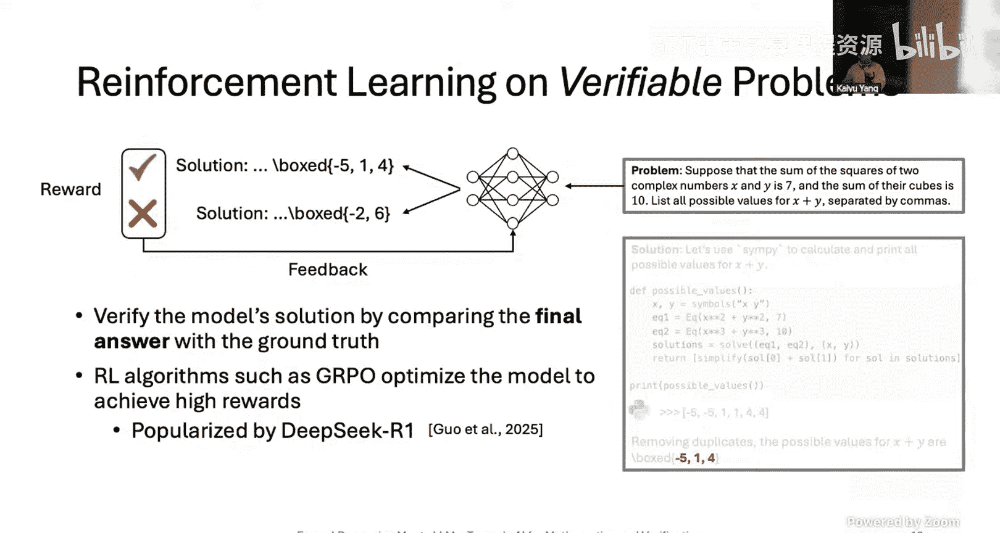

最先进的数学语言模型主要使用两种技术进行训练：监督微调 和强化学习 。我们将从高层次概述这两种方法，并强调对数据和可验证性的需求。

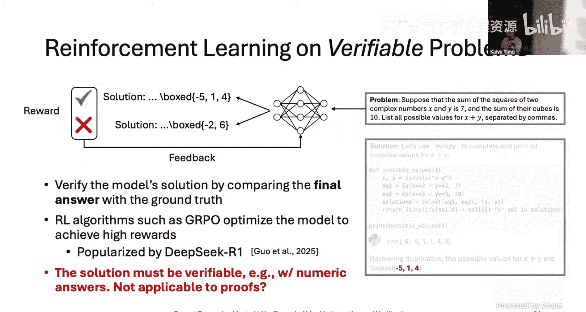

### 监督微调

在 SFT 中，你有一个基础模型，这是一个在互联网规模数据集上训练的通用语言模型。为了让其学习数学，你需要提供专注于数学的额外数据，例如从 Math Overflow 抓取的网页或 arXiv 上的论文。

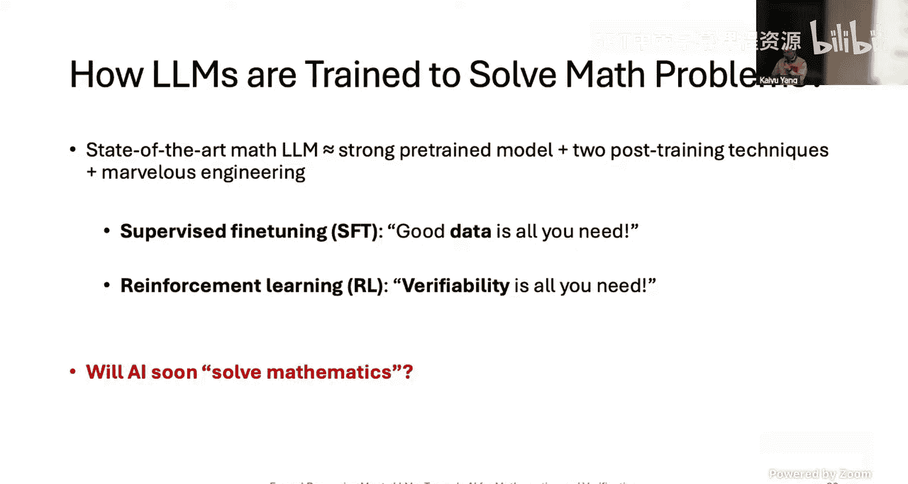

微调的结果称为基础数学语言模型。虽然它已经看到了大量数学内容，但尚未学会如何解决问题。因此，下一步是提供大量带有详细分步解法的问题。在解法中，可以选择性地使用外部工具。这里，模型不仅被训练来生成自然语言推理，还可以调用像 Python 这样的外部工具。

这个流程中最重要的环节是数据集。你需要用于持续预训练的数据集，以及用于进一步微调的、包含问题及其分步解法的大量标注数据。收集这些数据集是流程中最昂贵且最具技巧性的部分，因为它无法完全自动化，需要人工进行标注、清理和转换。

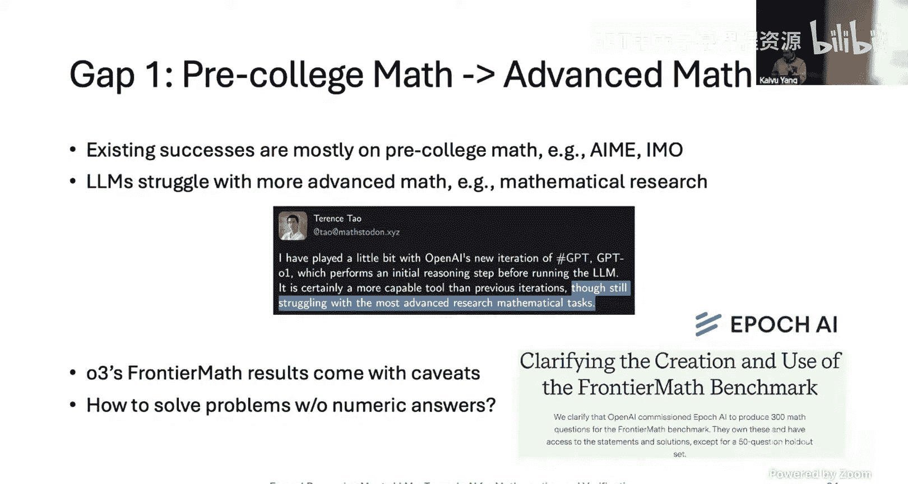

### 强化学习

如果我们的数据只有最终答案，没有中间步骤呢？在这种情况下，你不想昂贵地人工标注数据，但或许可以更廉价地获得只有最终答案的数据。我们是否仍能使用这些数据集来训练模型？答案是肯定的，我们可以使用强化学习来训练模型，仅根据问题和最终答案生成解法。

其工作原理如下：将问题输入语言模型，模型生成包含中间步骤和最终答案的解法。你可以通过将其与标准答案进行比较，来检查最终答案是否正确。这个验证结果可以作为强化学习中的奖励信号，你可以使用像 GRPO 这样的算法来优化模型以获得高奖励。你可以将正确解法的奖励设为1，错误解法的奖励设为0。这种方法思路简单但功能强大，其思想已存在数十年，但由 DeepSeek-R1 首次证明可用于训练推理语言模型，并且最近获得了巨大发展势头。

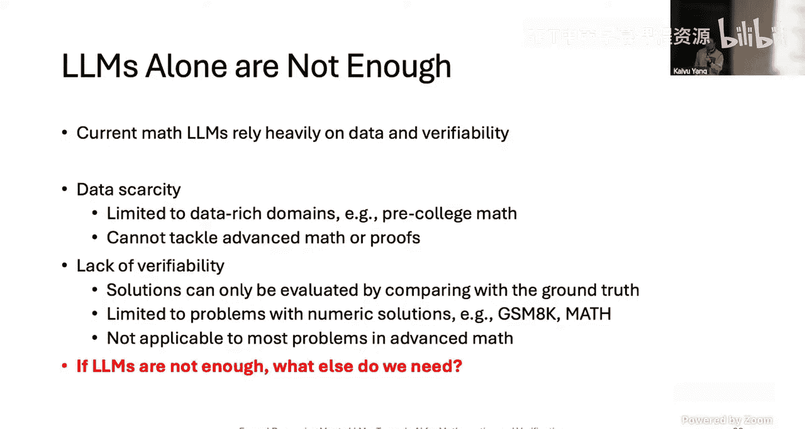

在强化学习中，关键是可验证性。你必须能够验证结果，能够判断解法是否正确，否则就没有奖励。如果解法有数值答案，你总是可以通过与标准答案比较来检查。但如果是一个证明题呢？你被要求生成一个证明，但没有简单的方法来判断证明是否正确。我们能否仍然进行强化学习？我们将在本讲座的后续部分重新讨论这一点。

## 当前方法的局限性与挑战

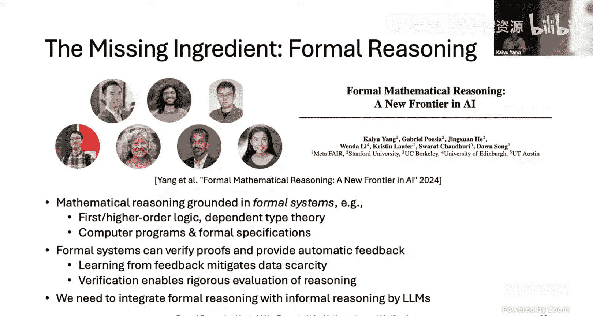

我们已经介绍了训练数学语言模型的主要技术：监督学习和强化学习。可以说，任何最先进的数学语言模型都是强大的基础模型与这两种后训练技术的结合，或许更重要的是卓越的工程努力。算法非常直接，几乎每个领先的工业实验室都在使用相同的算法。真正重要的是谁拥有更好的基础设施、工程和数据集。

那么，既然我们有如此强大的方法，AI 是否很快就能解决数学问题？答案绝对是“不”。我们存在几个差距。

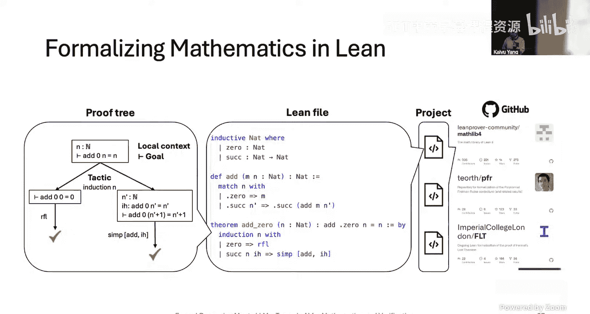

### 差距一：从大学预科数学到高等数学

现有的成功主要局限于大学预科数学，如 IMO 或 AMC。如果你给语言模型更高级的数学问题，它们仍然会感到困难。当代最杰出的数学家之一陶哲轩表示，他试用过 OpenAI 的 o1 模型，发现它在处理最前沿的数学研究任务时仍然很吃力。这在一定程度上是意料之中的，因为数学研究本质上是新颖的，由于新颖，你没有大量数据来训练语言模型。此外，o1 和 o3 在 Frontier Math 上的结果虽然涉及高级数学问题，但存在一些注意事项。首先，Apple AI 和 OpenAI 之间存在后来披露的财务联系。但更重要的是，Frontier Math 与真正的数学研究之间存在差异。Frontier Math 中的问题被设计为具有数值解。它们是非常高级的数学，但被设计成有数值解，这与直觉相悖，因为我们知道大多数高等数学问题没有数值解。他们这样设计基准是为了便于模型评估。

### 差距二：从猜测答案到书写证明

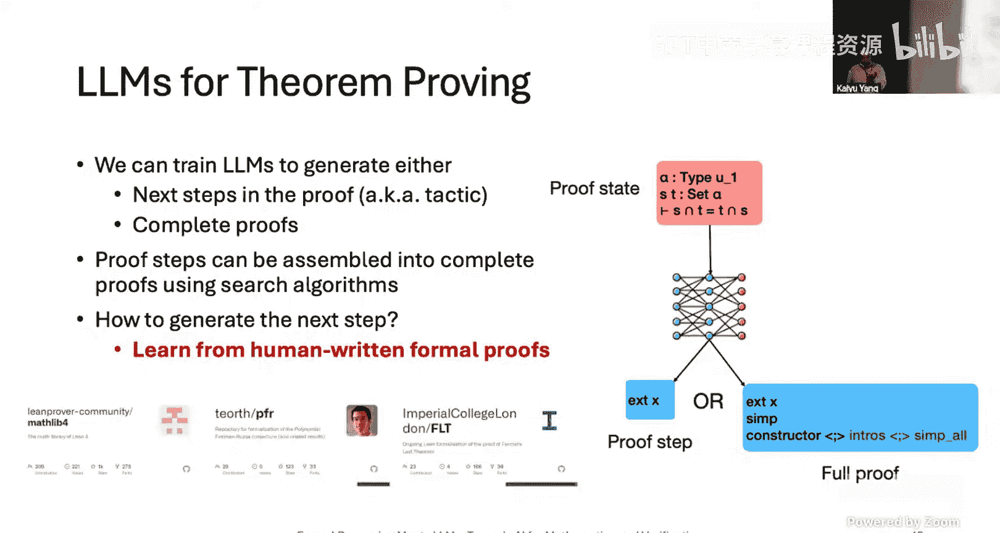

当前模型非常擅长猜测答案，但我们如何让它书写证明？最近的研究发现，语言模型在书写即使是非常基础的证明时仍然很吃力。普特南数学竞赛是针对本科生的数学竞赛，最近有人尝试使用 OpenAI 的推理模型参加普特南考试，结果令人失望，大多数答案只得了10分中的1或2分。在另一篇论文中，研究人员评估了语言模型在美国数学奥林匹克竞赛证明题上的表现，结果显示所有模型的得分都在5%左右，相当低。

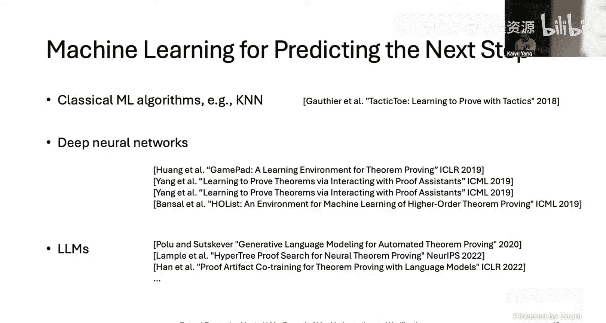

语言模型所犯的错误一旦被指出，可能很容易发现，但如果在一个长证明中，则很难检测到。例如，我们要求模型证明一个非常简单的不等式，当它试图将一个不等式乘以一个正数时，应该保持不等号方向，但它却翻转了方向。这是一个非常简单的错误，如果被指出的话。

我们认为，当前训练语言模型的方法不足以解决这些问题，因为它严重依赖于数据和可验证性。在处理高等数学时，正如我们所说，数据非常稀缺。在处理证明时，你缺乏可验证性。在高等数学中，大多数问题都需要证明。

## 形式化推理：缺失的一环

如果语言模型还不够，我们还需要什么？在我们最近发布在 arXiv 上的一篇立场论文中，我们认为一个重要的缺失环节是形式化推理。

形式化推理意味着你在形式化系统中进行数学推理。形式化系统可以包括一阶逻辑、高阶逻辑、依赖类型理论，甚至计算机程序及其语义。形式化系统的作用是尝试验证证明，并提供关于证明的自动反馈。这非常有用，因为它提供的反馈可以缓解数据稀缺问题，你可以让模型从自动反馈中学习，而不需要收集大量人工创建的数据。其次，现在你可以进行验证，从而能够严格评估模型。因此，我们认为，要向前发展，确实需要将形式化推理整合到当前方法中。

## Lean 简介：一个形式化系统

我们将非常简要地介绍 Lean，它是我们在本次讲座中关注的一种形式化系统，也被用于 AlphaProof。以下是 Lean 中的一个程序示例。在这个程序中，你首先定义自然数，然后定义两个自然数之间的加法，接着可以陈述并证明关于自然数和加法的一些定理。

这只是 Lean 中的一个文件。如果你使用 Lean 来书写形式化数学，它类似于使用 Python 或其他编程语言开发软件。你有一个文件，其中包含一个证明。这个证明对应一个证明树。这棵树根是你想要证明的原始定理，证明中的每一步都将证明目标分解为几个更简单的子目标，你可以递归地进行，直到所有子目标都被解决。一个项目可以有许多文件，项目可以开源在 GitHub 上。这类似于软件开发的方式。

将 AI 与 Lean 结合的一个例子是 AlphaProof，这是上一讲的内容。它是一个非常成功的例子，它使用 Lean 生成大量定理和证明，验证这些证明，并通过搜索和强化学习来训练模型。

在本次讲座的剩余部分，我们将讨论使用 Lean 和 AI 的两个核心任务。

## 任务一：定理证明

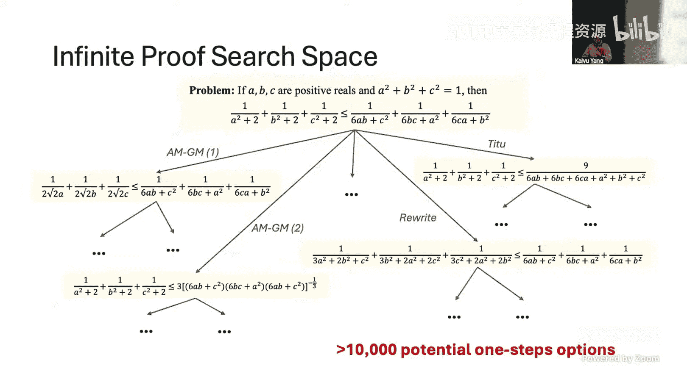

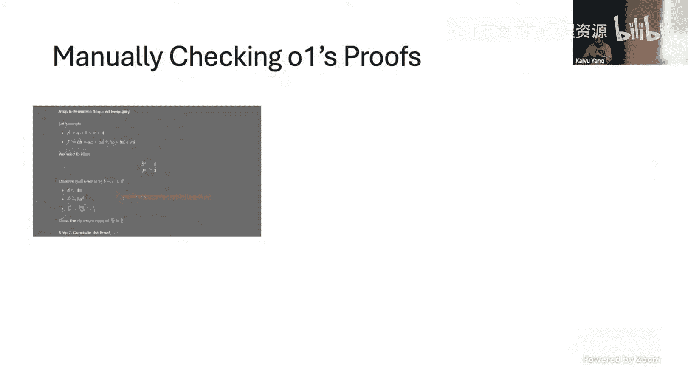

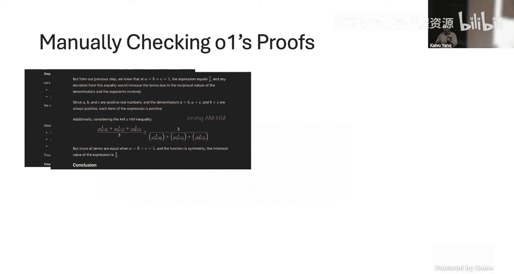

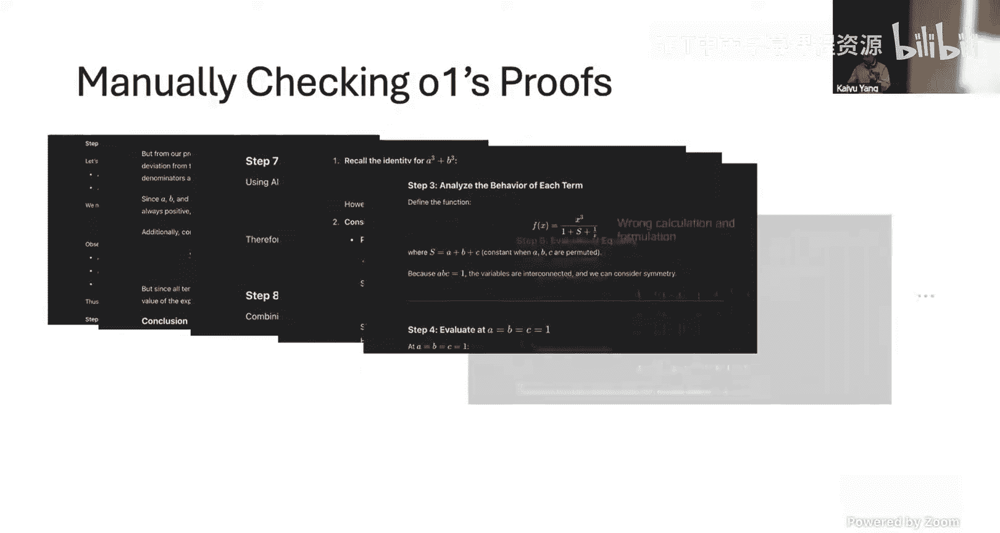

第一个任务是定理证明。在定理证明中，你的输入是一个形式化陈述，你希望模型生成一个证明。陈述和证明都以 Lean 形式化书写，Lean 可以检查证明是否正确，因此模型没有产生幻觉的空间。

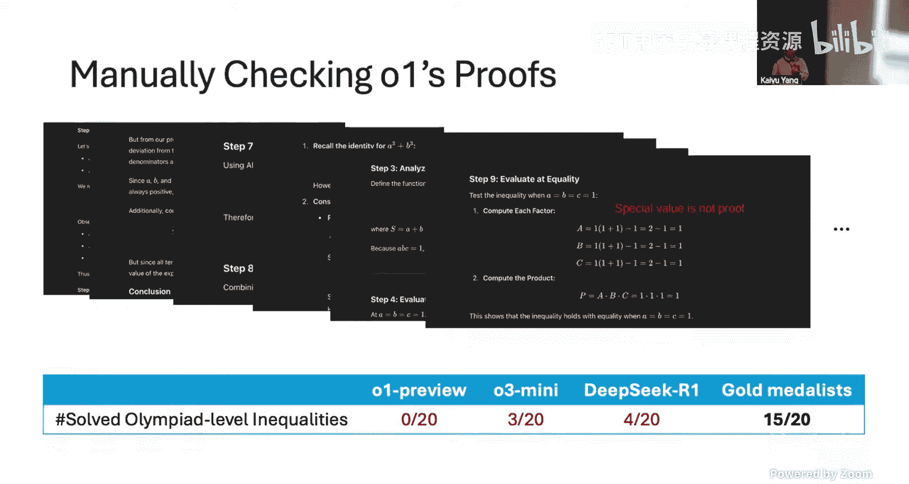

一个非常直接的方法是，你只需给模型你想要证明的内容，并要求模型生成证明中的一步，或者要求它生成整个证明。如果你能生成下一步，你可以使用搜索将这些步骤组合成一个完整的证明。这里的核心问题是如何生成下一步。

一个非常直接的解决方案是，我们有人工书写的形式化证明，我们可以训练一个模型在这些数据上进行监督学习，使模型学会如何生成下一步。这个想法实际上已经存在了一段时间，早期工作使用经典的机器学习算法，如 k-最近邻。大约在2019年，人们开始为这项任务使用深度神经网络，后来甚至开始使用大语言模型。可以说，直到使用大语言模型，我们才真正看到了性能的飞跃，因为模型可以在预训练期间获得大量数学知识，并将其用于定理证明。

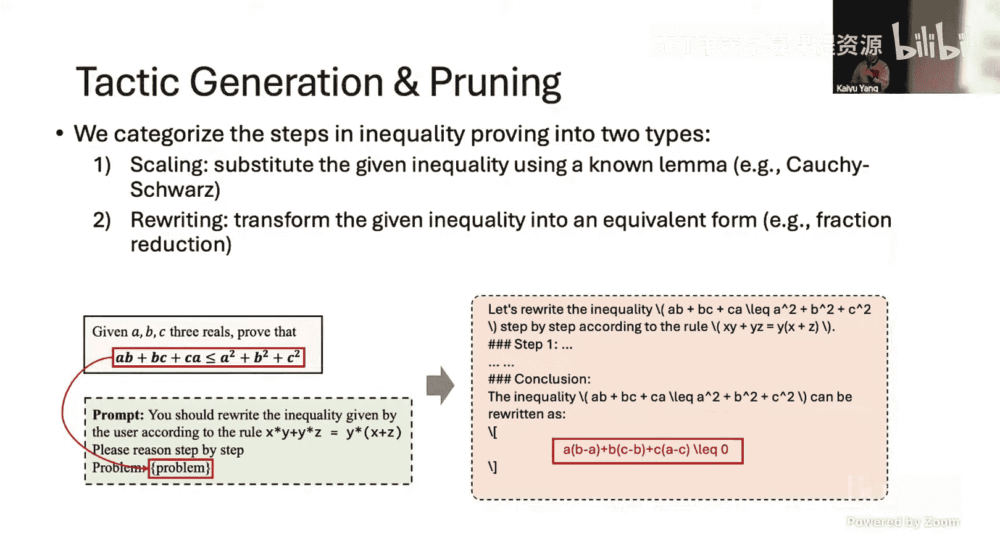

我们将主要讨论2023年11月发表的名为 LeanDojo 的论文。在这篇论文中，我们为 Lean 定理证明提供了开源数据集、工具和模型。与之前的方法相比，主要区别在于：首先，我们是完全开源的，而之前的方法是私有的，不发布数据集和模型；其次，我们提出了一个新的模型来生成证明中的下一步。

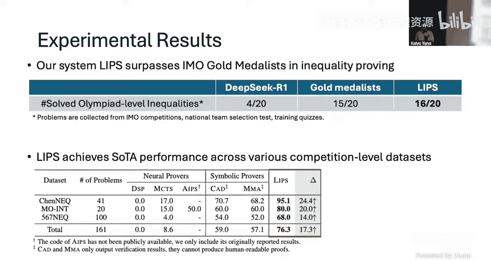

以下是概述。在 Lean 中，我们可以从人工编写的 Lean 代码中提取数据。我们提取了大约10,000个定理和证明。对于每个证明，我们都有证明中的步骤、证明中使用的引理以及这些引理的定义。提取这个数据集后，我们用它来训练一个机器学习模型。模型训练完成后，可以与 Lean 交互来证明新定理。

我们为这项任务引入的模型称为检索增强证明器。其动机是，当你证明一个定理时，几乎从不从头开始，而是使用现有的引理。为了使用现有引理，模型必须知道存在哪些引理，并尝试判断一个引理是否有用。给定一个证明状态（即你想要证明的目标）和一个引理库，我们首先将所有内容编码为向量，计算状态与每个引理之间的相似度，并检索出最相关的引理。检索到引理后，我们将引理与状态结合，使用另一个语言模型来生成下一步。

这个模型非常简单，但真正重要的是如何获取数据集。正如我们所说，在 LeanDojo 中，你可以从 Lean 项目中提取数据集。

以下是典型神经定理证明器的总结。在左边，你看到一棵树在进行证明搜索。你有一个初始状态，你的模型可以生成多个潜在的下一步，运行这些步骤会得到下一个证明状态，你可以重复这个过程直到找到证明。对于这部分，你可以使用任何搜索算法，如深度优先搜索或蒙特卡洛树搜索。第二部分是如何生成下一步。在右边，你看到在这棵证明树的每个节点上，你都有当前状态。你将当前状态输入语言模型，它会为你生成建议。这里，语言模型可以选择性地接受一个形式化数学库，即你可以使用的引理库。

在 LeanDojo 工作之后，我们看到了一系列试图改进的工作。例如，你可以做所谓的专家迭代。即使一个证明器不是很好，你也可以用它来尝试证明一些新定理。在这个过程中，你会得到一些新的证明。一旦你得到新的证明，就可以将它们添加到你的训练集中，从而用更好的训练集训练出更好的证明器，并可以迭代进行。通过这种方式，我们表明，如果你运行更多迭代，性能通常会提高，直到达到某个饱和点。

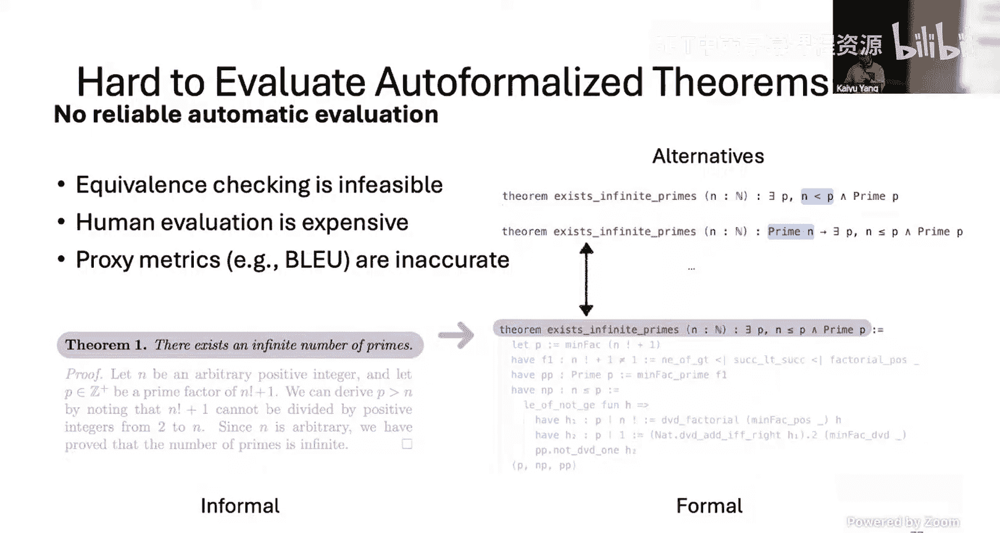

## 定理证明的挑战与局限

我们已经看到了一种构建定理证明模型的简单方法：只需提取人工书写的证明，并训练一个语言模型来生成证明中的下一步。这是一个巨大的进步，但它也有局限性。

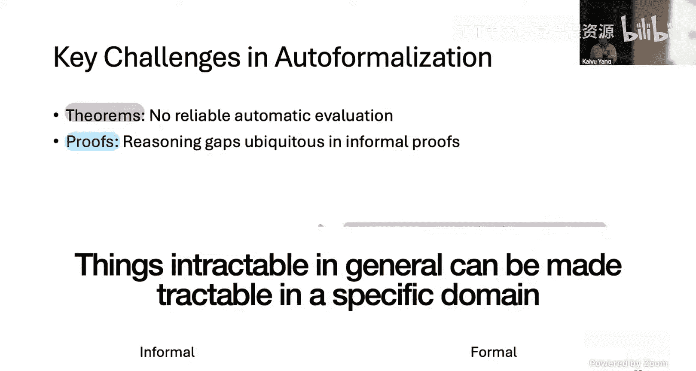

第一个限制仍然是数据。语言模型只有在有大量训练数据时才能良好工作，而互联网上人工书写的证明数量与 Python 代码相比非常有限。另一个限制是证明任务本身固有的。想想 AI 取得成功的其他任务，比如围棋。证明定理和围棋的主要区别在于，围棋有一个19x19的棋盘，你可以采取的可能行动受到棋盘大小的限制，是有限的。但在数学中，你的行动空间可以说是无限的。在证明一个定理时，你潜在地可以做无限多的事情。

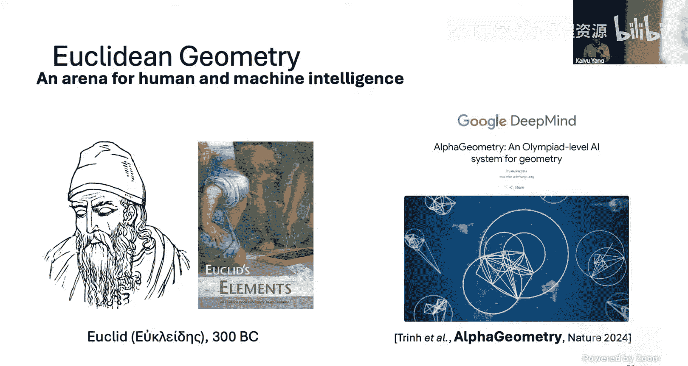

由于行动空间是无限的，如果只从人工创建的数据集中学习，很难覆盖整个空间。即使你使用强化学习，也很难有效地探索空间。在我们目前讨论的工作中，我们只使用了监督学习，没有涉及课程学习。但如果你使用强化学习，很自然地会让模型先从相对简单的例子中学习，然后尝试泛化。如果你观察最近使用强化学习进行定理证明的工作，一个主要困难是如何选择呈现给模型的例子，你希望例子既不太容易也不太困难。

## 应对无限行动空间的尝试

我们如何解决关于行动空间的限制？在最近的一项工作中，我们尝试朝这个方向迈出一步，但我们选择了一个非常有限的领域作为试验场：数学奥林匹克中的不等式证明。

我们选择这个领域是因为该领域的证明高度规律。人类通常会做两件事：一是应用现有的引理，如 AM-GM 不等式或柯西-施瓦茨不等式；二是将当前公式重写为一种形式，使得现有引理变得可应用。但即使只有这两种行动，行动空间仍然非常大。例如，为了证明一个特定的不等式，你可以应用 AM-GM，而 AM-GM 可以有多种应用方式，因此分支因子很大。你也可以应用其他不等式，如 T2 不等式，或者选择将公式重写为某种形式。因此，你可以采取的行动本质上是无限的。

我们如何在这种无限行动空间中导航？在尝试解决问题之前，我们做了一件事：看看 o1 如何解决这个问题。我们给 o1 提供了许多不等式问题，并手动检查了它们的证明。结果，我们在 o1 生成的证明中发现了许多错误。我们检查了20个例子，o1 未能证明其中任何一个。更强大的 o3 和 DeepSeek-R1 也只改进了20个例子中的3或4个，而一个典型的人类金牌得主至少能证明15个。

然后来看看我们的方法。正如我们所说，我们将在这个特定问题中可以采取的步骤分为两类。第一类我们称之为“缩放”。缩放是指你将一个现有引理（如柯西-施瓦茨不等式）应用到当前公式的一部分。缩放的特殊之处在于，你可以进行的缩放数量是有限的。这是因为你只有有限数量的引理，而每个引理只能以有限的方式应用。因此，实际上可以枚举这个空间中所有可能的缩放。

除了缩放，另一类称为“重写”。重写是指你有一个公式，并希望将当前公式转换为另一种形式。重写与缩放的不同之处在于其空间是无限的。给定任何公式，你都有无限种方式可以重写它。

这里的关键见解是，在我们进行这种分类之后，我们的算法可以使用符号算法枚举所有可能的缩放，而无限的重写空间则由大语言模型处理。我们将符号算法生成的下一步与大语言模型生成的步骤结合起来，并使用一些启发式方法来过滤结果，以减少证明搜索中需要处理的目标数量。结果，我们解决了比 DeepSeek-R1 和 o3 多得多的问题。

我们的系统发现的一个有趣的证明例子来自美国 IMO 队教练 Evan Chen 的一个问题集。他说这个问题没有希望用 AM-GM 解决，但我们系统发现的证明仅使用了 AM-GM 结合巧妙的重写，因此它实际上可以找到人类不知道如何找到的证明。

定理证明的挑战在于如何有效地探索一个潜在无限的行动空间。虽然这是一个非常困难的问题，但如果你在数学的特定领域工作，你可以利用领域知识来构建行动空间，使其变得可行。但如何将这种方法推广到通用领域，仍然是一个开放性问题。

## 任务二：自动形式化

在讨论了定理证明之后，我们将转向自动形式化。在自动形式化中，我们有非形式化数学和形式化数学，我们希望模型能够在它们之间架起桥梁，将非形式化翻译成形式化。

实际上，这里有两个略有不同的子问题。首先是如何自动形式化定理陈述。其次是如何自动形式化证明。在陈述自动形式化中，模型只接受陈述并生成 Lean 中的陈述；而在证明自动形式化中，模型有非形式化陈述、非形式化证明以及形式化陈述，它只生成形式化证明。

这两个子问题有不同的挑战。让我们先谈谈陈述形式化。对于形式化陈述，评估确实非常困难。例如，非形式化陈述说“存在无限多个素数”，形式化陈述说“对于任何自然数 n，存在一个大于等于 n 的素数 p”。这显然是对非形式化陈述的正确翻译，因为它暗示了无限性。但问题是，这不是唯一的正确解。如果我们改变为“p 严格大于 n”，本质上是一样的。我们甚至可以使其更加不同，我们可以让 n 也是素数。对于人类来说，你可以很容易地看出这三个陈述略有不同，但本质上是相同的。但这给机器学习带来了问题。如果机器学习模型产生了其中一个，你如何知道它是否与标准答案等价？你可能想说，我是否可以检查逻辑等价？但现实是，这种检查两个定理陈述等价性在计算上通常是不可判定的。在实践中，研究人员不得不依赖启发式方法或人工评估。但如果依赖人工评估，将非常昂贵且不可复现；如果依赖代理指标或启发式方法，则不够准确。

这就是评估自动形式化陈述的挑战。那么证明呢？证明我们有另一个挑战。即使人工书写的证明非常严谨，也不够严谨到可以形式化。它们经常存在漏洞，比如数学家常说“此情况留给读者”。如果“留给读者”，你的模型无法从文本中找出答案，必须自己解决。证明中还有更多微妙的漏洞，我们稍后会讨论。总之，为了让模型能够自动形式化证明，它必须填补所有这些空白，这可能非常困难。

我们已经涵盖了自动形式化中的两个关键挑战：对于陈述，我们没有可靠的自动评估方法；对于证明，模型必须填补所有推理空白。在这个项目中，我们想同时解决这两个问题。这听起来非常棘手。但我们在这个项目中学到的一个教训是，如果限制在一个非常特定的领域，一般性棘手的问题可以变得可处理。

## 欧几里得几何：一个可处理的领域

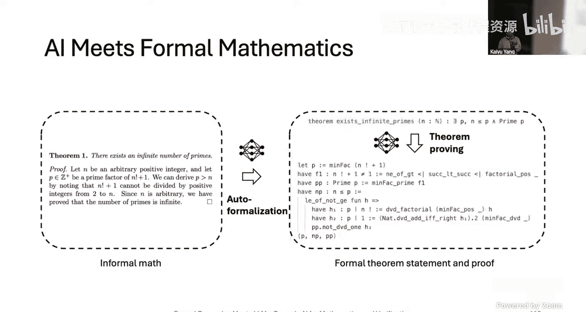

我们选择的领域是欧几里得几何。欧