# 10：利用AI连接非形式化与形式化数学推理

在本节课中，我们将探讨如何利用人工智能来连接非形式化与形式化的数学推理。我们将看到，数学的表示方式对于AI模型的能力至关重要，并介绍几种旨在弥合这两种推理方式之间差距的方法。

## 概述：数学推理的两种范式

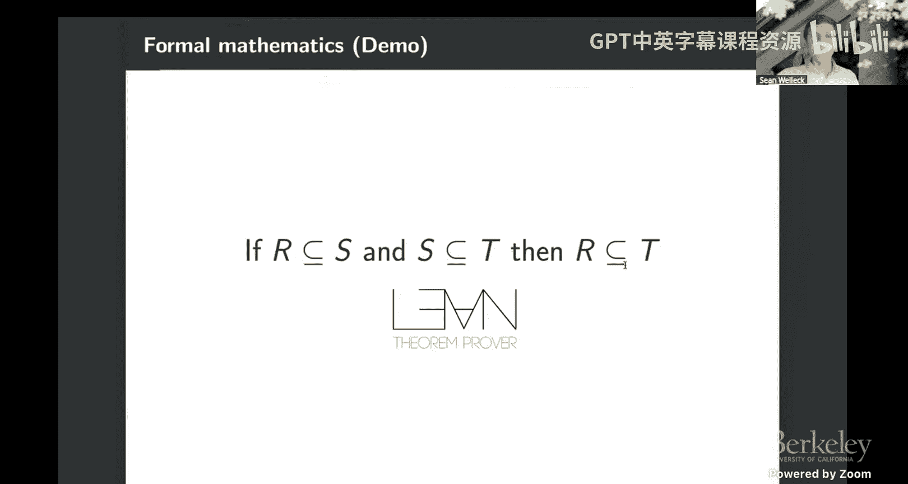

数学推理主要有两种表示方式：非形式化数学和形式化数学。

非形式化数学以原始数据形式表示，如文本、图像甚至音频。这种方式非常灵活，我们遇到的大多数数学内容，如LaTeX解答或arXiv论文，都属于非形式化格式。然而，当使用AI生成或操作非形式化数学时，存在一个关键问题：我们无法保证其正确性。语言模型可能在中间步骤犯下细微的错误，这使得在教育和研究等需要高度信任的领域使用它们变得困难。

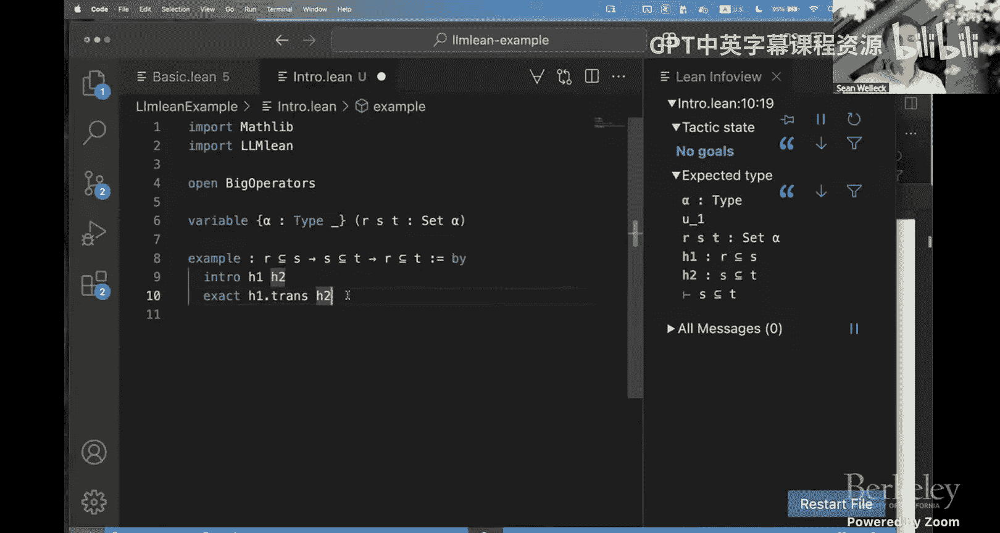

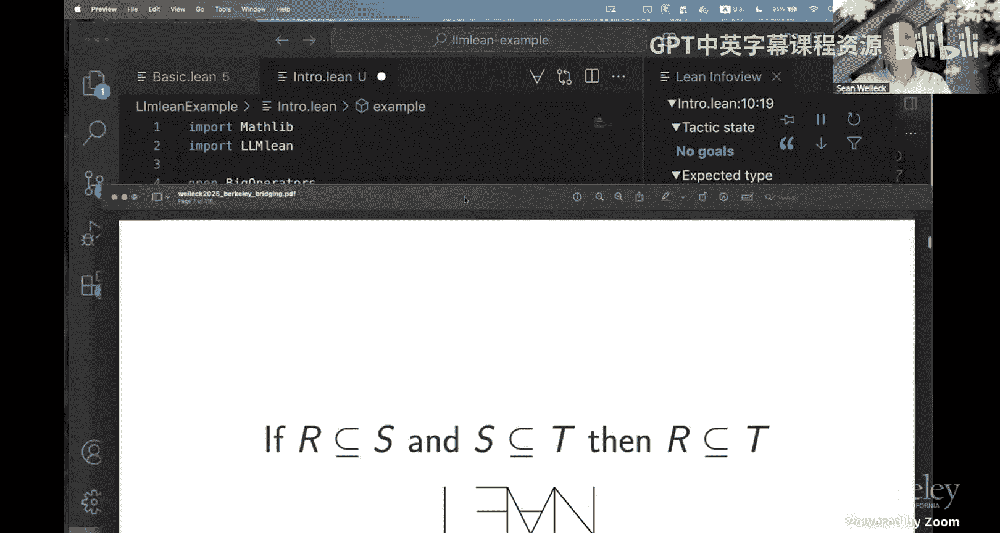

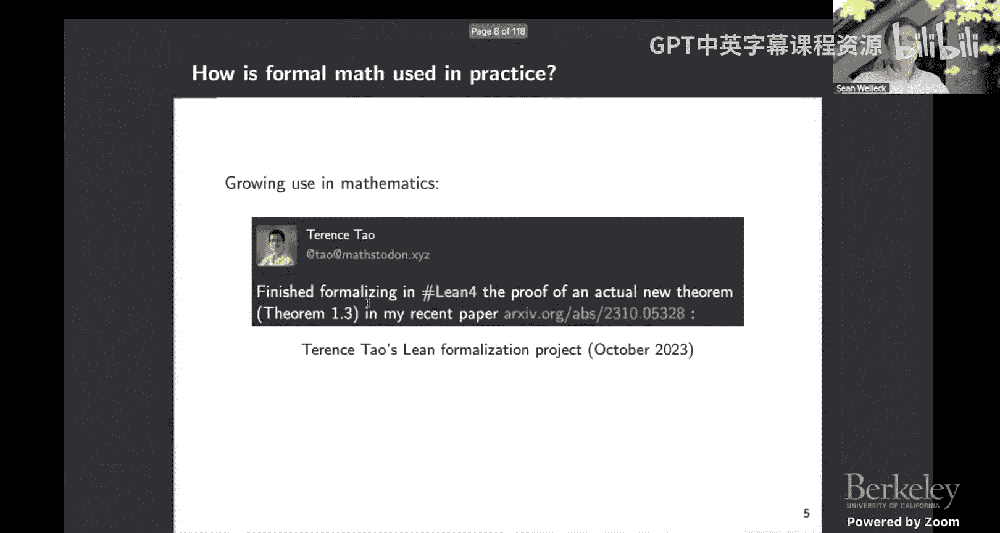

这促使我们转向另一种范式：形式化数学。在形式化数学中，数学被编写为编程语言中的源代码。你可以写出一个规范、引理或定理（如 `1 + 1 = 2`），然后编写证明。最酷的是，如果所有代码都能编译通过，你就获得了该证明正确的形式化保证。这与非形式化数学截然不同，因为我们现在可以确信语言模型生成的证明是可靠且正确的。

存在多种定理证明语言，本节课将主要关注 **Lean** 语言，它在数学社区中正经历着令人兴奋的增长和交叉。我们也会提及 **Isabelle** 语言，因为它的一些特性使其适合与AI系统一起编写不同类型的证明。

## 形式化证明助手演示

为了直观感受形式化证明，让我们看一个简单的定理证明示例：传递性。即，如果 `R` 是 `S` 的子集，且 `S` 是 `T` 的子集，那么 `R` 是 `T` 的子集。

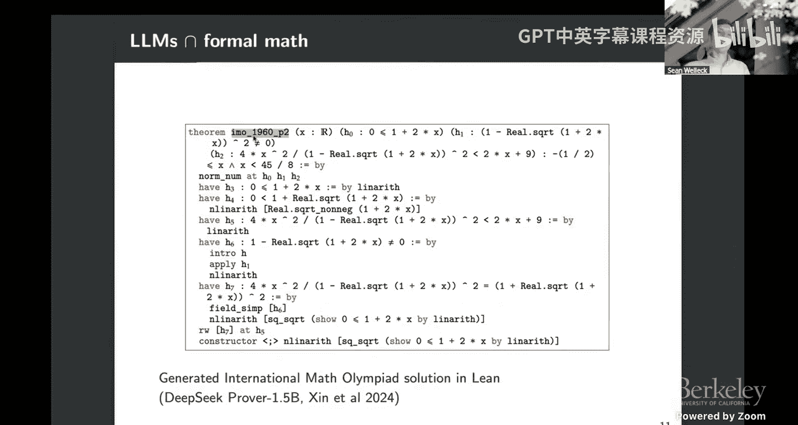

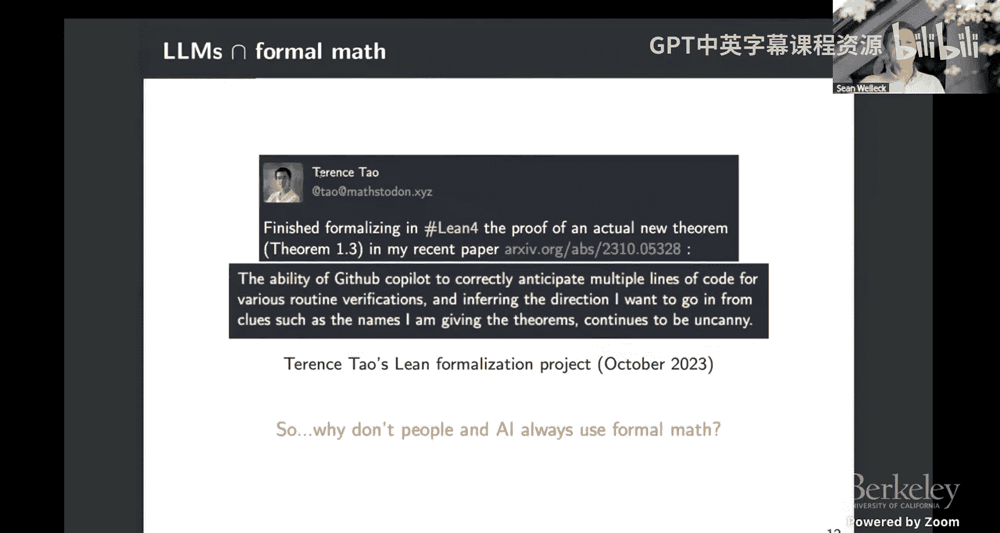

在Lean这样的交互式证明助手中，证明过程是逐步进行的。系统会显示当前的证明状态（即需要证明的目标和已有的假设），用户（或AI）可以输入一个命令（称为“策略”）来推进证明。例如，可以使用 `intro` 命令引入假设，或者调用已有的引理（如 `trans` 规则）来完成证明。当系统显示“没有剩余目标”时，证明就完成了。

这种形式化证明虽然强大，但需要专业知识来编写，并且其代码形式与教科书中的证明看起来可能很不同。

## 形式化数学的价值与挑战

形式化数学正变得越来越重要，它不仅对数学社区（如Terence Tao等数学家正在使用Lean形式化其论文证明），也对AI领域具有价值。

对于数学社区，形式化证明助手可以实现新的协作形式：将大问题分解成小块，任何人都可以提交代码来证明辅助定理，而Lean会自动检查正确性，这不同于传统论文协作中需要信任作者的方式。它还能提供即时反馈，并保证正确性。

对于AI领域，形式化系统为解决关键问题提供了途径：
1.  **提供可信的奖励信号**：在基于强化学习的模型训练中，形式化系统可以完美地判断某个证明步骤是否正确。
2.  **作为推理的试验场**：它提供了一个从简单到任意困难的数学推理问题的理想测试环境。

然而，尽管形式化数学前景广阔，AI领域并未总是采用它。主要的挑战在于存在一个**鸿沟**：人们熟悉的数学思维方式与形式化系统之间存在巨大差异。在Lean这样的系统中，每一步推理都需要明确、详细地写出，并且需要深入了解系统中已有的定义、定理和编写代码的方式。

因此，本节课的主题是：**迈向连接非形式化推理与形式化推理的步骤**。我们能否利用AI和语言模型，在保持非形式化推理灵活性的同时，获得形式化系统的所有好处？

接下来，我们将探讨社区正在追求的三种不同方向。

## 方向一：将非形式化思考融入形式化定理证明

第一种方向是在形式化定理证明过程中融入非形式化的思考。这主要基于我们的论文 **LeanStar**。

在传统的定理证明设置中，模型接收当前的证明状态，并尝试生成下一步的证明策略（战术）。然后通过树搜索（如最佳优先搜索）来生成完整的证明序列。

LeanStar 的想法更进一步：我们训练模型在生成每个形式化步骤**之前**，先输出一些非形式化的“思考”。这些思考可以是问题分解、下一步计划，甚至是解决一些证明中未明确出现的计算。

这样做的好处包括：
*   **为模型提供规划空间**。
*   **帮助多样化搜索空间**，因为现在模型不仅在形式化空间中搜索，也在这些思考增强的空间中搜索。

关键挑战在于，互联网上不存在附带这些有用思考的Lean形式化证明。因此，我们需要设计算法，让模型**自主学习**生成对证明有用的思考。

LeanStar 算法采用强化学习，包含两个阶段：
1.  **初始化**：我们利用一个巧妙的技巧，让语言模型回顾性地为已有的“状态 -> 下一步”转换生成描述性的思考，从而创建初始训练数据。
2.  **强化学习循环**：使用初始化后的模型生成完整证明，由Lean检查正确性，然后使用一种简单的算法（如专家迭代/拒绝微调）收集成功的轨迹（状态、思考、策略），并用这些数据进一步训练模型。

实验表明，在MiniF2F（一个基于数学竞赛题的基准测试集）上，经过LeanStar训练的模型性能超过了基线模型。此外，带有思考的模型在增加搜索预算时获益更多，这表明思考有助于多样化搜索空间。

自LeanStar之后，将思考融入模型并通过强化学习训练的想法已被定理证明社区广泛采纳，并成为当前最先进系统（如DeepSeek-Prover）的一部分。更广泛地说，生成长思维链并通过强化学习训练的语言模型正在彻底改变LLM的推理能力。

**总结**：LeanStar基于一个观察：仅训练形式化代码可能不足以学习生成代码所需的实际思维过程。它提供了一种简单的算法来学习生成思考。

## 方向二：从非形式化思考到非形式化证明

现在，我们从非形式化思考转向非形式化证明。具体来说，我们将讨论通过生成高层概要（草图）然后填补草图细节来证明定理的方法。

这种方法的动机是结合高层推理和低层推理的好处。考虑如何在形式化证明助手中编写证明：我们可以将非形式化证明分解为几个高层部分，然后在形式化系统（如Isabelle）中，可以编写结构类似的证明草图，其中包含需要被证明的中间声明（子目标）。

有趣的是，填补这些低层证明细节的任务，可以交给非常强大且有用的自动化工具，称为 **“锤子”**（如Isabelle的Sledgehammer）。Sledgehammer会调用外部的自动定理证明器（如一阶逻辑证明器、SMT求解器）来尝试证明这些子目标。它们在交互式证明中填补小缺口时极其有效，但对于解决IMO级别的问题则力不从心，因为搜索空间太大。

这引出了我们的方法：**Draft, Sketch, Prove**。
1.  **起草**：生成一个非形式化的证明草案。
2.  **概略**：使用语言模型将非形式化证明翻译成一个形式化的证明草图（包含待填补的缺口）。
3.  **证明**：使用低层证明器（如Sledgehammer）来填补草图的所有缺口。如果所有缺口都被填补，我们就得到了一个完整的形式化证明。

这种方法允许我们通过生成多个可能的非形式化草案或形式化草图来多样化搜索空间。实验表明，在MiniF2F上，通过增加采样数量，该方法能够证明大量问题，甚至最终超过了使用人工编写非形式化证明的性能。

**总结**：Draft, Sketch, Prove 方法生成高层草图并尝试填补细节。这依赖于Isabelle语言中名为Sledgehammer的低层证明器。

## 方向三：为Lean构建“锤子”工具

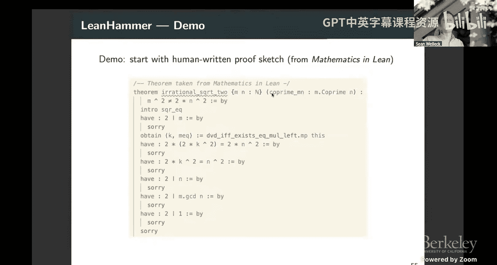

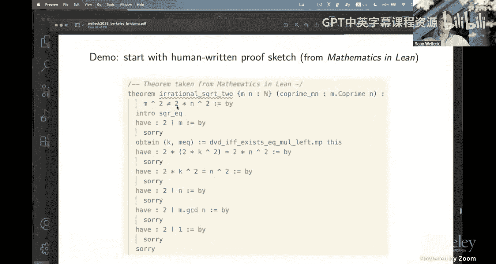

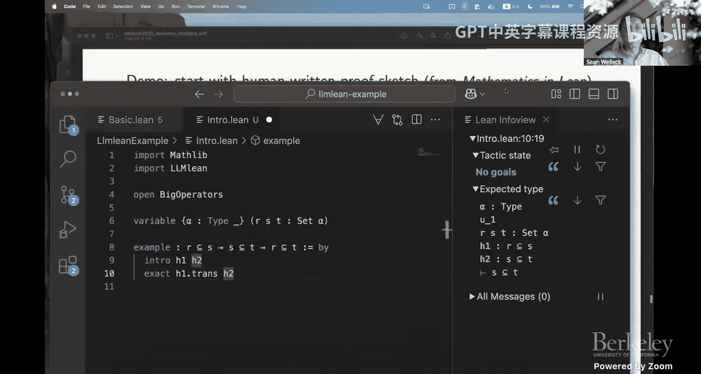

接下来，我们讨论我们最近的工作：尝试为Lean构建一个类似的“锤子”证明器，以便在Lean中更容易地进行这种基于草图的证明。这项工作基于尚未公开的论文 **Premise Selection for a Lean Hammer**。

一个“锤子”将自动定理证明器集成到交互式定理证明器中。其标准流程包括：
1.  **前提选择**：从庞大的数学库（如Mathlib，包含数十万个前提）中，筛选出可能对证明当前目标有用的定义、定理和引理。
2.  **翻译**：将选中的前提和目标从Lean的语言翻译成自动定理证明器（如Zipperposition）的语言。
3.  **证明搜索**：自动定理证明器尝试寻找证明。
4.  **证明重构**：如果找到证明，将其翻译回一个Lean可接受的证明。

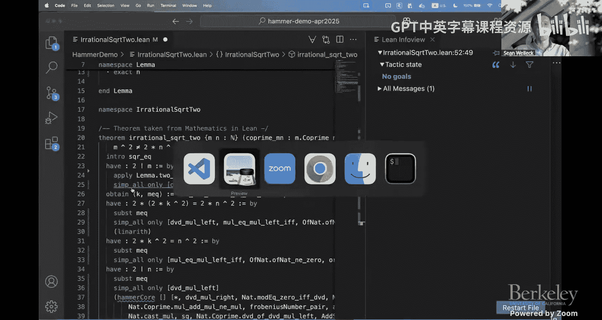

我们工作的重点是**前提选择**和**如何将这些组件组合起来**。

对于前提选择，我们将其构建为基于神经语言模型的检索任务。我们训练一个检索模型，将当前要证明的目标编码为向量，同时编码所有可能的前提（定理、定义等），然后通过余弦相似度选择最相关的前提。训练细节（如如何选择正负样本、是否简化项）对检索器性能有重大影响。

对于组件整合，我们没有采用简单的线性流程，而是将其集成到一个树搜索（A*搜索）中。这样，搜索过程可以在任何时刻使用选中的前提来调用Lean中的不同策略，或者查询自动定理证明器。

最终，我们将所有这些封装成一个简单的Lean命令 `hammer`。用户可以在证明的任何步骤调用它，系统会运行搜索并尝试自动完成证明。我们演示了如何使用这个工具，基于教科书《Mathematics in Lean》中关于√2无理数证明的**人工编写的高层草图**，一步步调用 `hammer` 来填补所有低层细节，从而完成整个形式化证明。

评估结果显示，我们训练的神经前提选择器在真实项目（Mathlib）的测试定理上表现优异，其性能开始接近使用人工证明中真实前提（ground truth premises）所能达到的水平。

**总结**：我们讨论了两种结合非形式化与形式化证明的方法。Draft, Sketch, Prove 涉及起草非形式化证明、生成形式化草图并填补低层细节。Lean Hammer 则试图将这种范式引入Lean，它涉及神经前提选择、树搜索和调用自动定理证明器。一个有趣的发现是，即使是我们训练的仅1亿参数的检索器（以当今标准来看非常小），在集成到系统中后也能表现出相当强大的能力。

## 迈向研究级数学的AI辅助

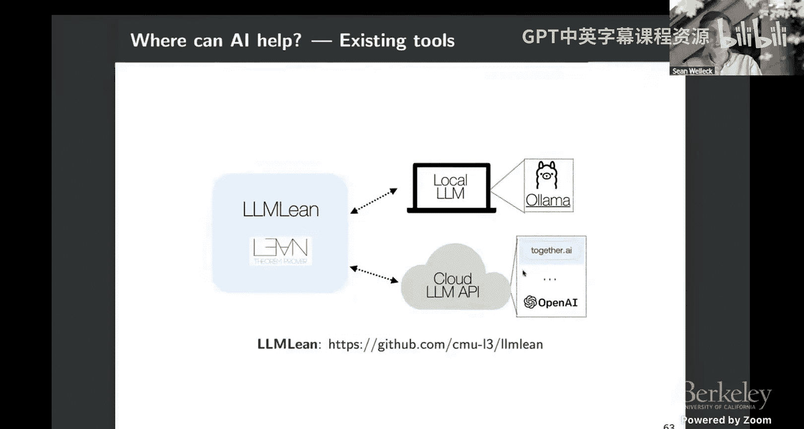

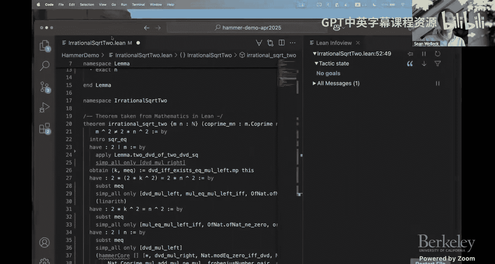

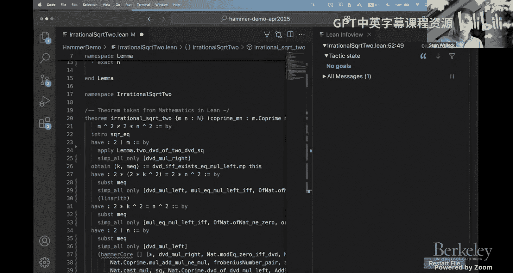

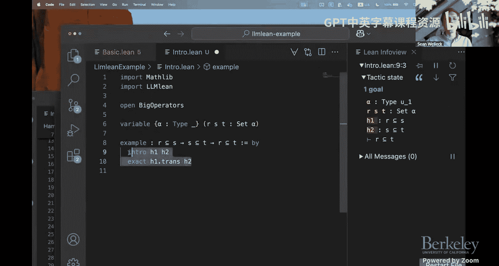

在最后一部分，我们探讨如何利用AI或上述技术来辅助研究级数学工作，而不仅仅是解决IMO问题。

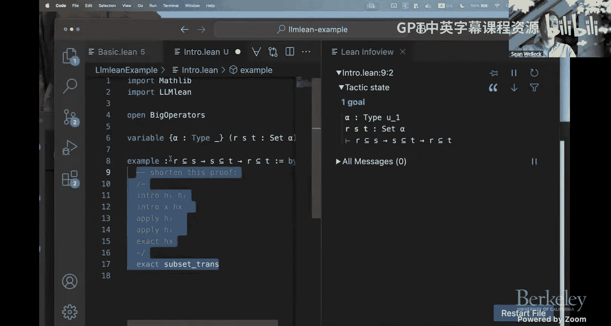

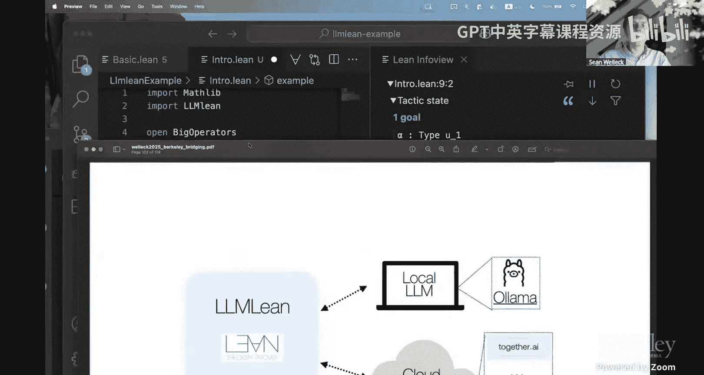

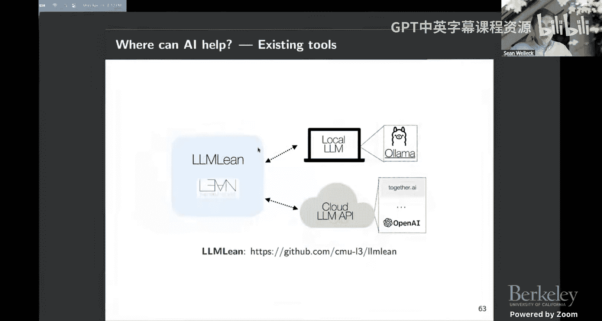

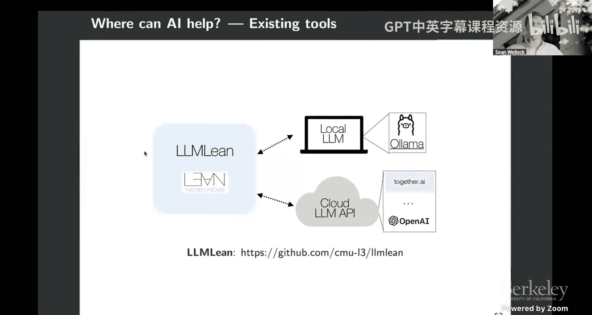

形式化研究级数学是什么样子的？以Terence Tao的博客为例，他将一篇论文中的主要定理形式化到Lean中，过程包括：
1.  编写**蓝图**：用非形式化语言（LaTeX）逐步分解证明所需的定义、引理和最终定理，形成一个依赖关系图。
2.  实现形式化：将蓝图中的所有部分转化为Lean中的形式化定义、引理和定理，最终完成证明。

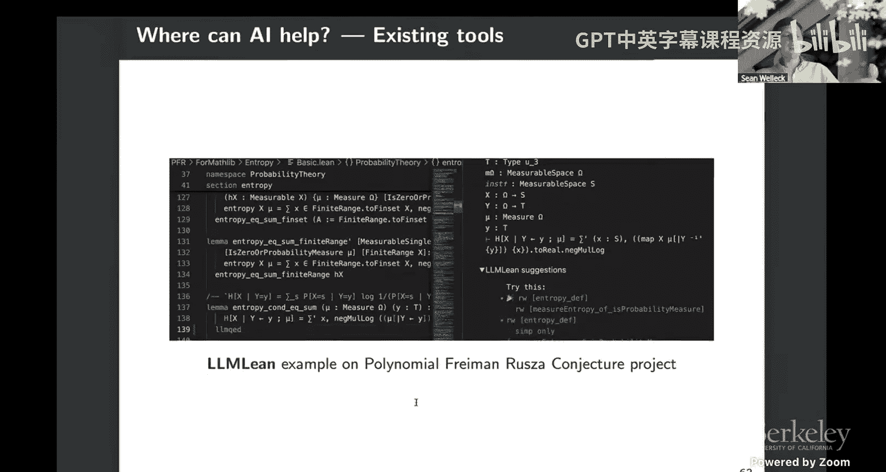

那么，AI可以在哪个环节提供帮助？目前，一个可行的起点是：给定这个庞大依赖图中的**单个引理**，让语言模型尝试生成其证明。由于Lean会检查输出，我们可以信任其结果，从而帮助人类开发者节省时间。

要实现这一点，需要克服两个主要差距：
1.  **可访问性差距**：许多先进方法难以集成到实际工具中。为此，我们开发了 **LLM Lean** 工具。它是一个Lean插件，允许用户在证明中直接调用命令（如 `llm_step`）来查询语言模型（可以是本地模型或云端API）生成下一步策略或完整证明，并自动检查输出的正确性。这是一个今天就可以使用的工具。
2.  **基准测试差距**：当前的定理证明模型主要在像IMO问题这样的**自包含**、**依赖标准结果**的竞赛题上进行基准测试。然而，真实的研究项目具有**复杂的、项目特定的依赖关系**。模型需要在这种**上下文相关**的环境中证明定理。

为此，我们提出了新的基准测试：**MiniCtx**。它从真实的Lean项目（如Mathlib, PFR项目）中提取定理，并保留其完整的上下文（依赖的定义、引理，可能跨多个文件）。我们发现，在MiniF2F上，是否提供额外上下文对性能影响不大；但在MiniCtx上，仅提供证明状态与提供整个当前文件的代码之间，性能存在巨大差距。这凸显了处理上下文对于实际应用的重要性。

MiniCtx基准测试、数据提取工具、评估代码以及我们为此微调的模型都是开源的，旨在推动面向真实世界形式化任务的AI助手的发展。

**总结**：在研究级数学形式化中，我们面临着独特挑战：AI进展与可用工具之间的差距，以及基准测试未能完全反映真实形式化所需能力。MiniCtx基准测试是解决这些挑战的第一步。

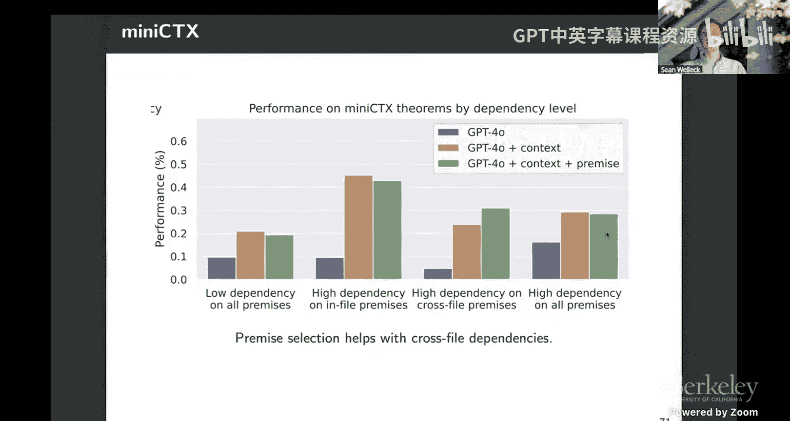

## 课程总结

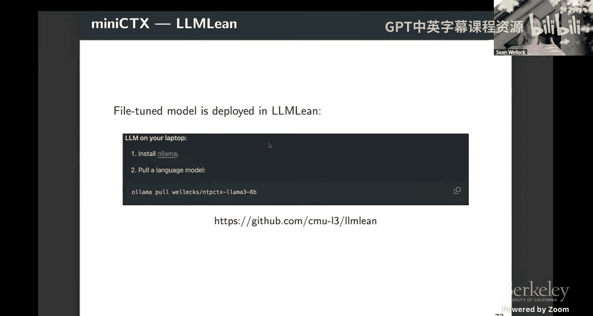

在本节课中，我们一起探讨了三种尝试连接非形式化与形式化数学推理的方法：
1.  **融入非形式化思考**：通过训练模型进行非形式化思考（LeanStar）。
2.  **融入非形式化证明**：通过生成证明草图并填补细节的方法（Draft, Sketch, Prove 和 Lean Hammer）。
3.  **辅助研究级数学**：探索如何在实际研究项目的形式化过程中使用AI，并介绍了相关工具（LLM Lean）和新的基准测试（MiniCtx）以应对其中的挑战。

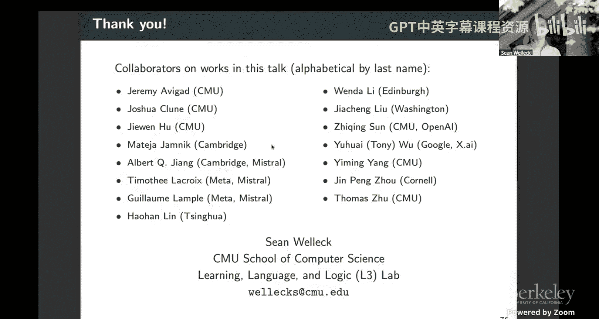

这些方向共同致力于利用AI的力量，在数学推理的严谨性与人类直觉的灵活性之间架起桥梁。