# 11：数学与科学发现中的LLM智能体 🧠

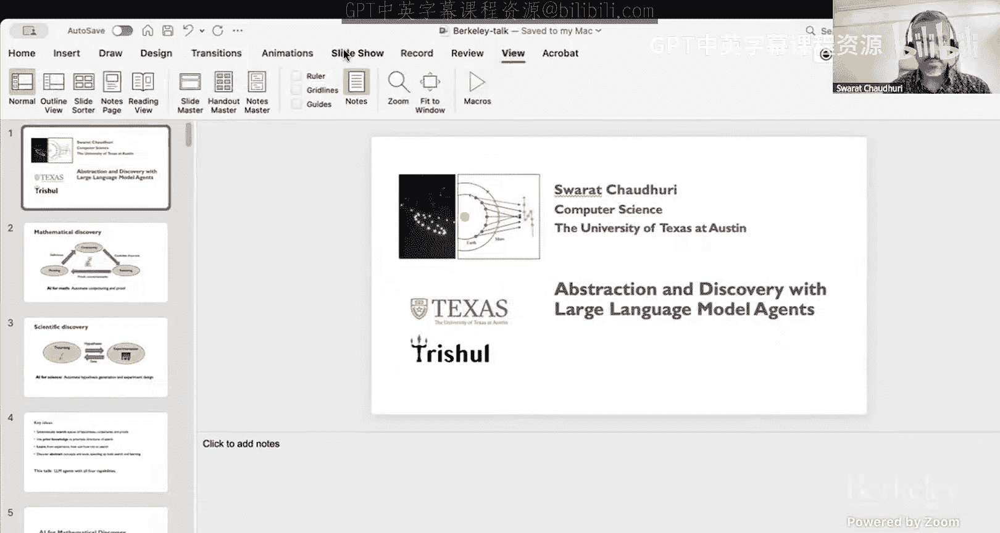

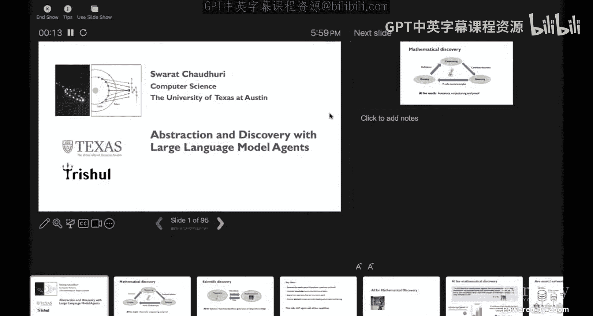

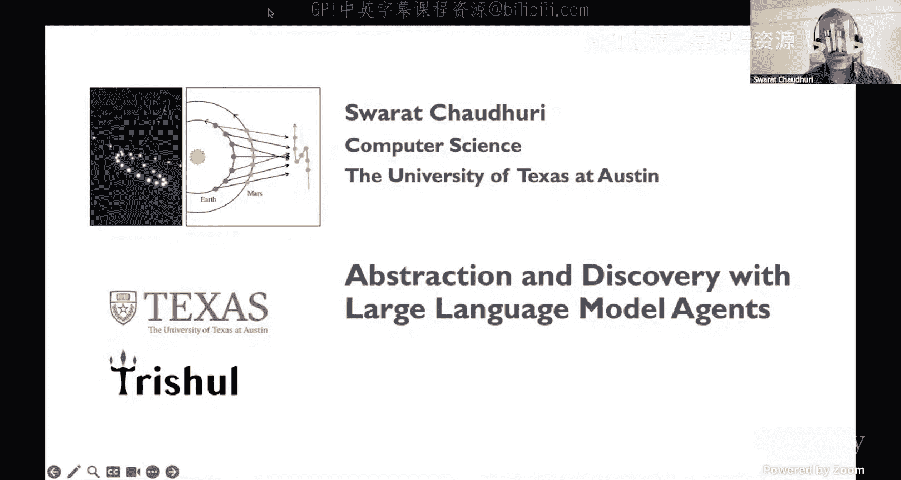

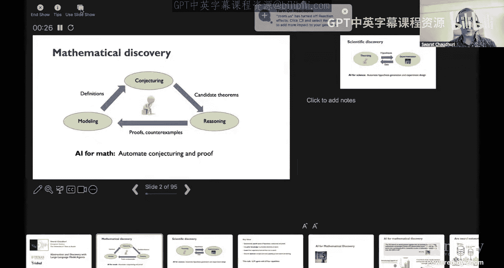

在本节课中，我们将学习如何利用大语言模型智能体来加速数学和科学发现的过程。我们将探讨LLM如何作为工具，帮助发现抽象概念、生成假设、进行形式化推理，并最终推动新知识的产生。

---

## 概述

数学和科学发现是人类智慧的巅峰挑战。传统上，这些过程依赖于人类的直觉、协作和漫长的试错。然而，大语言模型的出现为自动化部分发现过程带来了新的可能性。本节课将分为两部分：首先，我们将探讨LLM智能体在**数学发现**中的应用，特别是形式化定理证明；其次，我们将转向**科学发现**，看看LLM如何通过符号回归和概念抽象来从数据中推导出新定律。

---

## 第一部分：AI 用于数学发现 🔢

上一节我们概述了课程内容，本节中我们来看看LLM如何应用于严谨的数学推理领域。

数学发现的过程通常包括：建模现实现象、提出猜想、进行严谨证明，并通过社会协作进行验证。AI的目标是自动化这个过程中的重要环节。

### 核心挑战与LLM的潜力

纯粹的、仅基于神经网络的LLM方法在数学推理上存在根本弱点：
1.  **数据稀缺性**：超出高中或竞赛水平的高质量数学推理轨迹数据难以获取。
2.  **验证困难**：自然语言推理难以自动验证其正确性，这在安全关键场景中尤为致命。

因此，一个强大的替代策略是结合**形式化证明**（如使用Lean、Coq等证明辅助工具）与LLM智能体。

### 形式化证明与LLM智能体

形式化证明将数学陈述和证明过程编码为可被计算机检查和执行的代码。其核心是一个状态机：
*   **状态**：包含当前需要证明的目标（`goal`）和已有的假设（`hypotheses`）。
*   **动作**：称为“策略”（`tactics`），是用于简化或转换证明状态的规则。
*   **过程**：智能体的目标是找到一系列策略，将初始证明状态转化为无待证目标的状态（即完成证明，`QED`）。

一个简单的定理 `even x → even (x^2)` 在Lean中的证明状态变化示例如下：
初始状态：`x : ℕ ⊢ even (x^2)`
应用策略 `intro h` 后：`x : ℕ, h : even x ⊢ even (x^2)`
... 最终达到 `QED`。

### CoRA 系统：一个LLM证明智能体

我们介绍一个名为 **CoRA** 的系统，它体现了LLM智能体与证明辅助器交互的威力。

CoRA的工作流程如下：
1.  **提示构建**：将当前形式化的证明状态、历史步骤和可能的错误反馈整合进提示。
2.  **LLM预测**：前沿LLM（如GPT-4）根据提示预测下一个应使用的策略。
3.  **策略执行与验证**：系统在证明环境（如Lean）中执行该策略。
4.  **反馈循环**：如果策略无效或证明未完成，证明器会生成错误信息。该信息被反馈给LLM，用于调整后续预测，系统可能进行回溯。
5.  **检索增强**：系统还可以从引理数据库中检索相关引理，并加入提示以辅助证明。

这种“在上下文中学习”的智能体方法优势明显：它直接利用LLM的进步，能融合自然语言与形式语言推理，并且即使没有特定训练问题集也能工作，因为它利用了LLM内嵌的广泛知识。

### 超越逐步证明：分层与抽象

CoRA的核心能力可以通过提示工程得到极大扩展，展示出LLM智能体的灵活性。例如，面对一个IMO级别的数论问题，我们可以引导系统进行**分层推理**：

1.  **非正式规划**：首先让LLM生成一个非正式的、分步的证明计划。
2.  **形式化子目标分解**：基于非正式计划，让LLM将原始的形式化定理分解为一系列更简单的形式化子目标（引理）。
3.  **逐个击破**：使用基础的CoRA智能体去证明每一个子目标。
4.  **组合完成**：最后，将已证明的子目标和非正式计划作为上下文，让CoRA完成整个定理的证明。

这种方法的关键在于，LLM被用来进行**高层级的抽象和规划**，将复杂问题分解，而底层的、与证明器交互的智能体则负责解决分解后的具体任务。这种“抽象-细化”的模式是LLM智能体强大威力的体现。

### 应用实例：形式化验证

同样的方法可以应用于**形式化系统验证**，这是数学推理最实用的应用之一。例如，验证一个简单编译器的正确性。
我们定义：
*   **源语言**：一个简单的算术表达式语言（如 `e ::= Const n | BinOp op e1 e2`）。
*   **目标语言**：一个基于栈的指令列表。
*   **编译器**：将源语言表达式映射到目标语言指令序列的函数。
*   **正确性定理**：对于所有源程序 `e`，编译后执行的结果与直接解释执行 `e` 的结果相同。

直接证明这个定理可能很困难。我们可以再次利用LLM智能体：
1.  让LLM**发明一个关键的中间引理**（例如，关于编译单条指令的正确性）。
2.  用CoRA证明这个更简单的引理。
3.  将已证明的引理作为已知条件，再让CoRA证明原始的编译器正确性定理。

这展示了如何将LLM的抽象概念生成能力与形式化验证的严谨性结合，以解决实际问题。

---

## 第二部分：AI 用于科学发现 🔬

上一节我们探讨了LLM在演绎性数学推理中的作用，本节我们来看看它们在归纳性的科学发现中如何大放异彩。

科学发现过程包括：选择研究问题、生成假设、实验设计、数据收集、分析解释。我们将聚焦于**符号回归**问题：如何从实验观测数据中自动发现潜在的数学方程（例如，从行星运动数据中发现开普勒定律）。

### 传统方法与LLM的机遇

传统方法如**遗传编程**（GP）通过维护一个候选方程种群，进行随机的变异和交叉，并用拟合度函数评估，来进化出拟合数据的方程。LLM的加入可以改变这个游戏规则：
*   **背景知识**：LLM编码了大量的科学先验知识，可以引导搜索方向，而不仅仅是随机扰动。
*   **概念抽象**：LLM能够识别和描述方程背后的高级概念（如“幂律”、“正弦振荡”），并利用这些概念进行更有意义的“突变”。

### LASER 系统：基于概念抽象的符号回归

我们介绍 **LASER** 系统，它实现了**贝叶斯概念学习**，联合推断解释数据的程序（方程）和这些程序所代表的高级概念。

其核心是建模以下联合分布：
`P(π, C | D) ∝ P(D | π) * P(π | C) * P(C)`
其中：
*   `π` 是假设（程序/方程）。
*   `C` 是概念（自然语言描述）。
*   `D` 是观测数据。
*   `P(D | π)` 是假设的似然（通过执行程序 `π` 计算与数据的匹配度）。
*   `P(π | C)` 是概念下假设的似然（LLM评估程序 `π` 在多大程度上体现了概念 `C`）。
*   `P(C)` 是概念的先验（LLM基于科学文献知识判断概念 `C` 的合理性）。

LASER 的工作流程是一个进化循环，包含两个交织的阶段：

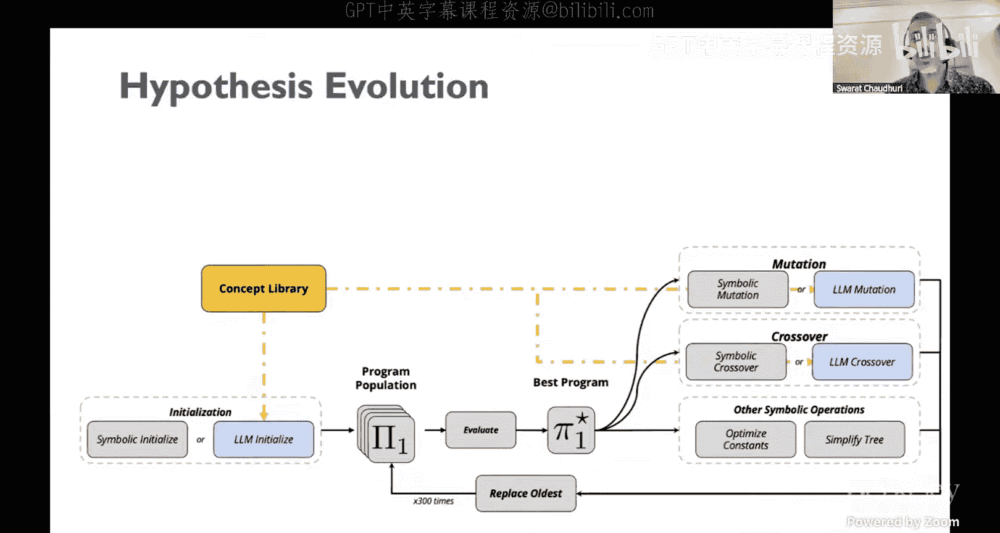

以下是假设进化阶段：
1.  **初始化**：随机生成或基于提示生成初始程序种群。
2.  **评估**：计算每个程序对数据的拟合度（`P(D | π)`）。
3.  **进化**：选择优秀个体，进行**LLM引导的变异/交叉**。LLM会根据当前的概念库 `C` 来修改或组合程序，使其更符合某些有希望的概念。
4.  **迭代**：重复评估和进化，更新种群。

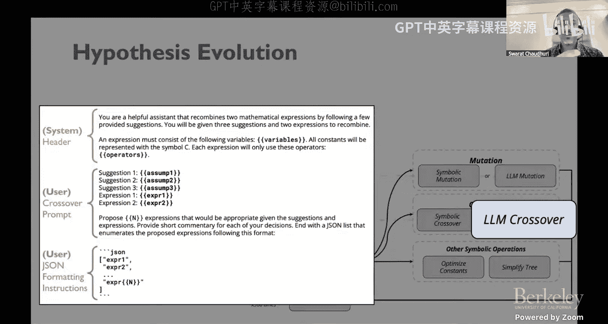

以下是概念库进化阶段：
1.  **抽象**：从当前优秀的程序种群中，让LLM生成描述它们的高级自然语言概念。
2.  **进化**：让LLM对这些概念进行组合、推理，产生新的、可能更精炼或更通用的概念。
3.  **更新概念库**：用新概念更新概念库，进而影响下一轮的假设进化。

### 效果与发现

实验表明，LASER 在发现物理定律基准上优于纯遗传编程方法。引入概念抽象加速了发现过程。此外，系统能自然融入**人类专家提示**（如“寻找与距离成反比的定律”），进一步提升性能。

更令人兴奋的是，LASER 被用于一个**新的科学发现**：推导大语言模型的缩放定律。在给定模型规模、训练数据量等参数及其对应损失的数据集上，LASER 自动发现了一个将“上下文示例数量”（shots）纳入考量的新缩放定律形式。将这个新见解与已知的 Chinchilla 定律结合，得到了预测性能更好的混合定律。这体现了人机协作发现的力量。

---

## 总结与展望 🚀

本节课中我们一起学习了LLM智能体在数学和科学发现中的前沿应用。

在数学方面，我们看到了**形式化证明助理与LLM智能体的结合**如何通过可验证的推理、反馈循环和分层抽象，解决复杂的定理证明问题。在科学方面，我们探讨了**LLM引导的进化算法**如何利用概念抽象和先验知识，从数据中自动发现可解释的数学定律。

这些方法的核心在于将LLM的**知识存储、语言理解和抽象能力**，与传统的**符号操作、搜索算法和严谨验证框架**相结合。未来，我们有望看到LLM智能体在更广泛的领域（如自动化实验设计、跨学科发现）发挥更大作用，并最终与人类科学家协同，开启一个加速发现的新时代。

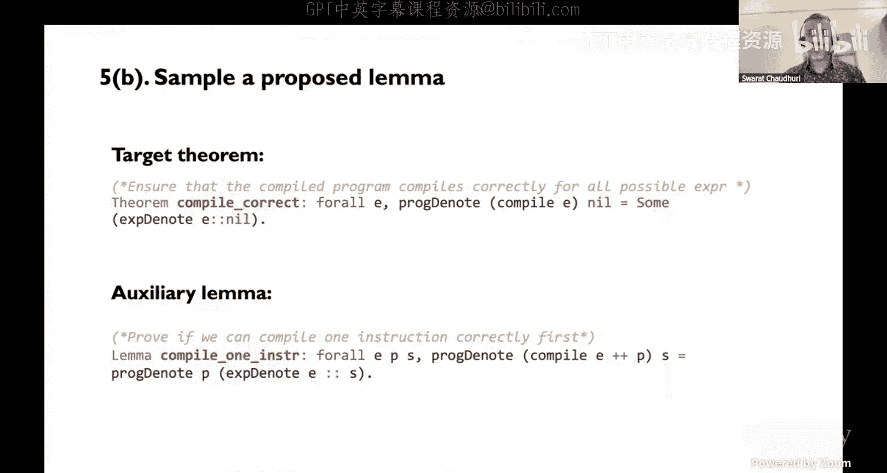

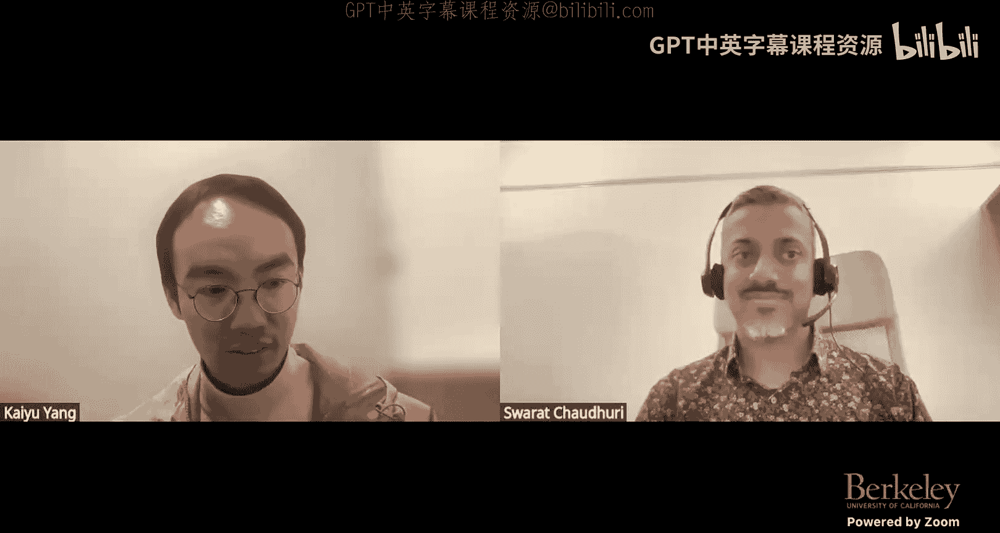

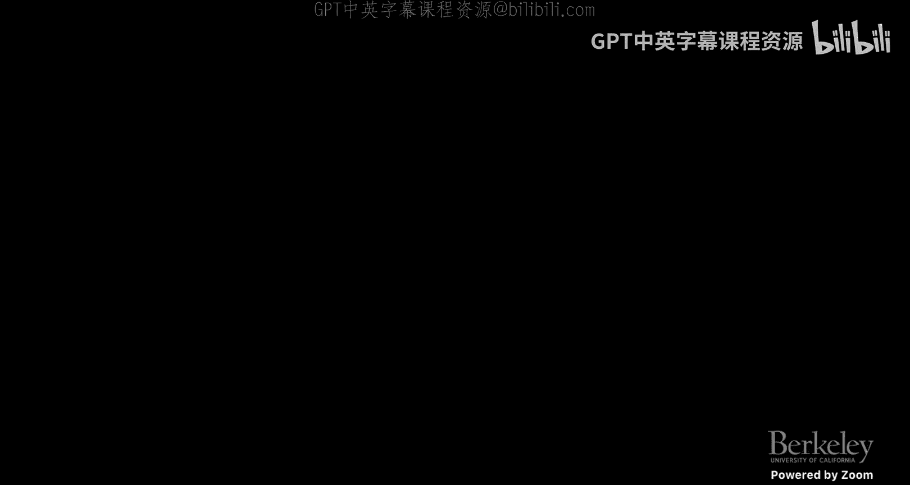

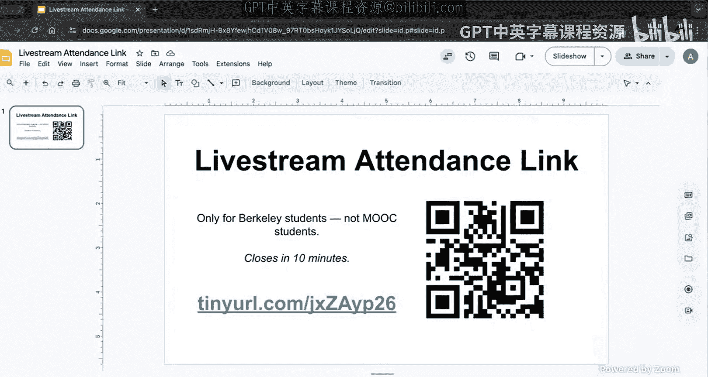

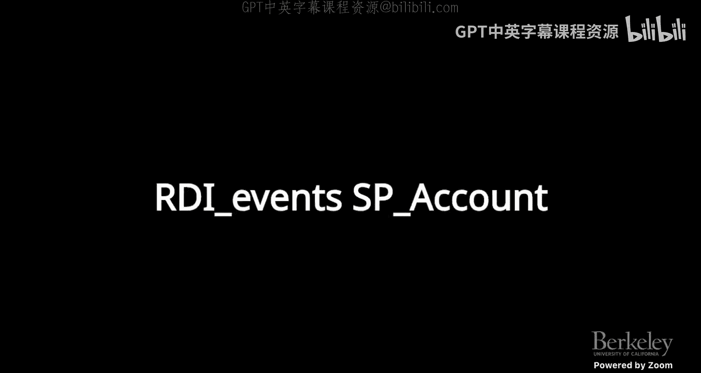

---
*感谢 Swarat Chaudhuri 教授的精彩演讲。*