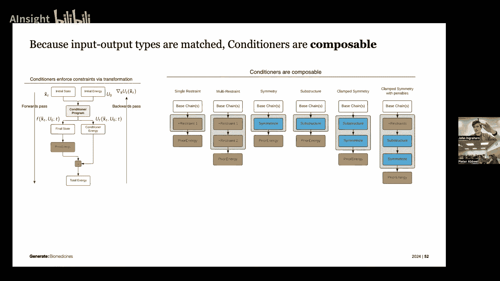
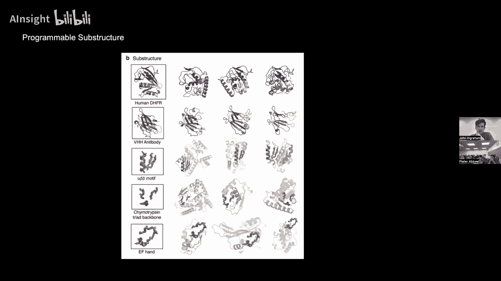
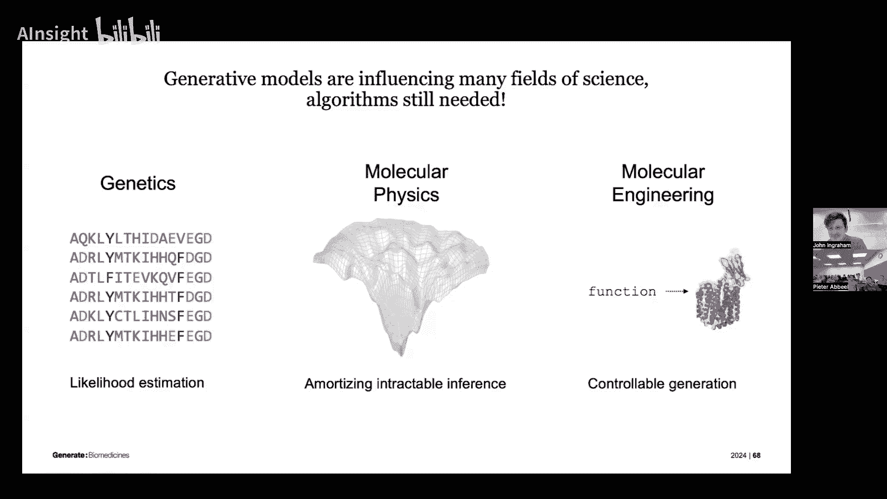
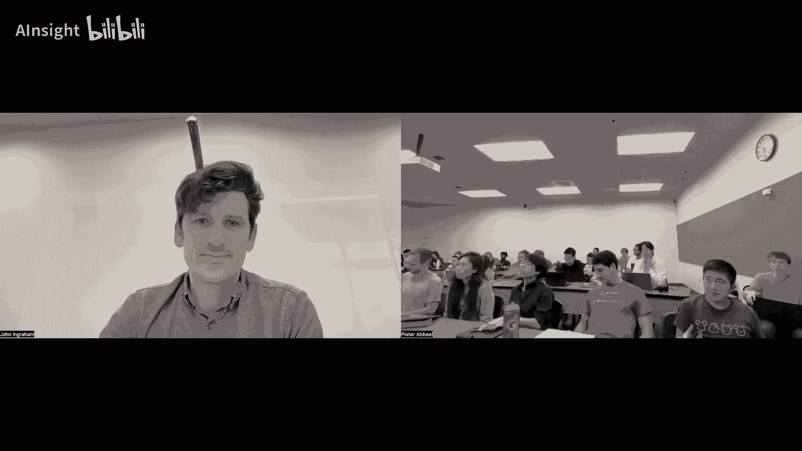

# P11：13a 科学生成模型 - AInsight - BV17W421P7QA

很好，感谢您的，亲切介绍，我会尝试，您知道，如果有人想要提问，我们正在，既然我们有时间，例如，请随意提问，随着我们的进展，我会说，能够在这个课堂上展示真的很酷，特别是因为我猜当我还在成长的时候。

嗯或者我的意思是，我记得在研究生院，生成模型在当时是一种比较边缘化的东西，我的意思是，当然它们有其原理性的应用，而且，如果你认真对待，你会做与行业相关的事情，监督学习，当然。

我们已经看到了这种逆转的完全情况，而且过去的几年里，我的意思是，它触及了一切，现在甚至你知道，整个社会，所以当被要求谈论科学时，就像是一项令人望而生畏的任务，甚至连想都不敢想。

我相信如果你们中有人走向，嗯，你的勇气或我ml或我清晰，或者任何工作坊，有很多像这样的，你知道，AI或者什么，嗯可能涉及到很多东西，所以，嗯今天我要尝试专注于这个角色，生成模型有，并且有一些，你知道。

它们的方面，它们是，它们正在采用概率方法，它们给你提供分布来处理，这在科学界确实扮演着重要角色，所以这只是一些这方面的例子，你知道，当然，我们试图在复杂的物理系统中传播不确定性，例如。

我认为这大约一个月前才发布，但这就像是一种自我提升的过程，这些，像神经的，全天候预测器，带有扩散和动力的，一种团队思考的预测方法，因为你知道混乱是这些系统中固有的一部分，嗯。

很高兴你在这次演讲之后紧接着有一个关于Ben的讨论，嗯整个，我的意思是，我觉得我可能看到了在类似NERF世界的东西，因为NERF和重建有一些极其相关的应用，物理学中的反向问题，实际上可以解决结构。

现在可以拍摄到结构，甚至到原子的宽度，所以这就是分子版的NERF，那里有很多非常酷的发展，当然在，像理论和嗯，处于理论物理学的边缘，接近高能粒子物理学，存在这些角色。

我们如何拥有强大的推理机器来检测微妙的统计异常，当我们在科学理论的边缘进行推理时，嗯，然后您知道，我的意思是，我猜在湾的对面，有新的尝试，例如，如果我们真的，嗯。

仅使用大规模生成模型就足以驱动强大的代理，如LMS或其后代，嗯，金，我们能让生成模型为我们做科学吗，也许这会使整个谈话变得无关紧要和过时，非常快，但是嗯，我今天不会谈论这些，所以但你知道你可以。

我永远都会推荐你参加，嗯，无论哪个工作坊与这些相关，在你参加机器学习会议时，嗯但我要谈谈嗯，三个不同的区域，让我们说，就在几个领域的交叉点，你知道，剧透，它们全都与蛋白质有关，然而。

我认为蛋白质之所以如此受欢迎，有以下几个原因，这是因为他们每个人都有一些东西，从方法论上讲，你知道，有一种愿景愿景人士，NLP人士，结构化预测人士，嗯，概率建模和贝叶斯人士。

所有这些工具和蛋白质的数据存在原因，但然后具体来说，让我们说在生成模型的领域，有特定的算法考虑，实际上还有很多算法工作需要做，我认为为了推动所有这些问题，这是我今天想要与你专注于这三个原因，嗯。

只是想要说，你知道，Scing很重要，我们都得规模化，我们都在试图找出如何规模化，但也有真的很有趣的，我认为方法论考虑，嗯，你真的可以影响，嗯，科学，所以让我们开始，首先，嗯，一件事总是处于边缘。

并且你知道，尤其是这些天当人们想到生成，AI时，他们想到，你知道，请求某物，获取对象，生成东西，生成行动，生成视频，嗯，但我们也正在学习世界的密度模型，有趣的是在科学领域，有区域哪里就是密度模型本身。

在我们的自然描述中一直逃避我们，并且实际上可以帮助我们看见之前无法看见的事情，嗯，是种可以帮助我们见见之前无法看见的事情，所以我首先会谈论基因学，好的，所以这里是第一个问题，嗯，我们有，嗯。

我们拥有相当出色的阅读和书写基因组及DNA的能力，嗯，比很久以前我们拥有的能力要强得多，正如你们可能已经听说的那样，我的意思是，这是一个变量，但是就像我们所有人都在序列化政府一样，并且有许多基因组。

英国生物库一直是领导者，他们种类，嗯，这是一个旧出版物，但是嗯，我们真的达到了点，我们很快就会有数百万的基因组，当你看遍所有这些数百万的基因组时，你知道，你所认识的每个人身上都有，顺序上的，我不知道。

大约四十，三十到五十个左右，你知道，突变在你成为某人时就发生了，嗯，你知道，几乎被带到这个世界，当你把所有这些都加起来，每个人身上，会有无数的突变发生，我们对这些突变如何解读一无所知，有时候。

这些突变是地球上从未发生过的事情，或者非常罕见，我们几乎不知道如何分类，哪些突变只是噪音，我们几乎不知道如何分类，哪些突变只是噪音，它们中哪些可能实际上是我们需要解决的问题，同时。

我们也有了新的能力来解决一些遗传问题，所以我意思是在伯克利说的，像你的，当然像其中一个中心的，你知道，基因编辑革命，CRISPR革命，也发生了巨大的进步，可以说是合成dna的能力，并且。

有了这种阅读和写DNA的能力，所以，大问题是，你实际上如何使用它，以及我们看到在世界上的遗传变异意味着什么，实际上，这相当困难，所以啊，你可以开始做像人们发明的高通量实验那样事情，这些实验将，让我们说。

允许你在试管中，制造一些这些突变，只需要将它们放入细胞或蛋白质中，某种模型系统，看看哪些在做坏事，然后我们可以像优先考虑那些疾病一样处理它们，但这非常慢，并没有真正解决，让我们说，数十亿。

对于数十亿级别的变异，它们有些恼火，有趣的是，在数十亿级别上实际上，你知道，更像是数十亿规模的，就像是我们已经对这些基因组进行了测序，我们有这个令人惊叹的遗传信息库，从地球上的所有生命，嗯。

这就是概率发挥作用的地方，所以，事实证明，我们有所有这些数据，我们真的不知道，你知道的，嗯，我们人类并没有设计这个数据，它更像是通过进化过程产生的，它非常非标识性，它内部有许多复杂的结构，嗯。

但我们知道的一件事是，今天周围的事物，蛋白质，DNA，嗯，我们看到的序列是那些生存下来的，因此，从某种意义上说，你知道，突变在生命过程中不断产生，但是，它们也在破坏东西时被过滤掉，嗯，或者就是嗯。

也有一种放大效应，如果它们能为某种优势服务，所以嗯，而且，你知道，你可以眯起眼睛，这不应该工作的原因有很多，存在一些原因和类似政权，你可以证明，实际上这里有一种更深层次的联系，但大致而言，嗯。

如果你想象一下，变异以一种大致均匀随机的方式产生，那么这背后的一个含义是，今天存在的序列分布实际上告诉我们那些历史选择性压力是什么，因此我们可以从这些数据中看出，这些蛋白质应该做什么。

以及它们试图避免做什么，并给我们提供这种，你知道的，解释地球上所有DNA的另一个维度，所以这实际上是非常直接的统计学，但我们将，你知道的，利用深度生成模型来增强它，嗯，我们收集了大量数据，嗯。

实际上可以非常多变，所以这里我展示的是可以表示为序列的蛋白质，假设这些数据的典型大小是，嗯对于，假设你听说过血红蛋白，你知道我们有，但鸟类有一种鱼类，有一种它，它帮助移动氧气，在我们的循环系统中。

它存在很长时间了，它的工作并没有真正改变，因此有很多版本的它，这并不是真正的血红蛋白，我认为它是核心代谢酶，嗯，当你看，即使你只拿这些序列，假设你只对齐它们，这是并不是大数据，这是少量数据，你对齐它们。

也许有几千，也许有几千到数万，有序列，假设在，你知道，一百到五百个氨基酸长在这个二十字母字母表上，嗯并且像第一个你可以问的是，我们能不能试着喜欢生物学家们最初开始序列时注意到的东西，DNA。

假设四十年前是当你们把它们排成一行的时候，眼睛可以看到明显的模式，所以当我开始染色，这些氨基酸时，你可以看到像，哦，这些粉红色的列，这些蓝色的列，这些与啊有关，你知道，它们的物理化学性质，就像你是。

你在精神上构建一种统计模型，类似于，这里的约束是什么，所以问题就是我们还能选择什么，所以这里的游戏非常简单，我们只是拟合密度模型，看看他们告诉我们什么，好的，所以，收集数据，学习一些密度模型，然后。

我们就可以推理出游戏规则的规则，仅仅通过看似然比，就可以看到自然选择的压力，好的，所以，就像我说的，你知道在你的，嗯，在你的脑海中，你可能通过眼睛一直在做，实际上是在收集这些对齐的数据，然后精神上看到。

我看到的是什么，有点像某种特定的位置，你知道的，像嗯，那里使用了偏倚的词汇，嗯，当我们谈论的时候，你知道的，在深度学习之前，你知道的，每个人都热爱他们的图形模型，贝叶斯，网络和标记随机场，嗯。

这有点像第一步，当你想象我有种站点级别的因素，我下一步可以走的方式，例如，比如对偶因素，所以这些就像种，嗯，多字母版本的这些有时在物理学中被称为Potts模型，你可以看看那样的东西。

但我们今天都在讨论的当然是深度生成模型，嗯，就像什么一样，也许最简单的事情，这是像时光倒流一样，嗯，你知道，在Vae时代的日子，嗯，甚至只是某种非常简单的，让我们说，MLP风格的，如果这些数据对齐。

没有结构，就像MLP一样，嗯，VAE嗯，只是试图建模模式，你可以，你可以，嗯，尝试捕捉这些变异因素，使用明显的因素并进行系统推理，酷的事情，这已经存在，我不知道，就像六七年了，嗯。

人们获得了我之前提到的能力，能够在实验室中进行大量的突变，嗯，在实验室中，测量它们，它们可以制作这些地图，这是实际上一个在硅中预测的地图，但实验地图看起来相当相似，我们实际上在所有的蛋白质序列位置。

在局部的，你知道，一个突变邻居域，评估所有可能的突变，你想要看到像，哦，看，这部分蛋白质，如果我如果突变它，它，它立即彻底摧毁它，然后有部分对突变非常容忍，蓝色不好，深蓝色不好，非常酷的事情。

我第一次看到这时，感觉有点疯狂，因为这不像，训练一个基础模型并进行微调，或者进行无监督学习并进行微调，这实际上只是像，我们只是拟合一个密度模型进化，这能做到这一点吗。

原始似然度与现实世界中发生的事情有任何关系吗，它们实际上做得相当不错，因此你可以简单地取在实验室中发生的x，当人们对所有蛋白质的突变进行测试时，将它们与原始对数似然度或对数，你知道，对数似然度比，嗯。

并得到这些种类的惊人对应关系，就像，你知道，解释超过半数的变异，有时甚至在这些实验数据中，嗯，这实际上相当疯狂，因为在许多方案中我们可以这样做，跨越完全不同的蛋白质，它们的功能完全不同，你知道。

一个可能是酶，它的工作是催化某种反应，另一个可能是结构蛋白质，它的职责是绑定某物并保持稳定，但这些不同的功能，但令人感兴趣的是，就像我们只是模型化，我们构建这个生成模型，试图捕捉。

地球上的进化生成器是什么，所以，这告诉你的是历史上被选择的是什么，因此功能就是蛋白质被选择去做的事情，因此的压力，许多的实验，或者至少五年前这是大量的实验，你可以看到完全非监督的预测突变效应，嗯。

所以它是零射击啊，取决于如何理解这一点，它们有点不同，有不同的解释，但嗯，这相当酷在，你可以简单地取原始对数似然度，并与现实中的物理世界建立联系，由于它与进化的联系，嗯，在点上，嗯，虽然。

不过有一个问题，所以，我的意思是，如果你看到这一点，这是旧闻，第一件事是，这是第一件事，好的，嗯，这里有这个，世界上有说数百万或数十亿的蛋白质序列，取决于你如何计数，我应该训练一个非常非常大的语言模型。

在某种程度上是关于蛋白质的，然后这将回答所有这些问题，然后我们转移到另一个主题，嗯，在这一点上已经认识到的一件事是，有时围绕任何一个蛋白质家族的数据都非常狭窄，这对我们来说是一个惊喜，因为很多时候。

变分贝斯像是一种在会议中做数学论文的酷方法，但可能不太经常进入，一种真正引领实际性能的方法，但我们发现这很有趣，就像我认为只是因为数据可能非常小，你知道，有时候只有几千个序列而已。

实际上做双重变分 v 在这里实际上是重要的，嗯，所以我的意思是，就像你差不多，你知道，vais，也许它们今天最相关，而且他们差不多是，嗯，你知道，特殊情况或扩散模型的先驱，但是嗯，嗯。

我们通常在做变分推理在潜在因素上，但你也可以，而且我认为这在原始的，你知道，嗯，King ian论文，你也可以非常双重地做变分，你可以在权重上同时做变分，你知道，甚至只是使用像均值场后验，嗯。

大概这些和这些贝叶斯vs，不知道为什么，人们无法踢他们，嗯，然后我提到了lm想法，会发生什么，让我们放大，让我们构建整个蛋白质宇宙的密度模型，我们能建立联系吗，好消息是，你知道。

So meta did some really nice work，Kind of leading this，Like building these models，Also salesforce。

This was like the era of kind of of tech of that，Doesn't have do protein stuff。

Like doing protein stuff，Um uh，The kind of really nice work on on both of these here。

Um and interestingly what we found，Uh or so i'm not involved in in any of this work，But um，Uh。

What the field at large has found is kind of，We still can't shake these，These weird，You know。

Regularized one family at a time，Models performance wise，Um um，So okay，What are we showing you here。

We've got the kind of classic way where you just say，I'm going to take one protein。

I'll go collect its homologues and uh build an alignment of them。

And then just build one of these really local density models with，Like an mlp decoder，Very boring。

Very underpowered thing，But we can't，We can't have，That's what these methods are here。

But when we kind of scale it up，Do it on the whole genome，A human genome，Uh，It's still frequently。

Especially when the local data are strong，Actually kind of the method that's hard to beat。

And then even these are all，You know，They're not，They're so pretty big，These are like，You know。

Maybe six hundred seven hundred million parameter lms trained on。

You know a hundred to two hundred and fifty million protein sequences that were like pretty non redundant。

But it was like i think it，It might just say that the，The details of evolution。

并且每个家族内部的选择压力是如此详细和特定于那个家族，实际上，你的这种方法并没有共享太多的统计力量，而且，通过训练在所有其他序列上，我们也对它们有了太多的了解，因此，在某种程度上。

你的蛋白质语言模型就像它现在有的那样好，就像，实际上，它已经记住了或获得了那个特定家族的统计信息，恰好那个家族在那里，嗯，甚至在lm侧，嗯，最纯粹的方法，至少在过去的几年里，lm。

仍然实际上在寻找你需要从数据中拉出的信息，他们采取了这种推理时间检索方法，所以，就像一个训练在所有蛋白质上的lm一样，但在测试时间，当我们试图计算东西时，我们仍然会拉入一个局部家族的msa。

然后我们只做一些非常简单的事情，这不是复杂的检索东西，但只是像混合在局部第一阶频率中的那样，将它们添加到我们的似然估计中，并仍然以这种方式引入本地数据，这就是这种方法，在某种意义上，一直是这种方法，嗯。

在某种程度上，这种方法一直是被采用的，所以，我为什么要说所有这些，哦，然后你知道，我们为什么关心这个，为什么这个值得，你知道，这个谈话的第一部分，嗯，实际上，这已经非常有帮助了，所以像，嗯，在遗传学中。

有一个整个世界，有人去诊所，他们像得到基因组序列一样，他们有一些罕见的疾病，医生们正在努力帮助他们导航，像什么坏了，他们必须，我们必须使用计算工具来预筛选，像哪些突变看起来，它们是坏的。

这些是导致问题的主要因素，在这里留下了尖端的矛头，实际上这个非常简单，就像训练一样，一种是基于贝叶斯VAE的家庭级方法，这有点超出常规，嗯，而且，但我认为这实际上是一个事实，那就是，我们仍然无法逃避。

这种，局部数据强度实际上是一种，这是一个有趣的问题，这使它看起来像是有更多的算法和方法在这里工作，以及规模问题，嗯，有几种，一些未来方向，嗯，就像你可能最近看到的那样。

可能你会看到一篇关于最近一个大想法的帖子，我们是否可以做一些基础模型，整个基因组，训练，假设像LMS这样的东西，不仅仅是这些蛋白质一个接一个，所以你知道的蛋白质或序列只是短，小片段和基因组。

如果我们只获得长上下文，实际上在这个方法中，他们没有使用Transformer，他们使用一些Hyena的东西，嗯和衍生品，但我们使用长上下文自回归模型，并简单地将整个基因组从尽可能多的生物体中推入，嗯。

可能不是令人惊讶的是，第一个出来的并不是特别接近，专门针对蛋白质的模型，嗯，但你知道的，他们正在接近，所以这是一个值得关注的空间，嗯，你可能已经听说过AlphaFold，嗯，我认为能够关闭差距。

并将这些数据与结构连接起来，并提供额外的解释层次是另一个，另一个，嗯，一种主要的方向，人们正在思考的，嗯，但那是刚刚的第一部分，我只想说，似然度，估计仍然有时具有一种伟大的价值。

如果你可以获得更好的似然度估计方法，嗯，它们确实，嗯，影响我们理解遗传学的能力，好的，第二个领域，嗯，嗯，这实际上是另一个问题，嗯，如果我们回到过去，就像生成模型一直处于这种非常有趣的。

生成模型的研究领域一直处于这种非常有趣的探索中，寻找既灵活又可处理的模型，嗨，约翰，稍等一下，请，因为你已经完成了第一部分，对，也许你可以提一些关于第一部分的问题，我的问题，你看到前方有哪些大机遇。

有哪些缺失的拼图，也许值得思考哪些工作，哦，是的，我的意思是，我认为，我将这个最后一个领域视为，嗯，这是一个，所以，如果我们，如果我们思考基因组工作，所以，我们目前处于一种，一个蛋白质，一个基因。

但生物学的大部分是通过基因的相互作用来理解的，并且，嗯，这些相互作用实际上在基因组中编码，但到目前为止，我们的建模努力并没有真正揭示这一点，即使当AlphaFold构建这些数据库。

计算所有成熟蛋白质的结构，通常只处理一个蛋白质，而不是，但即使大多数时候，许多蛋白质会组装成这些复杂的复合体，形成一个整体的分子机器，所以我会说，极大地扩展基因组，考虑相互作用感觉是近期的前沿，并且。

这些是否它们有自然数据集来工作，或者这需要在实践中发明，这更像是你必须去解决数据问题，确实有一些，你必须去获取和解决数据问题，有数据，大量的数据，我的意思是，这些从事基因组基础模型。

这些人从主流生物医学数据库中抓取了大量数据，我不会说，这些，没有类似的，让我们假设像imagenet一样，或者差不多准备好的，像准备好攻击一样，所以你可以开始看这些论文和他们准备的数据，嗯。

作为一个起点，我明白了，是的，我的意思是，当然，如果你们有任何其他问题关于这个，嗯，可能不会再回到基因组学部分，现在的问题，还有人吗，想等到最后再说吗，好的，哦，这里有一个问题在前面，是的，如果你做像。

嗯，如果你做下一个标记或下一个序列，基因预测，是否有常见的模式，嗯，好吧，我不会确保我理解了，所以问题是关于下一个标记的预测，所以这些序列，这些在这里要转录的，像这些，尤其是essm和交易。

本质上是自回归语言模型风格，都是基于transformer的蛋白质内部，所以只是预测下一个字母，然后这个是，除了整个基因组的规模外，所以你，嗯，你不，你不，只是，你只是通过一个蛋白质。

然后你就一直预测dna，所以你预测的不仅仅是蛋白质，还包括坐在蛋白质旁边的调节元素，坐在蛋白质之间的DNA，嗯，编码区域和所有这一切，嗯，至于他们捕捉的模式，真的很酷，嗯，蛋白质的。

如果你看他们的注意力图，基本上是一种完全无监督的，而且只是什么逐渐显现出来，基本上是三维结构，所以联系只是在注意力图中出现，嗯，这已经被像几次几次一样记录下来，用不同的不同模型和努力。

它似乎就是种高效的方式来建模，数据的相关结构可能会是某种样的，你知道，关注到适当的本地依赖性，嗯然后像，我可能是的，这种模式的模式有很多，这些像基因lm的论文开始探索，那种类型的，你知道是什么引起的。

让我们说一个特定的元素，它是参与调控dna的，就像启动子或增强子出现在蛋白质旁边一样，这就像是一个深深的兔子洞，这还是相当早期的阶段，我认为这个第一个可能更多是一个谨慎的概念，但是。

你可以自己看论文来了解，还有一些更多的，那里的大规模模式，我希望我已经清楚地解释了像，是的，那么这些都是，是的，这些是变压器，仅在这些蛋白质序列上，嗯，这里有一个问题，我想从那个点开始继续，像。

至少在这门课上，像是我们学到的一件事是像生成与同情的重要性，以及像是一个巨大的，是的，这一方面就像当你在这些序列上进行计算时，有没有像你只是计算这些的，比如所有的蛋白质序列，或者是任何形式的。

比如你试图做的，比如某种类型的分词，这可能会使这些序列大大缩短或更有效，是的，生成或动物园，是的，研究时间和超级超级有趣，这是一个非常重要的问题，而且我总觉得，人们一直在努力尝试使令牌化发挥作用。

我认为肯定有一种不那么明显的，我们通常在自然语言令牌化中看到的典型结构，我们往往关心令牌级别的编辑，例如，如果改变这个字母，那么这种领域真的难以跳入，嗯，就像构建，就像，就像一个字节对编码。

或者也许是变量长度，他们，你懂得，但是但它确实感觉像，也许我们没有榨干所有的汁液，嗯，并且那种类型的更多，嗯，那种类型的更多可以被做到那里，我不知道，我不知道，知道一篇论文，研究了它，嗯，结论性的。

但一个非常有趣的问题，谢谢约翰，让我们继续，棒极了，棒极了，我想确保你知道结束，最后一部分是典型的，我们希望生成模型能够生成复杂的对象，嗯嗯种类的按需求，嗯所以我想要，你懂得，确保我们到达那里，嗯。

但我认为这只是一种可能性，它有时候感觉像是一种学术追求，当我们构建概率生成模型时，所以看到它有应用很有趣，所以这个中间的也是一个类别，这也是我将说一个甚至更新兴的领域，但是嗯，我认为所以。

有一种有趣的挑战正如你，浏览所有不同的深度生成建模方法，我们正在尝试寻找能够平衡各种特性的模型。这些特性包括表达性和灵活性。以及可处理性。嗯，总存在一些位于这些特性之间奇怪交叉点的模型。让我们说。

这些模型位于所有这些特性之间的权衡点上。其中之一是能量基模型。它们，你懂的，我知道在过去的几年里，人们对它们进行了重新的研究。举办了几场关于它们的研讨会。但是，有趣的是，像很多他们一样。

他们基本上是基于能量的OG模型，来自物理学，特别是分子物理学，在某种程度上，我们所知的所有关于挑战性的问题，在机器学习中使用基于能量的模型，也都像这个分子物理学问题一样深入地描绘，你知道。

人们一直在问的一些问题，比如，我们可以学习到摊销采样器来攻击，你知道，实际上是不可解的，棘手的分布，实际上是推动这个整个领域前进的关键，所以，这就是一种观点，它有一点偏见，但是嗯，一个有趣的是，就像。

也许就像所有分子物理学的好大一部分实际上就只是一个推断问题，我的意思是推断在像概率图模型这样的意义上，感觉像计算条件和边缘概率分布的，如分布的，不一定像你知道嗯，评估神经网络在GPU上，嗯，所以嗯。

在某种意义上，我想这意味着这里有一个拉伸，因为我们像是在近似我们的量子力学和化学，并且所有那些，但在某种意义上，我们有这些描述物理的描述，基本上说，如果你能真正地看原子，真正地看分子，你真正地看水。

并且基本上一切都非常真实，物理的定律实际上，嗯，或者至少一种经典的近似它们是相当简单的，相当无聊，他们只有一种已知的结构，啊，这有一些简单的交互项，然后实际上，你知道目标就是基本上计算。

从这个中推断东西，嗯，我们有一个明确的能量函数，然后它会诱导一个状态上的分布，这就是玻尔兹曼分布，或者我们熟悉的EBMS，我们像知道的那样，有时候，一个ml或者基本上就是，这就像是一个未归一化的似然度。

嗯，嗯，地区，各州就像一个系统或结构一样，可以很好地适应，只是相互竞争，根据这个对数似然度，通过归一化常数，嗯，但我们知道，嗯，基本上这个设置有点，嗯，在那个可追溯性方面，表达性，灵活性。

这种权衡实际上在角落里，在哪里它极其表达性强，并且经常非常难以追溯，所以采样很困难，嗯，所以也许我们可以像表达，实际上，许多分布，非常简洁且非常有力的东西，例如，比如如果你知道能量函数是。

假设它是一种NP难问题的评估函数，那么从某种意义上说，从如此东西中抽取样本，嗯，某种程度上给了你一个NP难问题的答案，但这可能也意味着，采样可能不是，可能在更深层次上可能是困难的，嗯，好的。

"但是尽管如此，人们仍然试图提出这个问题"，"Well" 在中文中有多种含义，具体取决于上下文。以下是一些常见的翻译："这实际上是一个推理问题吗？"，如果我们花费巨大的代价，是否足够？"你可以这样做"。

让我们假设，如果你曾经是一位建立了私人对冲基金并管理它的基金经理。嗯，"Computer fleet that can like simulate molecular physics ah" 这句话的英语翻译可以是：

"And the extreme scales" 翻译成中文是："和极端的秤"。不过，这句话可能出自某个特定的上下文，如果没有更多的信息，很难确定最准确的翻译。如果是在讨论天平或秤的极端情况。

可能会是指非常重或非常轻的物品。如果是在其他语境中，可能需要更多的信息来准确翻译。"这就是我为何潜水的原因"，国王，研究小组，他们是否构建了定制硬件，这些硬件可以做出这些模拟的荒谬巨大数量的时间步长。

然后你如果这样做，你将带来这种极端的硬件，然后你专注于极其微小的问题，非常小的蛋白质，你可以看到这种物理学确实起作用，它会折叠蛋白质，嗯，但是当你听到实际时间步进在这个中的时候，实际上这是疯狂的。

所以它在做md，如果你不熟悉md，它与动态启动非常相似，或者它有像恒温器一样的东西，但是并不是非常重要，它更像是，你知道，你知道，在做带有噪声的梯度下降，嗯，或者你知道，确定性的噪声东西，嗯，但是嗯。

本质上，嗯，你通常需要用几个飞秒来模拟这些系统，但是像任何有趣的最短时间尺度，像快速折叠的蛋白质在微秒内折叠，然后你知道经常，嗯，我们实际上在生物学中关心的一些事情，像结合事件和有趣的事情。

你知道这个蛋白质翻转到这个位置并做一些其他事情在毫秒内发生，所以即使只是为了模拟折叠的 brute force，像最小的蛋白质，那就是被认为是快速的折叠者，或者微秒折叠者，是四百万时间步，我不知道你。

但是像，如果，你曾经，你 kind of 想，哦，如果我做很多步骤，那就是一百万步，所以嗯，你 know，进入这种 regime 的时候，它是，它是，它是疯狂的，嗯然后像它也是，只是，嗯，嗯。

它实际上会捡起，你知道，从，嗯，你知道，一到三个数量级的额外复杂性，以接近更大的事物，好的，所以所有这些，你知道，分子物理学是一个困难的推理问题，好的，然后像，我们可以进入深度生成模型吗。

它们如何帮助这张图片，几年前的一个起点，这是一个有趣的一个，是摊销采样的一个想法，所以如果我们有一个像是非常困难的分布，我们想要从中抽取样本，嗯，我们可以尝试训练另一个生成模型，作为一种替代者或提议者。

并将它引入到这个分布中，所以在分子物理学的世界里，这就是这个想法，被称为玻尔兹曼生成器，嗯，我不知道你们是否像正常那样覆盖了正则化流，而且，你知道，基于变量变换公式的生成模型。

但是嗯有一种不错的事情是他们，他们让你计算与似然相关的数量，比如熵，或者，和其他相关的事情，分析地，或者至少得到，你知道，或者，嗯一个好，嗯和嗯，那些量的估计者，所以嗯。

基本上这也是与某种蒸馏努力非常相似的，我们熟悉的，所以基本上的想法是我们有这个困难的分布，它就像某种力场，它定义了一些原子坐标的分布，嗯，我们要做的就是，我们将构建一个提案，类似于一种白色的映射。

你知道的，标准化，嗯，嗯，通过可逆网络实现标准正态分布，进入，进入，被占用的状态，嗯，根据这些坐标，然后我们可以用一种概率蒸馏类型的损失来训练这个，所以最小化KL散度，这基本上就是说，嗯。

让你的流当你推你的，高斯通过这个映射，让它变得低能量的东西，同时你最大化熵，你基本上保持了归一化，那么，如果你，嗯，好吧，我们稍后再来讨论这个问题，但是，像训练这些类型的东西通常很烦人，而且有点不稳定。

嗯，那么嗯，在实际应用中，因为它很烦人且有不稳定性，它们不会精确地匹配目标分布，那么，我们可以通过使用重要性权重来大致清理分布，所以，我们可以大致得到实际分布与目标分布的比例，大致上，我们的代理提案是。

然后我们想要计算样本发出的对象任何平均值，我们可以简单地重新加权它们与重要性权重，所以这听起来不错，不幸的是，在这一版的最初版本中，这仍然相当困难，嗯，我的意思是，人们。

我认为当我们第一次看到它时很兴奋，嗯，在实际应用中，它是一种像许多流动模型一样的东西，它在补充材料中有所提及，有更多的挑战如，哦，实际上，甚至要使流动稳定训练，你需要做一些事情，你需要预热，开始时。

可以通过运行模拟来启动，然后，使用一些实际样本与蒸馏损失一起训练，这也意味着你不能像真正的梦想那样喜欢它，我们只是训练一个模型，它从零开始学习折叠蛋白质，只是向它投入大量的计算，我们将从零开始学习它。

但在这里，它不是从零开始学习的，你基本上必须已经知道折叠方式，然后，用它来初始化，通过在这个周围摇晃，我 recently saw one of this kind，像清晰的眼睛提交。

人们继续尝试这一点，他们基本上有一个整节，只是谈论它仍然，你知道，训练流是困难的，嗯，但我想强调这一点，因为我认为这也就是摊薄抽样领域非常令人感兴趣，这非常早期，似乎不太可能只是取当前的事物并放大它们。

所以，如果你知道这种类型的事情任何对你们有兴趣，或者你可能已经在思考它，我认为这里有很多可以做的事情，嗯，如果我们能说从，嗯，从真正允许我们做一些惊人的，事情类型的分子系统，分子设计，有很大的发展空间。

我认为非常酷，类似于，就像我们在生成模型中可能会遇到的蒸馏努力，有更多的工作要做，嗯，所以，嗯，第二次努力，尽管它像，让我们假设我们将成为实用主义者，我们也知道你知道我们确实有好的起点。

我们有像alpha fold和是的这样的东西，Sm fold，那是啊，像它们这样，基本上是非常有效的结构预测器，你知道，实际上你知道结构永远不会静止，你知道，在体内或在试管中，即使它们被冻结了，它们。

它们在由玻尔兹曼分布描述的这种状态分布中摇摆不定，所以像阿尔法折叠，在某种意义上，就像一个模态估计，就像一个点估计，大致上那个分布是什么，所以有一种想法是，当我们思考扩散模型时，我们真正学习的就像。

现代扩散模型往往被简化为回归问题，对，我们希望学习一种后验最优的去噪器，展示给我一些噪信号，一种噪声状态，嗯，在这条轨迹的某个地方给我一个估计器，嗯，从A点到B点，平均来说，什么东西会被产生。

从后验平均意义上说，所以嗯，好的是像，如果你已经有了一个模型，那就是试图成为一个估计你即将到达位置的点估计器，实际上，这是一个很好的起点，基本上可以微调，从一个种点估计器转变为扩散模型。

所以这里的想法基本上是从货架上取出，折叠或重新组装，然后我们可以，本质上你知道，在这个情况下，他们使用流匹配框架，我的意思是，我认为它像学习中的一个仿射变换，无论是学习去噪器还是某种类型的流。

预测流的东西，它们彼此相关，通过仿射变换，所以想法非常相似，但是然后嗯，在这个情况下我们只是嗯，我们可以通过添加噪声来增强训练数据，然后嗯，只是对我们的原始点估计进行微调，作为一种种无处可去的，嗯。

Progressors实际上不需要很多训练，而且他们已经看到的是，这种技术可以做一些有用的事情，基本上一出场，所以在这种情况下，你基本上看到的这里，这是精确度和召回率，精确度，嗯。

我的样本看起来像数据吗，然后回忆就像是，数据看起来像我的样本吗，然后多样性只是 kind of 使得数据看起来像彼此，嗯嗯或者它们看起来不像彼此。

所以 so to speak 那些问题都像是由一些比较蛋白质结构的度量来衡量的，嗯所以这里你看到的是 kind of ，我的意思是，点估计就像是，阿尔伯特折叠可能具有最好的精度。

但我们实际上可以通过做一些细微的调整来添加大量的多样性，嗯没有像 uh ，不要为了精度召回的权衡付出太多的成本，嗯所以 uh ，你还可以增强这些使用md数据，他们开始显示你可以开始看到这些。

这些 uh ，这些种集成开始与md数据接触，嗯以这种方式与以前那种 hacky 的方式完全不同，人们以前会尝试通过随机化阿尔法折叠的输入来添加多样性，让我们说 kind of 随机化它的输入。

像 uh ，它有一些额外的辅助输入，你随机化它们，如果你在前端戳它，它在后面就会产生多样性，但这是一种原则性的方法，我们 kind of kind of 扩散或流动匹配增强，一种否则确定的预测器。

所以嗯这就是这个部分的内容更短，但我感觉这些方向都非常有趣，其中包含了很多生成模型思想的概念，有很多算法开发的工作要做，你知道我们仍然处于非常早期的阶段。

基本上我们可以在现有的点wise折叠模型上添加一些噪声，我们可以说分散局部区域的，嗯一个能量景观，用这些学习到的啊，这些学习到的分布模型，但像我们真正想要达到的地方。

是 kind of 有一个神奇的机器，你按下按钮它就可以吐出像从昂贵的md模拟中产生的东西，所以这是 kind of ，我认为那里还有很多工作要做，如果这些类型的事情对你们都感兴趣，那么我可能，可以。

很高兴回答你们的问题，是的，我会很高兴的，嗯，中间部分的问题，在我们进入最终部分之前两个，是的，约翰，也许也许我会从一个问题开始，嗯，当你学习能量函数来近似物理时，直觉是什么。

直觉是学习到的能量函数应该是平滑的，因此，你可以在一次操作中取更大的时间步长，你能说得更详细一点吗，学习能量函数为什么有帮助，假设你有一个真实值，哦，抱歉，嗯，我认为你提到的一点触及了我没有覆盖的方面。

这将会回到你，但我可能没有很好地描述它，你正在谈论这些，有点像一个代理，它是，是的，所以有一种感觉，就像这种能量，这里是真实值的能量，所以它纯粹是，让我们提炼真实值的能量。

并暗示真实值分布为一个流入模型，是的，你可以说新的流入模型有一种隐含的密度，它隐含有能量，但实际上我们讨厌这个，我们试图通过重要采样来消除它，但基本上，这里并没有能量学习，它实际上是，只是。

我们能否知道真实值的能量并将其烘焙入流入模型，我明白了，然后采样是自由的，因为从流入模型采样，我的意思不是自由，但是非常便宜，嗯，是的，正是如此，如果你有复杂的统计需要计算，你现在有了像替换运行，嗯。

Mcmc或什么的东西与一种流训练过程，有趣，所以现在你不再运行任何模拟，你直接从流入中采样，这就是你的来源，来自正确的分布，明白了，是的，我错过了那一部分，谢谢，不，抱歉，是的，我确实快速地进行了。

所以嗯很好，是的，有帮助的澄清，我认为这有点像，这就是想法，它仍然像，你现在必须让这些工作，你必须像加热一样，从某种预制的开始，嗯，样本来自真实分布以甚至种稳定流动训练，嗯但嗯，一种有趣的想法对于。

种地摊化，嗯，抽样，嗯这个部分的第一个幻灯片，你提到了大约四亿步，正确，我我认为我们是否有像理论，人们已经提出了一些理论保证这些问题很难，没有捷径，嗯嗯，我不确定是否有任何理论人们克服了。

也许你意识到这一点，我想我错过了几个，从迈克的几个单词中迷失了，嗯但我认为问题是基本围绕，像什么，什么种类的理论围绕这些问题的困难，或根本不存在确切地，有一些理论上很难预测的问题。

类似自动机器人给定初始条件，您无法预测结果，至少不在捷径方式，所以我想知道在这个问题中是否有捷径，但抱歉，是的这绝对是超出我的能力范围，像，嗯嗯理论计算机科学，方面的困难，那里像有传说。

肯定有人像完成过，像在展示的可爱玩具问题中，像对某些NP困难的减少，像某些蛋白质折叠，或涉及到像从硬能量函数中采样的其他问题，像你可以肯定构造出很难优化的能量函数，我想另一个出现的问题，虽然像。

是我们在自然中遇到的典型集合，类似于远程的，就像是真的这样，也许存在一种合作或集体效应的结构，在世界中可以看到的实际能量函数，使它们不太可能病理性地从样本中抽取。

所以我认为像另一种问题人们一直在提出的是，是的，我们肯定可以构造，嗯，例子甚至可能在这个确切的，你知道，你知道，这些精确的力场，比如来自化学，比如我们可以，可以说，你知道，在最坏的情况下。

它们可以是困难的，但比如另一个问题是来自，嗯，从，我们是否可以用生成器近似它们，那甚至重要吗，如果我们遇到的典型问题，嗯，在自然中，可能具有某种额外的结构，我们可以利用它们，这实际上让我想起。

我想彼得你提到的平滑性就是平滑性，有帮助的，所以我确实想要，我忘了在这里提到它，但我的意思是，我认为一个明显的原因，这个训练真的很难，是这种景观，我们试图提炼的真相类型，水流是非常崎岖和不平的。

但是问题在于，就像梯度信息或样本信息，我们得到的是非常局部的，并且它实际上并没有真正帮助我们训练，我们，我们提炼景观的，我们的提炼，但是，你可以想象像扩散这样的想法，或者这些模型。

它们会添加不仅仅是温度，让我们说，像实际的平滑到风景，嗯，将会开始，让我们说，不像只学习本地信息，所以，我没有把它们放在这里，但是，有一些有趣的论文，人们正在尝试思考，是否能够增加一些。

构建像增强的样本状态空间或采样器，但是，你可以想象增强的地面真相过程，然后，你知道，添加典型的扩散机器，然后能够绘制样本，所以，我，你知道，你之前关于平滑性的点，嗯，非常，我认为与那有关。

还有一些更多的问题，但是，首先，我对最后一个问题的跟进，约翰，看起来，部分你所说的就是，我，如果我理解得正确的话，也许问题不应该太难，因为自然必须随时间解决它，否则我们不会这里。

如果它是一个问题太多的局部最优，那么它，似乎我们大多数人都会迅速落入错误的状态，无法正常工作，所以我想知道，也许，我，是否可能这里缺少了什么，我，你可以想象蛋白质从RNA描述的方式。

那里有一个本质上的RNA分子，也许RNA分子影响动态，或者也许溶液的解决方案，无论是水还是盐水，蛋白质在使其成为更好的行为能量景观方面，如果愿意模拟更多，实际上，变得更容易，某种意义。

愿意模拟更多的蛋白质周围的分子，也许实际的动态变得更容易，我认为，绝对，这是一个，这是一个许多人思考的想法和主题，嗯，在思考空间时，然后在行动上，我猜人们总是试图来，我想，你知道，假设它是共翻译折叠。

就像RNA点，或者是，假设存在一种本地的合作折叠方式，对于这个有某种理论，来自蛋白质科学世界，就是那种，假设本地结构是，假设在线性序列中附近的，比长距离的在一种向下滚动的方式更快更早，你的意思是。

我现在人们正在尝试将这种偏见融入网络中，并发现这确实有所不同，实际上，我会在最后部分稍微覆盖一下，但我认为是的，我认为这是一种，看起来非常真实的情况，我认为当前人们利用的方式，是通过，嗯。

架构和诱导偏差，我认为这是一个问题，是的，是的，是的，你说一个，你想要来麦克风吗，因为我认为约翰很难听到之前的问题，哦是的，我想我可以听到，但是不管怎样，是的，是的，我会，我会放大声音，是的。

你说流动是有帮助的，因为它们帮助你处理噪声数据和正则化，就像在课堂上，我们看到像流动这样的东西并不流行，对于像视觉和语言数据这样的东西，所以你认为流动模型在这里有帮助吗。

由于你的数据可以通过这种方式原则性地捕获，就像这种玻尔兹曼分布，我认为流动在这里有帮助是因为嗯，它们允许你做这些事情，如这些KL散度计算，或者得到好的KL散度的估计者，散度。

比至少当时其他人在做的方法更容易，所以我可以只是抽取样本，然后像推回去一样，传播地面，通过可微的流动传播真能量，让你知道那些力，然后，我就得到了这个其他术语，因为我有这个嗯。

因为我有允许我获取这种日志雅可比术语的限制性架构，所以我认为更像是他们，嗯，对于构建统计估计器来说很方便，我认为他们实际上真的很不方便，因为像对他们有架构限制，而且，这只是这些额外训练动力的种类。

类似于雅可比术语，嗯嗯，使它们变得真的很难，有点利用问题的优势，完全像喜欢该领域的蛋白质和蛋白质，有点，我们在蛋白质建模领域有一些成熟的想法，如，像哪些是好的神经网络来模型这些数据。

但是有点当你必须做像真正的mvp，或像那种流动东西，你必须牺牲模型的许多方面，嗯，所以，是的，主要是因为从分析上讲，这样更方便，如果这能理解，我有一个问题，所以在这个部分，嗯，你开始谈论推断。

我觉得这很有趣，因为在这个领域，我们通常谈论，我们认为预测很重要，所以我对像什么，在AI中用于科学的策略或工具很感兴趣，嗯，无论是对于基因部分，还是这一部分，能够帮助我们理解。

像你在开始讨论的边缘分布条件，是的，嗯，好吧，我的意思是，我不太确定如果我真的有一个良好的答案会是什么，比如不同的，比如推断和预测之间的区别，比如我认为你知道某些种类的推断可以是相关的。

可以给你提供某些种类的预测，嗯，哦天啊嗯好吧，我不知道我是不是可能有一个可能，因为我不理解这个问题，就像有一个清晰的答案，我认为我们到处都在使用推理，就像我认为在这里我们提到了。

我们使用像马尔科夫随机场这样的东西，部分原因是因为我们可以很容易地计算条件，在蛋白质设计中，假设，如果我们有一个生成模型，像我们经常遇到的情况，我们有一个生成模型，我们以某种方式训练它。

但当我们进行设计时，我们希望进行计算约束条件下的条件概率，例如，我将对蛋白质的这一部分进行约束，如果你愿意想象一下，或者想象在填充任务中一张图片，就像约束和填充那样，因此。

这就需要大量的这种条件推理机制，嗯，所有这些都可能对计算不同情况下的边缘分布有相关性，嗯，我不知道这是否触及了你的问题，但是，嗯，是的，你推理工具箱很有用，这是本节最后一个问题，然后我们继续，是的。

请说吧，我只是想问，像，训练流模型所需的数据顺序是怎样的，因为你的评价数量受限，同样如此，你需要四百万点数进行训练，这在很大程度上是低的，哦不，是的，你肯定，我的意思是关于啊，是的。

在任何我见过的方法中，你都没有，人们正在做什么，所以你知道，我给你了两个场景，这种加速分子模拟的机器学习领域真的很大，有很多想法，但是嗯，你从来不会在四百万时间步上训练，像你一样，你不必做那个。

因为样本只是极度的自动相关，很遗憾，这与地面的曲率有关，真值能量函数，这就是为什么我们必须取这种极其小的时间步长，就像系统中的最高频率波动，这就是我们设定的东西，就是学习率，换句话说，嗯，但是。

但是肯定像，它们如此自相关，有时候你必须要做成千上万的步骤，然后才能，你才能在某种程度上移动得足够远，意义重大，嗯，来获得统计上，他们甚至不会获得统计独立的信息，但只是获得一些新信息。

所以我认为在训练之前，人们会做大量的准备工作，以及任何这些基于模型的在环方法，谢谢约翰，让我们看看，是的，你必须这样做，你必须在你的同一模拟硬件上做能量评估，抱歉，我中断去做那个，彼得，我只是在说。

让我们从第三部分开始，以确保我们有足够的时间来完成它，当然可以，好的，"So this last part is maybe kind of the more by the book of" 这句话的中文翻译可以是：

"你知道"，今天的，"生成模型在像娃娃和想象的时代"，"并且索拉"，"并且，所有的其他事情，都在一段时间内被看到"，"在分子工程方面，我们是否可以稍微深入一些？" ，"这个想法有一天可能会实现"。

"If just you have a molecule" 这句话的中文翻译可以是："如果你只拥有一个分子"。不过，这句话的语境和完整含义可能需要更多的上下文来准确理解。如果是在科学或化学的语境中。

"molecule" 指的是物质的基本单位，是由两个或更多的原子通过化学键结合而成的。如果是在其他语境中，"molecule" 可能指的是任何类型的分子，包括有机分子、无机分子等。你想要做什么。

你可以进来说吗，这是我的需求规格，然后系统可以立即合成像答案一样，然后我们可以使它像疯狂的，疯狂的，关于蛋白质的是实际上我们现在有，嗯，基于硅的方法来只是打印dna，所以你知道你可以，并且非常，你知道。

几天或者价格之内，不久的将来，像小时，直接从完全由硅基生成物过渡到现实世界中的物理纳米机器，嗯，那就是梦想，那就是这里最后的一部分，嗯，蛋白质已经暗示了他们，到目前为止，很不幸。

你今天要从三个不同的角度听到关于蛋白质的事情，嗯，你可能知道这个，蛋白质是，它们像，它们是细胞的执行者，它们存在于纳米机器中，它们可以解决各种问题，嗯，我们，它们是基因编码的，而且它们很容易制造，所以。

但它们是纳米机器，当我们想到有生命的东西时，像，大概，嗯，失去了微小的尺度，技术已经对人们产生了革命性的影响，也许我们想到半导体行业，但就像当你制造，让我们说，你知道H100或者什么。

就像你有必要用这种疯狂的阿斯麦，价值两亿美元的机器，嗯，来控制这种级别，蛋白质的惊人之处在于，它们是由细菌制造的，制造它们的技术实际上就是我们用来制造像啤酒一样的技术，所以只要你有DNA。

并将它放入细菌中，它们可以为你制造纳米技术，大概，以一种像商品一样的价格和规模，但是，有趣的是，到目前为止，我们基本上谈论了，你知道，遗传学，是关于看蛋白质和其他生物分子和DNA的过去存在的，然后模拟。

这也是一种理解我们已经看到的蛋白质做什么的方式，但是，一个大问题是像什么所有的，你知道，所有的可能性，地球只存在了，地球上的生命也只存在了几亿年，但是，蛋白质分子空间，在地球上生命的历史上。

我们有多少触及了那个，还有那之外的东西，还有我们的生物系统还能做什么，如果我们操纵它，或者尝试构建更多东西，有趣的是，实际上，你今天看到的几乎所有工业相关蛋白质都只是编辑，我们本来就有它们。

然后我们对它们进行一些突变，这非常具有生产力和价值，所以很多，阿诺德获得诺贝尔奖，很多，工业界最重要的蛋白质之一是做复杂化学的酶，但是真正的工作马是利用自然存在的酶，比如我们肝脏中的那种，分解。

毒素之类的东西，然后操纵它们，编辑它们来做新的事情，同样，我们使用人类或动物抗体来治疗癌症和感染疾病，都是基于，我们编辑它们一点点，实际上工业界的大部分都不是从头开始，如果你看这里。

大多数蛋白质在三亿年前就被发明了，所以不用，看这里太多，但这只是一个有趣的侧面，也许也使我们思考为什么最初的东西很奇怪，但是，这是一条轴，你知道y轴，这里表示亿年，所以所有的蛋白质。

基于phylogenomics的模型，估计，基因被发明的时间，你看到的红色，蛋白质被发明的时间，都在三亿年前，然后主要是复制粘贴和编辑，这是自然的做法，所以这有点像，这是一个简化，过度简化。

但是地球发明了大量有用的蛋白质，然后我们就能开始一种进化，已经能够过去几十亿年生存下来，基本上只是通过这种迭代的复制粘贴，现有的这种库，但是现在在能看到这种令人惊叹的生成性模型时代，在各种模式中。

这是一个非常有趣的问题，我们能否像逃脱这种根深蒂固的束缚一样，就像我们必须不断地编辑已经存在的东西，嗯，我们能不能，我们超越它，我的意思是另一个问题是，为什么自然在过去几十亿年里被困住了。

一部分原因是因为这些真的很难着陆，突然出现的蛋白质有很多复杂的约束，从许多链接尺度到像原子的宽度一样，你知道，也许一千倍那么宽，嗯，所有这些都需要正确，如果你做错了一件事，它就完全不会工作。

所以找到功能性的蛋白质实际上是相当困难的，一旦你有它们，实际上有很多很多方式可以编辑它们，这将保留功能，所以即使我要展示一些蛋白质图片，这是视觉的，你经常看到这些东西，它们只是看起来像车，带状物或什么。

但是，什么这些带状图或这些卡通所暗示的，是它们实际上是蛋白质中实际发生的复杂结合结构，所以你会看到这些小的，这里有一个蛋白质的化学结构主链，然后有这些虚线，那些是氢键，并且它们需要正确地，像。

在原子宽度以内，像恩格斯特罗姆那么小，你基本上，嗯，你不能像，你有一个嘈杂的像嘈杂的图像，基本上还是可以是一个有意义的图像，嗯，但是一个嘈杂的蛋白质，如果它被破坏，所以它是非常精细的，好的，所以，但是。

就像如果我试图开始讲述一个故事，那就是，比如蛋白质是特殊的，在某种程度上，我觉得我们会被图像生成模型嘲笑，因为，它也是像像素级别的数量，和语义约束在，像现代图像生成中，绝对是疯狂的，所以，不是像。

"It's not like" 在中文中可以翻译为 "不像是" 或 "并非像"。这个短语通常用来比较两个不同的概念或情况，强调两者之间的差异。例如："这比图像更难"，这可能就像是数据屏障。

"And kind of" 在中文中通常翻译为 "有点儿" 或 "稍微"。这个短语用于表示某种程度的肯定，但并不十分确定或强烈。例如："Uh" 在中文中通常表示一种含糊、不确定或者思考的声音。

类似于中文中的“嗯”或者“呃”。在不同的语境中，"Uh" 可以有不同的含义和用法。例如：挑战就是让一切都能正常运作。"那么，我们如何知道能够赶上那些正在发生的令人惊叹的事情呢？"，"在某种程度上。

属于生成模型领域的其他部分"，"并且确保蛋白质如此良好"，"好的"，所以，从头发明新蛋白质这一领域被称为，就像计算蛋白质设计或从头蛋白质设计，它已经存在了很长时间，取得了很多成功，经典的方法。

你有这种半物理手工定制的能量函数，然后你会，你会进行迭代，深度的，你知道，每个博士学位，就像某人在深度定制，类似于将东西粘在一起的采样代码，然后大多数都不会工作，然后一些会随机工作。

然后那就是一个很好的结果，但它并不是很 robust 而且非常复杂，非常挑剔，嗯，所以嗯，你知道的，领域取得了进步，但它并不是像要求什么就得到什么样的蛋白质，类似于问题，然后嗯，我今天想以这种方式结束。

嗯我会尽力完成这部分，就像这样我们留出了至少五分钟的时间提问，嗯就像是你可能已经听说过的，我认为它已经被磨损了，就像，嗯，让我们说就像工作坊的带宽，许多大型机器学习会议。

但是基本上生成模型已经彻底改变了蛋白质设计领域，这是以前做所有事情的方式，大约四年前或者更早，情况已经完全逆转，所有领先的实验室和所有人，现在，全都是神经网络，从各个方面，无论是哪一侧，这有点像。

如果我知道一个结构，我想要设计一个序列来匹配它，或者如果我想要完全从零开始发明，这基本上都是生成模型，有很多工作，当然不能一一介绍所有内容，所以我会告诉你我们在这里做的工作。

这家公司叫做Generate，我们参与了其中一项，有很多非常酷的扩散模型，思考如何制作蛋白质骨架或者整个蛋白质复合体，以及如何以有趣的方式对它们进行条件化，我会告诉你我们在这里做的一些工作。

并确保我们有时间回答问题，好消息，我听说有人问关于扩散模型的问题，我的意思是，考虑到这是彼得的课程，我相信你们在这里，对扩散模型了如指掌，所以这部分应该是，非常熟悉的，我们正在数据增强中加入噪声过程。

我们正在学习这种后验，从哪里来估计器或者，流、评分或其他东西，然后我们可以做，我们可以参数化，一种反向过程，早期有人问关于如何，利用我们对蛋白质的了解，也许可以利用自然中，使事情变得更容易的事实。

并且构建新模型，我会谈谈我们如何构建诱导偏差，嗯，所以，一种方式，我们喜欢，所以，在这个领域中，生成模型的有用属性是什么，一个是，是的，具有归纳性，高效且能够利用我们对该领域的知识，其他具有似然度。

因为，正如我们看到的，似然度在科学中有用，与它们告诉我们关于遗传的有用信息一样，它们可以告诉我们关于分子的事情，像什么稳定还是不稳定，什么稳定的突变还是不稳定。

然后最重要的像是如何构建一种可控的生态系统，所以嗯我认为在时间的利益下，像，我的意思是，人们总是谈论二次平方模型，大家都在试图理解，你知道人们是如何在做最新的llms中做长上下文的。

或者你可能负担不起二次平方，如果你有足够好硬件实现，嗯，但就像许多事情一样，也存在蛋白质的问题，就像，如果分子系统中的每个原子，真的需要能够与分子系统中的每个其他原子交流，就像物理就不起作用。

或者时间上什么都不会发生，物理不是哈希函数，它利用了统计结构，当我们进行宇宙物理模拟时，你不必计算，就像密度一样，就像地球在银河系中，远离，你可以做点近似，构建或n log n之类的东西。

这就是重要的想法，所以我们用我们的底层，就像这些神经网络内部的注意力或图结构，实际上就像，我认为与一个大鸟论文或类似的东西，嗯，我可以嗯，好的，是的嗯，所以嗯，但我们基本上只是在添加随机的长距离上下文。

这，因为我们知道大致的影响结构，这，本质上我们想要这种n log n类型的缩放，你可以实际上创建一个像缩放定律的东西嗯，具有某些属性，重点是它就是稀疏的，但是那种有点更多的局部连接性。

这种剂量类型非常重要，嗯，我们只做相关扩散，嗯，在蛋白质链中构建一些已知的统计结构，所以而不是像白噪声气体那样，我们可以构建结构，例如这些是链，它们倾向于以某种密度聚集。

你可以将这个结构融入扩散的协方差结构中，这是完整的模型看起来的样子，你知道，我们只是遭遇了失败，这是一种有点嘈杂的过程，但它具有统计结构，所以，它把我们的原始蛋白质结构变成了这种随机坍塌的球状系统。

然后我们有一个像神经网络的东西，它利用稀疏连接性来尝试，以及做一些其他事情来，估计一个最佳，你知道一个最佳，嗯，后验均值类型的，这个结构来自哪里，好的，然后好消息，它具有可扩展的架构。

只是在做扩散的事情，嗯嗯，这有点像，也许甚至两年前这还有点奇怪，我们都像我们的，同时发布，来自贝克实验室的rf扩散，那一刻，我认为这在许多领域都发生了，在许多领域，就像是，哦，你可以，哦。

你可以吐出整个蛋白质复合物，你所看到的这里，这也是在复合物的水平上，当我提到早期的相互作用时，嗯，每这里一种颜色是一个单独的分子，所以我们也在建模分子集合上的联合分布，这将允许我们，例如，设计一种药物。

使其绑定到特定的侧面，如果我们将其作为条件处理，或者构建这些更复杂的系统，嗯，我认为我将跳过似然度部分，我们有一个低温采样器，当温度降低时，结构会变得更强，在那里，我是说，已经有其他。

有好几种方法可以实施良好的扩散采样器，也许最重要的启示是，尽管它类似于条件生成，嗯，这一观点，嗯，我们有很多类型的任务需要完成，我们是一家蛋白质设计公司，我们喜欢嗯。

我们与合作伙伴一起工作或我们自己的项目，然后种类繁多，人们会来说我需要一种蛋白质，它与X事物相互作用或具有某种功能，实际上，这正在发生变化，所以我们实际上想要一种语言，以便表达这些约束。

然后将其转换为条件程序，在某种意义上它可以驱动扩散过程，这样也更容易组织，如果你有这些基础模型你训练，然后有许多科学家在不同的条件黑盒上工作，然后我们可以潜在地以某种方式组合它们。

以完成您想要完成的所有事情，有很多不同的事情您可以对蛋白质做，例如，获得对称到大型复合物，例如病毒颗粒或运输车辆，嗯，如果我制作一个结合剂，我想要填充绑定的部分，或者如果我想要复制一个蛋白质的有用部分。

并将其放入另一个蛋白质中，我可以做到，并执行条件抽样然后填充其余的蛋白质，也许我真的只想要制作形状啊，因为我有一些关于形状如何影响功能的假设，并且这也可能是该领域正在发展的方向，我们开始进行X条件生成。

也，嗯，您知道，我认为这还需要一段时间，但自然语言界面显然成为这一方面的重要部分，嗯，这是一些想法，并且您如何构建条件，嗯，嗯，一些想法，关于您如何构建条件，嗯，我想确保是的，是的，我们能够到达那个点。

但也能到达笑点，我的意思是嗯，好的，所以当我们通常做扩散采样时，有各种各样的方式进行采样，你知道，连续时间与离散时间，基于得分的方法，或者是一种更多变分式的风格，嗯在这里我们 kind of。

如果你能忍受我，我们像是在连续时间的得分基于图中，那么得分是什么，得分是某事物的梯度，那个事物是什么，它是扩散能量，所以从最一般的意义上说，当我们从这些东西采样融合模型时，有一种潜在的能量函数。

其梯度被用来驱动采样过程，嗯，关于条件的思考方式有几种，让我们说软约束，这像是分类器的指导，我们想要稍微倾斜得分函数，用来自其他模型的辅助梯度，但也有硬约束，比如如果本正在坐那里，你知道。

有那种梦想融合的东西，如果你见过那个，你会尝试反向传播通过刚性参数化到扩散能量，以将你的扩散模型强制引入到一个固定的硬约束参数化中，所以你可以粗略地想象其中一个东西，就像是一种能量调整。

我们在倾斜扩散能量，另一个是状态变换，有一个潜在的状态，它参数化了一个系统，比如一个nerf或3d系统或其他东西，然后我们 kind of like，在某种程度上我们只是想做采样，我们 uh。

基本上要考虑到这些其他能量扰动或条件，嗯，所以我们在添加更多的选项时，使图片变得更加复杂，我基本上，我基本上在使图片更复杂，以便能够添加更多的选择，嗯但如果你删除这个术语或身份，如果你使零。

如果你使这些术语在这里变为一，我们基本上在做标准的反向扩散事情，随着我们添加这些，像一种能量术语，它可以被归类为指导，当我们加入一个状态变换，我们可能做硬约束，然后在这里我们做的是像，一旦我们扰动系统。

我们不再处于非平衡扩散图像，你可以基本上反转事情，并且一切都会工作，你实际上必须支付一个采样费用，To。

Kind of re equilibrate to whatever conditioning perturbations you're doing so，Um。

You know there's not a ton of time，And I want to make sure like kind of stick the landing with a little more time for final questions。

Um but uh，I'll just I'll say is like you can，We were able to find at least this large library of different conditioning。

Things could all be cast in this framework of essentially kind of state and or energy transformations。

So like um，你可以把它大致地想象为，它实际上只是使用标准的mcmc工具，就像，你怎么做受限的，Mfc，一件事是，你只需要重新参数化你的系统，你的受限系统到无约束坐标，好的。

然后那对应于像有一些变换实现约束，然后你知道你需要根据变量的变化调整能量，体积变化项，同样地，如果你有一个硬约束，那就是像线性投影一样，U实际上这就是对这个东西的简单线性变换，嗯。

所有这些都非常PyTorch友好，你只需要代替你通常插入到扩散中的得分函数，你只需要这个整个对象的梯度，并将梯度拉回到无约束参数化，然后实现得分，因为这些像f和u变换的输入和输出类型相同。

我们也可以将它们视为块，我们可以将它们堆叠起来，所以现在，如果我有像，哦，我有，你知道对称约束，但我也想在上面添加一些分类器的指导，我可以只是开始堆叠这些。

这些模块一起，并且进行分子层面的编程。

总之，嗯，上一部分展示了一些蛋白质，是的，好的，你做了所有这些事情，现在我们可以制作，你知道只是，嗯，如果你喜欢几分钟或者有时少于一分钟。

嗯，这些大型的分子系统。

我们可以进行填充，我们可以进行填充，嗯我的意思是，一个大问题是它是否真实，首先你可以做的来询问真实性，这真的很难，这个领域仍然缺乏良好的虚拟测试方法，来知道蛋白质是否工作一种不完美。

但是有用的开始点是尝试看看，我们使用完全无关的扩散模型来生成结构在这里，让我们像取阿尔法文件夹，essm折叠或一些完全分开训练的不同架构的程序，一切都这样做。

至少同意像你提出的这个东西会重新折叠成你所说的那样，它应该是，嗯，你可以这样做，你可以得到对称性的重新折叠，你可以得到嗯，进行填充填充，填充东西来重新折叠。

我们实际上从meta获得了essm折叠模型来制作字母表，嗯，我们本质上是像基于体积密度来获取，形状，设计一个序列，一个简单的线性序列，嗯，你知道，氨基酸序列它应该编码那个形状。

然后我们把它射到essm折叠那里，并且它确实像重新折叠成形状，并且这些啊，是的，像这些的nice之处在于像，是的，好的，它们的功能并不明确，但是有一件事我们可以确定是，这些蛋白质在自然界中并不存在。

所以至少目前所有的模型都认为，是的，这些看起来是可能的，这些看起来是合理的蛋白质，嗯，我们曾经告诉过你，我们听说有些人，我们感兴趣制造这些，这可能不是我们的第一个市场药物，但是，如果你降低生成成本。

同时蛋白质合成变得更容易，很快我们就能随时制造东西，嗯，等等，但是，我们也在实验室制造了它们，我们看到的是，我们最初只是无条件地制造，当我们设计这个实验时，我们实际上并没有，嗯。

并没有要求它们必须通过ala折叠或其他方式重新折叠，我们只是，让我们只取原始模型输出，可能通过概率过滤，嗯，并且送到实验室，实际上，它们看起来有点丑陋，它们是一些奇怪的蛋白质，但我们骄傲地说他们是。

你知道，你通常埋在补充材料中的那种辛辣随机无条件样本，啊，我们在细菌中表达了许多它们，它们看起来良好且快乐，它们有点，有一些生物物理属性，你可以测量这些属性来大致告诉你，如果结构具有正确的，嗯。

这些α螺旋或β片在结构中，但我们也能够结晶了几个它们，嗯，第一个非常酷，与，就像在原子宽度内，嗯，在一个原子宽度内，嗯，是像死了一样，与，一个原子宽度，当您使用fold折叠此时，它折叠不正确。

它折叠不正确，这又是另一件事，就是，这是提案机制，我们有这些不完美的事物，我的意思是，m fold能够折叠它，我的意思是，我不希望像，不要从那里得出错误的结论，但是如此，重点是，我们现在有这个提案机制。

我们可以将这些提案转化为DNA，将它们放入现实世界中并开始观察，你知道，你知道我们从数字到物理，并且这种类型，我认为这是该领域的第一个生成模型机会，嗯，然后你知道这有点过时了，但这正在发生。

你也可以阅读那些其他早些时候提到的论文，这是一个非常迅速发展的领域，每周都有新事物，但我认为人们真的很兴奋，因为这里有很多，你知道，有很多可以做的事情，所以嗯，我的意思是。

我很高兴我们至少能有时间在头两个进行提问，嗯，它与这有关吗，但你知道，谢谢您的时间，嗯，感谢您的时间，也许我，我可能有时间回答一到两个问题，嗯，现在，好的，首先感谢约翰，并且以对就是像，你知道。

我不知道您来自哪里，但至少像，有时这里有个问题应该是像，规模很重要，我们都必须找出如何规模化，但我仍然认为你知道，类似于贷款演员，新方法想法，在这个空间里有那么多可以做的事情，这就是全部。

就像算法一样重要，嗯，只是想以这个结束，感谢约翰的问题，约翰，感谢精彩的演讲，嗯，我有一个问题，看起来，设计领域的主要愿望之一是，是否能够创建条件和任意的新目标函数，能否实际使用绑定。

能否生成容易被视为如此的序列，我想知道两周后关于方向的想法你有什么看法，你知道方向，并能够利用这些资产，标记数据，然后构建生成模型，或者说直接关于序列，研究和继续与屏幕，是的，嗯。

我认为那第一个部分的几个方面是，绝对地，就像梦想那样，最终我们会有模型或模型的系统，其中任何函数你都可以请求，接近，生物学家们，我们合作的那些人，或者也可以说，嗯，嗯，专注于医学的人们。

就像我们请求的那样，我们可以简单地描述它，方式接近人类描述的方式，告诉我们的系统，然后他们可以大致完成所有细节工作，并给我们，而我们真正关心的最终结果是，序列，嗯，我们可以去合成这些序列，序列的好处是。

是，它们全都是可合成的，嗯，对他们来说，一般来说，因为你是这种，只要在线性序列中，你就行，你知道，嗯，天然氨基酸词汇，从技术上讲都是可行的，是否会起作用，嗯，在实验室，你知道这取决于很多其他事情，嗯。

而且其中一些东西取决于你从大型设备上得到的测量方式，让我们假设是序列集的一组和与之相关的标记属性，比如它会稳定还是会与其他东西聚合，而且我们，你知道，许多人都在大规模收集这些数据，嗯，其中一些只存在于。

让我们说，只有标记序列的情况下，我认为，可能，嗯，理想的情况是你需要一个系统可以思考蛋白质，以所有这些不同的方式，关于序列，关于其结构，最重要的是关于其功能，并能够以它们最自然的形式满足约束。

所以有时候会有序列约束，有时候会有功能约束，有时候会有结构约束，并且，嗯，做其他需要完成的其他事情，所以看起来像联合模型，嗯，联合模型也考虑功能。

并且只是您可能在那个画面中考虑的所有推断和采样方式的不同方式，基于一个，做另一个，也许最后一个问题，如果有更多的问题，当你问很多问题时，那么让我们在这里结束，因为我们也面临着时间限制，John。

再次感谢您这么多，太棒了，感谢大家花费的时间，嗯。

