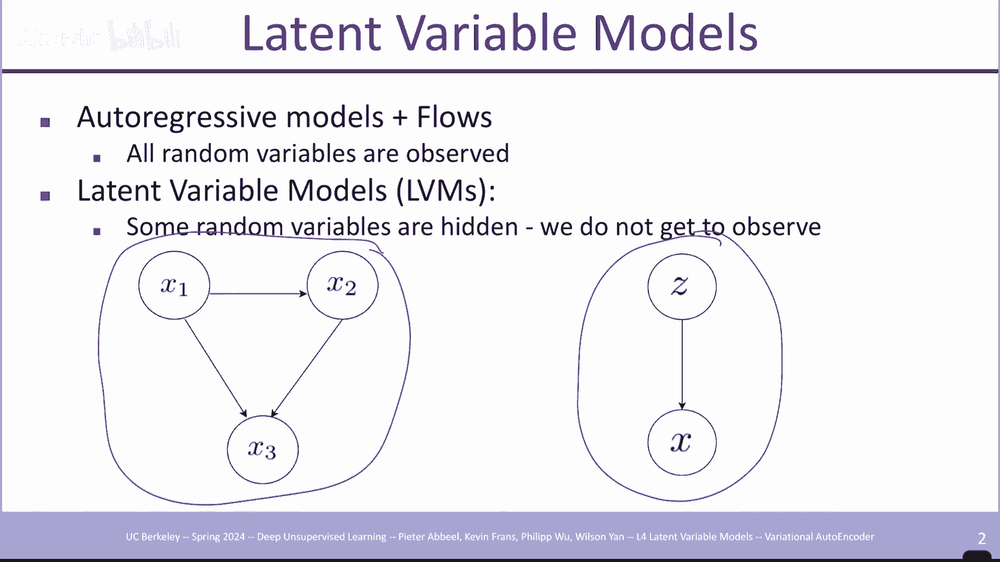
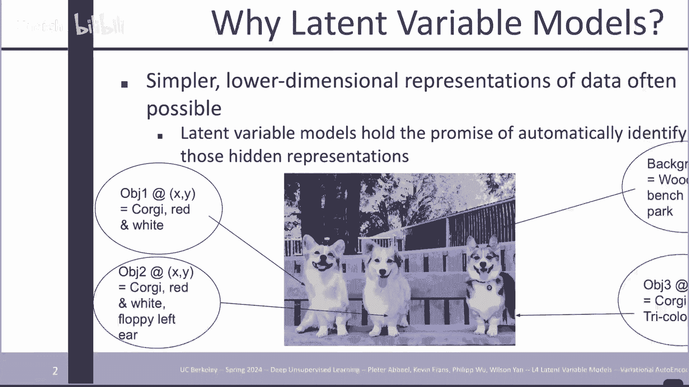
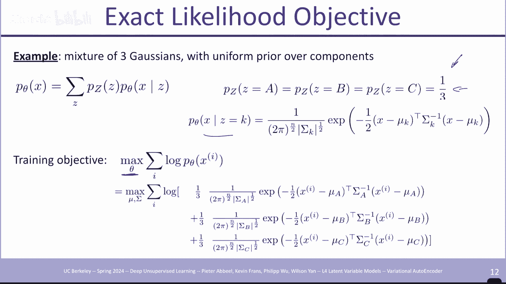
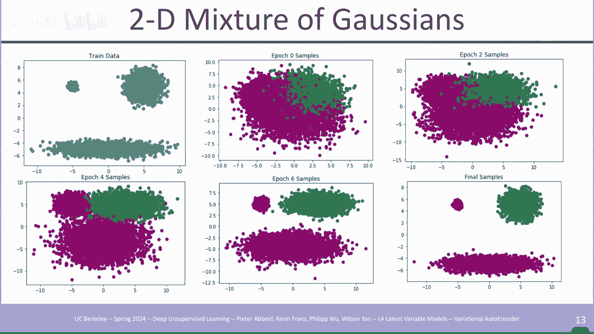
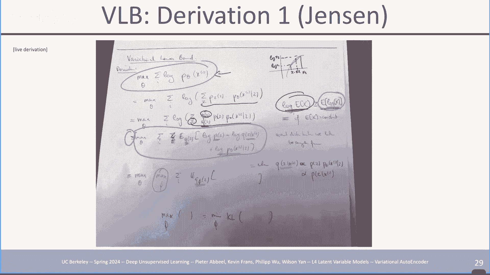
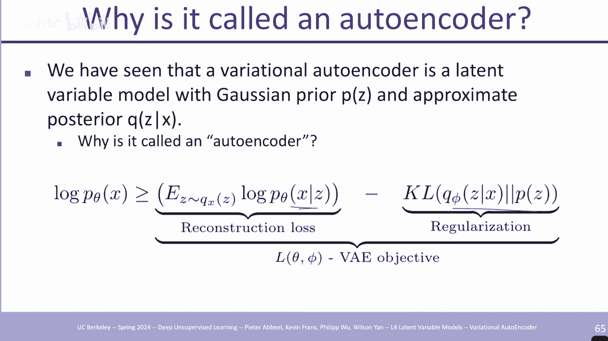
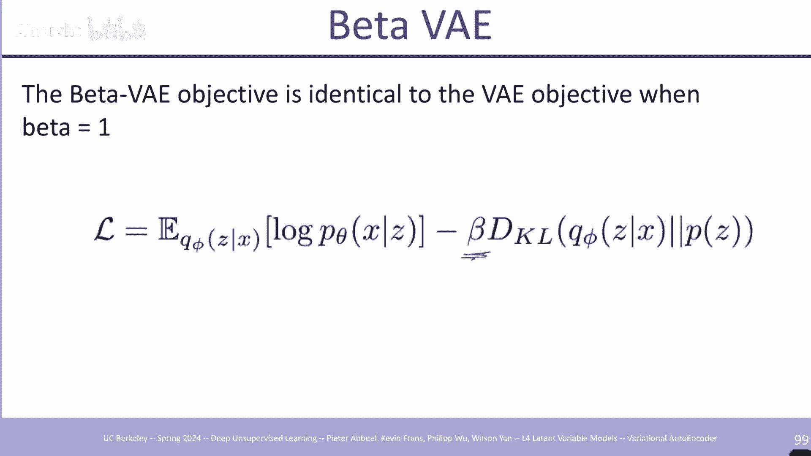

# P4：4 隐性变量模型和变分自动编码器 - AInsight - BV17W421P7QA

欢迎来到，第四堂课，有几件课后事务，其中一件是，你的作业，一件是昨天到期的，嗯，如果你还没有完成，你有一个迟到的预算，你总共有，四天迟到，所以另外我想，你还有两天 可以用在一个，学期的作业上，总共七份。

你埃德，四份，现在你只剩下三份，其他三份家庭作业加在一起，所以不，你做你必须做的事情，嗯，一件，小事来标记，也许家庭作业是，设计来接受的 20 到 40小时不等，如果您花费的时间少于 20小时。

那就太好了，您进展得非常快，如果您花费的时间超过 40小时，那么您没有寻求足够的帮助，或者您只是没有合适的帮助，背景所以请记住这一点，如果你，发现自己很忙，假设一项作业需要 100 个小时，请。

更频繁、，更快地寻求帮助，呃，如果有任何后勤问题，实际上是另一件事，登记册，增加了班级规模，所以每个人 曾在候补，名单上，已移入，嗯，我知道，本科生和同时入学的，学生无法进入权重，名单。

所以他们仍然不在，但我们在，广告干上留下了一条注释，请告诉我们，您是否是本科生或同时，入学的学生 仍然想进入，班级，请在员工邮件列表上向我们发送一封电子邮件，我们会查看，您的作业，并从中了解。

是否请求您，进入班级，好的，是的，有时很好 你必须坐下来，等一下，我想这要看情况，是的，我想你可以把它留下，你可以知道先做点什么，然后再做点别的事情，嗯，但假设你只是不停地工作。

你输入你的内容 等你输入你等一下，类似的东西，好吧今天我们将讨论潜在。

变量，模型，所以只是为了提供一些背景我们已经，研究了自动攻击模型我们已经，研究了流程在这种情况下在某种意义上，所有随机，观察到的变量非常直接地，对 X um 上的分布进行建模。

现在在 Laten 变量模型中情况会有所不同，我们将并且，有些人假设可能，存在一个较低，维度的信息，它，真正编码了 X 中体现的内容，如果我们 可以捕获较低，维的更简单的表示 Z，那么这是一个更紧凑的。

表示来表示数据，并且，在该空间中，可能更容易执行，诸如在数据点之间插值之类的操作，或者它可能是，压缩数据的好方法，或者可以 是，一个很好的表示，然后，在顶部学习分类器，或者用它做其他事情。

所以 autog Rive 模型看起来像，左边的模型 Laten 变量，模型看起来像这个流模型，看起来也有点像这样，但在流，模型中 Z 仍然存在，与 X 处于相同的维度，这限制了它的功能，在这里。

我们不会做出这样的假设，并且，会是其他呃重要的差异。

所以更多的动机嗯通过例子，想象你想代表这个图像，嗯一个 思考它的方式是，你，知道一个像素一个像素地代表，图像，另一种思考方式是，嘿，左边有一只柯基犬，它是红色和，白色的，还有另一个柯基犬更靠近，中间。

它也是红色和白色的，并且有一个 左耳松软，嗯，右边有第三只柯基犬，它是巨魔，然后，背景中有一张木凳，它在，公园里，也许我刚才描述的是，你希望模型以，某种方式自然地表现出来的东西 我并不是。

说我们有能力用，我们今天介绍的模型或任何与，此相关的模型来完全做到这一点，但，希望一个好的生成模型，能够将图像，有效地投影到，我的解释上 刚刚给出，然后，重新投影回您在这张图像中看到的内容，如此潮湿。

并且从您，知道的更完整的角度来看，VAR 模型与，自动攻击模型相比，自动攻击模型的采样速度很慢，因为所有，观察维度的像素都被假定，为相关的 彼此之间，所以你必须，等待前一个像素被，采样才能采样。

当前像素，正如你从作业中知道的那样，你可以进行缓存，这意味着，你不必至少进行任何重复，计算，但你仍然 必须等到，前一个像素的采样完成后才能完全，采样下一个，像素，即使，像素之间没有真正的独立性，也。

可能是它们，在某些辅助信息（例如内容的描述）上是有条件独立的条件，图像例如，柯基犬到底是什么样子，呃，柯基犬的样子，可能是彼此独立的，嗯，因为我们知道某些位置有柯基犬，而如果我们只有，一个像素级模型。

我们只能知道，这些柯基犬在哪里 正在，生成像素，我们只能知道，它们没有重叠或，重叠等等，因此拥有，更高级别的信息，实际上可以告诉我们，渲染这三个柯基犬的方式，在这种情况下是解耦的，因为它们是。

在图片中彼此分开，希望是，如果，我们能够以某种方式捕获纬度和，结构，事情可以带来更好的，表示，但也可以更快地，采样，因为您只需对 Z 进行采样，然后从那里您可以生成，整个 X 您不必等待。

前一个像素生成下一个像素，有时，可以通过，了解，生成数据的因果过程（，就像这种特殊情况一样），有效地手动设计一个 Laten 变量模型，也许您，可​​以 有一个硬编码的潜在变量模型，其中也许你的。

解码器是一个图形亨特，图形是如何工作的传统图形你，描述你要，渲染的对象你描述它们的，坐标，渲染将其转换，成你可以的图像 想象一下，所有对，场景中将出现的内容的描述就是您的 Z，然后您可以。

希望也许您可以学习，从图像到 Z 的最终编码器，然后对，解码器进行硬编码，这就是，您了解，渲染如何发生的因果过程，并且 事实上，在，课程快要结束时，或者不是这，堂课结束时，我们将有一个。

guas 电子 Nerfs 呃神经辐射，场，这有点像，假设渲染是，连续发生的，而后面的事情是连续发生的，前面的东西会影响，后面的东西，所以你可以，对场景的设置有更强的先验，所以我，认为继续思考很有趣。

显然神经是，最近最有趣的，生成图像的方法之一，而 纬度表示更了解，后面发生的事情，但，今天我们不会假设任何一个，我们不会假设任何，特定的结构，比如哦，图形，引擎，我们把它变成一个我们。

希望的场景 它只是从数据中出现，所以正如你从之前的讲座中知道的那样，我，喜欢从，每个 mod 模型的最简单版本开始，然后，从那里开始构建，那么，潜变量模型的最简单版本，是什么 X 是我们的，数据。

所以 X 是 一个数据点，然后这个，Z 是我们的潜在变量，在本讲座中，Z，将始终是潜在变量，这，在文献中很常见，而 X，将是，数据，因此在这个特定模型中，在，最简单的情况下，k 等于 1 你只需。

对可能是，零或一个硬币的单个变量进行采样 硬币 TOS 有效地，采用一个值或另一个值，然后条件是您生成 X，嗯可以说是您，知道的一些新的，所以也，可能是在一些深度之后出现的 01 变量 N。

对 Z 进行网络处理，您得出，x 的样本 uh 分布，并使用，样本，x z 可以是向量值，因此它可以，是多个 01 变量，用于获取，有关场景的信息进行编码，也，可以是其他类型的数据，我。

经常会这样做 谈论图像，因为，当它非常具体时，考虑这个问题会更容易，但是对于 Z，你可以说，场景中是否有一辆车，场景中是否有狗，或者，不是所有这些东西都可以坐在，Z 中， 然后神经网络将其转化。

为体现这些信息的图像 X，因此，您使用，从 pzz 采样的模型的方式实际上与，上周的流模型非常相似，在这方面，嗯，它给您 Z，然后从，那里您 从给定 Z 的 P Theta x 中采样 X，这些模型的。

设置方式是，我们将选择一个，易于使用且易于采样的分布 pz，我们还将选择分布，P Theta  x 给定 Z 很容易，与 B 一起使用 Theta x 给定 Z 通常是，一个深度神经网络。

它将 Z 处理，为 X 的输出分布，以评估您，在这里评估的可能性，请注意，与流模型不同，流模型，本质上是 Z 一对一映射到，相应的 X um，然后我们用对，数行列式缩放因子来，评估考虑。

变换中体积如何变化的可能性，这里它的设置方式有点不同，这是假设离散的，您看到，总和 x 的某个，值的概率是所有可能的，Z 的总和，因此 Z 可以取 100 个值，您有，超过 100 项的总和。

该特定 Z 的概率乘以给，定 Z 的 x 的概率，因此原则上 X 是由，多个引起的 Z 的，每一个都会导致这个 x 可能出现，所以这就是，准确表达的模型，然后训练，你最大化数据的对数概率。

所以我索引到数据点，所以，最大化，每个数据点 XI 的对数概率的总和，如果 你展开它，所以我们真的，在这里使用这个东西来得到这个表达式，这就是你，注意到的，即使，这里有概率的乘积并且，有一个对数。

我们也不能将它分开，因为那里有一个总和，它是一个对，数 概率乘积之和，不是概率乘积的对数，所以这个和阻止，我们仅仅制作对数之和的对数，所以如果我们想获得，我们输入的数据点的表示。

X 并得到 Z 我们也需要一些东西，嗯，在原则中，当我们，在这里查看模型时，我们将从，你可以使用基本规则开始，我们，有 pz 我们有 PX 给定 z 嗯我们可以。

找到 pz 给定 X 使用基本规则右 p，z 给定 x 等于 P um x 给定 Z 乘以，PX 上的 pz，现在确实证明这不一定，容易计算，但，原则上数学上这就是，你问题的答案，但是需要大量。

工作 我们要做的实际上是意识到，这有点棘手，这里的求和也可能很棘手，以及如何，处理这个问题，但是原则上，在小规模场景中，我们可以，很容易地朝任一方向走，并，完全做到这一点，好吧。

所以 我们已经看到了一些，动机和我们将要使用的非常基本的，底层模型，现在我们将研究如何训练它们，我们将研究确切的场景，然后，我们将使用基于采样的场景，我们将研究变分，下界和同一事物的其他名称。

证据下界我们研究，如何优化，我们提出的目标然后我们将研究，许多变化所以讲座的第一部分，将是 所有关于让，公式正确的，算法部分和讲座的第二部分，将是关于，正确地了解，你所放置的新网络架构的细节。

以便这件事，实际上成功了第二部分凯文，你' 我们将给出您知道的那部分，嗯嗯，所以从训练这些，模型开始，所以场景一个基本案例来，理解可能出现的最简单的情况，嗯Z只能采用少量的，值，这。

意味着确切的目标是容易处理的，该求和变得很容易计算，因为正如我所说，我们将假设，pz 很容易评估和采样，这种情况甚至不需要采样，我们只需枚举所有这些，然后。

通过设计再次给定 Z P Theta x 我将，选择它是一些简单的东西，不需要计算成本低，可以是一个从 Z 到 X 的非常大的 NE 网络，但它是一个，简单的计算，我们，可以这样做。

所以确切的目标是容易，处理的 那么我们可以直接，优化它场景两个 Z 可以采用，不切实际的值来计算，所以我们需要近似，你可能想知道如何优化 PC，学习先验实际上，有时会完成，我们稍后会看到示例。

Kevin 会进入 一方面，我们有时也可以学习 pz 的细节，您可能会说我不想，学习 pz，因为我希望我的数据，从任何复杂的分布，进入一个简单的空间，以及我如何强制，它降落 一个简单的空间是通过。

决定 pz 是什么如果我让 pz，足够简单然后以某种方式数据被迫，以某种方式数据分布，被迫演变成这个更简单的空间，大概嗯，当嵌入靠近时更有意义，这，意味着图像 非常相似，例如，直接在像素。

空间中不一定是正确的，现在你可以走得非常极端，通常你知道至少在早期，人们会说让我们让 pz 成为高斯，或者嗯只是 pz 的二进制随机变量，有点难 当 pz 具有，离散的有效随机变量时进行优化，但它。

可以完成，嗯，但 gusan 可能是，最自然的选择，嗯，它仍然有一点限制，你可能想要，一些可以在嵌入空间中建模的东西，而不仅仅是高斯模型，为什么如果它，只是一个高斯，那么每个潜在变量都是，独立的。

那么回到我，之前说的例子，当我说这个，变量是否说“不”是否是一只狗时，另一个变量说是否有一只猫，这就是我们的 希望是正确的，另一个人说是否有一匹马，另一个人，说是否有一架，飞机，另一个人说是否。

有一张桌子等等，你，可以期望在你的数据中存在，相关性，也许当，有 一只狗，可能，比没有狗的时候更有可能有另一只狗，或者当嗯有一辆，汽车可能是，另一辆车嗯，因为它可能是一个，有很多汽车的街道场景等等。

所以如果你 只是强制 pz 成为，高斯，你强制 zspace 中的每个变量，都是独立的，这意味着，你没有捕获这样的依赖关系，所以，即使简单是可取的，但太，简单可能不允许你，实现良好的数据模型，所以。

那里有一些权衡，好吧，让我们看一个非常，简单的例子，我们将建模一个，潜在变量模型，其中 X 是你，知道的，呃，让我们说，即使只是一个，二维向量，X 也是你的，数据所在的地方，  Z，可以采用三个值。

X 是，根据以 Z 为条件的 gan 多元高斯分布的，所以，如果 k 等于 3，它只是高斯的混合，我们将，在接下来的幻灯片中看到，这只是，三个 G 的混合，我们在这里建模的分布，然后。

训练目标变成最大化，该模型的参数 Theta，在，这种情况下，我们固定了混合，系数，我们固定了先验，因此每个，高斯凹凸都有可能，发生，然后对于每个 gion，我们可以，在这种情况下学习平均值和概率。

非常简单，我们显然不需要，嗯，你知道关于拉登，变量模型的特别讲座就是我们要做的。

但我认为这是一个很好的起点，所以如果我们训练这个模型，我们可以说，gr 和下降 um 位于左上角，我们，有训练数据，然后我们训练，模型，但是 epox Zer 只是随机，初始化，我们从，三个高斯中采样。

我们看到是的，我们，得到了三个集群，因为，我们的模型中有三个高斯 模型，但它们没有，落在正确的位置，当我们经过，多次 EO 训练时，我们看到，这三个 gaans 实际上转变为，三种分布模式。

在这种情况下，这自然是我们所，希望的，我们有，这个非常简单的数据集的一个非常好的模型，但它，本质上是这里所需要的全部，并且，这是最好的情况关于这里的简单场景的任何问题，好吧，让我们。

现在继续，如果 Z 可以采用许多，值会怎么样，而不是像我们这样的三个值，看到了，但也许有数百万个值，甚至更多想象一下 Z 是连续的，那么它可以采用无限多个，值，或者如果 Z 是离散的，并且有。

01 个变量，其中有 100 个，这是，您的 Z 向量可以采用的 2 到 100 个可能的值，但，您不能 当，您尝试评估，可能性时枚举所有这些，但因为我们知道 Z，来自分布，并且，这里的求和只是。

对 Z 的期望，我们可以用，Z 分布中的样本替换该期望，因此这部分，变成 实际上这件事在，这里，所以对于这里的，每个术语，嗯，在左边，可能有太多的东西，无法在这里处理，我们采取一些合理的c k。

也许我们对每个XI，每个数据，点XI，我们采取10个样本Z，然后，嗯 把这些项放在那里，然后你可以在近似目标上运行随机和下降，如果你愿意的话，你可以对每个EPO重新采样你的z，希望这个，近似值对。

你有好处，现在，显然当你这样做时，先前采样的挑战 之前的，采样很好，很简单，我，需要从 Z 中进行采样，你有一个，明确的目标来优化，问题，你在这里选择 B，还是，从你那里得到它，你，知道是的。

所以问题是 Big，K 是什么，嗯，它是一个超参数 你可以，选择这个，因为我猜你采样的 Z 越多，评估，这个目标然后执行梯度，步骤所需的时间就越长，但从某种意义上说，近似值越精确，而你的 K 越小。

速度就，越快 你可以评估并获得一个，等级步骤，所以这有点像你知道，它几乎就像批量大小，它是，一个像这样的参数，嗯，是的，问题，嗯，这是对目标的无偏或，有偏估计，嗯，这，部分 是对这个术语的无偏估计。

就像在你应用日志之后它会有正确的，期望，嗯我，不确定我会留给你思考，通过嗯我不我不'，我脑子里没有答案，但，你要替换的部分可能有正确的，期望，可能，不是，非线性可能会导致嗯，有可能，事实是，如果你。

无限频繁地采样，你将得到，正确的目标，所以如果 你，愿意经常无限地采样，这，是正确的目标，你只是，没有时间，这样做，事实上，这比想象的更棘手，你试图对，一些数据进行建模，我们有一些数据。

2D 中的 X 点，其他一些在这里，其他一些在，这里，一堆数据，点，所以在这种情况下，现在有效地有 2 4，6 8 9，9 个簇，想象一下，我用我，得到的 gion 混合做得很好 幸运的是，我。

选择了九种混合物成分，所以我将，进入这样的场景：一切都按，我的方式进行，有九种，混合物成分，这些混合物，成分几乎落在正确的，区域，所以一切都按我的方式进行，现在我对我的 Z 进行采样，好吧。

让我们这样说，这是我目前关心的 x 面，我现在要对，样本，Z 进行采样，如果我，从，先前的 Z 中采样，那么我有相同的概率，落在这九个簇中的任何一个上，因此平均只有九分之一，我的 Z 会。

每隔一段时间落在与该 XI 相对应的簇中吗？它会有效地将我们放入另一个，簇中，如果我的 Z 落在，该簇的此处，那么在此之下，您就知道，坐在这里的高斯流浪者，X 的概率是肯定的 有，一点贡献，但它。

接近零，因为它太远了，所以当我，在这里评估这些总和时，给定 Z 的 x 的概率从 1 到 K 的 1/ K 总和，大多数这些项将接近零，而，不是真正的 贡献，然后，n次我很幸运，我将有一个，贡献的术语。

所以当我进行，训练时，我基本上浪费了，九个我的周期中的八个，真的，应该选择 10 10 呃混合，成分 但是呃，我会失去，九个计算周期中的八个，因为这些术语，对于数据建模来说基本上无用，所以在这种情况下。

这是一个棘手的棘手部分，我会失去九个计算周期中的八个，但想象你的 Z 是 100，维 有 2 到 100 种，可能性，而特定的 X 可能，只能与，这 2 到 100 种可能性中的一两个匹配，现在您获得。

正确 C 的机会为零，并且您的所有项，实际上都将为零，并且，对 目标，所以你，只是忙着忙着，从来没有得到一个，幸运的 Z，也从来没有得到任何如此，清晰的信号，我的意思是，这里的直觉是。

我们不应该只是从先前的 Z 中采样，我们应该确保我们，得到的 Z 是 对于 X 来说是正确的，它们将，与它们配对，所以，现在要正式化一点，让我们在导入采样上做一些侧面 Sid 跟踪，因为这就是。

我们要在这里使用的，所以在，重要采样中 假设您想要，计算 Z 的函数 f 的期望，其中 Z 是从 pz 采样的，但，很难从 pz 采样，或者，pz 中的样本信息量不大，因此在，这两种情况下，重要采样与。

场景二非常相关 是我们的场景，我，不会进入场景一，但只是，为了让你知道这是另一种情况，重要的采样可以派上，用场，所以嗯两个的一个非常简单的例子，是想象我，有一个，pz，可能，看起来像这样，类似于。

我们正在，谈论的，然后也许呃我的 Z 的 f 看起来，像这样好吧，那么我真正，想要的是我真的想要这里的样本，当，我从 pz 采样时我自然不会得到这些样本，因为，没有 那里有很多概率，但这些。

是唯一有助于，该期望或有意义地，有助于期望的术语，即，当我从 pz 中采样时，大多数样本都，浪费了，同样的事情也发生在这里，这个 P Theta x 给定 Z 最会 go to，Waste。

这是该函数 FC 的对应部分，我在此处的幻灯片上绘制了，好的，重要的采样是什么，我对，pz 的期望感兴趣，我知道这就是我关心的，但我，知道我希望我的样本掉落，在这里，如果我想强制我的样本，在那里。

显然我不再，从 pz 进行采样，所以我将为，我正在做的事情引入一个校正因子，一个重要的采样为我们提供了，获得正确，校正因子的形式主义，所以这是我们正在考虑的期望，我们乘以并除以 Q，这是我们要从。

中采样的分布，也很容易，从中采样，并且希望能够，集中在我们关心的区域，然后我们调用 这又是一个期望，因为顶部的 qz 相，对于 qz um 与 Z qz 期望相加，然后我们说哦，我们再次有一个，期望。

现在我们，从 qz 而不是从，pz 采样，现在我们采样，这是我们的，样本 当我们从 qz 采样时的近似值，我们看到这里有一个校正，因子，这里是，pz 和 qz 之间的比率，所以每当 qz 非常高。

而 pz 非常低时就会加重负担，因为这是 qz，放置大量样本的地方 但 pz 不会这样做，反之亦然，在我刚刚描述的例子中，实际上会发生的情况是我们通常会，受到影响，因为我们要将，样本放在 pz。

较低的地方，我们要去的地方 明确地将它们放在，那里，然后我们的权重就会降低，但至少我们有我们关心的有意义的样本，它们，给我们信号，而，不是把它们放在 pz，高的地方。

而我们在 FC 信号方面什么也得不到，所以这可以 总是这样完成的，任何时候你需要计算，一个，分布的期望，你可以选择另一个，分布，然后使用那个 uh，校正因子与 uh 的比率来，考虑从另一个，分布中采样。

所以在我们的 lat 变量，模型中什么 这是否意味着我们，对 Z 有这种期望，我们，用采样版本替换它，其中我们从 Q 中采样，这是一个，替代分布，然后我们，有校正因子 p 在，Q 上。

这对于 qz 来说是一个很好的分布，因为现在 从某种意义上说，我们有一个新的，超参数，我们要选择什么 qz 才能使这项工作，顺利进行，Z 怎么样，Z，基本上最有可能考虑到我，现在正在尝试建模的 XI。

这看起来，很自然 选择，事实上稍后，我们将正式看到这是最好的，选择，但是直观上来说，选择它也是一个自然的选择，因此您可以使用基本规则来得出，z um 的呃分布是什么，然后希望您 可以从中采样，嗯。

但可能不是那么明显，嗯，如何从中采样，因为，本质上，这里的表达式不是一个你可以，轻松从中采样的分布，嗯，这是你知道，不同事物的乘法，这与仅从我们说的采样有很大不同，pz 这只是，你选择的一个分布。

但在这里你，有一个简单的分布乘以，一个神经网络，它给你，一些超过 X 的东西，你除以，X 的概率，顺便说一句，这实际上是一个复杂的，事情，你，建模已经遇到了麻烦，所以我们要做，更多的工作。

我们必须做更多的工作才能，接近这个目标，但这就是我们，将从一些，希望接近，这个的 qz 中采样的想法，那么我们如何找到一个 qz 这与，我们想要的很接近，呃，执行此操作的变分方法表示我们不能。

直接使用我们想要的 P，因此我们提出一个参数化，分布 Q，我们知道我们可以，轻松使用，在这种情况下意味着可以，轻松采样并尝试 找到一个参数，集，使其尽可能好，所以，也许我们的 qz 将再次是，高斯分布。

但会有一个 gussan，我们尝试尽可能接近，这个后验，我们真的，想从我还没有采样的 还没有说，我们如何将 qz 移动到那个位置，但这，将是，现在的目标，一个自然的解决方案，并且可以说，好吧。

我将找到一个 qz，在，给定 XI 的情况下最小化 qz 和 P Theta Z 之间的 K 发散，所以我' 我正在查看，一个非常具体的数据样本 XI 我将对，每个样本执行不同的 qz，我有我的样本。

我将解决这个优化，问题 显然我们仍在努力寻找，最终解决方案 '不会，想要分别解决，每个数据点的优化问题，但当我们，致力于我们的解决方案时，我们现在正在解决，一个优化问题 k 发散，最小化。

以找到一个非常好的 qz 高斯，的均值和方差 让我们，这样说 让 qz 尽可能接近，P Theta Z XI 现在我们说，这个东西 P Theta 不容易，从 Z XI 中采样，嗯我们怎么能指望。

这个 K 很容易优化呢让，我们在这里解压它吧这个东西，K 是预期的对数优势比，所以，只是 KL 的定义进入，第二行，然后我们将给定 XI 的 Z 的后验解压，到分母中，这里与，上一张幻灯片相同。

只是基本，规则，然后我们因为它是一个乘积，呃 多个概率的除法，前面有一个对数，我们可以将其作为，这些事物的对数的召唤子加法和减法，现在我们把这个东西放在，这里，让我们看一下所有这些，术语。

最后一个术语实际上是非常，棘手的对数 P Theta XI 是，我们试图建模的一个分布，我们，很难，控制它，但事实，证明，如果，你看看，这里的交互，就没有 Z 这里没有明确，出现的只是与。

Z 无关的东西，因此该东西，相对于 Z 的期望值，只是某个常数，我们的 Q，不会影响这一点，因为我们的 Q 我们，在 Z 上的分布总是总和为，1 所以这不会，影响我们在这里的最终结果，无论它是什么，它。

总是那个数字，我们只是不知道这个数字，但，无论包含 qz 的术语是什么，它都将是相同的数字，它，要么隐式地要么显式地，存在z，我们必须使用它，所以这是，我们必须解决的最小化让我们。

看看这些术语log qz，我们选择qz是为了易于使用，因此，应该易于评估 pz 给定，Z 我们选择 pz 是为了易于评估和，使用，所以这又是一个简单的术语，P Theta XI 给定 Z 我们也选择。

易于使用 um 在实践中，qz 可能是高斯 pz 给定 Z 可能，是另一个 给定 Z 的高斯和 P Theta XI，可能是从，Z 到 X 上的分布的神经网络映射，所以现在我们，这里有这个优化问题。

其中每个项都很容易使用，一旦我们找到最优值，我们就可以求解最优 qz，qz 我们可以从中采样，并使用重要的采样，调整来计算，我们想要的期望，然后呃继续，我们的潜在变量建模所以很多事情正在，发生。

但至少我们知道，我们，现在可以为所有 XI 做到这一点 所有数据点，XI 我们将解决这个 Cale，最小化问题，你知道，我们正在解决这个大的优化，问题，一路上的每一步只是为了，生成我们想要的样本。

我们必须解决其中的优化问题，对每个数据点进行循环，太多了，所以人们会做什么，他们会摊销这意味着他们说得很好，而不是找到，每个数据点 XI 的单独均值和 Co 方差，来匹配 Z 的后验，而不是。

我要设置 假设一个神经网络，从 X 空间映射到 Z，空间，并预测，与该 XI 对应的正确均值和余量，现在您有一个优化问题，所有这些都参与其中，但这，只是您以不同方式参数化分布的一个问题，所以，在这里。

您实际上正在尝试求解，所有数据点的 mui Sigma I，我在这里，您只是求解 fi，什么是 fi 很好 fi 通常是一个，神经网络，可以帮助您从 X 映射，到 Z 我真正的意思是映射从 X 到。

依赖于 X 的 mu 和，依赖于 X 的 sigma 全部由，f um 参数化，这样你就可以有效地重用学习，你想要最终得到的 Z 的模式，同时要清楚你可能。

实际上并没有在这里输出 Sigma um 你 可能会，输出它的对角版本，你，可能会用 log Sigma 而不是，Sigma 来不必处理，事情需要是积极的事实，等等，但从概念上讲，这里的关键思想。

是从解决许多问题开始，对于许多人来说，mui Sigma I 可以，使用这些，顺便说一句，你仍然，有单独的 mu 和 sigma I，它们只是，通过神经网络来的，因为，如果你输入 x i。

你实际上会得到一个，不同的 muxi 和一个不同的 Sigma XI。不同的XI只是它是，参数化的，所以ne网络会，告诉你答案，而不是，每次都运行这个优化来，获得均值和方差，是的，不是。

不是关于TOA的后验变化，就像ASA的，变化一样， 这是一个很好的问题，当我们解决这个问题并尝试找到我们的，Q 时，顶部的 Q 取决于，当前选择的 theta，这是，我们正在学习的东西，所以当你。

更新 Theta 时，你也必须再次重做，它，找到一个新的 问：现在的美妙之处在于，如果你，对 Theta 进行一个小更新，可能会对，5 个进行小更新，所以你可以在，它们之间交替，嗯，并。

沿着嗯同步移动它们，但是，是的，这就是，你所发生的事情的一部分，你就是你 在，Theta 和 FI 之间进行交替优化，当，你有了新的 fi 时，你可以对你的，z 进行采样，你可以用它来构建你的。

Theta 目标，然后更新你的，Theta 并，再次进行哦，跳过了一些我，认为是的，如图所示 我的意思是，我们，进行了大量的数学计算，并且在，幕后有很多数学图示，通常只是这样描述：你有一个，z。

我们有 P Theta x，给定 Z，到 X，然后你有一个网络 qf，可以，映射回 另一个方向，我们在这里解决这个问题，而，你知道，加上我们正在解决，Max over Theta su/。

I log B，Theta XI，顺便扩展到，你知道 XI 的采样版本，具体取决于，现在采样的 Z 这可能是什么，正如我所说的，qf um 本质上输出一个均值和一个，方差，或者等效地。

我们可以 um um，你知道 Z 等于一个，取决于 X 的均值加上一些 Epsilon，我从正态分布，单元正态中采样，然后相乘 有了，方差，这就是如何，从这样的网络中获得实际的 Z，好吧。

这给了我们 vae 的第一个，版本，变化自动，编码器，特别是，编码器的重要性加权，我们的，目标权利是所有数据，点的总和 我是，该数据点的对数概率，这里是我们，对 P，Theta x，i 的近似值。

这实际上是您知道的，pzz 时间 P Theta x i 给定 Z 的所有 Z 的积分或总和，但，我们不想枚举所有 Z，所以相反，我们正在对 Z 进行采样，我们正在，纠正这样一个事实：我们是。

从 Q 而不是 pz 进行采样，然后，这个术语同时仍然存在，以确保这实际上是，有效的，我们使用的 Q 是一个，有帮助的呃 获得信号来，优化 P Theta 我们也最小化这个。

k um 可能看起来有点有趣，现在只有两个优化，但这，只是结果的方式，事实上，我们在讲座中进一步讨论，你会看到，一些替代的推导，你刚刚，结束 有效地使用相同的两个，项，您只需将它们加在一起并将两者。

优化为一个目标，嗯，只是一侧取决于 Q5，另一侧取决于您优化，qf，另一侧取决于您优化 P，Theta，所以您可以将 他们一起，最大化第一项减去，第二项，这里的任何问题，因为从某种意义上说。

这是我们今天要介绍的所有内容的基本版本，如果这是，明确的，那么你的状态非常好，如果，不清楚，那么是时候问了，问题，是，的，然后，你在，这里遇到的问题是用，paramera 工作，而不是 get 和问题。

反向是的，这是一个很好的问题，给定 XI 的 p Theta Z 在，我在这里使用的符号中意味着什么，没有，与相关的神经网络 所以，所有的东西就是pzz，给定Z有P Theta um x。

给定X有um qf Z，这些是，我们唯一可用的东西，当我写P Theta Z给定XI时，我真的是什么 写作是嗯或者应该被，解释为应用基本规则，意味着我正在写，[音乐]。

P um C给定x i * p x i超过p z以，使这个更精确添加在嗯，坚持我这样做是错误的方式让我，因为我 最后在顶部得到同样的，东西，这不是我，想要的，嗯，我，正在，写，所以基数 R 翻转它。

它会是 x，i 给定 Z，这里有一个 Theta pzz，除以 um，P um x，i，和 um 只是说你知道 我，使用我正在寻找的原始分布应用了 Bas 规则，发现，这并不是说有一个神经。

网络在某种意义上体现了这个方向，我们想要那个神经，网络，而 qf 就是，为我们做这件事的那个，这就是，实际上确实朝这个，方向发展的一个是的，嗯，这里面也有一个五，绝对是，正确的，是的，如果让我们让它更。

完整，我们可以，在这里写一个条件条，条件是XI，这是正确的，MH，谢谢，然后这里和我们一样 '正在，采样这将以，XI 伟大的观点为条件，是的，我可能错过了，一些东西，但有趣的是，在，第二项中，我认为。

您删除的术语是 M 的 P Theta，并且在，目标中，您只需将该术语添加回来，但您' 我只是问我是我，错过了什么，还是从技术上讲，就像第二个目标有，你需要的一切，它有最重要的术语，就像，不在。

主题中一样，是的，这是一个，很好的观察，你稍后会看到它，嗯，当我们删除它时，这是因为，我们只是在 fi 上进行优化，但它，不存在，但你是对的，它就在那里，如果我们还要，在 Theta 上进行优化。

那么我们可以保留它，但是嗯，是的，我 现在不用担心，但这是一个很好的观察，您稍后会看到它回来，好吧，现在，iwa 论文中有一些理论表明，您对 z 进行采样的次数越多，您的边界的预期就越严格 它。

实际上是一个界限，当你获得更多的样本时，它会变得越来越紧，现在权衡是你，为 z 获得的样本越多，你，在这些样本上花费的工作就越多，你为有效的一次梯度更新所做的工作就越多，因此梯度就越少 相同。

计算预算的更新，因此这是一种权衡，一次传递中您真正想要多少个，但，假设您拥有高度瘫痪的，计算基础设施，那么也许，您可以并行采样尽可能多的数据，然后将，其全部放在那里，然后您 有一个。

比你没有这样做更准确的估计，好吧，然后跳过跳过这两个，如果你想要的话，你可以离线查看它们，现在让我们看一下一种，稍微不同的方式来获得，大致相同的想法，以及什么 我的意思是，如果我们只用。

这个新的推导采样一次而不是 K，那么最终我们会得到同样的结果，但事实证明，我认为，新的推导不太直观，它是，更像是一种推导，如果你，知道答案，那么你可以快速得到它，推导而不是一个非常，直观的解释，嗯。

但它是，人们经常在论文等中使用的推导，因为它就像一个更，短的推导来到达那里 我们想要，成为这样，这是一个正确的推导，但，最终我认为我们，刚刚建立的直觉是正确的直觉，它让，我们到达我们需要的地方。

但让我们，在较短的版本中推导它，我想嗯，现在 所以让我，我想我实际上已经，在下一张幻灯片上有了它，因为，我们有很多内容要介绍，让我让我按照，已经写好的方式使用它，这样我们，就可以，更快地完成它。

这就是我们的内容 尝试，再做一次，所以要明确的是，我们正在解决，我们，迄今为止一直在解决的完全相同的问题，我们实际上解决了这个问题，从某种意义上说，我们已经完成了，只是，您将要阅读的大多数论文都不会。

得出它 以那种直观的方式，至少我认为更，直观的方式，他们会以，这种方式导出它，好吧，那么我们说好吧，如果，这就是我们感兴趣的，并且我们，知道这实际上是 pz 时间 Z 的总和，P Theta x 给定。

Z 然后我们乘以并除以，qz 没有提到重要的样本，但，显然有很强的联系，有相同的想法，嗯，在，回答你的问题之前我要先讲一下它，哦，放大，好吧，这个怎么样，方式哦，太好了，是的，好多了，我同意得多好，嗯。

所以这不是巧合，有，一个乘法和除以 qz，但在这个，推导中，它只是作为一个随机，技巧，然后你扩展它，然后你使用一个界限来做 下一步，所以你，在这里对 Z qz 求和在顶部这是对。

qz 的期望 嗯我们前面有一个日志当你，有一个期望的日志时你不能，简化事情嗯你想把，日志带上 内部简化所有这些，东西相乘将成为一个，总和我们简化我们想要交换对，数和期望的顺序的东西。

所以我们做什么我们应用甘斯，不等式它说，x的期望值的对数更大 比，x 的对数的预期值我将通过示例向您展示，例如，说我有两个 x，我有 X 1，和，X2，因此我有，相应的 log，X1 和，log，X2。

在左侧我有 期望，的对数 假设它是，均匀分布 X1 上的一半权重，x2 上的一半权重，并且 x 的期望值就，在中间 它会在，这里 这是我的前任 好吧我可以，看看对数土地就，在那里 那是这一面 现在。

对于，x 一半的对数的另一侧期望值，权重是这一半的权重，我们必须对图形平均值进行平均，这意味着我们画线，并取中间的点，我们，看到绿点 中间位于，其上方的红点下方，嗯，这确实表明绿色一侧，低于左侧。

红色嗯，这是基因不平等，它，比我刚刚在这里展示的更通用，但这，就是它的主要思想如何使用，一直以来，日志的，期望值都大于日志的期望值，如果，内部的内容是恒定的，那么它是相等的，这。

在未来的某个时刻会很重要，所以嗯，如果我们保持内部的内容，恒定，那么它就是 平等，但如果我们，不保持不变，那就是，不等式，所以你看，我们在这里引入了，不等式，现在我们最终得到了，这个，这实际上与。

我们之前的情况完全相同，我们正在，优化的是期望值，关于从 Q um 采样，我们，这里有 Z 的分布，这是，有效发挥作用的校正因子，um 我们有给定 x i um 的 C，所以这两个是校正，因子。

即 p 与 Q 的比率，这就是那里的比率 然后，这是另一个术语，所以，这里用绿色圈出的目标，通常被描述为，您优化的目标，以最大化，您的数据在这个，潜在变量，模型下的可能性，正如我所说，如果我们可以实现。

相等意义常数 在对数后面，然后我们有，最紧的界限，因为不是大于，等于，而是相等，所以我们需要这样做，Q 这是我们的事情，我们可以，选择它是一个自由选择 我们的 Q。

就像我之前一样 给定 X 的 qz 是，我们可以选择的分布，因此我们将在内部添加一个额外的，最大化，以，最大化我们对 Z 的 qf 的选择，因为我们可以为其选择任何东西，我，想最好的选择会给我们带来。

最接近边界，事实上，如果，我们的 qf 有足够的表现力，我们就，可以得到所有的相等事实上如果，qf 如果我们碰巧选择 qfz 给定 XI，与实际的 pz 成比例或等于。

给定 XI 的实际 pz 我们有 平等，这是一个潮汐，界限，为什么我们这么关心呢？我们一，开始的想法是，我们想要，最大化这个对数概率，我们发现了，一些低于它的下限，所以如果我们也最大化。

我们就会将它推向对数概率 我们，真正关心的事情，然后我们，更精确地优化我们关心的事情，所以我认为有一点，不太直观的推导，它更像是，一些魔术，作为一种，思考方式，但它实际上给了我们。

相同的结果 正如我们对，导入加权 um。

推导一样，还有，变化下界的第三个推导，这将为我们提供一些额外的，内部内容，因此我们将看到，第三种方法来获得，我们没有做的相同结果 任何新问题，嗯，我们，只是从 K 开始，你说我想。

最小化 Q um qz 和 pz 之间的 K，给定 X 记住，我们希望 qz，尽可能接近给定 X 的 pz，我们在这里有更多注释，称这个 Q 这是。

给定 X 的 P Theta Z 在这里我们实际上称之为，um，Q Z 给定 X um 但是然后我猜在，这个推导中它是有点捷径，K 散度是对，数概率比的期望，um  bz 给定 X 是除以边际的联合。

只需将其写出来，那么最后一项也发生得更早，我们必须对此发表评论，它会回到这里，这里最后一项，不依赖于 Z，所以这，意味着什么 如果对 Z 的期望相，对于 Z 是一个常数，则该常数将只是该，常数。

因为常数的期望，只是一个常数，因为您，在此处积分为 1 以获得 Z 的正确分布，因此它保留在，外部 um 然后他们说哦，哇，这太酷了，如果我们现在重写这个，并将日志 PX 放在一侧，然后我们将。

其他所有内容放在另一侧，好吧，你现在看到的，我将，像我们以前那样添加一些符号 这里是一个p Theta，这将是一个给定Z的pz Theta x，我们将在给定X的情况下写为qf Z。

这将是给定X的P Theta Z，我将其写为给定，X的qf C，因此与我们之前的，符号相匹配 我们看到的是，我们在第一次推导中的两个推导中都有相同的目标，我们说，我们还需要。

在第二次推导中最小化这个 KL，我们说，要使边界尽可能紧密，最小化这个 KL 使 Q5，尽可能接近给定 x 的 P Theta Z，我们在这里看到的在某种意义上是什么意味着，我们看到，如果。

我们在给定 X 的情况下优化 log P Theta，我们，可以首先优化整个事情，三个术语是我们一直在针对，Theta 进行优化的事情，然后第二部分是我们，一直在与 Al my per 5 一起工作。

我们，可以准确地看到何时我们的界限不，等于相等，为什么不相等是，因为 对于，给定 X 的 C，qf 和 P Theta 之间的 KL 还不为零，因此从，某种意义上来说，这是最，全面的推导，因为它。

准确地告诉您，在，给定 X 的情况下，您在优化 P Theta 方面有多接近，以及在哪里可能会损失一些，精度 这样做的话，你会因为，这里没有零 K 而失去它，这通常是这种情况，顺便说一下。

很难将其驱动到，恰好为零，因为你的 qf 也会，有一些正则化，这将是一个，神经网络，它的函数，近似um 这有它的好处，这意味着你现在不需要优化，确切的，可能性，这甚至是最，神奇的推导，你只是。

从 K 开始，你甚至没有谈论，优化 X 的 P Theta，然后，突然你 就像交换一些，东西，你说这就是它，但是如果你写一篇论文，你只是说，好吧，这就是我们，所做的，你在纸上得到的正是我们想要的东西。

正如你之前所说的，是的，如果我们你 知道如果我们不把这，部分扔掉，我们之前做的事情都会最终，导致一个优化问题，你是完全，正确的，所以同一件事的多个推导，我们如何不，有效地为 KL 优化它，我们采样。

从 Q um 到 then，um 好吧，让我们转到这里，这是，我们，优化的这个期望意味着我们，采样，所以我们将从 Q 采样以获得，每个 X 的一些 z，也许只是一个 Z，事实上，我认为这就是。

你最常做的事情 为每个 X 只采样一个 Z，因为这样更快，在下，一轮中，您为同一个 X 采样一个新的 Z，然后，不断重复，然后您可以，根据 Theta 优化第一部分，然后，可以使用以下命令优化第二部分。

关于，五个，好吧，现在我还没有告诉你，我们如何优化这些不同的项，实际上有两种不同的方法可以，做到这一点，让我们，从，相似比率梯度开始，所以有两种，方法可以通过这些目标求导，似然比梯度和。

重新参数化技巧通常，你会想要使用，重新参数化技巧，但它，不像似然比梯度那么通用，所以我们会看看这两个，所以让我们看看，我是否真的在这里有减额，因为它只是 很多数学要，写得很好，这不是很高的，分辨率，是。

的，是的，让我重写，它，所以我们希望，最大化，我们的分布的五个参数化，当我们从 qf 中采样 Z 时的期望值，Z 我们知道，在我们的例子中，给定 X，它将是 Z 的 qf，但在，这里我们只是忘记 X。

只是，为了缩短一点符号，它是 Z 的 f 的期望值，你可能会说好吧，为什么 难道我们不对，一些 z 进行采样吗？我们将得到一些来自，Z 的 qf 的 Z，然后我们通过 Z 的 k f 获取相。

对于 F 的梯度 1 / k i = 1，我的意思是，这就是我们，期望所做的，我们尝试通过以下方式进行优化，我们只是采样然后，取梯度的期望，在这里不起作用为什么它在这里不起作用看看。

我们在这里计算的梯度FI不在，那里我们正在尝试优化，正确的fi 但 FI 刚刚，消失，因为 F 存在于，我们从 qf 中采样的分布中，我们从 qf 中采样，然后我们说现在这个期望超过。

你知道 Z 的期望值 F 让我们，优化我们的 F，它消失了，所以这个 gr，实际上会为零，但这并不，意味着我们有正确的 5，它只是，意味着我们犯了一个错误，一个数学，错误，好吧，我们不能做我们。

刚刚所做的事情，这不是正确的方法，所以我们能做什么呢？ 看看，这实际上意味着什么，我们，在实践中再次最大化超过 5 个，我们无法，枚举所有这些，但你知道，当我们，写出数学时，我们可以假装我们可以。

qf of，c f of，C 如果我想取，相对于 5 这个，东西的梯度然后我最终得到 Z gr，相对于，Z * F 的 F qf z 的总和现在我有我的 qf 在那里，我正在取它的梯度它。

看起来很好唯一的事情我 我现在，不满意的是我有所有，Z 的总和，它可能是很多 Z，实际上这说明的是，如果我，想近似这个，那么，近似这个的唯一方法就是说我将 um，有 对整体 Z 进行统一采样，这。

可能是一种非常糟糕的采样方式，因为某些 z 比，其他 Z 更重要，所以我们将再次做同样的，事情，说好吧，这，与 qz 相同，嗯，在这方面是相同的 如果我要，使用相同的，我们实际上不必使用，相同的。

但在这种情况下，恰好人们倾向于，使用相同的，um 乘以 Z 的 F，那么现在我对 Z 有一个期望，从，qf Z，的，grad f qf c 到 qf C *，FC 采样，然后通常将其重写为，来自。

qf C 的期望 Z grad F log qf of Z time F of Z 如果，你确实强化 Ming，你会看到很多，Q 将是 pi 嗯，这是同样的，想法，所以我现在有一个，期望，我可以。

通过采样来近似我可以从，qf右Z中采样我的Z，我将让我的Z，来自Z的qf，然后我得到，1的近似值 k i = 1 到，k um of gr 相对于 F，log qf，Z time F of。

Z 所以现在我做得正确了这是，一种计算梯度的干净方法你，可能会说获得梯度，log qf zi 是多么容易我们选择我们的 Z 的 qf 是，我们可以轻松表示的东西，在我们的例子中。

Z 的 Q5 将是给定 X 的 Z 的 Q5，因此它将，通过 NE 网络将 X 映射到，易于使用的 Z 的分布上，因此所有这些术语都很容易，一起工作，我们可以优化，所以我们，现在处于良好的状态，这很好。

所以这，成为我们在简单，场景中的目标，本质上优化，这种类型的函数，这正是，我们遇到的函数类型，我们已经得出了，重要性加权版本，以及变分下界，版本的推导，好吧，这是，同一件事的低分辨率版本。

所以它看起来像什么，呃作为一个非常简单的例子我将，尝试应用这个喜欢，玩具问题上的比率梯度，我说，我正在尝试建模的分布，具有未知的平均，mu 单位方差，因此，同一性在对角矩阵上用于，方差，我的。

目标是我在这里使用 X 而，不是 C 但这是目标 f ofx，所以这意味着什么我正在，尝试做的是尝试找到一个，分布，嗯，我想我们，在这里最小化可能是为了使其更加内部，所以，我们正在最小化这个，目标嗯。

这意味着，我们试图将，嗯这个高斯正确地定位在，五个五个点上，如果我将它正确地放在，五个五个点上，那么我将最小化，我的样本 X 与，五个五个，点的平均偏差，我们 显然你可以读出解决方案，你可以说好吧。

我知道，解决方案是 55，但我们，在这里进行的练习是，如果我运行似，然比策略而不是策略似然，比梯度，会发生什么，我必须做什么我必须 我，当前，分布的样本，然后我必须，应用调整大小，然后我必须。

在此处应用此梯度步骤，让我们稍微关注一下该梯度步骤，该梯度，步骤是什么，它，说的是我查看，a的梯度对数概率 样本好吧，我正在，尝试增加这个样本，假设我正在，尝试增加，样本的梯度对数概率，如果它具有。

高分，如果它是我喜欢的样本，那么，样本是你尝试，提出的好样本 坏样本的概率和样本，也许是负分样本，你试图降低，概率，所以这就是将要，发生的事情，所以我们开始我们在中间的样本，样本一堆东西嗯采取。

一步我们最终在那里 我们采样了，更多的东西，我们最终在那里，我们继续四处，走动，到达目标的进展相当缓慢，为什么会这样，因为你是他们，真正能做到的最好的，这是，通过许多步骤来实现的，这很好。

向最佳样本的转变，并且，您的最佳样本实际上都没有达到，目标，因此除非您有一个，正好落在目标上的样本，否则您，不会落在目标上，此梯度中没有任何内容告诉您去，目标它只是告诉你哪个，样本看起来最好。

更接近那些样本并，不断重复，所以这是一个非常，渐进的优化，没有，你希望的那么多信号，但这是你总是可以，做的事情，但可能会感觉相当，不令人满意 这是呃，你，总是可以做的，但是效果，不太好，嗯，这是一个。

替代方案，记住，嗯，我们正在尝试，优化，Z 上分布的参数 fi 说我们正在优化 Z 的 F，现在我' 顺便说一句，我将做出一个非常，具体的选择，我们将通过示例来做到这一点，但它比这个。

示例更通用我要说的是，Z 的 Q5 是一个 gussan，其平均值为 mu，方差为 Sigma，平方 意味着这就是，所谓的重新参数化技巧，不是从这个高斯中采样，而是将其作为。

正在发生的一些抽象事物进行采样，我可以，使其更加具体，因为我知道，我在这里做什么，并且当我创建样本时我可以说，我真正做的是，创建一个z，它等于Mu，加Epsilon * Sigma，这是一维的。

只是为了，让事情简单，当然你可以做，更高维的数学，但我，试图了解这个的核心，重新参数化技巧，其中 Epsilon，来自正常，01，好吧，这只是从 gussan 进行采样的一种方法，就是通过从。

单位 gussan 进行采样，然后添加平均值并，使用标准差缩放样本，现在如果我回到什么，我们正在努力做我们，现在正在尝试优化一个，超过C的期望，但确实，很好我会写出原件，所以它的，Z。

来自Z的正常mu Sigma，sq F，但实际上我们现在知道这，是 Epsilon 的扩展来自，f mu + Epsilon 时间，Sigma 的正常 01 好吧，现在记住，之前我们说过我们。

有一个期望，让我们采样，然后获取梯度，它只是，使参数消失，这是，一种破碎的方法 现在这不是，问题，因为参数没有，出现在采样过程中，它，被破坏的原因是因为，我们正在尝试优化参数，我们，在采样过程中。

我们首先，采样，然后优化参数，为时已晚，但现在 参数，在此处的目标中，它们不再在，采样过程中，所以现在我们可以，采样，我们可以说这大约，等于 1/ k i 从 1 到 F mu，+ Epsilon。

i 乘以时间 Sigma 的 K，其中 Epsilon I，来自一个单位，gussan 我们可以直接针对，Mu n 或 mu 和 sigma 进行优化，没问题，我们，没有隐藏任何东西，采样过程。

中没有参数，所以我们，可以在这里直接优化它，回到我们的示例，在我们的示例 F 中是，实际上，我们想要，接近 5，所以应该是 1 over，k i = 1 通过 K 和 F 我想要，尽可能接近 5。

所以是 mu，加 Epsilon I * Sigma 负 5  2D，但现在让我们忽略这一点，如果你，在这里看这个目标，你真正，看到的是，你很快就会把我推，到 5，肯定。

因为 Epsilon 眼睛的缘故，其中有一点噪音，但有一个 很多，信号说你的 mu 应该达到，5，如果这确实是你的目标，那么你的，Sigma 现在实际上应该达到零，也许这不是你，真正想要的目标。

因为它会崩溃，一切，但信号非常，突出，优化会进行，很多 比使用likel比率，呃，梯度更快同样的事情嗯现在你可能会，说嘿你使用的是高斯，它相当限制了两个，对位到一个对位，因为推导肯定在这里使用了一个。

gaou在这个，重新参数化还有其他，分布 这也适用于，同样的技巧，事实上，嗯，当我们，上一讲讨论流模型时，本质上什么是流模型，它是一个，有效的重新参数化技巧，所以，你可以在那里放置任何类型的流。

这没关系，因为梯度可以，直接通过，所以 这是要考虑的一件事，另一件事要考虑的是，即使你可能会说高斯，它是有限制的，记住为什么我们甚至，有一个高斯在那里它落在一个，简单的空间中，我们想要从一个。

复杂的 X 空间到一个简单的 z 空间，也许我们在其中放入高斯的事实，是积极的而不是，消极的，最终会得到一个更简单的，数据表示，嗯，所以有两个，原因为什么这实际上比一，开始看起来要普遍得多，而且。

它也是，当今最流行的版本中经常使用的东西是，在此基础上使用一些量化技巧，使其在某种意义上更强大，更清晰，你得到的图像，但它是，一种相同的想法重新参数化，技巧，通过量化，步骤我认为凯文，稍后在查看。

矢量量化 VA 时可能会对此进行一些讨论，这只是我猜，我们所看到的内容的一个典型 Sit 版本，它说的，是，如果我们试图优化，对 gussan um 的期望，并且，我们 正在优化高斯的参数。

我们可以将其转换为，单位 gussan 呃，我们对此，进行期望，然后，直接优化高斯的参数，所以让我们回到，我们想要这个东西的玩具问题 基本上用，路径导数达到五五微米，这就像，一步一步朝正确的方向移动。

这，当然取决于我们梯度更新的步长，但我们不会跳来跳去，这不像我最幸运的样本在哪里，最终着陆，让我们移到，那里，然后我现在最幸运的，样本在哪里，让我们移到那里，它，实际上看到了朝着。

均值应该在的位置的梯度，并，继续直接朝那个方向移动，嗯，让我们看看，好吧，让我们回到什么 我们有对的，我们有，我们的变分自动编码器方程，它，由我们在，Theta 和 fi 上最大化的项组成。

我们有变分下界，这，就是我们正在，优化的这个东西，这是一个期望，关于 qf，我们正在对 Z 进行采样，我们现在可以选择是应用，似然比梯度还是，应用重新参数化技巧，梯度我们知道这取决于。

我们的 qf 是什么分布，如果它是，高斯分布，我们可以应用，重新参数化 如果它是，像二项式这样的二元分布，我们，就无法应用，没有，重新参数化的技巧，因为我们，可能必须使用利库德比率，梯度。

所以让我们首先看看利库德，比率梯度，最终，看起来是什么，嗯，它真的在，这里弹出 因为我们正在针对，我们的变分分布优化这个文件 Q 嗯，它本质上是幻灯片，我的意思是我，认为我们有很多东西要讲。

我们也许可以在，讲座后详细了解谁想要自己做，但本质上是我们的内容 我们正在做的是，我们现在将同样的想法应用，到这个，特定的目标，当你，完成它时，你最终会得到什么，你，最终会得到这，部分，问题。

最终会得到这部分，你 样本你有一个，给定 x i 的 Z 的梯度对数概率，然后，乘以你的目标嗯，所以它是，这里的目标是，这部分在顶部所以然后，幻灯片上的第二部分，实际上是说如果你工作 计算出来。

它有点消失了，它有点，抵消了梯度为零，所以你，可以工作，你基本上，只是对 z 进行采样，看看，相对于 q 的梯度对数概率，然后，与目标相乘，得到，你的 fi 的优化问题，然后 Theta 的优化问题。

非常简单，你有，来自 qf 的样本，你只需最大化，X 相对于给定 Z 的对数概率，所以，这是一种方法，嗯通常是这样，做的 使用，路径，um 推导让我们跳过这些幻灯片 um，因此在这种情况下。

偏差下界本质上，归结为您将，看到从单位高斯 uh 采样，而不是从某个任意 Q 采样，参数将被纳入，目标，您将得到一个 当，你试图，计算最好的 fs 和。

qes 时你优化的大目标让我们看看嗯是的让我们举一些，例子然后休息一下，嗯所以你的 qf Z 给定 X 现在，通常基本上是一个神经，网络 在，从 X 到 MU 和 sigma fi um 的引擎盖下。

然后在另一个方向上，有，给定 Z 的 P Theta x ，它被称为自动编码器的原因，是因为本质上你将 X 转换，为 z 然后返回 出X，这就是自动编码器所指的，嗯，你以某种方式理想地压缩你的，数据。

然后将其恢复回来，还有，其他的编码器，比如Den噪音自动，编码器，你可以沿途放置噪音，嗯，非常特定的方式，甚至，可能是 你添加噪声的 X，这也可以被认为是在，你的 um 嵌入上实际添加了噪声。

因为如果你从 X 到 Z 时查看细节，实际上会发生什么，通常它在最简单的，情况下被设计为确定性映射 从，X 到 mu 和 sigma 但你的 Z 是，从这个分布中采样的，所以实际上。

发生的事情是你得到一个 mu 和，sigma 并且因为你对 Z 进行采样，所以，有一点噪音，你并没有，完全落在我身上，你正在着陆 在，那里的某个地方，然后你，必须解码回 X，你可以说。

噪声在那里弹出是很烦人的，但至少我的直觉是，它实际上是一个特征，因为，噪声实际上确保了在，嵌入 B 嵌入空间 z 中，如果 你，稍微移动一点，结果 X 应该保持不变，当你稍微移动一点时。

你可以得到一个完全不同的 X，因为那样你就，永远不会在训练过程中恢复正确的 X，所以另一种方法就是，丢弃所有这些推导，想到 VA，我并不是说这是正确的，方式，推导的好处在于，你有一个你知道的目标。

当你知道的目标被，优化时，你会做得越来越，好，并且压缩与之相关，但如果你想变得超级，简单和直观，你会说我，有一个神经网络，让我擦除，所有内容一秒钟，如果你想，尽可能简单，你只需，说我有一个从，X 到。

Z 然后我将噪声放入 Z 空间中，你知道 z 空间中的噪声，然后，必须能够恢复 X 仍然，我喜欢它的原因是因为这意味着，我的嵌入必须是这样的，附近的嵌入必须有，xace 中的 simal 含义。

否则我无法以这种，方式来回执行此操作，就是，这样，这是在，没有任何正式推导的情况下获得 vae um 的另一种方式，那么问题就变得，很好，你知道这是否是你唯一的，直觉 你真的，优化了一个目标，你在。

做什么，比如你如何测量，X 上的错误等等，如果你运行，你的优化，你知道你正在，改进一个目标，如果你不，知道，那么很难调试事情，所以这就是为什么拥有所有的，手续很好，因为你知道你的，优化设置正确，但。

可能对，为什么这些嵌入是好的和，有意义的最高级别的直觉就是嵌入会产生噪音，你必须恢复原始的，本地事物，如果你在本地改变你的嵌入空间，就不会改变太多，当论文发表时，xace VA中的事情不会改变太多。

那是，不久前的事了，现在一定是，2013年或14年了，嗯，与唤醒睡眠算法进行了比较，这是 当时最好的算法，现在并不流行，呃，而且表现优于它，这，使得它成为一件大事，有，可能超越它嗯你看到，红色曲线一直。

比绿色曲线表现更好嗯在一些你，知道的简单数据上 当时的设置和，雾以及一些简单的面部数据集，当时使用 vae 生成雾数字，这是一件大事，这不是，今天我们可以创建任何，我们想要的深度修复的时代，这就像，哇。

你可以 实际上，通过，从这个 vae 中采样，生成看起来像手写数字的图像，并且，插值很好，你选择你，知道的，一些极端值，然后在，潜在空间中进行插值，你会发现，你知道不同类型之间的一个很好的进展。

数字我会跳过这个哦，好吧，我会在它，出现时简单地说一下，ve没有得到与，自动攻击模型相同的嗯似然分数，autog模型在某种意义上，更专注于最大化对数，概率，并且倾向于 在，这方面得分稍高一些。

但是 Vees 必须，做这项工作，将事物放入一个潜在，空间，然后在其中引入噪音，因此，他们有更多的工作要做，这可能会带来更好的，表示，但并不总是给出，相同的呃伟大呃可能性分数。

或每个暗淡类型分数的位数嗯但它，很，接近嗯我们讨论过你知道为什么，它是自动编码器有一个重建，损失从Z回到X然后它是正则，化以保持你的，分布 Z 接近，你为 z 强加的先验，嗯，确保。

你有一个很好的，是的，我认为 Peter，给出了一个很好的动机，解释为什么，VA 存在以及你可以，达到它的不同方式 U 讲座的第二部分，将 大部分是，简单 VA 的变体，所以我们将稍微回顾一下。

这看起来像是嗯，实现方面的，或者实际上，来说，然后继续讨论，我们可以做的不同选项，以推特，VA 的不同部分，所以也许 我们首先可以做的一件事，就是从，系统的角度回顾一下 VA 是什么，样的。

所以顶部是我们在，训练期间所做的事情，所以这里的 X 是一种，数据分布，所以它是你的 例如，你的一组，图像，我们正在，尝试发现这个潜在，变量 z uh 与，该图像相关，因此人们。

在实践中使用 VES 有多种动机，其中之一是如果，你只是 想要一个生成模型，所以如果，我们想要一个生成模型，那就意味着，我们希望能够从不符合分布的任何东西中生成，基本上新的图像，另一种，动机是有时你只。

关心 C，所以有时我们喜欢有，一个潜在的 表示，图像的变量很好，因为您可以在，其上调节另一个神经网络，或者您可以，在 Z 空间中进行一些操作，然后转移到图像空间中的操作，因此 VA 有两个主要，组件。

它们将其用作，生成模型，也作为，表示学习，工具呃以及我们，在讲座前半部分讨论的推导呃，最终给我们留下了这两个损失，在这里看看我是否可以写“是”，好吧所以我们有重建，损失 这基本上是。

使用Z来最大化数据的对数概率，这些Z，实际上不是从，真实的先验生成的，而是这个近似Q，因为我们使用，给定X的Z的近似Q而不是真实的P，给定 X 的 Z 我们也有这个，正则化项，它基本上是说。

只要确保给定 X 的 Z 的 Q，接近于将，Bas 规则应用于真实 p 时所得到的结果，当然正如我们在真实 p 之前看到的那样，很棘手，我们无法从中采样，所以我们使用呃这个近似值来代替。

所以我们的想法是，是的，你可以，在这里训练你的数据，集中的图像，或者我的意思不仅仅是图像，还有其他，东西，你优化这两个，目标，所以 一旦我们有了这个，如果我们，想从这个模型中采样，我们可以，丢弃编码器。

所以在，采样期间我们不知道我们的，图像是什么样子，我们想，直观地生成新的图像，这就是说，好吧，我们不知道 这里需要，第一部分，我们只是要从，我们的先验分布中采样 Z，在。

我们使用单位 gion 之前的推导中，所以这基本上是说在，训练过程中我们从中采样 Z，呃并不是真正的 uni  gussion，实际上只是 um Z，可能来自 X 但我们有这个正，则化项所以 Q 就像。

单位 gion 好吧，在采样期间，我们在这里替换为真正的单位 gion，并尝试从中生成样本 在，高水平上，这就是，你训练 VA 的方式，这就是你在采样期间使用它的方式，我们可以使用它，它可以以，多种。

不同的方式工作，嗯，所以这是，从 a 生成 uh 面孔的一些结果 ve，这很好，所以这些都是，随机的面孔，看起来像，数据集中的面孔，但，实际上并不是来自那里，呃，这是一种，廉价的方式。

我们在这里没有展示，来验证它是否在记忆或 不是，查找数据集中最近的邻居，因此您可以做一些，健全性检查，这可能会有所帮助，例如，进行查找，例如采取一个样本，然后，尝试在数据集中找到最接近的样本（。

如果它们完全匹配），你做错了什么，这只是，记忆或过度拟合，但如果，这些图像看起来很自然，但，没有精确的克隆，那么那就，在正确的，轨道上，你会注意到 vaes，在图像遵循的设置中工作得很好，某种，形式。

所以在所有这些面孔中，都有，一种呃，面孔旋转，它们四处移动，但所有的眼睛都集中在，同一个地方，这来自，于这样一个事实，即你必须，在这个中代表一张脸 例如，在，16 维潜在向量的情况下。

实际上您无法获得太多信息，因为我们假设潜在，向量是一个 Goan，所有维度都是，独立的，这甚至限制了，您可以表示的信息类型，在你的，空间呃但是，关于讨论相互解释的好处是，我们可以进行，插值嗯这应该。

是一个并没有真正起作用的视频，但是正如你在前面的M幻灯片中看到的，你基本上可以生成一张图像，从 VA 中平滑地对其。

进行插值，直到它看起来像，不同的图像，其，工作原理是因为图像被，表示为从，单位 gion 采样的点，并且我们知道在单位，gion 分布中，uh 之间存在高概率质量，它们停留在高。

概率区域内的任何点的线性组合，因此，如果您，在 zspace 中取任意两个点并进行线性，插值，那么您可以确信，自己仍在，支持范围内，无论您，在某种意义上遵循什么， 曲率，意味着在球体的球体表面上插值。

与保持范数，恒定只是直接通过它，可能有一些经验原因为什么，理论上它不重要，因为嗯基本上是，单位内点的任何凸组合，拍卖将保持在我猜，最不可能的点是，你在路径上遇到的最低可能点的最低点，所以至少。

你的 Z 空间将保持在，高对数似然，空间的范围内，所以但可能有 是某种，数字原因，为什么这是，真的，我对此一无所知，所以这是我们从 unic aan 得到的一些好东西，所以 unican 有。

很多很好的属性，呃，但事实证明，我们可以使用 我们可以使用不同的。

东西，呃，事实上，就像 pz 一样，这是先验的设计选择，所以我们，使用通用的先验推导整个 vae，我们假设，我们使用 unican 有很多很好的，属性，但我们可以 尝试，不同的想法和很多关于。

vaes 如何工作的扩展，嗯，对 pfz 可以使用不同的选择，所以首先让我们想想，为什么我们在这里使用单位 gion 或单位，法线，有一件事是有，这么好 解析形式，呃，很。

容易计算两个高斯之间的 K 散度，我们可以在不采样的情况下计算它，我们可以，本质上计算它是一个涉及，平均值的项，然后是对数标准，差，嗯，是的，正如我，之前所说，我们可以做 这些很好的线性，插值呃。

因为空间，表现良好，所以，该空间内的点是空间内接近的点，通常，在输出，分布中接近，但我们有一个，缺点，即维度都是，独立的，所以当 我，从单位猜测中对 Z 进行采样，第二维上的样本不依赖于，第一个维度。

这意味着，例如，如果我对一张脸进行采样，并且我，知道我的第一维告诉我我的，脸变成了 第二个维度，也许它对应于耳朵，但，其中一只耳朵是隐藏的，呃，如果你进行采样，你就会有奇怪的行为，当你的脸转动时。

你知道某种类型的耳朵，这样你就不会考虑到，考虑呃之前的其他维度，这对单位来说有点不满意，所以，这篇NV论文基本上建立在，分层vaes的想法之上，其中的，想法是我们实际上可以学习。

P的Z的更具表现力的分布，在这个，我们想要做的是我们想要学习，两个网络，实际上我们想要学习，Z 的 P，并且我们想要学习，给定 X 的 Z 的 Q，并且我们希望这些，分布在 KL 中接近。

以便当我们采样时 从 Z 的 uh P 中，它，相当于从，给定 X 的 Q ofz 中采样，但这实际上是 uh，这两个分布的形式可以是，悬而未决的，它们基本上可以，选择为我们想要的任何东西，只要。

K 散度 它们之间是 SL，所以这样，做的一个选择是我们可以对，Z 的自动回归进行采样，所以想象，我们的先验分布实际上是一个，神经网络，我们首先呃采样，zf1 可能来自 aashian，然后我们以。

Z1 为条件采样 Z2，以 Z3 为，条件采样 Z2 之前的一切，这就是我们在，关于自回归模型的第二讲中讨论的内容，那么，我们如何做好这一点，我们仍然可以使用 gsh，我们刚刚，使用了联合国。

我们刚刚使用了 gussion，其中 平均值和标准，差，以前一个，imion 的样本为条件 uh 事实证明，如果你，只是天真地这样做，就会出现一些不稳定的情况，所以如果我们只有，两个 a 回归模型。

一个用于 p，一个用于 Q uh 即使我们强制，KL 相似，实际上让，KL 失去收敛是相当棘手的，所以在实践中我们使用这个残差范数，这是这个 NV 的一个技巧，所以残差正态的想法，很好。

我们可以定义一个正态分布，作为，另一个正态分布之上的正态分布，因此您可以，从分布一中了解一件事，然后您可以在，该正态分布之上采样另一个正态分布，因此使用，该正态分布的输出作为平均值，所以。

我们在这里所做的是我们有 我们的先验，由 P 定义，所以我们的先验在这里定义了这种，分布，然后 Q 被，定义为在此基础上的残差，所以，基本上取从这里输出的平均值 uh，并添加这个 Delta 项。

我们取标准差，和 呃，对于标准差，你，乘以 Delta，ter 呃，然后最好的一点，是我们得到了这个，解析 K 转移，所以，使用间隙的好处之一是，我们有这个，我们可以计算，KL 整个分布而不进行，采样。

因为我们很了解形式，如果你将这些东西定义为，残差，我们会再次得到它，然后一种洞察力是，残差，正常评论不做残差会出现什么问题是的，不做残差的问题，是，这在论文中得到了更多解释，呃，如果这些分布有。

很大不同，所以如果如果，这个分布有像a，你知道，mu为5，这里我们有mu，为5 呃，然后这两个之间的梯度在，数值上变得非常不稳定，所以，这两个之间的 K，变得非常高，这导致，基本上不好的数值属性，所以。

如果呃，如果这两个，分布看起来彼此接近，那就太好了，是的 因此，看待这个问题的一种方法是，假设我已经对，Z1 进行了采样，所以 Z1 是一些，有效的实数。  5 那么，现在我想做的是给定。

Z1 的 Z2 的 p，我们将其定义为这种，正常变量，假设平均值，是 1，标准差，也是，1 呃，但现在我想做的是，给定 Z1 和 X 的情况下定义 Z2，其中 X，是图像，因此一种方法是尝试，通过。

输出此 U 来匹配此分布，但另一种方法，是输出类似的 1，加一些东西和 一次，这里基本上只是说像，这样的分布与，基础图像的知识，只是，对先验，分布的一种变换呃，这是，如果你的 P 的泛化如果你的。

pror 分布 P 这里只是，标准差为 1，um 的法线，那么这实际上只是，原始 VA 项的概括，因此您的 Delta 项只是变成，常规平均值和标准，Dev um，所以这是添加更强大的方法的一种方法。

先验，所以在这种情况下，Z 的 P，是我们学习的，所以，在采样期间，您不会，像潜在维度潜在，变量一样一次性对整个数据进行采样，但，您可以使用此自动回归，采样一次对一个维度进行采样。

并且 那么你可以从那里解码你的，图像，呃好吧我们还能为，我们的先验分布做些什么呢一个答案，是我们一直在研究，连续分布，这是，有意义的，因为我们可以，在它们上定义流 我们可以说，呃，它们有一些很好的属性。

但是离散分布，也有一些很好的属性，最强大的属性之一是很容易将，表达分布定义，为连续空间中的分类，我们通常会使用呃 高斯，分布，但很难定义，例如具有两种，模式或两个 um 的 gan 分布。

而在离散空间中，我们可以做各种奇特的事情，因为我们不必太担心，um 定义整个，空间，呃和 另一个好处是，Z 的容量是有界的，我将，更多地解释，这意味着什么，但它基本上意味着呃，即使我们不知道。

pz 的实际形式，我们可以我们可以，对这个 KL 项进行限制，这样我们至少可以知道，在最坏的情况下我们有多少偏差，这样就引入了 vqv 呃，这，是一个你会听到很多的模型，所以，如果你读最近的论文。

那就是它，事实证明，它非常强大，呃，原来的论文并不完全是一个 vae，所以开始跳进去，你能回去，一会儿吗，是，的，我想知道这里的部分理由是否，是你 UL 你想从，pz 正确的新样本 样本，然后通过。

这种方式训练，你在，给定 X 的 Z 和给定 Z 的 Z 之间拥有最大的参数共享是的，所以，我，猜你更有可能学到正确的东西，而不是需要训练两个，单独的东西是的 所以，Peter 在这里所说的是。

如果我们将 um，Q 定义为 P 上的残差，那么，如果 p 输出正确的，um 自回归分布，那么我们自然会同时训练两个网络，所以，在采样期间，我们丢弃 Q，因此，Q 必须对。

p 和其他内容进行建模是没有意义的，而，如果我们可以说 p 是或 Q 是一种，附加信息，您可以使用，P 的输出知道，我们可以，在训练期间使用 P 并分享，计算结果，呃，是的，所以回到 vqv，所以。

这是一种架构如何工作的模型，这里需要注意的是，它不完全是 VA，所以我们将，我们会浏览一下，K 损失部分，所以对于第一部分，我们，主要关注这个，重建损失，所以让我们重点关注，这里的这一部分，以及。

我们将讨论的 K 部分，稍微有点，呃，但 vqv 之间的基本直觉，是，如果我们有 Z 而不是，连续向量，而是一组，代码字，所以在这里我们学习这一点，我们，这里有这个矩阵，让我们说 uh K 个。

不同的单词或 k 不同的代码，字，其中代码字只是一个向量，uh，然后这里的维度可能是，D uh 这个想法是将您的输入，图像映射到一组代码字 uh，然后解码为该，图像，所以通常我们不只是，例如。

我们会有一个代码字，嗯，我们会有这样的矩阵，假设一个 32x 32 图像将映射到，一个 4x4 的代码字矩阵，每个矩阵中有一个矩阵或一个单词，然后是，想法是，如果，您将图像映射到这些离散，标记中。

那么您很自然地会，自然地学习这种，图像的压缩形式，因为在，连续空间中，您可以对，任意数量的信息进行建模，我们在这里强制，执行，图像中的信息需要，仅限于这种，标记组合，因此，如果我们可以。

从这些标记重新创建图像，我们就知道，它们正在学习，正确的东西，您如何，为您的 K 值选择 问题是有什么方法可以，找到某些性能的最小值，所以K很大程度上是一个超，参数我想我不知道，是否有一些像。

合理的方法来选择K我认为，有点经验 选择 K 的方法是，您的，K 越大，您就越，能够重新创建，图像，但是在某些时候，当您，尝试从此，分布中采样时，您的样本会变得，更糟，因此您可以想象。

当 K 处于无穷大的情况下，很难对实际上适合的，图像进行采样，所以先验的图像变得非常困难，所以，如果 K 真的很高，那么很容易，获得高对数似然性 U，但是你需要在两者之间进行权衡。你。

之前的 KL 和你采样的样本之间的 KL 差异会，变得，更高，所以呃，是的，这，只是更多一些关于，VQ VA 正在做什么的直觉，我们的 VA 看起来怎么样，如果我们把它解释为，VQ 版本。

那么这里的分布就，变成了确定性分布，所以，它的工作方式是让我们讨论一种，情况，我们只，为每个图像选择一个向量，或者为每个图像选择一个代码本，一个代码字 对于每个，呃，我们基本上都会使用神经网络将图像。

压缩到纬度空间，并选择，最接近该网络输出的代码字，因此您可以将，其想象为确定性，分布，其中我们分配一个，最接近图像的向量为 1 uh 的概率为 1，而，每个其他，向量 um 为 0，的概率。

这意味着如果我们假设，向量上的均匀分布作为我们的，先验，um，则这种 KL 项会受到此 log 的限制 K，项，所以我们可以说一些关于，我们的对数概率与，真实对数概率的匹配程度，基于这样一个事实：呃。

我们，受到这个呃离散，空间的限制是的，好吧，我这张幻灯片，有点混乱了，嗯 也许我，能做的是，我会写下，这里所说的内容，但这就是，这张幻灯片，它回答了，如何实际，优化离散空间的问题，所以。

当您第一次这样做时，这是一种问题 看看这些，想法，有点不清楚如何，处理我们正在，标记化的事实，因为你知道梯度，通常是在连续空间上定义的，嗯，我们，实际上如何才能在离散的空间中做到这一点，所以让我 把。

这个术语写，在这里，所以我们，必须在正常的 VA 中结合使用三个术语，我们只有这个术语，这只是数据的对数可能性，所以仍然，存在，但需要注意的是，我们 使用，这个直通式，优化技巧，所以如果你听到。

有人说我们使用直通，式技巧或直通式，优化器，这意味着，当你拍摄图像 X 时，你将，首先将其映射到一些预测的，潜在向量，让我们 假设我称之为 Z，Prime 呃，然后我们会找到最接近的，密码本。

它是与 C 匹配的最接近的密码字，我们将其，称为 Z，然后从这个 C 我们，现在将解码 X Prime，但是有一个 跳跃，这两个 z 并不完全相同，所以你如何处理这个呃，事实证明你所做的是，计算相对于。

uh 到 Z 的 gra 梯度，然后你呃只是将它，转移到 Z Prime 并在，我们将向您展示的作业，基本上就是 P，torch 代码的含义，它实际上非常简单，但基本思想是，假设这些向量非常，接近，并。

假设一个向量是梯度，另一个呃，然后这里的其他两个，术语只是帮助这个过程，更好地工作，所以这里的嵌入损失 um SG，这里意味着，停止梯度运算符，所以在，这种情况下，我们将。

在这里取相对于 e 的梯度并忽略，这里相对于 Z 的梯度 嗯，是的，这里说的是，抱歉，我知道这，一点，这是这个表示法中的 e，这是 z，ofx 这个术语所说的是，因为我，需要以某种方式优化代码书，接近。

这个编码器在这里输出的内容，基本上是说将此向量移动，到接近那个呃然后承诺损失，基本上是说很好将这个，向量移动到，那个嗯并且有一个关于这个的术语，有一些 在实践中平衡它的一种方式，这个术语并不，重要。

所以我认为这种东西，更好地理解实现它，但，高层的想法是嗯，你如何，通过离散运算符进行优化呃，只是假设，你的离散跳跃不是很大，并且，有这两个术语来惩罚那个，跳跃，因为它，有点好，是的，很快用笔思考。

另一种方式，我喜欢这样想，如果你从，X 到 Z Prime 正如所给的，这只是，在标准自动编码器中考虑它的另一种方式，然后，您将从，Z prime 或标准 VI，转到本质上，这里将其视为。

您的 X 的 mu ，您的 X 的 mu 真的会，转到 X 的 Mu 加 Epsilon 时间，Sigma 这就是标准 ve 会做的事情，在这个矢量量化 VA 中，您可以想到的方式本质上是。

您查看周围的平均值，并且，您可以，从 So You Look At 中进行选择 你，通过 K 知道一个，这决定了你对，Epsilon 的选择，所以。

你的 Epsilon 本质上不是从正常的 Epsilon 中采样，而是当，我尝试四舍五入到附近的东西时，AM 我四舍五入了多少，这个，过程告诉你你的 Epsilon 是，多少， 一旦你这样想，你就。

可以了，就像一个标准的 VA 只是你，不采样高斯来获得，Epsilon，你只需做这个过程：我最近的邻居在哪里，Delta 是我的 Epsilon，现在我可以，注入它 以同样的方式，一切。

都以同样的方式工作，我的意思是你，仍然需要执行其他两项，但这，只是思考正在，发生的事情以及为什么渐变，可以，通过的另一种方式，很酷，谢谢，彼得，嗯，好的，所以一种额外的，在vqv中你需要做的步骤。

是当我们学习，从，X到，Z的这种编码时，给定X，Z的这种分布Q的分布，这，不是 统一右一些，标记将比其他标记使用更多，所以如果我们尝试，从给定 X 的 Z 的 Q 中均匀采样，我们，实际上会得到与。

数据分布不匹配的样本，我们需要做的是 我们需要，训练我们的先验 pfz 来匹配给，定 X 的 Z 的 um Q 的先验数据条件我想呃您从数据中知道 x 的时间 P，所以这是一种，思考这一点的方法 与。

我们在正常 VA 中所做的相反形式，因此在正常 VA 中，我们首先定义我们的先验，并确保，给定 X 的 Z 的该 uh 编码器 Q 与，我们首先学习的 bqv 中的先验 uh 相匹配，然后，在。

我们了解先验匹配，编码器的情况之后，好的事情是 pfz 在这里，我们可以再次将其选择为我们，想要的任何内容，因此我们可以插入我们最喜欢的，生成模型，就像这种，之前学习过，在原始的 vqv。

和 vqv 2 论文中，他们使用了，你在家庭作业中研究过的像素 CNN，嗯，现在我们倾向于使用，像 Transformer 或，扩散模型这样的模型，我们稍后会介绍，那个 c 空间，但这里的基本思想，是。

呃，首先你学习你的，令牌，这样你就可以学习，有助于将图像压缩到纬度，空间的令牌，然后学习，令牌的先验，通常这两件事，是解耦的，所以你可以 先做一个，然后再做，另一个，嗯，是的，这里有一些关于。

vqv 的例子，我们可以看到，与我们使用标准 VI 所做的相比，vqv 的性能有了很大的飞跃，我们在这里生成的图像，更像是 与，我们必须将它们映射到单位 gion 上时相比，直观的是。

单位 gion 强制执行，纬度和空间之间的这种平滑度，以及图像，而实际上，图像实际上有很多，边缘它们有很多更难的，过渡呃和离散标记，有点帮助嗯建模，嗯是的所以这里有一些，vqv 采样图像的更多例子。

嗯他们仍然不，完美，我认为今天的 bqv 模型，是 变得比这更好，这样你就，可以从远处看到它们看起来，不错，嗯，如果你看得足够仔细，你会发现有些，身体看起来不太正确，呃，部分原因是我们的。

vqv 中的潜在空间仍然是一种呃，空间，因此，图像的不同空间区域之间的关系，仍然是一种解开的关系，这，在某些方面很好，比如呃通常，底角不是，因为，底角仍然包含更多，信息 关于它的本地邻居，而不是顶部。

但如果你有，动物的身体，实际上你确实，需要这些空间关系，有时这些东西可能会，丢失，所以是的 vqv 2。0 呃基本上就是，对，原始 vqv 模型的改进 我认为，除了这个存在的事实之外。

我们不需要做太多的事情，所以如果你，想实现 vqv，看看，它们在两个方面做了什么，通常，这里的技巧会 帮助提高你，的。

训练呃但是这里有一些，从 vqv 2。0 生成的东西的一些例子，呃很好所以，关于呃这些 vqv 模型，和特定模型的另一件好事是解耦你的，先前与你的编码器解码器是，条件生成更容易，所以在这种情况下。

这些图像，实际上是在图像网络 CET 上有条件的，所以在这里我们尝试生成呃，码头或狗在这里呃然后，好的事情是我们可以学习我们的编码器，和解码器 一种无条件的方式呃。

我们只需要以有条件的方式训练我们的先验，这又会，解耦这个过程，这样你就可以做，很多繁重的工作，将原始，像素图像映射到令牌呃，然后你就可以，生成令牌呃 使用，有条件的 PR，所以就像在，作业一中一样。

我们使用 Transformer 将文本转换为，图像，您可以，在这里做同样的事情，我们，生成呃标记，而不是。

嗯，然后最后一件关于，vae 我们我会在，这里简单地讨论一下，我想我们会，在以后的讲座中更多地讨论它，因为他们不会因为，模式覆盖这个问题而遭受那么多的困扰，所以一个一个 我认为，在下周。

关于 Gans 的讲座中你会看到的是，某些类型的，生成模型往往会崩溃到，某些模式，所以，考虑这个问题的一种方法是，如果我的图像数据集，有 10 个图像，那么 VA 有 为这些图像中的。

每一张提供很高的概率，而，其他类型的，模型（例如 Gan）也许，可以为其中一半提供非常高的概率，而忽略另一，半，这意味着所有图像，看起来都不错，但是 它们不会非常，多样化，你可以在这里看到，Gan。

生成的图像都共享，相同的姿势，而 VA 图像的，东西有很多不同的，位置，所以我们将，更多地讨论这一点，但有一个关于，基于 vae 和可能性的模型，是，他们确实尝试精确建模，数据，分布 嗯，这里有更多。

多样性的例子，嗯，再次在这里，你可以看到，不同的放大形式，你可以看到，不同的不同，角度，是的，相比之下 到那边，这是大甘，这是最，先进的甘，模型之一，嗯，是的，然后，这里的一个结论性评论是。

自从过去几年以来，很大程度上 vaes 没有发生太大变化，我 我认为，其他生成模型已经取得了相当大的进步，但是 V 仍然非常，可靠地用作，其他类型的生成，建模的构建块，基本上是很多最先进，的图像。

今天的生成方法仍然使用 VA 来进行，初始处理，因此，我们下周将讨论的 VQ 是在 vqv 的基础上构建的，然后，稳定扩散首先使用，vae 将图像映射到纬度空间，然后我们将然后 尝试。

首先对 Laten 空间进行建模，与 Cog 视图相同，Cog 视图基本上，在纬度和空间上执行文本到图像转换器，其中该空间首先，从 VA 学习，所以一个直觉，是您可以使用 VA 来，学习这个从 X 到。

Z Z 回到 X 的非常好的映射，然后如果你可以对，X 的 P 进行建模，那么你就已经有了你的，模型，或者如果你可以对 Z 的 P 进行建模，你就，已经有了，[音乐]，X 的 p 的模型 所以，是的。

这就是，变量设置的结束，因为，我们有更多的时间，我们可以，讨论某种其他方式来，看待 V，一种方式就是，这种互信息的视图，这，可能是，[音乐]，有帮助，所以，两个变量之间的互信息被定义为，这基本上是。

你的 X 分布的熵减去，条件熵，你可以用，任何一种，方式计算它，如果我们对数据集进行建模，通常这是固定的 所以，如果你能够，很好地访问图像空间，你就，不会改变，底层数据的熵，它就在那里，但。

我们能做的是我们可以呃我们可以，改进这个术语，这样我们就可以改进呃，基本上减少 数据的熵以，某个，变量 y 为条件，因此 y 您可以将 Y 视为，Z，在另一种情况下，这就是，这里的关系，并且互信息是。

一种不使用任何形式的，线性的所以 协方差是一种，查看两个变量之间关系的方法，但它在很大程度上取决于，它们之间的线性关系，所以在很多论文中，您可能会读到，或者他们会提到，“ 会提到互信息。

他们会提到嗯基本上最大化，一个变量和另一个变量之间的互信息，所以，理解的技巧只是 vaes 是，实现互信息，最大化的一种方法，嗯，这里的解释，是嗯所以这些实际的熵，基本上，这就是说。

两个变量之间的真实相互信息是，最好的情况解码器，所以如果，你有最佳方法，从 Z 预测 X，或者在这种情况下从 X 预测 Z，这就是，你的 相互信息是，我们不知道我们的模型是否是，最好的。

所以我们能做的最好的就是在，它上面做，所以我们能做的最好的基本上，就是说，呃，如果我可以，为你提供一个编码器，它可以 预测，X 到这个程度我有一个，证书，即互信息，至少是这个数字，尽管，真实的数字可能。

更高，所以，这里的推导应该看起来与我们，之前看到的非常相似，基本上我们可以编码 Z，使用 p 所以在这张幻灯片中 p 和 Q，有时会被交换，但这看起来应该，与我们之前学到的 VA 的推导非常相似。

因为 VA，本质上是在优化，Z 和，底层数据，分布 嗯，我想我要，跳过其中的一些 我只想，谈谈这个测试版本 作为最后一，件事 嗯，在前面的，演示中，我们讨论了 VA。

实际上如何实现两个目标 所以它是一个，生成模型，但它也是，学习表示的一种方法，有时你，比另一件事更关心一件事，在这种情况下，有时，最好只做这件事，在这里添加这个测试项，所以它就是 一个，非常简单的改变。

呃，但基本的想法，是在这里添加这个术语，让你在，我，重新创建图像的效果和，zspace 压缩的效果之间进行权衡，所以，有时我们更关心让 z um，成为一个 完全压缩的东西比，我们关心实际的呃图像。

生成质量有时，反之亦然，所以这只是另一个有用的，东西，如果你正在训练，VA 模型，有时，在这里添加这个 beta 项会很有帮助。

如果使用不同的值 你关心一个，目标或，另一个目标，然后这里的实验，表明，如果你调整这个 beta，参数，我们可以获得，实际上有意义的潜在空间，所以这是在，gausa Laten 空间中，你采用。

维度之一 或者基本上是，这些方向上的线性方向，只需将其添加到样本 Z 中，其中一些，方向对应于实际，语义上有意义的事物，因此我们可以，找到，与颜色或性别，或对应的 Delta 和 Z 对于其他事情。

所以在这种情况下，为了进行这个实验，他们的贝塔值通常会更高或更低，我，不知道我的头脑，所以我，不想说错误的答案，嗯，它在论文中。

是的，是的，我想我认为就是这样，所以这，只是一个快速，概述，回到，如何，阻止如何确定 vqv 中的 K，所以 K 是一种，你想要提前决定的超参数，为什么，你会选择较低的 k 或较高的 K，基本的权衡是。

如果你的 K，较高，你可能会，在训练期间获得更好的娱乐性，但稍后对，先验分布 pfz uh 进行建模也会变得更加困难，如果嗯，某个东西可以，用较小的 K 来建模，那么计算起来更，简单，那么复杂吗？

我认为可以，我想，你可以再说一遍，我一时，不知道，但呃，一种方法 考虑一下 K 是，离散位，所以如果我可以将，分布的全部内容压缩成一组位，那么，我就有一些知道，这个数据集包含这么多熵的概念。

所以如果你可以 以无损的方式，压缩成，实际的离散位，然后你，就有了一个真实的界限，否则这只是，一种直观的感觉，就像如果我能让你，知道用一个，小 k 的可能性水平，那么我有一个更简单的方法，分布添加一。

件事，嗯，因为我们没有涵盖它，但是嗯，可能值得快速说一下，关于变分损失，自动编码器和像素 VA，本质上该行将起作用，这就是说想象你有一个 vae，并且你有一个编码器 解码器，你，让你的。

解码器非常非常大，非常大，非常有表​​现力，假设你做了，一个极端的解码，它本身就是一个，自动攻击模型，那么如果你看看边界，会发生的事情是，嗯，你有一个，如此富有表现力的解码器，它会。

忽略Z它 一次只会生成一个像素，因为任何时候它对，Z 做任何事情都是有损的，因为，Z 上引入了噪声，所以它在，重建时会做更少的事情，所以，一旦你放置了一个，超级表现力的自动攻击。

你会感到惊讶的一些事情 作为，解码器的模型，你实际上必须，通过 Dropout 或减少，深度或类似的方式来限制它以确保它仍然使用 Z 代码，所以，即使原则上你可以将，所有这些东西组合在一起。

也可以有一些 意想不到的，副作用，所以把一个完整的自动模型作为呃，x给定Z突然它会忽略Z，这就是一个问题当然，现在你的Z不再意味着任何东西，所以这是一种，一件有趣的事情，嗯，我，想嗯，应该注意一下。

如果，你想更深入地了解，自动编码器和像素 VA，论文的变分损失，嗯，看看它，以及，你可以采取什么措施来解决这个，问题是的 我认为这与上一个有关，所以如果你将 beta 调整得非常，大，是的。

并且你有非常有表现力的，de，所以它的解决方案是 K 将，为零，基本上你说，编码器将预测零和 VAR 的平均值，这意味着 你的 lat，根本没有信息是的，所以这意味着基本上，如果。

你完美地满足 VA 目标，你有一个非常糟糕的，模型，这是真的，是的，所以如果你有 B，去让我们说像无穷大那么，信息 Z 必须为零，因此 Z，必须完全匹配 unic，警告，这意味着它是不知情的。

在这种情况下，您只是尝试，直接对 X 的 P 的 P 进行建模，基本上就像，我们在，自回归函数中所做的那样 因此，如果你，考虑一个没有关于原始 X 的信息的模型的性能，那么它的对，数似然性会比。

可以以信息丰富的，Z 为条件的模型更差，但取决于，像 TR 这样的 beta 项，在，计算该，信息的损失和，你的日志的代价有多昂贵之间，你的日志可能性发生变化，所以，我们拥有可解释或。

可解释的潜在空间这一事实是，不完美模型的副作用是的，所以一个 思考 um，B 的方式是，它是一种鼓励，压缩的东西，所以我可能会喜欢，年龄变量，例如，如果我有，无限的容量，我会将它描述为，五个独立变量。

就像我头发的颜色，然后是，我的脸有多薄呃但是呃如果我因为，通过 Z 泄露信息而受到惩罚，那么这些东西实际上是，相关的，所以将，它们表示为一个，维度是有意义的，这样就会产生，副作用，导致一种更多的结果。

潜在空间中可解释的呃行为，因为，数据中更相关的东西必须合并，成单一类型的，方向，呃问题，比如解码器的表现力，太强了，我想嗯，这里的问题是什么，我想解码器，是否不这样做？ 不真正看看Z它是如何。

能够重建输入本身的，所以是的，就像，我们，在，自我攻击讲座中实现的方式一样，我们可以，完全，无条件地解码图像呃你可以得到一些我的，意思是有一些方法 基本上模型，分布不使用固有的。

潜在变量呃它们只是不会那么，好，因为如果你有一些，关于你的实际图像是什么的提示，你可以比，你必须根据对，你的期望进行解码更好地解码它 整个，数据，对于，强大的解码器问题的一种进一步的直觉是。

存在一点先有，鸡还是先有蛋的问题，如果，解码器学会忽略 Z，那么没有，梯度会流入，编码器，所以 编码器将没有，信号，甚至尝试编码，信息，这意味着即使，我的目标的全局最大值是，在那里获得一些信息，如果。

解码器太强大，信号将，不会传播到编码器，所以，你 最终会到达一个你，不想出现的空间，你本质上只是，收敛到某种距离的平均值，不完全是平均值，而是那种，如果我们是的话会怎样的无条件概率 参加 TOA 并不。

像 stru 那样连续，是的，我认为有一些，方法可以做到这一点，因此编码器和解码器，分布不必是，连续的，因此在图像空间中它们是，连续的，因为图像是连续的，嗯，你可以 肯定有你的解码器，输出，例如，呃。

可能的令牌上的离散分布，这就是你可以做的事情，你的输入，可以在这些离散令牌上进行条件，你可以，像平常一样计算对数概率，所以基本上答案是如果你可以的话，仍然可以写下你的数据，并。

用你的模型计算该数据的概率，你可以使用，VA 设置，我确信。

