# P8：8 大语言模型 - AInsight - BV17W421P7QA

当我们在课堂上时，我们涵盖了，许多不同类型的模型生成，模型大小的模型今天我们将，专门深入研究语言，模型在此之前我们已经亲自，阅读了您的项目提案我已经阅读了，所有内容 但其中四个，如果你是这四个人之一。

我很抱歉，嗯，我希望，今晚之前完成最后四个，嗯，在，你的谷歌文档中发表一些评论，如果我对一个问题发表一些评论，请给出答案，以便，我了解你的想法 正在考虑，如果没有问题，那么您知道，继续前进，并在考虑。

事情时合并评论，嗯请记住，四月份将有一个里程碑，然后最终项目呃，报告和视频演示将于，五月份到期。 你的作业三是，昨天到期的，你的作业四，已经发布了，嗯，这是扩散，模型，这是最后的作业，所以你还。

剩下一个作业，然后是期末，项目，所以今天我们有一个客座讲座，howu howu 是一名最后一年的 phg 学生。伯克利，他在，强化学习、，语言建模、多模态，学习、视频建模整个。

频谱的大型模型训练方面做了一些最令人印象深刻的工作，但是今天将重点关注，语言模型如何将其带走，是的，谢谢，所以是的，所以今天的讲座，是关于语言模型的，Peter 让，我谈谈语言模型的基础知识和一些呃。

进展，所以呃，我们从这里。

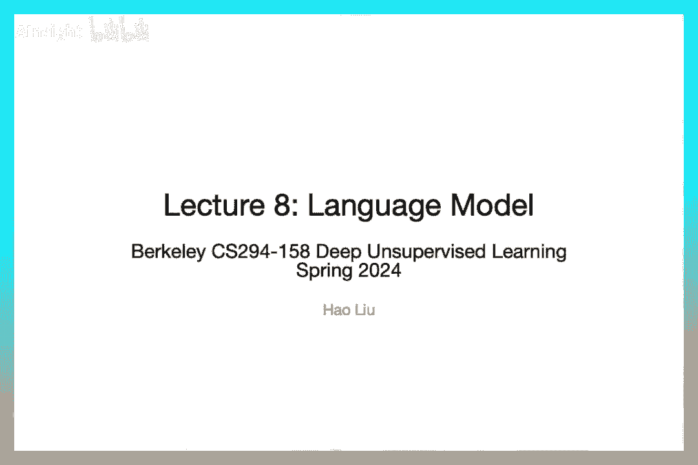

开始，所以在今天的呃讲座中，我，将介绍一些 scill NOS，基础知识和语言模型的一些功能，在后半部分中，我将，讨论一些用于。

您的研究的实用指南，或者也许有一些，实际，目的，因此语言模型，无处不在，从聊天，boo 代码，副驾驶，甚至图像生成或，视频生成，如 Google 的 Imagine。

或 op 最近发布的 Sora 或这些，令人难以置信的成功基于，语言模型，并且，很好地理解语言对于，各种人工智能，应用来说意义重大，因此秘密，来源之一是我们构建，语言模型的技术真正利用了巨大的，计算机。

能力，在今天的讲座中，我将，重点介绍这些技术如何 技术规模，总是计算，剩余的机器人是什么，以及我们将来如何。

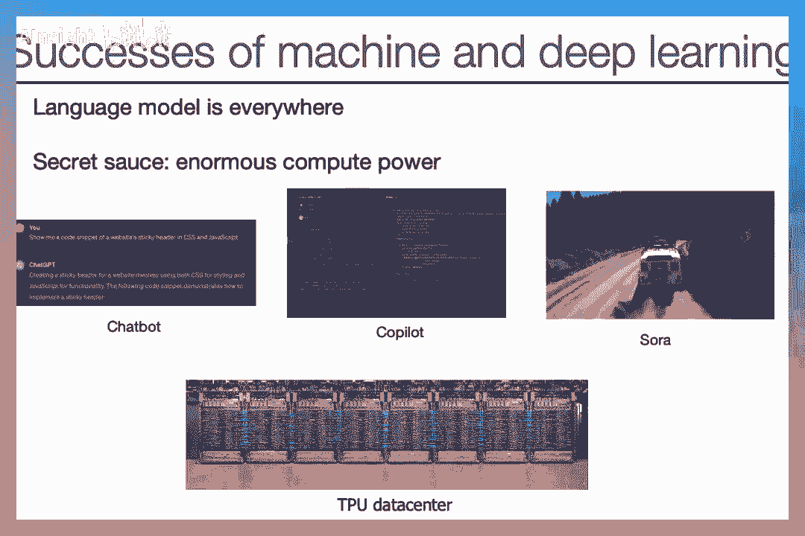

解决它们的数量，因此语言模型基本上是，序列上的概率分布，我们对，由一些 Theta 参数化的似然分布进行建模，我们的目标是建模这样的 标记，序列 好吧，想象一下您，有单词序列或，其他标记序列（例如虚拟。

标记等），并且您想要学习，一些参数，以便可以，捕获此类序列的分布，因此通常语言模型，是自动回归的，我们是，基本上自动回归地分解这个序列 T 标记，将仅以所有标记之前的标记为条件，通常我们。

使用 Transformer 参数化模型，稍后我们将，得到，非常简单的目标标记序列，上的自动回归似然分布，所以为什么我们 想要进行，自攻击分形，我们有，很多不同的模型语言，序列方式，我想说主要原因。

是每一位都成为分离的一部分，因为我们再次，进行自动回归预测，所以我们，必须预测每个标记，所以如果你，有 五个单词，然后所有五个单词都，成为预测目标，这，对于语言模型的扩展至关重要，另一个原因是。

因为我们，正在进行自动预测，这，对于对话式，人工智能来说实际上是横向的，我认为我们，说 CH 成功的主要原因 GPT 是我们可以，与这样的人工智能模型交互，这样的人工智能，模型可以，如此。

现实地预测语言，所以基本上目标，是要求模型预测，未来运行，良好，那么最大的可能性是多少，目标是使观察到的数据，有可能在 在，模型中，我们将采用许多序列，计算对数，似然，然后得到平均值。

这就是我们的目标函数，我们，将尝试最大化该，目标，因此在 Lama 语言模型中，您可能听说过我们有 1。5，万亿个，令牌，  seta 通常是数，十亿个。

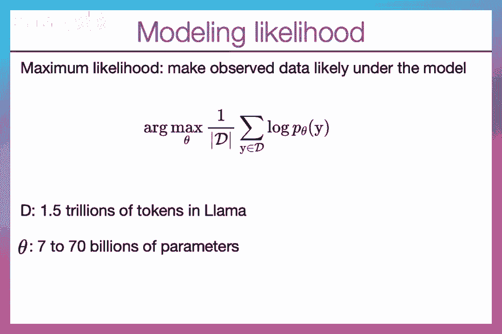

参数，因此在学习过程中，我们，实际上有三个，阶段，第一阶段称为，大规模预训练，一旦我们有了模型，我们就可以最大化序列数据集的可能性。对某些特定任务进行建模，因为请记住，在，预训练期间。

我们对数据分布进行建模，数据就像，来自互联网的数万亿代币，它们可能无法捕获，我们真正，关心的某些任务，而这些任务往往是，您想做的，在预训练模型中进行一些风扇调整，第三阶段称为，从。

反馈中学习当您有一个好的模型时，您，希望该模型遵循用户的，意图，并且用户可能会提供一些，反馈，此阶段重点关注如何，使用，在今天的讲座中，通过人类反馈来调整模型，我将，主要关注，预训练，因为这是你。

可以构建模型的地方，基本上决定了，你的模型有多好，我将花一些时间进行粉丝。

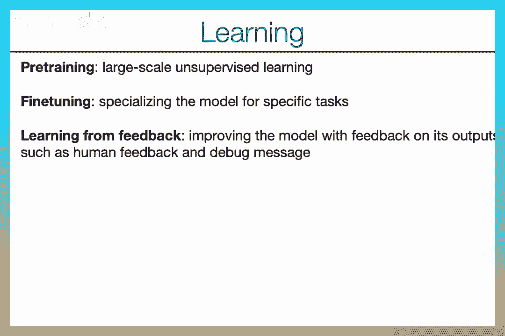

调整和学习 从，到目前为止的反馈来看，您可能会有这样的，问题，比如我们为什么要进行这种自动，回归统一，学习，该图来自 Llama 论文，显示了，预训练，阶段 Y，AIS 前面，提到的平均 L 似然损失。

越低越好，x，轴 是，在这个训练阶段看到的令牌数量，正如你所看到的，我们，在训练期间有三个令牌离子，他们，可能注意到这些曲线，没有，饱和，不断减少，而且我们在互联网上有更多的语言数据，所以这是一个。

我们进行无监督学习的主要原因是，因为有如此多的未标记数据，可用，通过训练这些，数万亿或数百万亿个，标记，模型可以，很好地捕获分布，并且可以比，进行监督。

学习更好地概括，所以你可能听到儿子，叫“更好” 从著名的，reach中得到的教训是，人工智能的主要，成功将来自，于利用，计算的方法，因此我们的目标是通过，添加更多计算来更好地建模数据分布，所以什么是。

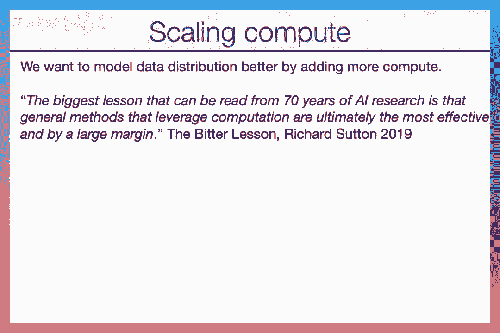

计算计算，是我们有一个前向和后向，路径 一堆令牌，我们运行，我们的，模型，计算损失，反向，传播，这就是我们花费，计算的方式，这个计算主要是，矩阵，乘法，我们使用触发器来测量这个，计算，因为这个矩阵。

乘法基本上是在做，浮点乘法和，成瘾，我们实际上可以估计，计算 成本 我稍后会谈到这一点，但这里的公式只是向，您展示计算机成本，C 是由参数数量决定的，基本上是模型大小、，数据，大小和上下文维度和。

模型隐藏，维度，我将对此进行解释，稍后，这是为了表明我们可以，通过使用尼日尔上下文，窗口使用更多参数来增加令牌数量来添加更多计算，因此可以收集更多数据，更长的，数据序列或训练更大的，模型。

为什么我们要这样做，有，证据吗 表明如果我们，这样做，我们确实会得到更好的人工智能。

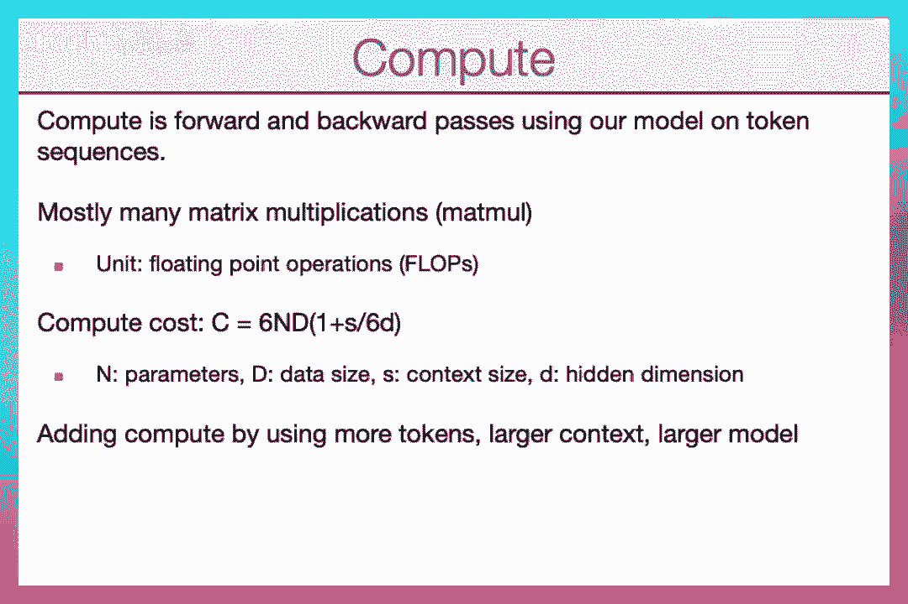

模型现在我要讨论的，是基本的令牌，然后我们开始，回答我之前，问的问题所以我在令牌中多次提到，我们可以对咬合，序列进行建模 这是最，通用的，但很多时候它是非常，正确的，所以对于一个数字，我们花你。

知道一口，所以如果我们要对一系列，语言单词进行建模，你将很容易，得到非常长的，序列，我稍后将展示更长的，序列意味着 需要更多的计算，这有点不必要，你，知道训练非常，昂贵，另一种选择是，基于字符进行。

所以如果我有一个像，hello 这样的词，我将使用这个世界中的字符来表示这个词，这样你就可以想象每个世界，至少有几个，标记，较长的单词可以有更多的，标记，因此它与基于咬合的序列有类似的问题。

人们尝试基于世界的，标记化问题是模型，确实知道某些单词它们具有非常，相似的语义，含义所以现在我们通常，在我们之间进行权衡，我们使用一种，称为咬对编码的东西，我在，之前的，讲座中简要介绍过这种编码。

但对于那些不，熟悉，这一点的人来说，它的工作原理是用，新的，令牌替换出现在顶部的对，所以有一堆单词 一堆，序列，你把这个单词分成，subw，然后你重复查看“，okay”，所以也许这两个子单词，出现最。

频繁，然后你找到一个新的标记，你，基本上分配一个新的标记，你知道，任何标记来替换这两个出现的，um 对，然后你保留 重复此操作，直到达到特定的给定。

词汇，量，因此几年前，2017 年人们尝试使用更多计算来训练 LM，他们基本上采用，arcm 并执行我们之前讨论的，自动回归 n 代币，生成以及，执行此操作后的大量亚马逊评论，有趣的事情，发生了。

他们发现STM中有一个新，房间，X AIS上的值为sh，可以，控制可以用来控制，te的输出，Y AIS显示，数字s的输出是正，还是，负 所以你可以看到，通过，控制这个神经元值，我们，基本上可以生成正或。

负，RS，所以基本上模型学会，理解，区分正和负，基本上理解人类的，情感，这在当时被认为是一项，非常困难的任务。

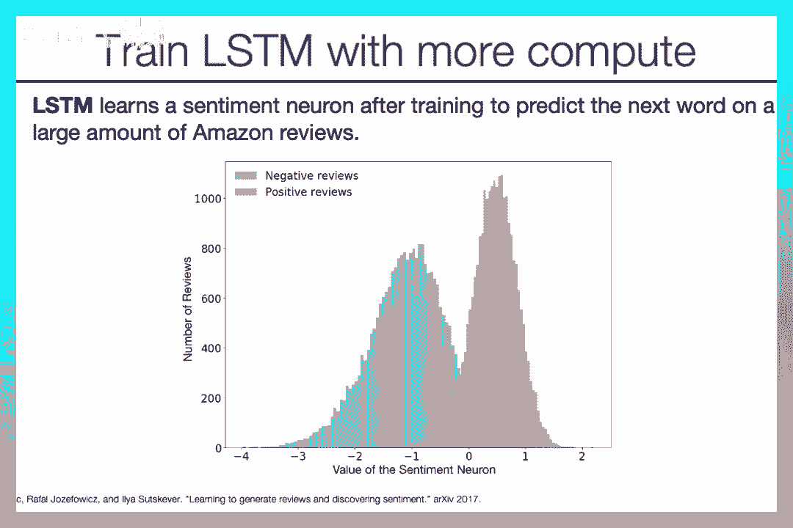

如果我们，采用 IMDb，评论并检查这个，神经元的值在这个段落中自动回归，我们可以再次表明，神经元捕捉人类的情绪，就像，红色的神经元，表示消极的单词或句子，所以更多的绿色神经元表示更积极的，情绪，所以。

这在当时真的很有趣，认为像我这样的许多人试图，收集更多的数据来玩这个，或训练一点更大的l或，其他替代神经网络，架构也许你可以发现，一些超越人类情感的东西也许，你可以，理解更多关于人类。

语言的无聊因为亚马逊评论也，包含不 只是情绪也是世界，知识，但到目前为止非常，困难，训练 stn 真的很困难，人们写了一篇关于，这个的论文，人们提出了一种，称为，注意力的新架构，注意力的尺度要好得多。

这里的左图，显示了每个，令牌测试损失，好的每个令牌损失，意味着如果我 查看，这 1K 1，000 个，令牌的特定位置，哪个模型可以，更好地预测该令牌，因此 xaxis 是令牌，索引，Y AIS 是。

与该特定令牌相对应的损失，我们可以看到红线，是，LM，蓝线是 当，我们训练越来越大的神经元，网络时，不同模型大小的 Transformer，始终保持性能，STM，您可以看到，随着上下文，变长。

达到 1K Token，差距，变得，更大，这导致正确的数字，是模型平均，性能 XX 成为，参数，因为我们关心如何，通过缩放应用程序来构建更强大的模型，因此在这里我们看到 Transformer 表现出。

非常，漂亮的线性缩放效果，并且很。

早就饱和了，所以我想简要回顾一下，Transformer，架构，正如我们之前展示的那样 在，没有 Fus，LM 的情况下处理传递令牌，您必须保持一定的隐藏，状态，但在，注意中，您可以直接处理任何，传递。

令牌，该模型没有此，信息，而 Transformer 溢出如此好的另一个原因是，您可以，通过以下方式轻松增加参数 添加更大的 MLP，网络和 MLP 网络只是矩阵，乘法，对，真正的大矩阵，乘法。

因此它可以很好地，与我们几代 GPU 和。

tpu 一起扩展，我想再次谈论的，目标，是我们通常进行自动回归，预测，但您可能听说过，其他，目标，如掩码标记，预测或，前缀标记，预测，这种，掩码，或掩码语言模型的一个很好的例子是，birbirth。

它的工作原理是，随机地屏蔽一个句子，比如说 50% 的，单词，然后训练模型来预测，这些掩码数据，部分和 GPT 更像是四种，语言建模，您以，先前的标记为条件并预测下一个或，未来的，标记中间的东西称为。

前缀语言建模很高兴，知道它没有广泛使用，但它的工作原理是让我们，在这里说前三个词主要，Force 具有双向注意掩码，因此该词可能可以关注 Force，而，世界 Force 也可以，关注回到 M，但之后。

它是自动回归预测，所以您只能关注，所有之前的单词，但单词，way 我想说的是，有一些 PR 和，这些，替代品的数量掩码语言建模，对于某些目的来说确实很棒，假设你想学习一个嵌入，模型，如果你。

想学习像这样的嵌入，结果实际上很直观 通过，嵌入，我的意思是像一个隐藏的向量，代表一个句子，在这种情况下，你可能不想进行自动，回归预测，因为，这个给定句子的四个语义意义，是最好的模型，通过让。

你知道的注意力掩码关注该句子，通过定向向右关注，四个序列好吧，所以如果您想，构建一个嵌入模型，就像搜索检索一样，那么您可能想要，训练一个掩码语言模型，因为，您知道它可以更好地捕获完整的句子。

捕获语义含义，事实证明这是一个更容易的任务，所以你，可以训练你知道小鸟模式，当时最大的出生模型，还不到 10 亿个参数，但，现在对于这个自动请求，在 10 亿个模型中进行完整的语言建模。

往往太过分了 太小了，呃，没有，用处，而且前缀语言模型，在国际上很有趣，因为许多编码器解码器，模型可以像您所知的那样重新表述，例如自动回归预测，但，具有不同的注意掩码，例如，前缀注意掩码，您可以将。

其视为 B方向部分，是编码器，它是方向性的，你，知道任何单词都可以，在这个窗口中相互关注，然后在，自回归部分之后，它是，解码器。

所以更好的虚拟化是，x轴和y轴都是你，知道的 令牌及其，令牌序列和前缀语言模型，在中间拍摄，最广泛使用的 L GPT，模型是第一个，图，因此在计算方面，我们为这些不同的目标支付。

相同的几乎相同数量的失败，但 C 编码 COA 解码器被证明，是最具。

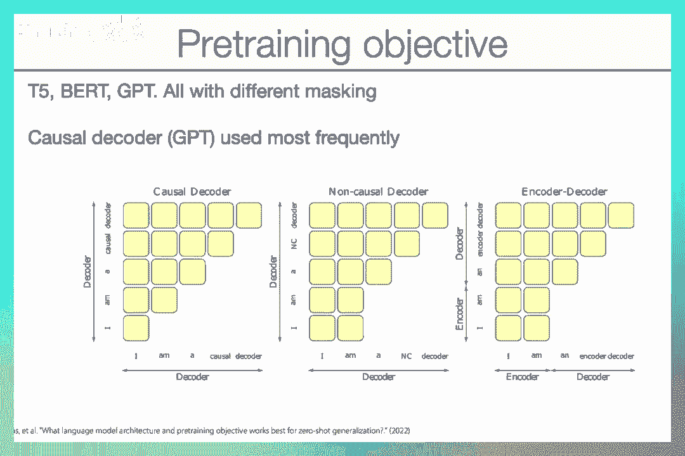

可扩展性的，所以我想你们中的许多人，可能已经考虑过 Transformers 的不同，替代架构，并想指出，有一篇论文表明，您知道这个，arber 或许多其他非常，有趣的想法，您知道替代方案，如果。

我们绘制出你知道的架构，你知道预训练，日志的困惑度与我们，在，训练过程中花费的失败次数的关系，绿色L代表，香草，变压器，红线代表，许多其他呃我说非常有趣的，想法嗯替代模型和大多数。

嗯你知道 他们的扩展性不太，好，嗯，这是下游的，性能，如果我们看一下 B 流，性能，嗯，大多数其他，架构 es 嗯，Transformer 的表现似乎不佳，所以在，你的研究过程中，嗯，我强烈。

建议嗯检查一下 这个情节是，你如何知道未来的新，想法呃针对嗯失败的比例，他们是不是比vanina变形金刚有更好的比例法则，我认为最好检查一下，嗯和这里展示的许多U模型，实际上对于某些情况非常有用。

所以呃，如果你感兴趣，我，会鼓励你检查一下它们。

这是非常酷的，工作，所以我想讨论计算成本，呃让你了解我们如何估计，计算成本，这非常有用 对于，后面的，幻灯片，是的，你是除以，小 b 还是乘以，小 哦，所以是的，所以这是，除以小，D 是的，所以是的。

所以在这里，我很，抱歉，这是 s s 代表，序列镜头，它被除以，六倍 小 D 和 D 是隐藏大小，所以这并不是说如果我们，增加隐藏大小，我们就不能获得，更低的计算机成本，这是不正确的，因为总参数 n。

大写 N 呃你知道你有很多，矩阵对呃所以总参数，与小 D 成二次方缩放，所以它实际上，与你的参数数量呈线性关系，所以较大的，模型具有更多的计算机，成本这是 MLP 的隐藏大小，这是。

MLP 的输入或 uh 的隐藏大小，投影维度 MLP 的隐藏大小，通常是小 d 的四倍，在 MLP 网络中拥有这个扩展因子是的，所以我鼓励您手动评估这个，公式，您知道您，可以并计算触发器的，参数数量。

这很好，做这样简单的呃，练习，嗯，好吧，对于 Lama 语言，模型，其中 s 是 UN，比如 4，000 或，2000，维度 D，通常约为，4，000 甚至 8，000，所以 s 比典型的 D 的。

六倍小得多，我们可以想到 计算成本溢出，与数字，参数和，代币数量的乘积成线性关系，因此如果我们插入 70 亿个，参数和 2 万亿个，代币，我们可以看到失败率是，相当疯狂的，它是 10 的，22 次方。

所以这就是问题所在 我们将，花费大量的，计算和训练语言模型，并且我们知道它与数字参数模型大小的乘积呈线性振荡，那么我如何分配我的模型，大小，我应该将我的计算机分配给，模型大小还是。

人们试图发现是否存在，一个我想说的缩放比例，l或者缩放，假设人们训练具有，不同大小的模型不同数量的，标记这些是浅蓝色镜头所以，人们训练你知道就像一个SP，不同的计算这是 xais，然后他们检查。

一些看不见的数据，集的测试损失，然后改变模型大小，和数字标记，这样他们就会得到，不同的嗯，你知道就像蓝色镜片，然后对于每个蓝色镜片，你知道，每个蓝色镜片 代表一个，正确的配置，这样我们就可以选择。

最低点，你知道，这个配置的最低点，比如我们，可以为此特定配置实现的最佳损失，你知道这个，特定的模型大小或，令牌数量，然后我们可以绘制黑色，车道 你知道这基本上是，最小的l。

l 事实证明这是一个对数对数呃，相关性你知道它更像是一个，幂，LW你可以通过你，知道做回归得到系数你可以通过这条，黑线你知道针对计算的测试损失，是的，这告诉我们，这似乎是，每个单独因素和。

性能之间的低幂关系，如果我不受，数据大小的限制，那么我分配，参数数量的最佳方法就是你知道的，插入 L 你知道，就像我们看一下，中间的图一样，这是，测试 L 等于你知道的东西，变量是 D 个标记。

所以如果，我不受模型大小的限制，那么，我可以保留 增加数据，大小，然后我得到这个线性，减小的，l，所以我们知道，如果我们，不受另一个因素的约束，但。

实际上我们受到其他因素的约束，那么我们知道令牌和参数的最佳数量如何缩放，因为我们希望我们有固定，数量的 计算说，现在我们知道，每个单独因素的最佳缩放比例，并且您知道令牌和数据，侧，您知道模型大小和数据。

侧，并且因为我们知道计算说，等于您知道的东西 6 * n d 我们将，它们插在一起，然后我们知道，幂低系数 a 和 b 等于，1，所以现在我们知道它们等于 1，然后比以前更简单，但是，我们如何分配。

计算，在，gpt3 出现之前，有很多研究这方面的论文 OPI，写了这篇论文 实际上这篇，论文缩放知道神经语言，模型，它显示为该表中的第一行，所以我们发现，您可能希望将更多，的，计算分配给参数数量，因此。

您认为应该训练更大的模型，而不是训练更多 数据，稍后，第二行是另一篇论文，稍后我将，了解更多详细信息，它，使用不同的数据状态运行了一堆不同的实验，他们发现好吧，可能它们，大致相等，你知道也许。

数据集数据数量嗯任何数据都更多，很重要，因为这是第 51 点，我想说最好的，做法是训练不同的小，模型和数据大小，你可以自己拟合常数，你。

可以这样做，训练一堆你，不需要真正训练的小模型 大 B 模型 ENT TR，非常小的模型，具有不同，数量的令牌，你会得到一堆，蓝色车道，选择它们的最低点，绘制，黑色车道，然后你可以适应这个，常数。

这就是我建议，你的研究或者你知道嗯其他，目的 这是最，可靠的，你不能在论文中查找它吗？其他人你自己有什么不同。

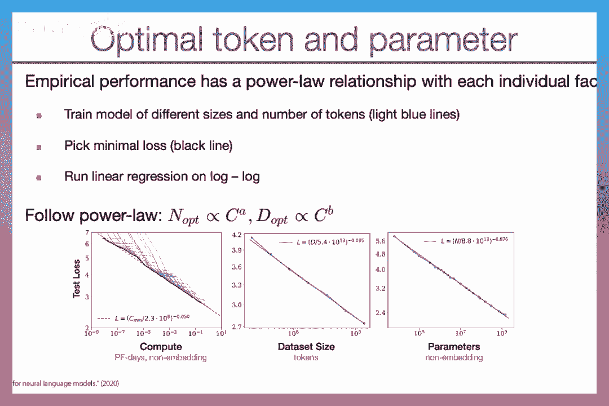

好问题，所以，这里的表显示这些，常量高度依赖于，数据，方面，并且由于这些数据集，不能正确获得，所以我们不这样做 不，知道打开我们的 de 使用的数据集，嗯，你知道我过去的研究喜欢什么，数据集。

我使用的数据集可能，与人们发表的其他研究论文不同，所以最好的方法是，自己拟合常数，然后，你可以说服 呃，你，知道你的研究想法的读者确实技能。

很好，所以后来发表的 Chinchila 论文，表明，好吧，你，知道，事实证明，也许我们应该为，数据分配更多的计算机，并且，应该训练更多的数据，而不是你，知道的 增加我们的电机尺寸，这。

是 Wily 今天采用的，所以这是一个，非常好的嗯估计，我也，检查了这是否适合嗯，你非常了解大多数数据，集，所以这个图显示，如果你遵循这个技能定律，这个龙猫技能。

定律很多 在chincha之前发布的模型，他们说gp3，威震，天玩家这花费了更多的参数，所以方法一方法二方法，三这三个名称，根据chincha SK知道略有不同估计因为因为你，知道当你训练模型时你有。

一点不同 比如说超，参数等等，最后你的，估计有一点方差，但是所有这三行都表明，当时的大多数现有模型，浪费了他们的，计算并增加了电机尺寸，因为这三颗星它们都是，这样的，比你知道的三条线高得多，所以这不。

理想，虚线是什么哦，虚线，是原始的 OPI。

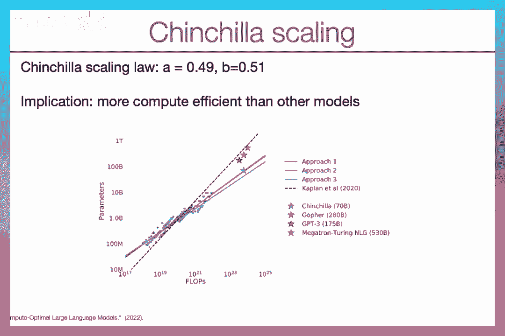

比例，所以基本上是这里的第一行，所以他们在电机侧放置了更多的重量，你可以说 3 是的。

所以 事实证明，在了解了，大多数模型之后，遵循了，这个规模，你知道他们增加了，模型的参数数量，我们得到 dg3，1000 亿超过 1000 亿，然后，格雷尔几乎是 3000 亿。

威震天就像 5000 亿个，参数是的。

所以 这更像是一个经验，观察，所以人们单位说，就像斯基林定律，但我想说，这更像是一个缩放假设呃，我们发现你，如果你训练不同的，模型，看看最小损失，你，知道你可以实现的最小损失。

对于某些Compu权利来说，这是，第一个，数字哦，再说一遍，关于为什么是，parel的任何见解，是的，很好的问题，嗯，是的，我对，为什么parel在实践中成立，没有很好的直觉，嗯，我会，说，首先。

它不会 是，指数对的，因为这，将是非常疯狂的花费，更多一点计算机指数更，强大的模型所以它不是，指数那么它可能是指数，对的倒数，是的，我会鼓励，对此进行更多研究，例如了解为什么，它经常 似乎平行的时间。

在物理数学，和许多其他感官领域中广泛存在，所以，嗯，是的，这回答了你的问题。

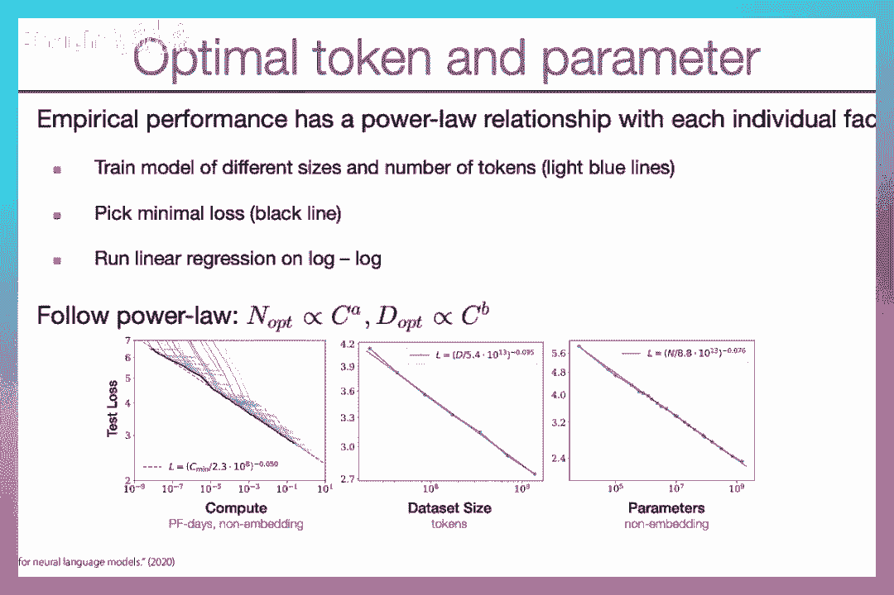

好吧，很酷，所以我们涵盖了，法律中的基本知识，我希望这，对你的工作或研究有用。

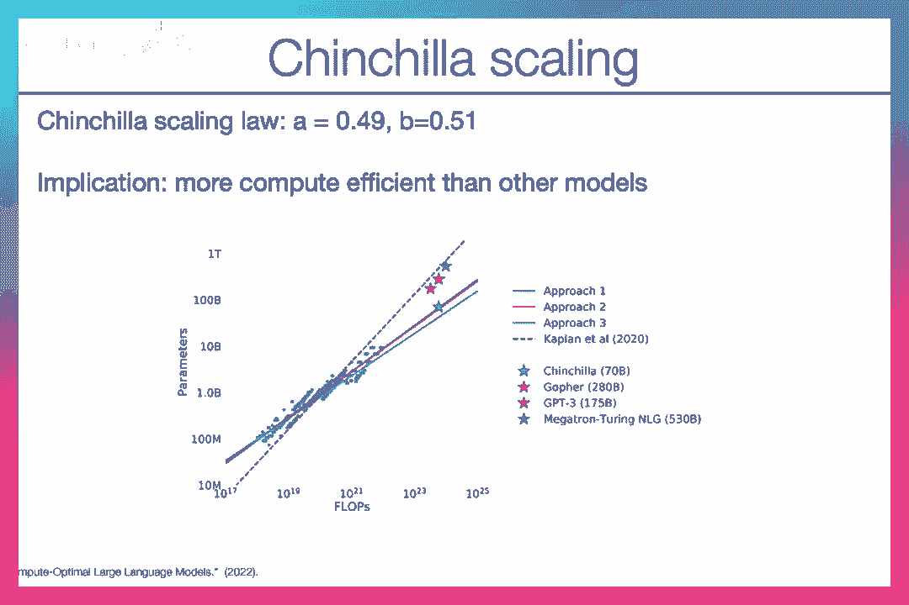

嗯， 事实证明，如果你明智地分配你的，计算，那么这个图表明，通过花费相同的，计算量，你有两个模型，好吧，chinchila 和，grafer 如果你遵循 chinchila，Skilling 模式。

他们有一个更好的，模型，x 轴是 一堆不同的，语言建模，任务好吧，人们关心这些任务，y 轴是 CH L，比该任务的 Grafer 模型好多少，我们可以看到大多数，任务的情况。

因为我会说在 10% 到 10% 之间，性能提高 30%，花费相同的，计算量，你会得到更好的。

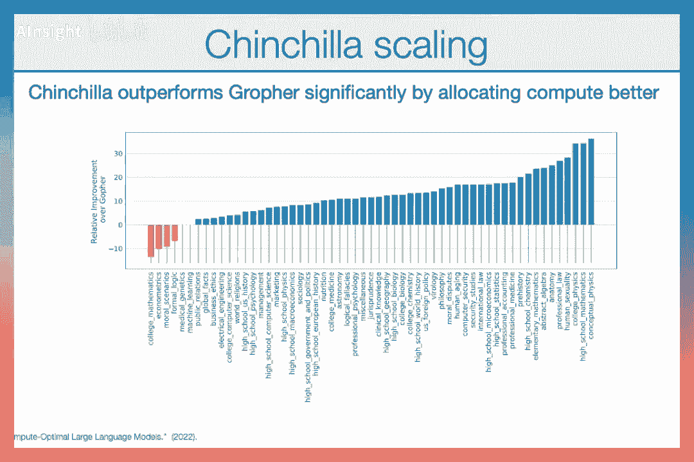

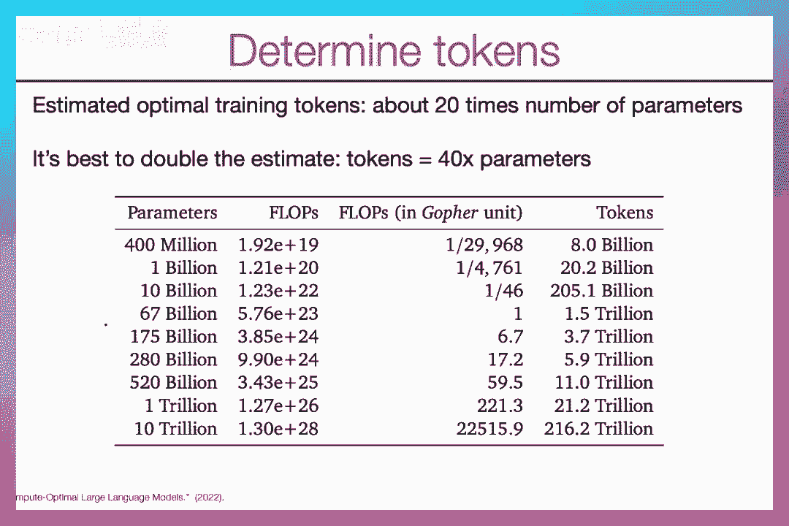

模型，是的，总是会这样，还是只是，这一个观察结果，但模型，不同，是的，我想，如果你将，下巴与其他以前可用的，模型进行比较，我想你会得到一个 不同，你知道呃这个情节是的，这不是一个非常具体的我。

会说我想说的是是的你，可以看到大学数学，有点差对嗯，但是大多数其他任务，比如其他，任务，也看推理，比如，高中几何 高中数学 是，的，是的，所以我想说，如果你想要得到像模型一样的模型，它。

始终优于所有任务，那么，是的，我认为这取决于很多因素，而，不仅仅是你知道的技能，而，不是告诉你的技能 你如何使用，你的数据集进行计算，但如果数据集，可能比其他数据集更差，你，知道也许是另一个模型。

你训练出，更好的数据集更高数量的数据，这种缩放不能保证，你有一个更好的模型，是的，是的， 更主要的是，关于你如何使用你的计算机是的，是的，确实知道。

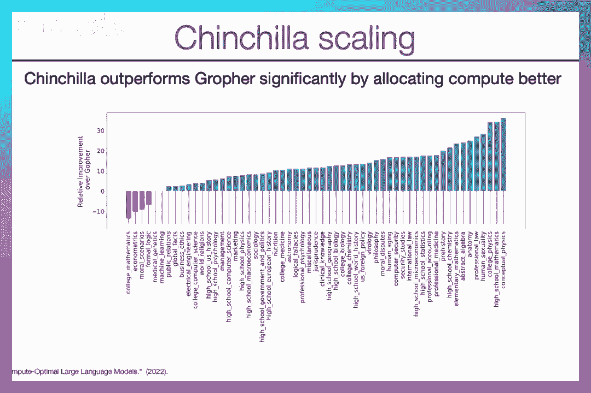

画一条线就像外推法，你，怎么知道之后如何，知道，也许在那一点上，这是一个非常好的问题，所以我。

想说有些人使用 我看到的法律中的字尺度。

更像是一个假设，你，知道，呃，你看看这些线，它们，不平坦，它们不饱和，你，知道这似乎对你有帮助，x轴是对数尺度，所以看起来像，这个U功率低 在不同的尺度上都成立，所以人们假设好吧。

假设这对于 lat 来说是正确的，比如 10 倍或 100 倍大的，尺度，但是我不能确定，假设我们将，计算规模扩大，一百万倍，你知道，这个 GNA 是否 伤害是真的，很难，说是的。

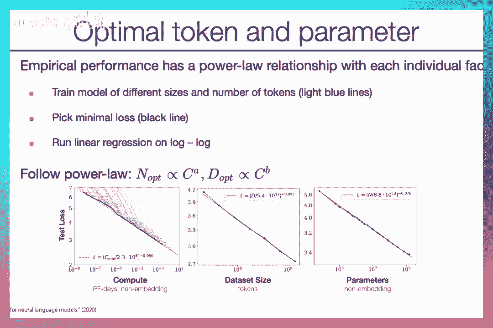

很好，所以现在假设您想做，一些研究，一些与，语言，模型相关的工作，并且您意识到您不想，训练一堆小模型来修复，常数，就像它一样 这是很多，工作，有简单的 samp 规则，我可以，遵循是的，所以变更。

文件显示了这个，表，让我们看一下第二，列和第四列，第二，列告诉你是否有这么多的，失败次数要，花费，而第一列 第三列告诉，你知道的模型集，如果你有，4 亿个参数和这么多的，失败次数，那么你可能想要花费。

80 亿个代币，好吧，这是一堆，建议，然后我们可以很容易地说，代币的数量大约是 20 个，乘以正确的参数数量，这是一个很好的规则样本，但我，想说，在实践中最好将此估计值加倍，因此，如果您要训练 10。

亿个，模型，您可能需要 TR 400 亿个，您知道的令牌，而不是 20 倍，40 次为什么这只是一个建议，我觉得你知道，如果有人，在他们的研究论文中展示这一点，或者你，知道工作，那么是的，我想我和许多。

其他大多数人都会相信，是的，这是一个，这真的。

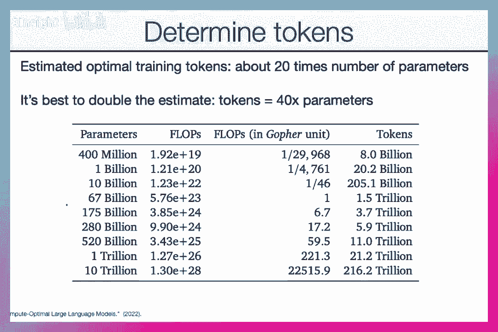

令人信服，这是一个 不错的选择，是的，很棒，那么这是否，意味着我们必须让您知道，呃，选择 40 倍的代，币数量，您知道我们将采用 CH 10，亿个模型，那么我们将使用 400，亿个代币。

我可以吗 当然使用，更多，所以现在人们会做一些，称为“推理最优”的事情，假设您有，大量计算，那么您想要，远远超出 CH 最优，所以，对于前面提到的 70 亿个模型。

我们可能想做 20 到 40 个 参数数量的倍，所以，大约是，嗯，你可能知道 4000，亿个令牌，我们可以看到，他们训练的这个喇嘛喇嘛语言模型，你知道一万亿个，令牌，动机是我只。

需要正确训练这个模型一次，然后 我可以拥有一个非常好的，推理模型，所以如果我有一台，有价值的计算机，为什么不花计算机来，训练模型很长一段时间呢？因为在推理时，你，只需支付 70 亿个。

模型或任何模型大小的成本 你，选择你只需要支付，该，模型的计算机成本，当你增加参数时，你在哪里，增加，它们哦，你使模型的隐藏尺寸，更大的层数是的，嗯，这，取决于是的，你知道你可以增加，隐藏尺寸。

或者你 可以增加，层数或同时增加两者，呃，通常你会增加弓，是的，mod，就像模型尺寸有一个缩放L是的，比例就像模型，尺寸的增加是的，嗯，你可能想保持，层数之间的比率 当，你增加模型参数时。

你的隐藏维度就，固定了，这是，一个很好的，做法，因为在，网络卷积的早期，是的，但是你不想，以后增加数字太多，因为在，推理，[音乐]，时间，如果你增加，层数太多，它是，连续的，你有点平行，你有点，瘫痪。

层数，所以它减慢了你的影响，但你也不想保持你的，层数固定并不断，增加你的隐藏维度，因为你的 网络需要一定的，深度才能成为一个好的近似器。

好吧，所以这是一个有趣的观察，我，想说的是，损失最终，成为性能的决定因素，所以现在假设我们训练了，sbilon，模型，并且我们还训练了这个 7650 亿的，模型 如果我想。

在更少数量的令牌上训练更大的模型怎么办？好吧，因为它更昂贵，所以也许我可以我只想在，更少数量的令牌上训练我的模型，我会得到相同质量的，模型还是我会得到一个 更糟糕的，模型发现，如果我们，在这里画一条线。

好吧，这条，红线，你知道这基本上是，相同的训练损失，你可以将，其视为测试损失，因为在，训练期间没有，重复数据，所以所有数据都，在这里训练 它更像是一次训练，因此，训练损失几乎是测试损失，因为。

损失基本上显示了模型，在新的未见数据上的表现，因此您可以将，其视为测试，损失，如果我们查看不同的，模型大小并选择其中的点 他们，得到，相同的列车 SL 测试，损失 我们可以说，对于。

对应 2000 亿个代币的最大模型，对于，对应 1，万亿个代币的最小模型，现在让我们转到右边的，数字，即较小的，数字，我们检查 2000 亿代，币和所有 100 万亿，代币看看这个红十字，点。

我们可以看到，我们得到了，完全相同的下游性能，即，带有流行基准的琐事 QA 测试，而 H SW 是另一项我没有经常使用的相当，困难的，任务。 不要在其他任务中检查这个，但我可以粗略地说，这。

在不同的下层房屋中都适用，所以这是 R 谎言，所以在，实践中，当你有一个新想法或者，你要为你的公司训练一个模型，等等时，你知道 如果数据集，相同，那么如果您使用，任何模型获得较低的损失，无论，模型。

大小如何，您都会获得更好的性能，并且如果，您获得相同的损失，您就知道这，两个模型的性能大致，相同，所以这个数字 可以回答，前面的问题之一，关于如何缩放不，保持更大的规模是的，我，想知道像火车一样。

令牌是，随机采样的，或者是，基于类似的数据，因为我们只有一个 EO，我们是否，使用低质量的 首先数据，然后就像我不知道想象一个更好的，数据是的，是否存在某种，散射，或者就像随机，抽样，整个是的。

所以我们R我们做随机抽样，呃我们没有低质量的数据，并且知道我们把 首先，呃，你，不想在预训练中放入较低质量的数据，因为我，认为数据太小了，是的，你在互联网上有更多，有价值的数据，困难的部分是你如何担心。

互联网上的这些数据，几乎是无限量的，代币月，但有些数据，可能不是那么好，所以一个好的，启发是维基百科确实是很好的，数据，因为你知道你可能花了，很多精力来管理它们，所以但，假设我不知道 也许一些随机。

网站不是好的数据，没有，太多的知识，所以你需要训练一个分类器来，检查这些数据是否与，维基百科相似，你做一个，分类基本上是，针对维基百科进行校准，如果你这样做，你，就有更多的可用数据 那么。

你可以你可以训练所以嗯，所以通常我们不会将嗯没有坐标，数据混合到训练中嗯和嗯对于，问题的第二部分就像我们做，任何类似课程采样嗯到，我的最好的嗯看起来像 人们不会这样做，嗯，你知道，我们的目标。

是最大似然，嗯，如果你从你的分布中均匀地采样你的训练数据，这可能是最好的，而不是，让，维基百科的第一步在维基百科上训练后我们，继续前进 也许珊瑚或其他什么权利，这可能不是一个好主意，呃，是的，这个答案。

很好吗，所以这张幻灯片是关于你，知道的，我几乎决定了，性能，所以这张幻灯片显示，在，实践中，SC 可以，预测未来很长一段路 对，如果你看，一下x轴，它是对数标度L flops，它将，在很长的。

范围内保持正确，所以，嗯我想谈谈一件事，嗯，这是关于序列，M的，它是一个主要的底部，就像在语言模型中一样，或者一般来说就像多模型，模型一样，所以，我们想要对，单词进行建模，而不仅仅是文本，所以在世界上。

我们有很多，视频，或者如果你想尝试，使用反复试验，经验的人工智能代理，如果你想的话，我有很长的，轨迹 理解，代码库、超链接网站或，通用，序列，所有这些都需要每个序列，数亿甚至数十亿个标记。

我们无法将其放入，Transformer 中，因为 Transformer，注意力具有很高的内存，成本，因此块式并行 Transformer，是。

进一步分解 LM 的想法 Transformer 的计算图，因此，张力，通常通过对，成对交互进行建模来发挥作用，您拥有结束标记，您可以正确计算 N 到，n 的，注意力权重，然后将此，注意力权重与。

您的值矩阵相乘，因此该注意力权重，矩阵具有二次内存，成本 如果你，想在每个序列上处理数百万个令牌，这并不好，二次，意味着你知道我们甚至无法将此，序列修复到 GPU 或 TPU 或下一代 TPU 中。

抱歉，是的，这是一个好点，是的，我们，可以对序列进行分块 然后每个 GPU，每个设备都持有一个块，这是一个，好，主意，一个问题是，注意是 n 到 n 对，任何建模，所以 gpu1 只有一个，块。

但 GP 这一个块也需要，关注任何 其他，块，但其他块，在此设备上不可用，因此您需要，收集它们，您需要将它们传，回设备，因此最终您的，设备仍将保留四个，序列，但我们无法保留四个，序列 在一台，设备上。

所以我们的想法是，我们可以重新组织计算，顺序，想象一下您要，计算 N byn 矩阵，您可以取一个，切片，也可能取一个行切片，您知道 y 轴是查询 x 轴，键值 正确的查询尝试到键值。

这就是你的注意力矩阵，你，围绕，查询进行幻灯片，现在你有一个小得多的，矩阵，为了计算，这个矩阵，你可以沿着，键值，序列偶然地进行计算，这被称为内存高效，注意力和块式变压器，表明，由于我们要分解，计算。

您知道我们有两个循环，每个循环对查询进行一次循环，每次，迭代负责一个切片，并且在内部循环中，我们迭代，键值，序列，以便当我们完成其中之一时，内部循环我们有，特定幻灯片 quy 切片的输出然后我们可以。

继续进行 MLP 计算我们，不需要等到注意力，完成对整个输入，序列的计算我们可以我们可以继续进行 MLP，计算 特定的切片。

这样做可以得到更低的内存，成本，我想在这里花一点时间，这样我可能可以稍后再回到这里，这基本上是对内存成本的分析。

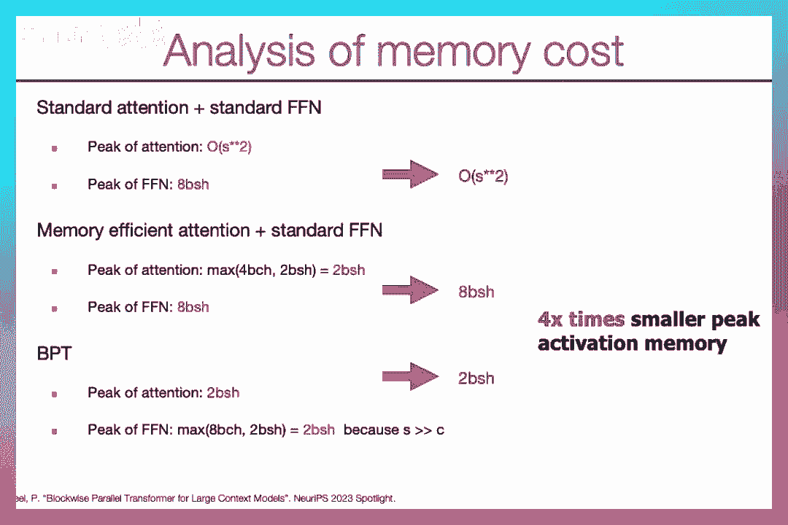

并且可以，稍后取回，这张幻灯片显示，如果 我们，在实践中对此进行了评估，确实我们，获得了更低的内存成本，作为回报，我们可以训练非常长的。

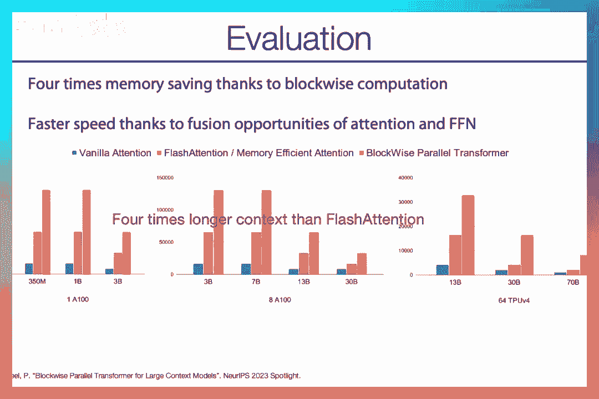

序列，这对于不同的，模型都是如此，谷歌最近的，GMA，模型，如果你应用这种技术，你的内存成本会降低 16 倍。

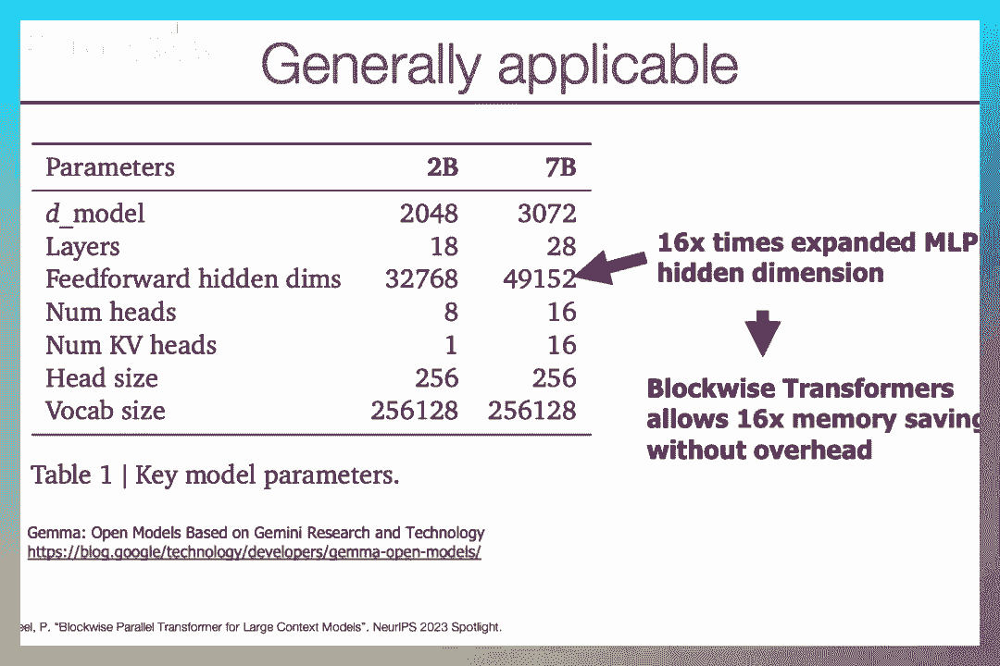

基本上是 6 倍 更长的，序列，但这对于，Dominion 序列，序列来说还不够，因为内存成本仍然，与 Z 序列呈线性关系，然后，由于物理，限制以及在前面提到的问题之一中使用多个 GPU。

我们无法构建任何大的芯片 ARR，你知道基本上，沿着 uh 到多个 GPU 的序列中的 chunk 没有帮助，因为，注意力需要成对。

交互，事实证明我们可以将，查询循环分布在，不同的，设备上，然后我们在设备之间传达 Q，值，这与 L，均匀块有什么不同 序列并将，它们分布在 PE 上，关键的区别，在于，现在心理通信的顺序要，小得多。

因为当我们迭代键值，序列时，我们只需要下一个，设备中的下一个序列，而不需要来自下一个设备的所有，其他序列 在所有其他设备上，当我们执行当前的键值时，我们可以，从下一个设备接收下一个键值。

然后同时我们可以将，副本发送到前一个设备，就像在一个环中一样，您有，多个设备，您可以在那里，构想 它们作为一个范围，每个设备与，附近的，设备进行通信这里的关键见解是可以，通过使用块式变压器完全重叠通信。

我想我想，在这里提到asmatic强度所以什么是athematic，强度它代表了之间的比率，计算和，通信所以假设我将一个，矩阵两个矩阵发送到，TPU，这两个矩阵需要一定数量，的字节才能进行，通信。

并且 GPU 进行矩阵，乘法，我们将需要，一些，触发器需要一些时间，所以，触发器的数量 需要除以，你需要传达的购买数量矩阵，它被称为asmatic，强度，这个表在这里，我们，稍后会回到他们，因为。

我想谈论一些其他的东西，这里的要点是，在，我们重新组织之后 计算，图可以很容易地，重叠所有通信，成本，因此使用多个 GPU 训练和，每个序列数百万个令牌，不会产生任何开销，因此您不必。

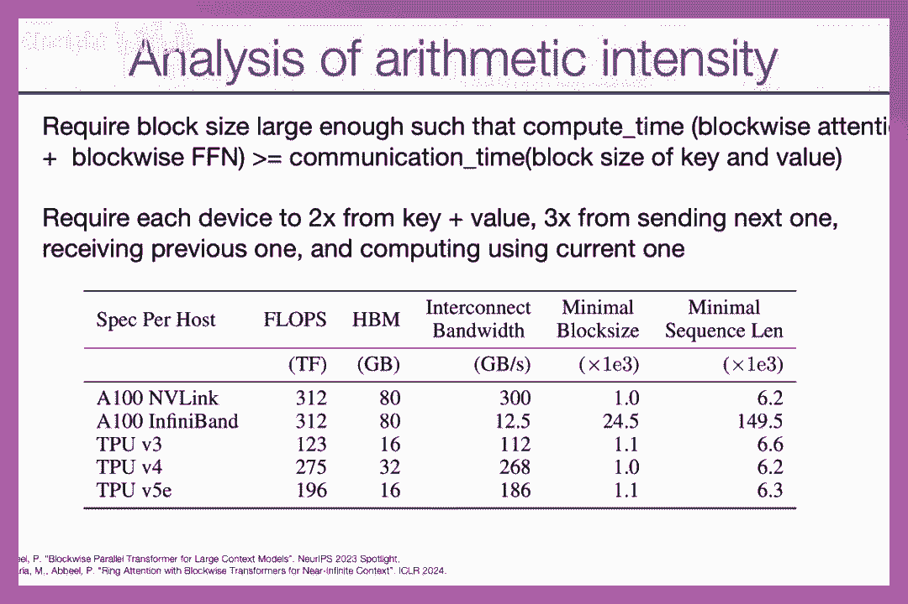

为此支付额外的费用，请保持，这个数字显示，在，端到端，使用块式 Transformer 和，renion 进行大规模训练，您可以执行，比任何先前状态 Mars 长数百倍的序列 L，因此本质上您仅受。

tpus 数量的限制，并且没有，瓶颈，您可以，TR 到几乎任何更长的序列的接触大小 L，你可以在视频上进行TR，你可以在，整本书上。

进行TR等等，我想我们可以在这里短暂休息一下哦，是的。

问题是的，它是精确的注意力，并且，与近似值兼容，因为我们基本上将端到端的，交互分解为片段，就像一块一块地，所以如果你，想应用某些近似，技术，你可以应用，它们，是的，是，的，这是一个很好的问题。

因为 R 注意力适用于，推理案例，所以我们可以将你的，键值缓存跨 div 不同的，设备分割技术页面数据，您提到的注意力是为了管理，内存中的键值缓存，更好地，在内存中放置，所以我认为它们是，互补的。

为什么要关注我如何，跨设备分配真正的乐清现金，一个关注页面数据，一个关注关注我，如何更好地，管理 每个设备上的内存布局。

所以是的，所以它们是免费的，所以我想简要讨论，一些多模型，然后下一，堂课我们将深入研究，因为我们可以进行军事和序列，建模，因此很自然地不仅可以对，您知道的文本进行建模 我们有书，我们有 L，段。

但是世界不仅仅是，文本，世界不仅是人类，发现的知识，它还涉及，虚拟世界的动作等等，所以用块来，模拟整个世界的版本和。

文本是非常自然的 通过，Transformer，fion，我们可以获得高效的 100，万上下文，窗口，这是一个，测试，模型在，从输入上下文中检索事实方面的性能 x 轴是。

范围从 1K 到 100 万的输入镜头，y AIS 是随机，放置它的位置 事实和绿色，代表模型，准确地检索了，事实，因此该图显示模型，确实可以有效地在一个最小，上下文。

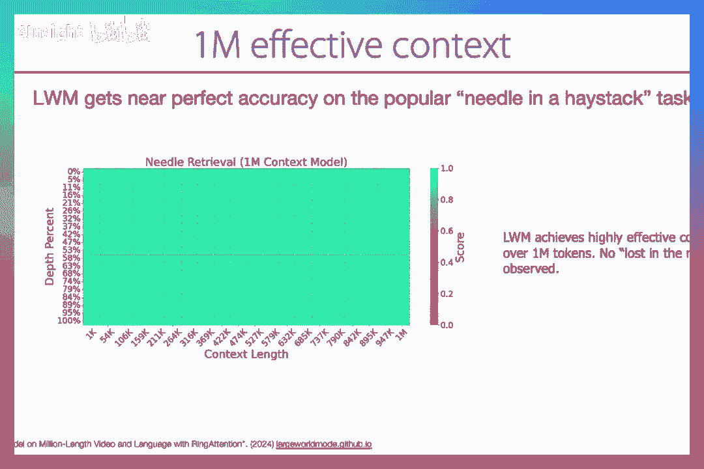

窗口中发挥作用，并且该模型，优于 GPT 4，并且 gam，L gam light 在整个上下文窗口中获得 50% 的准确度，并且 GPT，4 可以 最多可以执行，100K，通过这种，技术。

现在可以执行，数百万个。

SE，在我们的下一堂课中，我们，将对此进行更深入的研究，这里是，一些快速预览，说明，如果您，训练自动回归，模型，您可以做什么 以及文本和，视频 该模型可以生成视频 可以，生成文本，图像 你可以理解。

有关所有这些模式的问题，这个，例子可能不像 Sora 那样令人印象深刻，但你可以轻松地扩展这个自动，回归模型，我们讨论了，前半部分，讲座 Alo 回归模型扩展得非常，好，现在您还可以对，极端 L。

序列进行建模，因为它的，Al 模型可以回答您有关，输入的问题，无论是文本图像还是我们的，线路，视频，更短的上下文模型，如 gp4，Gemini，无法，理解最近的 G 1。5，模型非常，令人印象深刻。

他们还将这个上下文，L 缩放到 100，万，这两个图，显示了 LW 如何在序列位置上缩放，有趣的是，所有这些曲线都表现，得像，平行，但 x 轴不再，计算序列维度，它更像是 序列，位置现在我们看到。

当你构建更长的上下文窗口时，模型得到的预测值始终较低，因此 M 更好地理解文本，更，有趣的是，对，代码的理解越深入，你可以看到，右图是代码上的损失，代码 代码确实很复杂，因此，通过调节更多上下文。

模型可以更好地预测代码，您可以，看到趋势长期停止，并且在，1000 万个位置，它，甚至超越了拟合曲线的缩放能力。

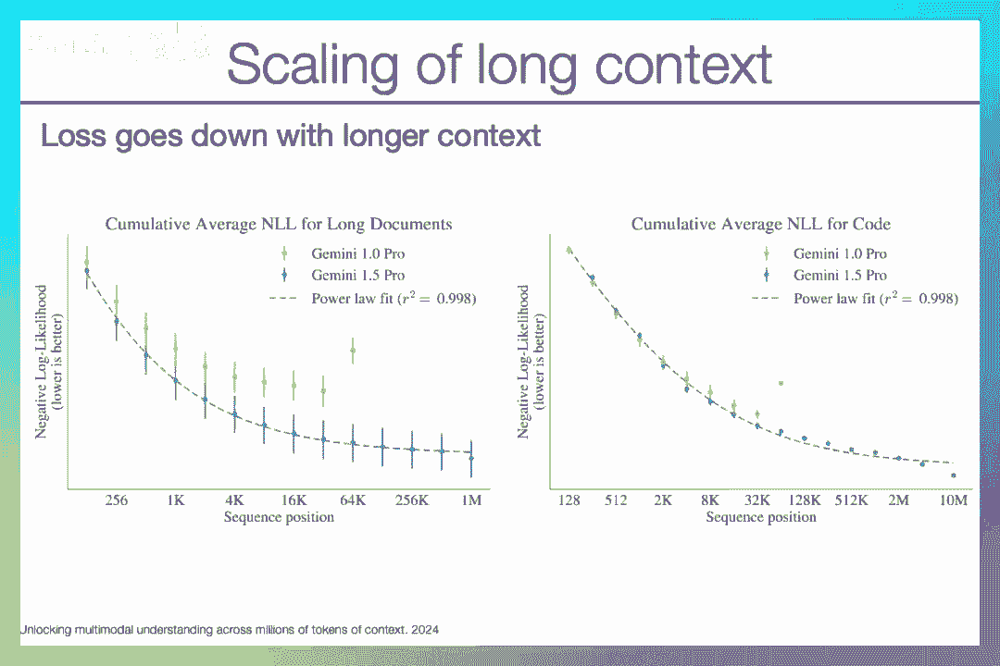

因此这个 FR ger 1。5 他们表明，使用一个 Min cont 导出可以直接，分析整个代码，reple，所以现在我们距离。

生成整个代码，库并不遥远，我理解非常复杂的，文档，例如 1，000 多。

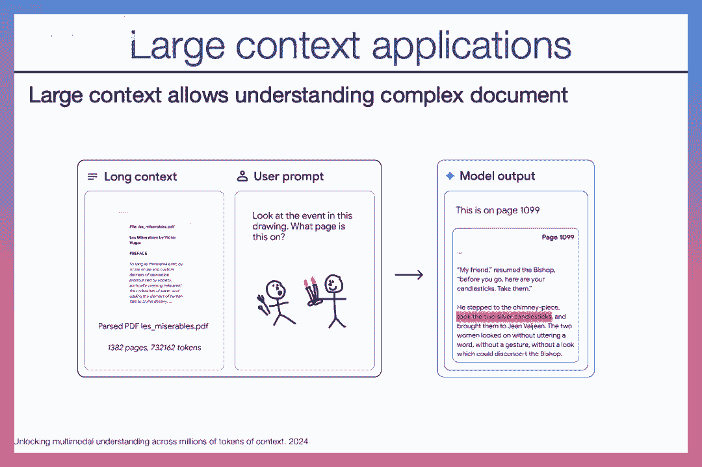

页，并且他们的模型甚至可以，从最先进的技术水平输出，Whisper Whisper 对于那些不，知道的人来说，这更像是 OPI 的音频到，文本模型，而这个 Sho 是，端到端的强大通用解决方案，您训练。

单个模型和所有不同的端到端，模式，并且该，模型的性能比 如果你，训练两种不同的艺术模型，Whisper 和 gp4 将它们放在一起，那么，通用，解决方案会更糟糕，令人印象深刻的是，你可以进行低资源。

翻译，所以有一种称为，caman 的语言，基本上只存在，250k 代币，这就是数量，这个世界上可用的标记，对人类来说确实很难，理解，但如果你把这本，语法书放在上下文窗口中，所有可用的，信息都会显示出来。

这个人工智能模型可以，翻译，可以，非常好地理解语法，表现优于，人类 专家用这种。

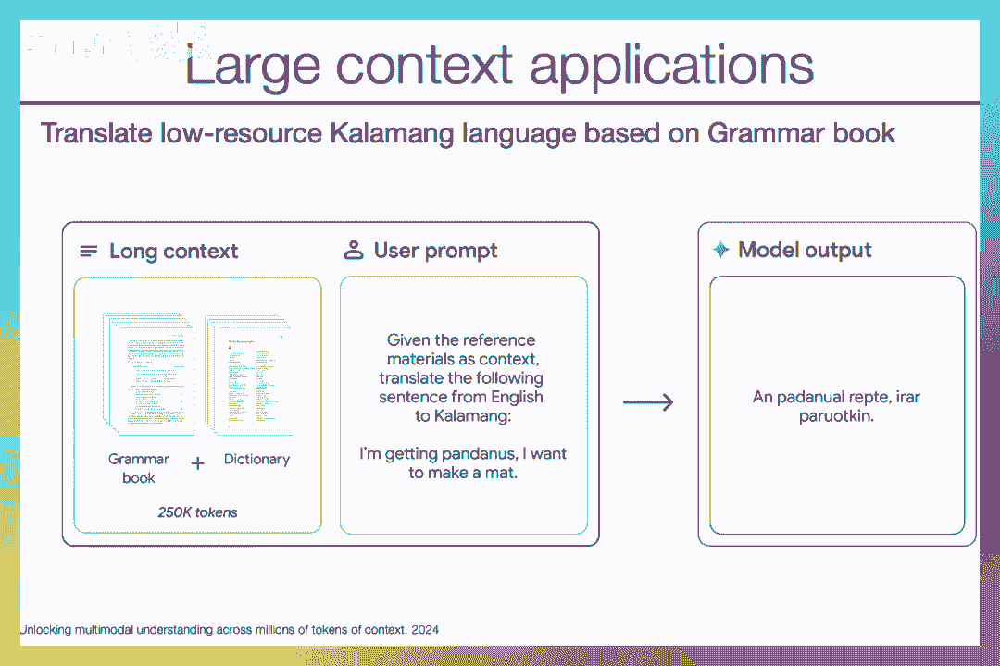

语言说话，所以这是关于更长的，序列现在我想谈谈其他，一些，事情，嗯所以这被称为闪光，注意力，嗯平面注意力是关于我们如何，在训练期间减少数据移动所以，之前我们讨论了如何，重新组织注意力计算，图形。

但在更多的，机器中，我们有一个，层次结构，我们有非常快的 GPU 运行，我们有一个更大但慢得多的，内存，称为，hbn，hbm 是我们的内存，你知道，就像 A180 gabes 一样，这就是，hbm。

当你进行计算时 你，想将你想要的任何张量加载，到 s r 中进行矩阵，乘法，但 Sr 很小，非常，昂贵，你无法构建一个真正大的，Sr，所以这项，工作，设计它们基本上实现一个你，知道的 Cuda，实现。

明确告诉，编译器可以保留这个 ATT 张力，权重，你知道 S1 中的一个块不要将，其移出到 hbn，因为，注意力权重乘以，Rue uh 矩阵非常简单，但这需要。

um 更好地计算更好的 scut，所以这可能是，um，更好的可视化呃，计算是如何工作的你有查询块和，关键值，块，红色的显示哪一部分，应该存储在 srun 中，原理是你接下来需要的任何东西，你将其存储到。

你不想移动的 Sr 中 来来，回回，因为这需要，时间，好吧，这就是。

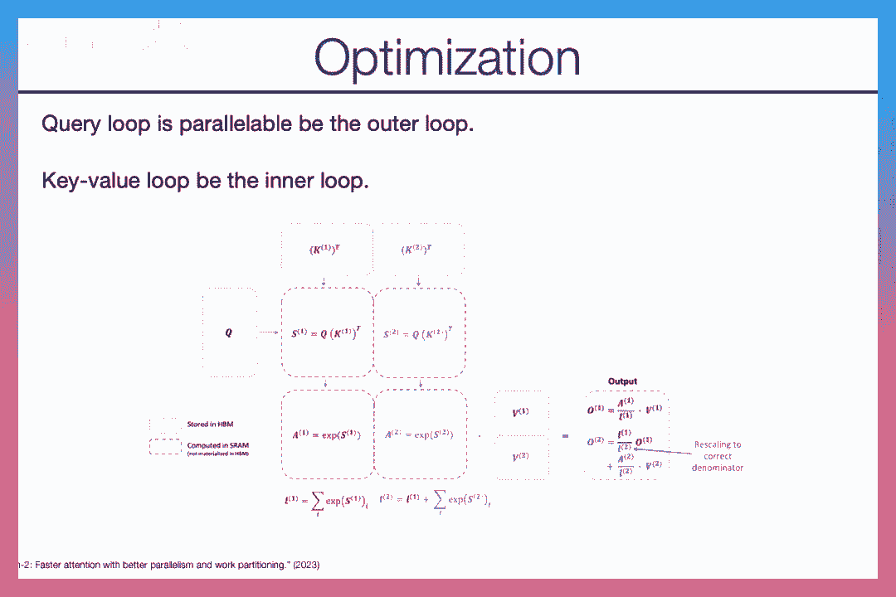

原理，这被称为 Flash，Attention，它优于 vanina，pyou 构建的注意，计算和，Flash Attention 计算，它们以某种方式，选择将键值作为外循环，查询作为内循环。

但是 正如我们之前，提到的，咖喱是相互独立的，所以咖喱应该是外循环，这样，你就可以最大限度地减少沟通，这样也更简单，所以突然，他们切换了这辆自行车，这再次带来了另一个非常。

重要的，提升，所以嗯工具我，使用和，检索你知道，仅仅训练一个语言模型是不够的，然后我们希望这个，语言模型可以做，所有事情，因为我们没有，语言模型，无法访问，它所训练的最新信息 在，你之前。

策划的数据集上，然后知道一些分形知识，因为你真的很难，最小化你的损失，因为你知道零，对U，所以模型不会压缩所有，派系，图像，因为我们想要构建一个真正，有能力的模型，我们希望 这个模型。

在利用外部工具方面和人类一样聪明，所以这方面有一个广泛的研究领域，但我只会给出一个关于，检索的例子，但你可以稍后查看一些，关于嗯其他。

令人兴奋的，研究的参考资料，所以这是一个 名为“retro”的论文，旨在从，给定的数据集中检索信息好吧，这个想法，可能是一些未，在语言模型中编码的信息，但可以以，某种方式检索以改进，语言模型。

预测这个想法是火车，出生你知道 一个非常小的，模型，然后他们进行 K 年劳动，检索 我的意思是，你，有一个输入标记序列，你，通过出生，嵌入运行它，你还运行数据集 bir，eding 有这么多的编辑。

你做了，kers 劳动检索 找到劳动，并将这些劳动放回到，这个神经元网络中的交叉注意力中，所以它不仅仅是自我关注，它还，参与检索，邻居好吧呃，这就是这个。

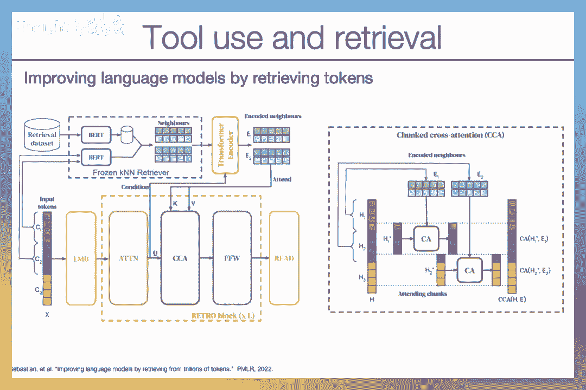

想法，这是一个检索，部分，你可以在你基本上可以缓存之前，数据集的嵌入可以节省，计算，然后运行冻结的 K 和。

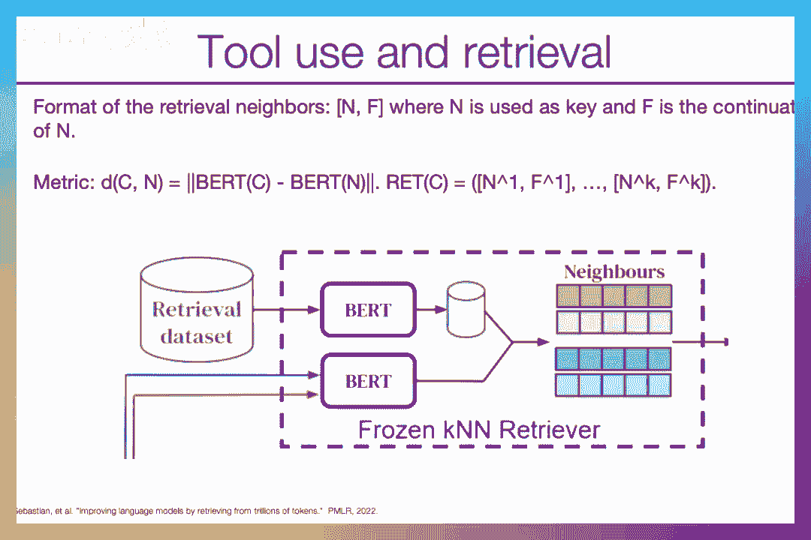

检索器，他们设计了一些方法，来加速，计算。

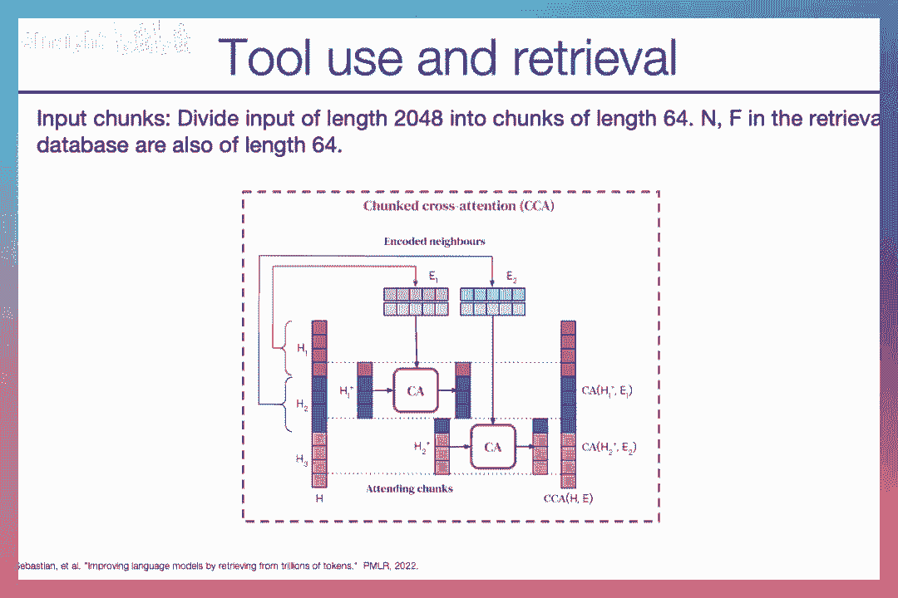

我们可以跳过该计算，因此这表明，通过将，来自外部数据集的检索合并，到某些任务中， 关于你知道的，主要关注像分形的东西等等，嗯，他们得到了更好的缩放，所以，对于相同数量的，参数，你记得有一些。

额外的出生参数，但出生是一个，小模型，所以，嗯，你会得到一个一致更好的，性能，显示，进行。

检索和跨不同任务的好处，这个大扫描似乎可以来自，GitHub 和 P9 P9 是书籍数据，集好吧所以呃这似乎表明，当你无法关注完整的上下文时，检索是最有帮助的，所以获得帮助很长，书籍也很长。

所以如果你不能，训练非上下文模型，那么一种方法是，进行检索，你知道重新尝试，任何呃需要的信息来帮助，预测好吧。

嗯所以一些替代呃，自我关注呃 架构所以嗯，有，一种叫做滑动窗口，注意力的东西，所以在 v 注意力中，每个令牌都关注所有先前的，令牌，你知道这意味着，二次计算成本中的大量计算成本，并且我们有。

技术来减少你的内存成本，知道我们可以 TR 数百万个上下文 LS 呃，但是计算机成本仍然存在，所以，降低计算机成本的一种方法是进行，滑动窗口注意力，嗯，这个想法是，嗯，当我们呃尝试修复，窗口时。

当我们更深入地了解 层，每个令牌有效地关注，遥远的过去，好吧，所以这就像，R 注意力和呃之间的权衡，你知道，也许呃重复到 NE，网络，所以因为这仍然是快速，训练，而且它似乎在 实践。

不如 vanina 注意力，但你。

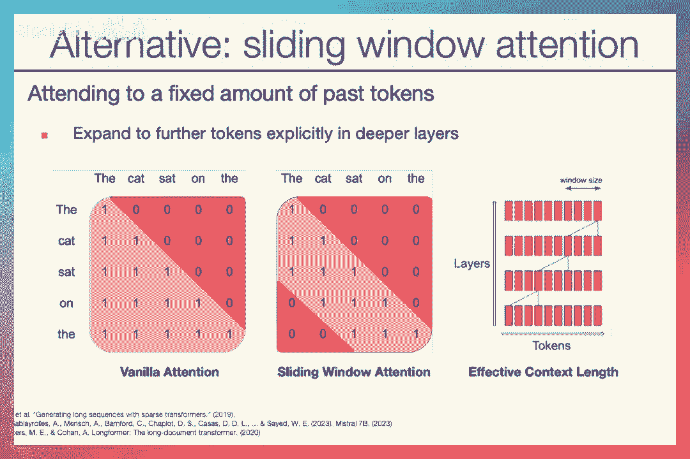

知道，是的，了解，这个很好，嗯，还有一个我想说的，非常有前途的注意力替代方案，称为状态空间模型，嗯，这是一个非常有前途的想法，尽管呃，有点不清楚它会如何实现。

与 Transformer 相比的规模呃但是，是的，很高兴知道这一点这个，想法是呃我不会，详细介绍但这个想法是嗯它有点，像嗯递归神经元网络，架构嗯模型维护了一些，关于遥远过去的隐藏状态 呃，但。

不是在你知道的 sstm 中这样做，你知道可以呃精确的，顺序方式，他们可以以某种方式，加速这一点，但是你通过，瘫痪呃一些，计算，所以它很有前途，因为它显示出更快的推理呃和。

呃 这对于许多应用程序来说是理想的，呃，它们也比，所以更好是的，是的，但是是的，需要更多的研究嗯。

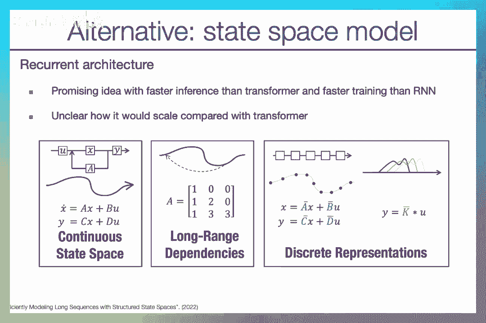

所以这是一个呃最近的模型，称为，mber 嗯，状态空间模型系列中的呃模型之一，嗯，这是，来自论文的 SC L 研究，我们可以说，M 在缩放方面表现优于，之前状态空间模型的所有过去，因为。

他们看到的所有过去模型都无法，匹配 Transformers 缩放 M，似乎呃匹配变形金刚呃，这是一个非常小的比例，就像一个十亿模型，三亿模型，它的比例很小，但它似乎，匹配呃变形金刚呃很好。

尽管正如你所看到的，当你，放大时 计算曲线似乎，比 Transformers 高一点，所以，嗯，但我想说这是一个非常，有前途的想法。

是的，所以人们也在探索我们如何，与状态空间模型结合起来，因为状态，空间模型似乎比，Transformers 表现不佳，所以也许 你可以把，它们组合在一起，所以一种方法，叫做，如何将。

滑动窗口注意力组合起来，这是一种，相对便宜的注意力形式，对，长范围依赖进行建模，因为在循环神经网络中，你，知道状态空间模型 计数模型，长程依赖性也是如此，因为，你必须将信息存储到，固定的数据隐藏状态中。

所以人们。

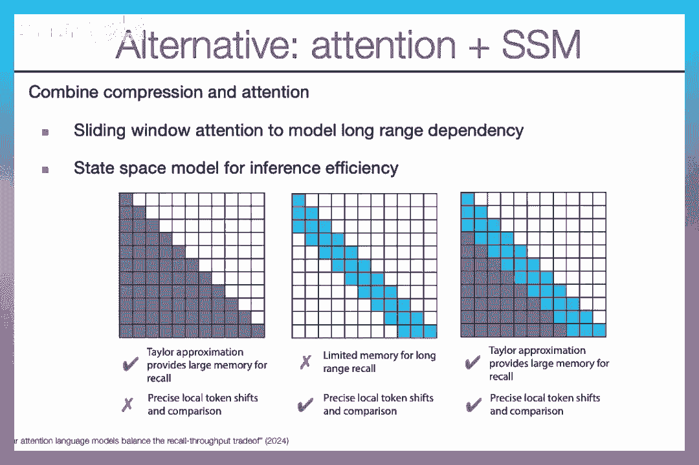

探索了如何将它们组合起来，这，是来自最近的一篇基于 Cod 的论文，它们基本上表明，通过组合这些 两个关于这个简单的，检索任务，你可以以某种方式呃你，可以非常接近呃一个你的。

网络以及如何执行um stat，Space Mod only模型，如曼巴或，其他模型，你知道它们。

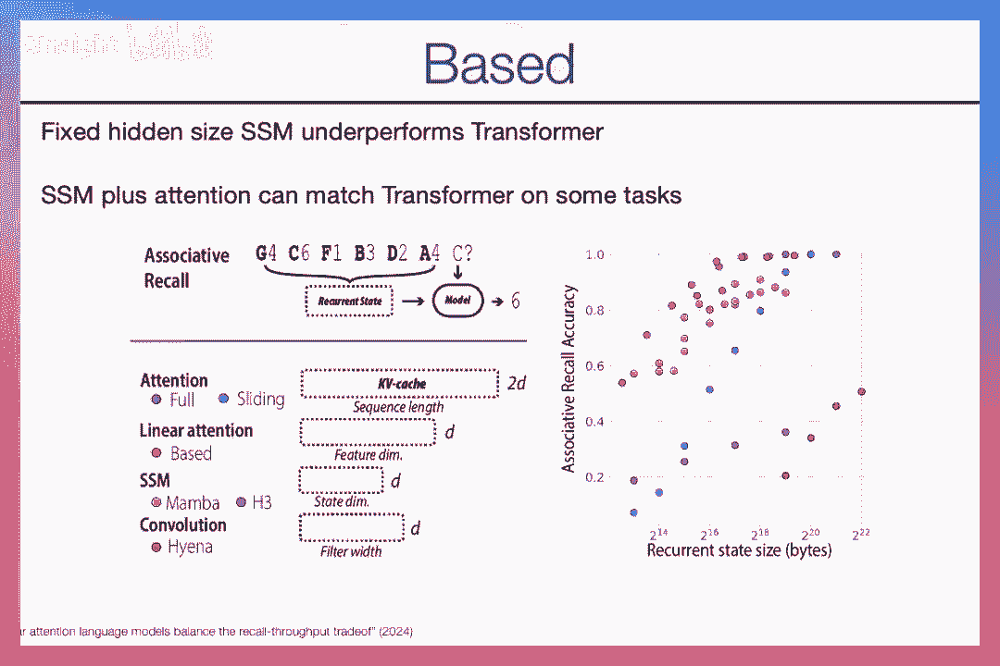

比这个新架构表现更差，所以嗯这是 来自 def mind 的并发工作，嗯，你需要同样的想法，嗯，将，这种注意力与，一些循环神经元网络结合起来，嗯，了解它们很好，嗯。

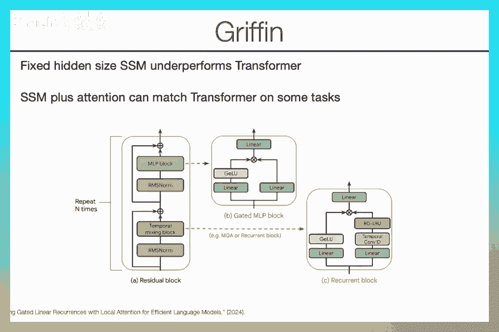

这是一个嗯，对，人们关心的一些任务的下行评估，所以我们可以看到 如果我们看一下，平均性能，这个，模型是蓝色突出显示的模型，呃，与呃，Vana Transformer 呃，表现相当有竞争力。

而且你还可以看到，使用了他们执行的一半数据，仅状态空间模型模型，这是我们，两倍的令牌，所以呃，这个 表明，注意力，对于高性能模型非常重要但是，状态空间模型也可以组合。

在一起以改善推理，缺陷，如下所示这些，混合模型具有非常酷的，推理效率 呃，mq 代表 vanina Transformer，另外两个是新提出的混合，模型，因此它们在推断上具有更好的规模，它们有更好的。

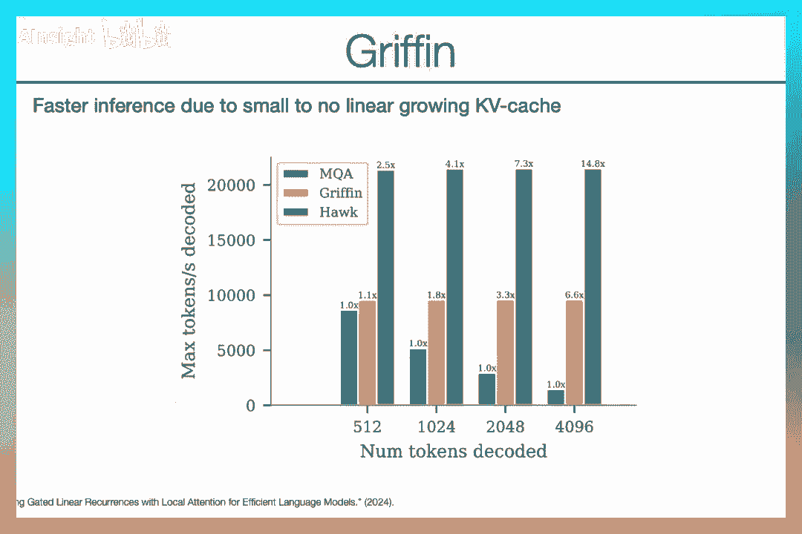

支持，所以我之前多次提到过 Q，值缓存，所以让我们，回顾一下 嗯，所以在推理时，给出一个输入，序列提示，嗯，你知道以下问题，就像模型回答问题一样，你生成自动回归输出，每个单词，你知道查询只需要。

关注缓存数据输入，我们不这样做 不需要重新计算所有内容，我们可以缓存输入，只需要执行查询和缓存，Del ke 手动，计算，它可以解释说，嗯，嗯，粉红色的数据部分基本上是，缓存的键值，所以 对于新的查询。

率，我们可以，通过仅执行此查询来节省大量计算，该查询关注，该，键值是的，它不是，假设它是线性的吗？ 在，键查询乘法之后执行软最大值，是的，您需要这样做是的，因此您有，四个键值可用键和，值分别缓存是的。

它们被，缓存是的，所以，计算的保存数据来自不，重新计算 qy 值是的，所以，计算成本变得，线性，但相对于缓存，Q 值大小是线性的，因此随着 Q 值，大小变大，线性成本也会，上升，所以这可以解释，我们。

逐渐 um 缓存，先前，令牌的 Q 值 这样，对于新的，令牌，我们不需要重新计算。

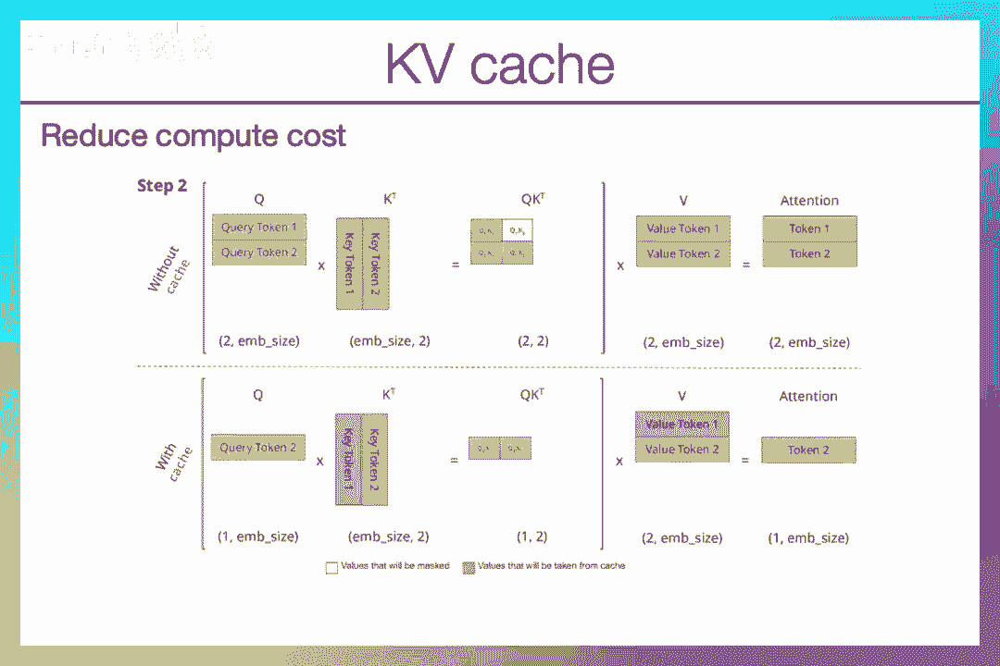

过去的，键值，是的，保存计算机，很好，但底部颈部正在加载键值，所以这个图显示，自从，2012 年网络出现以来，我们 正在不断构建越来越，好的 GPU，嗯，他们，在每个 GPU 上的触发器呈指数级增加。

但内存，坏道扩展非常，缓慢，因此加载键值缓存所需的时间，随着我们输入的时间越来越长而增加，因此计算量很大，但，时间占主导地位，通过加载键值。

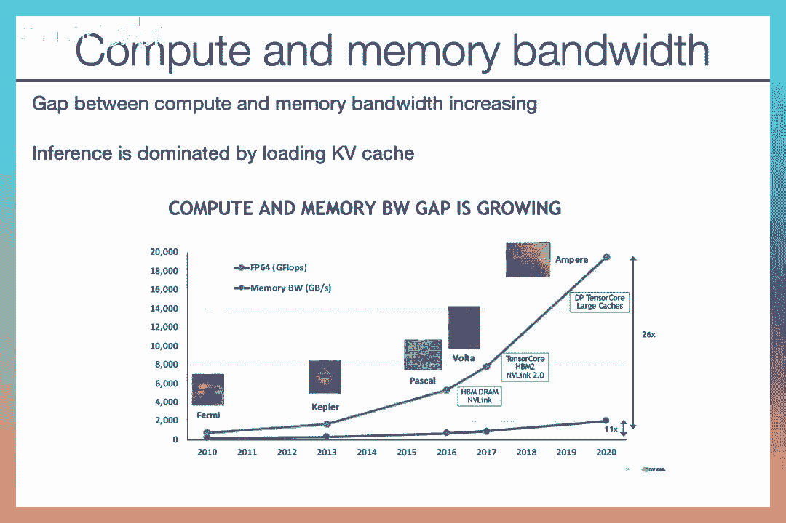

缓存，它也会产生相当，大的内存，成本，所以这个图显示，如果我们从，sance 500 到，100K，大部分内存成本来自。

保存键值，缓存，所以人们提出了，压缩键手动缓存的技术，其中 我想深入了解一下，在这个方向上有很多很酷的技术，我鼓励您检查它们，我想强调这一点，特别是，它通过，压缩 KE 值缓存来显示。

我们仍然可以获得几乎相同的结果，质量，所以我们基本上知道，ke 值缓存中有很多冗余，所以我们基本上可以压缩，它们，而不会显着损害。

模​​型，性能，更呃，非常流行的，技术称为多查询器，注意力，在我们只有多查询器注意力中，一个键值用于不同的，查询，好的，所以基本上我们，有 32 个注意力头，通常，所以不是，每个令牌有 32 个键值。

每个令牌有 32 个查询查询头，让我们将，键值的数量减少，到一个，这就是所谓的 一个，多重查询，因为你有一个 Q 值，并且你有多个查询，所以，这就是为什么他们称之为多重查询，好处是你不需要为。

每个令牌加载 32 个不同的键值，你，只需要加载你有 32，个 head 需要加载的关键值更少。

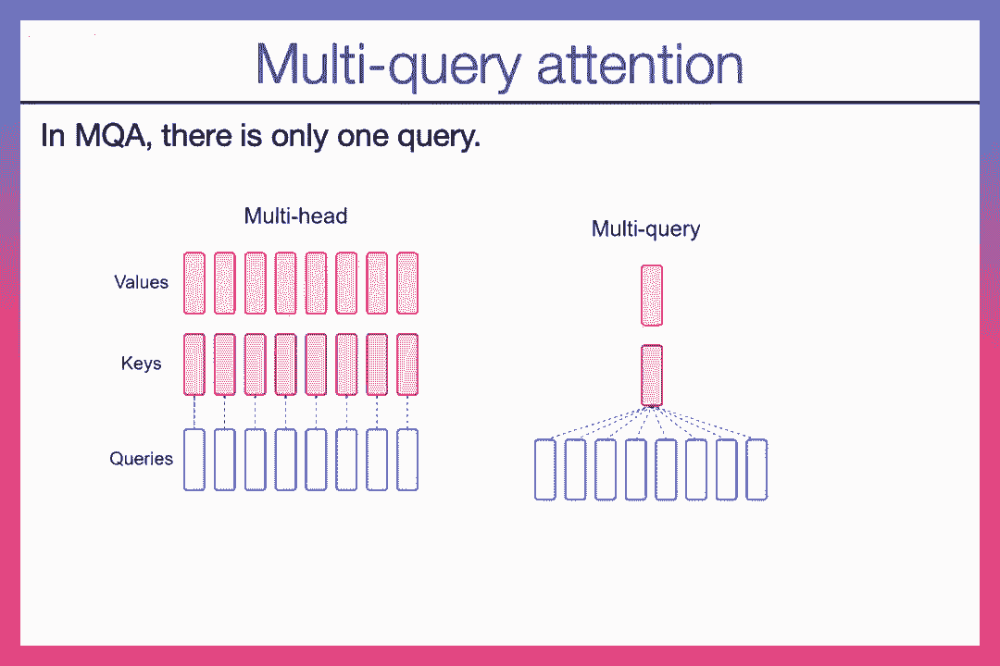

但这实际上会，极大地损害模型性能，因为我们知道 M head，对于模型性能非常重要，所以，呃，有一种称为群体，护理者注意力的技术，呃，它更像是一种，权衡，嗯，你而不是 32 而不是，一个。

它可能有一个四个 um 键值，然后我们将这些 quates 分为四，组 因此，在每组中，查询器都会，关注 um，你知道特定的 uh。

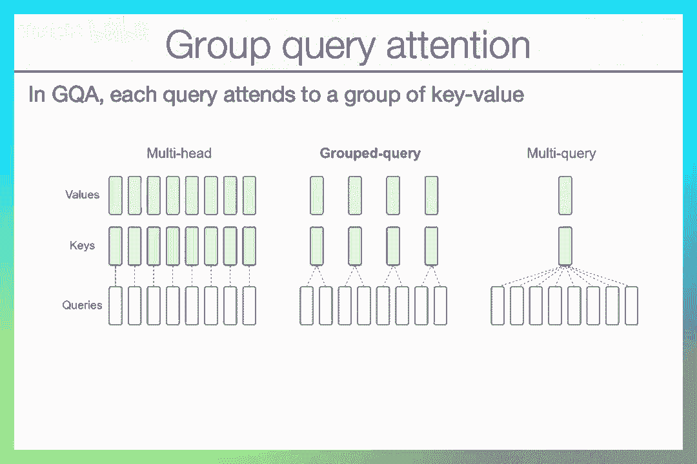

键值，这证明在，推理速度之间提供了非常好的权衡，和性能，因此我们可以看到，gqa 模型具有最好的，采样速度，并且还具有，这些不同。

变体中第二好的性能，在实践中，您可以将，多头注意力转换为 gqa 或，呃 mqa 嗯，你知道你可以通过，取平均值来将一些头部合并在一起，然后，训练继续在，额外的一小部分数据上训练模型，所以。

这个数字显示你可能只需要，你的预训练的 10%  - 训练数据，成功地将预先训练的，多重注意力转换为组查询。

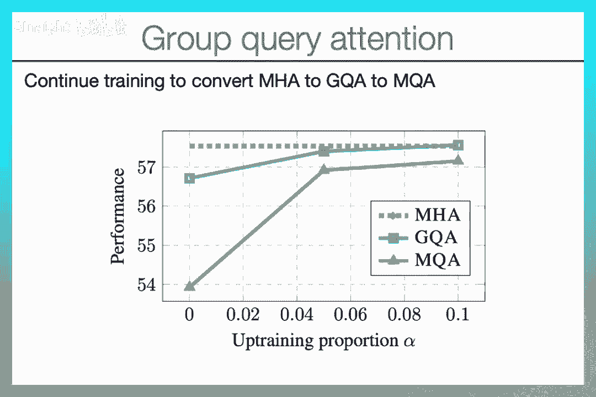

注意力，因此在，硬件方面需要注意的，是，我们可能可以，通过将内存堆叠在 GP，芯片顶部来获得更大的带宽，为什么，我这样做 认为作为人工智能研究人员，我们需要，知道这个底部来自哪里，因此在，现有，芯片中。

我们将它们放置在，GPU 芯片旁边，这样浮点数就会，随着 GPU 芯片而缩放，面积越大，浮点数就越多，但你的 bway 只能随 GPU 芯片而缩放，你的GPU芯片的参数是正确的，因为你把内存放在。

GPU芯片旁边，所以你只能，使用参数与GPU对话，这样就可以解释，触发器和带路之间的差距，所以，你知道有很多很酷的研究技术，你知道设计新架构（，如状态空间模型等）的内存通道成本。

但当我们将内存放在 GP，芯片之上时，触发器和带宽都可以随着面积的扩展而，缩小触发器，和，频带之间的差距，一旦这是真的我 认为有，很多媒体公司和 AMD 正在对此进行，深入研究，一旦这是，真的。

我们还可以，非常非常有效地运行矩阵向量乘法，我们，可以非常有效地运行大型上下文推理，所以现在有很多，研究，机会，一些想法，可以 这不被认为是，不切实际的，可能，在未来会变得真正有影响力。

所以，嗯，专家的混合体，呃，你，可能听说过，由于，G4 呃，你知道，就像正确的人谈论 gp4 是，专家的混合体，所以为什么我们需要，混合 Expert 和什么是 Murex。

Expert 专家在这里代表，每个 Transformer 层中 MLP 网络的数量，最初我们有一个 MLP，后面跟着，注意力，实际上你可以有，多个你，知道的 MLP，然后你有一些你。

训练一些神经元网络来，从这个组中选择您知道的一个或两个倍数，从，您可能知道的 32 个甚至更多，MLP 进行转发，这样这对，每个代币都有效，好的，很高兴知道，我们对每个代币执行此操作，我们选择您。

可能知道一个 MLP 进行，计算的动机是，什么，为什么我们要做这样的事情，为什么，我们不训练一个巨大的，MLP，动机是我们想要，从，参数中减少计算，通常计算受，参数限制，记住，计算机成本说 大约。

等于你的参数和数据，大小的六倍，所以如果你想增加你的，参数数量，你想要tr大，新闻，你必须支付更多的计算机，成本，通常你想要Decap这些，东西，现在贴花意味着更多的，灵活性和专家的混合，在我看来。

这是一种对，计算和。

参数进行分解的方法，因此 re m 模型很好地展示了这一点，这表明，每层可以有 8 个 MLP，并且他们决定激活每个，令牌 8 个 MLP 中的两个，这样他们就不会增加，计算成本或者你知道。

它仍然是合理的，计算，但是有更多的，参数几乎是参数的八倍，因为大多数参数都在MLP中，所以现在他们有八倍的par ml，他们有八倍的，参数作为回报是的问题，呃 你完成你的想法 哦是的 不是的。

问题是什么 基本上你说你，选择了 N 从，你选择的所有专家中选择了 N 是的，假设你有 32 位专家，也许，你想说下一个或两个，什么，什么 重要的是比例，好吧，你可以，有 256 个专家。

然后选择 8 个，然后比例是我不知道，也许是 36，32 之类的，是的，嗯，无论如何，比例，才是重要的，呃，呃，是的，问题是什么，所以我，想知道 看起来这个，选择过程是如何连续的，或者我的意思是。

可微的，因为我觉得如果，你刚刚选择了，一个，你如何，正确地学习这种选择过程，因为就像，它是连续的，如果它是，不连续的，就像我要采取的那样，这个或这个你如何学习 gr，和下降哪一个就像，连续，逼近是的。

很好的问题，你，可以将其视为一个，正确的分类，你有八位专家，你，想选择一位，这样你就可以做 输出，八个逻辑 让我们说哪一个是，最大的，然后选择，那个，好吧，这就是，您要发送的逻辑，是的，这是，您要用。

于此令牌的前进和后退的逻辑，所以您 将预测，每个令牌使用哪个专家，是的所以学习这个选择，模块，是我想说它是底部让你，知道是对的因为直观地预测，使用哪个专家是一个困难的问题对，嗯是的它是我知道。

为什么是的是的 是的，是的，这是一个很好的，直觉，所以但是呃，是的，但是使用，多个专家，即使学习路由。

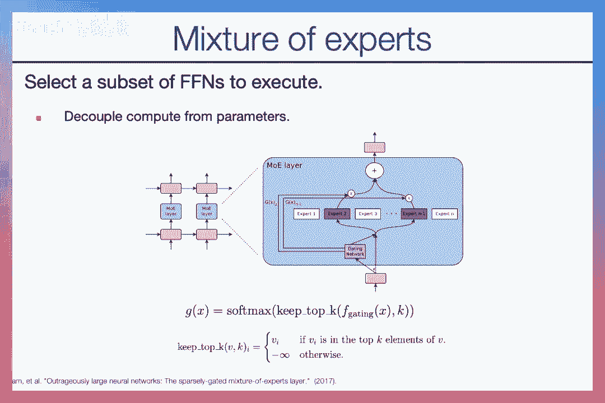

模块很困难，品牌优势也是相当显着的，是的，所以这个 Bally，表明，通过将 Xpress 增加到，8，你会得到一个模型，执行更大的模型，甚至执行 n 700 亿个，参数，所以它非常，令人印象深刻。

尽管数据集不同。

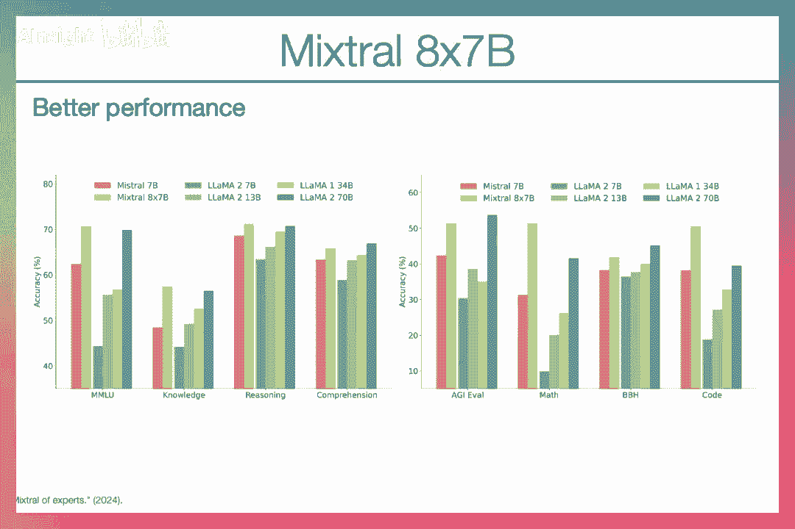

嗯，好吧，嗯，另一种看待这个问题的方法，是活动参数的数量，好，问题，是的，这是一种，添加 关于上一个问题，假设您只有一名专家，当您进行，梯度下降时，您会怎么做，似乎您，不会获得类似如果。

有八名专家而您只，选择运行一名专家的信息 其中，你，确实没有一种方法来，确定其他七种中哪一个，在这种情况下运行得更好，所以我猜你，真的没有所需的梯度来说明，你应该增加分类器，概率 选择其他任何一个。

你能准确地澄清它是如何，知道选择其他选择之一的吗，人们将温度调整，为超参数，鼓励，模型探索其他 EXP，而不是根据逻辑温和地选择呃，是的，我认为甚至还有，其他技术，比如添加，熵呃正则化来鼓励。

呃探索其他专家是的，这确实是一个问题，如果你有八个专家，而你，只选择一个，那么，模型可能会 倾向于，只选择 y z，然后其他，专家在知识方面没有得到充分的培训 是的，这是一个很好的问题 是的，这。

不是训练期间的替代方案，只需对专家进行软组合 是的，如果您进行软确认，这是一个好点，然后我们不会在，训练过程中从参数中脱碳计算以获得更好的，价格哦，你把温度调低，随着时间的推移，它会变得越来越有。

选择性，你可以是的，这是可行的呃，我认为，人们尝试过，呃我会，说这是一个 好主意，你知道你只在，训练时支付额外的计算机成本，而不是测试时，但，如果你在，训练期间使用所有专家，然后在。

推理时你只使用可能两个，专家，那么模型怎么可能 知道，嗯，是的，我的意思是你想，逐渐降低温度，即使在训练期间也几乎不能使用，其他温度，另一个则降至，大约零哦，我发现就像在，值上使用软最大一样，它。

就像一个软最大 对专家，有效哦，我明白你的意思，逐渐降低温度，这样，模型逐渐学会只使用一，两个专家，是的，这是一个好主意，我认为这是有道理的，是的，你，不认为它已经做到了最好，我的，我不知道。

这是否会在某种程度上等效，强制执行唯一的一个矩阵，但是因为它，是块呃然后你，再次创建专家我的意思是，它们是每个专家的维度，就像合并它一样 只是进入，相同的维度，或者每个专家都喜欢，进入，输出的单独部分。

所以一旦您选择了这个，假设一个，xert一个MLP，该专家的输出，就会被FedEd到嵌套层中，好吧，但是，每个专家都具有相同的维度，对吗？ 相同的维度是的，我认为，从技术上讲，你可以做到这一点。

这不是Zer，其他地方它真的很有帮助，嗯，是的，如果你做零，然后使用一个，巨大的矩阵，那么你仍然支付，流量，很酷，所以这表明使用，相同数量的活动，M 混合，专家中的参数执行 L 混合专家，模型。

因此这显示了，您知道组件计算和。

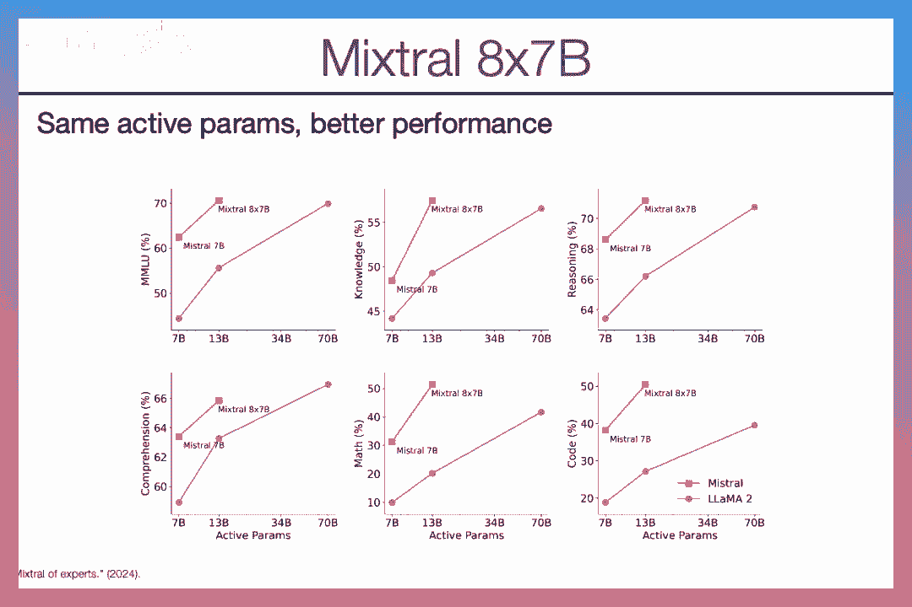

参数的好处，尽管您，知道，几年前 Hinton 和他的，课程提出了这种专家混合，想法，但一些有趣的东西 他们认为你知道，也许一位专家对应于一个，特定的主题或领域，但，如果你查看。

阿拉伯 GitHub 或论文，并且你知道这些，不同的领域或 c，并且你看看每一层如何，选择哪个专家，那么在语言模型中你会发现你 使用，某些方面和某些主题之间似乎没有相关性，所以嗯，这再次证实了这样的。

假设，即好处，来自于 De comping 参数和，计算，而不是像你知道的那样，我也许，最好学一位 ARA 专家，一位 GitHub 专家 等等，似乎，并非如此，虽然那，很好，呃，这似乎更容易解释，嗯。

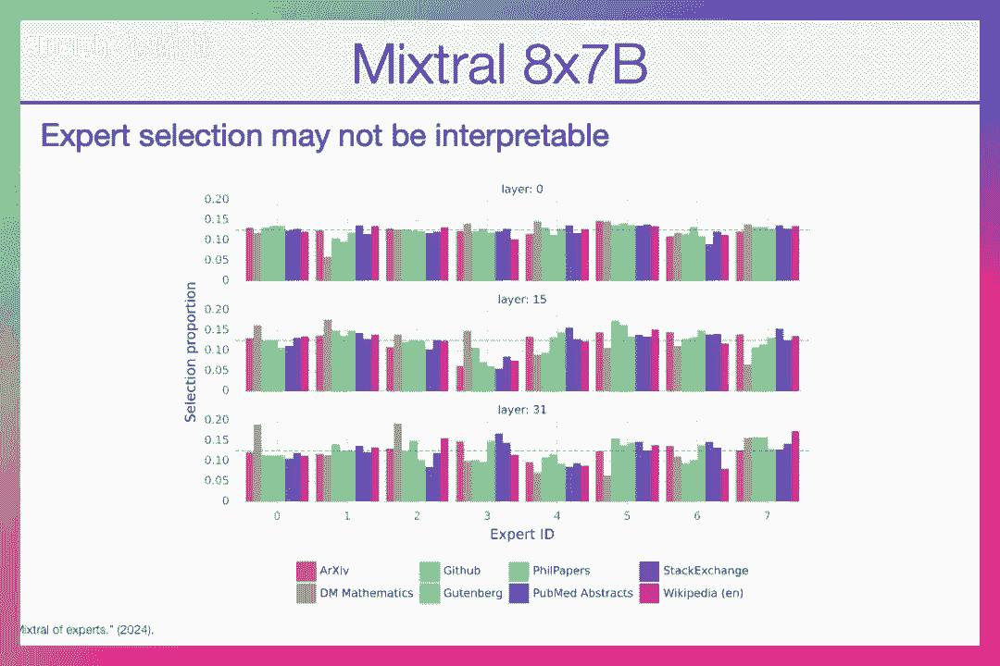

好吧，让我们来谈谈一些，语言模型功能，一些，推理，能力，几年前，今天可能仍然如此，Alo，我们真的有 有能力的模型，可以产生鳕鱼，癌症问题，或者你知道像在，哪里吃午餐和晚餐等等，他们在。

推理方面神秘地糟糕，特别是在哮喘，推理方面，这是最底层的NE，因为如果，模型不能很好地进行简单的推理，我们如何才能相信模型能够，发现新，技术或成为人工智能医生或人工智能，律师等等。

那么我们如何解决这个，问题到目前为止，主导方法，是对大量数据进行粉丝调整好吧，你。

有人权，就像这样你，知道你雇佣了一群人类，标签员写下，对这些哮喘问题的逐步思考，并且。

你希望这些模型能够学会，在推理，时逐步思考，以便给你一个更好的，答案，随着你的增加，这确实非常有效，训练集，大小测试准确率继续上升，尽管它仍然相当低，因为这是几年前的一篇论文，现在你可以。

很容易地获得 80% 的准确率，原因是我们在预，测试方面做得更好。 训练模型 我们花费，更多的精力来连接这些有趣的，数据，因此 F 需要大量数据，因此，改进模型的。

推理 一种改进方法，称为，暂存器 暂存器的工作原理是通过，将真正详细的逐步，思考作为训练数据 你知道，这里这个特定的例子，而不是像。

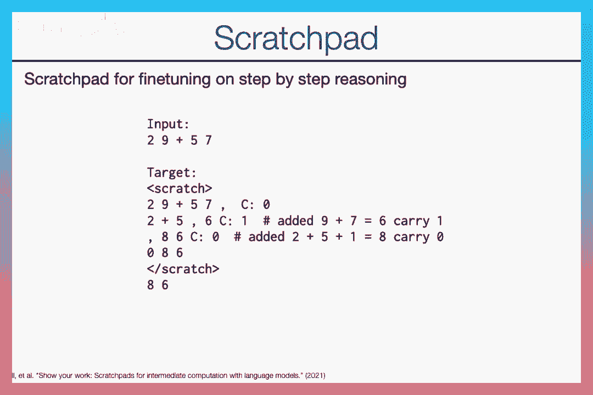

这个例子一样直接得到最终答案，我直接有。

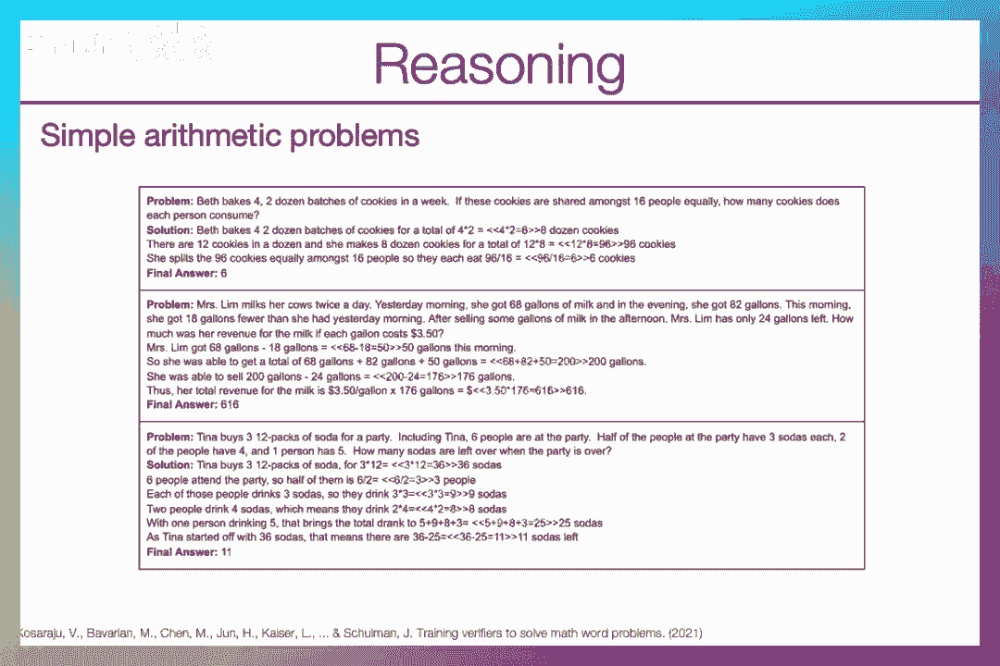

这个例子，你，写下思考过程你甚至，写下你知道的语言解释，作为，评论，然后你找到模型来，预测，这适用于，所有，交互，因为模型已经固定了，层数，所以 M 只能执行层数，步骤，思考是否只允许。

模型正确执行一次前向传递，这对于我们关心的大多数问题来说是不够的，知道我们，有 32 层，这还不够 32 个，步骤对于大多数，问题来说还不够，但是如果你允许模型，一步一步地进行，知道。

沿着上下文维度进行多步思考，你，知道我们有非常大的上下文，如果，你允许模型 教模型一，步步思考，理论上你几乎得到了一台真正的，机器，可以使用你知道的，无限大，磁带，这，是一种，交互，这是一种非常酷的。

改进推理的技术，但似乎还有，其他一些底部 你，知道的腿，因为你可以看到，分布精度的a，你知道，最右边的图呃仍然很不，嗯表明，模型似乎并没有真正理解，理解如何进行推理，嗯所以是的，这里需要更多的研究。

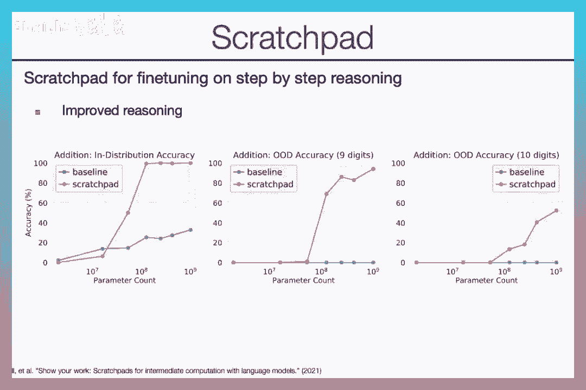

所以 暂存器需要微调，人们发现，好吧，我，不想进行风扇调整，我可以告诉，模型逐步思考，给，它一些给模型一些，你知道的例子，一些简短的提示，然后，希望模型学会 这样做，这称为 CH，提示，他们将多个。

暂存器示例作为，输入，并且模型，模仿 F 简短。

提示，此日期导致性能，甚至接近主管 F un，非常酷，模型似乎理解了，未来示例的推理 并且可以。

与经过调整的，模型竞争，后来研究人员发现，也许你不需要几个，简短的，例子，也许只需要求模型一步，一步地进行，呃，这称为零，短，ts，有一个mod直接输出，思维，过程我 我猜测这是，因为后来你知道。

通过指导，GPT 和其他更强大的模型，他们，已经接受了一些此类，逐步思维数据的训练，所以，你我们不需要再写，提示了呃 因为你知道，互联网上有很多这样的。

数据，所以看到你，可以用一句话提示模型真的很酷，让模型，生成这个推理，然后你进行，推理，得到最终。

答案 是的，它表现得相当好，呃，呃，在，可用的最大模型上表现最好，我想，对于，较大的模型，它们，比小模型更好地捕捉数据集中的逐步思考数据，因为它们有更多的能力让，我记住这些呃特定的，例子 在互联网上。

这对于当今所有可用的模型来说确实是正确的，因为它们有大量，使用呃这种逐步思考的指令，所以我们可以做到这一点，呃 Champa 提示，不再需要手动示例。

所以人们发现一种，改进的方法 进一步的推理是，通过使用称为过程，反馈的东西，而不是给出，您知道的最终步骤答案，例如，最终答案是否正确，我们想，告诉模型哪个步骤不，正确，这比结果监督提供更好的，性能。

由人类进行过程监督，或由人类自动进行是的，我，应该注意，这是由人类标记的，所以它非常昂贵，但我想说，将来也许，我们可以依靠人工智能模型来提供此，过程反馈，一个ni说，与结果，监督相比，过程监督。

似乎还没有饱和，嗯，是的，但我应该指出，收集数据确实很昂贵，你需要，你需要训练有素的人力，而且，这非常。

困难，所以还要注意 I HF，代表什么，从人类，反馈中进行强化学习，你们中的许多人，可能已经熟悉这一点，因为 CH GPT 起飞了，产生了，很多新闻，快速回顾一下，包括将，人类，演示与监督者。

Contin 连接起来的步骤，然后收集此结果，你知道模型会产生，两个响应，将，其中一个标记为，首选，这不是过程取代，这是结果取代，因为它，更具，可扩展性，然后你的TR奖励，模型，然后你。

针对这个奖励函数运行PP强化收益，以，最大化，奖励，因为奖励，通过运行 po 来理想地捕获人类偏好，最终，模型与人类偏好更好地保持一致，这确实是事实，在实验中显示，P 模型的性能，明显优于，监督 F。

模式 我想注意的另一个功能，是代码生成，嗯，代码生成 有很大的，潜力，并且，SK 可能不仅适用于语言数据，还适用，于代码数据，所以这是一个，代码 X GitHub Co 试点的骨干，嗯，你会看到。

它具有不同的缩放比例，没有常数，正如我们之前提到的 SC 没有，常​​数呃数据 设置，相关，但幸运的是，uncode 也会进行。

HED，并且精度也会，随着模型的增大而，提高，因此，如果您为每个问题生成一个解决方案，或者如果，您为每个问题生成 100 个解决方案，则第 1 遍和第 100 遍都类似于代码正确率。

问题所以第一个可能是，最重要的，你会发现它，随着更大的，模型和上下文而增加尺寸代码没有，比例也很好嗯sscills，比我们期望的文本好得多，因为文本人类文本是，由你编写的 像一般公众一样了解，我们。

不会编写极其困难的极其，难以理解的文本，但是，对于您知道的代码，您必须跟踪，模块功能才能，让代码正常工作，因此代码更，复杂，更长，上下文更大 窗口可以，更好地，理解代码，alha 代码提出了这个。

有趣的技术，我说称为，推理，优化，所以他们不是进行，预训练和娱乐，而是，在测试时进行大规模采样，因此他们有一些，过滤方法来过滤，解决方案 从一个非常大的呃样本，数据集中你知道，解决方案，这。

对于竞争水平，问题再次很重要，这与，之前的图表不同，因为，这衡量了竞争水平，问题，它更难，所以你可以看到，如果，不过滤它几乎为零，嗯，不过，通过过滤，你知道这种，推理，优化可以解决 30% 的。

竞争级别编码，问题，我想你可能可以做到，这一点，或者运行你让模型，生成大规模样本名称和，过滤，然后你监督粉丝，再次调整 10，10 是的，这意味着如果我对 um Cas，解决方案进行采样，然后我。

测量其中有多少是，正确的，您希望它至少为 10。

mhm，所以事实证明，如果您想改进，代码，生成，则会获得最大的收益 似乎，来自更好的预训练，所以这，表明如果你，用 G Pro 替换主干模型，这是一个，与 pal 相比的改进版本，如果我没记错的话。

pal 是 alha 代码中使用的模型，所以事实证明你有一个 如果你，有一个更好的预训练模型，并且你可以轻松地，在代码生成中获得更好的性能，那么推理时间技术，非常酷，更好的预趋势。

模型可以让你取得很大的。

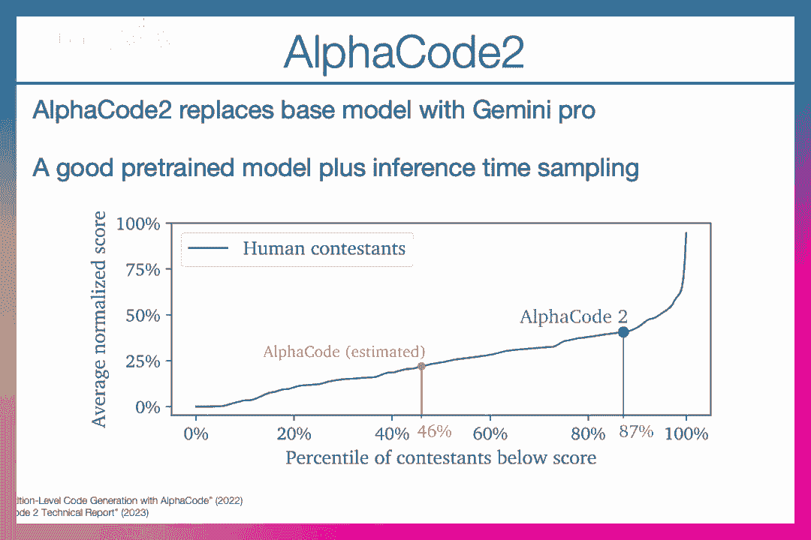

进步，所以对于那些好奇的人来说，通常当 预训练数据集，来自互联网 好吧 -，CC 代表常见的，CW CC 代表常见的 C 常见的 C，基本上是一个从互联网上整理的数据集，好吧，所有不同的网站，等等。

了解这一点很高兴你知道，数据来自哪里，呃，大部分，数据来自互联网，所以，我们需要一个严格的过滤，正如你，想象的那样，嗯，或者很多数据是，我的，我不会说它们是好的理想数据，所以。

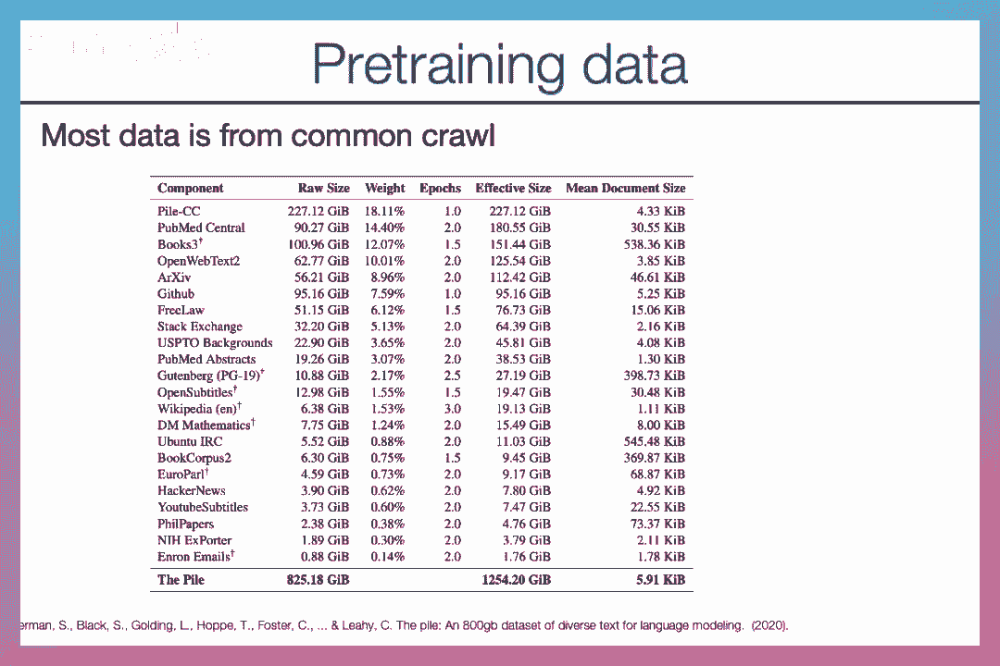

你需要一个严格的，过滤，嗯，所以 兰巴斯数据集是，针对维基百科进行校准的，这是一个，非常好的人文主义你，使用维基百科数据和你，知道不是维基百科的数据集训练一个分类器。

你训练一个逻辑回归好吧呃对此进行分类，然后你可以在，你知道的其他分类器上运行这个分类器 在，你知道的很大一部分数据集上，可以过滤掉与，维基百科不相似的数据，这被证明，是一个很好的人文主义，通过。

正确地处理数据，喇嘛也，知道良好的优化技术等等，嗯Nama 优于，手掌和其他模型中的 gpdr um，因此当您进行研究或工作时，请注意数据。

集，因此有一些开源数据，集 Lama 数据集，由于您知道法律问题等而未公开可用，嗯，R 睡衣是一个相当不错的，替代方案，嗯，我和我的 corer 尝试，使用红色 Pama，数据集来重现 Nama。

并由我们自己进行一些进一步的过滤，嗯，我们可以。

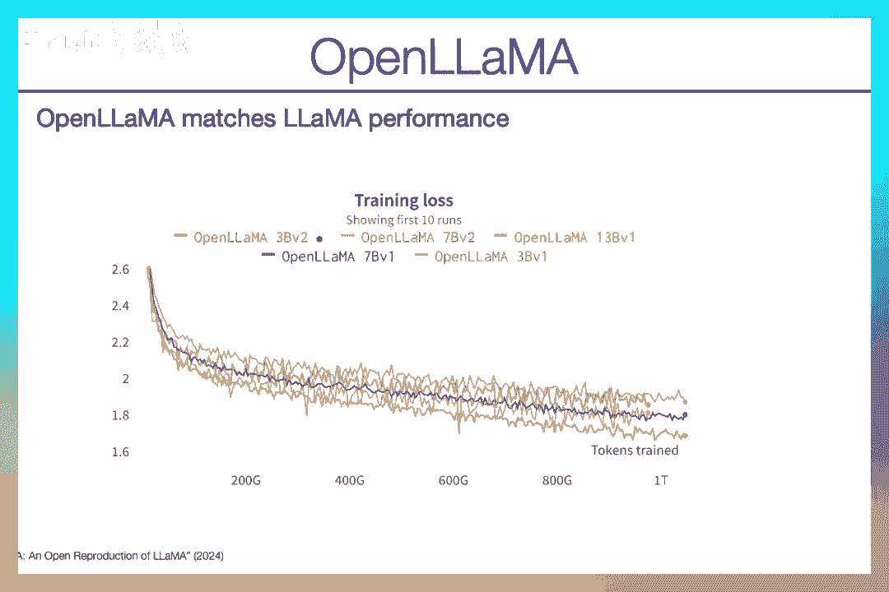

很，容易地匹配 n 性能，所以。

嗯，我猜，嗯，其余的 讲座。

主要是关于呃。

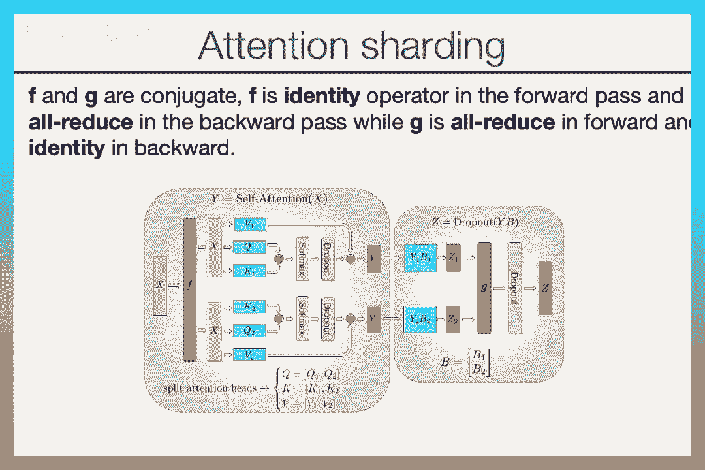

语言模型训练的实践方面，我想我们。

可以在以后的讲座中介绍这一点，我们，是对的，所以。

