# P9：9 生成视频 - AInsight - BV17W421P7QA

好的，是的，所以我们可以开始了，所以今天，嗯，我想讲座将分为两个部分，第一部分我将只讨论一些视频生成中的基础知识，或者类似过去的历史，第一部分我将只讨论一些视频生成中的基础知识，或者类似过去的历史。

第一部分我将只讨论一些视频生成中的基础知识，或者类似过去的历史，第一部分我将只讨论一些视频生成中的基础知识，或者类似过去的历史，比如过去的两三个 加上多年来该地区发生的事情。

比如过去的两三个 加上多年来该地区发生的事情，然后在后半段比尔和蒂姆会来谈论sora，他们正在做的一些事情。

很酷所以简要概述了一些基础知识一些关于，你如何做的一般事情 可以改进，未来的工作生成，然后，围绕更多应用程序，例如使用，视频生成模型，就像，模拟器一样，也可能将其，用于视频编辑，这可能是。

这些模型的两个主要应用程序，它们是当今最相关的以及，原因 为什么人们可能对，这个领域感兴趣，所以我想从，视频本身的训练开始，作为一种方式，实际上与，许多其他方式有很大不同，我想，其他方式主要是语言。

另一种方式是 图像和，处理视频最烦人的事情之一是它，非常大，需要，很多数字才能正确地看待它，所以我们，从 YouTube 在线观看或。

流式传输的很多视频都是 使用 h264 265 av1 之类的标准编解码器进行编码，具体取决于，您从哪个网站进行流式传输以及，视频的最新或旧程度，但是就，文件大小而言，如果您有。

像 HD 10 1080p 这样的一分钟编码，例如 24  FPS 视频有点像，Sor 生成的，最终，大约是 20，MB，加减取决于，视频的实际内容，但它，就像这个顺序的某个地方，然后在。

训练过程中我们通常会做什么，是否像 if 你想训练，你想在视频上训练的图像，你，会解压缩你要，存储的视频，就像，你的像素的原始咬合张量一样，比如，1920 x 1080 um，然后像。

STS的时间数一样，在这个 情况，就像 FPS 乘以秒，所以如果，你想制作一分钟的，视频，我想这将是 60 FPS，如果你有一分钟​​的视频为，60 FPS 嗯，那么你有 3600 帧。

然后你有 3  RGB 的额外数字，um 数字 8 gigs 实际上是，24 FPS 我只是将 FPS 从 60 编辑，到 24 um 但如果你存储它，你的张量总共，大约是 8 GB。

um 然后通常你要做的是你，还要标准化它，这样你除以 255，然后将其移动到负 1，这，将从 U 8 到 FL 32，这样你就，得到了呃，那么，存储这些数据基本上会更加昂贵。

因为现在每个现在 每个数字都，用浮点数表示，它是四个字节，而不是以前的一个字节，因此，视频本身大约只有 32 个演出，呃，真的很大，就像如果你，有一个 a100，你可能可以容纳你。

至少可以把它放在 GPU 少得多，如果你真的想训练它，那，就是呃训练这些数据，这会更，棘手，好吧，所以我想对，为什么这些东西被，压缩有一些直觉，因为这就像一个非常，重要的因素，取决于 视频。

可能会像原始文件大小一样进行 50 到 1，000，压缩，或者至少是，我们训练，它的原始表示形式，因此这些，视频编解码器中的一些通常工作的方式至少，是这样的 一种特定类型不确定，其他类型，但它们。

都会做类似的事情，只是有时以，比其他方式更聪明的方式嗯，但是，这些视频的编码方式，它们，通常被编码成三种不同类型，的帧，所以就像逐帧一样，所以 你有 if 帧，也称为关键帧，它们对它们，进行编码。

就像它们，基本上将该帧视为图像一样，它们只是，使用标准技术（例如，与 jpeg 非常相似的标准技术）对该全帧进行编码，然后它们有一种称为 p 的东西 和 B，帧，它们是在 B 方向帧中预测的，本质上。

它们不编码整个，帧的原始数据，它们对帧进行编码，其条件，就像某种类似周围的，关键帧或什至之前的 P 或 B，帧，这些是和 它们通常，在 COD 中是某种相对的，所以，就像它们对，某些块的运动而不是整个。

像素进行编码一样，这些通常，完成的方式是相对编码，有点像你可以想象的，呃，它们使用类似，运动估计的方式，所以它们 在您的视频中存储，类似 16 x 16 块的 Mo 运动矢量，因此这就像。

某个视频中的帧，然后，您可以看到的红色箭头基本上是，计算为 um 的运动矢量，您可以，甚至不需要看，视频就可以推断出，视频中的运动发生在哪里，因为周围的风景没有真正，发生任何事情，有点像静态，所以。

可能是大兔子在做，它可能正在移动的事情 他的手臂，向上一点，因为，他的手臂周围有更多的运动，并且可能会，稍微倾斜他的身体，但，重要的是，这种，表示非常稀疏，所以这就是，实现压缩的方式 从，某种意义上说。

您不是像，整个像素或所有像素那样存储，甚至不是以压缩格式，存储它，而是相对于或基本上，存储此帧的数量，就像，前一帧的增量或 即使是像，关键帧这样的先前 Delta 以及改变了，多少内容。

一件重要的事情是，它们也能够实现真正的高，压缩，这是因为这些编码从，根本上来说也是有损的，例如，EGS 或某些编解码器，您可以，基本上选择哦，我，希望编码有多大损失，它本质上就像用于。

图像或视频的jpeg，但是即使，像20 mags或100或，500x压缩的视频一样非常高，你也可以 视频的，视觉质量仍然非常好，所以考虑，这些标准编解码器的一种方法是，像您这样的人知道他们使用。

非常基本的方法，例如机器学习之类的优化之类的，东西 就像通常，非常快，就像非常独立，与我们今天所做的人工智能东西非常不同，你知道这些东西可以在，你的CPU上运行，你可以在，观看视频时实时流式传输，嗯。

所以总的来说，这些，算法非常快，但，它们也是如此。 令人惊讶的高效嗯，考虑这些的一种方法是 if，帧嗯，所以我想对于视频来说，如果你，想压缩视频，有两，件事，比如空间冗余，如果你只是将每个帧视为图像。

你可以压缩图像嗯，还有时间性的，这是，更相关的，就像想象一下，如果，你有一个 60 FPS 的视频，那么一，帧到下一帧的，变化非常小，就像手臂可以，向上移动两个像素之类的东西，或者。

场景可以 就像几个像素一样，当你处于那么高的帧，速率时，就像有很多冗余，你可以利用它们来，更，有效地编码东西，所以基本上，过去几年在视频，生成方面的很多工作都是 就像我们一样，我们。

拥有我们需要的所有工具，所以假设我们喜欢视频是一个，非常复杂的分布，我们，知道如何做到这一点，我们有像 autog，模型，我们有扩散模型，我们知道，这些模型可以建模 高度复杂的数据呃，我们有架构。

无论是像，单位还是变形金刚，就像，从图像借用的单位一样，变形金刚，在，几乎所有，模式上都非常成功，所以从理论上讲，我们，可以使用所有这些技术，在视频上进行训练，并拥有一个真正的模型。 良好的，视频模型。

所以这里的问题就像，瓶颈到底是什么，主要的事情就是我，一直在谈论的，就像这个视频，数据非常像，如果我们只是移植所有现有的，方法，它的计算量非常大 以一种幼稚的方式，生成像很长的高保真。

度视频一样非常困难，因为，您必须处理如此多的帧，并且，需要处理如此多的相似数字来建模，分布，所以很多 这项工作的，重点是构建和，设计更高效的模型，这，可以采取很多不同的形式，我将像。

一般范式一样进行讨论，嗯，它们并不，完全是相互排斥的，有，一些重叠之处，您可以 就像混合和，匹配某些东西，嗯，但我会回顾，一些人们，处理它的广泛方式以及相关论文，所以第一个本质上是如果。

最后让我们说想象视频，他们生成的像 24 FPS 就像，呃 像 1080 x 768 或，类似的东西呃视频嗯，有一种方法你，可以用一种非常天真的方式做到这一点，你可以，呃把你的单位像你的。

全分辨率全帧率视频，火车一样，它只是呃非常，昂贵，他们没有 没有，真正的计算能力来直接做到这一点，否则你将仅限于，一个非常小的模型，并且你，实际上无法对任何复杂的东西进行建模。

所以他们所做的就是在很多这样的，论文中想象视频制作视频 所以p，pyoko 和呃 lumier 列出了，从两年前到接近，现在的情况，呃，他们将，问题分解成更小的独立，部分，这。

与我介绍的一些内容会有一些重叠 在，扩散讲座中，呃，不是直接生成，全分辨率视频，而是，生成一个较小分辨率的，视频，然后在，空间上对其进行上采样，随着时间的推移对其进行上采样，也许。

您可​​以在空间和时间上进行上采样，但，就像一个系列 许多不同的模型都，可以做到这一点，所以我们不久前就有了同样的，图，嗯，想象视频是如何有，文本提示的，呃，他们使用。

T5 XXL 对其进行编码以进行语言嵌入，然后，对于生成，他们一步步进行 步骤，他们有他们的非常低分辨率的，视频，所以40 x 20空间，16，帧，这代表我，想像10秒的视频，如果我没记错的话，哦。

也许不是，这是L 128，帧，24 FPS，所以可能像5，秒哦，哦 它的速度为 3 FPS 是的，然后他们通过时间超，分辨率来扩展时间 空间，超分辨率 空间超，分辨率 时间 时间 这是，很多不同的模型。

你不必，做这么多，也许你只需要做，一步空间 超分辨率是，时间的一步，但我认为，当时就像他们的计算预算一样，他们必须将，模型划分为更多的，训练步骤，现在最好的事情就是，在这一点上，然后你可以。

训练 每个模型都是单独且，独立的，所以如果你只有，th000 tpus 之类的预算，那么你可以训练每个模型，然后每个模型只需要适应，那个计算量，而不是如果你尝试，做一个完整的管道 需要。

更多的计算来适应整个模型，是的，这些是一些，视频示例，所以这就是，两年前的状态，一年，半，也许嗯，你们会慢慢地，看到进展是多么的顺利，呃，最大的跳跃可能是，Sora，我认为 Tim 和 Bill 会有。

很多例子，想象，一下泰迪熊在街上行走或，奔跑的视频，我认为，右边就像 u70 上的一个面板我，想想嗯，这是一个更新的，叫做 lumere 我想他们有这个，就像一月份一样，嗯，即使对于这些模型来说。

这一切仍然是所有仍然，相当有限的短视频，所以这是，80 帧 16 FPS 所以他们生成了 5 秒视频，呃所以 这个没有时间，超分辨率，所以他们直接以，低spal分辨率生成所有帧。

即80 x 120 x 128，然后他们有一个单独的超，分辨率过程，直接从12 128到，1024 um采样，所以这就像 另一种选择是，根据，他们如何解决问题来分解问题，但仍然是一种，类似的方法。

所以这就像，比想象视频要少的部分，但仍然，像一个非常相似的，架构，是的，对于想象，视频来说，我不确定，但是呃 所以它本来可以做的，是，嗯，他们只是直接喜欢使用 FFM。

Peg 将 24 FPS 视频处理为 3 FPS，或其他东西，以及 F ofm Peg 的方式，我实际上并不完全确定，嗯，它，可以做一些组合 就像，切割类似的切片一样，选择某些帧，然后像。

呃某种插值一样，但是是，的，我不确定确切的，算法是的，呃，这些是来自 lumir 的一些例子，所以现在在呃方面肯定更加一致，就像 熊是有点，连贯的 SM 纹理之类的东西，好吧，还有另一种方式，嗯。

所以这，有点像级联方法，呃，你把它分成小块，然后，慢慢地在，不同的维度应用超分辨率，直到你 得到你的，最终，结果，嗯，另一种主要方法，这，与，所有这些模型的超分辨率并不是真正相互排斥的，你总是可以。

做超分辨率，但我理想情况下，只需要，在你的管道中拥有尽可能少的模型，可能，所以它并没有那么复杂，如果，你的管道中有七个模型，并且，你想像一个大 10 倍的模型一样进行训练，那么它就更容易扩展。

他们必须弄清楚，我实际上要扩展哪个部分，我要扩展多少，它是一个 稍微复杂一点，如果你只有一两个模型，那么，管理起来会容易得多，而且就，为这类东西编写代码而言，所以，另一种。

非常流行的主要方法只是呃 我想，我所说的每帧空间，模型这主要是由于这样一个，事实，就像稳定性一样有，稳定的扩散模型，所以很多，都是这样的，哦，我们现在有一个非常好的，文本到图像模型，如果你 想要。

在视频上进行训练，我如何使用这个，文本来图像模型不完全适合，但喜欢它可能会以某种方式有用，因为如果它归结为，像视频生成问题一样，第一帧就像一种 本质上就像一个，文本图像生成问题，所以它们都非常，相关。

呃，这种方法的，实现方式是，你基本上可以说你，可以使用你的标准，你的，预训练 vae 来自稳定扩散，所以，这就是一个图像编码器 你，可以拍摄你的视频，然后你可以，利用空间压缩，你可以。

压缩你的视频的每一帧，所以现在你的，视频的每一帧都有某种纬度，然后，如果你想暂时压缩的话，这是一种天真的方式，因为 就像如果你直接，尝试用这个 24 FPS 进行训练，你就必须堆叠 4，秒的视频。

你必须堆叠，96 帧呃或 concat L，这是相当，昂贵的，所以这些论文通常是什么，做的是，这就像一种，非常简单的时间，压缩方法，你只需降低帧，速率，所以它就像是非常，有损的，但它实际上工作得很好。

所以我们可以说它在，精神上与 像超级，Resolute 或像 res 超分辨率这样的 FPS，呃，你基本上只是，采样，就像你可以连接每，帧一样，但是你以低帧速率采样你的视频，每秒四帧，就像非常标准的。

然后，你可以学习 单独的帧，插入模型来对帧速率进行上采样，因此在这种情况下，通常，没有呃空间超分辨率，模型，只有随着，时间的推移而出现的东西，嗯这些是一些论文，如果你有兴趣的话，可以调整。

你的延迟视频稳定的视频扩散，他们都使用某种方法，其中，大多数在过去一年左右的时间里，嗯，这些方法的另一个好处是，这些论文所做的就是现在，正如我，提到的，你喜欢这篇非常好的，文本 图像模型稳定扩散，或者。

可能是他们训练过的元，就像其他一些团队训练了一个，非常好的文本图像模型，或者在，谷歌，某个团队训练了一个，非常好的模型，然后他们可以使用，这些权重来喜欢真正的速度，至少他们自己进行视频培训。

因为他们不必，从头开始学习原始文本图像生成，嗯，我，之前谈到过，所以你有你的单帧，然后你可以对视频的每一帧进行编码，然后 在你的单元中，所以这，是在你的单元中，就像你的2dcs，空间注意力应用于每个帧。

然后这里唯一缺少的，视频模型是呃你可以添加，像时间层这样的东西你可以，随着时间的推移添加一维卷积你 可以，在空间和时间上添加 3D 卷积错觉，然后你可以插入，注意力层，这样你就可以只关注，临时访问。

你可以，像所有时空一样进行全面的关注，这，可能更昂贵，但它可能很有，用，而且可以选择一些 论文，这样做，有些论文不这样做，然后你可以，冻结你的呃你的空间参数，以保留像呃，图像质量，我想。

这些世代的一件事通常就像呃，图像的质量和，质量 各个帧的数量有点，不同，就像分布有点，不同，所以如果你，想保留更多像高质量，的图像生成，功能，呃，继续，生成高质量的帧，那么，有时人们会只是 冻结，参数。

否则你偶尔会看到，一些类似，退化的东西，另一个选择，是如果你也联合训练，这很，常见，如果你从头开始训练，你，联合训练图像和视频，这非常重要 有时，嗯但是是的但是你可以所以，鸸鹋视频的工作方式与。

我所描述的非常相似，唯一的区别是，他们做了一些额外的分解，他们首先生成图像，所以，他们生成第一帧，然后，你有一个单独的帧 生成，呃其余帧的模型，例如，第一帧上的 7 或 15 帧条件。

然后它们在 FPS 中，然后，它们有时间上采样到 16，FPS 他们有一些掩蔽来解释，像哪些帧被条件化所以，它是 就像如果第一帧是，有条件的那么嗯你应用，信息说哦这实际上。

不是噪音嗯作为你的掩模的一部分，然后当你计算损失时，你实际上不会计算，你只计算的第一帧的损失 其他，帧所以这些是一些，视频喜欢的仍然有点像，短视频所以这可能是 4，秒，嗯但是我肯定我想这。

比之前的一些作品有所改进，比如，想象视频嗯对齐你的车道之类的，东西，那相当不错的运动和相当不错的，视觉，保真度，除了，嗯，我想如果你，想使用像文本图像模型一样的东西，你可以使用你的每帧延迟。

它就像它的工作原理一样，但它有点，有点老套，它并不理想，因为您就像，通过降低 FPS 进行时间压缩这样的编码方式，意味着您需要像另一个模型一样对，帧速率进行上采样，这并不理想，并且 那么你还。

必须选择我想要的帧速率有多低，所以，最近更流行的另一个选项，基本上是时空空间，所以不仅如此，现在如此稳定的扩散，有一个可以压缩的VI 每张，图像的时间 嗯，那么为什么不像。

新的 VA 或新的自动编码器一样进行训练，它会，同时在空间和时间上进行压缩，所以有一些相当，旧的作品，嗯，我，不久前为视频 GPT 做过的东西，呃纹身是，另一项工作， 后续。

两者都像 3D CNN 一样进行训练，你 QV，VQ Gans 呃，然后然后使用，像自动攻击模型一样来学习，视频 um lvdm 这里非常相似，但是像扩散模型一样，所以。

他们训练 3D CNN VA 和 然后他们，学习扩散先验 嗯，然后，对于 s 来说，如果你，的视频是 256 x 256，图像 16 帧，那么你可以只是，呃，它基本上是，相同的架构，就像 CNN。

覆盖图像，但您只需将，2D com 替换为 3D com，或者将，一些下采样替换，为空间和时间上的下采样，您只需，控制在，空间上下采样的数量以及在，时间上下采样的数量，这样 例如，这里。

就像你在空间上进行了更多的下采样，所以你将采样降低了16倍，呃，你将采样降低了四倍，这主要是伴随着我猜想，对不同的，下采样因子进行了大量的实验，并且很大程度上，取决于 某些事情，例如帧，速率，例如。

如果我将，视频的帧速率加倍，那么我，可能可以将采样降低，两倍或其他因素，因为只有，更多的冗余，帧，我猜这是一个问题，这有点暗示了我，之前提到的，嗯，这并不，完全像有解决办法，但你，还想如何联合训练。

图像并不完全明显，因为当我们训练这些时，现在我们正在学习，这些视频的新 Laten 空间，因此很难，像预先训练的，文本图像模型一样利用，因此您必须从头开始训练，这个呃，就像视频生成模型一样。

然后当您这样做时，您还想 几乎可以，肯定同时对视频和图像进行训练，嗯，你想要这样做的原因之一是，因为呃，我想有，更多可用的图像数据，假设你的模型是否可以像，火车一样专业 就像一个 32 帧视频，那么。

它可以是 1 个 32 帧视频，也，可以是 32 个图像，嗯，所以在，相同的训练时间下，你可以，看到，比你想要的单个视频多得多的图像，这就是 很好，因为，图像不是独立的，而不是，像你的帧一样，高度相关。

所以你你你得到更好的图像，你得到，更好的梯度，你看到更多的，图像，你看到，像文本到图像对齐的很多多样性，然后，你通常 在某些情况下，文本到图像数据比实际的文本，到视频数据更加多样化，因为文本。

到视频数据，收集起来有点困难，因此可能，存在一些您希望能够喜欢的类似风格的东西，如果，你愿意的话我想生成，像狗跑来跑去的视频，就像，水彩画一样，可能没有那种，文本视频数据，但你可以很。

容易地找到像嗯这样的视频 一个，文本到图像的例子，就像一幅，水彩画，所以你，也想要这种传输，但是，使用 3D 自动，编码器，因为它是暂时下采样的，所以它并不明显，因为，图像就像一个单一的时间，步长帧。

所以它是 就像，如果随着，时间的推移进行下采样，它不太适合架构，因为如果你随着，时间的推移将下采样降低四倍，并且你的图像就像一个，只有一帧的视频，那么你到底会怎样呢？即使是下采样，随着时间的推移。

它也不，明显，所以人们完成它的一种方式，呃，这似乎是一种工作，你只是设计你的架构，这样你将第一帧编码为，第一帧，然后你编码，其余的视频帧呃就像，你的标准时间下采样所以，你现在有奇怪的视频形状所以你。

就像16 x 256 x，2或17 x 256 x 256然后你将，你的第一帧编码成a，潜在的大小为 1 x 16 x 16，然后，其余 16 帧将以，时间下采样方式编码，即 4X 16 x 16。

整个，潜在的大小将类似于 5 x 16 x，16 um，这用于类似 faki 就像，Magit 系列视频诗人 uh Walt，种类繁多，我想在这，堂课上我们并没有真正谈论 Mas，之前它有点像离散。

扩散的东西，不完全是，嗯，然后就像，人们使用这些，方法探索的自动攻击模型 对于 Walt 来说，这就像一种，扩散，是的，抱歉，这是训练，就像，视频生成模型或自动，编码器，部分一样，是的，嗯。

这很大程度上取决于，您的架构，所以让我们说，嗯，所以让我们说，嗯，是的，我的意思是一种方式 你可以做到这一点，假设你是下游模型，是一个 Transformer，你可以将，东西打包在一起，就像。

你的其中一个批次可能是，像视频令牌一样，然后，另一批可能只是打包图像，令牌，然后嗯，你只需要，小心你所关注的内容，所以，也许你只关注每个像，包装一样的图像，然后你，像每个图像一样竞争你的损失，呃。

这就像一个很常见的方式，就像你基本上就像你一样，只是你只是打包你的帧，然后你，对待，类似的东西，而不是你有一个完整的，视频，或者你有一个完整的视频，但，每个帧就像一个单独的图像，它们和你只需要确保。

没有类似的交叉图像计算，你只是在，计算中用注意力掩盖了东西，你只是，掩盖了注意力，这可能是，最常见的，方式是的，有必要添加一个嗯，因为我想你可以将，第一个图像视为第一个图像。

因为就像我一样 猜猜这是否像，呃，如果输入是，16 帧，那么您将拥有，第一帧，然后您将剩下 15，帧，只是您不能干净地按四倍进行下采样，这，是否可以回答您的问题 问题我，不确定我是否完全，理解。

所以我猜第一个，不会经历任何类似，网络的时间下采样部分，其余部分会经历是的，因为它们代表不同的东西，一个是一帧，四个就像 16。

帧，好吧，这是来自 faki，所以这，就像类似的质量，我想就像呃在，同一时间跨度内，就像并发工作一样，想象视频像一年半一样，这就像什么 这是一个，宇航员在日落时骑马，嗯，或者类似的东西，嗯，这是。

来自 Walt 最近的作品，比如，三个月前或四个月前，这，是一个融合模型，但能够，生成更加一致的，视频 大约一年半两年后，呃更少的，文物，这是另一种，最近的作品，过去有很多，论文，比如几个月。

来自 VI 诗人，这是一个，我想我展示过的自动模型 就像我们对，不同样本的第一堂讲座中的，一个，他们有趣地，选择了像手机一样像，垂直分辨率，这不是那么，常见的。

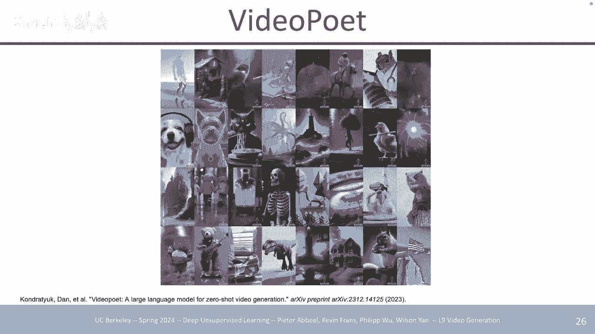

有趣嗯这是一件，有趣的事情谈论嗯对于，视频诗人和，他们学习 Ling 空间的一些论文是这样的，所以，我猜你们都在家庭作业中像 V vqv 一样训练，这样你们就知道它在，VQ 方面是如何工作的，嗯，在。

不使用 VQ 和，切换到 VQ 方面有更多的转变 一种不同类型的，离散自动编码器，称为 lfq 或，fsq，两者都是并发工作，但这是更具体的 fsq，但，它们的工作方式非常相似，这里的直觉实际上。

比 VQ 简单得多，所以 VQ 在右边，你有一个代码 你索引，到的书，这样你的编码器就会输出一个，向量，如果它有，编码器的最近邻居查找，然后呃将其，编码为 fsq 的离散索引呃。

这些与 vaes 更相似，我猜你你会学的 一个，低维呃发明空间，然后你量化的方式就是你你，基本上只是圆形所以你以某种方式所以，这就像一个单位立方体，就像某种像d维，空间嗯，然后它的。

量化方式就是你 只需像这样定义，这些箱，就像，D 维超立方体中的那些点一样，然后，您只需舍入到最近的引脚，那么，在实践中，就，您的编码方式而言，它看起来是什么样子，就像您将表示，形式压缩为减号一样。

one1 然后如果它像八个或九个，箱一样均匀地与，负 one1 间隔开，你只需四舍五入，到最近的旋转呃，这就是全部，梯度仍然，使用直通，估计器传播，就像 VQ 嗯但是 在，实践中，这就像更简单。

地实现你一样，你不会有像，嵌入的 EQ 损失那样烦人的问题，而且，我在使用它时还没有真正看到过，我还没有，真正看到过任何类似的密码本，你在 VQ 训练期间可能会看到的崩溃呃，它似乎工作得更好。

一个比另一个更好，除了稳定性之外，还有一个很好的因素，那，就是，VQ 嗯，所以这里有不同的指标，比如重建质量，左上角的采样质量就像，您在这些离散代码上训练的下游生成模型一样，使用 VQ 您观察到的是。

当，您在 x 轴上增加，代码本大小时，这来自像，max 就像 2 到，16 um 就像 64k 呃，你实际上开始，看到性能下降，所以它开始变得更糟，就像一个奇怪的 u 形 um 对于。

重建和对于 um 对于，下游采样 uh 与 if for，这些 fsq lfq 风格的方法，你至少可以，至少，它似乎没有似乎在，稳步减少，所以你可以用，更多的代码得到越来越好的重建，然后你得到呃更好的。

样本是的，它使用直通，估计器，所以它就像你，编码器，然后你轮流，然后你，解码，有一个直接通过，嗯所以是的所以像大多数 VQ，方法这样的方法训练可能代码书，大小为 16k 32k 一些最近的。

像视频诗人使用，他们训练的自动编码器 他们的密码本大小大约，是，260k，所以明显，更大，是的，使用率很高，就像训练一样，你可以达到 70 80% 的密码，使用率，所以它实际上有一个，非常高的覆盖率。

是的，这可能是我，认为它的部分原因 更容易，预测的是，它的，构造方式就像系统因式分解，所以如果你有大约 200 60k 总代码，你可以将其分解成，类似大小为 8 的单独代码书，就像你。

有呃八个类似 H Cod 书大小为，8 的代码书一样 八个密码本的大小，八个，总共就像，8 x 8 x 8 一样独特的组合，呃，就像 5 512，um，所以这些就像，你拥有的 512 个代码。

但它被分解成，三个离散的潜伏 八个代码，书，每个，不不这个其他舍入是的呃，你你你你将其缩放到，从零到八的东西然后你，只是四舍五入是的，所以我们会关心，量化是的或者如果我们想做，一些类似谨慎的事情 生成。

模型，所以无论它通常是 autog，模型还是，扩散模型，你都，可以训练这个精确的模型，但只是，没有量化，那么它与，vae 函数非常相似，是的，我，想唯一的区别是你，有 10，冲洗好吧，所以下一节非常。

简短地介绍如何改进视频生成，模型，是的，有，很多类似的作品，人们，尝试了很多随机的事情，比如在时间和空间上做不同的超分辨率，嗯，不同的链接数据，不同分辨率的数据之类的东西，我认为这些仍然，可能是。

关键的主轴，甚至是，生成模型的类型，如扩散模型，自动攻击模型掩模嗯，但，最终我认为这些是那种，你可能会想到的三个关键轴中，最像的是，长期改进，嗯，其中一些，是很简单的，所以前，两个是彼此一致的。

所以我们都知道 呃，规模，在这些更大的模型中非常有用，如果你想要的话，可以在越来越大的模型上进行训练，如果你想，表现得更好，最简单的事情，就是训练一个更大的模型，与此半相关只是为了。

表示 你如何才能学习更多，压缩的纬度空间，这样你就会，想到类似的，压缩的东西是，像每帧编码的潜在空间，使用像，图像ve uh比，3D vqv或，某种在空间和时间上进行压缩的 3D 自动编码器，但就。

设计空间而言，如何，学习这些表示以及如何，学习这些 Ling SPAC，我认为，还有很大的，改进空间，但与，第一个非常相关 一是因为理想的情况是，你的凌空间压缩得越多，你可以训练的模型就越大。

因为效率就越高，因为就像是的，你可以更有效地对，数据进行建模，你，实际上可以放大的数据就越大，就像 固定，计算，预算和另一个我认为，也同样重要，如果不是更，重要的话，在某种程度上只是呃，更好的数据。

比如来自我，在行业中喜欢交谈过的每个人，或者我创办的人，或者，类似的东西 就像你的，模型可以越来越好一样，如果你本质上继续处理数据，你的模型可以有多好几乎没有限制是的，所以当你看到更好的，数据时。

它是更多视频更长的视频，标签是的我会我会 好吧，嗯，是的，一种思考方式，是，数据本质上是模型，我认为在，越来越多的计算的限制下，呃，架构的确切类型，甚至是生成，模型，如果你可以扩展到那么多。

无论 你使用扩散或，自动攻击，我认为，如果，你使用完全相同的数据进行训练，或者，可能使用相同的训练过程，你最终会得到一个类似的模型，你不知道确切的证据来支持，这一点，但这似乎是，这样的印象 人们一直。

认为，呃，数据，很大程度上决定了你的模型，条件，比如一些固定的，计算量，所以我猜，这到底是什么样的，我们实际上想要什么样的视频，什么样的数据，所以，如果你感兴趣的话，我认为稳定的视频扩散已经。

详细介绍了他们，所做的事情，但是有不同的类似轴，这些轴，构成了可能好的数据，你，想要良好的运动，所以你想要很多，类似动态的东西 你，想让视频中的东西动起来，如果你正在建模一个，视频，就像一个人在做。

PowerPoint 幻灯片，或者像一个人只是，站着不动，一个人就像，在 Zoom 通话中交谈两个小时，你知道，通常 使用类似，光，流之类的东西，呃，另一种是如果你碰巧，有，那么这可能会也可能不会。

如果你碰巧，有文本视频对，那么文本，数据嗯，因为视频数据本身，很容易抓取，就像你可以，抓取 YouTube 一样 或者你可以抓取其他，一些像视频托管网站或，U的东西，但你可能，不一定能得到保证。

好的文本标签，但如果你确实有，它，你可以做一些类似，基于剪辑的过滤，嗯，另一个，AIS很好 类似的质量有点，难以衡量，但最简单的一个，可能是分辨率，有些人，有类似的美学评分模型。

他们训练了我猜他们在哪里，策划了像特定的数据集，他们认为有些东西是美学的，然后，他们训练了一个 模型喜欢输出，该分数，然后，还有其他辅助元数据，您可以，拥有喜欢和观看之类的东西，因为理想情况下。

如果一个，视频被观看了很多或者人们非常，喜欢它，那么它可能是一个很好的选择，质量视频在某种程度上取决于，您的下游用例是什么，是的，没有什么没有公开的，所以我，知道对于图像生成，已经有关于图像。

生成的研究，不确定视频我还，没有看到，任何东西，嗯，是的 因此，最近受到，广泛关注的另一个方面，是，正如我提到的，从网络上抓取视频数据确实很容易，但你没有文本标签，而且，也许这些标签也不是” 即使。

是像 Lion，5B 这样的标签也不是那么好，所以解决方案只是，像 VM 一样使用这些 VMS 来综合注释数据，这些，VMS 在字幕功能方面已经变得非常好，嗯，你可以 使用最简单的，你可以使用像。

稳定的视频扩散他们埃德一些，现成的他们使用我认为Koka，他们使用呃一些其他视频，字幕嗯他们有像LLM，一样总结并将这两个，字幕组合成一个视频，嗯，他们用另一种方式做的。

比如 3 美元，我想她是，下一张幻灯片哦，是的，我想蒂姆和，比尔也会简短地谈论这个，嗯，他们只是呃产生了，或者他们，只是吃了很多高热量，高质量的标题可能是人们写的，然后他们训练他们找到一个虚拟机。

然后嗯他们的标题就像，他们的数据集一样，这样，你就可以看到嗯所有文本都是原始，文本我忘了什么ssist我认为SS，就像使用 就像一个非常简单的字幕机，然后是一个密集的字幕机，呃，这，就像。

一个更详细的字幕机，这通常依赖于一个，非常好的基本模型，您可以找到它，否则您可能会，遇到很多幻觉，其中的字幕包含信息或，包含 就像那些，实际上与，原始图像或视频不相关的单词或对象。

然后会渗透到您的下游视频，生成模型中，它可能会开始呃，就像幻觉某些，您不希望它，做的事情是的，稳定 视频扩散在这里，他们基本上使用纯合成，标记的数据集，例如 1。5 亿个，文本视频对，因此似乎工作得。

很好，还有，我见过的另一个类似的用于文本到图像生成的作品，实际上，如果您使用这些，合成标记数据 它，实际上最终比，原始字幕要好，因为对于，Lion 来说，它们通常非常糟糕，所以我想回答一些，问题。

关于此数据的另一部分，是，高质量的数据也可以，非常高，就像如果你 想要训练，一个非常好的文本到图像文本到视频，模型另一个方面会非常非常，高，比如文本到视频的对应，想象一下，如果你有一个一分钟的，视频。

然后你有一个标题，就像，一只狗在草地上跑来跑去 一个，描述令人难以忍受的，细节的标题，比如相机如何平移，或者狗如何移动什么物体，比如，它们是什么颜色，什么物体，与这样的东西相互作用，嗯。

实际上是理想的巴斯，然后你可以，把它喂给下游 就像视频。

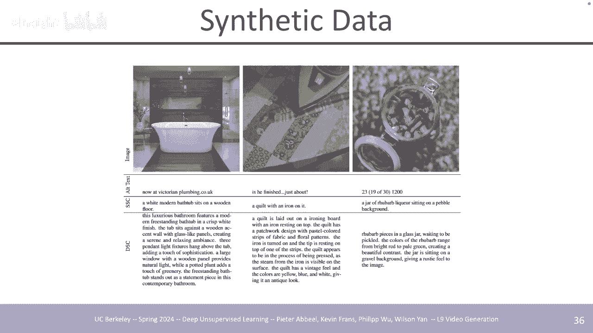

生成模型一样，它可以学习所有，这些，对应关系，最后一个方面是，相关数据，如果您也只是，策划一小部分，类似您知道的一千个一万个图像，或视频，那么它已经被证明是非常有效的 就像 EXT 极高的，质量。

就像你一样，你将，1000 万张图像过滤，到 10，000 张，或者使用，一些 horis Sixs 或某些方法或，类似的指标来测量，然后你可以微调你的模型 它，实际上可以产生很大的，差异，好吧，所以。

我要讨论的最后一部分是不同的，应用程序，所以第一个是，作为物理模拟器的视频生成模型。

它可以追溯到，很早以前，所以这最初是非常，流行的想法我 猜测机器人技术早在，201 16 左右，2017 嗯在上下文中是的所以机器人技术，所以这就像一个很常见的，视频像机器人，手臂移动和推动物体。

实际上是最常见的，视频之一，过去几年使用的一代基准，有点像，视频一代的 cfr1 嗯，然后还有像，Ataris 这样的游戏，嗯，还有，自动驾驶，所以这些有点像，原始视频数据集，主要是。

自动驾驶 驾驶 K Kitty 的一个，然后是，机器人，它很可能就像裸机器人，推送数据，集是的，所以我想这里的直觉，是，如果你可以预测，汽车如何移动或，机器人如何与物体交互的运动。

然后你可以学到很多关于，交互物理的知识，并可能将，其用于不同的用例，例如呃，用于规划和，东西，这是来自，2016 年论文的呃我指出视频生成，模型非常糟糕这些就像我我什。

至不会 在某种意义上称它们为生成式，因为它们有点像，使用 MSE 损失进行 TR，它们，就像机器人动作的条件，所以这，就像一个相当确定性的预测，就像你说我想稍微移动手臂，左边的话，就结果而言，它是。

相当确定的，所以没有那么多，随机性，嗯，但你只是想建模，看看你是否真的喜欢我，如果，我把他的手臂像，球一样推入 球可能会填充，该力，并且可能会滚动穿过垃圾箱，之类的东西，嗯，这些只是。

他们如何喜欢用于下游规划的相当低分辨率结果的一些例子，是的，是的，所以最终它只会建模，你的数据里有什么，所以如果你的数据，不包含碰撞的汽车，它就，不会建模，所以嗯，所以一般来说，呃。

如果它有很多制造汽车，是的，如果它有一个实例，我。

可能不会，是的，是的，哦，是的，我 我会回顾一些，具体的例子，或者抱歉，你的意思是，它们在下游情况下实际使用的方式，或者是的，通常，像视觉，规划器一样使用，所以它会生成像这样的视觉，计划，我想这是。

这里的一个例子，就像 如果你可以，像第一个图像那样提示它，让我们说它是基本事实，然后这个文本是视频模型，你可以说哦，将手放在，蓝色队列上方，然后它将，生成 机器人这样做，然后你可以使用生成的。

生成呃然后嗯。

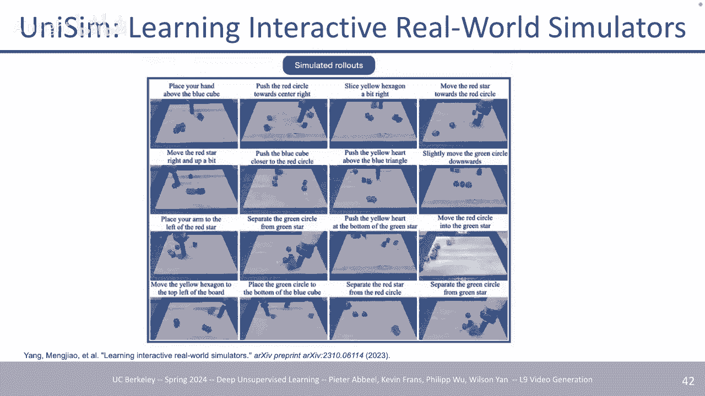

我没有我现在没有它嗯。

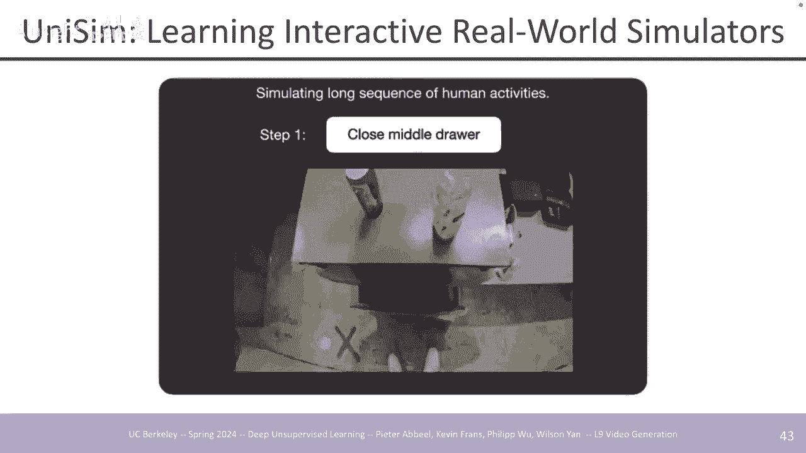

我认为这是另一篇论文，你可以，使用该生成就像你可以使用该，生成一样 人们，称之为逆动力学模型，他们采用两个相邻的帧，并计算，所采取的机器人动作，然后您，可以对每个相邻的帧执行此操作，这将产生类似于。

您的机器人运动的轨迹 然后可以，尝试复制，生成的计划，这里有一个问题，好吧，我，想在这些情况下，它通常相当，不错，但这取决于是的，有人，不是很常见，是的，人们，出于某种原因停止这样做，但是因为。

这些 通常情况下，他们会检查，像呃下游视频，我不会说这些视频超出了分发范围，但，类似的块位置，通常不在训练集中，或者，类似的东西，或者，通常用于大型 SC 的视频的相同内容，视频模型的文本我不会太担心。

就像记住一个视频并，输出它，除非你，真的搞砸了，视频，数据的管道，如果一个视频出现了，20 次 在数据集中，它可以，记住它是的，如果，某些事物有很多类似的重复项，这是可能的。

但如果有的话，我说，对于，文本图像生成中出现的任何问题，它也可能出现在文本，到视频生成中，甚至出现在，语言中 这是另一个例子，你可以如何调节不同的，动作，呃，你可以关闭中间的，抽屉。

所以这都是生成的视频，只是在不同的连续，文本提示下，你可以打开抽屉，抓住水瓶之类的东西，就像。

某种类似的东西，通过文本进行物理交互，这是。

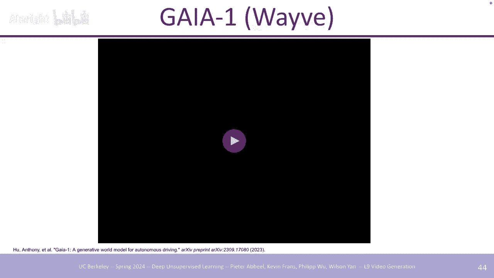

来自 Wave 的另一个例子，他们训练了，呃，他们训练了类似文本，呃，他们训练了什么，比如，自动驾驶数据视频数据，所以这都是，生成的视频，你可以，告诉 如果你真的眯着眼睛或者，哎呀但是是的。

所以我能够喜欢做一些，事情，比如哦鼻子，当汽车在它前面时它应该停止嗯你，可以做，转弯可以像改变我认为它，几乎要改变镜头但是 是的，在。

一天中的不同时间做类似的事情，类似于。

我，之前展示的那样，你可以要求，它打开和关闭抽屉，你可以，用不同的文本提示，所以这，也像许多其他数据一样进行训练，动作的语言数据，嗯和，视频，然后你可以做一个驾驶，模拟器，然后转向不同的，方向。

所以我想如果你要求它在，已经接近弯道时左转，它可能会转向弯道，但不完全是这样 所以它仍然，偏向于分布类型，来回答前面的问题，比如如果你要求它在那里左转，它不会走到路边，它，可能不会，因为所有。

数据可能通常都像良好的，驾驶一样 就像一个好司机，他们不会做疯狂的事情，比如撞上东西开车，你知道撞上人，这样的事情所以它可能也不会这样做呃，哦这只是模型他们只是，有不同的模式 他们有像。

视频帧一样的动作，我，认为就像方向盘一样，他们有不同的，就像我猜他们，有一些发生的某些事情的文本描述，他们只是在所有这些上进行训练，就像，在这种情况下的串联自动模型一样。

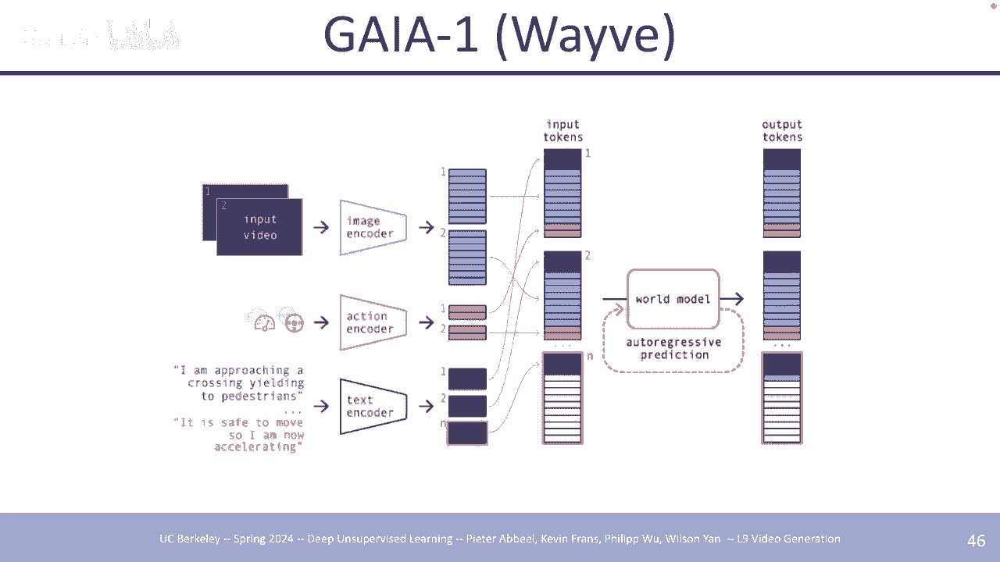

没什么，没什么太，疯狂的，这是最近来自协变的，他们发布了他们的呃机器人模型，其中一部分有很多，功能，但一部分是视频，生成，左下角是，生成的视频，然后，右下角是实际的 实际结果。

就像地面实况的实际运动一样，然后左上角，就像更多的条件，信息或左上角和右上角，就像拾取什么物体并将。

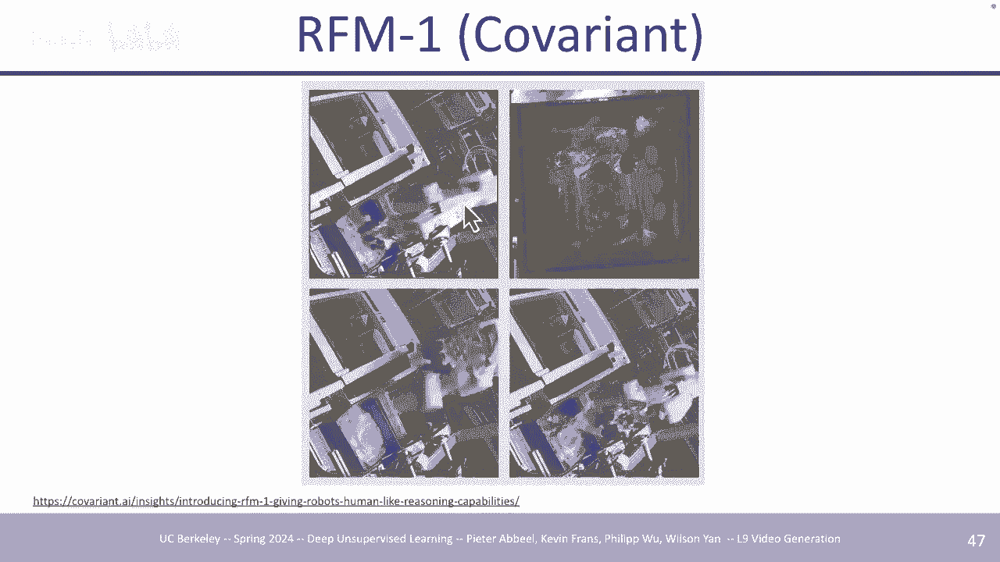

其放在，哪里是的，这是所有训练，哦，只是我想对于，模拟器部分来说，最相关的是，视频预测，但他们是，下一个 Tok 令牌预测，对，类似语言，图像、不同类型的机器人数据之。

类的一堆不同模式进行预测。该，计划实际上如何明确用于，视觉规划的另一个例子，我想我，提到过，我之前简要讨论过，你应该，像视觉 NPC 那样做一些事情，你可以在其中模拟，滚动 输出并模拟不同的动作。

所以这些就像动作条件，所以，你以机器人动作为条件来，生成其帧的预测，然后它基本上，就像一种搜索，我想嗯找到，最使其移动的动作轨迹 目标，这种情况下，左边的框架是初始框架，中间的框架就像我，相信的目标。

然后是最后一个框架，或者，就像，运行它的实际机器人的最终轨迹，然后，下面的框架是不同的，就像模拟一样，它的想法，呃，就像它，认为它可能正在做的事情，或者实际的。

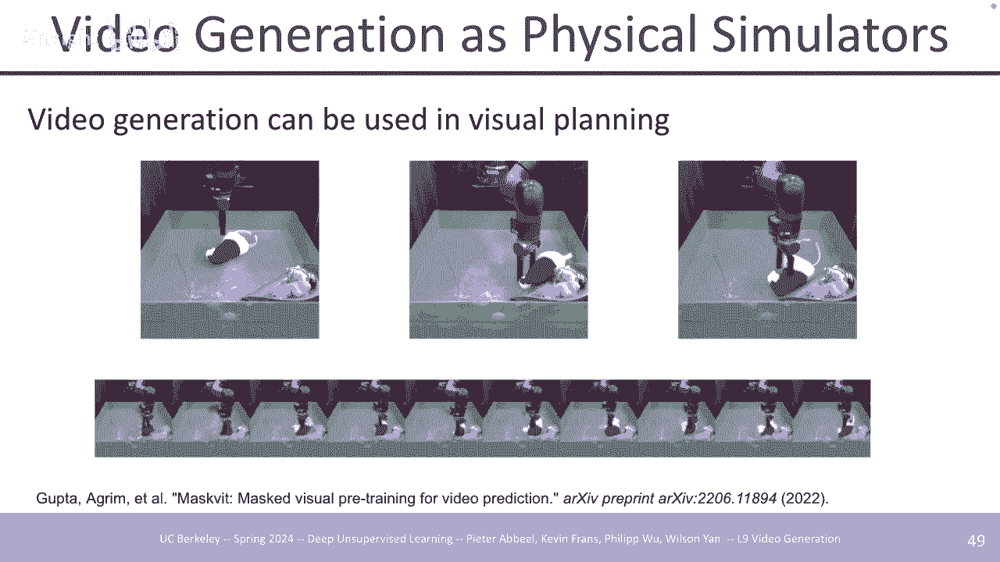

交互，嗯，这是我，在逆动力学模型中提到的，所以你生成正在完成的任务的计划，然后将，逆动力学应用于每个相邻的，帧 输出每个，时间步的机器人动作，然后你可以呃，然后，你可以在机器人上执行它们，希望它执行该。

任务，最后一项是我们，也在实验室中完成的一些工作，你可以使用，视频生成器 只要你有一个，基于可能性的视频模型，你基本上就可以使用，它作为奖励，只需使用，可能性，这样你就可以让它模仿，呃某些。

就像如果你的视频，模型接受了某些任务的训练，比如，捡起东西 就像，平底锅的盖子一样，那么高，可能性区域或高可能性，过渡将是，模仿相同活动的过渡，因此您可以将其用作，下游强化学习的奖励，并且。

它有效 还不错，嗯，最后一个是或者，我要讨论的最后一节，只是关于视频编辑，所以这是，我认为人们感兴趣的另一个主要应用程序，嗯，它可能主要是从，图像开始的，所以很多这样的应用程序，视频编辑中的作品。

将会有很多，就像哦，我们能够做到，这一点，我们能够使用像，图像扩散模型这样的扩散模型，来进行图像编辑，并，扩展做类似的事情，对于视频来说有点，简单，取决于，您想要进行的编辑，其中，一些并不限于扩散。

模型，例如控制网络，大部分，是融合，但实际的下游，生成模型并不重要，嗯，方式控制网络，如果您听说过的，话，本质上您只是在，增强预先训练的生成，模型或预先训练的图像或视频，生成模型，并具有额外的。

调节能力，所以假设我，想生成一个图像条件，例如 Cy边缘图或其他东西或，深度图或人体姿势，之类的东西，其，完成方式是，实际上有很多方法可以做到这一点，但为了，控制他们这样做的方式，他们只是有两个副本。

模型所以在左边，或像最右边的最右边的，图左边是，标准稳定扩散，然后右边是蓝色的，就像额外的参数，它们，基本上是，额外的可，训练参数 这是，冻结的同一块的副本，然后接受条件，信息，因此通常。

这种情况下的条件信息与，图像的形状相同，因此如果它，像边缘图或深度图，那么它，就像 与原始图像相同的呃分辨率，然后你可以，通过网络提供它，然后根据，这些特征对你的《，冰雪奇缘》，模型进行条件调整。

所以整个过程都经过训练，假设你有某种类似的配对，数据，就像我的意思是一些 很，简单，如果你想要像，灰度一样进行调节，你可以将彩色图像转换，为灰度，这很容易将成对，数据转换为深度，你可以。

应用深度估计器um 其中一些。

你通常可以运行一个，模型来计算该数据，这就是它的样子，所以，这是针对图像的，所以对于，顶部，我想是调节信息的一个示例，因此绘制了，正常的地图深度 地图，精明的不同类型的边缘检测，呃分割，就像RGB一样。

人体姿势非常流行，你可以让角色做很多事情，比如，做不同的舞者，或其他事情，嗯，是的，所以这一代，基本上就是这样 考虑到所有，条件信息，它，与那个嗯但其他一切，通常就像颜色或，类似随机的东西或。

像随机的纹理一样，你会看到，不同的东西，你可以做完全相同的事情，对于视频来说，你没有理由，不能直接使用，3Dunet，然后以，同样的方式添加调节，嗯，但在这种情况下，你的，调节信息就像一个，视频。

就像一个人们跳舞的姿势视频，所以左边是，呃，我认为这个姿势是，来自计算机的，然后右边是你，可以以中间的人体姿势为条件，或者最，正确的条件，然后像文本，提示一样，所以文本提示就像，我忘记的一些 就像。

1800 伦敦之类的穿着西装的商务人士，然后你，也可以在那里做深度，我认为文本，提示就像风格，就像，某种动画风格或，其他东西，所以这基本上，就像 你可以在任何事情上选择一个连接，只要你有，数据。

或者你有一对数据来，训练它。

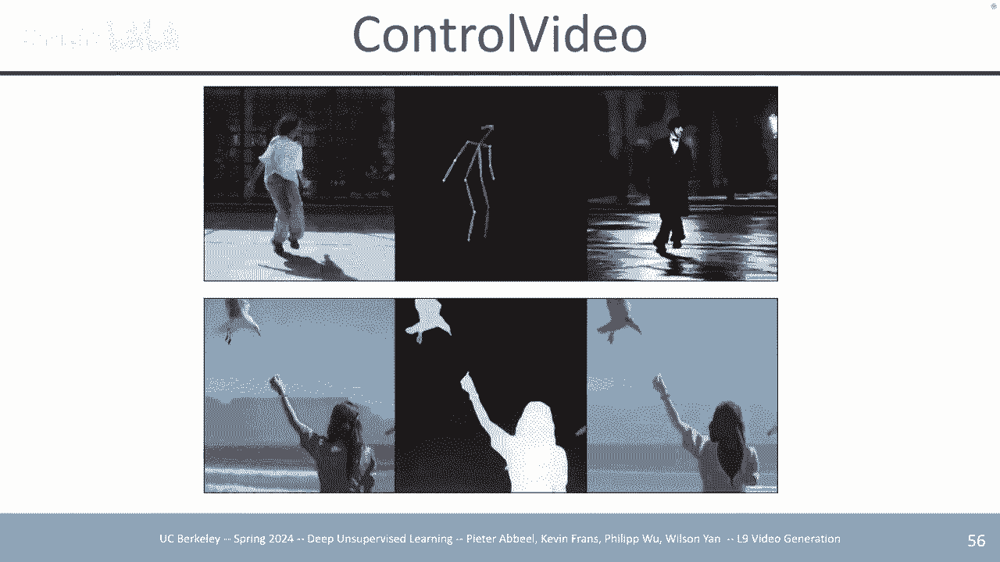

这更多，因为我认为，改变头发颜色，然后从，白天到晚上一些，你喜欢的东西没有被保留，例如，顶部的顶行提示，主要只是将头发颜色更改为，红色，但你也可以看到像，呃你可以看到泄漏，就像墙壁一样 连接到。

窗口的颜色不同，一种颜色，在原始上，更偏棕色，然后另一种颜色，更偏，红色另一种方式是嗯称为SD编辑，它很简单这就像更，具体的扩散模型嗯但是，这种方式 完成后，你直观地看到，当你应用，扩散前向过程时。

你的图像会变得越来越噪声，然后呃，然后你可以用你编辑的，新文本提示来反转它，就像它的方式一样 这里的工作，就像是像你一样，所以在这种，情况下，你有像你一样的，笔划图像，它就是输入。

然后当你的噪音、噪音和噪音时，该图像的分布变得越来越，大，因为你是，添加越来越多的 gion 噪声，然后同样的事情，如果你也噪声，让我们说像目标图像一样，你，不完全知道它是什么，但你。

应用越来越多的噪声噪声，你也会，看到分布扩展扩展，和 这里的直觉是，随着，它们越来越多地扩展，它们，最终会在，某个地方重叠，然后一旦你，应用了足够的噪音，你就可以，像新的文本提示一样应用反向 SD。

所以如果你有这个作为输入，然后 也许您拥有的新文本提示，就像是某物的真实图像或，高清图像，然后它会，采样，它会产生 D 噪声，但现在 D，噪声以不同的方向朝向，您想要的目标，图像。

所以这就是 实际的过程就像，我所描述的那样，所以你可以，像这样进行文本调节，这样你，就有了你的图像，然后你，有一个编辑标题，这样你就，可以将前向过程应用到，你的图像上，这样你就可以应用一些量。

噪声的大小，您应用的噪声量，实际上是一个超参数，所以这是您可以调整的东西，您添加的，噪声越多，您破坏的原始图像中的信息就越多，并且您添加的噪声越少，保留的，保真度就越多，但是，它能改变的东西就越少，嗯。

是的，然后一旦你有了，你的噪声图像，你就可以用，一个新的带有新标题提示的新图像应用相反的过程，嗯，我已经看过了。

所以这是一个例子 所以你，可以想象一下，对于视频，你可以采用任何预先训练的，文本视频模型，呃，你可以像这样，这只，熊，你可以对其应用噪音，然后，你可以用一个新的样本将其采样回来，呃。

像一只用木块跳舞的熊一样提示，然后你可以看到，一些课程信息被，保留，比如熊嗯的一般形状，以及，熊嗯的颜色，因为当你发出噪音时，你，可能还没有' 没有像，BR 颜色那样发出噪音，它可能还在那里，是的，哦。

那是从很久以前开始的，就像 SE 一样，就像你，可以想象的那样，嗯，我认为他们，在某些地方有这种功能，比如 Photoshop，或其他东西 你可以代替，绘画而不是艺术家绘制，完整的图像。

他们可以像嗯一样画，就像用颜色斑点，来代表不同的东西，然后，渲染原始图像，渲染成更真实的，图像，呃，不， 新颖之处在于。

这个编辑过程就像这样，非常简单，您只需应用噪声，然后使用，新提示进行采样，因此新提示通常会，反映与原始图像中不同的内容是的。

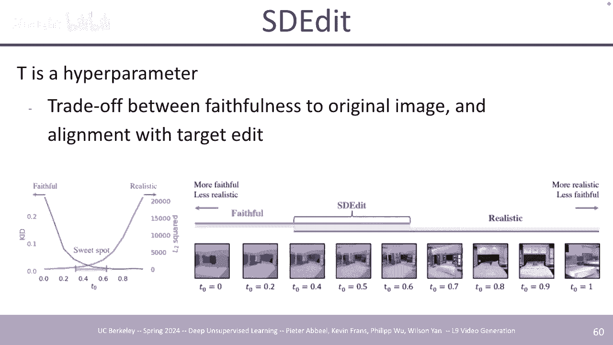

这是一个标准 使用，CFG 之类的扩散采样或类似的，标准，指导是的，嗯，像素空间，嗯，这，取决于模型，我想，如果模型，是像素扩散模型，如果它是潜在扩散，那么它会在像素空间中，模型是l，空间，是。

的，所以你明白了，是的，这些，想法你可以把东西做成，乐高所以是的，就像取决于，你添加了多少噪音，你可以有后面的，一些背景可以被，破坏，所以你会看到一些，背景就像全白了，现在，没有地平线了，路。

有点消失了，我的意思是现在只是一个斑点，嗯，所以，它就像一个超参数，你可以，调整是的，知道，它是一样的，就像你的直觉一样 当你已经破坏了，足够多的时候，添加足够的 gou 噪声，然后呃。

那个噪声现在是一个嗯，所以现在，如果你应用相反的过程，那么现在从该噪声中得到的样本，会有很多不同的图像，就像它不仅一样 你的，原始图像是作为一个，可能的解决方案，现在有一堆，图像是可能的。

解决方案不不不是的直觉都是，一样的是的，这里似乎可能更少，但从。

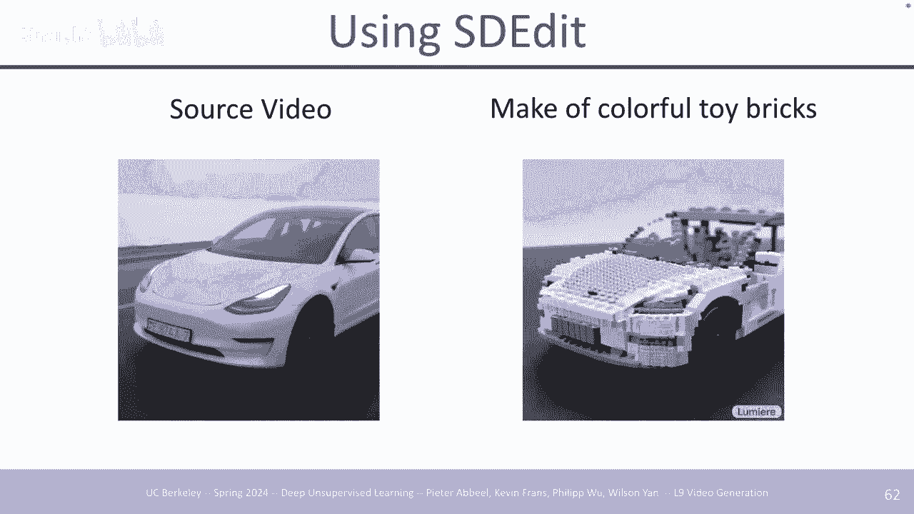

最后一个是他们使用的源视频，模型还是，很像我不确定它是否适用于，真实视频，不过好吧，我明白了，这还。

不清楚，是的，好吧，我要谈论的最后一篇论文，是快速支持，更通用的视频编辑，嗯，所以 我的意思是，我想，用最简单的话来说就是，你有一个像，文本视频扩散模型那样的预先训练的视频差异，然后你可以应用。

标清风格，但这种，限制它 朝着像一般更广泛的，风格变化嗯，你仍然保留了，视频的很多结构，所以，就像如果你也想，编辑视频的动作会发生什么我，有一个我有一个像sh的视频有一个，例子 这里有一个。

猴子在水中的视频，然后你，想让它呃挥手之类的东西，所以像标清编辑这样的东西，不会真正起作用，因为它，保留了视频中的所有航向运动或，航向信息嗯 所以，我们需要一种不同的方法来解决，这个问题。

它的工作方式非常，相似，如果你熟悉，梦想展位风格的东西，基本上你，可以找到调整，这样你基本上可以，对单个视频进行微调，这样你就可以，调整这个 整个像预先训练的文本，视频融合模型在这个。

你想要编辑的视频上，你想要编辑如此，昂贵，因为你必须，每次，都进行微调，但是你是的，你对视频进行了微调，然后你可以拥有像，他们也用在，像梦想梦想嘘风格中的稀有令牌，称为T，星，它可以是任何它。

就像这个稀有令牌只是任何，不常用于，类似语言中的令牌，你可以喜欢做，喜欢 您可以，像一堆，标题一样进行计数，或者像语料库这样的大型自然，语言一样进行计数，就像计算，每个标记，在文本中出现的频率一样。

然后选取，一些极，不经常使用的标记 或者有时就像，你将它们解码出来一样，它们就像是，非常随机的东西，但是你可以将，其视为一个令牌，你可以，像你的标题一样输入它，而，不是像这样，当你进行，微调时。

就像这样 呃，一个猴子的视频，而不是用那个，标题进行微调，你会做一个视频，一个，猴子，一个猴子，或者一个类似 tar 的视频，这样，当它看到那个标记时，它就会，知道，哦，我们' 正在谈论这个，特定猴子。

或实体或其他什么的特定视频，这里的微调损失只是扩散，损失，所以你只需要求它，但，你总是喜欢这个单个，视频，所以它就像批量大小一，训练 对于，您找到此模型的单个视频的大约 50 100 次迭代。

这里还有一些其他选择，它们不仅可以，对视频进行微调，还可以对单个帧或或或进行 F 调整，就像单个图像或或混合，图像，嗯，在这些情况下，它是，相同的，但是您可以快速屏蔽，右侧网络中的任何时间操作。

基本上就像，注意屏蔽或其他东西，我将，展示一个示例来说明原因 这，对于他们所做的一些事情可能很有用，是的，微调，损失，他们所做的最终损失只是视频，扩散损失，然后是另一个类似，视频扩散损失的损失，但是。

时间性的东西掩盖了支持，比如每帧的，东西，所以一些例子 他们所做的，左边是输入视频，我认为这些，是真实的视频，所以这些不是通用的，或者我的意思是，如果它们是，那么这些将是非常好的，生成视频，右边是像。

切片 K 那样的通用视频，很有趣，因为它 确实像，物理在这里发生的那种变化，比如，切蛋糕，我想，与切，水果相比，它更像是一种潜在的抵抗力，所以刀，在那里放慢了速度，嗯有点像粘在，刀上。

所以这是 图像微调，损失有点进来，它们，只是微调，你可以将其视为，连接同一个动作人物的不同视角的七个图像，然后嗯你可以，用这个编辑标题提示它，所以在实践中它，不会 不像一个玩具消防员，它。

可能像一个 t 星，你的，独特标记是举重，嗯，这，非常整洁，你可以，有点是的，这是一个举重的玩具消防员，所以这是我展示的猴子，作品，但有 有些人喜欢，过度饱和，比如，结果不完全确定为什么，是，的。

然后还有一些权衡，比如潜在的，噪音有多少，比如在采样过程中，添加了多少噪音，以及你发现调音的时间越长，你发现调音的时间越长。 它越多，它开始适合，右列的原始视频，然后噪声，有点像标清编辑噪声，因此。

添加的噪声越多，信息就会被破坏，因此，如果您添加非常少量的噪声，它可以更多地改变背景，噪声和所有，细粒度细节仍然存在，所以在，样本中它仍然像，河中的草或其他什么嗯，但如果你添加，更多噪声，那么一些核心。

结构会被保留，就像，猴子的位置一样，但它现在坐在 一个，不同的环境，如果你添加，太多，它基本上只会生成一个，不同的呃视频，我认为这里的帽子，就像浴缸里的一个环，或者，是的，呃，这取决于方法。

是否支持这个，不，因为你 必须微调，它会支持 Max 它会支持，就像训练分布，长度一样但有时取决于，开发的方法它可以，扩展到更长的，视频。

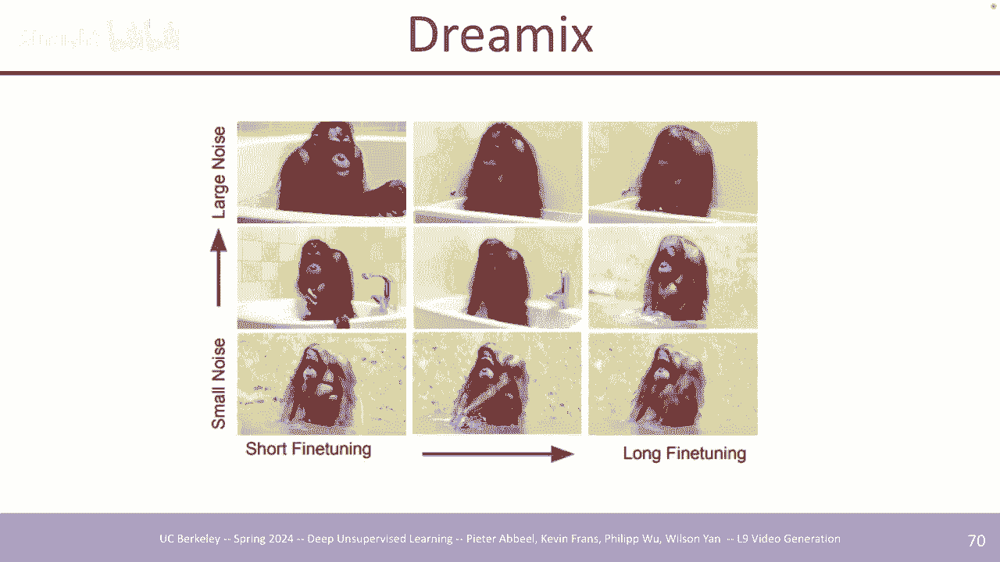

好吧呃你可以，用融合模型做的最后一个嗯也是，在绘画中做视频，这是来自，Lumere 的，你可以裁剪或，遮盖模型的某些部分，然后提示一些不同的内容，这样你，的原始视频就在左边，然后第二个就像穿着，浴袍或。

你喜欢的东西 必须，根据，你想要改变的内容来调整每个M的遮蔽区域，但是你可以，插入它佩戴的不同物体，比如派对帽之类的东西，或者。

