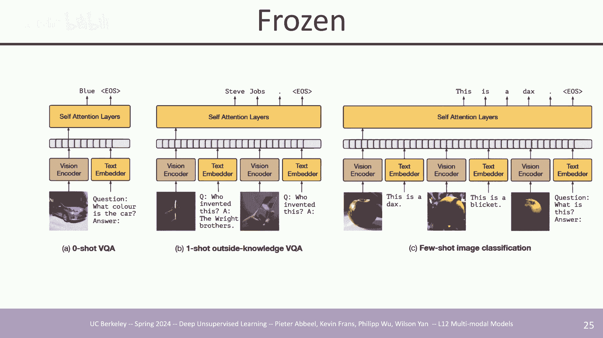
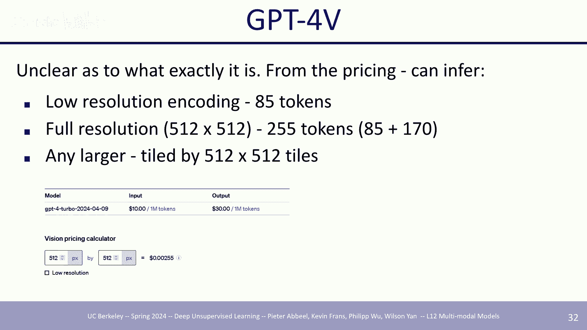
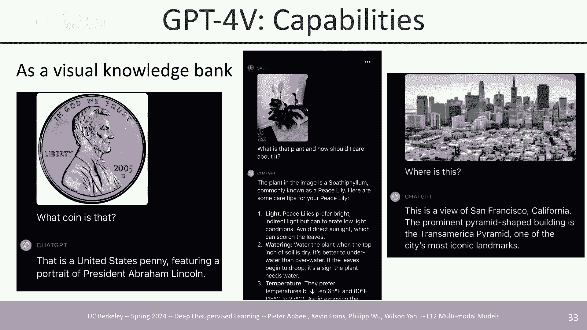
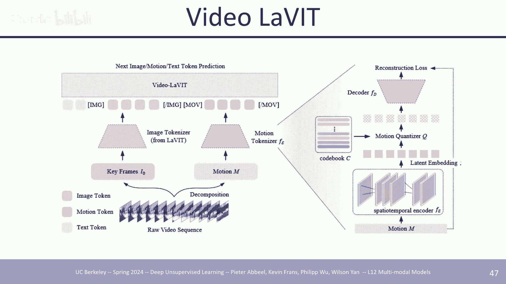
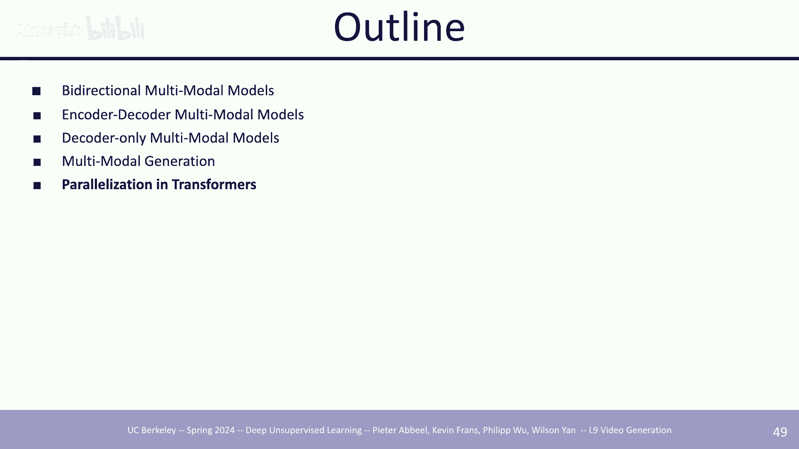

# [中英字幕] UC Berkeley 深度无监督学习 CS294-158-SP24  ｜ 2024年春 （更新至0824） - P13：12a 多模态模型 - AInsight - BV17W421P7QA

我想我们可以开始了，所以正如彼得提到的，我将主要覆盖多模态模型，嗯，然后还有一些其他东西，我会概述，但是，让我们开始吧，所以，我想多模态模型从广义上来说是什么，它是一种可以集成多种模态的自我解释模型。

这里有很多不同的模式可用，但是人们目前主要工作的主要模式是与图像和视频，这些非常相似，如果你把它看作是像图像和视频只是视觉模式一样，有文本和音频，如果你做机器人，可能会有更多，可能会有其他，如感觉数据。

可能会有像触觉，如触觉感觉，但是，目前被广泛使用的主要是这些，我认为大多数主要是因为数据的可用性，因为你实际上可以在线抓取，嗯，比如如果你抓取youtube，你会有一个视频和音频，并且你可以获取文本。

如果你进行文本标记，那么抓取文本是非常容易的，并且图像也非常容易抓取，最后，当我们学习这些多模态模型时，有一些结果我们是想要的，首先我们显然想要实现一种多模态的理解，在那里你可以像。

理解图像和文本并且学习它们如何像，一起相互作用，然后第二个，这稍微有点更难是我们想要实现更好的单模态理解，所以如果我有图像数据和文本数据，并且我尝试同时训练这两者，我是否能有更好的对语言本身的理解。

或者只是单独的图像，这是不同模型概述的简要概述，我将要讨论的，这些大多数只是，嗯，我猜我将会广泛涵盖，人们所做的不同种类的架构和模型类型，并且像，它们是如何训练的，在像，生成模型方面不会出现新的内容。

就像我们之前覆盖的所有内容一样，大多数这些模型都是自相矛盾的，有时候会有融合，这些可能是主要的两个，嗯，所以我们大多数都集中在，就像啊，它们种类的模型它们是如何结构的，以及像当前我们看到的能力。

像大规模的模型，像，像gpt四或双子星等它们能做什么，以及它们可能失败的地方，然后所以，这是第一种不同种类的模型我已经 kind of 像分开了，最后一种我只是会谈论一些并行化和转换器，这种类型相关于。

嗯，一部分我们本该覆盖的讲座，在lms讲座我们没来得及，但我们移到这里，并且在某种程度上这是一个很好的结束，基本上所有这些模型我们覆盖的都是本质上转换器，最后一部分只是一些实际应用你如何实际上并行化它。

如果你有一千个设备，你如何训练，嗯，这可能会非常酷，好的，所以第一部分是关于双向模型，在这个意义上它只是像，让我们说不是一个因果转换器，所以clip只是归类为双向模型，嗯，我猜技术上文本编码器是因果的。

但它不是，它不是，那不是目前被使用的任何方式，是的，所以已经有，所以我们已经覆盖了clip，我想我们在，或像之前的讲座，所以我不会详细解释它如何工作，但它是一个对比目标，你学习一个图像和文本编码器。

你可以使用clip做一些非常酷的事情，原始论文做了图像分类，这是我认为最容易的应用，你可以只取一个图像，然后你可以计算它与不同类别的剪辑分数对齐情况，然后根据最高对齐类的分数对其进行分类。

而这一分类方法有一个优点，与这些文本图像模型相比，你可以实际上实现这一点，假设你使用的是仅包含图像的模型，假设你使用了类似于sim clear的东西在imagenet上。

然后你进行了线性探测或者做了什么，或者你从那个预训练的骨干网络中训练了一个分类器来分类imagenet，这里我没有图示，但是有趣的是，这种剪辑方法在，它在分布的变化，嗯，在图像中，像。

与仅包含图像的方法相比，在图像上的分布变化，像，这可能是结合文本和图像的一个潜在好处，另一个在dolly论文中探索的点，我相信在原始的dolly论文中，他们使用了剪辑分数作为锚点。

因为实际上你有你的图像和你的文本，然后你可以计算这两个元素之间的对齐程度，对于dolly来说，他们所做的是，他们生成，假设你有一个文本标题，你可以生成大约十个或一百个图像，嗯，如果你想要从中挑选一对。

你可以计算那百对中的一对最高的对齐分数，然后选择那个对齐程度最高的一对，这通常效果很好，这是一些来自我们实验室的前员工的工作，它被称为dream fields，这是一些早期的文本到3D论文。

这还处于早期阶段，所以并不是像，你知道的，超级清晰，但它展示了一些将剪辑对语言的理解转移到生成3D的酷能力，而这实际上做的是，它，初始化了一个nerf，一个nerf的参数，然后你优化你的nerf参数来。

以与给定的文本标题保持高的剪辑分数对齐，如果文本标题是像，然后你从随机参数开始，你使用nerf来渲染，并且你取一个你，你渲染得像它的图像，像三维对象的图像，然后你将那个通过剪辑图像编码器喂入。

并计算剪辑分数，然后您将反向传播回神经参数以更新它们，还有一些像神经的东西，特定的事情来尝试鼓励它，以生成图像，像物体，一些鼓励的事情，像占用的嗯，像产生的三维结构，但在其核心，它本质上只是优化剪辑。

这像在文本到图像东西的开始阶段，在这之前，文本到图像模型或文本到图像生成模型不存在，这是另一种生成图像引用的方式，生成来自文本描述的引用，他们做了一些很酷的事情。

那就是他们基本上只是取一个v q can嵌入空间，嗯然后他们从像随机的，像潜伏的，他们将其喂入v q n解码器，然后像取一些剪裁并喂入这些剪裁到剪辑，剪辑图像编码器。

然后让它与一些像用户指定的文本描述对齐，你可以生成一些像奇怪的图像，这实际上非常类似于梦想领域，你在优化，像每个数据点，所以这是你在做像梯度下降，梯度上升在，像v q can潜伏的嵌入本身。

所以这里没有像神经网络被训练在这里，它只是在使用所有预训练的模型，嗯，你获得像一些奇怪的东西，非常像，有很多奇怪的艺术效果，你可以看到很多像重复的模式，嗯主要是因为你没有优化剪辑分数。

这可能有一些真的很奇怪的区域在，像图像空间中有非常高的对齐度，但你可以得到一些很酷的东西，嗯然后之后你也可以甚至对扩散模型进行剪辑指导，这通常在您实际上有一个可以生成图像的模型时工作得很好，嗯。

这是像一些东西，你可以使用剪辑在像图像生成中。

嗯我为什么有相同的幻灯片哦，让我们得到这个，好的，然后还有其他很多元素在不同的领域被人们实际使用，嗯，它是首先列出的点，它被用作一个主干，非常普遍，如果你采用一些预训练，如果你想要训练。

像是一个视觉语言模型，嗯，你通常采用像是一个预训练的lm理解文本和一个预训练的，像是一些预训练的图像编码器能够理解视觉，然后你就种结合他们，然后clip是一个非常常见的。

像是一个视觉编码器被用作一个预训练的主干，是的，对于表征也种作为预训练的主干，对于稳定扩散，它们交叉，它们交叉，在文本嵌入上关注，对于像是对于clip的文本编码，文本编码器来条件于语言。

然后最后一个是一篇论文在哪里，它叫做clipboard，这是在机器人的背景下，他们种像，嗯，训练一个机器人策略能够做不同的任务，嗯一些像是高级架构设计，但是其核心它是从clip的图像编码器初始化的。

这允许你做，你可以训练，你可以学习一个策略来做，像是一个对象的子集，你可以要求它拿起，一个红色的方块，或者一个泰迪熊，然后嗯，它可以推广到不同的对象或颜色或东西，这仍然是clip的分布之内。

但不是在下游策略中训练的，是的，最后的点种是alluto，那就是对于大多数情况你可以像，有一些小的量级的微调数据来处理一个特定的任务你想要解决，如果你微调与clip，那么它可以希望种推广到不同的。

未看见的视觉概念我们在微调中没有看到，所以我我猜clip非常有用，所以像，假设对于clip模型，这非常有用因为嗯，存在一个语言组件，所以你有一个任务，你指定，将红色方块放在绿色轨道上。

并且现在它可以泛化到不同的任务，那是像，将泰迪熊放入棕色盒子或类似的，因此从这个意义上说，clip可能是最主要的有用的文本到图像编码器，能够泛化事情，嗯，但我不确定像像图像，only可能不会做得很好。

因为你必须从头学习文本理解，本质上，好的，这是另一个叫做m three ae的论文，如果熟悉ma e工作方式，e本质上是这上半部分，你有你的形象，然后你遮蔽它，你输入未遮蔽的。

或你输入未遮蔽的补丁通你的编码器，然后你尝试解码原始图像的其余部分，m three ae只是那加上文本，所以这是像mae，加上burt我猜，我猜你也遮蔽了语言标记，相同的架构风格。

但现在你的输入到编码器，只是未遮蔽的图像和未遮蔽的文本标记的连接，然后你尝试解码整个像文本图像对模态，然后在这种情况下你也可以所以，在这种情况下你可以做文本图像对，你也可以做嗯，像图像只数据。

在这种情况下文本将完全遮蔽，你可以使用文本只数据，在这种情况下图像将完全遮蔽，嗯，所以你可以用任何这些模态的组合，但我相信这主要是在文本图像数据上训练的，是的，如果你不发送遮蔽，试图记住。

我不记得立刻它就，它可以是添加了位置编码在这里然后当它是，嗯，补丁是选择的，它保持在原始图像中相对位置的状态，但我不记得确切的，我必须听和看代码，还有其他问题吗，好的。

关于m three ae的一个有趣发现，所以这被与e进行了比较，所以e仅训练了我们自己的形象，让我们说是的，只有图像和m three ae在图像和文本上都进行了训练，这是线性探针的准确性。

我认为可能在imagenet上，imagenet，但你可以看到一个非常大的提升，并且像质量，让我们说代表质量的质量，作为函数的函数，它多好，作为像线性探针一样，很可能是因为嗯，标题，像。

imagenet的标签或目标也都是非常像，像更多的语言，在意义上像，它就像一只狗，一种狗，或一种猫，或一辆车或一辆卡车，这可能有助于，就是为这种事物提供更好的表示，通过微调，与原始模型之间的差距较小。

因为现在您可以更新所有不同参数，但仍然有一些改进，尤其是嗯，与，您可以通过微调来获得良好的性能，较少的嗯，像，如果您喜欢网络中的一部分来获得良好的性能，是的，抱歉，这些是一些关于的视觉化。

我相信这基本上是一种视觉化，像，您可以看到绿色，像，绿色方块，绿色方块关注的文本部分的哪些部分，所以可能对草莓的关注过于饱和，但这告诉我们这是什么稻草，然后，这可能是因为加上浆果看起来太长了。

但是但是但是嗯，大概就是那样，然后对于那边的东西，也是一样的，看不见，哦，好的，所以稻草，然后感叹号，感叹号浆果，我不知道我为什么会有那些，嗯，然后最后一个，最后一个是屋顶漏水，然后像有一张。

像漏水的图片，它专注于那些，那些词语或句子的部分，这也是一种可视化，就像td图的一样，就像代表，在那里，它们对于m three ae来说更好聚类，which had like text，有监督。

与mae相比，你可以 kind of，有一些像簇的，但它比m three散得多，哦，我嗯，哦，是的，是的，也许是的，是的，那看起来是可行的，是的，可能的，酷，好的。

所以这些都是属于那种双向多模态模型的类，现在我将覆盖不同类型的更多，我猜想更多的是专注于transformer的模型，只在多模态生成中使用编码器解码器，但第一个将是类似于编码器解码器的模型。

第一个是火烈鸟，所以这一做法是，他们首先利用预训练的语言模型，所以我只在纯文本数据上进行预训练，然后问题是如何能够，现在我想要理解图像，所以是，如何将无条件的图像输入。

和火烈鸟是稍微更复杂的建筑选择之一，但是尽管它工作的方式本质上是你有像你的，你的终点，语言模型的层，所以在右边你看到，像第一个艾伦块和艾伦块，然后在所有这些之间你基本上插入，嗯，他们叫做这个门控交叉。

注意力加密集层，它是，它是像另一个门控变换器块，你可以然后基于图像进行条件，他们如何条件图像是，他们只有有像一个视觉编码器，对于它可能是什么，它可能曾经是一些resnet，然后像一个预先训练在。

它可以是任何，他们使用了一个感知器重采样器，我不知道你是否在这个类中覆盖了感知器，但至少从本质上来说它只是，它只是像一个变换器，像一种将，像任何，像可变大小的，嗯，标记，例如。

这个视觉编码器可能潜在地输出不同大小的标记，取决于输入图片的分辨率，如果分辨率更大，它可以输出更多的标记，但接收器只会将其转换为，处理它，使它像，它计算一个恒定的编码。

我认为在这个情况下它是六十四个标记/图像，他们如何基于它，是，他们有这个门控交叉注意力密集层，这与标准自注意力层相似，所以他们有，但而不是自注意力，它是交叉注意力，所以它们交叉关注查询是像。

你是变换器的隐藏状态，然后键和值是你交叉关注的，这在这种情况下是像图像或你基于的条件图像，然后之后是标准前馈层，如标准变换器块的前馈层，"他们称之为封闭式社区的原因之一"。

"Where the main purpose of this is that initialization" 翻译成中文是："这里的主要目的是初始化。"。

"The gate will be zero" 翻译成中文是："门将变成零"。不过，这句话在英语中可能指的是一个控制门（如电子门或阀门）的设置将被调整为关闭状态，或者更准确地说。

将被设置为不传递任何信号或流量。在中文语境下，"门将变成零"可能不太常见，但如果上下文是关于控制或设置，那么它可以表示将门或阀门关闭到极致的状态。

"So when you just start training the" 这句话的中文翻译是："所以当你刚开始训练时，"。

"The model will be behave identically to" 这句话可以翻译为：“该模型将与。行为完全相同。”，"就像它初始化时所基于的原始语言模型一样"，"然后。

当你开始训练时"，它将学习如何融入，嗯，像重量可能会像像像偏离零，随着它学习如何将图像信息融入帮助预测，它需要预测的文本，所以所以，所以关于这个模型和很多我们将要谈论的模型，是这些模型仍然只生成文本。

但学习如何基于图像进行条件化，所以它们不能生成图像，它们只能生成文本。

这是一个它们展示的一些能力的例子，关于火烈鸟，所以这就有点像，嗯，就像在情境学习中的那种东西，或者像任务说明，所以这就像一张图片，这是一只奇琴鼠，这是一只柴犬，然后它问你是否喜欢填写正确的，就像就像。

它就像提供第一个和第二个例子作为任务是什么样的例子，然后要求你解决新的任务，就像小说的图像，它是嗯，还有其他像不同格式化的东西，那么这个的标题是什么，这幅画的东西在哪里，像那样为qa，这就像隐含的。

就像一个像，有点像ocr任务，你在展示OCR用于阅读标志的例子，然后你让它解决一个新的，这是一个新的标志。

还有一些其他的酷东西，嗯，第一个有点，我想它更像是像视频理解一样，如果你只是像序列一样拼接帧，在这种情况下你可能不能添加太多的帧，但你可以问关于这个视频的问题，然后他们可以尝试回答它。

你可以对图像进行对话式的询问，嗯，是的，你可以对同一张图像提多个问题，询问其中的特定方面，还有其他内容。

这是他们的定量结果，嗯，基本上远远超过了一些之前的，像零，几拍的算法，嗯，虚线是状态-of-the-art for，像微调模型，像一种种的基准，基准，特定微调模型，对于某些来说，它仍然低于零拍的to。

像实际的，像微调状态-of-the-art，对于某些任务，它超过了它，在这里右边，它通常是第一个研究，我猜在，像这些模型的可扩展性和能力，以及随着你扩展会发生什么，哪，你可以 kind of 预期。

模型随着你扩展越来越好，这主要是扩展了 lm 部分网络，好的，嗯，这是另一种种，这更接近一种更正式的，像我们看到的叫 poly 的 encoder decoder 风格网络。

所以非常直接的架构是你只有你的图像，你有一个 vision transformer，这将基本上本质上将图像 tokenize 成像二五六个 tokens，然后你将它与语言嵌入连接起来。

并喂给 transformer encoder，嗯，这将输出对于本质上问题的表示，所以通常输入将是一些问题加上图像，然后解码器将回答或回答问题。

或退化文本 condition on encoder output，所以这非常类似于原始的 attention is all you need，像 encoder decoder 架构。

但只是纳入了图像，而这一个他们也有了像 flamingo 类似的类似趋势像 scale，你有你越好，而这他们也扩展了视觉组件，你可以看到像，G veg 和 v e 嗯，然后。

我们将在将来的所有工作中经常看到另一个巨大的好处，那就是，如果你想从模型中获得性能的显著提升，你可以扩大你的模式，但是，另一个选项也是扩大你像，你输入的图像分辨率，这将为你带来一些相当大的提升。

特别是让我们，让我们说，像文本大写，很可能在性能上获得巨大的提升，这完全可以理解，因为它主要是一种OCR（光学字符识别）式的文档阅读，类似于文档阅读，潜在的一种任务类型，在这些任务中。

你可能需要更精细的补丁来理解，文本，以像素形式，但是，所以，我猜测最终如果你想要提高模型性能，可能有多种方法可以增加模型的FLOPs（浮点运算次数），本质上到最后，它就像如果你增加FLOPs。

可能会更好，一种方法是通过增加模型的参数数量来增加其大小，另一种方式可能是通过提高分辨率来增加FLOPs，因为通常分辨率越高，你拥有的标记就越多，对于你的长序列长度Transformer，所以。

随着你有更多的FLOPs，这也有，但参数计数没有改变，在多模态之后，过去几年中有几篇其他论文，所以，关于poly x um，我不会深入探讨最终的结果。

但是大多数结果都是通过进一步的规模化来实现的更好的结果，更多的调整，在训练方案上做了混合使用不同的，像自监督目标以及不同的，他们拥有大量的不同，像去噪任务，嗯，以及语言模型训练，嗯，进一步的训练。

使用ocr目标对视觉编码器，我认为这基本上是OCR训练，对于单模态来说，对于图像编码器部分，并且这转移到了更好的，OCR和下游模型Polly 3，嗯，我认为目标是基本上构建一个更小的模型，它也非常强大。

之前他们使用，我认为一个在OCR上训练的文本编码器，再加上一些像jft的，像图像分类，像谷歌拥有的图像分类数据集，但他们转向了siliwhich可以进行大量的大规模文本图像训练。

他们还有其他东西像更好的数据，混合了哪种类型的像ocr，像高质量的ocr数据，其他种类的高质量数据，分辨率提高，我相信他们在这篇论文中做了像progressive的。

我认为大多数这些论文都喜欢polyx和poly three，它们都这样做了，但他们确实喜欢在高分辨率上逐步训练，poly three是最大分辨率的，他们训练的图像大约是像一千乘以一千这样的。

所以最终结果相当漂亮，是他们的性能与polyx相当，尽管只是小约十分之一，所以polyx大约是五五亿，而poly three是五亿，我并不完全这样认为，我认为最终我百分之百确定，但是。

我认为最终发生的事情是，编码器可以，嗯，除了本质上的变量分辨率，但是，发生的事情是你只有有更多的输出标记，然后那些，然后这样使得下游的变换器，或者当你训练整个模型时，它可以接受像不同序列长度的输入。

本质上，酷，那就是编码器，解码器解码器可能更常见，尤其是在大型模型中，现在，这是早期探索这一领域的论文之一，我不知道大约三年前发表的一篇名为《冻结》和非常简单的想法的论文，因此。

它也采用了一个预训练的语言模型，在这个情况下，你将你的视觉编码器，他们使用了一个非常简单的，就像ResNet，ResNet编码器，我的意思是，即使在那时，那个时期的语言模型也不是很好。

这就是一种概念证明，这种东西，嗯，他们他们有他们的文本图像数据，并在其上进行微调，所以，在这种情况下，图像后面是，让我们说，标题，然后一切都被冻结，除了分词编码器，它被微调，整个东西都是在。

像下一个标记，"Prediction loss for language" 翻译成中文可以是："语言预测损失" 或者 "语言预测误差"。

这里的 "prediction loss" 或 "prediction error" 通常指的是模型在预测任务中与实际结果之间的差异，即预测值与真实值之间的误差。"这就是他们做得非常好的一些事情。"。

非常类似于喜欢，"Let's say" 翻译成中文是 "假设" 或 "我们说"。具体取决于上下文，它可以表示提出假设或开始一个假设性的讨论。例如：火烈鸟。

"Which was kind of run" 这句话翻译成中文可以是："这有点跑题了" 或者 "这有点偏离主题了"。这里的 "run" 通常在口语中表示“偏离主题”或“跑题”。

"类似的做vqa的时间"，"Um" 在中文中通常表示一种犹豫、思考或者不确定的声音，类似于中文中的“嗯”或者“嗯……”。它通常用于对话中，表示说话者在组织思路或者表示同意、理解。

"Like few shot like" 这句话在英语中并不常见，也没有明确的含义。它可能是一个非正式的表达，或者是一个特定的俚语或流行语。在没有上下文的情况下，很难准确翻译其含义。

如果你能提供更多的上下文或解释，我可以尝试提供更准确的翻译。"Yeah" 翻译成中文是 "嗯" 或 "对"。它通常用于表示同意或确认。就像很少见的任务，你可以指定，嗯，它像交错的数据。

交错数据是编码器风格模型更难处理的事情，因为对于编码器-解码器模型来说，输入的结构并不明确，但对于只有解码器的模型，你可以简单地将序列视为一个连续的令牌流，你可以将其连接起来。

所以对于这些任务任务规范来说，这要容易得多，如果你想将图像和语言混合在一起。

然后嗯然后冷冻后，这是最近的，让我们说元数据中的羊驼出来后，然后出现了更多的像精细调整，所以维克纳是精细调整版本的一个例子，被设计来跟随语言指令的羊驼，所以你可以做类似的事情。

如果你想为图像创建一个类似的模型，你可以做的这些工作在四和lava中相当接近，那是你可以根据你喜好的kuna模型，这基本上是llama冻结它，然后你可以用这个与视觉编码器。

所以mini gbt使用这个vid plus q former，这来自一个名为blip two的论文并且lava使用clip，一个clip图像编码器，然后在之间他们有一个单一的类似投影层。

这基本上将维度映射到vikuna变换器的输入，在大多数情况下在这个情况下你训练的只是像投影层，它实际上在多模态理解方面工作得很好，而且这相当便宜，因为很多东西都是冷冻的，而且实际上很少需要精细调整。

lava的实际训练方案比mini gp four稍微复杂一些，他们被分成了两个阶段，所以第一阶段你训练在一个稍微更大的数据集上，比如六百万的文本图像对，然后你冻结视觉语言骨干，你只训练一个投影层。

这就像mini gp four做的，然后阶段二，你可以做的就是你有像很多更集中的，像高质量的指令数据，像精心挑选的，一个非常小的数字，然后你可以精细调整整个东西，但在这种情况下。

他们只是保留了愿景骨架仍然冻结，但重要的是，他们只是精细调整了那个，模型本身，这在一般上你应该能够有更好的性能，只是因为你正在精细调整模型的更大部分，这些都是他们一些相当酷的例子，所以，哦等等。

这是什么，嗯，哦不，所以可以，让我们，让我们跳过这个。

好的，这样可以，嗯，是的，然后他们有了一些未来，他们像有更多的这个工作的迭代，他们曾经有过1。5的熔岩，分辨率更大，他们看到了更好的性能，他们而不是像线性投影层，他们只是做了一个mlp。

然后可能像两个层的mlp，然后他们只是用更好的数据来指导数据，只用了更好的vqa数据，将OCR数据之类的东西用于获得更好的性能，而且他们进行了一些基准测试，对比了，比如一些之前的模型。

总的来说性能非常强劲，尤其是看到这种情况，比如，例如，这个拥有800亿参数的模型仍然比lava性能差很多，因此，对于这些大多数情况，实际上通过精心挑选优秀的数据就可以获得非常强劲的性能。

尤其是如果你看性能对比一些其他拥有相同数量参数的模型，比如lava1。5拥有70亿参数，对比一些其他70亿参数的模型，甚至对比一些更大的模型，所以在这种情况下，尺寸确实很重要，但是。

高质量的数据整理和精心的训练实际上可以走很长一段路。

对于他们最近发布的lava one point six，嗯，他们有一种，主要的创新之处在于对输入图像的分割方式的不同，他们这样做的方式是，特别是如果你希望支持非常高分辨率的图像，当你的图像分辨率过大时。

他们会将图像切成小块，形成小分辨率的图像，然后它们分别对这些进行编码，然后它们将之扁平化和连接，将一切作为输入，然后它们还有一种类似于一种缩小表示版本的，他们将其缩小到瓷砖大小。

然后也将其作为输入进行编码，所以你有两种类型的信息，这些可能包含图像的高层次信息，然后它们有真正精细的细节，就像原始高分辨率图像一样，这对于文档理解非常有用，这些有很多非常小的字符。

这些都是一些例子，他们所有的基准测试，嗯，最后一行叫做lava next，他们也将其扩展到34b，并且总体上具有很强的性能，尤其是作为一个开源模型，与一些其他模型相比，甚至与像。

像gemini和gt4一样，我想主要是数据可能不是问题，我想主要是一种添加浮点运算到模型中的方法，这使得它本质上，对每张图像执行更多计算，从而使其性能更好，从数据角度来看，我想总是可以做更多，潜在的。

甚至是单模训练，或更高分辨率的图像，甚至是多模训练，所以我不认为这是太大的问题，通常我猜另一个点是更高分辨率，有更多的信息，但这并不是像2。5，6乘以2，5，6图像那样，什么的显著更多信息，好的，嗯。

我猜像，那正是gpt四视图正在做的，因为我我认为那个，那个六边形的贴图事情，嗯，我在博客文章中提到，我认为它们提到的是，他们没说什么，但你可以从他们的定价模型中猜测，如果你到处玩耍的话。

因为他们这里有一个视觉计算器，这基本上告诉你这个输入分辨率，或者对于这个输入分辨率的图像，需要多少令牌，在这个情况下，对于这个512x512，你可以大致推断，所以，如果你使用像低分辨率一样的。

你会得到85令牌，然后，完整的分辨率是512x512，你将获得255个，这可能相当于85个低分辨率标记，加上670个，嗯，其他标记，或者像更高分辨率的标记，然后。

如果你输入的任何图像都比512x512大，例如513x513，最终发生的事情是，它表现出非常相似的瓷砖行为，所以五乘以十三再乘以五乘以十三最终还会是四块瓷砖，因为它会四舍五入到最近的五乘以十二。

本质上可以将其处理成类似于一个十乘以二十四乘以十乘以二十四的图像，这就是类似于lava one point six所做的事情，这可能也是gbt四 v所做的类似事情，但这一切都是假设性的。

在能力方面，它们有一个相当有限的，我猜测在可以做的事情这一类别中，它们像gpt一样，T four and the same thing with gpt。

Three and language models is that you can kind of act as a knowledge bank。

In this case you have a knowledge bank of more visual information。

So it knows it knows what a penny is，It knows like what the like this plan is。

And then maybe even like more famous shots or or shots of，Like a city with，Like famous landmarks。

That it will know where it's located。

You can do ocr，有一条在推特上非常流行的，我想当四个人中的两个回来时，这真的很复杂，没有停车标志，基本上这是一个约束分类问题，你问它，哦我在哪里实际上，或者我什么时候实际上可以停车。

嗯或者我现在可以停车吗，然后它的目标是尝试解释所有这些，所有这些奇怪的事情，并且要找出，哦，当我实际上可以停车的时候，然后像其他类似的东西，Bgp四v，他们还有一些像，像一系列非常酷的基准测试。

像不同的不同测试，不同的高考考试，像SAT、BAR考试那样的东西嗯，它也可以做那个，这是一种结合了像，高级推理的像，和像，对阅读的视觉理解，像某些图表，某些文本，然后尝试处理以回答问题。

这不是他们原始演示中展示的同一个，但我认为有人或某人尝试过，但你也可以潜在地甚至有一个模拟图表，然后要求它输出遵循图表的代码，显然不是非常完美，它可能充满了错误，或者它只能做简单的事情，但很酷。

很酷的能力，至少从开始，嗯，是的，这些都是一些例子，我相信来自他们的安全或系统卡，但在那里它不是完美的，它像所有这些模型一样工作，它们会幻觉，所以很多这些它们可以只是听起来非常，我的意思，阅读这个。

甚至，我不知道它是否正确或不正确，我不理解像生或化，嗯，但在这些情况下我猜它仍然错误，如果像专家验证，或对于这些关于脑部扫描图像的案例，那里是，它有时错误，但也有时正确，这不是很理想的行为，如果你。

如果你想能信任它。

酷，所以那是三和四，There's ji one point five，Which was essentially focused on longer context models again。

We don't know what it is，They mentioned some stuff about discrete models，Maybe vq plus coca，Um。

So it could be some sort of like discrete auto encoder that was trained，Something similar to coca。

Which coca does a combination of image captioning plus text to image contrastive objective。

So you can almost think of it as like part of it is just like a v，Q版本的剪辑，我想，好的，嗯，是的，所以。

主要一个问题是他们的嵌入可能是离散的，我不知道，我意思是离散的，然后，它也可能像有一些文本图像一样，在自编码器训练中的监督，嗯，这就是是的，所以这些是他们的一些初步结果，让我们只关注他们的长上下文。

他们模型的焦点，他们可以处理非常长的视频，从一分钟到一小时，这是一个非常经典的，像针检索问题，最初这是非常常见的，语言模型中，你插入一些像，你有一个文档，有一百万标记，然后你插入一些随机事实，嗯。

一些随机数字，假设魔法数字是一七八三六二，然后你问它，哦，魔法数字是什么，然后它本质上就像一个检索问题，在这个长长的文档中，他们对视频也做了类似的事情，我认为他们构建这个的方式是。

你有一个六分钟的或一小时的视频，然后在一个非常狭窄的范围内的帧子集中，在视频中随机出现，你只是插入了一种像样的覆盖式字幕，上面写着，哦，魔法数字在不同的深度可以是任何数字。

所以深度是针头或魔法数字插入的地方，然后x或x轴，这就是视频试图处理和检索的长度，总的来说，任务并不难，但你仍然能非常完美地做到这一点，真的很令人印象深刻，真的很长的上下文，我认为甚至有一个达到了。

是的，右边的上升时间达到了十个小时，这相当疯狂，这些都是一些像，我想仍然我会将其归类为检索任务，但是一些更合理的，或更自然的，所以这一项是你感觉像视频，像一部四十分钟的鲨鱼福尔摩斯电影。

然后你可以问它一个问题，所以是，它是否告诉我关于从人口袋里移除的纸张的一些信息，以及那个时刻的时间代码，然后它可以处理这个视频并找到那个精确的时间代码，所以我想象他们可能已经收集了一些类似的微调数据。

性质相似的，不确定是否效果良好，我想你可能需要有一些微调，无论如何，另一个相当酷的，所以这项是视觉检索，所以他们只是某人画了一个真的很，你知道，就像这样的一个草图，像这个水罐，水从它中流出。

我正在问你在这个视频中或电影中找到这个时刻，然后它可以找到像视觉对应的场景，看起来非常相似，这真的很酷，这是一些在线上下文信息，如更多的定量结果，对于某些数据，对于某些基准。

我认为一小时的视频质量保证是新近他们创建的一个之一，其中，嗯，如果你在处理长视频，所以有像多种方式处理长视频，例如，如果我的视频模型只能处理十六帧，那我实际上可以处理一小时长的视频，如果我取十六帧。

像步过那一小时，只是选择得非常稀疏，嗯，但在这种情况下，理想的情况下，你能够从视频中采样和处理的帧越多，你回答的复杂问题就越多，或你对视频的高级能力或理解就越多，所以在这种情况下，他们 kind of。

至少对于他们的第一个基准，他们展示了能力的提高，正如你向模型输入了更多的帧，嗯，然后对于自我模式，我有点儿在稍微之后达到了饱和，视频也大大缩短了，三分钟，好的，那是解码器只模型的情况。

所以现在我将快速谈谈多模态生成，并且我正在以这种方式措辞，多模态生成是视频制作的一大部分，就像是，我们在这整个课程中讨论的模型通常只生成一种模态，它们可能受到多种模态的影响，但通常只生成一种。

所以像稳定扩散这样的模式只能从文本中生成图像，嗯，这些视频生成模型只生成视频，嗯，视频诗人可能是一个例外，带有生成视频音频的功能，但现在的问题是，我们能有一个可以生成任意数量的模态的模型吗。

这样我们可以同时生成文本和图像，或者从文本生成图像或从图像生成文本，嗯，有一个单一的模型可以做所有这些事情，在这篇论文中我将简要介绍这个模型，这相当酷，它被称为Cody，我猜测到任意生成，论文的目标是。

我们有图像，视频，语言和音频，那么我们能否根据这些模态生成任何这些模态，所以我把它输入为一个图像和一个文本描述，我想要生成视频或图像和音频，并生成文本描述，或者基本上任何输入和输出的这些组合。

我只简要谈论这个，如果你感兴趣，你可能可以在那里阅读更多关于它，或者看他们那边有的例子，嗯，但是他们这样做的方式是，以便他们有很多训练阶段，他们首先做的事情是学习一个联合嵌入空间，基本上。

目标是学习一个单一的嵌入空间，其中所有这些模态都被对齐，所以，一个例子是clip，所以，clip是一个文本图像模型，它学习一个文本和图像的联合嵌入空间，这是大致上与相同的对齐的。

并且几乎有时像某种程度上是可以互换的，嗯，但在这种情况下，我们要学习一个用于多个模态的，而且他们这样做的方式，就像在这篇论文中他们做的那样，是一种相当简单的方法，嗯，这种方法有一些优点和缺点。

但他们只是把所有的一切都连接到文本上，因为找到它相对容易，比如x模态加上文本，所以他们在视频中有文本，所以他们学习像文本和视频的片段一样，嗯，我认为训练过程是，他们基本上只是冻结那个。

或者他们训练文本编码器一次，然后冻结它用于所有其他的，然后对齐它，然后他们使用像文本这样的数据来学习图像编码器，文本来学习音频数据，嗯，音频编码器，所有这些基本上像这些数据集一样存在。

所以你可以下载它们并使用它们，然后，他们我猜想像阶段一，部分二是，他们然后只是训练这个，嗯，他们训练单独的生成模型，所以他们训练像视觉模型条件于文本和音频模型条件于文本等，然后阶段二变得稍微复杂一些。

因为目标主要是你想要能够条件于，不仅仅是文本，但也是音频或视频或什么，但现在管理起来更容易，一旦你有像这种对齐在空间中，因为所有的表示都是都非常相似的，当他们想要具有相同的意义时。

所以所以他们基本上这里所拥有的是，我不会深入探讨它，是他们对这些模型有一些额外的微调，以集成其他模态的条件，而且在这个案例中这里有一个预先定义的对齐。

因为在这个案例中你可以看到它是像一个冻结的视觉编码器，而之前你使用冻结的文本编码器，但在这个案例中由于视觉和文本已经对齐，那些向量基本上是可以互换的，或者你可以在他们之间插值，它会大致工作，大致工作。

它不是一条精确的线，但他们做得足够好，你可以基本上交换他们，然后你可以利用这个事实来在生成时条件于多个东西，好的，嗯，然后，然后还有其他一套工作，它们稍微简单一些，这些主要关注图像生成和图像描述。

所以你可以做，你可以输入文本来生成图像，或者你可以输入图像来回答关于，而且他们这样做的方式类似于我们之前看到的不同种类的，像多模态模型一样，有点像熔岩或迷你gpt四，其中你有像图像的剪辑编码器。

你可以作为标记输入，并将其与文本连接，然后现在除了像语言的下一个标记预测之外，你底部的是啥，基本上你有一个回归，所以它会它会回归到，它想要生成的图像的剪辑嵌入，现在当你对那个做回归时，输出的是。

像这样的，非常像非常像，它是一个非常复杂的分布，最终它 kind of 回归到了平均值，所以它不会产生很好的，它不会对应得很好的图像，所以他们额外微调的是一个类似于稳定扩散的微调版本。

这将基于像回归输出的潜变量，然后生成更高质量的图像，这就是emu所做的，它爱它，另一个他们而不是做回归，他们将剪辑嵌入量化，然后他们做像自回归预测，他们仍然有，因为从意义上他们使用剪辑嵌入。

而关于剪辑嵌入的一件事情它不是理想的生成，那个片段有点像有损编码器，所以你不会喜欢，你不能保留它，不能保留原始图像的一切，所以例如，如果我使用片段编码器，我冻结它。

然后尝试训练一个解码器在这些片段嵌入上，试图重建原始图像，它不是完美的，它会看起来像那样，也许像图像的模糊版本，但它的质量不会真的很高，所以他们仍然使用像像像像更强大的解码器来模型那个随机性。

在某种程度上来模型从剪辑编码器丢失的信息，哦，是的，而且而且而且而且这些是他们有过的任务，所以他们基本上可以做任何种像图像到文本或文本到图像的任务，所以做一些种像 captioning。

你可以做一些类型的qa工作，你也可以在最后生成图像，最后你有这个模型可以做这两件事，然后，你实际上想要如何引发这些响应，在模型知道何时生成图像方面如何，它知道何时生成文本，这基本上就是通过微调完成的。

像类型的，像您精心挑选的微调数据类型，其中您有像，可能确定的短语，或者它试图从微调数据中学习，当它应该生成图像时，与当它应该生成文本时，这是lait的视频版本，结构非常相似，他们拥有。

他们仍然将视觉和文本标记连接在一起，他们只拥有一个更先进的视觉编码器，他们拥有如同关键帧从，就像一个mp4，然后mp4也有一些运动矢量信息，有点像光流，不像量化，嗯。

但你生成视频的方式仍然就像在这些上进行自动的侵略性下一个标记预测，离散的潜在，然后然后他们还在上面学习另一个解码器，为像稳定的视频扩散一样精细调优。

这是我们实验室最近做的一些工作，这只是一个更简单的化身，本质上，而不是使用有损的clip代理，我们只是使用v，Q gan并将图像令牌简单地连接在一起，然后嗯，然后在训练期间，如果你有一堆文本，图像。

或文本视频数据，你可以交换文本令牌和想象令牌的顺序，因为那样有时它会进行图像生成，有时进行图像字幕生成，嗯，然后在聊天的微调过程中，微调，然后你可以设计数据来鼓励特定的行为。

酷，是的，我认为，嗯，好吧，我猜，最终，最终的挑战是这些模型仍然存在问题，在 terms of 他们产生幻觉，他们存在视觉理解的错误，尤其是视频理解，类似视频理解。

在 terms of 理解方面还有更多工作要做，层次化地理解电影如何运作，电影中发生了什么，类似这样的东西，我认为在这方面仍然有很多工作要做。

类似这种理解。