# [中英字幕] UC Berkeley 深度无监督学习 CS294-158-SP24  ｜ 2024年春 （更新至0824） - P1：1 简介 - AInsight - BV17W421P7QA

好的 让我们开始吧，欢迎来到，深度无监督学习第一讲。

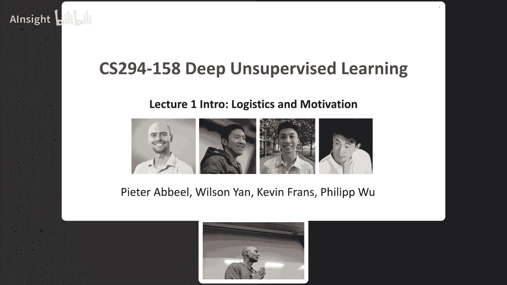

让我们从讲师团队开始吧，我是 Peter Beal，我是这门课程的教授，我们有三位，共同讲师和我一起，也许，你们三个可以简单地站起来，也许 即使，在镜头前也做，一个快速的自我介绍，嗯，是的，菲利普。

你先来，然后是凯文，然后是，威尔逊，嗯，是的，大家好，我的名字是，菲利普，我是一名博士生，呃，和彼得教授一起，我正在研究一个，各种不同的主题，但主要，是现实世界的机器人学习，嗯，交叉强化。

学习、模仿学习和监督，学习，所以希望我们能度过一个愉快的，学期，谢谢，pH 是的，大家我是凯文，也是一条鱼，还有，彼得和谢尔盖，嗯是的，我，从事强化学习，算法和生成建模方面的工作。

我们将在课堂上讨论这些，非常，感谢，嘿，大家好，我也是，彼得的计算机学生之一，我在，生成模型方面进行研究，更具体地说，是，视频和语言，生成等内容 你实际上在这里上过，地下课程，是的，我上过这门课。

下学期我就成了助教，是的，但是，距离我们上次上这，门课已经有一段时间了，呃，2020 年，所以 4 年前，这，很有趣 因为我在看，四年前的幻灯片，我，发现我在那里投入了很多动力，尤其是 5 年前，很多。

动力为什么人们应该研究深度，UNS 监督学习，因为我，认为人们对深度学习不够感兴趣，服务学习应该，真正激励他们，现在我觉得，我需要做相反的事情，呃，或者可能，更准确一点，嗯，我想，确保在本次讲座中明确。

我们实际上计划在这堂课上做什么，因为变得如此受欢迎，原则上你可以，在深度的生存学习课程中做一百万种不同的事情，所以我想，确保你知道我们在这里要做什么，而不是你想象的。

我们可以，做的事情，所以有一些后勤，沟通呃 一个网站，网址是，嗯，我想，昨天嗯，我们应该把课程，所需的所有信息都放在那里，我们通常会在，讲座之前把幻灯片放在那里，而不是今天，这是第一堂课，总是有点。

过渡期 学期，开始了，但从下周开始，我们计划在，讲座之前把幻灯片放出来，这样你就可以在上面做笔记，如果你，愿意的话，或者提前看一下，如果你发现任何，不对劲的地方，我们都有时间表 让我们知道，嗯。

这里或那里可能还有一点拼写错误，呃，只是让我们知道一些，公告，呃，我们使用 Ed，进行交流，我实际上从未使用过，它，这是我第一次，使用它，但它 似乎是，目前伯克利课程使用的标准东西，所以我很高兴能够。

使用它，如果您，有疑问，请从这里开始，因为这样其他人就可以，看到您的问题来帮助回答他们，而不是我们从每个人那里得到单独的问题，如果您已经注册，或在候补名单上，那么问题可能会有很多重叠，我们已经将您。

放入本课程的论坛中，如果您两者，都不是，那么您必须将自己放入其中，因此如果您有问题，则首选 Ed，对我们来说，呃，只是为了澄清，不是在，讲座期间，我的意思是在讲座期间，只需，举手以这种方式提问。

但在讲座之外，如果，您有而不是电子邮件，但如果，您认为更适合，电子邮件，请随时 通过电子邮件发送给员工，名单，或者如果您认为它特定于，我们中的任何一个人，请单独向我们发送电子邮件，但是如果可能的话。

请尝试使用 Ed，办公时间将从下周开始，对，我来说，它将在讲座之后进行，因此讲座时间为 2： 到 5  ：周四，嗯，时间很长，3 小时，大多数讲座都没有那么长，我们会，在中间休息 15，20 分钟，嗯。

我们甚至会吃点，零食，呃，为讲座的后半部分提供强化。 嗯，这实际上是经过深思熟虑的，我认为，你可以从课堂上得到的一件大事，就是结识，班上从事，类似主题的其他学生，你们可以交流想法，一起提出新的想法，我。

认为 很长的讲座时间，中间有休息时间，你，可以在那里闲逛，互相交谈，这对达到，这个目的非常有好处。嗯，将会是 5 到 6 点，威尔逊·凯文和呃，菲利普将在，下周的某个时候宣布他们的办公时间，嗯。

我们还在，想办法，我们可能有，一些办公时间，或者也许一个助教，负责一项作业， 然后是在完成作业，之前的所有办公时间，或者也许我们会有，定期的办公时间，例如每周的办公时间，我们，仍在整理，中。

所以对于家庭作业来说，我们的办公室是最好的场所，尽管我很，乐意 能够帮助你，做作业，就像我梦想的每个，寒假一样，我梦想着一个学期，我实际上有时间，自己完成作业，然后能够，帮助你，但现实是我。

做不到 就像我不太了解细节，但这三个人会因此对于，家庭作业的具体问题去找他们，嗯，对于其他任何事情，我们所有人应该，能够帮助你，嗯，我认为对于，我们很多人来说，这是最喜欢的事情之一 就是和。

你谈谈你的项目，你正在做的研究，你，认为它如何与课程中的事情联系起来，以及课程中的事情，如何帮助你在，你所做的研究方面更有效，或者，也许你的研究是 完全由 UNS，监督学习，并且直接从。

课程中获取课程的入学资格，这是一个，有点挑战，因为，需求比现有的位置还要多，我认为这将是，一些人不会接受的现实，进来，我们会做些什么来让事情，朝着嗯最好的情况是，那些没有很强的家庭作业。

或根本没有提交家庭作业的人，我们会要求呃注册办公室将，他们从班级中除名 现在显然，如果发生了一些非常疯狂的事情，并且，您无法做作业，因为有，一些外部情况向，我们伸出援手，让我们知道我们可以考虑它。

但对我们来说，这只是一个迹象，如果您，不适合 课程，或者你，只是不够关心课程，提交一份强有力的作业会让，你放弃，我们也会让等待名单上的人进来，如果你在今天之后，注册课程，你会，意识到天哪，我想 这将。

是所有这些风险投资家谈论，生成人工智能的内容，我们将成为，此类中的下一个大型初创公司，它的，目标并不完全是这样，嗯，所以，也许也会退出该类，为其他人腾出空间 在今天的讲座，之后。

你认为这门课不适合你的原因有很多，不要等到，截止日期，因为这对其，他人来说不方便，当你知道自己会，退学时就退学，即使你没有成功 进入，课堂，欢迎旁听，欢迎，提交作业，嗯，这，很好，你只是不会，因为参加。

课程而获得荣誉，嗯，当我们将人们转移到，班级时，嗯，本科生可能会，很好 适合该班级的博士生 我的，意思是，这实际上更多的是关于您，知道自己的能力，而不是，您正在攻读的学位，通常是。

更自然适合的 phg 学生，但并非，总是如此，所以我们将看看会发生什么，有关，注册的任何问题 是的，对于，一份强有力的家庭作业的含义，是否有任何类似的可量化的截止点，以及，这与您是否。

完全注册、体重列出，或未列出有何关系，因此，无论您是否列出体重，我们都会对每个人提交的内容进行评分，即使列出了体重，或者您已经，注册，如果您提交家庭，作业，就会被评分，嗯，那么什么是，强作业。

就是我们设计，它们的方式，本质上，它们应该可以，为那些能，上这门课的人解决，这不是，一个强作业。 就像，解决了一半的作业一样，强大的，作业意味着你基本上，解决了所有问题，这并不意味着它。

可能是这里或那里的美丽错误，但可能是，你没有做整个作业的一部分，我们 我也在这里为您提供帮助，我的意思是我们，希望您了解，这并不是说您需要能够在，没有任何帮助的情况下做到这一点，而是在，办公时间提出。

问题，但是如果您始终使用所有可用的，资源，那么，您就可以做到这一点。 愿意致力于它，然后，最终将你的大部分作业放在，一个，空白或完全关闭的重要部分中，那么，如果我们看到，权重列表上有很多人。

有更强的呃提交，我们很可能会放弃你 嗯，想一想，就像你知道的那样，也许是在，数字上，假设你在家庭作业中必须得 90%，或其他分数，但，如果你得到 98 或 99 分，请不要担心，我们不会对。

人们进行排名，然后就像好吧，想一想 确切的排名，但，大约 90% 作为门槛，你，很好，是的，我们应该期待什么，因为，家庭作业表格 H 的截止日期即将到来，很好的问题，是的，我有一张关于，所有。

截止日期的幻灯片，好吧，让我告诉一下 关于，今天的教学大纲，我们不会，介绍实际的呃材料，今天我们将，介绍，这门课的动机，为什么这门课可能值得参加，我们将介绍一些物流，但，下周我们将开始潜水 在。

自动攻击模型中，这是，第一种类型的模型，我们将在做流模型后一周介绍，然后我们将做，潜变量模型，然后我们将做，Gans uh SL 隐式模型，然后，我们将做扩散模型 和最终的，项目讨论。

所以从某种意义上说，这些将是，我们将介绍的五种主要模型类型，我们将，研究其他类型的学习，嗯，所以，五种主要的生成模型，然后我们将，研究自监督学习，非 -生成表示学习。

我们将研究到目前为止所涵盖的所有内容的优点和缺点，因为，我想说这个领域的部分困难在于，它有点脱节，直接将，vae 与自动攻击模型进行比较并不是那么容易，对他们来说，这个领域还，没有完全融合。

也许我们永远不会，只在一件事上进行转换，显然，语言更倾向于，自我攻击，视觉，现在更倾向于嗯扩散模型，但这实际上可以随着时间的推移而改变，我们教授课程的时候，扩散模型并不存在，嗯，我们。

仍然必须在那个学期晚些时候发明它们，半监督学习，统一，分布对齐，这些东西在，某种程度上并不是当今的热门话题，但我认为它们非常重要，我 认为，此类的优点的一部分与，流模型相同，是我们有时间。

讨论一些今天不那么热门的东西，但如果您找到正确的创新压缩，也许通过一些创新可以，成为下一个突破，这，通常不是一个机器学习主题，但事实证明，所有无监督，学习都有效地与压缩联系在一起，因为。

毫不奇怪的学习的核心假设是您正在对，数据进行建模，以及对，数据进行良好建模意味着什么？印象是同一件事，它，在数据中寻找模式，并，基于，在机器学习中以更紧凑的方式表示它，我们，不仅仅关心紧凑。

我们希望它在，语义上有意义，所以有，一点额外的扭曲，那里有压缩的概念，但这与，春假周非常相关，自然没有讲座，那么我们将做语言模型，专门的讲座，显然有些，东西会从早期的，语言模型中回来，是大型的自动攻击。

模型，所以有些东西会，回来，但是 我们将更深入地研究，语言模型的细节，然后我们将，有一个，期中考试，嗯我想我有一张单独的，幻灯片，所以我会等待，更多关于这个的内容，嗯我们将做，多模式模型和视频生成。

那场讲座我肯定会提醒你，我们，将在不同的位置，我们将，在楼上礼堂，稍大的房间，嗯，然后我们将有用于，科学的电子人工智能呃，我们将有用于，强化学习的表示学习，请注意，这，两个 讲座在同一周进行，所以。

周四和，周五会有一个讲座，这是相当疯狂的一周，因为，周四你有大约三个小时，周五还有三个小时，但是我们，下周不会有讲座，所以，最后一周 正常学期的，一个是讲座，我把它移到了，之前的星期五，嗯，第 15。

周没有讲座，然后是第 16 周，您的最终，项目报告将到期并提交视频，演示，因此我们将采取而，不是进行课堂顺序，我在学期结束时发现，学生们都很忙，很难找到时间参加，其他学生的演讲，所以。

学生们常常只是跳着，做他们的演讲，然后又跳出来去，学习期末考试或，其他课程。 我们将在项目中接受，提交，我们将观看视频，但，我们将分享视频，除非，有特定原因您不希望，分享您的视频，我们将在。

班级内部分享，以便任何，感兴趣的人 在某个主题中，可以观看，课堂上完成的关于该主题的视频演示，日程表上有任何问题，是的，第，13 课和，往常一样在同一时间在同一间教室，我还不知道。

我已经放入了一个 要求一间房间，但，我还没有收到回复，嗯，是的，很好的问题和很好的提醒，但这，在我的待办事项清单上，要解决这个问题，我，两天前问过他们，这，可能是一个繁忙的学期开始，嗯，让他们。

对讲座一无所知，他们都被记录下来，所以这里有一个Camtasia，记录运行，可以看到，谁站在，笔记本电脑前，记录屏幕不能，保证，每次这些东西崩溃时都能正常工作，然后，就有 没有适当的录音，但。

希望通常它能成功，然后，我们会把这些放在，网上是的，我们确实在，期中考试的同一天有一个讲座，是的，所以，期中考试会很短，我会说更多，关于，很快的家庭作业，我们会 下周星期四有作业一，出去，13 天后。

然后 14 天后到期，嗯，作业二，将会出去，所以基本上，每两周就会有一个作业出去，如果你看一下，以前的课程，你看到的已经，改变了，现在没有，作业 和流程模型，如果你，关心它们，你想了解更多关于。

它们的信息，并对它们做作业，你可以，去 2020 年网站，从那里做作业是为了你自己好，而不是为了，课堂，嗯，我认为这仍然很，有趣，但我们 只想给你，四个作业，我们认为现在，最好给你一个关于。

扩散模型的作业，而不是流动模型，就像事情正在发展的方式一样，但，这些事情可能会改变，你可以，一年后回到这里说，你真的应该犯一个大错误，流程模型更重要，很难预测，但这就是，我们，要做的。

这样我们就可以在学期进行到一半的时候，然后我们的想法是，从，那里开始你有很多时间在外面，课程的大部分时间都花在你的期末作业上，你可以讨论一些事情，呃，但是你，需要编写自己的代码并进行，自己的，提交，嗯。

你可以按照，迟到政策迟到，但最多四天不会太多，嗯，为什么我们有 从逻辑，上讲，最多四天的积极时间，本质上我们希望能够，开始评分是一两天，我们认为，您可以通过查看解决方案学到很多东西，但如果在。

您看到解决方案之前没有经过很多时间，您会学到更多，解决方案，因此 4 天后我们，将发布解决方案，您可以查看，从中学习的内容，希望，这是一次很好的学习体验，但，同时您知道这意味着您。

可以在这四天后再次提交，如果确实存在特殊，情况，您总是知道 不要，害怕联系我们，我们可以考虑一下，但是呃，这是，我们要，使用的标准模型，所以期中考试我们在讲座期间有一个期中考试，4 月。

11 日讲座开始，嗯，我想最后什么是最重要的，重要的是你从，课堂上学到了什么，你学到了什么，以及，你希望在你的最终项目中投入什么，但我喜欢，做期中考试的原因是因为它给了你一个，机会，让你被迫真正学习。

材料，嗯 你们都很忙，如果没有人强迫你学习这些，材料，可能你只是在，为自己的时间而奋斗并赢得其他东西，这并不意味着，令人痛苦或以，任何方式淘汰你，或者其他嗯会 是在，我们将，提供包含问题。

和答案的文档之前一周涵盖的主题，因此本质上我们将，浏览讲座幻灯片，根据我们的要求选择最重要的推导，写一个问题，比方说导出，vae 的理​​性下界，然后，将 回答在它下面，你就会。

有 10 到 20 页的此类，材料，然后当期中考试到来时，我们会问你其中的两到三个，嗯，显然，如果你不能学习其中的两到，三个，你可能会做得很好 很差，但希望因为你只需要学习 10 到 20 页，所以。

应该很容易，学习所有内容，呃，我们有责任确保这些是，课堂上最重要的 10 到 20 个内容，你原则上可以记住它，我不' 理想情况下，你不，认为这是学习它的最好方法，你理解它，这样就，能够重新推导它。

但你知道，没有人阻止你，记住它，并且经常，记忆可以帮助你理解呃，这是一种事实上语言的相互过程，模型只是你知道的，记住然后理解所以这就是呃这就是，你应该做的我，想好吧关于期中考试的任何问题都可以嗯。

最终项目呃范围IDE你，探索并突破，无监督学习的界限呃会有 是一个，提案 可以是一个提案加上，新算法架构的评估 对，无监督学习的应用进行调查 研究基准，测试 无监督学习可能，与压缩有关，研究无监督。

学习和其他类型的学习之间的协同作用等等 嗯，什么是，可以接受的，但它确实 必须涉及，课堂上的主题，理想情况下它可以成为，未来会议论文的基础，当，您提交，最终项目报告时，不要期望它。

已经达到会议论文的水平，但希望也许有像，最初的实验那样 这表明，这确实可以成为一份，会议论文，并且有您的额外推动力，嗯，我们实际上鼓励您，提出自己的想法，如果可以的话，它，可能会更加原创，因为您有。

自己的背景 自己的知识与，我们的不同，嗯，我们也很乐意一起，集思广益，经常，来回交流也可以带来，我们两个人都不会单独想出的新东西，所以这是我，开始教学的主要原因 五年前的这门课，是为了这些项目，我希望。

在伯克利开展更多的奥纳尔学习项目，嗯，发生了，一些非常好的项目，嗯，嗯，嗯，我一直，坚持的一个，嗯，是 Roshan raal，嗯，学生在，课程的第一个课程中做了一个，项目 关于生物学的序列建模。

呃写了第一篇关于，基于序列建模预训练的本质上蛋白质特性预测的论文之一，嗯发布了磁带基准作为，神经论文，因为这一切都是在，阿尔法折叠之前嗯从那里，实际上去了 Facebook sleta um。

bio uh AI 小组，从那时起，该团队，离开了 Meta，并成立了一家公司，该公司，本质上是在尝试，为未来构建生物基础模型，因此这将是一个伟大的，轨迹，任何人都可以沿着这条，轨迹走下去 喜欢它。

我的意思是还有很多，其他伟大的轨迹，但，确实是尝试做一些，令人兴奋的事情，如果某件事，不起作用，但你有很多，证据表明你尝试了，有意义的事情，但没有成功，那就更重要了，至少对我来说有趣的是，如果你。

做了一些非常无聊的事情，是的，它，确实有效，但它有点无聊，而且，你知道有点太，接近其他人所做的事情，所以，尝试选择，一些令人兴奋和令人惊讶的事情，如果 它，制定了，2 月 28 日到期的时间表项目提案。

所以您有一点时间，嗯，您，可以将其放入 Google 文档中，这样我们就可以在大约，一周后轻松地向您提供反馈，嗯，我们将在，该 Google 文档中与您进行迭代，希望如此 已经。

达成了一个我们都很满意的项目提案，嗯，然后四月份将有一个三页的里程碑，我们还将做 Google 文档，以便于反馈，嗯，这里的想法是，它迫使你开始，这，很容易，如果没有什么强迫你，早点开始的话。

要等到学期结束，所以你必须在，学期结束前大约一个半月甚至，更早的时间开始，才能得到一些东西，但事实，并非如此 需要接近期末考试，但是你应该有一些结果，一些，初步调查，你可以，在 5 月 10 日报告。

一切都会完成，我，相信我必须检查，但我认为，那是期末考试周的星期五，嗯，物流评分 60  % 家庭作业 10%，期中考试 30% 期末项目，嗯，是的，然后是字母，成绩，网站上有一些内容，说明字母成绩是。

基于你得到的成绩，嗯，但我，相信它可能是 90% 及以上，是一个 A 然后从那里开始每 5% 就会，失去一个部分字母，等级 你需要上课吗 嗯没有，硬性要求 嗯显然，没有足够的座位，所以，坐在地板上。

3 个小时甚至可能会不舒服，但是 我想说这是，强烈，推荐的，嗯，这又回到了，互相学习的机会，正如，我在讲座开始时所说的那样，我们将，在中间有很大的休息时间，这是，互相学习的好机会。

而且经常会出现新的项目，从那个呃实际上Roshan的项目中，我提到他认识了一些，他在课堂上做的学生，有生物学生参加了，他是CS学生的课程，然后他们开始，一起工作，只有第三个课程，当然。

所以一路上会遇到一些粗糙的问题，请耐心等待，如果，您认为某些事情可以用，不同的方式更好地完成，请提供反馈，让我们知道，这，并不意味着我们总是可以避开，这样做，但我们会做笔记和，我们能做的，我们会做，的。

所以这就是物流，在，我们开始后面的更多内容之前，有任何关于物流的问题是的，所以我们正在尝试记录，Camtasia现在正在运行，这是一个，屏幕捕获软件，可以，以更高分辨率捕获 对于，屏幕来说。

我们会说 Zoom 嗯，我们每次都会尝试，也许有时它会，崩溃并且不起作用，但，希望每次我们有录音时，是的，然后我们希望在，那天，晚上晚些时候或更多时候发布它 问题，是，最终的项目是完全，独立的还是哦。

好问题，最多，三个人，我建议组建，两到三个人的团队，因为通常当，有多于一个人的时候，你会在，想法上进行更多的反复讨论，并且，你可以得出结论 更有趣的，事情呃，我们确实期望有一点，线性缩放，所以如果。

你们有两三个人，你们应该，在，项目中取得比只有一个人时更实质性的成就是的，实际上是问题，查找，是的，所以我们 今天晚些时候，我们将链接到，教育论坛论坛的网站，这样您就可以找到将。

发布所有用于提交作业的材料的网站，我，想当我们发布第一个作业时，我们会解决这个问题，所以通过，下周时间出来，我们，希望呃设置，接收您作业的方式，也谢谢，您，是的，我们应该填写一份，表格还是只在第。

一个表格中，嗯，只需交第一个作业，我们就会接受 一切都，很好，所以让我们从物流转向，内容什么是深度无监督，学习，它是以无标签的方式，通过深度网络捕获原始数据中的丰富模式，无标签部分确实很重要。

这是 UNS，监督学习的原始动机，因为标签 很，耗时，因此，如果你不必这样做就不好了，但是，实际上还有其他动机，除了我们很快就会谈到的无标签之外，无监督学习有两个子领域，有一些，生成模型尝试 重新创建。

原始数据分布，并且存在，单元监督学习，这往往，是难题任务，您拥有数据，并，以某种方式删除数据的某些部分或数据的某些视图，然后应该将其填充，回来 如果你能把它填回来，那么，假设你了解一些关于，数据的东西。

生成，模型重新创建原始数据，分布，有很多关于，生成人工智能的讨论，我在想，我将如何真正定义我们，想要涵盖的内容 这门课程是关于，生成人工智能部分的，我认为，它仍然是神经网络，对吧，它。

仍然是一个神经网络，你正在，输出，你有一个输入，你，生成一个输出，即使生成，模型是一个 NE 网络，它看起来也是如此。在很多情况下很像监督学习，所以它真正的不同之处在于，我认为它的，不同之处在于，在。

监督学习的许多典型工作中，有一个非常明确的确定性，解决方案，因为你有一个图像和，有一个明确的标签需要，分配给它猫或狗，或者你有一个，自动驾驶汽车场景，每个像素都，需要是街道人行道与行人，等等，因此。

输出在某种意义上是确定性的。而在，生成模型中，我们试图对神经网络，上相当复杂的输出分布进行建模，这实际上，很难对复杂的，分布进行建模，这就是为什么，实际上有五个不同的讲座，每个，三小时的讲座涵盖了五种。

不同的有效覆盖方式，神经网络的复杂分布，所以这就是我，思考它的方式，至少在这门课中，生成模型是关于，可以表示复杂概率，分布的模型，远远超出了，一切都集中在一个，输出的类型萨尔学习是难题任务，嗯。

最初关于监督，学习生成模型有一个有趣的来回，人们对此感到兴奋，然后一段时间它变成了，所有自我监督学习，现在又回到了更多的，生成模型，谁知道明年会发生什么，嗯，我 我认为，认识他们两个很好。

所以我们为什么要，关心我认为这可能是，他们中最有趣的动机我，希望你们都认识杰夫·霍恩，如果你们不，喜欢的话，呃现在认识他杰夫·辛顿，本质上是深度的教父，他，从，20 世纪 70 年代就开始研究深度学习。

直到 2012 年才有突破，所以这就像，40 年的职业生涯，致力于，他认为正确的事情，40 年后他证明了自己是，对的 因为他和他的，学生们利用 alexnet 在图像识别方面取得了重大突破，现在这是。

无监督学习的动机 大脑，大约有 10 的 14 次方突触，大脑中的突触是，神经元之间的连接，它们本质上是可，学习的 大脑中，神经元连接与否的部分是，我们大脑在，婴儿时期的变化，没有任何东西真正。

连接到知道任何事情，然后当，我们长大后，我们开始了解事物 10，到 14 突触，我们 仅存活，约 10 到 9，秒，因此我们拥有的参数，比，数据多得多，这激发了我们，必须进行大量无监督学习的想法。

因为包括 Pro 感知在内的感知输入，是我们可以获得，10 的 5 个维度的唯一地方 每秒的约束是，正确的，因为如果我们假设，大脑应该被充分，利用，那么我们确实需要每秒获得 10 到，5 位。

从某种意义上说，才能充分利用我们的大脑，现在还有其他动机为什么，大脑 太大了，可能较大的，大脑比较小的大脑学习得更快，即使不需要学习很多东西，这也是，杰夫，也谈到的，我认为两者可能，都有一定的道理。

但这是一个非常，明显的迹象 监督学习，对于人类本质上如何，使用他们的大脑来说是不够的，除了监督，学习之外，还有更多的事情正在发生。Yan Lon 类似的事情需要，大量的信息来，构建具有常识，和。

概括的机器，嗯，我认为这，会进入另一个问题 我们，最近在人工智能中看到的趋势是基础模型基础，模型是在，如此大量的数据上进行训练的，它们的，泛化能力比之前的任何模型都要好得多，过去你会有一个。

模型来让我们说嗯识别，嗯，一段的情感是对，产品的正面或负面评论，并且你有一个专用的语言，模型来做到这一点，当时最好训练一个专用的语言模型，进行情感分析，而不是训练一个，模型来做所有事情，但 这已经。

改变了 基础模型是根据，所有数据进行训练的 我现在将执行，专门的模型，我认为，从，某种意义上说，我们，对当前，机器最接近常识的方法是通过对如此广泛，的数据进行训练 不知何故，一切都，开始。

至少在某种程度上属于分布范围，所以 Yan Lon 嗯在，2016 年的 nur 主题演讲中展示了这款蛋糕，现在被称为 L 蛋糕，他要表达的观点是，嗯，早在 2016 年，实际上所有的。

兴奋都在 nurs 是关于，强化学习的，所以他试图，表明一个观点，呃，人们也许，应该对，强化学习不那么兴奋，这是他观点的一部分，不是不兴奋，而是可能，少一点，更多地关注，无监督学习。

他的观点是 本质上你需要，大量数据，获得大量数据的唯一方法，是无监督学习，所以这，是 Ki 的基础，它是，踢的大部分体积 SL 质量，锦上添花的是监督学习，然后 Cherry 是强化，学习 如果你。

看一下 um chat GPT，这很有趣，这正是这个，聊天 GPT 模型在整个互联网上进行训练，以获得基础，知识监督微调，这是，锦上添花，然后，从人类反馈中进行 r F 强化，这就是，樱桃。

本质上是蛋糕，提前六年预测，人工智能将如何形成至少，目前最有能力的。

形式另一种激发，无监督学习动机的方式就是，理想智能的概念，所以，人们认为理想智能就是，压缩，找到，你的所有模式 数据这就是，聪明的意思，你理解那里的所有模式，所以找到所有模式意味着。

找到原始数据的简短描述，这，意味着低 kog 复杂性所以什么是，comra，复杂性 com 的复杂性，表示在某种意义上衡量为，com 的大小 某个数据集的复杂性，是。

可以表示该数据集的最短计算机程序的大小，将，其输出为现在，最简单的方法，但这可能，不是获胜的呃大小只是存储，整个数据 设置并只有一个，程序说打印，然后它，打印出整个数据集，所以，这是一个非常简单的程序。

但它，很少会成为获胜的程序，但，如果你有一个完全随机的字符串，其中没有模式，那么它可能会 成为，你可能制作的获胜程序，嗯，但是对于许多现实，世界的数据集，还有其他方法来，描述更有效的数据。

并且更复杂地衡量复杂性，顺便说一下，在，神经网络领域思考这一点的方式 是你应该将，神经网络的大小视为，程序的大小，神经网络就是程序，因为，你不是在编写代码，而是在训练，神经网络，所以神经网络，就是程序。

所以这里有人问，什么 是最紧凑的神经，网络，可以重新生成我的数据，这应该是，最好地理解数据的网络，因此你最擅长，概括，希望，有一些微妙之处，最小的 NE 网络不需要意味着，最小数量的参数它可能。

意味着其他东西它可能意味着，你有低精度参数但，大量参数，也许，这是，比具有更高精度参数，但更少参数更好的表示事物的方式，所以请，记住，最短代码长度um 原则上，还应该允许最佳推理。

归纳法的 S 更侧重于可，扩展为最佳动作，制定代理的那一面，称为 aixi，所以，aixi 本质上是在考虑这个，概念，如果你想要 构建一个，解决，问题的代理，我。

能构建的能够解决这些问题的最小代理是什么，这与，在无监督学习中重新创建数据的对应，但，现在在强化，学习中，这里并不是一个非常，相关的动机，事实上 IL sis。

openai 的首席科学家 开放人工智能的联合创始人，大约半年，前在科学研究所谈到了这个问题，假设，我们以无监督的方式对，数据分布，D1 进行预训练，然后对数据，分布 D2 进行微调。

那么如果 D1 和 D2，是 以，已经知道 D1 为条件的相关压缩 D2 应该比，直接压缩 D2 更有效，如果，它们之间存在任何关系，那么考虑到您之前压缩 D1 所做的努力，额外的工作应该更少，因此。

对 D1 的预训练应该允许您 为了在，D2 上更快地学习，这有点像，一个非常让我们说它不是超级，精确的，但它是一个直观的，论点，说明为什么无监督学习，应该有所帮助，当你以后你关心的只是，监督学习，你。

关心的只是标记每个像素 在，你的自动驾驶汽车场景中，UNS，监督学习可能是正确的，开始，顺便说一句，我记得这些动机，嗯，开放式人工智能的早期，当时只有我们 10 个人，嗯。

伊利亚·约翰·安德烈 (Ilia，John Andre)，嗯，我的几个学生，当时监督学习，总是获胜，就像你，关心的监督李尔总是获胜一样，我们实际上必须认真思考，这些方面，以决定我们应该。

致力于无监督学习，动机的一部分，是有更多的数据，所以，显然这会有所帮助，但，另一部分是人们会说，没关系，因为数据，不是你想要的，你只需要标记，足够的监督数据，你就会把，事情做好，但我们的论点是。

这样的 这就是为什么我们今天仍然应该致力于，无监督学习，这个，论点更重要的是，它是经验性的，你，预先训练，然后微调，你会得到，更好的结果，嗯，当时的情况并非如此，当，你去的时候，你一开始就将。

无监督学习作为你的，预训练。 从理论，兴趣来看，深度学习有，许多强大的应用程序，你可以，生成新颖的数据，你可以进行，条件，合成，你可以用它进行压缩，顺便说一下，压缩还没有，真正商业化，但我仍然。

想知道什么时候会发生，因为嗯，当我们有效地看到电子，压缩时，什么是压缩，您可以压缩数据集多少取决于，您对，构成数据集的概率分布的模型有多好，然后，界限就是该分布的熵，这就是你可以，压缩数据的程度。

所以如果你有一个，更好的模型，你应该能够，更好地压缩，到目前为止事实证明，也许，这些新的网络有点大，所以，一旦你计算出实际的，复杂性，包括 N Net 的规模，以及解码它所需的推理量，尚未获胜，但您。

可以想象未来，如果计算，芯片变得更大、更便宜，那么您将拥有一个庞大的神经网络，可以，解码您观看的所有电影，和很少的电影 位必须通过，管道传输，因为与今天可能的情况相比，它可以，有效地解码并从非常高度。

压缩的表示中进行解码，通过进行预训练来改进任何下游任务，不受或，自我监督的生产水平影响，由 Bert 提供支持的 Google 搜索是，第一个 这就是为什么我。

在这里强调它我认为这是无监督学习对其他事物的灵活构建块的第一个真正的，生产水平影响为，UNS监督，学习发明的一些架构现在在，监督学习的强化学习中被重用，嗯，你可能对，我们要在这里介绍的内容感兴趣。

所以让我深入探讨，一下，让我们看看我们能持续多久，是的，让我们，现在不要休息，让我们继续前进一点，嗯，这是一部分，生成模型至少是从，图像生成开始的，当时它被称为 Deep，Bel Nets。

这是一个不同的，名称，但它与，训练神经网络（一种特定，类型的神经网络）的想法相同，在这种情况下，它，已经下降了 失宠，这些是，一些早期结果，表明，你可以训练这个神经网络来，生成看起来像。

当时训练集中的图像的图像，这对人们来说非常令人惊讶，因为，仍然很难正确，分类猫和狗 当时，因为直到，imag net Alex net 2012 年才真正发生这种情况，因为，当人们仍在努力。

为猫和狗建立图像分类器时，其他人正在生成数字，但令人惊讶的是，这种，变化是可能的 编码器，在 2012 年神经网络取得突破后迈出了一大步，我们会仔细阅读。

2014 年 Ian Goodfellow 和合作者的 um Gans 的 vae 讲座，这是 Neal Nets 的第一个迹象，在可预见的未来，可能会生成逼真的图像，直到。

Gans 不知何故，如果你回顾一下 vae，一切看起来都很顺利，这就是这些模型的倾向，他们试图预测，平均来说是正确的事情，但平均，而言是 正确的并不完全正确，就像如果答案是你知道，一个问题是或否。

那么说，中间的东西永远不会是。

正确的，嗯，这里同样的事情，只是，把事情弄得太多了，但甘，开始解决这个问题仍然很低 当时的，分辨率只是计算，限制，这里有一个令人兴奋的故事，嗯，伊恩，在蒙特利尔的一家酒吧里和朋友们喝酒，他们只是你知道。

你会做什么，当你是人工智能学生时，你，喝酒，你谈论人工智能 嗯，他们，就像这些，神经网络怎么可能创建正确的，图像，即使神经网络可以看到，这些图像不清晰，嗯，伊恩，就像等等，即使 NE 甚至可以看到。

这些以前的图像并不清晰，如此尖锐，我应该只是使用NE，网络向创造，创造Neet Gen NE网络提供反馈，并建立，一个反馈循环，看看，他在开始看到，真正的生命迹象的同一天晚上会发生什么，然后有点。

后来有趣地写了这篇，论文，嗯，甘斯，这里有。

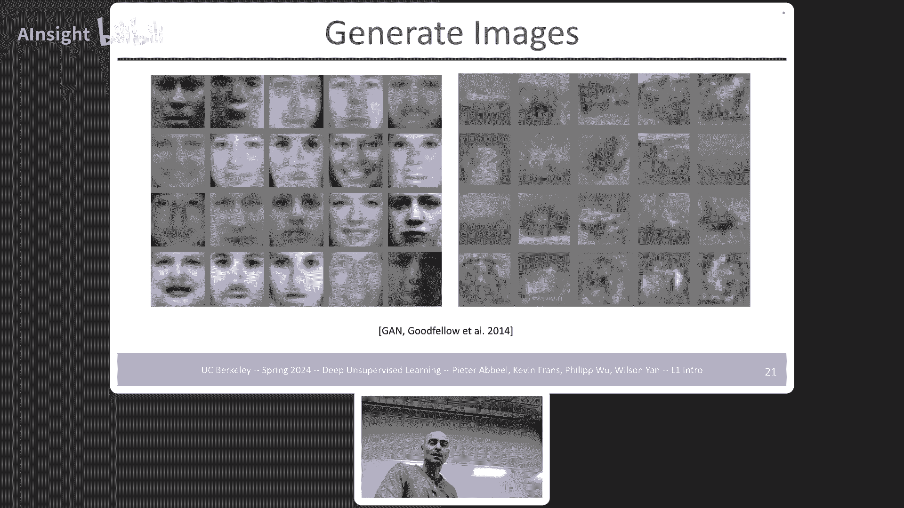

另一个有趣的背景故事，实际上是亚历克·拉特福德（，Alec Ratford）这篇论文的第一作者，这是，甘斯第一次在卧室数据集上显示，实际的高质量图像，人们说，这不仅仅是一个迹象，表明这将，很快就可能了。

这现在成为，可能了，亚历克，我相信他，从大学退学去玩人工智能，并取得了，一些成功，他写了这篇论文，然后打开我招募了他，我记得，我们招募了他，我想好吧，他，做得最好 生成模型可以追溯到，2015 年，嗯。

所以，当时很有趣，这些，事情都是可能的，嗯，只是你知道，你在档案中找到了这篇论文，基于，此你决定招募，某人，顺便说一句，亚历克显然是一个很棒的。

招募者 因为亚历克·拉特福德 (Alec Ratford)，是整个 GPT 的始作俑者，嗯嗯，作品序列已经开放了 ey gpt1，gpt1 在某种意义上是一个 lstm，但后来的 gpt2 三个都是由。

亚历克开始的，呃，有趣的故事，呃，他，实际上让一个模型训练，而他，离开了一段时间，然后它不断，改进，意识到等待，我们，训练的时间不够长，显然我们，应该训练更长时间，这，也有助于激发更长的，训练课程。

所以有时会说，离开而不是杀死你，过程也是呃。

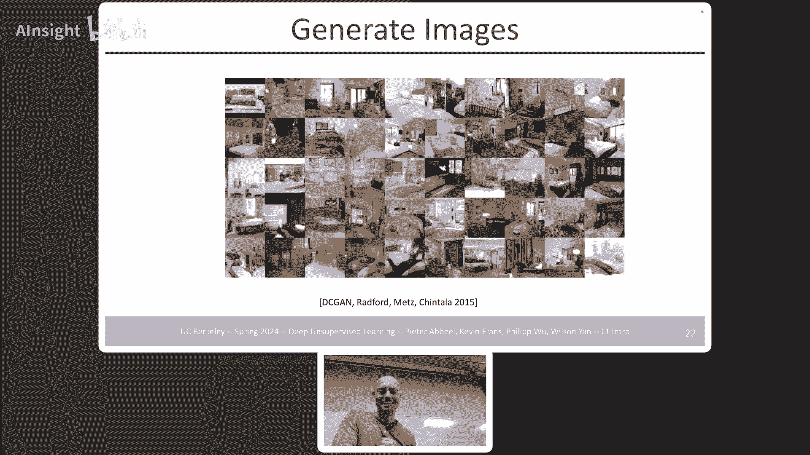

从这些是一些呃，面孔图像开始，我们作为人类往往，对人工制品和面孔非常敏感，所以，显然在这里我们看到了活生生的迹象，但我们还没有认为这是现实的。

嗯 超级幻觉甘斯此后不久就来了，嗯，Al EOS，他的学生。

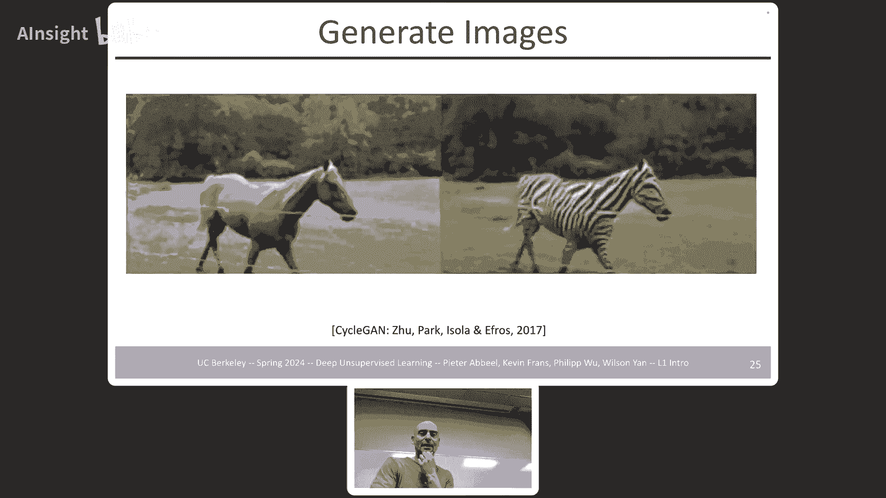

在这里用甘斯做了一些非常，有趣的事情，你基本上可以。

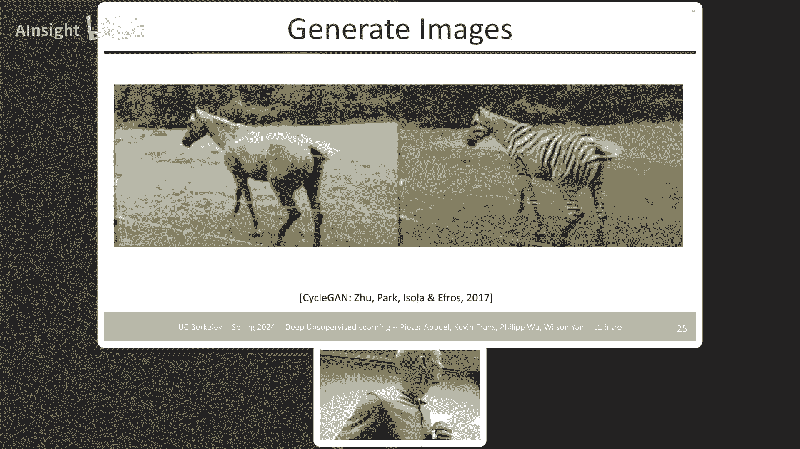

重新着色呃主题和图像，这种情况下。

马呃变成了，斑马嗯，然后深矿做了一个非常。

大的训练，第一个非常 非常大的，Gan。

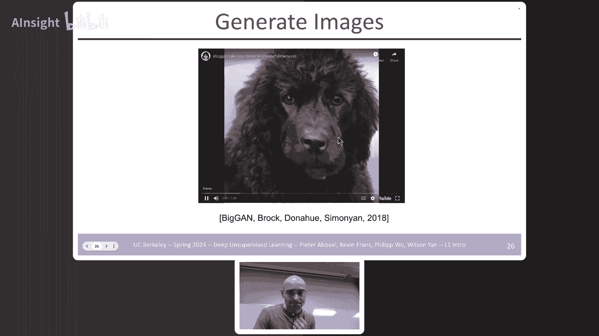

训练，所以这是，2018 年第一次，甘斯展示了非常。

真实的图像，现在其中一些图像，不是超级真实，因为它在。

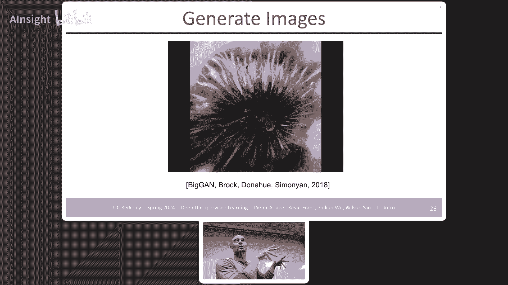

不同的图像之间进行插值。

但是你可以看到当它不，插值时，它是。

嗯，它在播放。

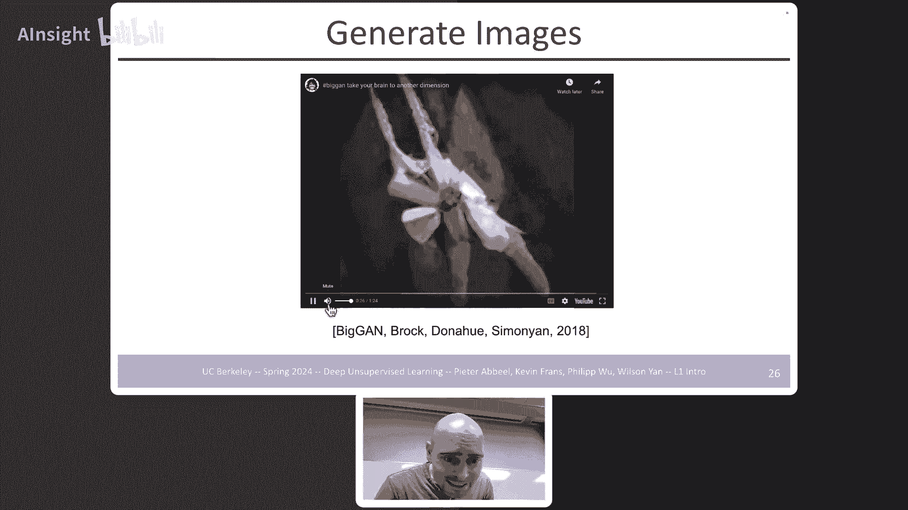

音乐吗，真是太神奇了，当时，人们基本上认为这就是它，你知道 Gans 是生成，图像的方式，呃，以最好的方式。

嗯，做了很多迭代。

特别是 Nvidia 做了很多扩展工作 随着，时间的推移，越来越多，嗯，令人印象深刻的结果，嗯。

斯蒂安从 Nvidia 出来了，呃，这些面孔，变得与，真实的人脸难以区分，那是呃，也是。

2018 年，然后发生了一些事情，在某种意义上有点令人惊讶，呃，尽管甘斯是 风靡一时，每个人都认为这就是，我们要解决图像问题的方法。 嗯，扩散模型出现了，你可能想知道为什么当时还要，费心提出扩散模型。

嗯，人们，在甘斯遇到的挑战 是，尽管，一切都非常，现实，但它并没有覆盖，数据的整个分布，因此它，专注于分布的特定模式，而不是对整个分布进行很大的，覆盖，所以当时的悬而未决的问题是。

你能 想出一种新方法或，改进甘斯也很好，但是你能，想出一些既能，生成逼真图像又能具有良好，覆盖范围的东西，不会，有效地遗漏大量嗯数据，因此扩散，模型表明你清楚，在 2020 年的这篇论文中，它们。

也是为几乎所有图像生成提供动力的模型。

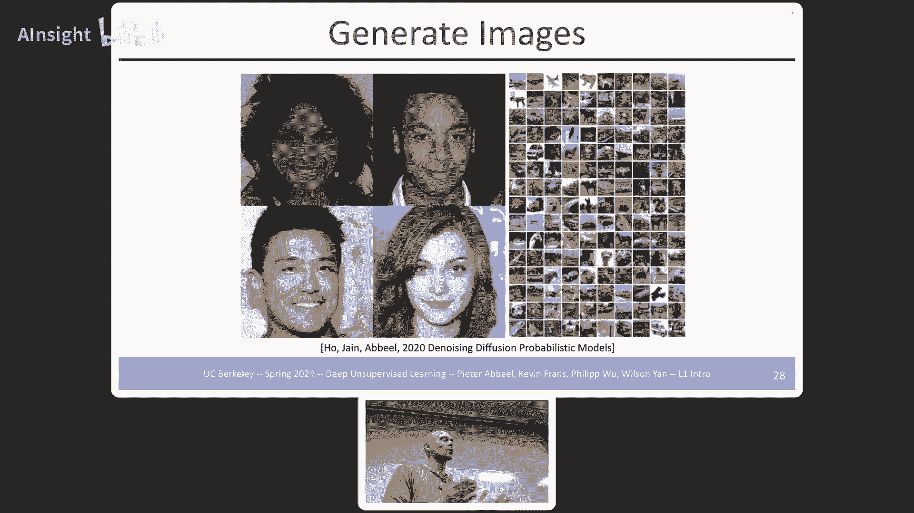

所以我只会举，一些有趣的例子，至少是，我发现最有趣的一些例子，嗯，都是，用扩散模型完成的，这些，不在原始的扩散纸中，我在这里展示的来自开放，人工智能的多莉，嗯，一幅精湛的油画，一只波斯。

异国猫在检查手机时发现了惊人的，加密货币损失，为什么这是一个有趣的提示，这很，有趣，部分原因是，它显然很有趣 但它，也很有趣，因为它的目标是，训练数据中不存在的东西，如果这种情况下的人工智能。

可以对此扩散模型产生良好的，响应，这意味着它，理解一些东西除了复制，数据中的内容之外，它应该理解，一些东西 关于如何将猫，与手机和长期的加密货币损失结合起来，这可能意味着不是。

特别高兴，这就是它的结果。

然后这是我的另一个，最爱，一个维多利亚时代的男人与，他对 Tik，Tok 的成瘾作斗争，同样的要点是有一些幽默，还有一种观点认为，维多利亚时代的，人无法访问 Tik Tok 的数据不会包含。

在英国的 T 年里，嗯，当时没有人拥有。

像 Tik Tok 这样的东西，这就是它，实际得到的结果 真的很好，那，家伙拿着一个酒精瓶，某种成瘾一般来说，脸颊发红，看着，他的手机，看起来很悲伤，这都是，在维多利亚。

时代说的，这是我最喜欢的另一个达斯·，费德意识到他忘了，添加一个 电子邮件附件，达斯·维达（Darth Vader）从来没有忘记添加，附件，但我们可以想象它。

会是什么样子，并且该模型再次，能够做到这一点，看起来就像一个，商务旅行者坐在酒店，房间的床上，在去吃晚饭之前发送一些电子邮件，然后，然后你犯了一个。

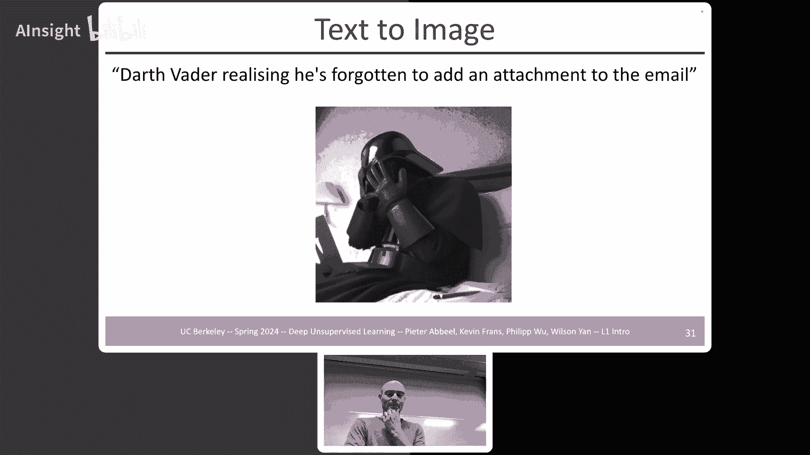

错误，这些都是睁着眼睛的，模型，嗯这里是哦，提示应该，是第一位的，但是嗯，这个来自，谷歌的想象一张照片，一只背着，背包骑自行车的 shba Uno 狗，戴着墨镜和一顶沙滩帽。

它 在这种情况下创建了一张照片般逼真的图像，自从如此，睁开眼睛之后，DOI 和谷歌的想象，首先出现，此后不久，稳定的，扩散出现了，嗯稳定性人工智能一直在托管，中间旅程，一直在。

他们的 Discord 服务器上构建它，嗯，事实上，Imagine 团队的成员之一，Imagine 团队的关键人物是 Jonathan hoe，他是这里的一名博士生，写了一篇，扩散模型论文，然后去。

Google 做了这项工作以及，Imagine 视频工作，嗯，然后 她离开，谷歌创办了一家名为，ideogram 的公司，嗯，因为谷歌并没有，把自己的女士放在那里，这对。

他来说做这项伟大的工作变得令人沮丧，然后每个人都说哦，做的，很有趣，中间的旅程很有趣，他喜欢 AB 建立的 这个令人惊叹的想象，购物中心，但没有人玩得开心，就像，谷歌关起门来一样，所以他的表意文字也是。

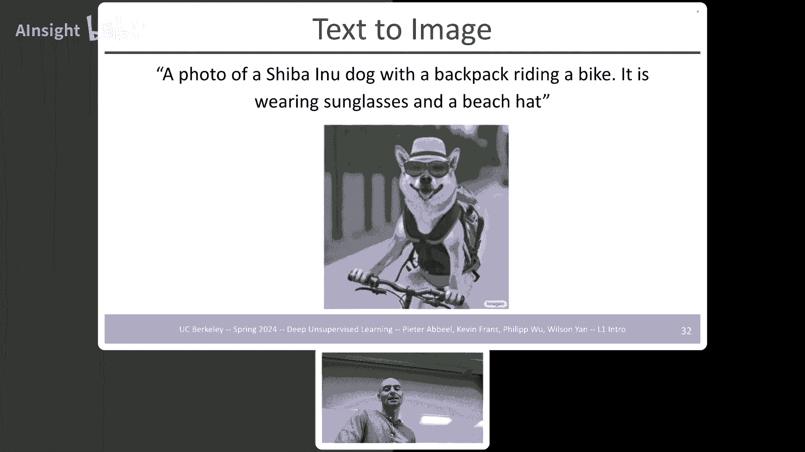

目前文本到图像的顶级提供商之一，所以在今天讲座的剩余部分中，我们将看一个 还有一些，非常令人兴奋的过去几年，UNS 监督学习进展的例子，Kevin 将，展示这些，然后在，最后我将用最后。

一张幻灯片结束课程，嗯，在 嗯，事实证明，我们使用的论坛是，嗯，您无法自行，注册，我们似乎必须添加您，所以，如果您想访问我们，则需要从这里开始（如果您，已经加入） 班级名单已经在，体重清单上。

您应该已经在，教育论坛上，但如果您没有在这里给我们发电子邮件，我们可以将您添加到论坛，然后从那里您可以开始查找其他，所有内容，因为您可以找到，班级网站和 其他所有内容我们都会，发布在那里，但是，是的。

如果您在，开始整个过程​​时遇到困难，请在，此处向我们发送电子邮件，然后呃，我们会帮助您，顺利进行，很酷，是的，所以对于讲座的其余部分，我们只是要，回顾一下，今天无监督学习可以做的一些有趣的事情，所以。

我们过去在这里看到的很多东西，然后最后几面都是，基于图像的，这是，我们尝试进入，不同领域的一件事，所以 2018年的wave net在这里，问了一个问题：我们可以生成图像，我们可以用其他域做什么，事实。

证明我们实际上也可以生成，音频信号，他们在这里使用的方法实际上非常简单，回到我们在像素域所做的事情，所以这些是扩散模型，所以，它们是稍后出现的，但是，这个波网建立在呃像素 CNN 的基础上。

我们可能会在，自动攻击部分中介绍它，但它基本上，只是预测 音频一步一步，所以，如果你采用原始音频格式预测过去，所有事情的下一个条件，你会得到，整个音频框架的生成模型，所以wavenet证明，如果我们。

以正确的可扩展方式做到这一点，那就可以了，有效，呃，当然，随着时间的推移，这些事情会，变得更好，所以这是，音频工艺，嗯，来自，2023 年的元呃，所以今年早些时候或，去年，呃，它基本上是建立。

在相同的技术之上，所以如果我们进行自动，回归预测 我们可以，一个接一个地生成样本，在这里我们，使用一些技巧，所以我们不是，像我们在，音频工艺中的波网中那样在原始音频空间中预测事物，我们首先嗯首先。

我们将标记所有内容，这样 这是，一种我们会，经常看到的技巧，实际上，如果您，首先对事物进行标记，则预测会，容易得多，因此首先对所有内容进行标记，我们将例如文本和，音频标记到同一空间中，然后。

您就可以 连接起来，这样文本音频就在，prct 之后立即出现，你，基本上得到了音频生成，这里，它们显示了好的，我们可以为音乐做到这一点，我们，可以生成歌曲，我们可以为，诸如嗯其他。

声音呃文本到语音之类的事情做到这一点，我们可以用无监督，学习来做一些事情，所以我想在这种情况下，它，是有一定监督的，我们使用一些标签来连接，两者，但是这里发生的很多事情，例如嵌入，所有这些。

事情都在发生 以一种，无人监督的方式，所以这个 tacron 工作，基本上是具有里程碑意义的，工作之一，它说好吧，我们可以接受文本，对其进行一些处理，然后我们得到，这些频谱图，它们，基本上只是表示。

音频的方式呃和 然后我们将使用这个，wavenet模型，所以，之前从wavenet构建的东西将其转换成，原始音频文件，嗯，是的，这些天德克萨斯州的演讲，已经变得非常好，所以有一家。

名为11 Labs的公司一直在，制作呃基本上制作 这些，在内部更好，呃，我们可以做一些事情，比如以，不同的风格发表演讲，所以，我们这里有不同的，个性，呃，事实证明，风格之间的转换也，很容易，所以。

直接从文本转换是一个难题，声音，因为实际上文本，并不包含发出声音所需的所有信息，我们有语调之类的东西，我们有表现力。

这并不完全是，声音的全部，但是如果我们做例如语音，转换，我们可以从 就像从，一侧到另一侧一样，这是一些，有趣的东西，就像你们中的一些人，过去可能见过的那样，就像它，去年流行起来一样，但基本上。

人们使用这些生成器以，其他人的声音说话，所以其中一个，著名的是 这些总统，正在谈论一些他们，实际上永远不会谈论的事情，但这，很。

有趣，所以这是一种文本到语音的转换，然后视频也是一个新，领域，所以我认为视频内容才刚刚，开始发挥作用，我知道威尔逊是，有些人正在研究，它，但是基本上我们可以做吗？我们可以像图像。

空间中的生成一样在视频空间中进行生成吗？这里有一些，使用 Gans 的示例，这样你就知道我们是否，只有数据集 我们，实际上可以预测视频的数量，或者我们可以，使用。

与图像中使用的相同的 Gan 格式来优化生成模型。

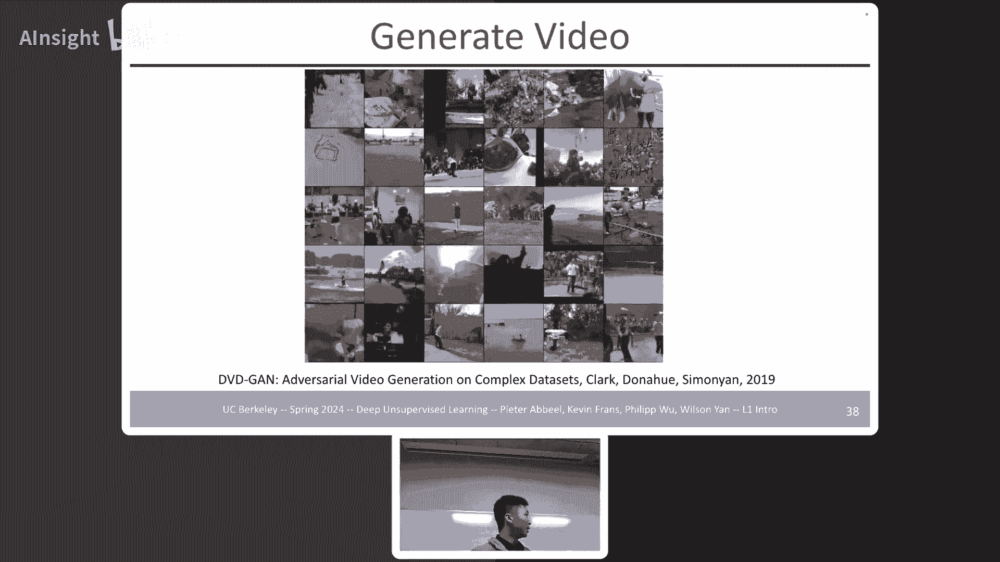

然后还有，更多基于扩散模型的方法。

所以这个 emu 视频就是这样做的。

一种逐步的过程，所以它的作用是，呃，这实际上是文本文本视频。

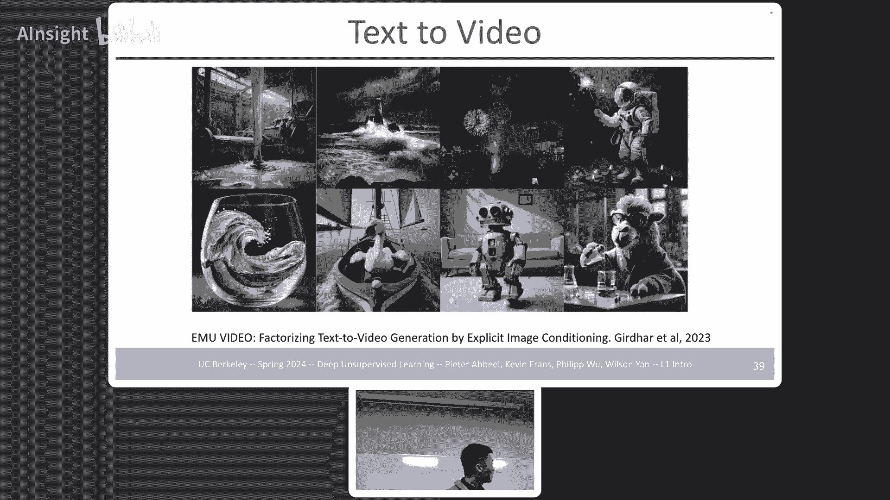

文本没有显示，但你可以，先描述场景，然后，它的作用就像是你。

在本文中学到的教训，如果你分解，它的分布效果更好，所以。

你在这里所做的就是给定文本，首先，预测第一帧，这，本身就是整个图像生成问题。

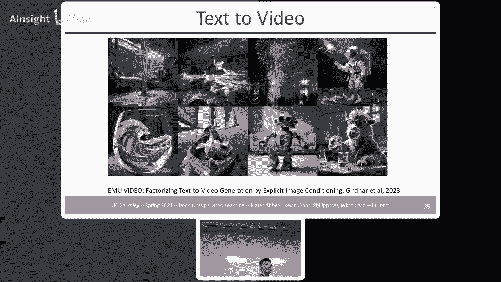

然后给定第一帧，和文本，让我们生成，密钥的其余部分 然后让我们生成。

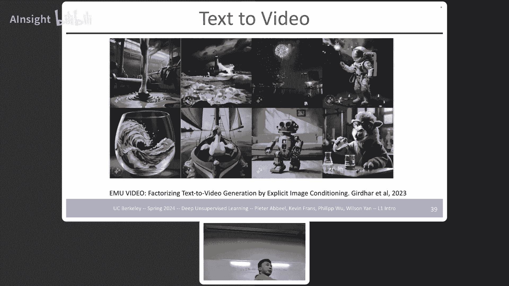

帧之间的帧，结果，只是分解事物，这种方式效果，非常好，我们可以获得。

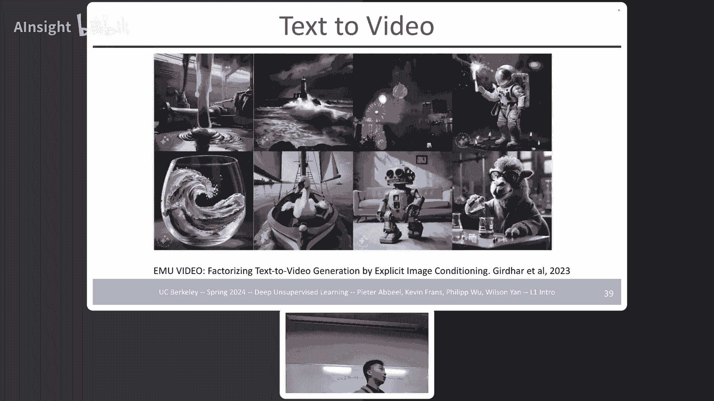

至少一致的东西我认为，视频中的一致性仍然是。

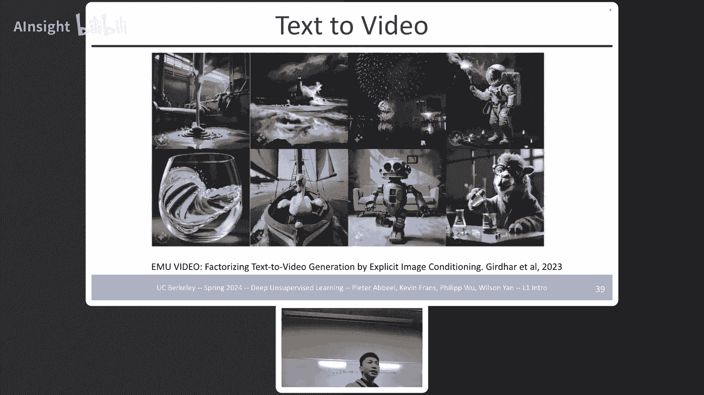

一个未解决的问题我认为，我们是这样的 到达那里，随着新作品的出现，事情变得更加一致。

但你仍然可以，在这里看到文物，就像这个框架，实际上并没有物理地连接到另一个，框架。

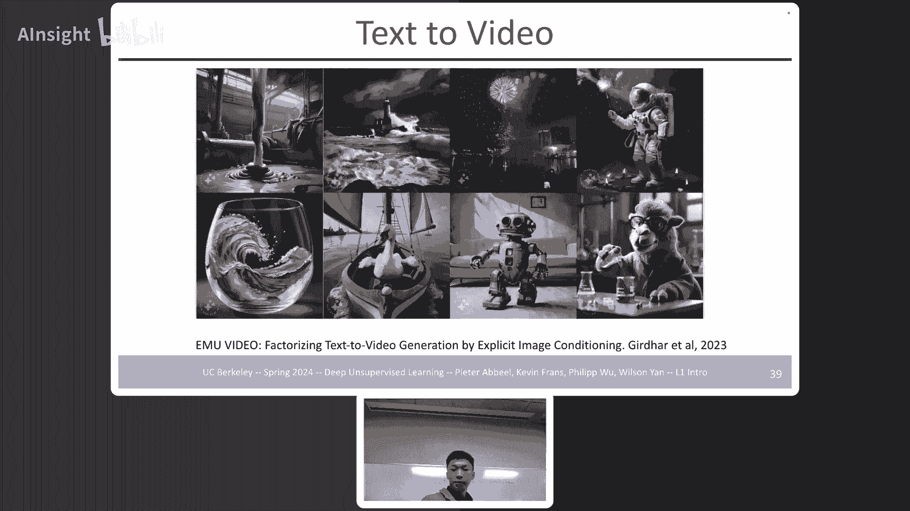

呃视频诗人所以这是，另一种并发工作，呃，他们尝试做同样的问题，所以从文本到视频呃，在视频，诗人中，他们吸取了，在音频，生成中发生的同样的教训，他们说好吧，实际上，让我们以与。

我们相同的方式标记一切 在语言，模型中，我们将把图像标记，为图像标记，然后我们有了，文本标记，我们有了图像标记，我们可以自动回归预测它，如果你以正确的方式缩放这个 L，我们，就开始生成视频 这是。

有道理的，我认为这些非常，有趣，因为它们看到了我们在图像中看到的相同，类型的缩放属性，所以这些视频，显然不是真实的，就像笔在，打卡一样，这实际上并不在，数据分布中，但是我们 具有，我们。

之前在图像空间中证明的良好插值，现在，它们正在应用于其他领域以及，图像和声音，我们能够，生成例如，播放的歌曲，你知道现代歌曲用，例如，古典乐器，实际上并不在数据集中，但我们。

可以猜测它们可能，听起来是什么，并且，除了生成视频之外，这些东西还有一些应用程序，比如这里的这些视频。

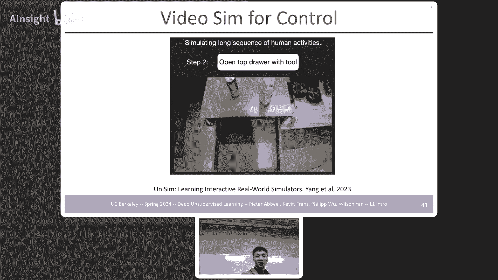

很酷，但有点难以想象，你知道我们实际上，要使用它做什么吗？一个答案是。

如果我们可以模拟世界，如果我们想要进行控制，这实际上给我们带来了一件好事，例如，如果我们，想让一个机器人来计划，想象 如果我试图做好某件事，会发生什么，如果我们有一个，很好的世界视频模拟，我们。

实际上可以将其推出，我们，不必在现实生活中进行实验，但我们可以同时运行它，所以 嗯，随着这些模型变得越来越，好，我们将开始看到，它们的更多下游应用程序，因此，视频内容是以，无监督的方式进行训练的。

这就是，预训练，进入世界的预训练 模型，然后我们，可以在。

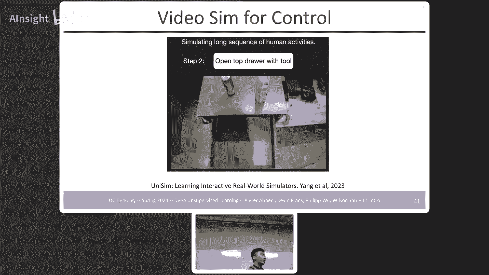

这些模组之上进行强化学习或规划，然后有一个文本链接，所以，我们将讨论这个，我不会讨论，太多，因为我认为，我们的语言建模 稍后会有一个关于，它的讲座，嗯，我不想，过多讨论语言模型的具体，内容。

但语言模型是，无监督学习的一种形式，这就是，RNN 的特点，安德烈·卡比 (Andre carpy) 写了，这篇小博文 早在 2015 年，他就说过，好吧，如果我们有一个，RNN 嗯，一个循环网络。

它只是，预测一个又一个的角色，那是在之前，嗯，你知道我们，有点知道这些东西会，很好地扩展，但我们仍然可以产生，非常有趣的东西 例如，一些故事是，在这里编出来的，字符级别的RNN，实际上非常强大，因为。

你可以在，不完全是语言或自然，语言的东西上训练它们，例如我们可以生成，闩锁文本，我们可以 生成文本呃，这是我们，在语言建模中至少会看到的一课，嗯，有些人喜欢说语言，包含的不仅仅是单词，它还，包含一些。

思维模式，有语言，模型的争论 可以作为基础，模型或不仅仅是，语言的东西，这只是一些，非常早期的结果，好吧，我们可以，生成数学，我们可以生成东西，呃，我不知道这个数学是否真的，有意义。

它可能正在实现 但它，从远处看起来是正确的，呃然后所以是的 gpd2 是，开放人工智能的下一次尝试，在，扩展这些模型时表明呃，这些提示所以所以我认为主要是，gpd2 带来的主要创新 是，通过正确的提示。

您实际上可以让这些基础，模型或大型无监督，模型来做我们希望它们，做的事情，而您知道在早期，生成数学或生成文本时我们并不，真正知道如何指导 它可以，根据训练过的文本分布生成它们，但我们不知道如何。

让它完全按照我们想要的方式去做，呃，GPT 表明你可以，告诉它做什么，这就是 我们稍后会看到的主题，是，有一种转变，从必须尽早训练这些，模型（例如监督模型），一切都，专门针对我们想要的进行训练。

而不是我们可以只训练，这些巨大的，分布，只要 因为我们，通过在顶部提供一些约束来限制它，比如提示，后面的内容自然必须，遵循某些指令，所以 gpd2，能够做一些不错的事情，比如，生成，故事，嗯。

它可以对抗你，我认为这是在说 是的，回收，对世界没有好处，我不想这么，说，但它，可以呃，然后这是聊天gbt，所以，gpd2，这是在2019年左右，从那时起。

模型已经扩大了规模，甚至更大，尽管原理是，本质上是一样的，但是我们可以，理解为什么学习，这些 UNS 监督模型如此强大，因为。

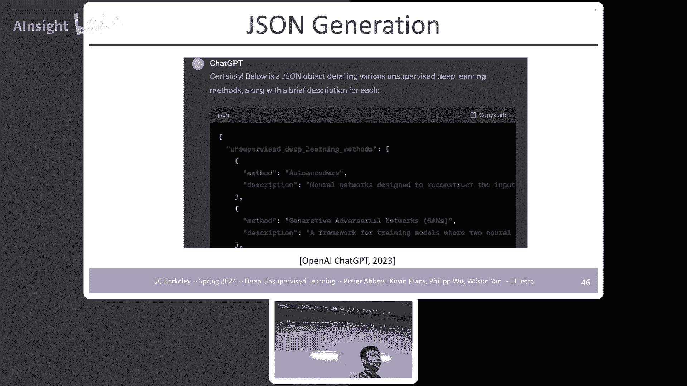

我们在这里得到的同样的教训，我们，可以做一些提示。

得到我们想要的东西，呃，继续，改进 我们的发行版，匹配得越好，所以今天的语言模型，你实际上可以做一些事情，比如，要求它提供 Json 输出，它，可以给你很好的结构化文件，这为我们打开了很多，途径。

我们可以使用这个，生成计算机可读的东西，而，不必只有。

人类可读，语言模型今天可以做的另一件好事是，这种长形式的摘要，这样上下文长度就会增加，模型可以处理的文本长度也会增加，实际上内存中的处理量上升了呃我们。

可以开始做更多，基于理解的测试所以回到，gpd2 提示通常就像一个，句子那么长然后大部分，输出来自这里这。

本质上是因为模型的限制，是 非常小，就像你，不能比这个更长。

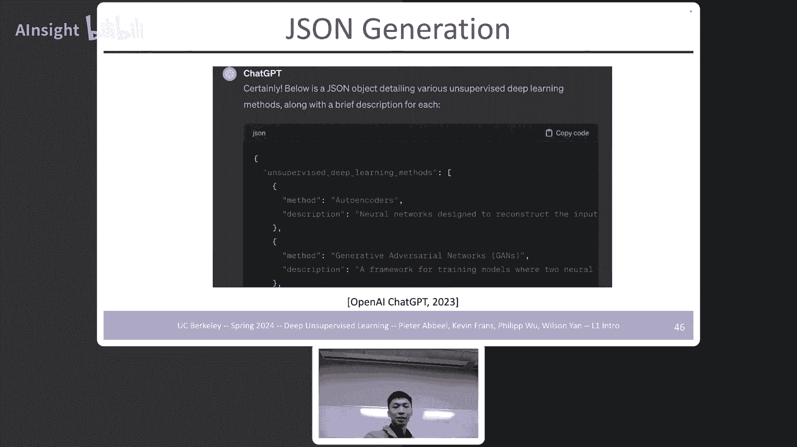

呃，但现在它在那里被切断了，但是，有一篇很大的文章，例如，什么是无监督学习，模型实际上可以合成它，所以我们是我们是我们' 正在进入一个阶段，模型本身可以以，这些非常像高高位的，方式进行调节。

即使输出本身是，一。

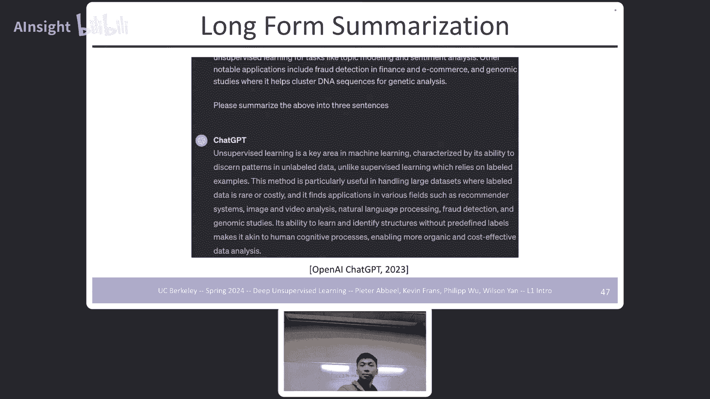

点点，是的，这些模型都，可以使用，所以你可以尝试一下，我，相信很多 你们中的一些人在，这些事情出现之前就听说过这些东西，但是呃，是的，事情正在逃逸，而且它们正在，发挥作用，所以是的，还有一点关于。

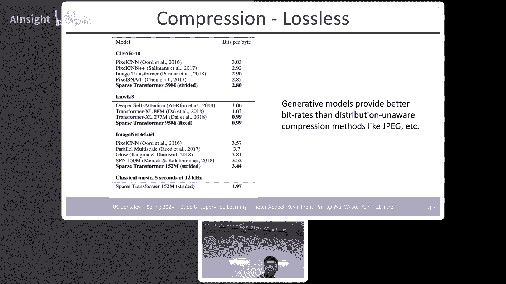

压缩的内容，所以这是，我。

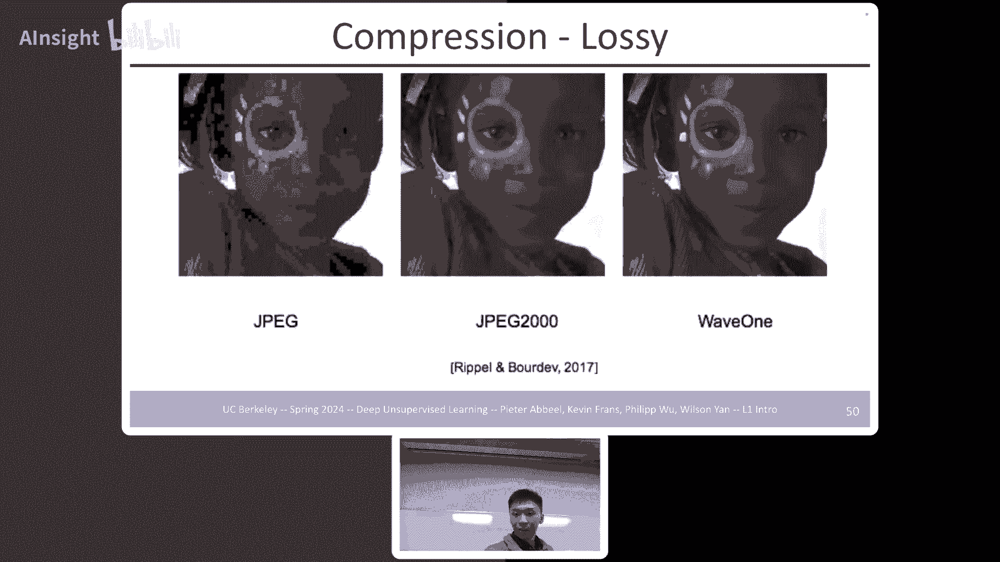

2017 年的论文，如果这是的话 相同，但基本上它展示了如何将，生成模型用作，压缩，稍后我们将再次，对此进行讲座，但基本思想，是，如果我们查看实际类型的，手写压缩方法（例如，jpeg）。

他们会假设一些 形成关于，自然图像空间的形式，因此 jpeg 假设，像素自然平滑，如果您，假设这一点，我们可以将 pix 转换，为比我们，假设什么都少的位，并且使用，生成，模型进行压缩。

它基本上在做相同的，事情，但是 我们不假设这种，自然的图像分布，比如说平滑度或，邻居，我们只是从数据中学习它，所以我们说，如果我们关心我们的，图像，比如说，这里的数百万张图像，那好吧。 训练集，呃。

我只需要你知道更少的，位数，因为我假设，好吧，如果它是 3D 数据集，我不会有噪声或图形图像，所以我们，可以获得，更好的压缩数字，因为我们做得更严格。

假设和一种是的，一一，反对这些模型的论点，其中一些模型，是有损的，我的意思是 jpeg 一，开始就已经是有损的，对于，很多应用程序来说，如果它是有损的，就像所有视频编解码器本质上都是有损的一样。

那就完全没问题了，因为它没有 对，所有这些进行编码是没有意义，的，如果您的 YouTube 视频未加载，我们可以得到的大多数帧都是相同的，您会看到，类似这样的东西，但如果我们假设。

对分布有更严格的 um 约束，我们可以得到类似的东西，相同的位数可以给你，一个更清晰的图像，因为我们已经，了解了哪些图像可能是什么。

哪些，是 3D 中的东西也在起作用，所以，这是 2020 年的一篇使用，Nerfs 的论文，所以 Nerfs 是这样的 隐式地，表示 3D 图像就像，神经网络的输出一样，呃，第一篇 NERF 论文只是。

通过拍摄，一个对象的视频来训练它们，然后这篇，论文，我认为它，要么是基于 gan 的 Nerf，要么是 一个，基于 vae 的 Nerf 但实际上如果，我们有 3D 模型的表示，那么我们就可以学习分布。

让我们学习生成东西，所以，这里我们有像，汽车、椅子这样的面部模型，因为这些模型，实际上是 3D 您可以移动，相机并从，不同角度查看模型，这些方法的强大之处，在于，它们是无人监督的，您不需要标签。

我们实际上甚至不需要 3D，模型本身 在某些情况下，只要你有它们的图片，就足以，重建模型本身，一个，问题，论坛模型，你喜欢什么，是一个超级拱门，比如看看。

哪个l，或是的，这是一个很好的问题，我，不知道答案 头呃我我我，可以猜测，但我想，你会得到正确的，答案，阅读这里的工作跳入，一会儿，所以对于某些生成模型来说，测量有点困难，但对于那些，优化。

可能性的模型来说，它实际上是可能性，因此，对数平均对数损失，现在可以直接转换为位，您可能必须，对其应用因子对数二以获得，位而不是 Nats um，但，它是相同的度量，因为在，最佳压缩中假设您使用。

最佳补偿压缩 将，数据压缩到，分布的熵，即，您需要的位数，对应于，所有数据点的平均对数道具，熵是平均对数道具，因此您的 Lo 平均对数道具正是，在那里测量的值 它的，测量单位是每比特，这里的。

意思是每比特的平均对数支撑，图像，将有一个红色咬合、一个绿色咬合和一个，蓝色咬合，以重新发送，每个位置的三种颜色，所以它测量的是每个，图像的平均对数支撑，然后 通过图像，中的字节数对其进行标准化，以。

获得这个。

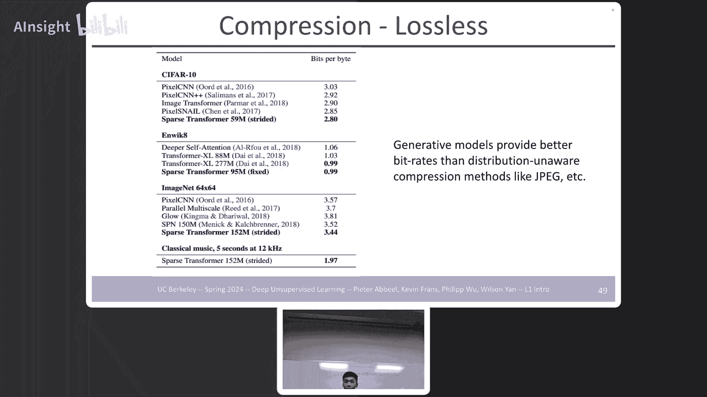

数字，嗯，是的，基本上，这就是。

这些模型的一个应用程序，进行一些压缩，就像彼得，之前所说的那样，如果您真正了解，如何测量压缩，那么它 它，需要一个最佳的编码器和一个，最佳的解码器，这样就，激发了这样一个事实：您的模型越强大，您。

应该能够真正达到，如何压缩，数据集的界限，是的，并且是最佳的，因为，最佳压缩器实际上是，不可能的，他们通常不使用，来自，右侧的标准化压缩距离，所以我想是的，您可以通过一种方式，查看这些这些都是，下限。

就像我们不知道，数据集的真实压缩一样，因为 我们，不知道我们的编码器或解码器是否是，最佳的，嗯我想你可以说，它们就像最佳的，如果你的com复杂性是你，的网络有多少个参数，这，实际上不是最好的 可以。

进入参数 C，因为我们正在，训练它们，在该参数空间中可能有更好的解决方案，但这，就是我们得到的，如果我们尝试，在这些界限上尽我们所能。

嗯是的，所以 3D 生成它，也变得更好 所以这是从，2020 年开始，这就是我们在 2022 年可以做的事情，我们再次，假设类似的技术，并且，关于 3D 的有趣之处在于我们实际上可以假设，它。

比 2D 图像更加无监督，因为 在 2D 图像中，我们有 3D 2D 图像的数据集，有时我们甚至没有，3D 模型的数据集，我们拥有的只是，世界的 2D 图片，但我们可以假设，它们的某些事情，就像如果你。

采取某种，从不同角度看一个物体的几张图片，我们，知道光以某种方式反射，并且有一种模型可以，实际产生这些视图，通过，写下这样的小东西，我们，实际上可以生成模型，即使，我们没有 数据，所以，我们有一个假设。

然后我们可以，在这个假设下做我们无监督的事情。

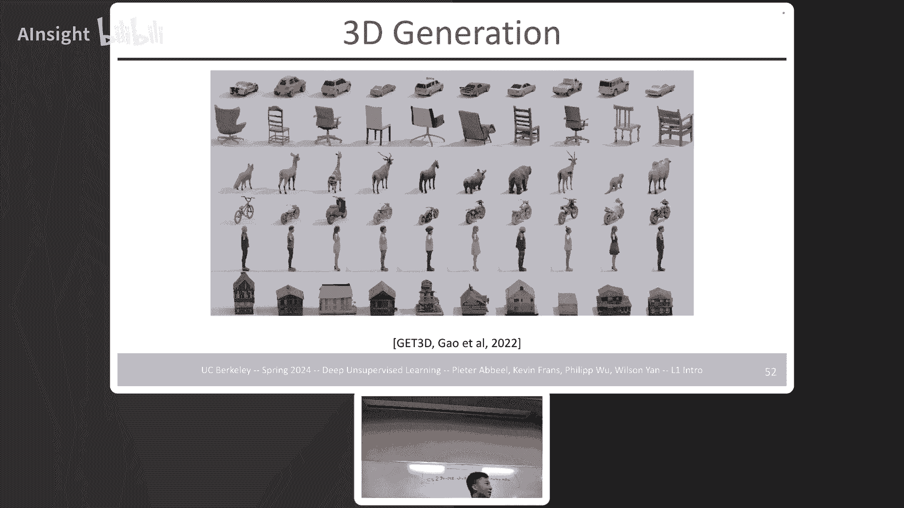

最后就像有，一些领域也不太，直观，但可以说，更重要阿尔法折叠作为其中之一，嗯想出了如何，本质上是进行蛋白质预测，呃，这里我认为最后有一些，监督，但很多，力量来自于这种，无监督的表示学习，这种学习。

发生在蛋白质空间之前，嗯是的，然后也许之前发生了什么，没关系，这里有一些，我们可以用无监督学习来做的很酷的应用，嗯，现在这，就像一点动力，说明为什么，无监督学习很重要，嗯，即使你有一个。

想要解决的特定问题，有时它会，更好 在呃之前仍然进行大规模，预训练，这是，来自斯坦福大学的基础模型论文，但现在很多领域，正在转向这种设置，我们进行大规模，无监督预训练，然后我们做。

适应我们真正关心的东西，适应的形式，可以采取多种形式，可以微调，网络，可以是舞会的东西，甚至可以是零镜头，或一些很少的镜头，但这种，范式有，与 10 年前、5 年前相比，这是一个很大的转变，嗯，现在。

似乎至少在，推广到一些实际，问题方面正在发挥作用，所以我们将展示一些，例子来说明如何 这个预训练，公式已经出来了，所以我相信这是来自，GPT 论文，它表明，我们有这些语言模型。

我们实际上可以它们只是做情感，检测，我认为这要么是，线性标头，要么是某种小的，适应 嗯，它知道如何立即进行情感，检测。

，现在很多东西都建立在，这些东西的基础上，我们可以用，birt 损失进行预训练，或者稍后我们会，看到 GPT 损失，然后他们，解决这些基准测试 以更高的。

速度，所以我们会看到例如我们，实际测量的方式，这是在语言，模型空间中，语言模型有多好，实际上非常漂亮，非常漂亮，有，所有这些不同类型的，东西，例如代码生成，阅读，理解也许 解决考试，它确实表明了一点。

这些模型上的无监督学习，可以像所有这些随机领域一样解决问题，但，实际上它并没有经过，专门训练来能够，做到这一点，所以提示，是一种我们不会去的问题 太多了，但这也是这种，适应方法，其中有很多，有趣的事情。

比如现在，关于如何从大模型中提取我们想要的东西的策略，所以我们知道这些，模型吸收了所有这些知识，我们知道 在某种程度上，他们，正确地表达了它们，或者将，它们表达到了非常好的程度，然后问题是如何把。

它弄出来，有一些有一些，混乱的嗯，这是来自睁开眼睛的，指南，事实上他们有，指南 那里表明，这是。

人们至少在，思考很多的事情，最后我们会，在 Vision 中看到同样的事情，所以这是，来自我认为这是 2018 年的，但这，是使用对比，学习 这是另一种无监督方法，它表明，即使在传统上使用监督。

数据的这些任务上，我们从无标签数据转移时的性能，仍然相当不错。

例如，2021 年推出的大规模自动编码也显示了结果 在，这些传统上是的数据集上，你可以，在其上训练一个监督方法，事实证明，如果，你在大量数据上预先训练这个大型自动编码器，它在这里工作得更好。

呃好吧，所以这是最后一张，幻灯片，它是 只是对之前所有内容的概述，但我认为，关于 UNS 监督学习的一种很好的激励因素，是，它似乎，是一种随着数据进来而扩展最佳的方法，就像我们之前看到的拉昂，蛋糕一样。

其中大多数，卷是关于监督学习的，这是因为，收集这些原始数据比拥有，人类标签要容易得多，人类标签可能，是错误的，它们可以是，多模式的，它们可以具有各种，奇怪的，属性，但事实是，基本上相同的方法。

例如自动攻击性或，我们稍后将在课程中学到的东西可以解决，所有这些不同的领域，应该告诉我们一些关于，我们如何做这些，事情的正确方法，谢谢，凯文嗯我 我想快速强调一。

件事，呃，我们回顾得有点，快，这张幻灯片是，2020 年的，我想强调，右边的事情，这里的，两位教授 alosa EOS，和 jender Malik 之间打了一个赌注，这是正式的，BET 的版本表示。

如果到，2015 年秋天的第一天，将存在一种方法，可以，在 Pascal vocc 检测上匹配或击败 rcnn 的性能，那么检测任务而不是，分类而不使用任何额外的，人工注释，是这样的，所以我很惊讶 -。

有效训练 Malik 先生承诺购买，EOS 先生 一加仑两勺一巧克力，一香草所以这里发生了什么，alosa EOS 挑战了十个并说我，认为un survis学习会赢，jener说好吧让我们围绕。

它打赌你告诉 我当它会赢得，明确的阿洛萨时很乐观，他把它放在，2015年秋季，直到这篇，论文在这里CPC V2论文才发生，这是，2020年秋季嗯所以嗯是的呃，五年五年后，但它确实发生了，我认为。

看到其中一些事情发生是很有趣的，呃，在最长的，时间里，获胜的事情实际上是，人们已经在考虑的其他事情，你，可以预测未来将是，从长远来看获胜的事情，我们 只是不存在，我们需要，弄清楚一些细节。

我们需要弄清楚，规模，一旦弄清楚，它，实际上会比，当前的做事方式更好，所以 chender，在这种情况下我从 alosa 买了冰淇淋，但从长远来看，alosia 是，对的，我猜 Unis 学习是一种。

更强大的。

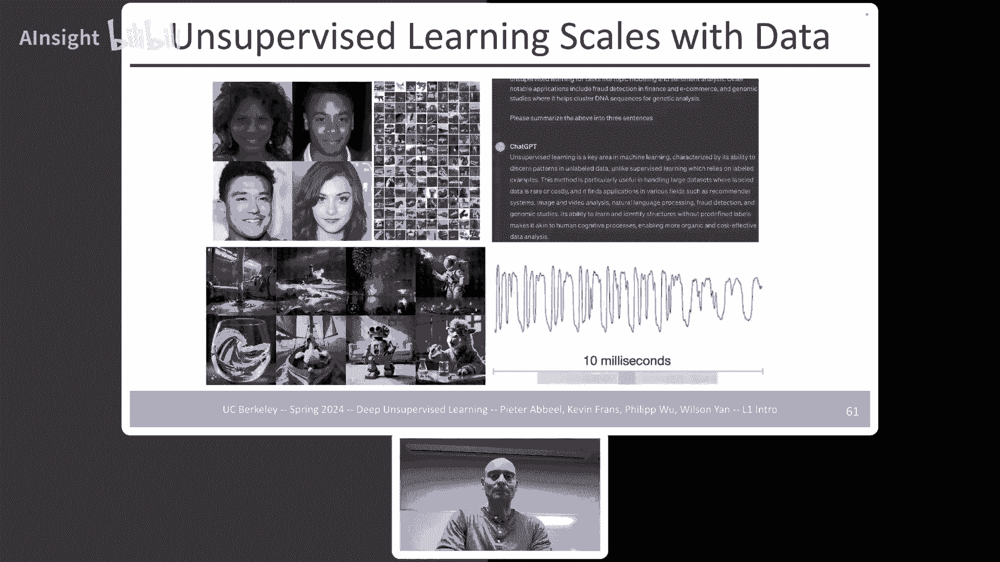

预训练，所以总而言之，由于计算确定深度学习，工程实践成为更好的，数据集，UN 学习实际上作为一个领域正在迅速发展。 很多人都，在研究它，它不再只是一个学术，兴趣话题，它曾经是，但，今天绝对不再是语言。

建模图像生成视觉语言，多模态预训练都，工作得非常好并且，对，谷歌搜索的鸟产生了生产水平的影响 已经是第一个了，但现在显然还有更多，现在正确的情况，甚至一年后也可能不再正确，我将给你举，两个例子。

只是为了使这个具体的，例子，我们刚刚谈到了自我，监督预训练是这样，比监督和计算机视觉任务（，例如检测分割）更糟糕，直到，事实证明，2019 年，CPC V2 出来时，现在更好的，例子是，两个代表性的。

通过屏蔽告知视觉的方法不起作用，人们说为什么不直接像用，语言那样屏蔽呢？ 掩盖一切，没有任何效果，或者什么都没有效果，直到 King 她和他的，合作者，嗯，在 2021 年 11 月让它发挥作用。

街上的说法是，在，Vision 中，掩盖不起作用，但事实证明，它是有效的 最好的，所以这些事情都，在不断变化，这是，我希望你记住的事情之一，我，很乐意看到最终的项目，你挑战，当今的一些常识。

并且理想情况下，你可能有一个，正确的理由，这里的原因可能是，如果它适用，于语言，为什么它不能至少在视觉上工作得相当好，也许它不会，是最好的，但至少应该，相当好，金所做的、。

其他人没有做过的关键事情是什么 好吧，首先，他是一个非常好的实验者，所以他，迭代了很多东西，他是，最好的，但紧接着重要的是他，遮盖了图像的 80 90%，事实，证明这是关键，在此之前人们，遮盖了 10。

20% 并遮盖了 10 20% 任务结果，太简单了 记得早期的，幻灯片 Jeff 说大脑必须，做很多工作，让你知道，每秒有 10 到 5 个可用突触，才能接受训练，嗯，金效应。

说让我们把 N 工作让它工作，比仅仅补充 10，20% 更难，以某种方式创造出，你遗漏的 90%，突然间结果，很棒 um Vision Transformer，架构有助于，在你的训练中更容易地进行掩蔽。

因此，它也 帮助使这成为，可能，嗯，但，我认为从概念上来说，最大的因素，是掩盖了比，任何人，之前做过的更多的东西，嗯，自动攻击模型流动，维斯甘斯扩散模型，嗯，我们将在前五周介绍的模型，我认为他们仍然有。

很大的空间来实现令人惊讶的，能力，这意味着也许如果你，在一个人们还，没有做过的领域扩大规模，嗯，也许视频这，仍然是人们应用的一个非常早期的领域，也许机器人技术是，生物数据和其他科学数据仍然处于早期阶段。

即使只是应用当前的，想法也可能会给出非常令人惊讶的，结果，所以现在是与他们合作的好时机，但也认为，不令人惊讶的学习的核心可能仍然，有一些重大的创新。例如，我在 2020 年之前给出了丢失的产品。

那是不久前的事了，但，当时我们没有关于扩散，模型的讲座，因为我们还没有写，去噪扩散 paric 模型论文，当时人们认为，甘斯是 是，图像生成方面最好的，从那时起它，显然发生了变化，我认为。

未来可能会有更多变化，所以我真的挑战，你认真思考，我们将介绍的所有这些方法，看看你是否能找到一种方法，通过认真思考他们，如何坐起来来改进他们，我经常思考，当然，当我们进入特定的问题时。

我会尝试给予更多的色彩，但通常这些事情的细节是魔鬼，有些，东西呈现的是，大局 有道理，似乎是的，这将是最好的，也许，它甚至是最好的，因为它所呈现的，但，然后你去了解它实际上是如何，在方程中写出来的细节。

实际上，与动机已经有一点差距了 到，方程实际有什么，然后也许，实现会引入另一个，差距，因为数学并不是，正在实现的，所以，一路上可能会出现所有这些差距，你可以看到一个让，事情变得更好的机会，也许发明。

下一个 这些模型的一代或下一个迭代，如果这能从，这堂课中发生的话，那将是一个非常好的结果，好吧，今天就是这样，谢谢。

