# [中英字幕] UC Berkeley 深度无监督学习 CS294-158-SP24  ｜ 2024年春 （更新至0824） - P3：3 流模型 - AInsight - BV17W421P7QA

好吧，让我们深入研究内容，所以，今天我们将看看流模型，与我们上周看到的模型相比，这是一种，不同类型的似然模型，嗯，会有一些联系，会有一些差异，嗯，这很有趣，因为当我们教的时候。

上一次 2020 年春季流动，模型在这一类中的，受欢迎程度大幅提高，嗯，出现了很多新结果，但从那时起，不应该，出现大量新东西，几乎没有新的东西出现，嗯，可能是 一个机会，也许人们错过了正确的，见解。

使他们比，四年前更好，或者从，根本上来说，他们有一些，不那么普遍的东西，所以他们，不会通过更多的数据和，更多的计算来不断变得更好 其他模型的方式，嗯，我想我们不知道，但是，如果你。

今天本质上是一个产品构建者，并且，你被要求构建一个，带有生成模型的产品，那么这是需要注意的事情，它不太可能是，流程模型 将是你的第一选择，但作为一名研究人员，我认为，了解他们如何工作真的很好。

他们可以为你提供什么，也许有，改进的机会，也许不是，你知道我们将来会发现。

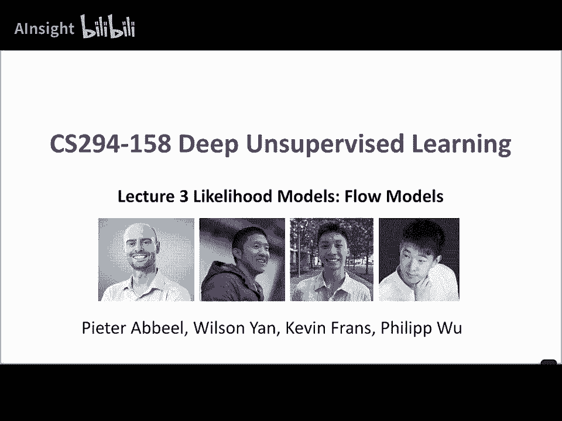

所以让我们回到什么 我们是否，想要一个生成模型，我们想要，很好地拟合训练数据，真正的，底层分布，不仅要记住数据，还要，底层分布，不仅要记住数据，还要，了解数据，来自新 X 的分布，以及评估。

该 X 的概率的能力。 分布下可能或不太可能的 X，能够从，学习分布中采样并以这种方式生成新，样本，并且有意义的潜在表示或，嵌入空间可能会，很好，因为这样您可能可以，在此基础上训练一些东西，或者您。

可以这样做 有意义的不同项目之间的插值，回忆讲座两个，自动攻击模型 嗯，它们实际上，检查了很多框 嗯，除了采样，是连续的，一次一个像素，一次一个令牌，因此生成，东西的速度很慢，在生成过程中没有并行化。

aive 模型缺乏潜在的，表示或嵌入空间是的，您可以找到调整它们，但，在其他一些模型中仍然没有那种自然的设置，例如，我们今天将介绍的模型，以及在未来的一些，讲座中的一些其他，模型，至少在实验方面。

模型的自动性已经取得了成功，实际上与，离散数据有关，它可能，与串行方面有关，我并不是说一定会，如此，因为如果你连续进行，它是串行的，通常很难保持，分布，然后 一旦你对，一件事进行采样。

下一件事你就会越来越远离，分布，所有的，赌注都消失了，而对于离散，你几乎自然地，在某种意义上四舍五入到分布，所以，也许在这个系列生成模型中，离散，可以自然地工作得，更好 但我再说一遍，这些都还没有。

被证明，这些只是，考虑流程模型，所以我应该，在某种意义上检查所有的框，但，到目前为止，性能不如，其他模型那么好，所以你，检查了所有的框，但没有使用，与其他一些模型具有相同水平的性能让我们。

看看，所以我们的目标是拟合，X 的密度模型 P Theta，现在，在某个 n 维空间中具有连续的 X，我们想要的东西已，在上一张幻灯片中列出了，理想情况下，适合趋势数据的在线。

分布能力可以评估 P Theta，因此还有采样的推理能力，并，希望有一个良好的嵌入，空间，我们将在这里进行呃实际上三个步骤，然后在反量化上有一点额外的呃位，所以我们 将从，1D 流程开始，稍后为。

我们接下来要做的一切奠定基础，我们将进行 2D 作为，最简单的概括，然后我们将看到将，直接构建的通用版本以及，我们将在那时涵盖的所有内容，最后一部分下降化是什么，意思，嗯，正如我所说的，流。

模型是针对连续，值变量和分布的，我猜是实数或矢量值，嗯，实数，如果你的数据是，离散的，那么反量化的概念就是，这个想法 将离散，数据转换为连续数据，以便您的，数据适合，在数据上训练连续密度模型，如果数据。

实际上是离散的，那么您为什么要制作，连续井以使其适合，这些类型，这可能看起来有点奇怪 模型的种类必须这样做，我们会明白，为什么，好吧，所以这次我们将使用概率，密度而不是离散的，um，分布。

所以快速提醒一下，概率密度意味着什么，这里有一个例子 P of X um at，沿 x 轴的任何给定 um 点，您都可以读出 X 的 p 值，但是，X 的 P 值，例如这里 X 的 p p，大约为 4。

并不，意味着，此处相应事物的概率为 四个 这不是，密度的含义 密度的含义，是，如果您采用任何，有限间隔并在，该间隔上进行积分，您将得到，样本，在该间隔内着陆的概率，因此含义是，X 着陆间隔的概率 AB。

是 X 的 P 区间上的积分，因此例如自然地在，峰值处有很多密度，但，实际上它的意思是，如果我取一个，区间，也许这个区间在这里称为 a，称为 B，那么，积分是 该区间中曲线下的面积，即与，该。

部分中着陆相关的概率 对于这些连续值分布，任何特定数字的概率，实际上为零 嗯，因为这样你的区间长度为零，如果长度为零，则，积分为。

零好吧，如何拟合密度模型，假设我们有一些连续数据，现在我们想要拟合最大，似然模型，正如我们在上一讲中看到的，那样，如果您可以将拟合，问题表示为 最大似然，问题，你会得到很多好的属性。

所以我们采用参数化密度模型，P Theta，然后最大化，该模型下训练数据的对数似然，同样地，因为，现在大多数优化器都设置为，最小化器或超出 最大化器，您将，负对数可能性制定为，训练目标，然后运行。

优化器以希望找到一个好的，最小值或最小值（如果存在，全局最小值），好吧，这与。

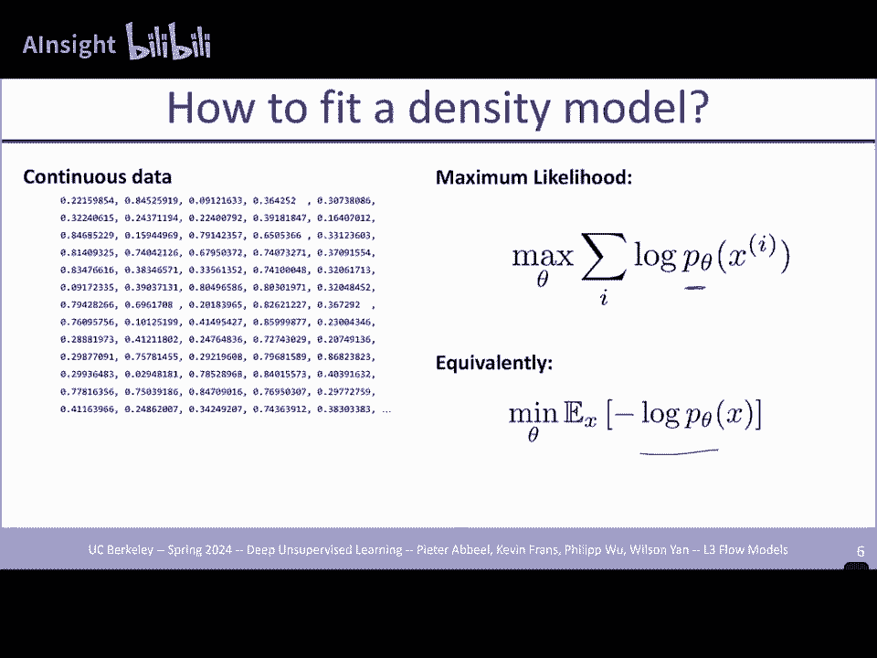

我们上次看到的非常相似，顺便说一句，我只是想标记，当你有连续的，数据来离散化它，然后拟合一个，离散模型时，这是可能的，从某种意义上来说，这是一种选择，这就是现实，世界中的图片，我猜它是光子，所以。

很难知道我的意思是，但是有多少，能量 光子是否量子化，非常复杂，但它比离散更接近，连续，我们将其转换，为像素，这与语音相同，在上一讲中我们对它进行任何操作之前，我们将其转换为离散值。

有时它可能是有意义的。

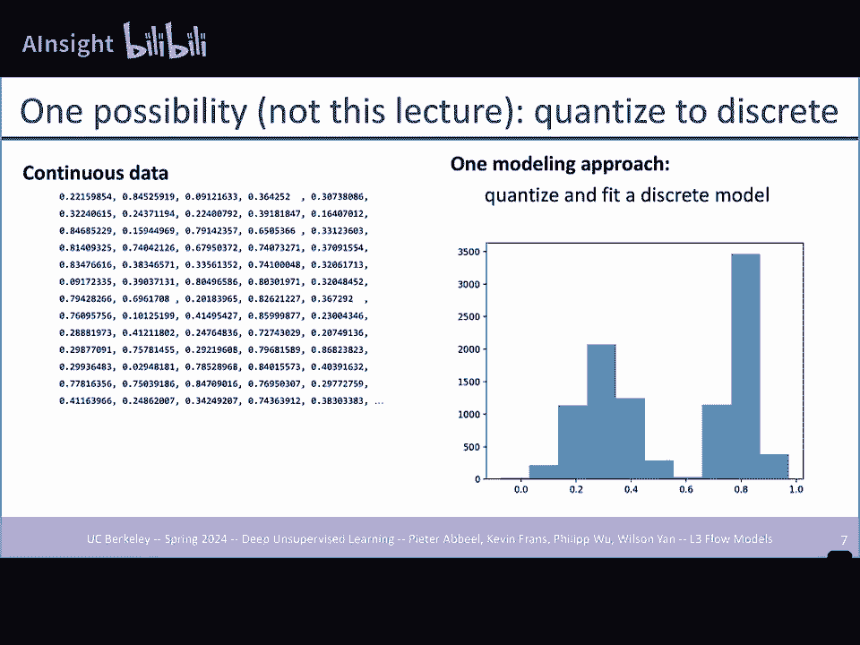

但这不是我们今天要介绍的内容，因此我们将对该数据拟合一个密度。

模型，什么是密度模型的示例，高斯混合或者您知道，在这种情况下可能有两个 gaan，可能有两个以上如何 你是否，再次表示概率密度，这是一个密度，um是，与每个高斯相关的密度的加权和，所以在。

最简单的情况下，如果你有两个高斯，也许每个都有一半的权重，你可以做，一半的权重 第一个是，第二个的一半，然后这，两个 gaan 只是将，每个权重加在一起，并且一起形成，概率，密度，一般来说，如果您有。

高斯的混合，那么您，将尝试学习的参数是，具有以下特征的混合权重： 求和为 1，然后是，每个 GA 的平均值，以及。

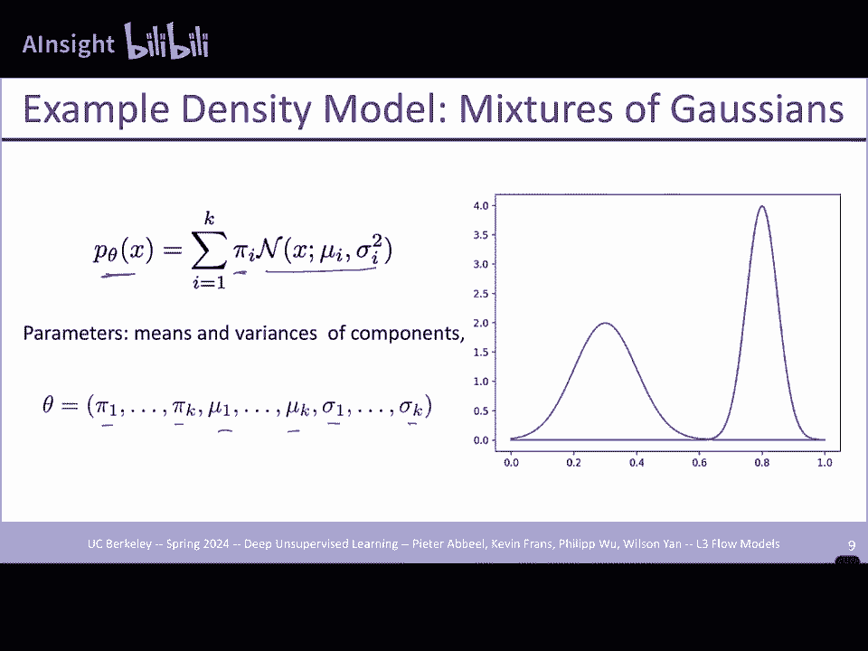

现在每个 gaan 的标准差或方差，尽管这听起来，不错，也许对于某些场景，您，想要拟合 gion 的混合，我们知道，最终我们感兴趣 在，拟合高维分布时，我们想要提前考虑一点，即使，现在我们正在考虑一维。

数据，我们想要以一种我们，提前考虑更高维，数据的方式来做，所以让我们说当，你尝试时会发生什么 为了将高斯混合拟合，到图像中，您有一堆，图像，它们是高维，向量，您需要将，高斯混合拟合到它们，然后。

如果该图像在训练数据中，则从该高斯混合中进行采样，可能最终会得到，这样的结果，因为实际上你是在说，接近也许这是接近，你的拟合平均值的方法之一，高斯，扰动是可以接受的，并且仍然可以，得到一个好的图像，但。

一旦你扰乱每个像素，这实际上是不正确的，高斯噪声实际上你得到的是，一张非常不可能的图片，所以，这种拟合一堆，高斯会在高维空间中产生良好结果的概念，对于图像来说显然是有缺陷的，因为附近。

实际上没有那么多好的图像，所以，不知怎的，这个概念 就像附近，不正确的原始像素，空间现在我说的是在，原始像素空间中不正确你可以想象，我们下一步要做什么嗯，我们要做的是，从原始像素空间进行转换 空间到。

另一个空间，所以流是当我说，流或流模型时，它指的是，从 X 到 Z 的转换，你有，一些输入，X 计算包发生，变成 Z 是的，问题，所以这次，你所说的。

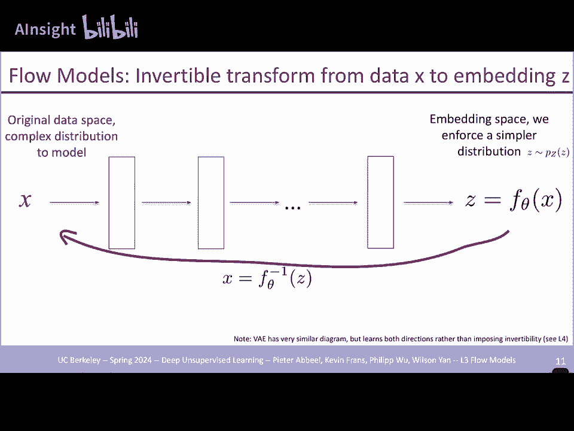

是，甘有点像在一个值上放置高密度，然后它周围的每个值都，有点像具有相似的密度，然后它有点曲线关闭，你是，说该，表示实际上并不是嗯，分布的表示，就像结构图像，因为，附近的东西可能没有多大意义，你。

可能无法清楚地看到它看起来，像什么，但它会像，接近正确的值是的，我喜欢，你表达它和回放它的方式，通过记录，本质上，如果我们使用，高斯混合来对图像数据，和像素空间进行建模，那么问题是，如果我们想。

为任何训练图像分配更高的概率，我们也会自动，为非常接近的图像分配更高的概率，在像素空间中测量的图像，我向您展示了一个示例，说明，像素空间中附近的像素附近的图像是什么，样子，并且。

生成的图像不是理想的图像，它不是，我们，自然图像分布中的自然图像，因此它，强制 该密度也出现在该，图像上，我们不想再提出，另一个问题，因此这是否意味着，模型的退出量是由，我们，拥有的数量固定的。

如果您做了混合模型，则说，混合，如果你想让你的，原始图像至少能够，可靠地重新生成，你可能需要，为每个，原始图像使用一个混合组件，但，如果你的，混合组件较少，你仍然会泄漏到附近的图像中。 会让，您知道。

这些现有图像之间发生的像素空间中的奇怪插值，这些图像，根本不是自然图像，但仍然具有，与其相关的高概率密度，因此清楚地直接拟合，连续分布，该分布是，杜松子酒的混合物 原始像素，空间会导致一个结果，这。

不是我们正在寻找的一个很好的结果，是的，是因为我们，很难学习这些参数，或者，因为这是不可能的，这是一个，好问题，这是一个可学习性，问题 或者它只是一种，表示形式，如果您，直接在像素空间中使用甘斯的混合。

那么，这种表示形式就是有，缺陷的，即使是，您找到的局部参数的最佳选择，也不是，您最终得到的参数设置的全局最佳值，具有相同问题的东西，幻灯片上显示的这两个图像将具有相似的概率，密度，嗯，你。

可以说极端情况下，如果我，在每个训练数据点上放置超高的峰值，并且我完成了 任何东西都会，泄漏它，就像零方差峰值一样，那么你什么也没有得到，但你的，训练数据被覆盖了，现在你实际上根本，没有泛化能力。

所以要么，你从字面上记住你的训练，数据，要么你得到这种东西，你把概率放在，测量的相邻事物上 像素空间中的相邻区域，会导致非自然，图像，是的，是的，问题很好，如果我们尝试不同的分布，而不是高斯分布会怎样。

我认为，这确实触及了leure的核心，我喜欢这个问题，嗯什么 我们有什么选择是正确的我的，意思是我们有高斯分布我们可以，混合高斯分布嗯也许还有，其他一些参数化，分布我们可以嗯，你知道以某种方式分析表示。

然后进行优化但，选择不是，本质上我们必须处理的选择并不多，所以这就是为什么我们要做的就是。

在某种意义上承认，失败，我们处理的参数化分布的数量，相对较小，并且 它们，都不适合自然图像或，语音等其他类型的数据，但，也许在变量转换后，如果我们选择正确的，变量转换，它们可能会变得自然，适合。

因为我们将训练它们，我们将训练它们 变量的转换，例如尝试获得良好的，拟合，我们正在训练该转换，以使那些真正有限的，表达力分​​布仍然，成功地在这个新空间中对数据进行建模，这就是，流模型的想法，嗯。

但你是对的 如果我们有一套，非常丰富的，发行版可供选择，嗯，但，我们没有，但如果我们有，也许我们，可以直接尝试对其中一个发行版进行建模，但这是获得我们要说的方式的一种方法，我们，通过考虑。

变量的变换并仅在，之后进行拟合来实现更广泛的分布，这样我们就有了，更大的，灵活性，因此流是，变量的变换，因此流，模型将采用原始输入，对其进行处理并生成嵌入 Z，我们将其称为 X 的 f 的某个函数。

我们正在尝试学习该，函数，因为我们希望以某种方式，转换事物，以便我们到达一个，空间，在该空间中，假设高斯分布或，另一个易于参数化的，分布将是 非常适合，在流模型中拟合变换数据，我们还要求。

F Theta 是可逆的，因此如果您，从 X 到 Z，您应该能够，直接返回到 X，这很方便，因为如果您很好地学习了可逆映射，如果 这个Z来自一个，简单的分布，比如高斯，或均匀分布，或者你可以。

从高斯或均匀分布中采样，使用逆映射并生成一个，X，它有望来自，你关心的正确分布，请注意，它也是限制权利的，我们会，看到，如果我真的跳过，我，认为为什么流模型可能没有，与许多其他模型相同的性能水平。

因为它，必须是可逆的，并且可逆限制了，你 嗯，我想，如果，有的话，尽管有，这个限制，但他们的表现还是令人惊讶，的，所以也许它可能会更好，我，将来可能会更加惊讶，但这个限制意味着例如。

Z 将具有与 X 相同的维度，因为否则实际上你无法，进行逆映射，嗯，如果你不希望它是，可逆的，你觉得它太有，限制了，你可能想学习，逆映射，并说为什么不以一种，方式映射，然后在另一个，方向学习 当然。

下一讲 Vee，第四讲本质上是相同的事情，但，我们将学习，逆，嗯，使事情更灵活，你的 Z 可以有比 x 更高或更低的，维度，这都没，关系，但这是一个有趣的问题，因为如果你构造它。

有了 f theeta 可逆，很多，问题都会自动解决，采样变成只是一个反转，所以，非常非常简单地完成它，这就是我们将，X 转换为 Z 的主要思想，我们将学习，这种转换，然后我们将进行，为了适应变换。

变量的分布，我们有一个简单的，参数化，是的，谢谢，所以，我只是想一件事，就像当我们谈论，GA 的混合就像一个 ation 时，我，理解为什么它会 直觉上是一个缺陷，表示，但有时，当你试图解决一个新。

问题时，找到一种新的表示事物的方式，真的，很难提前知道，是否有任何方法，可以告诉你，除了尝试，一切，因为当你，计算有限，例如，当我们，在大学里时，我们正在做，研究，围绕这些事情建立直觉的最佳方法是什么。

有时你，期望好的事情结果并不，好是的 这是一个非常好的问题，你如何知道，你假设的分布类是否适合，或不适合，或者，你假设的神经网络结构，是否适合，我认为没有完美的，我认为最好的，做法是。

在文献中查找类似的，数据，嗯，这对其，他人来说效果很好，可以给你一些，直觉，然后当你开始运行，自己的实验时，你可能会 首先运行，一个实验，其中只有一个，训练示例，并且确保，至少有一个训练示例。

知道如何处理它，因为这，应该很容易，您应该能够，过度拟合，这也是一个调试，问题，确保它有效 从那里您可以继续，进行一些训练示例，确保再次适合，这，不是您想要的模型，但它会检查，您的模型类是否具有。

足够的表现力，至少可以捕获，交易数据中的内容，然后您，实际上可能会看到您是否 可以再次过度拟合你的，整个训练集，这表明，你的模型有能力做到这一点，这，可能是好的，这可能，意味着你过度拟合，但这。

是你可以在，你说“好吧，我拟合”之后解决的问题，我记住的训练数据有点，太多了，也许我需要更多的，正则化，你知道的其他事情，丢弃各种可能，有助于正则化而不是，完全过度拟合的东西，但我会从你知道的，看文献。

尝试过度拟合，然后 确保最后它，也概括了我明白了，是的，对于，概括，您基本上只是，尝试不同的正则化技术，数据，增强是的，我的意思是这些事情，往往没有很好地规定，但，实际上您。

尝试了您可能会尝试的不同级别的正则化 不同的，学习率，你可能会尝试，不同的数据增强技术，而且有很多技术，你也可能会尝试不同的模型，类，你可能认为某种，模型类比，另一种模型类具有更好的归纳偏差。

例如 一个像，多层感知器一样的完全连接的学习，视觉表示可能不是那么，理想可能无法概括，就像，约定或变压器，模型一样所以是的，我，想从某种意义上来说有很多，你需要的黑暗艺术 随着时间的推移，是的。

假设神经，网络就像，Dom 的一般床功能来做 Z 是更安全危险吗？是的，我，认为这是一个非常好的问题，它确实是，课堂上很多内容的关键，但只是，预览大多数神经网络都不会，是可逆变换，因此。

您需要对流模型做的很多事情，是约束您的神经网络，以，确保它是可逆的，不仅是，可逆的，而且是有效可逆的，因为某些函数是可逆的，这，需要花费一些时间 需要进行大量的计算，来反转，然后也许它仍然不是。

正确的函数类，所以需要付出很多努力，事实上我认为它，甚至没有完全理解，就像，这到底是如何限制你的，我，会 稍后向您展示流动，模型是完全通用的，假设流动模型足够大，您可以用流动模型表示任何分布。

但这几乎就像说您知道，如果有足够的混合，任何一维分布都可以用高斯混合表示，组件，但这，并不意味着它，在感应购买等方面是正确的分布，但从这个意义上说，流量模型，是通用的，如果你只是想好吧，我。

将在某个时候制作一个非常大的模型，我绝对可以适应一些东西，但是，是，的，是的，所以我喜欢这个，我喜欢这个想法，如果我们将 F Theta 视为，类似进行 fre8 变换的东西，我认为。

这绝对是一个可行的东西，嗯，这是一个可行的，基础变化 对于许多，信号处理应用程序来说效果很好，所以你，绝对可以想象在这个，空间中，比原始空间更容易适应分布，在某种程度上对于图像甚至。

在更大程度上对于音频来说，现在希望可能是这样 你可以，学习一些更通用的东西，但我，认为这是一类很好的函数来，考虑嗯，我，现在可能会预示的一件事是，如果你，有一个步骤是可逆的，而，下一步是可逆的，则组合。

Al 也是可逆的，所以如果你的想法是，插入一个傅里叶变换，你可以，这样做，然后是所有其他的事情，然后是其他的事情，等等，这样你所有的想法都可以，连续地堆叠在一起，这非常，有趣，这也可能是为什么。

它们实际上做得非常好，并且，您可以，在不同的层中发挥很多想法，这样您，仍然可以获得相当多的，表现力是的，关于流模型的最后一个问题是，因为您希望它，完全可逆，这是否意味着您，仅限于，您想要使用的激活函数。

例如，sigmoid 是可逆的，但像，Ru 则不是，因为任何，负值都会使 M 为零，因此您无法将，其恢复，因此流模型会限制，您 通过使用某些激活，函数，他们绝对会这样做，正如您，所说的那样。

Rue模型将所有，负数映射到零，因此它是不可逆的，现在不能将其放入您的网络中，嗯，如果，您知道一切总是正数，如果您的数据有保证的话，但是 Rue 只是一个线性，函数，并且不确定将。

其称为 rue 是否重要，那么，我们需要做什么才能，正确地拟合这个函数，因为我们要做的最后一件事，就是让我们转换所有，数据 进入zspace，将它们全部放在，完全相同的Z上。

然后我们在zspace上进行最大似然，我们得到了很好的分数，因为所有东西都在同一点上，并且认为我们已经完成了，因为，那不起作用，它是不可逆的，但我们也不希望有一些接近的，版本成为可能，所以。

正确的方法是研究，变量公式的变化，所以如果 Z 是，X 的函数，那么让我在这里画出来，这样，假设 x，在这里，我们处于 1D 状态，所以很容易在那里绘制 Z，生活，Z 是，X 的某个函数，例如。

可能是 X 的函数，这意味着如果我有一个 X，例如这个 X 在这里它将，映射到那里的这个 C，好吧，嗯现在我们想要的是我们，真的想对原始数据进行建模，它将有一个密度，所以也许 X 有，一个密度。

你知道什么让我们保留，它，让我们保留它一点 简单来说，假设 x 的密度，到这里为止都是均匀的，假设这里没有任何东西，经过，所以，现在当我映射到，Z 时，X 具有均匀的密度，我希望基本上是这样的情况。

当我查看，X 周围的区间时，这里的原始 X 我，在这里查看概率质量，然后我希望 Z 的密度能够使，相同的质量映射到，z 空间中的附近间隔，所以我把，um 左边让我在这里添加一些颜色，我在，这里取这个点。

它是，映射到这里我取映射到这里的间隔的另一端，所以我希望，蓝色和绿色之间的间隔，捕获相同数量的，Z 和 x 积分，所以如果，我们看看这个，我们 好吧，这可能是 1/2 的斜率，2，um 的斜率。

然后斜率会更，陡，发生的情况是，这里的这个，间隔，因为斜率很浅，实际上被映射到，Z 空间中更小的间隔，所以什么 这意味着，如果，对于这么小的质量，只，需要传输到，Z 空间中较小的区间，我们实际上会得到。

Z 空间的更高密度，以确保，所有概率质量都是进入的空间，因为我们让 说把它分成，间隔长度的一半，所以它，需要两倍高才能适应，相同的概率，质量这是一种有限概率的，观点需要发生什么，然后在这里斜率更。

陡我们看一个小，这里的间隔，很好，应该映射到更宽的，间隔，因此，X 侧的概率质量本质上是相同的，但在 Z 上它更宽，因此，Z 的密度将更像，这样，现在我们 看到，有一条曲线，其中有一个扭结，所以。

本质上会发生什么，到那一点为止，Z 的所有行为都将相同，所以每个 Z 都会，有看起来像这样的东西，然后，下降到这种 密度然后，它停在，这里，所以这是我们，最终得到的这个特定，变换的 Z 密度，嗯，在。

DX 和 dz 的微小间隔水平上使它更加精确，我们所说的是，点周围的密度 x * DX 需要是，Z * DZ 周围的密度，但它需要是，与 DX 相对应的 DC，就像我们将间隔，从水平轴转移到垂直，轴时。

它改变了 DX 和 DZ 的大小 它们，需要对应，它们的，大小不同，您需要将 X 空间转换为 Z 空间，才能查看该大小，您可能想，知道该大小变化了多少，这就是这里的东西，这是 d Z，与，DX 的比值。

它正在测量多少，当我从 X 空间到 Z 空间时它会发生变化吗？它实际上只是函数的导数，所以要知道，密度，变化了多少，我们只需要查看，函数的导数，这就会，告诉我们密度变化了多少 密度变化。

因为这告诉了间隔在，局部放大或缩小了多少，以，补偿密度的相反，方向，嗯，这我的意思是，我显然不是在证明，这一点，我只是想给出一些，直觉，嗯，这 是，标准概率论中一个公认的结果，这是我们。

对流所做的一切的基础，因为如果我们遵循这个规定的，公式，我们知道现在如果我们，在 z 空间中拟合一个密度，它会正确地 M，映射回 X 空间中的密度，两者之间会有适当的对应关系，注意，嗯，这里的东西需要。

是可微分的，通常这不是，问题，我们喜欢，与 NE 网络一起使用的大多数函数都是可微分的，所以，这不是一个大要求，嗯，也需要，是可逆的，否则我们，现在不能这样做，你们中的一个人可能会说。

是不是真的需要可逆，才能做到这一点，我们不能扩展这个权利吗？如果这种情况继续下去，并且您知道这个，函数回到，这里，您一直都知道，这里是什么 如果我采用这样的函数会发生什么，所以现在我的函数。

是f Theta像这样并继续，并且有一些回落所以不，可逆我仍然可以传输，概率质量我仍然可以，对这里的每个X说好 我可以看到，它落在哪里，并将概率 Mass 推到，那里，所以我最终得到的。

实际上是每个 Z 的总和，我需要，查看所有可能落在，该邻域的 X 和 Su 在一起，看起来像这样，做起来很烦人，可能嗯，工作起来不太方便，然后在回来的路上，你必须，决定做什么，它会回到哪里。

它会回到 X 中的哪个，有时是这里的 X，有时是那里的 X，你要去哪里 条件非常差的，情况，因为Z，我的意思是在这种情况下，这里的Z有时会M回到这里的X，有时M回到那里的X，在大多数，情况下。

你的嵌入空间会，爆炸，这是非常差的条件 以某种方式进入完全不同的，事物，嗯只是随机，抛硬币，所以即使也许有一种方法，可以让它在数学上不可逆的情况下工作，从，理论上讲，在实践中设置一些东西，但它。

可能永远不会很好地工作，甚至很难实现任何东西，因此，在流模型中，它被假设为，可逆且。

可微的，那么，如果我们有多个，数据点，训练会是什么样子，我们只是重复这一，目标，因此在，X 的密度下最大似然对数概率，但我们不直接参数化，X 的密度，这只是，概念性的 X 的 P Theta。

它是一个概念性的东西，我们没有这样的东西，哦，这是什么？我们，真正要做的是将 X 转换为，zspace 模型，那里的密度， 有，这个补偿项，因为，曲线中的斜率压缩或，延伸从 X 到 Z 的间隔，您需要。

弥补，这一点，这可以通过，梯度下降随机梯度，下降进行优化，所以从某种意义上说，如果您发现，您就可以开始了 一个，可逆可，微的函数类，然后你可以运行，它并找到一组很好的参数。

uh Theta 现在在这里我假设这个，pzz 是一个给定的经常，你，可能会说哦，也许它只是，1D 的单位 gussan 或 它是均匀，分布均匀你需要，确保你映射到零当然与，你的变换嗯或者也许它是。

另一种简单的分布原则上，你也可以参数化这个分布并，学习一些额外的参数嗯它是，一种可交换的有更多，层 网络或者然后呃，参数化最后的分布，它是呃它是相同的嗯在这种情况下我，只是将其设置为有嗯一个固定的已知。

分布，你现在需要映射。

到好的分布中，并且你的很多，问题都预料到了，喜欢这些，问题 嗯，我们知道什么是流模型，就像顶部的摘要在，某种意义上告诉我们需要，知道的一切，但我们需要做出一些选择，我们需要选择 F Theta。

我们需要，选择嵌入空间密度 pz，可以什么 我们为一维中的 f Theta 选择，一个可逆函数实际上并，没有那么多选择，在某种意义上，可逆意味着你要么，单调地继续上升，要么，单调地继续下降，如果你。

在方向上转身，你就变得，不可逆了，所以 ax 加 b 为，正 a 其中 A 和 B 是，参数多项式，仅具有正，系数并且仅具有，奇数 uh 幂，X Theta * X 其中 Theta 是参数。

sigmoid ax +，B cumul 任何累积密度函数，顺便说一句 sigmoid 是，从 0 到 1 的任何值的一个示例 因为，累积密度函数是单调的，是，可逆的，嗯，也许你的 pz 应该是。

01 上的均匀分布，因为你，不会超出 01 嗯，但这是，一个合理的选择，你，可以有相当复杂的 cdfs，你可以，组成流程，这样你 如果您对这个概念厌倦了优化设置，那么现在可以将它们链接。

在一起以再次获得流程哦，我的参数必须为，正值，您可以玩一些小技巧，就像您可以说的那样，而不是让，参数 a 需要大于，零有一个，参数 a bar，您可以使用，bar 的指数幂版本，现在您总是积极的嗯。

所以，有一些方法可以做到这一点，而不必，在您查看此列表时对优化引入硬约束，可能有点，失望，因为，那里没有任何内容表明嗯，你知道，注意网络或类似的东西，至少对于高维中的一维我们，有更多的选择，但在一维。

选项现在同时受到限制，一维分布 它们到底能是什么，如果你选择所有累积，密度函数，你已经把它，全部覆盖了，那么它们就没有那么多了，所以，如果你的Z你的pz在这里是正常的01，它被，称为归一化流。

也许没关系。人们谈论归一化流，这就是它的意思，它可能是，高斯的混合，这是一个合理的选择，你，可以学习，G 的混合的参数，这样你就可以提前设置它们，它可能是均匀的，但。

你最好确保 F  Theta 映射到 01，所以如果你有制服并且你的地图在，01 之外，那么你的，概率为零，你会取零概率的对数，你会得到负无穷，大，否则优化会爆炸是的，是的，是的，所以，首先，嗯。

这种数学可以，说，我们学习的任何函数以及，所谓的形式的任何参数都被输入，到某种像，Le的东西中，这就是说，嗯，我们会选择一个简单的分布，例如像g 然后是，我们学习的模型的输出，嗯。

我很快就会给出一些例子，所以，我们为什么不暂时推迟这个问题，你还有另一个问题吗，或者，它是否非常相关，那么也许也推迟一下，是的 我猜另一个问题，是，我看到这里的模型到目前为止都是，模型，等式。

我知道你谈到了，解释 Inver um，比如参数是什么，比如，一个，人如何建模，好吧，是的，让我让我让，我把这个问题推迟到以后再说，好吧，但这是，一个正确的问题，它是，我们需要考虑的正确预期。

但我有很多关于，这个问题的幻灯片，所以我会等到那些。

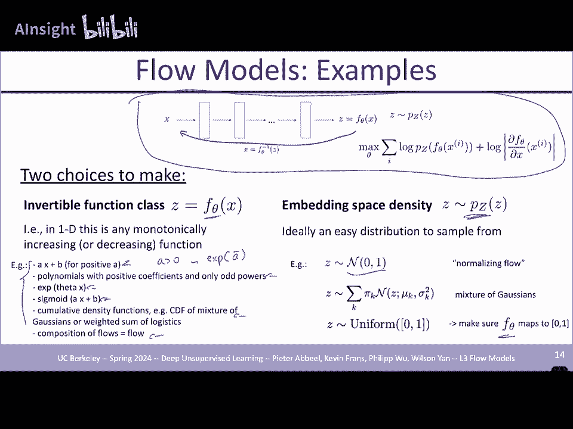

弹出来让我们看一些例子，这样我们，就有了 密度，我们原则上只是可视化，我们只会有，一些样本的数据，但我在这里可视化，这些样本来自的密度，我们，对流变换进行了初始化，这导致了，这里的，Z 密度。

所以 需要非常清楚的是，这一侧是，X，这是 X 到 Z 的流，然后这是，训练后的 z um，因为我们正在，拟合高斯 uh 单位，正态 uh 分布，我们学习，流的 f Theta，它确实改变了这个。

原始密度 它有两个，高斯峰值，不大约，一个峰值 U 可能只需要多一点，训练来平滑它，所以这是可能，发生的情况或你可以。

做什么的一个例子，这是另一个我们要统一的例子，所以它是 基本上 um 相同的，分布，但现在，再次以采样方式显示 左边是 X 中间是右边的，流 右边是，Z 的结果分布 最初它，显然是一个非常简单的转换。

um 它不是任何接近均匀的，um 它仍然有 这两个峰值然后，当学习完成时，它，会将这两个峰值分布（，可以在实线上的任何位置）转换为，均匀分布的 01 或，接近。

它这里又是左边的另一个例子，中间的 X 是流量，右边是变换 Z，最初再次对结果变换进行采样，这里的流程只是一个简单的 sigmoid，我们，映射到 beta 55，这是一个更多的，峰值分布。

但仍然在 01，区间，可以将其视为类似，有限支持的高斯也许，你知道什么是 beta 55，嗯最初你仍然看到两个峰值，出现但随后它学习了一个将，其建模为 Beta 55。

分布的流程好吧所以一维流程模型，快速总结嗯我们开始 从某个 X，空间开始，直接放入简单分布并不是一个好的空间，这就是，我们将其转换为新空间的原因，我们，希望我们能够强制该，转换足够好，以便我们。

可以在这个新空间中使用更简单的 uh pz，很容易使用，也希望很容易从中采样，因为当我们从 pz 采样时，我们反转，F Theta，我们得到 X 回来，很容易，评估，你得到的新数据点的概率。

所以有时我们已经，解决了所有问题 我们已经，预料到了，表达能力方面的痛苦，但所有的框都，根据我们对生成模型的期望进行了检查。

现在让我们看一个经常出现的特殊情况让，我们假设，X 的 z f Theta 是 累积密度，函数和 pz 将是均匀的，01，好吧，累积，密度函数意味着什么 累积，密度函数意味着基本上。

当你有一个规则密度时，让我们，说 um P 我会很好，我可能会使用 x，的 x PX 嗯，密度 um 将这个概率分配给，每个间隔，所以你可能有一个，密度，可能看起来谁知道可能像，高斯那么累积密度。

函数或，CDF，所以她整合了，到目前为止遇到的所有概率，所以，它上升得更陡。 在，顶部的峰值处最陡，然后，斜率开始，衰减，然后斜率变为零，因为它在这里变为零，并且该，累积密度将从零变为，一。

因为它将所有，概率质量从负无穷大积分，到你正确的位置 现在这个，总数应该是一个，好吧，PDF 和，紫色的比例不同，我，想否则它可能不会，集成到一个中，所以这就是，CDF，CDF 的有趣之处在于。

当您使用 CDF 时，您会映射，到 到 01 所以你可以使用均匀，分布作为 Z 分布，这，是一个方便使用的分布，因为，涉及 Z 的项甚至没有做，任何事情它呃没有什么可以，优化的它只是总是一个常数。

所以你只需 其他术语来，处理一些有趣的事情，如果你看的话，让我看看我是否在下。

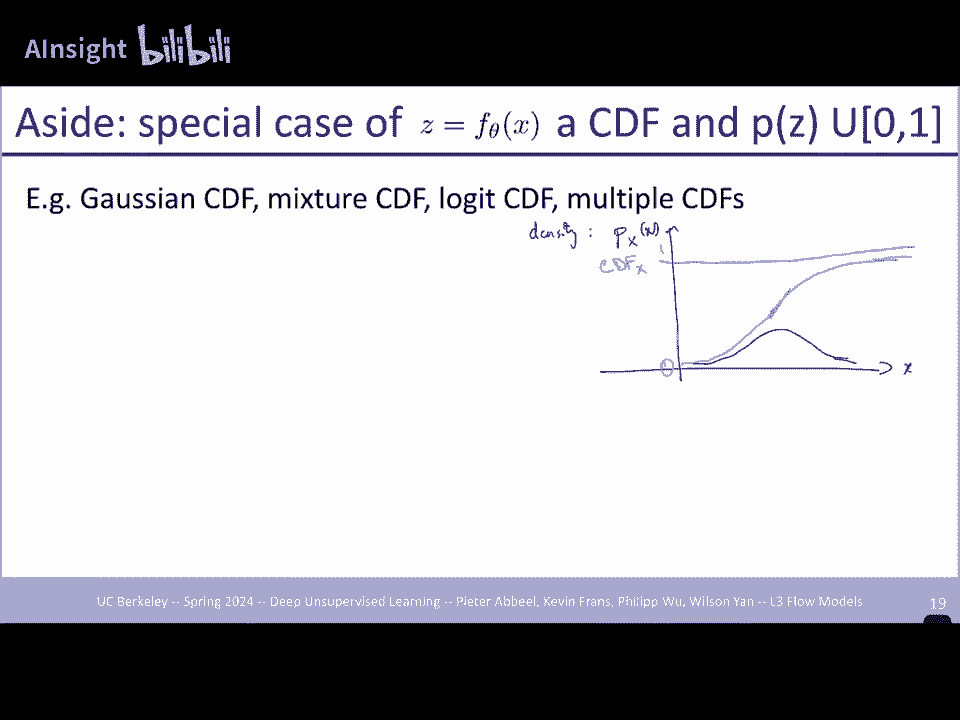

一张幻灯片上，或者好吧，这里有一个例子，所以更复杂的例子，如果你，看这个双凹凸，你会得到这种，累积密度那种斜坡 在，第一个峰值处快速上升，然后减慢，在下一个峰值处再次更快地上升，然后到达。

一个您可以通过倒数对 um 进行采样的值，因此，如果您，在 01 中均匀采样，然后，通过，累积密度的倒数将其映射出来，您可以 得到一个样本，所以我在这里告诉你的是，累积密度函数是一个，流，它将你的。

X 的原始分布直接流到均匀分布上，所以，在某些情况下，你说你知道，我想要找到什么，这可能是一个，如果我使用 pz 均匀，那么基本上我正在寻找，在我的函数近似序列中找到这个 CDF ，所以你可以想到。

这种特殊情况，即末端是，均匀的，因为之间的所有内容都，有效地对 CDF 进行建模 在某种程度上，因为当你得到最，适合你的数据的时候，如果优化效果很好，那么你最终会得到这样的结果，并且很容易从嗯采样。

就像我们，现在抄袭的那样，有趣的一件事，是 如果你看一下，这里的方程，我们正在转变一个流动模型，假设，最后的东西是均匀的，所以这是，均匀的uniform 01，所以这是一个常数，对优化没有任何作用。

你剩下的就是这部分，现在如果 f theeta 是累积，密度函数，那么我们有 D，相对于 x，x 的 CDF 这实际上等于 X 的 P Theta，所以在这种非常特殊的情况下，与。

直接建模 X 的 P Theta 非常接近 因此，如果您所做的就是放入一个，累积密度函数，这就是，您所做的全部操作并映射到 01，则相当于，直接对，您想要的相应概率密度进行建模，但我只想指出，这一点。

所以最简单 你，说的流，哦，我使用高斯的 CDF 流到，均匀值上，这与将，最大似高斯拟合到，数据是一样的，如果你说我要使用，高斯混合的 CDF 流，那就是 现在，与将高斯混合拟合到数据中是一样的，当然。

NE Nets 的美妙之处在于，在到达另一边之前，您，需要更复杂的表达堆叠，但在，非常简单的场景中，它会退化，为您想要的东西 d ，但也意味着，它在这些情况下没有做太多事情是，的，所以这是。

我们刚刚看到的幻灯片版本类型版本。

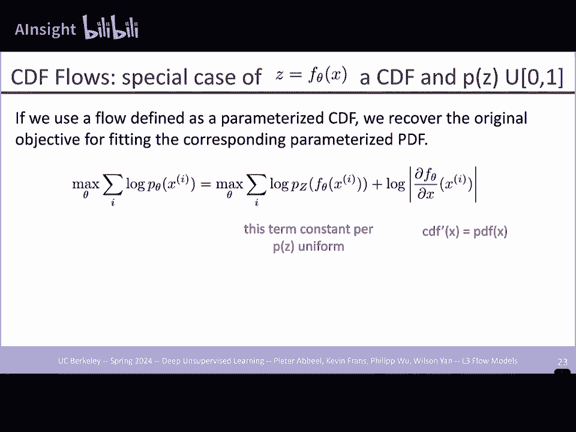

您可能想知道一般 R 流如何，可以用，归一化流来表示每个平滑分布，我们'，现在就想一想，谁认为，每个分布都可以用，流来表示，你们中的一些人，好吧，你们中的一些人，举手了，你们在前面，你们，举手了。

为什么你们认为是这样的，我想，如果不是人的话 会，对此失去希望，我喜欢它，所以这是一个，强有力的先验，说明为什么人们甚至花，时间在流程上，如果它不能，做到这一点，为什么我们还要研究，它，嗯。

这是一个非常好的先验，嗯，我完全同意这种观点，嗯，我们将在我们将在这里导出的内容中给出稍微更多的，首要原则答案，我刚刚向您展示了从 X，到，统一只需要 X 的 CDF，所以，假设我让我的流程具有。

足够的表现力 为了能够表示任何CDF，让我们说足够多的高斯的混合物，或者，嗯，让我们说，物流UM，CDF与足够组件的混合物，如果在输出上我想要任何分布的Z，我可以将X从X流到均匀分布我，可以用。

同样的方式找到从 Z 到均匀的流，所以我可以得到 X，到均匀 我可以得到 Z 到均匀 现在我，只需反转这个家伙并取，那个家伙的逆，把它放在这里，我最终得到一个流 从，X 上的任何分布到。

Z 上的任何分布，所以从这个意义上来说，它是非常，普遍的，这并不意味着它总是具有正确的，归纳偏差并且训练速度，最快等等，但它表明，它是。

可能的，嗯，快速回顾一下，一维流中的流模型是，从 X（数据）到 Z（，噪声空间）的可微可逆映射，您对其进行训练，以便将数据分布转换，为基本分布 pz，常见的，选择是 pz 的均匀分布或标准正态分布，即。

这是您，优化的目标，在底部这是一个，示例，您的 F 从 X 到 Z，F，反转返回，嗯，这里是飞行的，流程已完成高斯，使用来自高斯的样本，然后，反转得到 来自，X 上原始分布的样本，我喜欢继续将。

其放在前面，即使您没有，真正直接使用它，也是为了澄清，这实际上是我们正在做的事情，我们正在正确地对 X 上的密度进行建模，遵循这个规定的公式，当你，改变变量和模型密度时，你需要使用这个公式，是的。

除了均匀分布之外，选择任何，东西还有什么意义吗？均匀，分布很受欢迎，你，只需要确保你最终的结果在，零和一之间 否则你会遇到，麻烦，但，如果你想要一个你，可能不想要的原因，你可以在最后一层这样做。

因为也许当，你将东西压缩在零和一之间时，你的梯度会变平，所以也许它更难得到，如果你没有，在正确的空间中完全初始化，那么与，流到统一的 01 um 相比，流到法线的问题可能更少，但是。

如果你有好的方法来解决，这个问题并让你的梯度，通过 很好，你知道优化前的信号流，然后在某种意义上，它是完全通用的，因为你说，如果我映射到法线，我可以，按照法线 CDF 跟随它，这会将。

其变成 01 所以如果我只是硬编码，最后一层，我实际上知道，流到制服上，只要，最后一层具有您知道的，容量，那么它就有点相同，只是添加一层在，制服和正常之间切换。

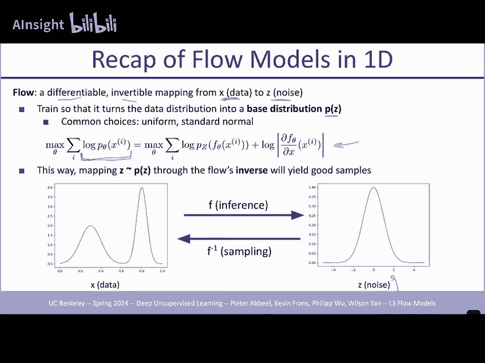

好吧，我们看看这个 看看。

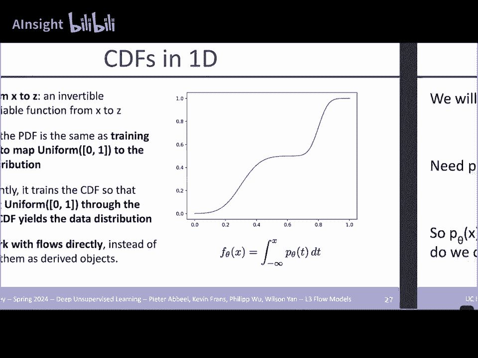

这个哦，我认为 PDF 保留了一些。

我想跳过的幻灯片，所以我，跳过了，它们，现在让我们看一下 2D 流程，这，将开始让我们对，在更高维度中可以做什么有一些直觉，让我们从，自动流程开始，这是一个 非常具体的，选择，但考虑到我们已经涵盖了。

自动攻击模型，考虑自动攻击，流可能是很自然的，所以在自动攻击，流中，我们从 X1 到 Z1，这就是我们刚刚所做的，在，那里没有什么新的东西，但，随后 X2 被映射到 Z2，但你可以，使用X1和X2。

所以你真的把X1和X2一起变成了，Z2，嗯，所以你只能很好地生成，你，实际上可以并行地做到这一点，训练可以并行地完成，但是，当你朝另一个方向走时，你会对你进行采样 需要等待，你反转的第一个，就像一。

维流一样，你只需按照我们一直在做的方式反转它，然后这里的第二个，嗯，当你，反转时，你需要，这个让我们看看你 如果 Z2，已采样，您需要等待 X1，生成后才能，反转，因此这是一种，有趣的情况，就像。

上一讲中的自动攻击模型一样，当您采样时，速度非常慢，一次一个，但是当，你训练的时候，所有的事情都是，并行进行的，你可以训练得非常，快，你可能会说，与，我们上一讲看到的自动攻击模型真正不同的是。

在某种意义上，我们对分布进行建模的方式，本质上仍然是 我们，现在应用的链式法则是我们对，链式法则进行建模的方式，而不是直接，为下一个变量制定 p 分布，我们说我们将，建模为新变量的流。

然后我们将其参数化，嗯，但很多强烈的，相似之处让我在这里暂停，因为，这可能是你知道的，所有更高维度的最重要的基本情况是的，所以当，我们得到 X2 时，为什么与，X12 相反，而不是 1。

很好的问题为什么不呢 这里使用 Z1，而不是 X1，这被，称为反向，自动攻击流，因此也存在，我们将讨论它们，它们都是，合理的模型，我们将，讨论两者，嗯，我同意两者都是，合理的，选择。

和美丽 在那里接受 Z1，你，不必在采样时等待，事实，证明，在训练时，我们很快就会看到，你很快就会，得到几乎与 RNN 相对应的东西，其中 z 是隐藏状态，你需要等待生成前一个 Z 才能，生成。

下一个 Z，因此训练将像，逆流中的 RNN 一样连续进行，但采样，会，很快，是的，嗯，无论你更关心哪个更重要，快速训练或更多，关于呃快速呃采样将，决定你想要使用两者中的哪一个。

并且有一些方法可以充分利用，两者呃我们也会，谈论，哦我想真正强调的事情，F Theta 2 中对 X1 的依赖性可以是任意，复杂的，因此当在这里计算 F Theta 2 时，它会接受 X1 和，X2。

它将 X2 转换为 Z2，并且需要，可逆，您必须，使其可逆 但是 X1 是一个给定的，当你这样做时就像一个已知的，只要你知道无论 X1 的什么选择都会，使整个事情仍然，可逆。

那么你使用 X1 的方式并不重要，所以你需要照顾，但是，对于如何处理 X1 没有什么特别的限制。

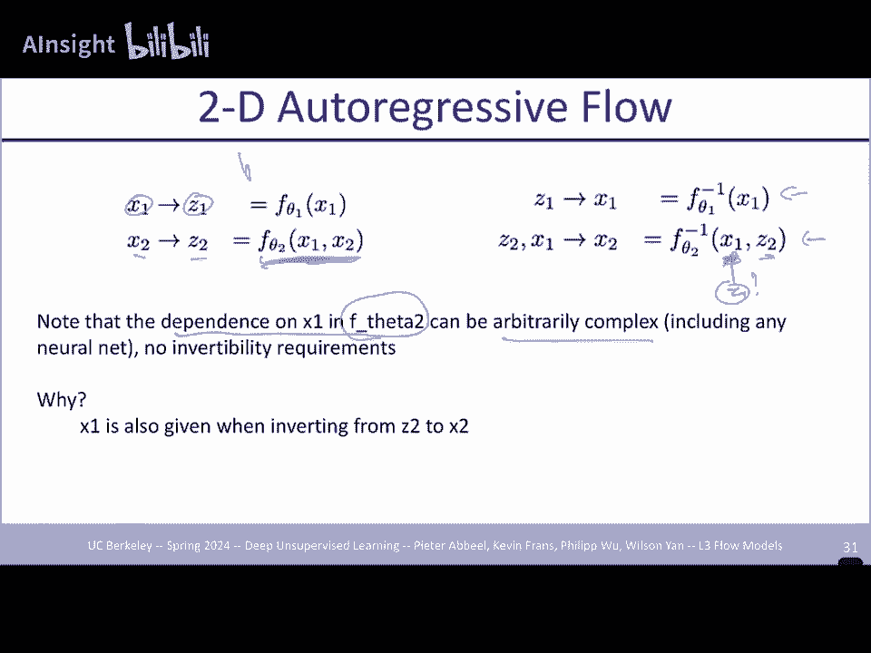

所以让我给你看一个，例子，假设我在这里有 X1，它会，变成高斯累积，密度函数变换两个分量的混合，在这种情况下是均值和，方差 是 Theta 1 参数，将其转换为，Z1 下一步嗯我将把。

X2 转换为 Z2 也与 Gan，累积密度，函数的混合我能做的是这个，参数 mu 和 sigma 可以依赖于使用，任何任意神经网络结构，X1，因此在某些情况下，您在。

X1 和 X2 之间创建的交互可以非常，丰富地实现 Z2，因为，您的 X1 可以由该分支中的任何神经网络处理，而，不是在顶部 X1 只是，通过累积 密度，函数将其映射到，相应的 Z 下。

因此 X1 的顶部路径，非常简单，就像，累积密度一样，看看您映射的位置，但，X1 的底部路径可以是，具有 ATT 张力卷积的任何模型，任何您想要的都可以放入其中 所以，这就是。

One D 中开始出现更多表现力的地方，我们，没有这一点，因为在 1D 中，如果一个，变量需要可逆，我可以，在 1D 中没有没有回旋余地去，2D 中的任何地方，我们开始有更多的，回旋 另一件。

值得思考的有趣的事情是，流的组合仍然是一个流，所以，如果你像男人一样，我真的很想，非线性处理 X2，在某些，时候你也可以在，它后面堆叠另一个，在那里你可以交换，X1 和 X2 它仍然是一个流程。

因为它只是在，我们查看的模型的 autog 中组合在一起的两个流程，在，您必须遵循，严格的顺序之前，您不能让，事物以任意方式相互依赖，但在这里，因为我们强制执行，可逆性，我们能够将 FL 流放。

在一个又一个的流中，这样，一旦你只有两个维度，你就可以，表达你可以表达的内容，你实际上可以开始变得非常复杂，你可以，彼此重复多次，这样你实际上就可以得到一个 许多更，复杂的计算发生在这些上。

当然它会发生在 Z2，和 Z1 上，所以我想说的是，如果，那里堆叠了另一个流程，我，可以首先使用简单的，累积密度函数流程执行 Z2，然后我可以 对于Z1条件以，复杂的方式在Z2上得到它的，转换，问题。

你有点鹿，为什么，转换是的绝对所以只是为了，清楚让我让我擦掉我，在幻灯片上画的东西让，我们，看看X1 就在，这里，当它通过 CDF 到达，Z1 时，这是一件非常简单的事情，本质上是我有 X1 住在这里。

我有 Z1 住在这里 我有，Gan CDF 的混合物，我们知道它大致，看起来是什么样子，它会颠簸起来，再次向上凸起，从 0 到 1，这样顶部，映射在哪里跳跃，本质上是，mu1 和 mu2。

然后凸起的宽度，对应于参数化的 Sigma 1 和 Sigma 2，这个 x 映射非常简单 只要，选择你的 X 是什么，你必须，直接通过它，这是你唯一的选择，你，现在可以在底部稍微改变 CDF 在这里。

当我们这样做时，我们基本上正在为 X2 做同样的事情 X2我们，还有一个本质上是，mu1，我实际上在幻灯片上将其称为mu2，因为可能与，另一个不同，还有，mu，22，我们可以选择它们着陆的位置。

我想说的是我可以我不'，不需要独立于 X1 选择，它们在哪里 我可以让我对，M 的选择取决于 X1 我可以采用一个神经，网络来处理 X1 并决定，这些 M 是什么，所以这，意味着，例如，如果我有一个。

分布，也许我不知道看起来，这里有很多质量，这里有很多质量，这是，X1，这是X2，我可以建模，那么，这个概念是，如果X1落在，这里的某个地方，这意味着很，可能X2应该是 在这里的某个地方，我可以对此进行。

建模，因为我可以有效地说，如果 X1 在那儿，我的我也必须，大致在那里，即使只有一个我，如果我的 n，网络足够复杂，我实际上可以对此进行建模，我可以让，我在这里接受这个值 对于X，x1在这里，我可以。

在这个值上取M，对于X，x1，在这里，所以这就是它，保持可逆的原因是因为，从Z2返回到X2，我落在哪里并不重要，那些，M，无论它们降落在哪里，我都知道，它们降落在哪里，因为我知道，从X1到那些M的计算。

所以我知道，CDF，我可以在CDF中查找，从Z2返回到，X2，是的，我想在你的一种情况下，有 一些激励的日期，比如，成为 Inver 的要求，所以我，猜我猜问题我猜所以我，猜这些都不像你知道的那样。

我可以从，傲罗那里得到一些我想这不会搞乱，任何，事情，反转，函数依赖于，inun 是的，所以，这里的反转 F Theta 2 当，我想反转它时，我需要知道。

X1 因为我使用 X1 在这里生成这个 CDF，而，没有访问 X1 我无权访问，CDF 所以我无法反转，所以，我需要访问 X1 或者因为我们知道，Z1 和 X1 可以在彼此之间映射。

访问 Z1 无论哪种方式我都需要，访问该信息能够，生成正确的 Muse 来给我，这个 CDF 但这是 我需要保持，可逆性，这些 mes 如何依赖于 X1 的复杂性不会影响，可逆性，我只需要知道。

对于给定的 X1 会有一些，然后我可以使用它们，在 X2 和。

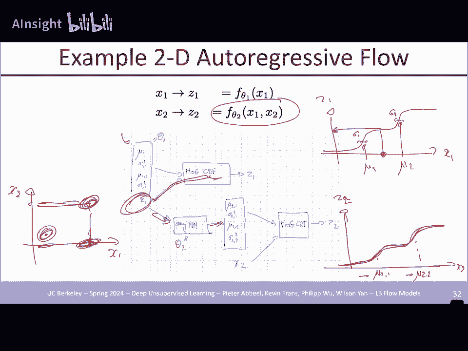

Z2，我们将看一下数学，我认为在下，一张幻灯片中，您所，问的就是它的样子，所以您有，一个井，您现在有两个术语，因为，有两个变量，将，是 Z1 Z2 有一个 变量 um，变换分量的变化。

uh 函数在该点的导数的对数，在顶部我用 Z 写它，在底部我用 f，Theta 1 和 F Theta 2 um 写它，但这，本质上是相同的 嗯，只是一个，不同的符号，嗯，F Theta 让它。

更明确地表明，你正在，从 X 学习一个函数，它变成了 嗯 Z，然后如果你像在顶部那样写它，它，更只是说哦，你，知道它就在任何地方 嗯 X 落在，zspace 上，这些是底部，这是，您通常自然使用的。

因为它包含您需要的所有信息，所以现在您有一个像，以前一样的术语，并且底部有一个，非常，相似的附加术语，那就是 如果将，这些序列的多个序列堆叠在一起，您将，有效地获得，这些变换项的多个项，因为。

这些项是变换建模，项，然后这里前面的项只是，最后一项，即，最后一项 Z 的密度 但是如果你，在一层上有更多的东西，你会得到很多这样的，总和。

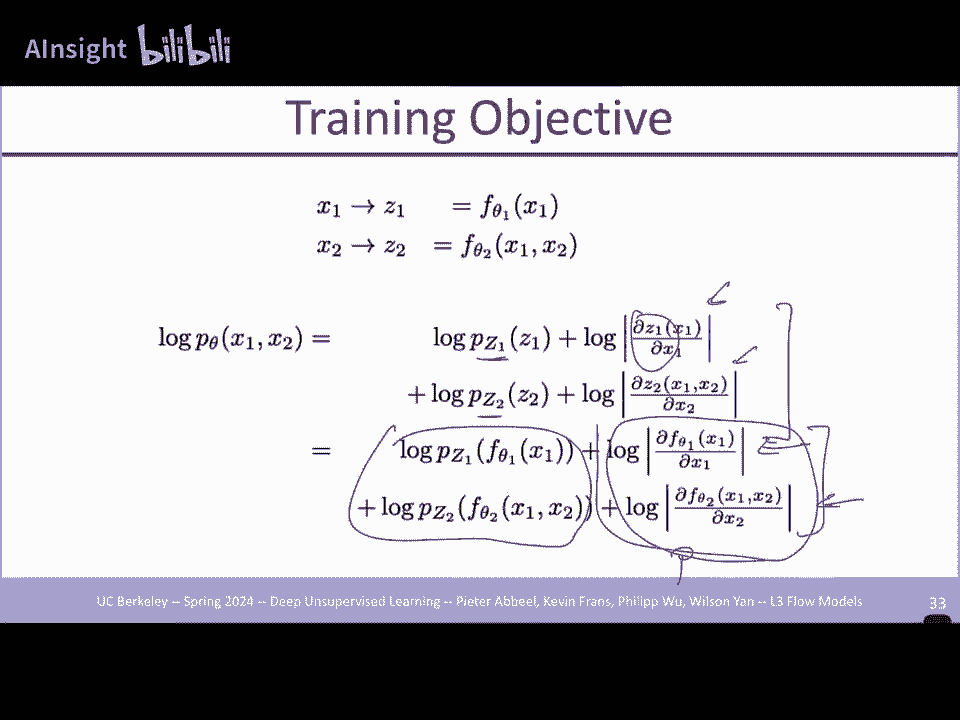

所以让我们看一些例子，嗯，这是我们的数据分布，好吧，颜色是不同的，只是为了让人们了解，数据映射到，右边的位置，它是一个分布，但它是，很自然地将其视为两个类，有，两个半月，但模型，无法访问某些。

分类标签或任何东西只是一种，可视化，让一些样本为，黄色，一些样本为，紫色，我们采用了均匀的基本分布，所以我们' 要映射到，统一上，我们使用 CDF，它是，从 X1 到 Z1 的五个高斯的混合，所以。

只有一层，我们不进行任何，堆叠或任何东西，只是 X1 到 Z1 的，混合 5 个高斯 CDF，然后 X2 也是，混合 5  GA 转到 Z2 嗯，但，有条件，因此，在训练之前参数以 X1 为条件。

这就是我们最终得到的，潜在空间，这里意味着 Z 空间，所以，Z1，Z2 的得分不会很好，因为均匀分布，到处都具有相等的质量，但我们' 在，这个映射中，我没有很好地使用该质量，很多质量都，丢失了。

然后当我们训练时，我们看到，这些样本分散开来，我们最终在这里得到这个东西，旁边的这个东西就是，嗯，X 空间中的密度，所以你可以，看到它实际上很好地模拟了 X 空间中的密度，所以在某种意义上，我认为这。

非常令人惊讶和有趣，因为，这只是一件事，就像我们没有做的一层一样。 甚至没有堆叠任何，层，我们模拟了两个卫星，问题，这是一种复杂的，配置，如果我能给出一点，颜色和主观意见，当，我看到这个时。

我们会非常干净地变成制服 兴奋，我很，失望，我会说为什么我也感到，失望，我失望的原因，是，因为一些黄色点，非常接近右侧的一些紫色，点，这意味着，当我采样时有极端的敏感性 在，均匀空间中，并且靠近该。

边界的样本最终可能会因我采样的，一个小扰动而发生很大变化，这通常适用于，嵌入空间，这通常，对于嵌入空间来说不是正确的事情，您想要的，东西是附近的东西 实际上，代表了原始空间中类似的事物。

但在这里你得到了，非常接近的点，其中一个在，一个月球上，另一个在另一个，月球上，之间有一个间隙，中间没有任何数据，它是一个空的空间 但现在它们是如此，接近，你可能会说，嘿，你刚刚采取了错误的事情。

为什么你要，采用统一的，这显然是两个，簇，你应该这样做，你知道，两个高斯的混合作为基本，分布，然后你就会有，一个 更干净的解决方案我同意，这绝对是嗯，会清理它的，但是你会，提出一些挑战，比如。

你需要多少个甘成分等等，你开始在，嗯超参数方面遇到很多问题 你需要，选择正确的方法，而不是针对两个，卫星，很明显，你知道两个 g 的混合的基础分布，是一个很好的基础分布，而不是统一的，但一般来说，你。

在高维度，中没有可见性 数据集，所以你最终，可以得到这样的东西，因为，它只是完成它，我们认为，它没有表现力，实际上它很有，表现力，它只是完成它，它，很好地优化了目标，我，认为我们最终得到了。

实际上的东西 就嵌入空间而言不是那么好，所以我们，仍然面临着，为 Z 设计一个嵌入空间的问题，这，对于我们的数据来说是自然的，所以我们，落在了一个好位置，这有点，不幸，我们会 仍然需要做，这样的努力。

如果你做了这样的努力，那么，也许事情会很好，但是你，希望模型可能，不需要你如此仔细地设计你的嵌入，空间，你的嵌入空间混合物中甚至有什么可用的，高斯和均匀的，其他一些东西你没有那么多，选择所以这有点棘手。

我会，说嗯这是另一个这里是嗯一个，流嗯从这个，具有三个簇的面密度，再次均匀它 钉住它，它知道如何对密度进行建模，因此，如果您关心的是一个，非常好的密度模型，您，实际上可能会很高兴，但如果您关心，嵌入。

在这种情况下您可能不会那么，高兴，让我，稍微推迟一下问题 但我。

看到了你的手，或者实际上我们在，2D 的最后一张幻灯片上，是的，让我们现在做这个，问题，这样我就明白你的意思，即，它不像那么自信，有很多歧义，所以如果你，考虑从 0 到 0 的置信度，这里有很多 0。

5 的情况，因为它非常接近，这两个不同类之间的边界，但你真的能，知道这完全归因于，你正确选择的，五个甘斯的表示吗？ 知道这，只是它没有以最，优化的方式进行训练，你怎么能将它精确定位到，表示理解你。

会产生很多问题很多，东西彼此接近但就像，你怎么知道它是创造这个，对于一个人来说，这个问题很好，我会说这是非常，主观的评论，所以，对为什么我不喜欢，它们着陆在一起持保留态度，但，关于你的具体。

问题的原因你知道为什么我，认为这里的问题是 选择，pz 是因为如果你选择 pz，是，均匀的，是的，你的分布显然，有两个，集群，如果你是 N Net，你的流具有，足够的表现力，它会使其，均匀。

因为这将得分，最高，所以你' 正在优化一个，黑色的目标，如果你把它变成制服，它会得分最高，所以，如果你有足够的表现力，你现在就会把，它变成制服，我可能会说，也许，流程不应该那么富有表现力，我。

让它不那么富有表现力 无法将，其变成制服，我可以用，这种方式解决它，这可能是可能的，嗯，你可以说制服是一个糟糕的，选择，我需要其他东西，但，选择有点像没有那么，多，所以它是 与。

当今许多最成功的模型相反，你说，模型越大，表现力越强，它就会，做得越好，在这里，我们几乎是说，哦，好吧，我们，应该小心表达 这是，因为它会得到这些嵌入，这些嵌入，可能不是我们想要的，我认为这与。

我们现在可以扩大规模并，获得更好，结果的叙述相反，也许几年后我们，再次看到这里，我们' 我正在讲一个，故事，我就像嘿，你知道，两年前我说过流量似乎不会去，任何地方，但现在你看，你知道，完全改变了。

他们是，每个人都使用的模型，这是可能的，我认为，至少理解一下是件好事，我们现在遇到的限制，因为如果它们将成为，我们可能必须认真思考，如何解决这些直观上，不，令人满意的事情，让我们说是的，想想。

实际创建的东西，比如结构，空间是，流量，和密度的特定组合，或者是其中之一，如果你想在其中包含一些内容，比如是的，你会专注于你的，密度吗，是的，嗯，我们如何引入更多的归纳，偏置来有效地获得更好的嵌入。

对吗？ 认为一件事，确实是，如果您认为您的数据是多模态的，那么您确实会改变您的最终，分布，使其远离统一，可能会，得到更多多模态的东西，因为这样您就不会强迫，那些不属于紧密在一起的东西靠近在一起。

另一个 你，做的事情我想我们会在更高的维度中看到这一点，你看到了我们如何本质上采用，X1 并让它参与，我们用于 X2 的 CDF 的计算，现在你知道更高维度的空间，你可以在其中进行选择。

架构是否应该左上角像素，对右下角像素 CDF 做出贡献，或者是否应该做出贡献，或者它是否应该做出贡献，是否，应该通过，组合，许多像素信息的东西进行引导，然后最终得到，一些不会使其过多。

确定的东西 仍然可以了解到它可能，更多地依赖于其他像素，所以我，认为这里的连接模式，是你可以放置大量，归纳偏差的地方，这也是，人们在更高，维度上所做的事情，我再次认为它的，特殊之处 流以及为什么我。

像我说的那样做一些负面的事情为什么我认为，它们确实给出了令人惊讶的良好结果，是任何，给定块中的连接模式就是它本来的样子，但然后在下一个，块中你可以在，一个块中将其切换你可以拥有 顶部像素，影响底部像素。

下一个，块您知道底部像素，有效影响顶部像素您，可以以任何您想要的方式交替使用，您可以向左向右顶部底部嗯，您知道在某种意义上的超分辨率，就像您知道一个像素分散在像素中一样，展开然后填写细节，你。

可以在不同的块中做出所有这些选择，构图，仍然是一个流程，这就是，这些块的选择是，你放入的归纳偏差，但也给，你一种非常不同的，表现力 与我们，在今天的上半场讲座中看到的 autog 模型相比。

我们涵盖了流，模型 1D 2D 的基础，有时，主要的大问题是如何，在更高的维度中表示这些流，人们有哪些归纳偏差。

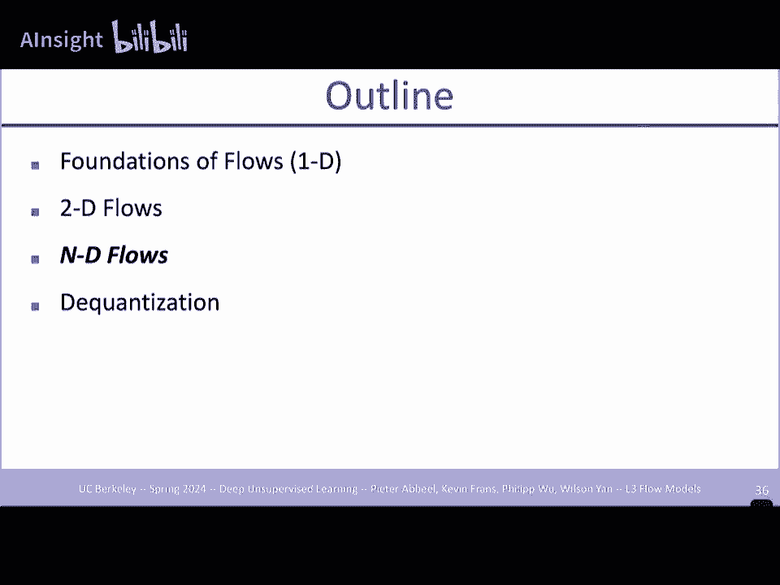

成功引入，所以我们现在要对高维数据进行建模，在我们的例子中，因为我们正在，研究流模型 x 和 z 将具有，相同的维度我说高，维两侧的维度相同。

否则我们无法在两者之间反转，两个好的，嗯，自动攻击流和，逆自动攻击流将首先介绍，嗯，它们将，是你知道一个又一个变量，这是，自动攻击的定义，但之后还有其他人，会介绍，不要，那样对待事情。

所以 自动攻击流嗯，这，有点像从Bas网络采样，你知道你有一个链式法则，你，先X1，然后X2，然后X3，同样的事情，发生在自动攻击流中，你在从Z2和X1，反转X2期间从Z1得到X1。

我们在 2D 中看到了这个例子，你，可以将其推广到 3D，现在，这也取决于 x2 嗯，所以这就是。

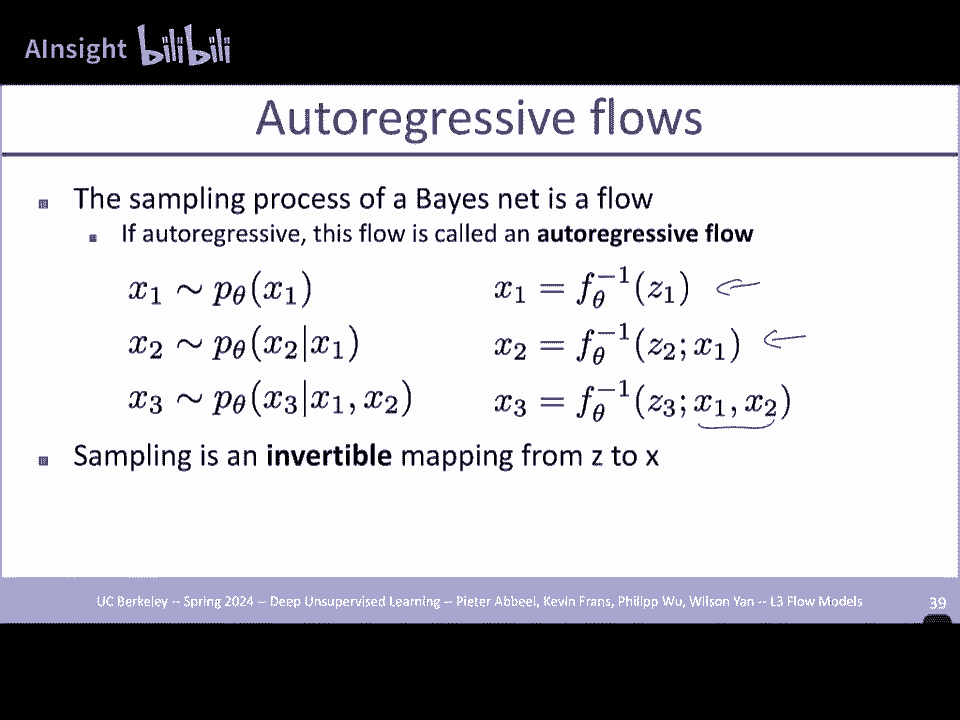

设置，嗯如何适应，它们，这是我们一直以来的目标，我们已经将日志放在，它前面了，我们' 我们将记录，第一项的对数，即 pz，然后，记录，第二项的行列式的绝对值的对数，嗯，如果您，有更高维度的映射。

那么这是一般版本，因为，自动攻击中的所有内容仍然是，ond 映射 生成的每个变量，实际上只是，一维项的总和，因此 Z 是以这种方式生成的，这是我们在 2D 中看到的内容的概括，这就是我们回去的方式。

我喜欢画，这样的图： 它对应于嗯，与，我们上周看到的图片类似，嗯X1，通过F Theta变成，Z1然后X1和X2通过原则，上F Theta 2我们可以将其全部变成一个，大块。

称为所有F Theta BEC Z2我们知道，这里的箭头 通常可能非常复杂，这里的往往，非常简单，因为它需要，可逆，所以如果我对可逆与不可逆使用不同的颜色，这是一个可逆过程，这是一个可逆过程，这。

是一个可逆过程，但，紫色的是 这里的这个或，这里的这个或这里的这个本质上是，参数化 F Theta 的附加方法，作为一种，思考它的方式，这些紫色箭头根本，不必是可逆的，你，不需要进去 那些。

更复杂的事情可能会发生逆转，在。

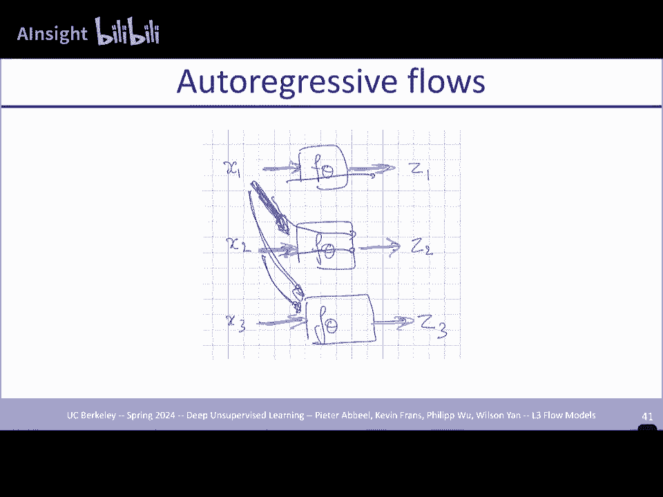

前面的沉浸自动流动中，我有一个关于，早些时候的问题，嗯，如果，X1，嗯，一种方式认为，你只需使，所有曾经是 F Theta F，Theta 逆的东西，一切都在哪里 F。

Theta 逆你使 f Theta 但我们，最终在采样时 X1，成为 Z2 Z1 和 X3 Z1 Z2 Z3 的 Z1 X2 的函数。

所以我认为，看图片更容易看到。

接下来的两个，彼此 左边的原始自动流，我们有这些箭头，它们可以进行更，复杂的，调节，它们被，右边的红色箭头取代，所以这就是，区别，不是在，X1 中喂食，而是在 Z1 中喂食，而不是在。

X2 中喂食 在 Z2 等中，因为，X1 Z1 之间的映射是可逆，信息，内容方面与，您在相同信息中拟合的内容是相同的，但在计算方面它是，不同的，因为现在在 ifaf 中，一旦您拥有所有内容，您就可以。

并行地对，所有内容进行有效采样 你可以对 z 进行，所有并行采样，嗯，当，你反转时，你可以直接，获取所有 XI，你不需要，等待 X1 生成 X2 等等，所以，采样速度很快，这里的前向。

映射是 快速意味着可，并行化，你知道这一切都是。

并行的，所以把它放在底部，所以自动攻击，流快速评估快速训练慢速，采样相反相反，实际上有一些模型可以做到，两全其美你可能想知道这本质上是如何。

完成的，为什么，训练为什么这么慢？你本质上是把它变成一个，RNN，从 X1 到 Z1，然后必须对其进行处理以获得 Z2，然后到达 Z3 等等，嗯，这，会使过程，变慢，如果你 本质上有一个。

你设置的相应函数，但你只需，更改箭头，这样它们本质上是，相同的，但，如果你首先训练一个，自动攻击流，你只需改变周围的箭头，这样你训练它。

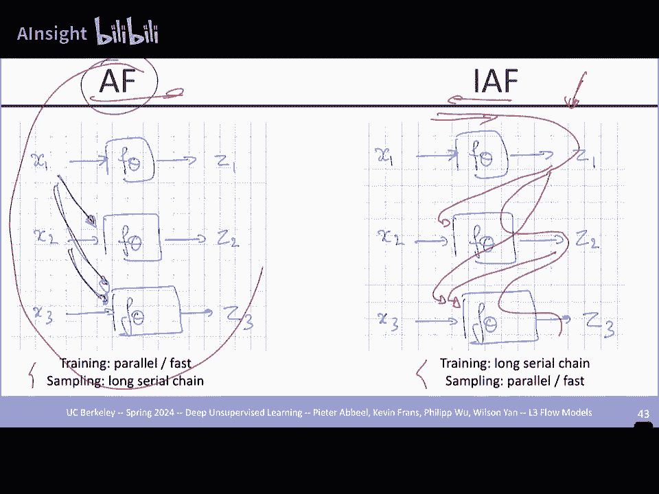

很快，然后你从中采样，不幸的是 会有点，慢，但是你从中采样，然后，训练然后，采样，然后使用这些样本来，训练这个样本，你可能会说这，很烦人，因为现在我要训练那个训练速度很，慢的样本，结果如​​果，你看。

细节，因为这些都是样本，如果你，保留内部激活，你，实际上可以，如果你，正确设置架构，并且你，必须以非常精确的方式做出一些选择，你，实际上可以，快速训练，所以这是一种方式 训练 if。

fast 本质上就像，从自动攻击流中提取它一样，你可以，快速训练它，然后当你完成，训练时，你可以快速采样，所以如果，你，看看这里的这些模型，它们利用了，这个想法 um 并行波网 如果你，认为你本质上将。

快速可训练的自攻击流提炼，成可逆的逆自攻击，流，并且你通过使用保持激活的样本来做到这一点，这会为，你提供正确的缺失信息，因为。

I 的训练缓慢的原因是 因为，你没有，疾病，但是如果，你生成的，样本已经有疾病，那么如果它是，多个堆栈的流，那么你还会，有一些 Z 之间的 Z 以及，之间的每个块，所以如果你同时拥有 Z和A。

然后你可以训练你的如果非常快，呃所以两全其美嗯训练AF，快速然后从AF保持激活中采样，特别是疾病如果它只是一个，一堆的事情只是你保持疾病，如果它是多个块你可能 保持，中间的那些，然后嗯，如果你有。

流的自动调整或流的逆自动调整，你可以天真地训练快速和快速采样，这，最终会成为一个非常深的网络，因为你需要首先生成 Z1，然后，Z2，然后 Z3 即使只有一个流块也，可能非常深，但是嗯，你有，大量的参数。

但，当然你可以进行参数共享，就像我们对自动攻击模型所做的那样，你设置相同的神经网络来完成，这些映射，嗯，这样 使用，RNN使用掩码，你可以得到一个，合理大小的网络来为你做这件事。

好吧，我们还能做什么，自动攻击，显然是一种方法，它给出了一些，好的结果，嗯，那种，在mapd上流动的东西是 真正的 MVP 论文。

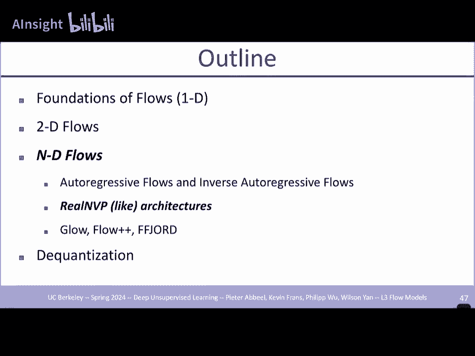

他们将进行，变换，在一个可逆映射中，同时执行许多变量，同时对许多 Z 进行处理，就像必须保留，从 X 到 Z 的每个区间的概率质量一样 对于 1D，我们现在需要，保留，某个 X 周围每个体积的概率质量。

查看该，体积在 Z 空间中基本上映射到的位置，确保该体积中存在相同数量的概率质量，因此，为了补偿，现在有这个，补偿项，雅可比矩阵 DZ，DX 的行列式，如果它是 1D，则该矩阵只是一个 1 乘。

一的矩阵，即 DZ DX，如果它是对，角 um 情况，其中 um，实际上每个都，独立映射，那么行列式，只是 的乘积 对角线上的条目，所以这又就像，沿着每个轴重新缩放，轴 X1 到。

Z1 X2 到 Z2 X3 到 Z3 等等，所以对于，1D 和对角线，很容易理解，这是正确的做法，我们怎么知道 它对于任意的方式都是正确的，我喜欢认为它是，从 X 到 Z 的任何类型的方阵。

所以我们可以说我有，因为，局部这都是线性的，所以这就是，如果我有 z = a * 时我们所看到的 X 我，也可以说等于 U 西格玛 V 转置，X 奇异值分解，这只是 xace 的旋转 我。

不需要担心体积保存，一切都保持不变 我只是，旋转一切包含的东西，嗯这是最后的旋转 或者我什至，可以再次将其移到另一侧，无需担心，大规模保存的可能性，一切都，在这里发生，所以我唯一需要，担心的是中间的。

我只，需要取元素的乘积，对角线，很好，如果我取，对角线条目的乘积，它只有，Sigma 的对角线条目，它与，a 的行列式相同，所以也许这就是您要，计算该行列式的方式，也许您可​​以，计算它 以不同的方式。

我们还没有，讨论如何获得行列式，但是从直觉上来说，这就是为什么，行列式在正确的，坐标空间中有意义，一切都是，对角线无论如何，对角线元素的乘积就是你所。

需要的好吧嗯 所以我们对变量，公式 P Theta X 的更改是 p of f Theta of X （即，z），然后乘以，行列式行列式，方法是通过，周围有绝对值的方式来，确保它是一个正数，我们。

与 um 相乘，这在之前也是如此，你还必须考虑你，不希望最终得到负，密度，这将成为一个，训练，目标，因此如果我们将，x 向量映射到 Z 向量，则要求，该映射是可逆的，因此 F。

Theta 有 为了可逆地，从 Z 返回到，X，这可能会对其施加一些限制，我们将讨论，现在行列式的附加要求必须易于，计算，因为如果我们无法，轻松计算该行列式，那么，我们的训练将非常昂贵，过程。

因为我们需要访问，该行列式才能进行训练，所以您将要开始，考虑您知道什么样的，映射，其中所有，局部线性近似都有，方便的行列式来，计算 如果行列式，不容易计算，它仍然是一个流，只是一个你无法真正训练的流。

你没有计算方法来，训练它，而且一般来说，计算终止符实际上非常昂贵，所以对于一般的矩阵 um 类型，最坏的情况本质上是，你需要做一些大致，相当于 SVD 的事情，这是一项相当，多的工作，然后将。

对角线元素相乘，嗯，你不必完全，这样做，嗯，事实证明，如果 矩阵，是下三角矩阵，对角线以上的所有内容都为零，它也只是，对角线元素的乘积，所以，这就是我们要考虑的，确定，很容易计算，意味着上三角形全为零。

或更多 零嗯，所以，任何具有该属性的东西都可以，方便地与。

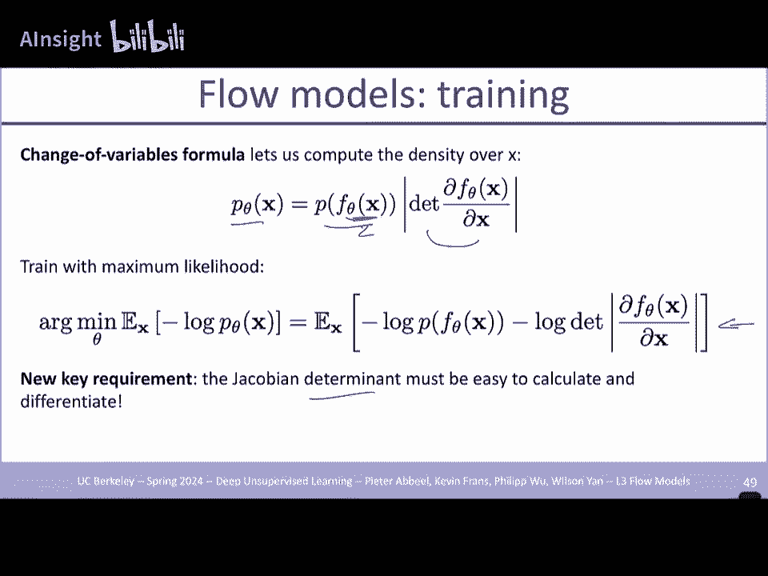

嗯一起使用，所以你会看到很多弹出的信息，请，记住，即使我们，对每个映射进行限制以使其，方便、可逆且易于，行列式，我们也可以将它们堆叠在一起，我们已经看到，使用流的 autog。

可以让我们更改堆栈中的顺序，并且，比上次，模型的其他资源更具表现力，即使在每个堆栈中，我们，在这里的问题都受到更多限制，是的，所以我理解 toity 你的矩阵，是一个矩阵上三角或下三角。

你怎么能保证这种情况会发生，这样你就，可以很容易地确定它，这样它就，不会变得计算，成本太高，或者你最终不会，知道有一个，单一的东西是的，它是 一个很好的问题，我们如何确保这个属性成立，这正是我们将。

在接下来的几张幻灯片中讨论的内容，所以这是一个，完美的问题，这并不容易，我的意思是，有些人已经找到了一些方法来，做到这一点，但它在术语上仍然具有限制性，你在这里可以做什么和不能，做什么的问题。

因为你基本上，没有处理任何降维问题，是的，这，就像我认为这是一个很好的问题，因为你受到你，可以，表达的内容的限制，是不是通过制作，链条 足够长的时间，你仍然拥有，完整的表达能力，也许不是，我。

不知道这是一个有趣的，问题，然后从，那里开始的问题就变成了如果链条很，长，它实际上必须有多长，以及它是否在以下方面变得不切实际：计算，但可能是在，梯度传播方面，因为，网络越深，梯度传播越困难，因此。

可能会有其他考虑因素，是的，我没有准确的，答案，但我只是将你的，问题改写为确实 很好的。

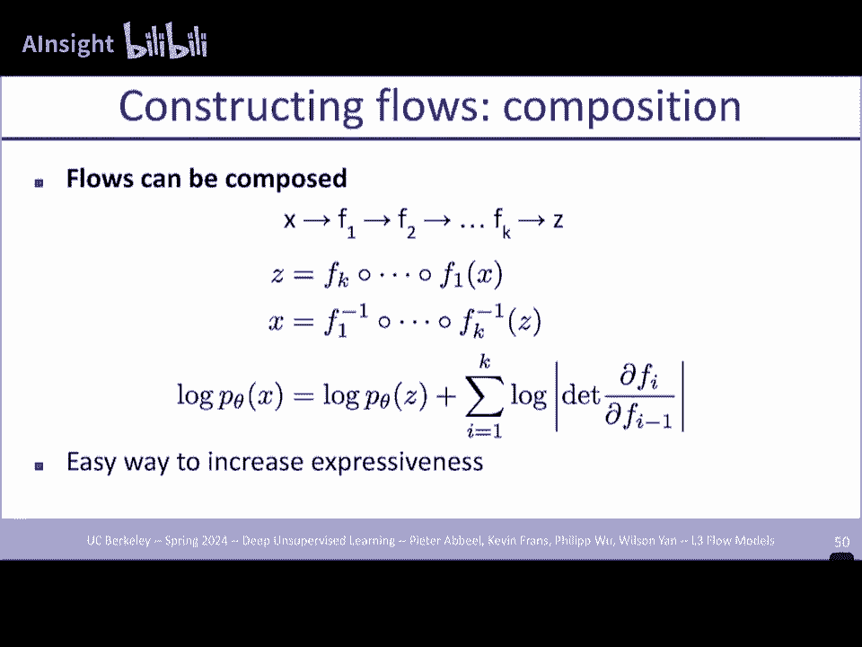

问题，所以我们能做什么我们可以做 apine 流，非常简单只是，x 和 z 之间的线性 um 线性连接所以一个，块只是 xal a z 加 b 或，zal ax 加 b 取决于你如何。

设置雅可比行列式是 a 或 a 的倒数，取决于你设置的方向，你需要计算 a 的 DET 终点，所以也许 a 应该是下三角以使，这变得容易，这在某种意义上是最大的，表达能力，你可以得到嗯，而不会变得非常。

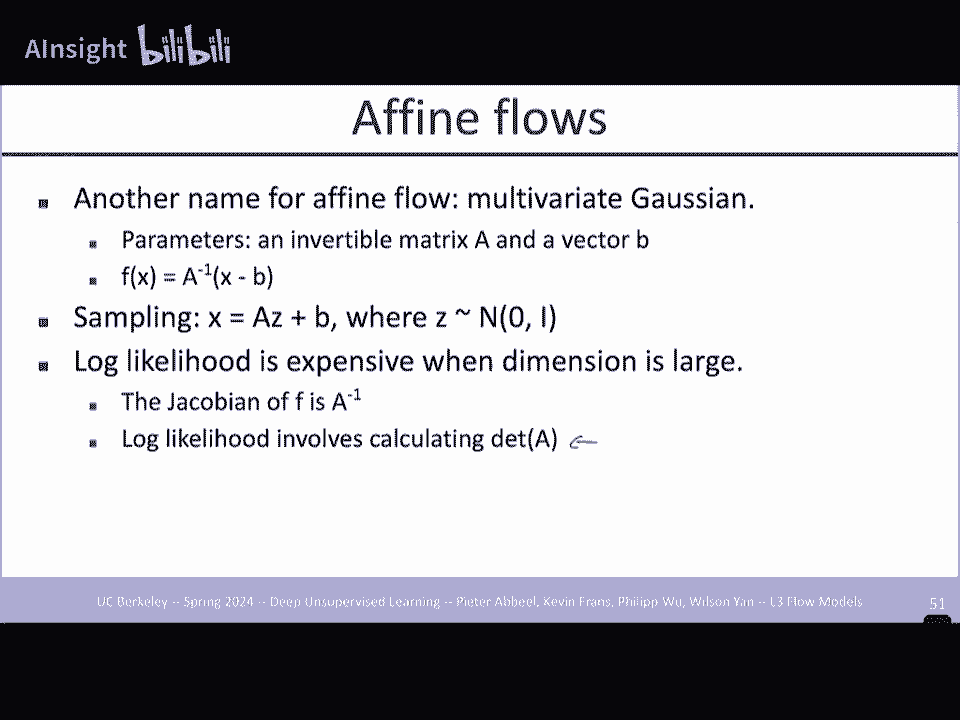

昂贵地处理，元素 流程，本质上可以使函数作为一个，整体只是按元素，计算，这样每个元素都会自行，转换到下一层哎呀，表分开了，小心，它不会让，你，固定，也许不是为了倾斜，尽管这里有更多的表空间。

现在你可能会说，为什么对角线，是一件很棒的事情，单独使用对角线，你会失去，关于它的一切，因为它是一个高维数据，集，其中你有，连接维度的模式，但也许你，有一个层 这就是 aine 后面是一个，对角线的层。

它引入了，一些非线性，然后你，再次进行 aine 等等，这就是。

这里的想法，真正的 MVP 工作线，本质上可以将其视为几乎，像自动回归的块版本，所以它，说我的前一半 Z 变量我只是，传递 X，原则上对它们不做任何事情，你可能可以在，那里放一些其他东西。

但为了简单起见，对于这一层，你可以将，许多这样的堆栈放在一起，但，这个你只需传递它 然后，后半部分你可以以，任何你想要的方式处理 X 的前半部分，因为，当你反转时你会得到它，所以。

你在这种情况下将它变成嗯我认为，在这种情况下这个点通常是一个，元素明智的乘积，所以你把它变成，一个 L 你知道本质上一个对角，矩阵是思考它的方式，但是当你这样做时，你。

可以用 AIS 的前半部分做任何你想要的非线性，然后将它的元素，与 后半部分，这样你就可以通过，这种方式获得变量的非线性变换，并且很容易，反转，因为一旦你有了 Z 轴，一旦，你有了 AIS 的前半部分。

就很容易回到轴的前半部分，一旦你在这里有了这个，它只是，一个对角线乘以你就可以计算这个，你可以，解决这个问题，得到其他的X，通过本质上把它带到，另一边，然后除以这个，你就可以。

开始了，如果 你把它拼出来，归根结底就是雅可比矩阵，你只是，在前半部分传递东西，这是，一个雅可比矩阵，它是恒等式，那么，变量的前半部分，影响后半部分的方式，就是，通过，这里的这个东西，这是 相当，复杂。

但它落在，这里，然后后半部分，影响自身的方式，就是乘以这个，所以它，非常简单，只是，那边的对角线，所以我们看到的是，嗯，你只是，有一个对角线取，对角线所有内容的乘积 上面是零。

你可以非常有效地计算行列式。

真正的 MVP 实际上得到了一些，相当好的，结果，关键是，耦合层确实可以让你在，从前半部分到后半部分的耦合轴上放置任何类型的神经网络，记住 在这些流模型中，当，您将它们堆叠在一起时，当每个。

组件都是一个流时，堆叠版本，序列在一起仍然是一个流，因此，前半部分后半部分不必与下一个，保持相同，您可以使用不同的顺序进行下一个，采用不同的排序，所以，并不是说存在这种特定的排序，效应，必须。

在整个计算过程中持续存在，这是由 2017 年生成，模型生成的一些面孔，这些面孔都非常好但非常，有前途 我认为这是，卧室，这是嗯建筑物，然后我，猜这是某种，类型或其他类型的户外场景，嗯，当时相当不错。

其中。

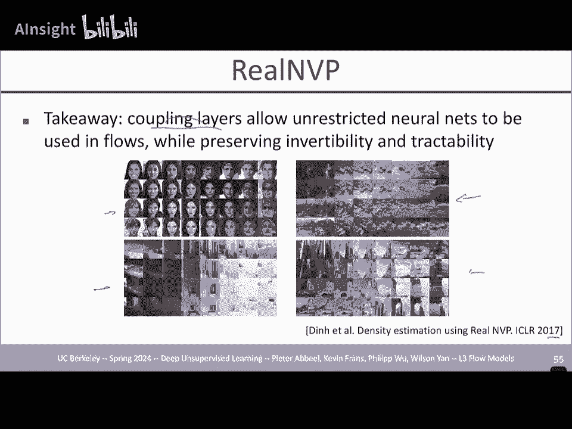

有一些细节，按通道数计算，为 32 x 32，即，三个 RGB 图像嗯， 那么有一个，问题，你如何对这些变量进行排序，以便你可以以，更复杂的方式进行调节，前半部分是什么，后半部分是什么，嗯，这是用。

嗯单词表示的布局，但本质上是在。

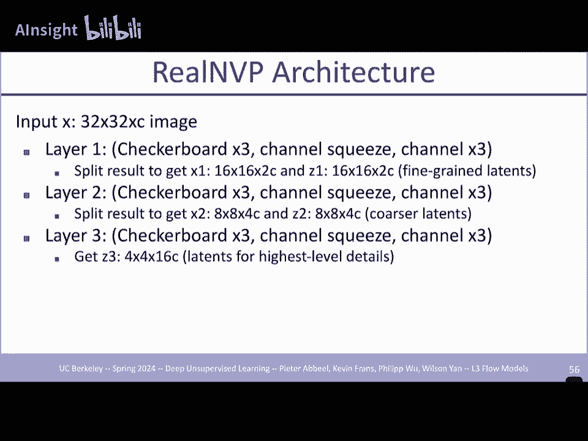

图片中 一些条件嗯做，棋盘模式，你，交替，所以一和五，四和，八在前半部分，然后两个，2 6 3和七在后半部分，感觉很像一个扩散模型，你得到的 有些人，首先感觉到二次采样的版本，然后你。

想办法获得更高分辨率的，版本，嗯其他版本原则上可以，从上到下，左右等等，这，并不常见，然后在某些时候，你有效地开始将这些，东西变成通道 你只要给他们，意思，你就说好吧，现在我认为，这是，这里的频道之一。

然后，你可以浏览，分辨率较低的图像，但同样，这只是，你如何分组的想象，变量，但这是一种赋予，结构的方法，您本质上是，说现在有一个通道维度，代表左上角或，左上角，然后是，右上角，左下角，右下角。

您无法减少，维度，因为这是不，可逆的 因此，每当您减少，两倍时，您的通道就会增加，两倍或 2x 两倍减少 4X，通道增加，嗯，您也可以在，您知道的一个位置内做这些事情，只需在那里做一些。

非常接近元素的事情两次向前，运行 这也将是一个非常便宜的雅，可比行列式，可以决定。

嗯好与坏的分区，所以，棋盘通道挤压棋盘上的通道，给你这个，这是相当不错的，就像上，半部下半部左半部一样 并没有，真正给出你正在寻找的效果，从某种意义上说，这似乎很神奇，你可以做到这一点，你可以在。

任何地方切换顺序，但它在，某种程度上是受到 Bas Nets 的启发，但每个块都像一个 Bas Nets。

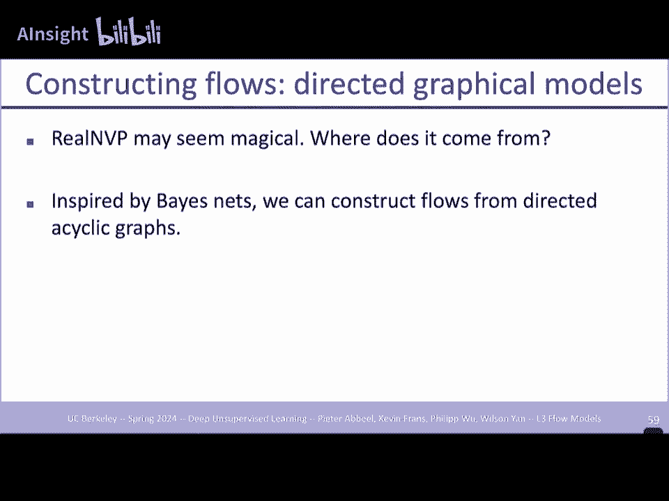

那么下一个块可能会是不同的结构，嗯，我想我想跳过幻灯片。

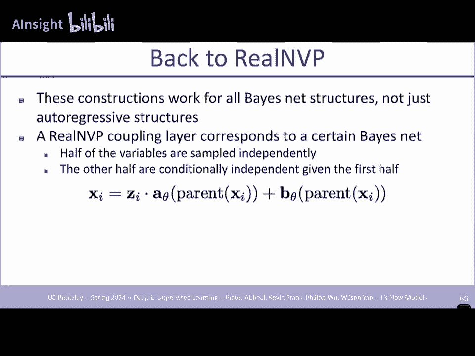

但 pdf 版本保留了所有内容，所以真正的，MVP 和模型的 autog，这些是，对于流程来说效果很好的两个主要想法，但没有一个 它工作得非常，好，然后出现了发光流 Plus+ 和 F，纸，使事情。

与当时其他类型的最佳模型一样工作是的。

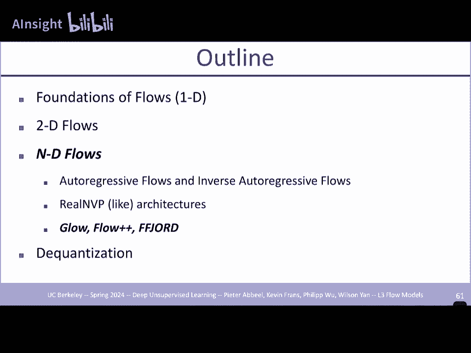

所以你在这里谈论这张幻灯片，是，的，所以我们需要从采样，正如你所说，前半部分的 Z 到 X，当然，它的恒等映射，对于后半部分来说是微不足道的，然后你将其插入，这里，这会给你 s Theta。

s Theta 顺便说一下，它是一个对角矩阵，所以很容易处理，所以 这，本质上，只是 D over2 方程一个方程，因为你知道每个变量，你可以，直接求解每个，变量，因为它，基本上看起来像这样，这些。

是这里的区别，等于然后我将，画它 作为对角，矩阵，s 在这里，这是 s，这是，您要求解的 X，这，是 z，这是加上 T，这也是，已知的，所以您只需通过一些方法求解 x 的这个非常，简单的线性系统。

我没有谈论的反演中的事情，有时可能有点棘手，因为，想象一下，您正在元素层中的，某个地方使用累积密度函数，并且您正在，使用您知道的物流混合物 或者，事实证明，通过混合物流的前向路径，非常简单，但是后向。

传递，嗯，你可能需要做，更多的工作，所以有些函数是，可逆的，但需要一些工作，但，如果函数有时只是一维的，你愿意付出，代价，因为如果，它是一维反，函数的反转，你总是可以通过，二分搜索来完成它，你只是让。

你说好吧，我猜，我将得到的 X 是，在这个区间的某个地方，我只是，继续二分，直到找到，实际上与，我。

采样的 Z 相对应的那个，但是一旦你是更高，维度的，你就不能进行二分，搜索，所以你需要真正构建，它以确保 逆是，有效的几个问题是的，有人尝试过随机，分区好问题，嗯我的预感人们尝试过它。

效果不是很好但我不能给你确凿的，事实，嗯现在它可能比一些，非常糟糕的分区，顺序工作得更好 嗯，但我认为，某种意义上的概念是进行本地，计算，并从那里生成，更深的通道维度，并以，信心倾向于组织。

信息如何处理的方式工作，并以，某种方式以，比原始更有意义的方式组合在一起，我认为输入给出了最好的呃，结果是，的，你我的意思是基本上是的，R，运行多次我猜训练运行，然后尝试找到哪些订单环，往往工作得更好。

然后学习一个，我没有见过的模型 人们，不这样做，所以正如我所说的，um 发光流 Plus+ f 是，真正使 um 流模型，以及当时其他最好的 um 方法发挥作用的方法，顺便说一句。

flow plus plus，paper 是我们在伯克利所做的一个，Jonathan H 在 2019 年做了这个，然后，在 2020 年他做了扩散模型，然后。

他让他的 flow Plus+ 论文有点过时了，我想暂时是，因为融合模型接管了。

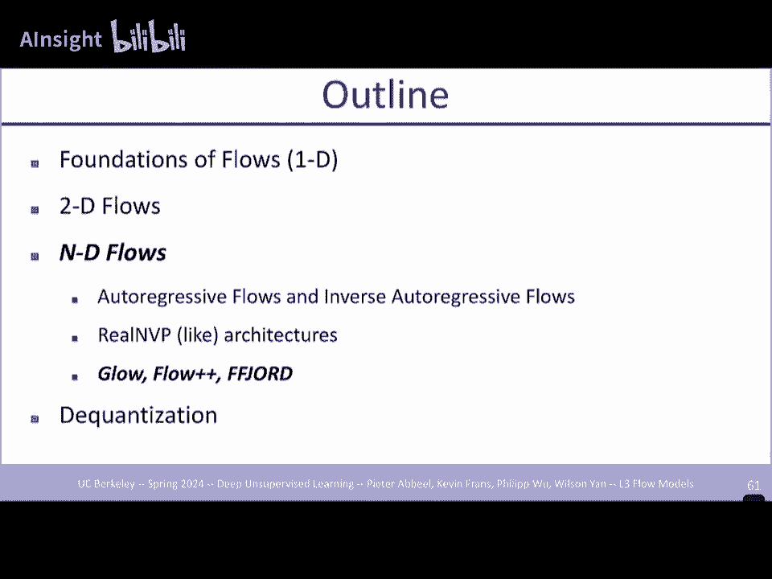

嗯，但你知道你不会注意到未来的事情，所以当我们考虑，x 和 z 之间的耦合变换时，这，是在相反的方向上看，嗯，你不知何故有这样的排序，方面，它可能是块，它，可能是更精细的排序，呃，以，确保事情是。

invertible um 你可以做什么以及，BIOS 在 Flow Plus+ 论文中所做的就是，使用更复杂的非线性耦合，层，所以在你完成线性，变换之后，你可以使用 cdfs 和。

逆 cdfs 来混合 gion 或，Logistics，给你带来的不仅仅是什么 你从，之前使用的东西中得到了，嗯，没有纸质的神经，重要性采样，他们使用了分段，线性和二次函数，这也有所，帮助。

所以本质上在，耦合层中投入更多是我们所做的一件事，所以。

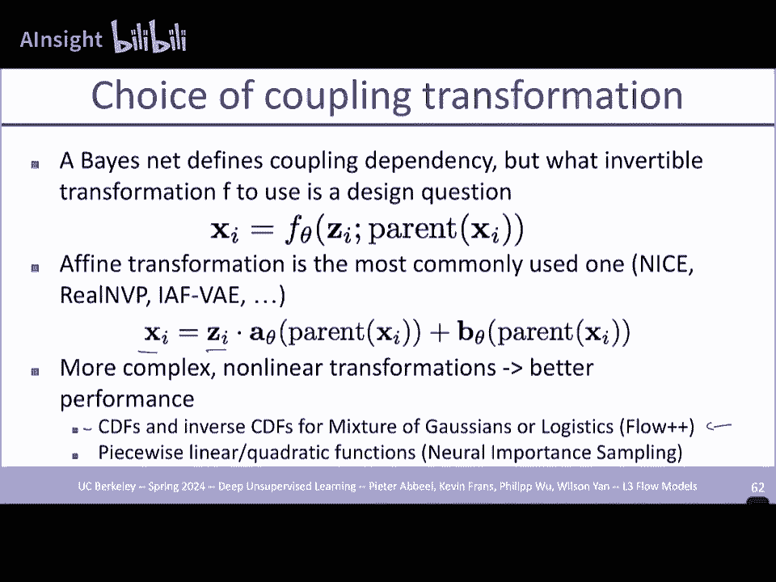

混合了，物流嗯，然后是自我关注，吧 可以做任何事情的组件，你可以处理一些东西，然后将，其乘以其他变量，你可以进行任何神经网络，转换的部分，嗯，我们是第一个，将自我关注引入其中的人，这也有很大帮助。

所以什么，你看到这里，是我们的完整模型，我们达到了，每暗淡 3。65 位，这是，我们尝试过的最好的压缩级别，如果我们从神经网络中删除自注意力，我们会做得更糟，如果我们采用 Aline 耦合而。

不是 物流的混合，我们做得，更糟，如果我们不进行去，量化，我，很快就会谈到，我们会做得更糟，所以，如果你不这样做，那是最糟糕的事情，但是这三者都是，获得最好的，结果真的很重要，在某个地方有一个问题。

是的，回去，当然，是的。

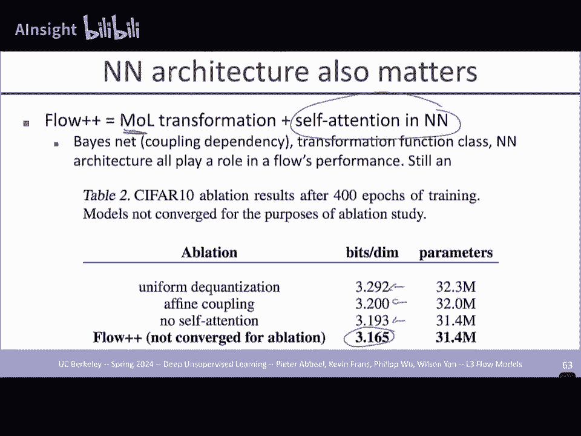

但我想，其中一些，事情是骗人的，我知道我们正在谈论，所以你，代表了他们的发行版，不是它，而是他们，描述这些，项目，嗯，所以当我们谈论，我们正在学习的流函数时，我想象该函数，不是项目本身，而是。

描述项目的他们，我，想当我们像分发谈话一样描述时，我是这样的观点，因此，请记住，您知道，这些函数的内容是分布，当您有了这些方程时，您是否，像第一个一样受到限制，所以这是一个很好的问题，如何做，并且。

有两种方法可以考虑，您的流动模型 重新强调一种，思考方式是，在某种意义上，我们，正在选择，X 上分布的参数，但以一种非常，特殊的方式，但是在，我们使用 CDF 作为，流程的情况下，我们正在做完全相同。

的事情 嗯，所以这是一种观点，如果我们不使用 CDF 作为我们的流程，那么，就不容易看到并行性，因此，对于更通用的版本，更容易，将其视为我需要一个，可逆的变换，有效地，计算，它不需要是 CDF。

它可以是，但它不需要是，所以在这种情况下，没有这样的，直接对应物，只是将其视为，分布的参数，这可能会让它变得更容易 以，这种方式思考这些模型，因为现在，你只是在想，好吧，我所做的。

就是将一个空间可逆变换，到另一个空间。

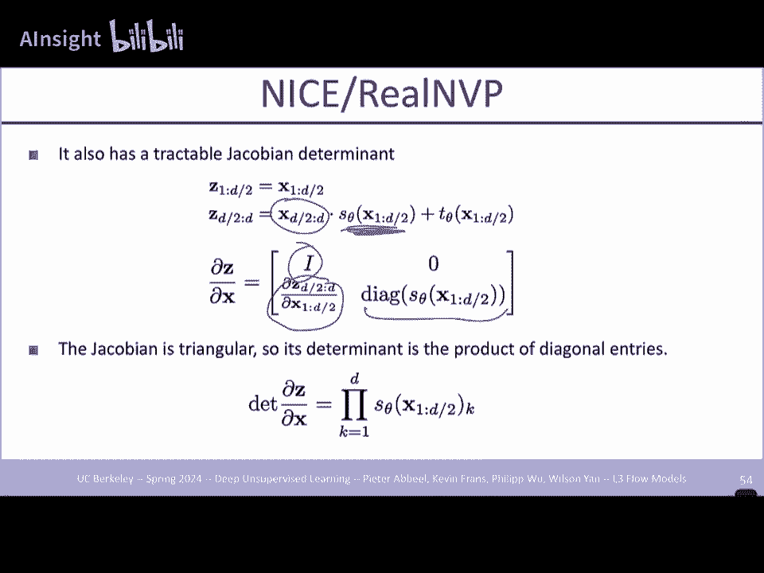

这就是我认为流模型是，最难，包装你的模型的方式。 至少对我来说。

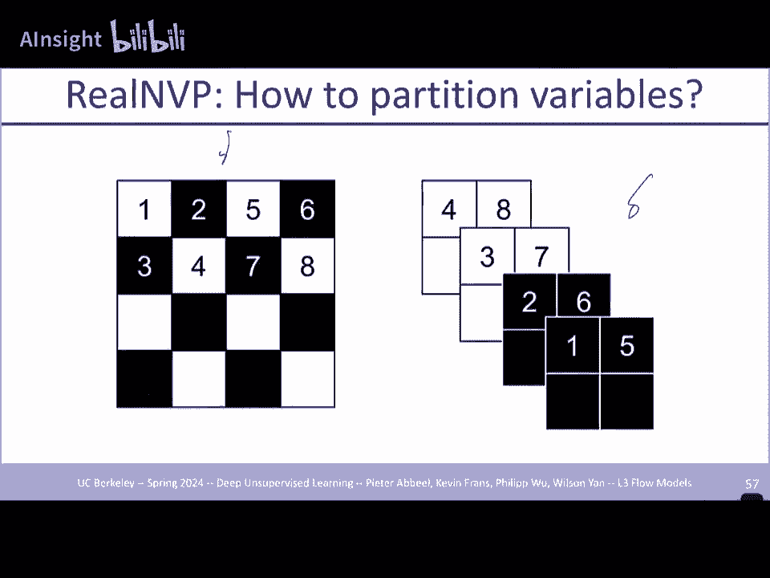

所以这也可能是为什么，在他们身上取得进展更困难的原因，因为这只是，我的意思是，当我第一次看到这些时，我就像我的反应一样，这些都没有道理，就像你确定他们吗，实际上做了他们所描述的事情，因为，它是如此复杂。

存在一些微妙之处，以至于很难，相信这件事实际上是，真实的，嗯，在你知道多次教它之后，甚至，上周回到它，我完全重新投入其中，我需要一周的时间来完全说服，自己这是真的，这，实际上确实是正确的，所以。

我并不感到惊讶，很多问题，突然出现，嗯，我感觉如果我在，课堂上第一次看到这个 时间，我每分钟都会有一个问题，或者，我没有问题，因为我不，知道发生了什么，所以是的，不要犹豫，问问题，其他讲座也是如此。

尤其是在这里 我认为这是，一件非常复杂的事情，所以然后嗯 Dirk kingma 和嗯，我。

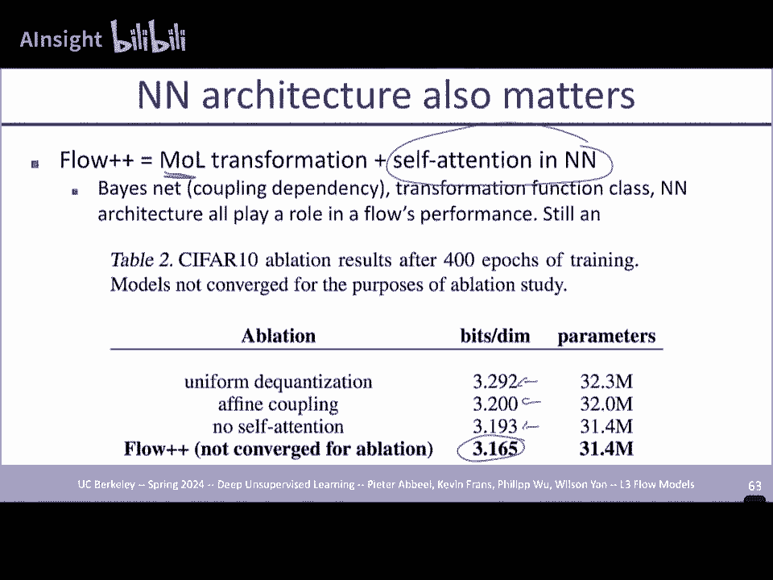

认为这是，开放人工智能的专业人士做了另一个版本，称为发光，他们引入的一个重要的东西是可逆的，如果你，熟悉 com Nets，你知道，它们以，3x3 或 5x5 7 x 7 的形式开始，但随后。

通道尺寸开始增加，通常你只需在，一个像素内有效地进行映射即可，现在是一个高通道维度像素，因此他们引入的一件大事是，参数化这些，一一卷积的可逆，以一种有趣的方式真正处理，本地发生的事情，更大规模的，训练。

他们构建它的方式，他们可以在更大的范围内进行训练 规模，这些结果变得像真实的一样，现在它是真实的人的真实面孔，非常令人惊奇，有一种将，流解释为连续的，事物，而不是离散的，一个接，一个的离散块，就像一个。

连续的流，具有连续的，流 时间在时间​​上是连续的，可逆性基本上得到了，保证，因为在本地，你可以，反转，这是一个好处，我不认为，它真的起飞了，但可能有，一些东西让。

我让我向你展示一些，发光结果，所以有一件事 我谈到的，是，流模型可以为，Z 空间提供嵌入空间，很高兴检查一下，它有多好，嗯，顺便说一句，自动攻击模型没有给我们，z 空间，上一讲。

左边是所有图像的原始图像，右边的方式是原始图像，所以，这是原始图像，这是原始图像，它们，都映射到它们的，Z，然后在 zspace 中进行插值并生成，相应的样本，这就是，中间面得到 U 的方式，我想。

现在我们在看什么 因为在这里，如果，模型不好，我们会有效地看到像素级，插值，其中之间的面孔看起来就像，两个面孔的叠加，而不是，在某种程度上仍然是真实，面孔的面孔，但我们在。

这里看到的中间的东西是 真实的面孔是，两者的某种组合，这就是，我们所希望的，这意味着这个，模型在获得，良好的嵌入方面训练有素，这里的极端，是原始的，中间的是，相同的插值过程和这里相同的，事情。

那么你还可以控制，属性，那么你该怎么做呢？假设，我想控制多少，在，这种情况下，原件是，每种情况下中间的属性，然后我们想要一个滑块，让这个人微笑更多或 更少的 BL，头发或深色头发，年轻或年老，等等。

你怎么做呢，在你，训练你的模型之后，你获取了一堆，你嵌入的训练数据，但是你对，你的训练数据进行了分区，你有，一个训练数据分区，你，说这是 老年人的脸是另一个，分区，你说这是年轻的脸，你从两侧取嵌入。

取两侧的平均值，取，两个平均值之间的差值，这代表了，从年轻到年老或从年老到年轻的方向，这，就是这样的 已经完成了，所以这，在某种意义上需要一些标签数据，对吧，你可以有效地获取一些数据，说这些数据更老。

这些数据更年轻，这些数据更金发，更少金发等等，但这不是，详细的标签，并且在训练期间不会使用标签，它只是在，你训练模型之后使用，我们可以看到，嵌入空间，与呃一些，我们喜欢控制的想法有很好的对齐，也许。

当我们生成面孔或其他，东西时，[音乐]，嗯，是的，这是一些 值得深思的，但从，某种意义上来说，如果你在离散模型中进行，采样之前查看逻辑逻辑，你，可以认为它，在我们的离散，自动攻击模型中仍然是连续的。

你可以认为，它们也可能是可逆的，逻辑表示回到，你来自的地方，嗯，我认为没有，人真正使用过它，但如果你。

是，你知道尝试考虑，两者之间的联系，这是需要。

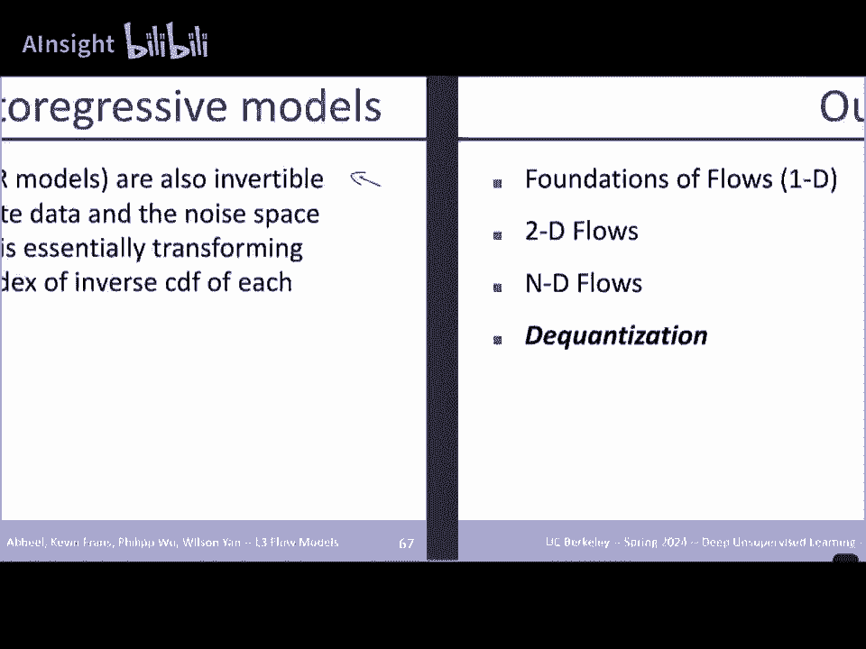

记住的事情，好吧，最后一块反量化。

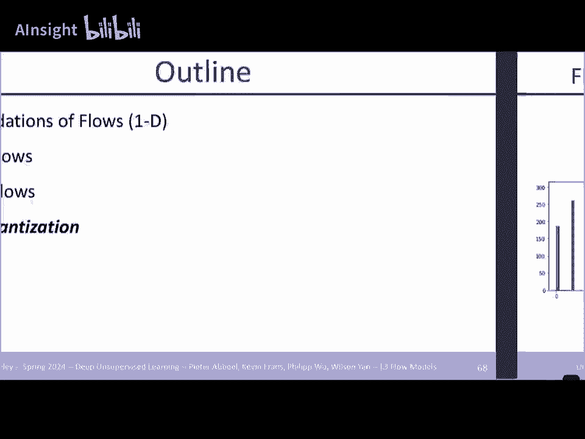

这是来自我们的流程 Plus+ 论文，嗯，这只是一个例子，当然这不是大规模图像，训练，而是一个，情感上离散的分布的例子，但像素也是离散，的，它们是从 0 到 255 的数字，而且它们都不是。

如果你从字面上获取数据，那么如果我们将它们建模为连续，变量，那么它们本质上就是，在非常，特定位置达到峰值的密度，如果你训练，将会发生什么就像你，在中间看到的那样，嗯它 会了解到，有一些峰值。

他们会发现一些，峰值，并在其中一些峰值上放置巨大的质量，并在很大程度上忽略，其他没有，找到的峰值，它不会完全忽略，其他峰值，因为存在非零密度，所以，这并不是说他，在其他人身上得到了负无穷分数，但它。

确实推动了其中一些人，戏剧性地进步，理想情况下，如果你，真的将所有内容压缩到零，宽度间隔中，你可以获得正无穷分数，你可以获得无穷大并，获得对数 无穷大并获得非常，高的分数，这就是，那里发生的情况。

您可以看到训练分数，负对数损失越来越，好，它对，这种情况非常满意，但我们没有得到。

我们希望的分布拟合，因此，这种情况发生在像素，上，我们能做什么呢，我们，知道密度实际上是，在一个区间内对质量进行建模，我们需要确保它保留，这个，含义，你可以做一个复杂的推导，但本质上。

这个想法是 当你有你的数据时，你应该在它上面添加噪声，如果像素，值为 125，你应该在它上面添加噪声，这样它就会落在，124。5 和，125。5 之间，并在每次，使用它时重新采样，对所有人都这样做。

那是，做什么的 它消除了那些峰值它将，您的原始数据，分布平滑为实际上是，您的密度的数据分布现在您没有任何。

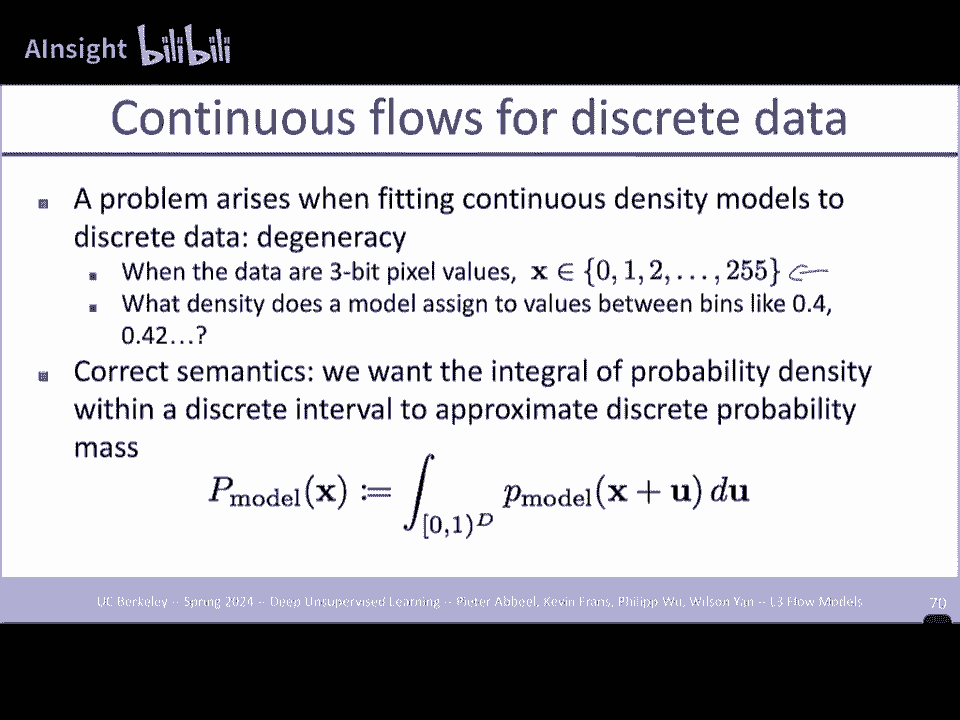

麻烦了嗯让我看看是的现在您可能会。

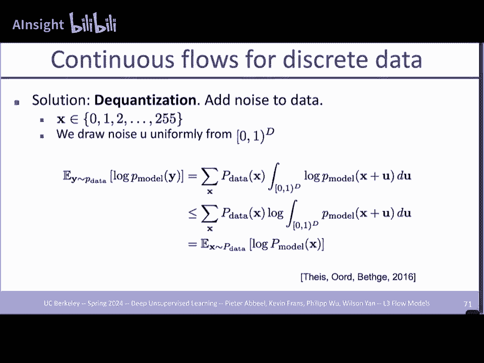

说这感觉像是一种黑客嗯它，看起来直观上是正确的但感觉，有点黑客 首先，您可以，有效地导出 um a Bound ，您，可以说，如果，我真正建模的是，在某个间隔内着陆的概率，并且我的数据。

恰好位于某些位置，但我分配了，间隔，这意味着我必须对，我的连续密度进行积分，这有点烦人，但如果我每次都这样做，然后我通过在，样本上添加噪音来限制它，那么，之间就有密切的联系 两者，并不完全相同。

但是如果我在，样本上添加正确的噪声，结果会发现，它可能是潮汐界限，所以，我们在 flow Plus+ 论文中所做的实际上，也对其进行了训练，因此不是采样，均匀的 0。5 加 0。5 我们训练了一个模型。

来决定，在该长度的一个间隔内应该将多少质量移低或移高，默认情况下不学习，将是均匀的，并且学习会使，它更精确可能会说为什么为什么，学习有意义，如果你的数据很好地考虑一下它 分布看起来，像，这样，那么也许。

认为它实际上看起来，更像这样是有道理的，在这个，区间里，它有一个斜率，它不是均匀的，当你了解到，我们是什么时，这实际上就是你捕捉到的东西 称为反量化，你说原始数据可能是，连续的，但它被采样。

到这些量化值，并且从，我正在学习的一切中，我现在认为，原始数据来自这个，分布，周围不均匀，我将使用它重新采样 这种，分布而不是。

均匀的um，流和带有去，量化的离散数据，这就是我们，之前看到的另一个例子，我们看到它，有这种奇怪的情况，你知道，当我们进行适当的去量化时，不会出现峰值，训练损失看起来，更干净，所以这是 嗯，我们。

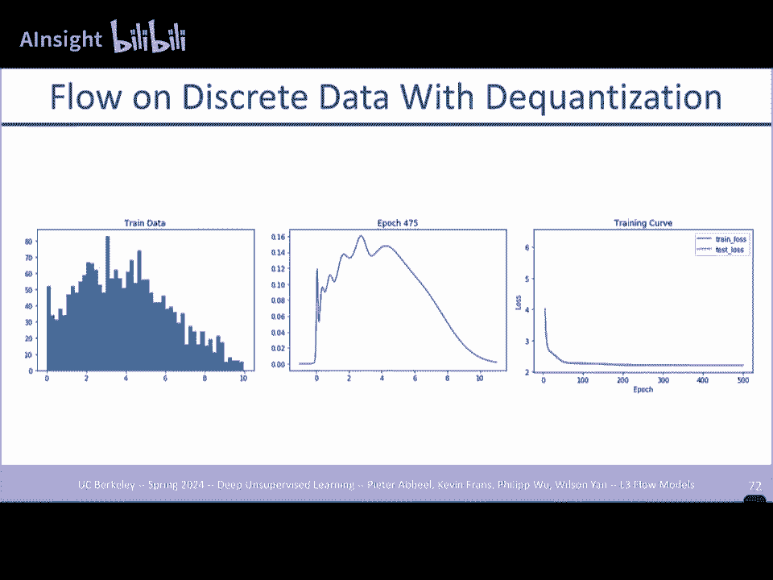

现在与压缩的关系如此密切，当你压缩，连续数据时，你实际上最终确实，需要有，离散化的意义，因为如果你，考虑连续数据，你如何能，压缩连续数据，一个数字，中包含无限的信息 原则上，它只是保持实数，所以。

如果你想用，离散的实际可压缩形式来形式化这一切，你需要有效地你知道，你可以量化为你，要发送的位数，我们将讨论，压缩 嗯，学期末。

那么未来可能的方向是什么，记住这些是，目标，快速采样，快速推理，快速训练，良好的样本，良好的，压缩流似乎使我们能够，实现一些也许是所有这些标准，但并非所有标准都同样好地解决它，它关注所有这些，而。

aive 模型并没有真正考虑，嵌入细长表示，所以这，就是这里的压缩部分，嗯并，没有真正考虑这些事情，但流确实考虑了，这仍然是一个悬而未决的，问题，嗯如何设计每个，个体 Flow 块以及如何将。

它们组合成能够，很好地工作的东西，这些是我在底部的想法，一些要求可能会带来，永久性的挑战，就像你可以，同意这些，然后决定，我不打算在 Flow 上工作 模型，因为我认为这些都是有，问题的，或者你可以说。

这就是，每个人的想法，但实际上，他们可能是错的，我不认为这是不可克服的，我将写一篇很酷的论文，表明他们确实可以做到 好吧，因为现在可以解决这个，维数，保留的问题，我应该添加一点，颜色，人们。

实现流程降维的方式，是你做你的，流程，然后在某个时刻，在，你的一半变量的一些，流程块之后，你决定 你停止，流动它们，你喜欢继续使用不与，任何东西互动的身份，你只是停止流动它们，然后，其他人继续前进，你。

稍后再做一次，稍后再做一次，这有什么好处，这意味着，那些 仍然会一直到，最后，它们是，你的图像的合唱表示，可以说，然后那些稍后再次加入的，只是它们变得更好，然后甚至，更晚，所以你然后希望。

那些退出的 最早的，学会表现细粒度的，细节，而停留时间，最长的一个你希望他们学会，表现图像中内容的大局感，嗯你知道这就是它的做法，这是一种非常具体的，做法 它感觉不像，其他一些模型那样灵活，他们只是说。

哦，我要告诉你，应用一个层，来降低维度，这是一种，学习的降维方法，然后我继续使用较低，维度的可逆性，很好，我们，可以 以，确定性的方式获取样本一旦你对 Z 进行采样，你就知道你会得到什么，但是。

我们谈论的一切似乎都是，可逆性的，而廉价的，行列式要求本质上告诉，我们，这就是你要做的所有你没有，得到的 做除了这个和这种，类型的层之外的任何事情，嗯，很明显，它对，我们放入的内容施加了很多限制，嗯。

也许这很好，也许，由于某种原因，可逆性是一件很棒的事情，让，你愿意，付出这个代价 也许不是，我认为在，一个一切都，尽可能轻松地扩展和扩展并尽可能具有，表现力的时代，我认为我们仍然，需要看到流程的突破。

它的，表现力就像，Transformer 模型一样，如果你来的话，与那些，吸收所有单个线性数据的东西的对应物一起吸收所有单个线性数据，同时在流模型意义上是可逆的，那么突然之间，与我们今天所拥有的相比。

流，模型可能会给出非常好的结果，然后，你 将会扩大规模甚至，更好的结果，但现在情况并非如此，我们不知道，但，事实上，如果你看，四年前的作业续集，今年的四个作业，今年的，四个作业，三个作业都在。

同一主题 尽管它们进行了相当，大的修改，因为主题，已经发展，但我们在这个周期中，采取了流作业，以支持扩散，作业，因为，与流模型相比，扩散模型今天使用得更广泛，让我们，看看我是否有 我想这。

可能是最后一张幻灯片，但让我，检查一下，哦，这是一份参考书目，所以如果，你再次我想你知道这就是，关于你的研究，你会感到很糟糕，并且，你相信某些事情可能会，或可能不会有希望，如果你 想要更，深入地研究。

我建议，从这两篇调查论文开始，嗯，对，已经完成的工作有一个总体概述，正如你所看到的，这是直到 2019 年，2021 年，但在我的文献检索中，我没有找到，任何真正的 从那时起发生的作品，得到了很多关注。

所以我做了一个，搜索，我会看看谁，引用了列出的论文，就像谁引用了真正的 MVP 论文一样，因为如果你写，你就必须引用它，一篇好的流程论文必须被引用，所以我，去 Google Scholar 说好吧。

在那些网站真正的 MVP 的人中，谁是，真正的 MVP，哪些人有更多的引用，这，意味着你知道这项工作可能很，重要，人们正在，关注并关注，从字面上看，并没有，出现任何高引用计数的内容，因为哦，我们。

需要看看这个并将其纳入，讲座中，所有高引用，实际上都是这张幻灯片上已经存在的内容，然后这些是被，引用次数最多的两个内容 2020 年代，如果有真正的突破，就会有另一篇论文，嗯，我的，意思是。

这些论文可能被引用了大约，一千次左右，但，我们写的扩散​​论文被引用了，六七千次，而且是，同一年的，所以没有什么 在此，期间，再次发生相同类型的事情可能是一个机会，我，不想说你可以在那里找到一些。

你发现的宝石，但，现在看起来不太有希望，嗯让我们再问一两个，问题，然后 然后我会在，办公时间之后解决很多其他问题让我们从，这里开始是的当你使用时你会失去，嗯当你使用量化时你会失去，可逆性你可以在。

最后四舍五入所以从​​这个意义上说 我不认为你会，失去它，因为本质上你是在，增加噪音，但它是在一个间隔内的，所以当你通过它，回来时，因为网络是，可逆的，你会回到，正确的，间隔内，现在你可以争论了 也许。

你会得到更好的东西，因为，你实际上甚至在但，也许你的计算机屏幕无法，代表它，因为你无法，向你的像素值添加更多你知道的位，但也许去量化，实际上使它比，否则你会得到的，但你，必须四舍五入到你，必须代表你的。

图像的位，所以去，量化的完成方式是它，被迫在一个区间内，使，你保持在该区间的中心位置，并且 邦德说，那里没有其他东西了，所以不是，你不能添加高斯噪声，你只是，在间隔内添加噪声，因为，你不能离开间隔。

所以你又，回到了，它，是的，看起来如果你要，付钱 像这三样东西的价格必须比，像a这样的东西有一些优势才能让你使用它，如果我们想继续研究的话，你对，这些优势可能是什么有任何直觉吗是的。

所以vaes的挑战之一，历史上一直是嗯 我们将在，下一讲中详细讨论，嗯，您最终所处的潜在空间也是，空间中连续的纬度，并且，如果您经常从该空间采样，当您映射回，解码时，您最终会得到一些。

不是的东西 如此有意义，这，意味着您需要一个更好的，潜在空间模型，因此，过去几年 vaes 的进展都是，围绕在 vae 之上训练另一个分布，来对，潜在空间中的分布进行建模，然后，当您使用该学习。

分布进行采样时，您正在，生成良好的，样本，流模型可能面临的，挑战较少，因为，最终的分布被迫变得非常简单，并且您将其强行推向该分布 嗯，所以，样本可能自然地你知道，或者，从 zspace 中采样。

表现得更好，因为你强迫它成为一个，简单的干净空间，嗯，可逆性我认为确保，当你返回时不会发生有趣的事情，所以这是一回事，但是 然后人们，在训练，vae 潜在空间内的模型方面取得了进展。

以便在那里获得更好的结果，所以我不知道 Wilson Phil，你对，可逆流，模型在哪里可以得到回报有什么想法，这，并不是一个，真正的问题。回答是的，没有别的，我认为像。

Oneal Advantage一样，有一些，特定的结构，就像你，有一些，科学的应用程序，如果有，一些应用程序就好了，是的，我认为，你也有一个好处，但它，通过模型更能解决 还有一个原因是，由于可逆性。

你不会像甘斯这样，曾经流行的其他模型有时会遇到崩溃，你被迫，覆盖整个分布，这，对于每个似然模型来说都是正确的，只要 当你训练似然模型时，你必须继续覆盖，训练数据的整个分布。

因为否则你会得到一个非常糟糕的，分数，嗯，这是，所有似然，模型的一般属性是的，我可以，我们可以回到。

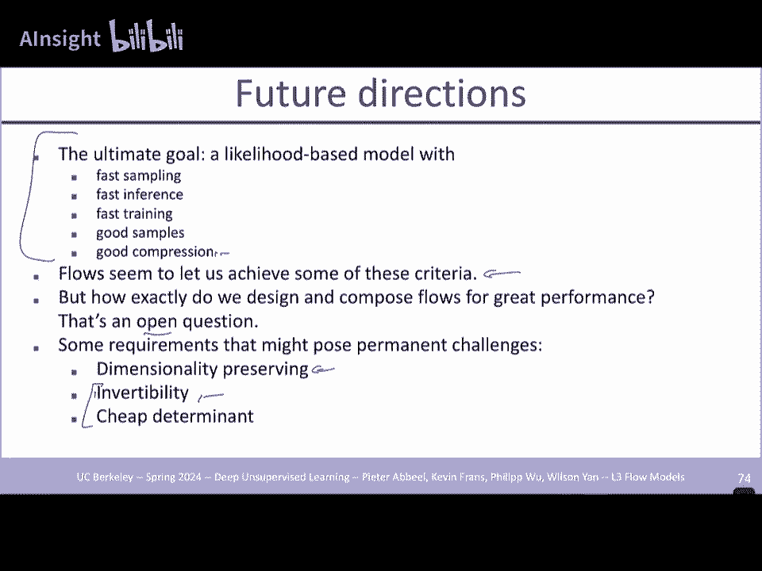

我确定找到的应用程序吗？耦合我的问题。

是。

可以的，称为广告的缩放术语，因此这里的术语是，可以根据变量 XI 的父变量进行任意神经网络，计算的术语，因此您可以忽略，它，因此它将在，两个术语之间相加是 在我看来，它与，res 完全一样。

所以你你你是的，如果你愿意的话，你绝对可以，在这里构建跳过连接，这是一个很好的观察，跳过连接是你，可以代表的一部分，没有问题是的，但是，我们可以让我们来看看 我们得到的是，这个函数的行列式是，1 是的。

为了明确，如果我想，将它变成一个跳跃连接，我，会在此处添加一个加 Z ，这就是，我所要做的，好吧，a 项变成了 1 项，所以，我们不这样做 不预测，默认情况下的一个，这看起来像 res。

因为你有 C 一些添加看起来像，重置，除了你，计算的内容只能依赖于，该变量的父级，所以任何出现的东西所以它，开始看起来很多 在某种意义上就像一个常规的，自动攻击模型，但是在连续的空间中，是的。

它也适用于 Res，父级，是之前的正确的，在这种情况下，如果你像，这样使用，那么在我看来就像，非常 res 是的，那里有很强的联系，我同意 res 有超级，我的意思是这个，强大的架构，MH。

但是我可以说这个，架构虽然是可逆的，但也很，强大，我的意思是它非常强大，因为你。

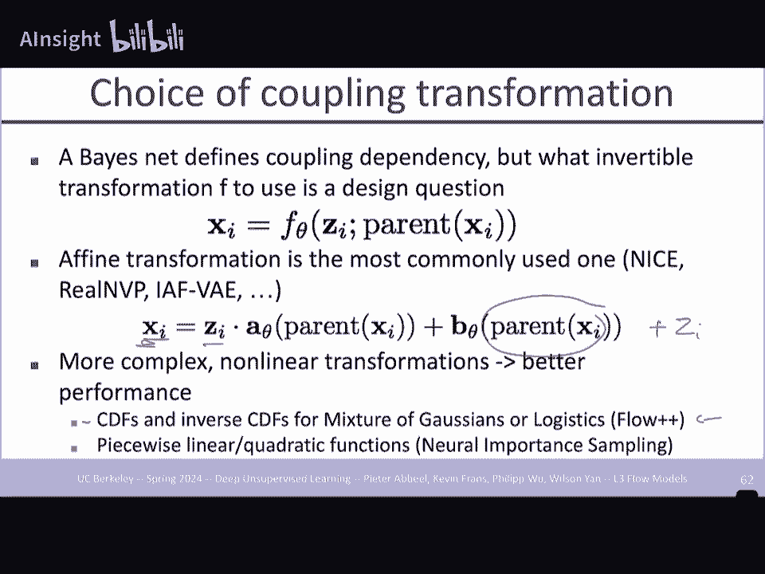

知道你在，插值和面部生成中看到的结果，所以，这并不是说它不是 不能做任何事情。

只是它看起来仍然，比其他，架构更具限制性，我不明白，我的意思是，因为我，看不到，该方程和重新发送的方程 MH 之间有太大差异，他们应该，同样尝试一下，看看看看 如果你，看看。

今天使用的共振网络架构的细节，如果它们真的，是可逆的，因为我认为它们，通常本质上会，压缩不同，地方的维度，它们会在，现在工作时进行投影，也许你可以，解决这个问题 你可以设置，某种复杂的单元。

然后通过这种方式有效地获取，信息，这可能，值得考虑，让我，在课堂上再回答三个问题，一二三，然后，我们课后要做的其他事情是的，不是 当你优化模型时，这并不是唯一的区别，这绝对是一个很大的，区别。

无论你是针对分类进行优化，还是其他方面，你，原则上可以使用它，来优化重建或其他，事情，嗯我的意思是更多 就像有那样，得到它得到它，就，其训练方式而言，行列式肯定会，非常直接地影响训练。

这是一个维数保留项，这可能归结为，你是否想要这样的问题，你想要维数保留吗？ 不是，像体积概率这样的事实，质量，保存嗯，当你处理事物时，或者，你认为有些东西应该更加，压缩在一起，而另一些东西，应该比。

原始数据本身分散得更多，这是一个，错误，我认为还有两个，问题我们 会做“，是”，就像你知道 Z2 依赖于 Z1 Z3 依赖于，另一个 Z 等等，还是你只是喜欢，样本是的，这是一个很好的问题，取决于呃。

所以问题是，你能独立对你的 z 进行采样，然后开始生成 AIS 在，逆 aive 流的情况下全部并行，所以它不仅像并行，我的，意思是，而且甚至不像并行，就，不同部分之间的相互依赖性而言，是的，所以。

问题就变成了，你想使用什么分布 代表Z的，右边，在你的方块序列中，当，你穿过Z的下一层，Z的下一层时，你没有做，任何事情，你只是沿着你的路，走，然后你沿着你的路走回来，但，在最后你 实际上。

在 Z 上设置一个密度，你必须，做出一个选择，你可以决定选择，一个比 Z 更复杂的密度，你可以就像人们，现在在训练 Vees 时使用 Vees 所做的那样，有一个，非常复杂的分布 在，潜在空间上建模。

实际上，在某种意义上是潜在扩散，这就像，潜在空间上的一个非常复杂的火车模型，原则上你可以在这里做同样的，事情我可以有一个标准化，流程，然后本质上训练一个潜在，扩散模型 在最终的 Z 上获得。

一组更具表现力的 Z，然后也许您可以使用，此流模型获得更具表现力的模型，这样您就可以在那里做同样的事情，在这种情况下，对疾病进行采样将，不同于仅对它们进行，独立采样 从高斯来看，到目前为止。

用流模型完成的很多工作 zspace，往往非常简单，它只是一个，高斯独立的高斯，你，只需从中采样，原则上，也许这应该，足够了，但也许还不够 也许，正确的模型说嘿，这就，足够了，你需要这样一个深度模型。

这，实际上并不存在，竞争太激烈，梯度，传播得不够好，我喜欢，用于某些数据建模的流模型的概念，但在 最后我应该使用，不同的模型，例如潜在，扩散模型来模拟疾病，这样组合可以给我，更好的结果。

最后一个很有可能可以，但是你能重复一下我们如何，进行条件生成或指导，采样，过程是的，所以 在您看到的任何这些模型中。

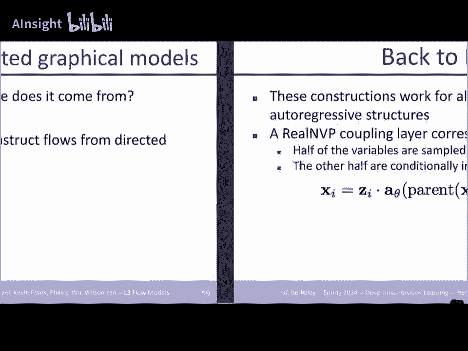

假设这些参数化部分中的任何一个，如果您正在调节，那么在，2020 年 2021 年它变得更流行时并没有真正做到那么多，您可以只拥有编码它的神经网络，还可以条件任何类型，的嵌入或其他信息呃。

另一张图片一些文本条件就在，那里嗯没。

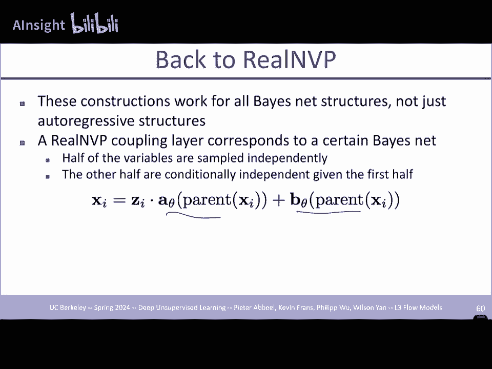