# [中英字幕] UC Berkeley 深度无监督学习 CS294-158-SP24  ｜ 2024年春 （更新至0824） - P6：6 扩散模型 - AInsight - BV17W421P7QA

好吧，让我们开始今天的作业吧，你的作业二是昨晚到期的，但你还有很晚的时间，所以你可以继续，做更长一点的时间，然后让我们看看你的作业三，将在今天晚些时候发布，可能会在今晚 从昨天开始的两周内就要到期。

之后你只剩下，一项作业了，在课堂上已经很长一段，时间了，嗯，也是时候开始，思考你的期末项目了，所以嗯，开始思考你想做什么，看看上面的指导方针。网页本质上是希望你做一些，有趣的研究，理想情况下是。

一个研究项目的开始，一些，新事物的初步生命迹象，或者可能已经很长一段时间，以及，一些与嗯，相关的课程相关的东西，你很快就会有最后期限，通过 Google 文档提交提案，我们将对此发表评论，我们将与。

您一起来回讨论，并在某个时候说您的，提案已获得批准，此时，您可以开始行动，大约一个月后您将获得一个里程碑，现在，最后的，交付将是学期结束时的书面报告和，录音演示，嗯，是的，如果您不确定要做什么。

那么请利用，办公时间来，为您的项目集思广益，这对我们来说通常很困难，只是提出一些建议，但是一旦您，有了自己的粗略想法，我们就很容易，与您一起围绕这些想法进行集思广益。关于物流的任何问题，好吧。

今天我们将研究，扩散模型，这不是一部分，四年前这门课还不存在，呃四年前呃这篇论文，乔纳森·H写的是写的我，想不到，四年前这非常令人兴奋因为从，某种意义上说几乎所有，发生在过去四年的事情 至少在。

图像空间中似乎，涉及扩散模型，要么，只是扩散模型，要么是，与扩散模型相结合的其他东西。

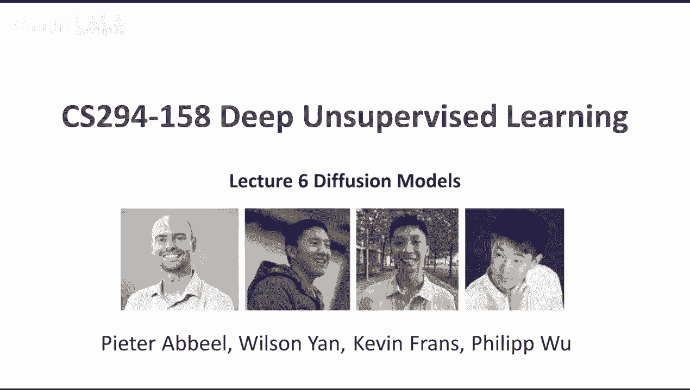

所以嗯，这是几年前，《Open Eyes Dolly 2》问世时我非常喜欢的事情之一，可以开始，给出提示，然后它会，为你生成艺术作品，例如，这里有，一幅精湛的油画，一只波斯，异国猫。

在检查手机时发现存在加密货币丢失，好吧，这就是你将其输入。

尼尔网络的提示 扩散模型，结果是，提示的美丽艺术渲染，顺便说一下，右下角的小配色方案，是一个签名，它现在是一个，多莉生成的，图像，如果你在人工智能方面很活跃，那么最近可能听说过这个。

叫做 sora 上周刚刚推出，它是一个扩散模型，并非所有。

细节都可用，但它是一个，扩散模型，能够，根据描述生成完整的视频，所以在这种情况下，美丽的白雪皑皑的东京。

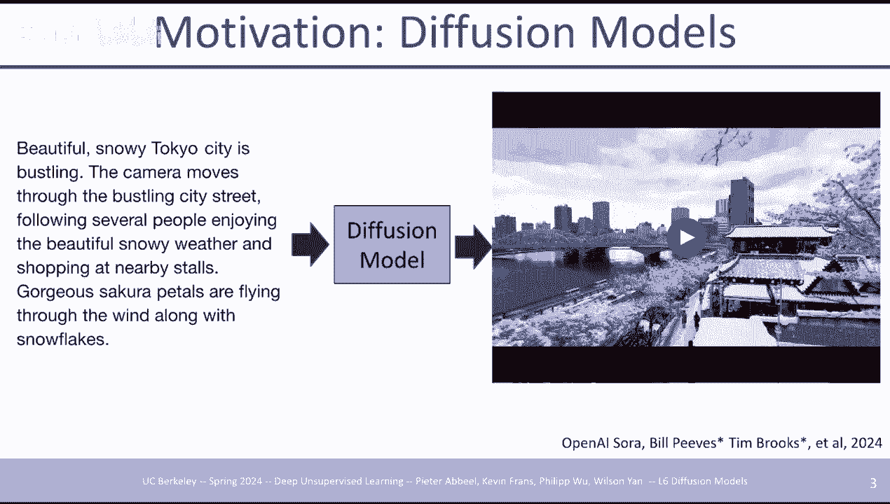

嗯，我想玩一下，而不是，去 下一张幻灯片让我们看看这是否，可行 美丽的白雪皑皑的东京城市，熙熙攘攘 镜头穿过。

熙熙攘攘的城市街道 跟随几个，人享受美丽的下雪。

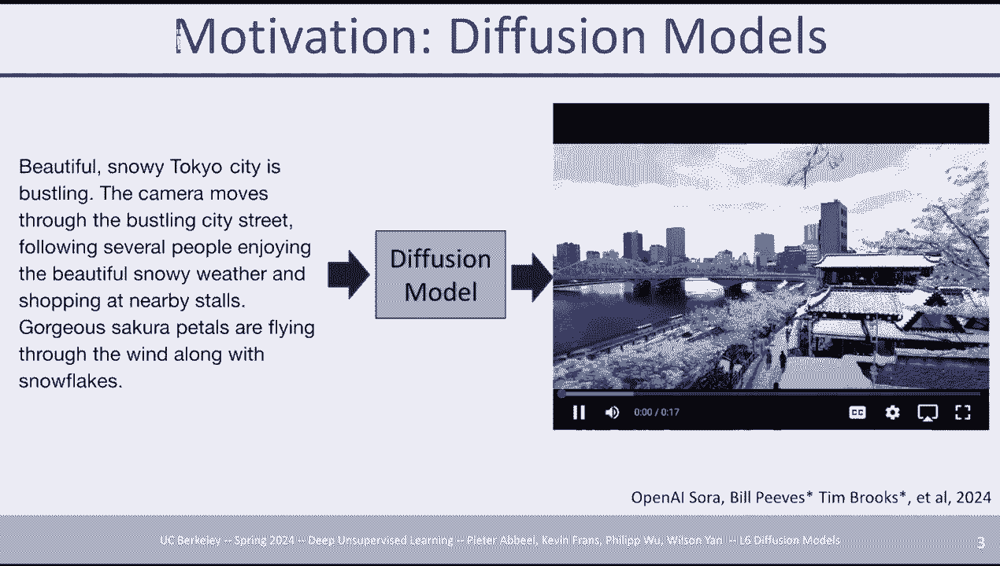

天气并在附近的摊位购物，美丽的樱花花瓣。

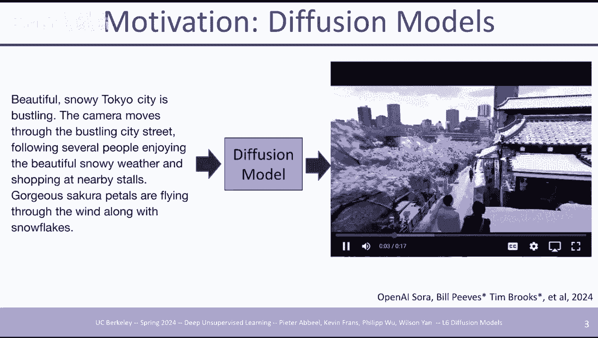

随着雪湖随风飘扬，所以我看了这个。

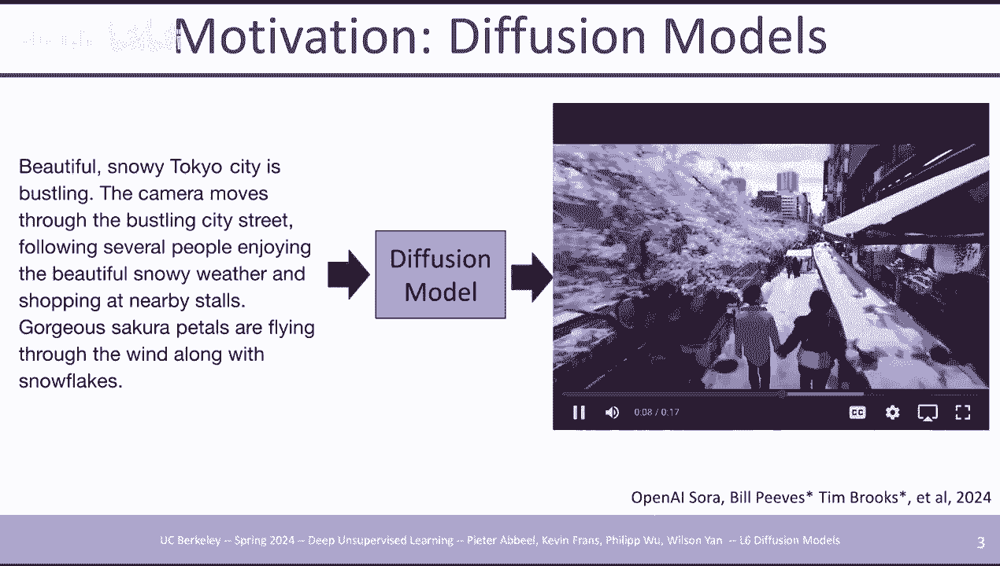

视频现在很难发现任何，不对劲的地方，也许如果你。

看一下它非常详细的方面，你会发现一些不对劲的地方，但从，快速课程来看，这看起来只是，一对夫妇走进来时拍摄的无人机视频，东京，但实际上它只是，由人工智能制作的这些。

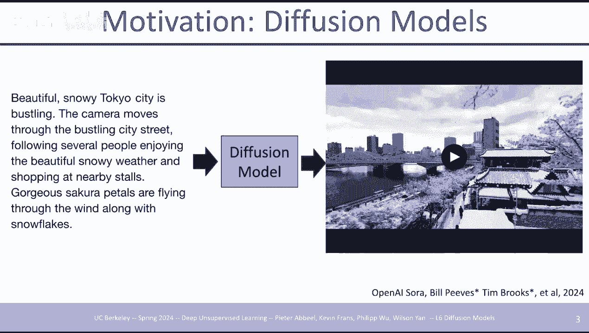

模型已经变得多么好呃菲利普告诉我，这是他最喜欢的之一嗯，穿过东京，郊区的火车窗户上的倒影这就是你所要求的然后这，就是你得到的，嗯，它正在渲染窗户上的反射，当天黑时，你可以看到，站在窗前的人的更多细节。

这真是太神奇了，它捕捉到了，视频或现实世界感知的所有方面，嗯，这是另一只猫。

叫醒熟睡的主人，要求吃，早餐，主人试图忽视，猫，但猫尝试了新策略，最后主人，从枕头下拿出秘密藏匿的零食，让猫再呆一会儿，好吧，让我们看看这里会发生什么，顺便说一句，这是他们发布的一篇文章。

其中并非所有内容看起来都那么，完美，让人们感觉到哪些内容，可能仍未完全发挥作用，呃，所以，请密切关注实际，发生的情况，就像，床单下出现了第三只手臂一样 但我的意思是，除此之外，这是非常令人惊奇的，呃。

有一个时刻当然，有点不对劲，但你也知道，他们分享它，他们可以，挑选樱桃并留下这个，但，他们实际上分享它是为了展示在，哪里 改进的机会。

仍然，存在，然后呃，他们分享的另一项内容，再次展示了改进的机会，长标题在这种，情况下是五只灰太狼，它真的是，五，看起来像三，但现在是四，现在，是五，嗯，现在我的，意思是现在在 现实世界很难，实现。

但在电影中你可以想象，这种情况可能会发生，比如这些小狗不知从，哪里冒出来，然后做一些，事情，嗯，所以很明显，公平的，现实主义有一些限制，在线视频的制作方式对，这些视频的真实性有限制，它们不可能。

在现实世界中发生，所以嗯，我认为，除非你真正过滤视频的，真实性，否则你可能总会得到，这样的结果，如果你不这样做的话 如果，你不小心的话，但是嗯，他们分享的内容是为了表明仍有，改进的空间，游戏还没有结束。

嗯，你也可以用机器人来做这件事。

所以这里之前的都是来自，open ey Sora 系统的呃，那个 该项目，由比尔·皮维斯和蒂姆·布鲁克斯领导，他们刚刚从，伯克利毕业，不到一年前，我们已经，在伯克利研究用于视频生成的扩散模型。

但当然没有足够的，计算量 数据注释数据，可用于执行此类操作，您知道，通过，开放的资源，可以实现大跃进，我现在提供它们，这是，由另一位伯克利学生 Sherry Yang 完成的一个，嗯。

您将在这里看到什么，我的意思是，如果您遵循讨论 在，Sora 在线上，你会看到，哦，它，真的学到了物理知识吗，这就像，不现实的现实等等，这里，特别是包含，大量机器人数据的趋势，所以。

现在如果你包含大量机器人，数据操作数据，那就很有趣了 可能会发生，您是否开始获得一些现实感，也许它可以帮助机器人思考。

其行为的后果，所以，这是一系列。

视频，因此它以一个帧开始，然后，将请求放在顶部，然后，可以发出新请求 关闭底部，抽屉等等，所以这是一系列，命令，因为这是这个视频，呃是以小块形式生成的，但你看到的实际上是它遵循，规则我我它打开抽屉它把。

它拉出来它没有' 不只是以，意想不到的方式打开它，所以当它，移动一个物体时，机器人实际上，必须去那里抓住该物体，然后将，其放在它想要放置的地方，所以当，你看到这一切时，肯定有一些小，细节是' 确切地说。

Picture Perfect，并不是，像 Sora 那样使用超大型模型进行训练，因此存在更多伪影，但，该模型的要点是知道如何执行任务，例如抓取物体、打开抽屉、，关闭抽屉、将东西放入抽屉中。

抽屉它实际上是在这个模型中捕获的，所以非常有趣，有趣的是，这实际上是一个。

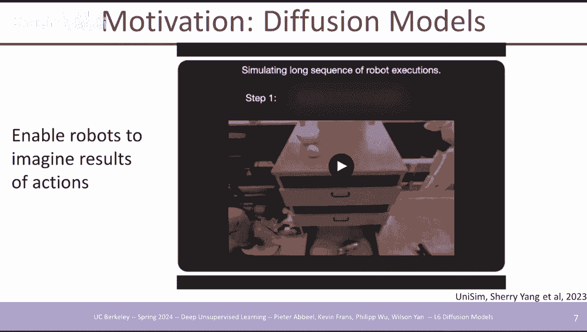

真正的可能性，现在好吧，所以今天的讲座将，首先由两个组成部分组成，我将回顾，一些基础知识，我认为扩散模型的历史 通常，通过查看事物如何组合，在一起的历史，它可以让您，了解事物的，发展方向。

而不仅仅是查看，最新和，最好的模型的快照，它还可以教会，您一些关于新事物如何发展的知识。威尔逊和凯文，将更深入地探讨，最新和最伟大模型的某些方面，以及使它们发挥作用的重要因素，如您所知，您将获得。

以下方面的作业： 扩散模型呃发布，两周呃从今天开始你自己可以更，深入地了解，好吧所以嗯嗯，这个类的事务座位我现在以及，2020年视觉生成的生成模型领域，有，自动攻击模型流模型Len。

变量模型Gans  Gans 提供了最，真实的图像，但它们有很多，花哨的东西，而且它们很难，真正覆盖数据分布中的内容，通常，当您查看单个图像库时，当您查看生成的事物的语料库时，您会得到高质量的图像。

感觉太窄了 呃，涵盖收入，当时对，Jonathan ho P Berkeley 来说从事新事物的动机，即呃扩散，模型，所以显然在此之前有工作，我将重点介绍在，这项工作之前的一些工作嗯。

一旦我解释了我们在这里所做的事情，这个动机就激励我们朝这个方向前进，但，我会详细解释这篇论文，为你，在这堂课上学到的一切奠定基础，然后我们将从那里开始工作，所以这就是呃第一，代噪声扩散。

拳头模型可以做的事情嗯这些是，当时最先进的结果嗯，和甘斯有能力做的一样好，我的意思是也许气体仍然可以做，更高的分辨率 但很，明显，这已经达到了，Gans 当时所达到的相同质量水平，而且 Gans 已经。

有了 10 年的发展，基本上你知道的，发展很少，相比之下，发展量很小。我们评估这一点的不仅仅是质量，而且如果你看看，生成的事物多样性的细节，它的，多样性比甘斯所能做到的要好得多，所以它会朝着相同的。

质量水平发展，而 具有，更好的多样性 从某种意义上来说，更好地覆盖，数据中的内容，因此，很明显，那里有很大的潜力，本文提出的模型是什么 嗯，结果是，融合模型 有很多方法可以考虑，它们，有很多有效的解释。

嗯，这就是使事情变得复杂的部分原因，因为有些人可能会采用一种新的，架构，但使用一种用，一种符号来解释扩散模型的方法，而，不是一篇论文使用，不同的符号不同的符号，然后使用另一种架构。

实际上你可以同时使用这两种架构，一起改进，但你知道有，很多方法可以以某种方式思考它们，我认为思考它们的最简单方法，或思考它们的最简单方法之一，是它们只是，降噪器，所以你训练这些。

模型的方式 你有一个图像，x0，在这种情况下，你，在像素级别逐步添加高斯噪声，然后，你尝试学习一个，相反方向的模型，消除，噪声，这可能是一件，有趣的事情的原因是 因为如果，你能做得很好，那么你可以。

从一个纯噪声图像开始，如果它做得很好，或者如果你有一个，低质量的图像，你可以把它，变成一个高质量的图像，它会以某种方式把它变成一个真实的图像 因为，如果你看看这个模型，它可以对低质量图像进行去噪。

从某种意义上来说，这里的东西与，我们在 Gan 的 ve 中所说的 Z 非常相似，只是一种非常特殊的，潜在空间，这里的潜在空间是，这样的 就像在这种情况下与原始图像相同的大小一样，当我们查看更高级的。

扩散模型时，这些事情将会改变，但与，原始，图像的大小相同，并且它只是纯高斯噪声，我们实际上可以保证，如果我们，执行足够的步骤来添加 gussan 噪声，我们将把Z的分布，变成高斯分布，你添加。

足够的高斯噪声，以及它的，添加高斯噪声的方式，这是，这里的Q步骤，从右到左，你有效地，缩小了图像，你可以说缩小它，乘以 0。9 所有像素值将，它们缩小到零，然后添加，高斯噪声 您还将图像以零为中心。

这样您的值就从，负 1 到加一 假设，您的像素值，然后您的原始，原始值不断缩小，而您，继续添加 gaan 噪声，这就是你，从右到左的方式，所以从右到左的，路径非常微不足道，没有什么可，学习的。

你可以认为这是好事，坏事，但没有什么可学习的，只是，噪声噪声噪声，最后你得到，一个 gussan uh 分布走另一，条路更难，必须学习，所以，我们必须学习一个模型，可以。

恢复 XT 减去给定的 XT 并，假设步骤很小，你，实际上可以假设返回的正确方法，实际上是 还将其建模，为相反方向的高斯，嗯，您现在必须学习预测，该 gussan 的均值和方差，因此步长足够小。

这不是呃，这不是真正的，近似值，这是，正确的，当然您需要 学习，MU Theta 和 Sigma Theta 以，确保它与您的数据中的内容相匹配，因此这种对事物的看法在，概念上相对简单。

但是原则上您可以，训练一个模型，该模型具有您，甚至可以使用的模型 西格玛作为超，参数，只需为我训练一个模型，该模型可以，根据您之前的。

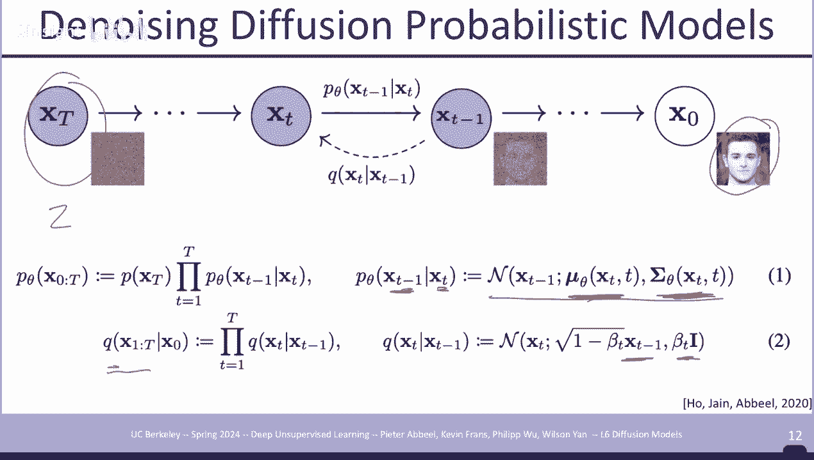

噪声图像预测稍微去噪的版本，它的实际。

设置方式在某种意义上有点不同，它简化了您对图像进行采样的训练时间，然后 你采样一个时间步，你，采样高斯噪声，然后你，创建一个添加了噪声的图像 x，z 是你的原始图像，你将，其缩小，然后你。

在这里添加高斯噪声这个 Alpha，T 越大，它越接近 一个，结果噪音越大，本质上这里有一个方案，根据您采样的时间，如果，您的时间很长（，在扩散过程中距离很远，或者您的时间，很短）。

您最终会得到一个非常嘈杂的图像 然后，图像中添加了一点噪声，然后你应该做的，就是接收这个噪声图像，这里的东西只是你的噪声图像，以及扩散的时间步长，所以，你基本上被告知，为了实现该图像。

发生了如此多的扩散，该噪声图像现在学习一个，神经网络 Epsilon Theta，它可以，恢复所应用的噪声，这在概念上等同于，恢复原始图像，因为，一旦恢复所，应用的噪声，您就可以从其中减去它。

噪声图像并获得原始图像，因此您实际上也可以用，您说的我想要，恢复原始图像的方式来制定它，但这是，这里使用的公式，我们将，恢复嗯所，应用的噪声，我们 当我们深入研究时，很快就会在讲座中。

详细讨论为什么一个可能，比另一个更好，但是现在我们假设，我们只是尝试训练网络来，恢复通过，查看噪声图像而应用的噪声 事实，证明，如果你查看推导的细节，等，就会发现这个，Epsilon Theta 是。

grad log P Theta x 的缩放版本，P Theta X 是什么，P Theta，X 是我们正在学习的分布，我们，无法直接访问，我们真正拥有的就是这个采样器，它将，噪声转化为嗯图像。

但在引擎盖下，有一个相应的分布 P，Theta X 它是这样设置的，嗯，我们从未直接评估过，但事实，证明，这个 Epsilon，Theta 本质上是在尝试恢复，这是什么量，它说的是，将。

我的 X 移动到在，我的模型下使 X 更有可能的方向，所以让我们，说这只是一个简单的 gusan，右，你的 x 轴和你的 X，坐在这里，你说哦，好吧，移动 X，位这个 方式，因为，现在这里更高。

这是在高维，图像空间中，显然这是一张更，复杂的图画，但，概念是，本地你说我怎样才能，使我的图像在我的模型下更有可能，这就是 Epsilon，Theta 曾经做过的事情 它训练得，很好。

所以如果我们然后看一下，采样 um 多个时间步长，那么，原则上你可以用一个时间步长来完成它，你，采用当前的，XT 并计算，逐步消除噪声的方向，然后你基本上进行了，修正，这就是你，在这里所拥有的。

如果这不是你的最后一步，但，你还添加了一些高斯噪声，这是为了保持，在下一步​​中培训师的分布范围内，你有一个分布内的，噪声 对于该图像，您可以再次，应用呃 Epsilon Theta，计算以朝正确的。

方向迈进并重复，因此如果您，在这里查看此解释，它实际上是在，说当我，采样时我正在尝试推动当前的每一步，图像是我的学习分布下更可能的图像，并添加一些噪声以保持，我一直在训练的过程的过程，以便。

下一步也成功，这里的过程实际上称为嗯，整个，过程称为，l，采样 它实际上是一种，从，X 的分布 P Theta 中正确采样的方法，因此这是一种，合理正确的方法，因此从某种意义上说，这就是它的全部内容。

我的意思是，显然还有更多内容，因为还有很多，年，自本文以来，我们所做的工作和取得的许多突破，但从，某种意义上说，这就是，您学习识别所，应用的噪声的全部内容，然后您使用，您学到的能力。

在越来越好的呃情况下拍摄图像，思考这个问题的一种方法是，想象，你的图像存在于某种，流形上，呃，你的噪音就在这里，它，是流形的，它看起来，根本不现实，你真正想做的，是将这个东西一步一步向后推。

到各种各样的现实，图像上，这就是幕后发生的事情，或者至少是对现在正在发生的事情的一种解释，如果你检查论文，会有，很长的推导，不会一步步进行，但本质上你可以，从，我们绘制的这个模型开始 最上面说的是。

我们正在做的是，我们实际上是在，数据模型下最大化对数似然，然后我们使用，变分下界引入，变分分布 Q，在这种情况下恰好是固定的，但相同，我们用于 Vees，你可以乘以，除以它，交换，日志和期望的顺序。

它就成为一个，界限，然后你就得到了，正在优化的目标，然后如果你，稍微重新调整它以减少，方差，你就会得到这个东西 在这里，这反过来又导致了算法，我向，你展示了你不必太担心它，但是，你可以去阅读有很多。

论文，其中详细介绍了，如何将其准确地与，这里的可能性目标联系起来我 我将向您提供，一些详细信息，我提供此信息的原因，是为了让您了解这篇，2020 年论文中已经存在的内容，作为，了解，自。

那时以来事情发生了如何变化的起点 CNN，Plus+，我们上周报道过，嗯，所以一个基于宽分辨率网络的单元好吧，所以有一个，想法，嗯，嗯，架构有一个，宽分辨率网络，并且有一个单元，架构，这意味着基本上在。

一个单元中，你从，较高的 U 形开始，这个L低不是样本，但学到了我，想降低分辨率进入特征，空间并在另一，侧返回，希望有一个更好的，图像版本，它可能是，图像的分割图，它可能是一个d噪声，图像。

这就是单位的方式 是这样设置的，你以这种方式绘制的原因，是因为通常你不只是尝试，从这里走到这里，而且你还获得了，信息，所以本质上是，从底部获得更深入的语义理解，然后，可能从侧面丢失的细节。

可以帮助您在右侧图像的重建中重建，当前级别所需的内容嗯，一些归一化方案呃，被认为是权重归一化，呃替换为组归，一化嗯33x 32模型，因为你，通过该单元有四个，步骤，所以一二三四实际上是，正确的。

对于 256x 256，有，六个这样的步骤，即进入较低，分辨率并，返回所有模型，每个分辨率级别都有两个卷积残差块和，自注意力 块在 16x16，分辨率，所以在底部，在，16 X6 不一定是底部。

我认为它会在这里，它将是一个，注意力块，所以 Transformer，有效地生活在那里，以帮助我猜，做一些更复杂的，处理扩散 时间 T，取决于你训练正确时，我需要多少 uh Denise 这个东西。

uh cidal 位置嵌入编码，就像变形金刚经常使用的那样，cfr1 模型 3570 万个，参数 然后是 Elson，和 SL ahq 的 1。14 亿个参数 然后是，256 嗯，对于最大的模型训练。

你会看到后来的一些模型，只是十亿个位数，所以，这篇论文已经不是，完全十亿个位数的模型，但，非常接近它，在这种情况下，结果猜猜，很好 面孔的多样性这是，在基于名人的阶段数据集上进行训练的。

因此它在某种程度上匹配了，任何名人往往，看起来像的多样性，嗯，如果你关注，新闻谷歌已经对他们的图像生成进行了一些各种各样，的修改，以 以各种方式扭曲它，这，不是数据本身，这，只是直接训练的，没有任何。

操作，只是，数据中的任何内容呃你知道学习学习生成，类似于，数据卧室教堂的东西所有生成的东西都，很好呃反映了多样性，数据的多样性 嗯，我们查看，分数 记住 Inception 分数和 FID。

嗯 Inception 分数是，事物属于某个类别的清晰程度，因为这是，Crea 拥有非常，清晰的图像的好兆头 嗯，我们的这是 doo，输注麻痹模型 9。46 实际上，在无条件，模型中排名第二。

当时只有最先进的 Gan，更好，然后是 FID，它还，衡量多样性，覆盖数据中的内容的程度，比任何其他，无条件训练的模型都要好得多，这是潜力的巨大标志，这些模型来覆盖，具有更广泛分布的分布。

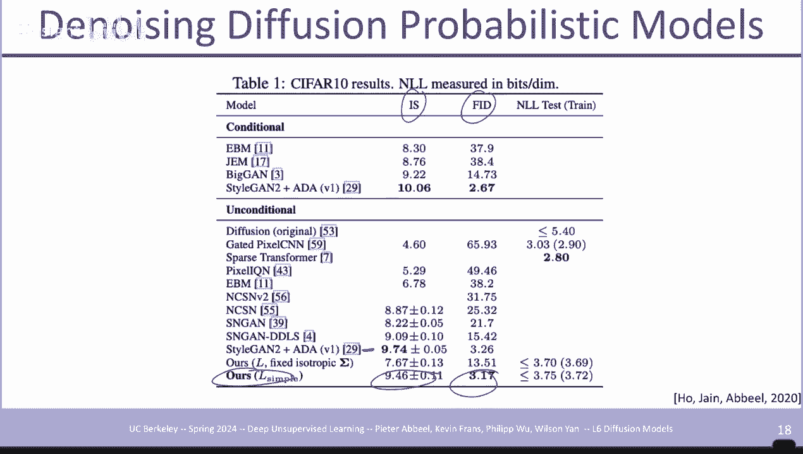

您可以与这些模型进行插值，您的做法是拍摄两张图像，然后，对其应用噪声，就像一定数量的，噪声时间步长一样，然后对这两个图像进行平均 噪声，图像和巢穴噪声它们会回来，嗯，这，取决于你所处的距离，你会。

得到不同的东西，例如，这些是，这些，这些是图像中的源，然后在重建旁边，重建给你一种，我走了的感觉 完全进入噪声，然后回来，我的扩散模型在恢复，原始图像方面有多好，它实际上非常好，嗯，它给你一个上限。

插值可能有多好，因为，关于原始图像的其他信息丢失了，但是，当你 看看嗯嗯，你看到的插值，确实看起来还是很像这个，人开始向左边的女人靠拢，这里有一些介于两者，之间的东西，这里开始看起来。

越来越像左边的女人了，左边所以有一个，从一个到另一个的逐渐过渡，它说 500 个时间，步长，我认为我们已经用第一个，时间步长进行了训练，这意味着你只能，中途将其带到完整的噪声，图像，而不是一路嗯。

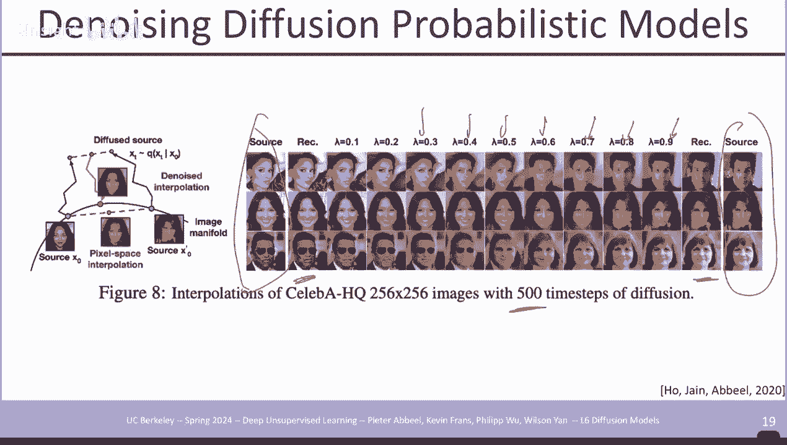

原因是 我们在这里做一个比较，如果你有两张图像，你正在，比较或插入左边的这个男人，和右边的这个女人，如果，你进行零扩散步骤，你，只是进行平均，这样你就可以看到，这里发生了什么，这只是 像素平均并。

没有发生太多事情，除了一张，不完全有意义的图像之外，如果你做了很多步骤，你就，一直到你的高斯，分布，嗯，你实际上可以在 500 处看一下，我们仍然得到，重建了原始图像，但超过 500 后，我们。

甚至开始丢失原始图像，我们使图像变得如此嘈杂，以至于我们扩散回来，我们没有恢复原始图像，因此，丢失了有关谁，在那里的信息，所以这是一种，自然的方式 选择那个截止点就是说，嘿，我仍然需要能够。

恢复我的原始数据，否则我不会，得到插值，所以除了，这里，它不会，很好地工作，实际上，如果你一路走下去，你会看到 哦，我们有很大的多样性，并且，生成了一些 U 面的感觉，但这，与此时的插值无关。

因为它只是纯粹的噪声，我们正在从，与原始，图像无关的东西中恢复好吧，嗯，你实际上可以去看一下，有关更多详细信息，但，有一种方法可以将扩散，模型视为有效的，自动攻击模型的概括，因此模型。

的自动调整如何想象模型的自动调整，因为您拥有图像，删除了，右下角的像素，然后将，像素移动到旁边 你要移动下，一个，而不是添加高斯，噪声，你只是一次消隐一个像素，这样整个图像就被，消隐，这与添加。

高斯噪声不完全相同，显然是有，区别的，但你可以认为，作为一个可能的过程，然后，相反的过程将是，自动攻击模型正在做的事情，它，一次将其填充回一个像素，因此扩散模型在某种意义上是。

在广义坐标空间中执行此操作，并且它也在随机坐标空间中执行此操作，它是随机内部，方向的，通过添加噪声来擦除信息，并随着时间的推移逐渐获得，完全擦除的图像，然后，学会返回到原始，图像，融合模型当然必须与。

像素数一样深，以，进行类比 真正坚持下来，但我，认为在更抽象的层面上，嗯，无论现在发生什么，它都会坚持下去，现在你，可能想知道为什么乔纳森呃，当时来找我，说我想，研究扩散模型，但它没有，出来 他。

当然知道甘斯在，覆盖多模态分布的能力方面受到很大的限制，所以他，看过这两篇论文，尤其是，灵魂迪克斯坦和，合作者写的这篇论文 从2015年开始，也就是那一刻之前的5年，所以，坐在那里。

基本上被大多数人忽视了，当时坐在那里五年，实际上从热力学的角度引入了扩散，模型，并且基本上有相同的，想法，我的意思是没有得到所有的细节，正确 获得相同水平的一代，发生，但在高水平上，有基本的，想法。

然后乔纳森同时看到，嗯杨宋和史蒂芬IR嗯在，斯坦福大学已经获得了一些非常好的，图像生成由嗯，本质上运行更长的V动态，采样 grad log PX 并通过直接，学习一个可以预测。

grad log PX 的模型，这正是，Lun Advan 采样器所需要的，因此，Jonathan 意识到，人们认为，这两项工作之间可能存在非常紧密的联系，而，这一项 从乔纳森的角度来看。

在某些方面以一种更干净的方式介绍了它，我，想从右边的这个开始，在错误生成方面已经取得了相当好的结果，然后他，研究了如何将它们结合，在一起，并且 导致了，我们，写的论文，好吧，所以从这里快速，浏览一下。

从那里发生了什么，然后打开我写了一篇论文，扩散模型在图像合成上击败了甘斯，标题说明了他们，试图理解的内容，现在，它不仅在，原始论文已经，做到的潜水员方面击败了他们，而且在个人图像质量方面也击败了他们。

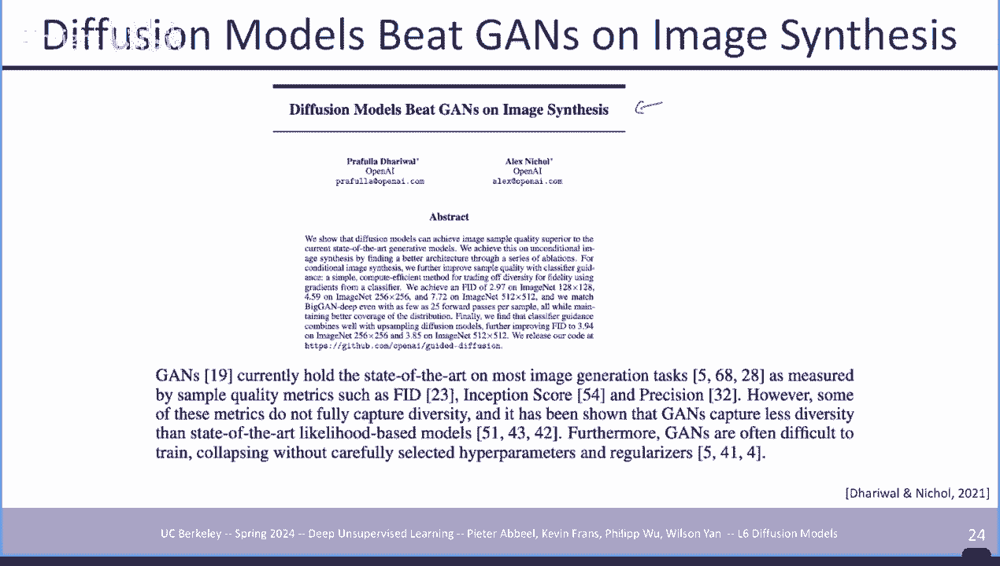

当他们问人们你能评价，你更喜欢哪些质量时，嗯。

最好是从他们，最好的图像网 512x 512 模型中选择样本，嗯这个，你知道真正好的图像，生成是在这里出现的，嗯，他们看到了一些东西，他们会，了解乔纳森论文中的方差，这是一个。

在他们的论文中调整的超参数，嗯过程的方差，被学习了，嗯，他们也你，看了恶魔采样器，我们稍后会详细讨论，这，两个变体，今天仍在考虑中，他们做了一些，架构改进，增加了，深度与宽度的关系，增加了。

注意力头的数量，不仅在 16x 16 上使用注意力，而且 同样在 32x32，和 8 by8 在本次讲座结束时，你会听到只使用，注意力而不再使用卷积的里程，TR 反式在这里。

已经是这样了 um bigan 残差块用于上，采样和下采样激活，um 重新缩放残差连接，因子 1 超过 < tk2 ，所以很少有东西，可以帮助嗯，他们引入了，一种称为分类器指导的东西，所以。

他们说因为我们想要，看起来逼真的图像，并且我们，通过查看分类器分数来衡量，某物是否属于某个类别，或 不是为什么不提供一些指导并，训练一个分类器来分类，到分类级别，因为，这些统一的学习数据集。

实际上通常被标记为呃我们只是将，它们用作 UNS 监督但为什么不使用，标签呃一次并注意，这个分类器 必须对噪声，图像进行训练，因为您需要学习对，噪声图像和，真实，图像进行分类，然后引导您采用。

相对于 XT 的梯度，这使得，图像不仅更有，可能是我们之前，所说的图像 哦，我们在这里，我们需要丹尼斯，回到流形，现在它，说哦，实际上你知道，在某种意义上有这么多流形，实际上这是我们想要的类标签。

所以我们需要以某种方式漂移到这里，所以我们得到一个 额外的一项，使其 Max 属于该类，因此，从某种意义上说，我们采样的每一步都是，我们所拥有的，这是一个噪声，图像，然后等待贡献。

这是 grad log PX 项，然后是，加权版本，给出 X 是的问题的 grad log py 看起来像是从上，一张幻灯片中看到的，就像当你，注入噪声时，有一个阈值，你不能再喜欢噪声了，所以。

当存在这个阈值时，你怎么能在图像上清楚？ 你已经，破坏了整个信息，是的，所以，你最终可能会浪费一些时间，或者，你可能会稍微调整一下。

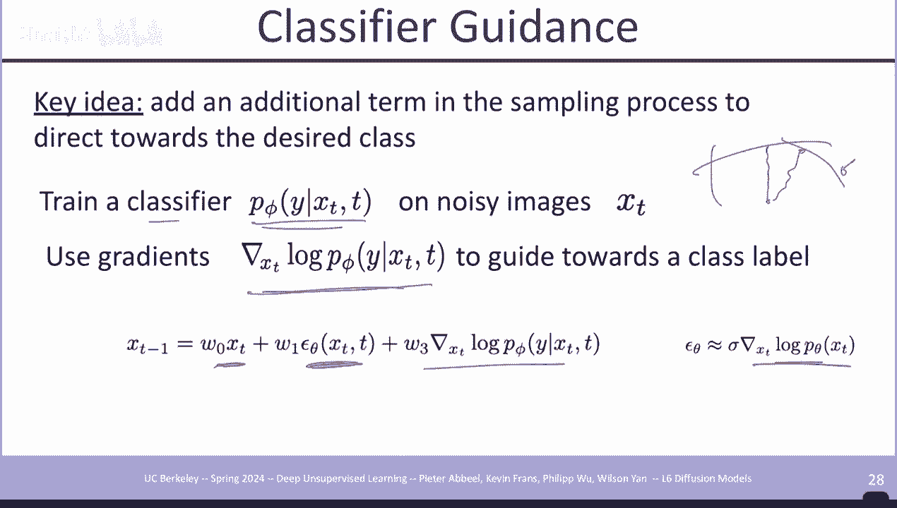

嗯，是的，所以这些是，他们所做的比较，大甘深，左边最大的大，甘模型，嗯这个扩散模型 中间的，训练集在右边，需要注意的是，例如，如果，我们特别在这里添加这个集合，那么，大甘会生成这些，火烈鸟。

它们的配置几乎相同，从远处看，这是一群火烈鸟在一起 而，数据集具有各种，配置，因此显然大到崩溃，到生成的特定模式，而，扩散模型没有，这个。

问题，现在这个分类器指导有助于，生成更真实的图像，但是现在我们需要训练 这个，额外的分类器可能会带来，一些挑战，嗯，这不再是人们，所做的，嗯，然后实际上乔纳森·霍（Jonathan hoe）。

和合作者蒂姆·所罗门斯（Tim Solomons）引入了，一种无需训练，额外分类器即可获得指导的方法，称为分类器，自由扩散指导，嗯，如果你，只看到这个，它会 看起来很像嘿，某种分类器思想。

用于指导的分类器思想，但名称，来自于它试图将，其与分类器，指导进行对比的概念 分类器指导 显式，使用分类器 这里我们将从，分类器指导开始，这是推动它，朝着使您想要的特定类别标签，更有可能的方向。

但是然后我们将，应用Bas，规则当我们应用Bas规则时，我们得到，分类器走出它我们得到，相反方向的分布，现在，给定y的相反方向分布x这就是我们的 我们已经在研究生成器，我们已经在，训练它。

所以我们的 py，变成了 0，这很好，因为，py 的 X 的梯度没有做，任何事情，那里没有 X，然后，我们有一个边际 PX，所以 我们看到的是，通过应用基本规则，我们可以将其转换，为我们已有的分布。

因为这是一个条件生成器，和一个无条件生成器，因此，只要我们并行训练，条件生成器和无条件生成器，我们就可以实现与分类器相同的效果，指导，但无需，训练分类器，因此名称，分类器免费指导嗯，但就。

没有心理信号是什么而言，它，仍然像一个分类器，它仍然，在某种意义上指导特定的，标签，它只是这样做而不依赖于，显式分类 模型，但在，条件和，无条件，模型的组合上，所以你会得到一个推动，不，这些是。

我们符号中的 epsilon，之前，在 Y 上的 X 条件和，无条件，分布中的 X 条件下向正确的方向推动，如果，你' 重新采样，嗯，你经历了，从噪声到图像的多个时间步骤，嗯，然后生成。

你应该迈出的方向，这里是说你知道更多，生成，更像我的类条件，样本的东西，我正在尝试 生成 um，但然后减去它，因为，记住在这张幻灯片上，无条件被，减去，它使您远离，通用样本并将，其拉向特定类别的样本。

因此，它在这里被减去，所以这是，这里的负号，然后如果 我们正在，生成一个条件样本，这里是我们已经拥有的术语，我们已经在，尝试生成一个条件，样本，然后是加权，校正，这是，带 c，和不带。

C 的 Epsilon Theta 之间的差异，好吧，我们更新 我们的样本然后，添加噪音并，重复训练呃在训练过程中，你基本上只训练，一个M，因为你不想，训练两个神经网络嗯只是，有时你从。

输入模型的内容中删除标签或者，另一种思考方式是，你引入，一个 n+1 标签，当你，想要无条件时，你可以输入该标签，然后嗯，这就是你如何训练它的一些运行，我的意思是一些更新是，有条件的，其中一些是。

无条件的，否则 一切都是，一样的，嗯，当你去嗯越来越，多的指导时，你会越来越敏锐，地集中在那些，极其代表，特定类别的事物上嗯你也可以，在这里看到这一点嗯在某种意义上你也得到了，甘斯倾向于的东西 你是否。

专注于该类中最具标志性的，示例，并且，多样性较少，因此这里需要进行权衡，这是一个调整参数，有多少，分类器免费指导，你真的，想要你投入的越多，就越，真实，但也，你所获得的结果的多样性较少。

所以这里是非引导的，你会得到，很多多样性，但事情看起来并不，像哦哇，这看起来像一只你知道，超清晰呃真正的狗，然后，你越受引导 嗯，它看起来越，像一只真正的狗，但它几乎，总是同一只狗，几乎，相同的。

姿势这是另一个例子，嗯左边，是非引导的柯基犬在各种，情况下嗯然后右边是引导的，这就是全部 这些特写镜头取决于，你想要什么，有时也许你，想要右边的结果，有时你想要左边的结果，这可能取决于你的用，例。

这就是我刚才谈到的图形化的东西，记住初始分数，有效衡量 事情有多现实，随着，越来越多的培训和越来越多的，指导，它会变得，越来越好，越来越，现实，但是 FID 也，衡量多样性以及你想要，低分的地方。

呃开始变得越来越好 更糟糕的是，因为你，有越来越多的，这种情况，所以实现分类器指导的非常简单的方法，是进行无分类器，指导，因为你只需要呃，仍然生成一个生成器，你，不需要任何鉴别器，只需一个。

条件和无条件生成器，你可以这样做 在同一个，模型中 好吧 Glide 做了什么 滑翔然后，说 好吧 这太棒了 这些扩散，模型有点工作 为什么我们不只是，根据文本而不是。

类标签来调节它们 现在 35 亿个参数，嗯对于更高分辨率的模型 一个，额外的超级 分辨率呃扩散，模型，所以它分为两个阶段，首先你，学习从文本到图像 64x 64，然后你学习从 64x 64 到 256。

× 256 um 这个扩散指导，现在带有标题条件而，不是类条件 um 尝试了剪辑引导，扩散 这意味着，剪辑引导扩散是什么意思，这就是你说的，哦，我希望我的东西看起来更像，剪辑的东西，与。

我想要同样类型的。

渐变想法的类相关联，嗯，效果不太好，嗯，我想更多 简单的。

事情，这是第一次有，可能呃只是生成，相当广泛的东西的图像，看起来呃相当不错嗯很兴奋，看到这个这正在成为可能，嗯你可以通过擦除来用它进行绘画嗯，有些东西，然后嗯，你知道，给一个标题，因为你可以在。

东西上添加噪音，然后我会让它，满足你的标题，同时，希望保留，图像的其余部分，或者你可以冻结，图像的其余部分，这样你就可以 不是真的呃改变。

它嗯更多的例子，你可以通过，这种方式逐步构建场景，通过将，需要，添加噪音的东西标记出来，然后用一种，满足你的，标题的方式添加噪音，所以这是这里的指导，正确的分类器免费指导，标题上的条件和无条件生成器。

微移和剪辑指导之间的区别是，查看剪辑是否与，分类标签一起使用，但它恰好不起作用，更多示例来显示，其，效果如何 嗯，从那里开始，实际上有，一系列模型，呃，部分和并行地出现，其中一个。

与 Glide 并行出现，然后是 Deli 2 和，3 个，嗯，让我们来，看看这些模型，所以，Dolly 一个，嗯，我为什么要报道 之所以在这里，是，因为 Dolly 2 和 Dolly 3 是。

扩散模型，但 Doly 1 不是，扩散模型，但我只想，提一下它存在，是的，我，质疑，Laize，因为我们知道我们想要好的，图像，我们想要多样性，比如，增加距离，最终想要，这样 他们看起来并不完全相同的。

兽人，是的，这是一个很好的问题，我们可以做得更多吗？你知道我们是否可以避免，专注于，特定类别的特定图像，也许，我想到的方式就是，它的方式 解决方法是通过进行，标题调节而不是类，调节，因为一旦您拥有。

丰富的标题，您就可以，更详细地描述您，想要的内容，因此现在您可以争论，相同的标题，我仍然想要很多，多样性，您 可能想考虑，一下，嗯，但至少，嗯，你知道，你可以控制以，你想要的方式改变图像。

并且你可以创造，你想要的多样性，因为你，这样做，所以达莉亚所做的实际上只是一种，自我攻击 模型 你对图像进行标记，你对文本进行标记，然后你，就自动从文本到，图像 嗯，每个图像只需几个额外的，标记 8。

000 个额外的标记，嗯，每个图像的可能标记，这就是我们，之前在 vqv 几场讲座中介绍过的空间 是它的一个变体，使用 Gumble soft Max 而不是，直通 gr 估计器，这。

使得它能够完全针对 VA，目标进行训练，这对于 vqv 来说并不完全正确，所以它在某种意义上更干净，但它是相同的想法 嗯，然后是 2。5 亿个文本图像对。

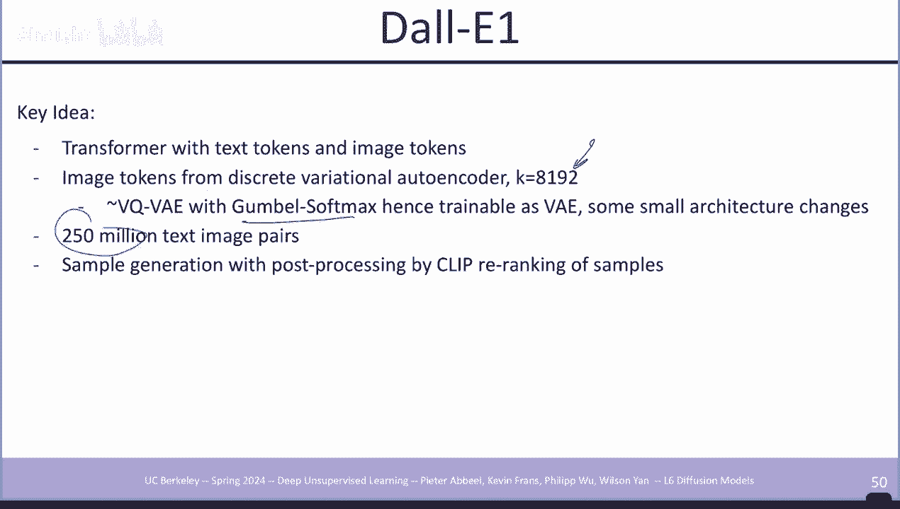

然后他们最后在这里做了一些重新排名，所以一组乌拉尔在，树附近，这里是生成的图像，顶行是基于剪辑得分的 512 中最好的，底行只是 最好的，一个，所以你是否幸运，所以，你在这里看到的是嗯，他们研究的。

是图像质量没有被，认为像 Glide 模型一样高，但，在这个模型中实现的多样性更高，嗯，组合许多概念的转换能力，这是，从中出现的令人兴奋的事情之一，人们之前没有真正见过，例如，嗯，让我们看看，一只穿着。

圣诞毛衣遛狗的小刺猬的插图，这，可能是 不存在，但它可以以某种方式将，这些想法重新组合成，正在生成的图像，并且非常。

令人兴奋地看到，Dolly 2 第一次。

实现了图像生成的成熟，我在开始时给出的猫示例，是 一个 dolly 2 的例子，嗯，它已经成熟了，我想说的是，就，质量和它能做的事情而言，它，在简单性方面并没有真正成熟，嗯，与，今天的模型相比。

doly 2 模型相当复杂，但它是 第一个拥有，从文本创建高质量图像的非常出色的能力非常，高质量的图像他们做了什么他们，说很好我在这里有一个滑翔，模型所以一个文本条件，扩散模型。

解码器但我不打算 只是文本，条件，文本是从，这里进来，它确实进入了，但我也，将实际上将我的文本转换为，嵌入，我将把，该嵌入转换为图像嵌入，我还将条件 这个，图像嵌入和这个文本嵌入，来自剪辑，它是无监督。

图像文本对齐训练方法，可以，生成文本和图像，嵌入，因此他们会训练一些，学习，在文本嵌入和图像，嵌入之间进行翻译的东西，你可能会说为什么它们是，如果应该有，一条线表明图像，在细节上比文本丰富得多。

那么图像，嵌入往往比文本嵌入有更多的信息，并且，这里学到的翻译是，另一种扩散模型，效果最好的是另一种扩散模型，因为它们非常擅长对，多模型分布进行建模，因此您可以从，文本编辑转到。

许多可能的良好匹配图像嵌入中的一个，然后从那里进行，另一次扩散运行以获取图像，那么你可能会再运行一次来，上采样另一个上采样，这种情况下，上采样器中没有条件，为什么你可以使用更多的，训练数据。

如果你不需要标题，来训练你的上采样器，你可以在，任何地方使用任何图像 为了训练你的，上采样器，让我们看看 Wilson，我需要。

很快把它交给你，因为你，有很多东西要讲，让我看看，嗯，这里，是，来自 Dolly 2 的一些例子，他们，实际上也称其为 uncp，因为它是 你真的知道采用，剪辑嵌入并将其转换回，图像，嗯。

你可以用剪辑进行编码，然后，解码和采样，你在这里看到的，是，实际上，一旦你用剪辑对其进行编码，剪辑编码就是，更高级别的语义，因为，一旦 你解码你得到语义，相关的概念，但不是同样的，东西，所以这是剪辑的。

语义级别理解的某种证据，也是处理，你需要解决的多模态生成的能力，因为呃，这是一种语义，理解，而不是一个。

您在，剪辑嵌入空间中的嵌入插值中获得的像素级理解，允许插入，截然不同的事物，但，可以进行良好的，插值，然后 Dolly 3，最近刚刚推出，本质上是说，也许我们只是，需要更详细的字幕 我们的。

图像 我们需要一个更大的数据集和，更详细的字幕 我们的字幕人工智能，系统可能足以，生成详细的字幕，所以让我们，首先建立一个非常好的字幕，系统，在批处理的图像上运行，使用，详细的字幕来训练我们的。

系统 嗯，他们没有在论文中提供大量细节，作为其中的一部分，听起来，他们正在运行某种稳定的，扩散模型，呃威尔逊将，涵盖嗯，但他们并没有真正分享嗯，很多细节似乎确实，表明，凭借其稳定的，扩散，解码器仍然是。

扩散，而不是 VA 解码器，但同样，没有太多细节被，共享，这就是你，现在可以获得的，我的意思是现实主义正在变得 至少相当，极端，我的意思是，在这些情况下你想要什么，你可以提供非常详细的标题，注意。

DI 工作中标题中的所有细节，谷歌有一个更简单的工作，嗯，Jonathan ho 又是，那里的主要贡献者之一，本质上，他们说，嗯，我们只需要以，正确的方式将该文本放大为图像嗯模型。

所以他们只需使用文本编码器，使用语言模型而不是剪辑，或剪辑来生成文本嵌入 类似的事情只需使用，语言模型将文本转换为文本，嵌入文本条件扩散，模型超分辨率超分辨率，并称之为完成，结果，在质量和。

能力上与 open ey Dolly 2 模型非常相似，所以从某种意义上来说，这是，与 Dolly 2 相比，架构更简单，但是嗯，是的，这些东西只是，并行开发的，他们的一个关键观察结果，是。

当他们决定使用更大的，模型时，他们意识到，扩大规模的主要好处，当时是在更好的文本 Tings 中，而，不是更好或更大的扩散，模型中，所以人们没有使用，足够好的文本 Em betters uh 来获得。

最佳质量的结果，um，他们引入了一个高效的unet，uh，这意味着你可以，在 与以前的模型相比，低分辨率对，事物进行了更多语义处理，这里是图像结果，再次与 dolly2 非常相似，类型。

结果也可以很好地处理文本，嗯，Dolly 2 处理文本的效果不佳，但 Dolly 3 可以 文字，也更好，威尔逊，我将在这里给你，用你的手指滑动，然后，你可以写，是的，好吧，比上次好，呃，好吧。

所以正如彼得提到的，我将，主要讨论一些 更深，层次的东西，比如它的某些部分，然后凯文会呃谈论，它的其余部分，嗯，所以我们将从扩散模型的，一些更基本的，东西开始，比如，采样噪声时间表以及嗯。

事物是如何参数化的 我将讨论，人们以前使用的具体神经网络架构，现在也一样，好吧，所以我想，扩散模型的一个独特之处是，在，训练过程中，几乎每个人，大多数人都使用，相同的目标以相同的方式进行训练 彼得谈到。

了嗯，但主要的区别是在，推理过程中，当你实际上想要对，视频或任何，你实际建模的数据进行采样时，呃，有，很多选择，有，很多关于不同类型的，采样器的论文。 但现在我可能，只介绍一个。

名为 ddim 或 DM 的算法，主要是因为它，可能是最容易，实现的算法之一，而且，就采样，算法而言也最容易理解，所以只是开始 我，可能会做一些轻微的符号，改变，呃，只是为了让事情变得，更简单一点。

所以在右上角，所以这里这，只是我们在 ddpm 中的标准 D 噪声，然后我们将，替换为变量 所以呃 Alpha T 和，sigma T 是这样的，然后 G，噪声步骤就是 XT 等于。

Alpha t xot 加 Sigma T，Epsilon 然后对于 D 采样器，所以，反向过程的，工作方式基本上就像，XT 减去一哎呀，你会得到像，XT 这样的函数，然后你应用，两次，直到 T。

等于 0 呃，然后你就有了，你的图像或视频或其他什么，以及，这里更新的方式 工作，实际上非常，直观呃所以这里就在，右上角，这只是，我原始方程的重新排序，因为，最初它就像 XT 等于，Alpha t。

加 Sigma T Epsilon 只是洗牌一些，项来隔离 X 不，嗯，这正是这里的内容，所以这，是你的扩散模型，在这里输出 Epsilon，然后嗯，你可以在，这里应用这个方程来估计，所以。

这基本上是 X 帽，所以这就是说，我得到了呃我的噪声图像 在，扩散时间步 t 我计算 Epsilon，然后我可以，像 Den 噪声的相反格式一样运行它，以，估计原始 X，帽子，不是 um。

更新的制定方式，基本上是对这个 x 帽子结的一些等待，所以 Alpha T 减一，然后这，有点像，你的模型预测更新的方向，所以加上，Sigma T 减，一，然后这将等于，XT 减，一，然后你多次应用此。

更新，直到 你，得到 T 等于 0 呃另一种，思考 DM 的方式是你可以，想一想呃把它想象，成一个类似的微分方程，然后 DM 使用最简单的，像基于 Oiler 的求解器呃 进行，相反的，过程。

然后 DM 的一个好处，是你可以选择，不同的采样步骤，例如，你训练的大多数扩散模型都是，1，000 个去噪时间步长或 4，000 个，即使，我是 8，000 um，所以如果你想喜欢。

采样的标准方法是您执行，8，000 个类似的扩散反向步骤，但对于大多数其他采样器，您可以灵活选择，您可以，像跳过步骤一样，这样，您就可以一次执行 20 或 30 个步骤，如果你的扩散，是第 3 步。

并且每 20，步，那么你就只有，50 个实际采样步骤，所以，权衡是，步数越少，速度越快 这是因为，你必须通过你的模型进行更少的四遍，但是，结果是你的采样器你，的样本可能会更糟糕，如果。

你有更少的样本或者你有，更少的步骤，所以这就像 a 对于，您想要执行多少个采样步骤，并没有真正直观的理解，因为，您可能只想尝试，最初的所有步骤，从 10 到，最大步骤数，然后看看，质量如何。

几乎总是这样 像，50 这样的东西可能会，起作用，所以这本质上是不同的，样本质量不同，时间步数不同，所以你，可以在时间步 t 或 10 个，采样步骤看到汽车，在这里有点模糊，但随后它会变得更。

清晰 当你有更多的，采样步骤时会更清晰，但在足够的步骤之后，它通常基本上已经足够好了，在这种情况下，如果，你只是想玩一个，模型或其他，好的东西，通常 50 是一个很好的开始数字 所以这是一种采样算法。

我也想主要，讨论它，因为 DM 对于，我将要介绍的其他内容也非常重要，它用于编辑图像和，视频以及类似的内容，但，下一部分是 略有，不同，它触及了，扩散模型的实际目标，因此标准 ddpm 基本上。

就像 L 简单损失是 Epsilon 上的损失，所以这正是，Peter 展示的损失 Epsilon 减去 Epsilon，hat 的损失，XT，你可以做的另一种不同的方法是。

除了在 Epsilon 上进行 L2 损失，有些人也尝试过的是，你可以，在原始图像单元上进行 L2 L2 损失，所以而不是这样，而不是，unet 预测，用于对图像进行噪声处理的 Epsilon 现在。

从噪声图像中预测原始图像，因此这仍然是，XT，并且，Epsilon 和 X 之间这两者之间存在关系，因此如果这是您的原始去噪，方程，您可以做另一个，隔离 X 结的事情与 DM 所做的非常相似。

然后你可以拿，这个，然后你基本上可以将，它插入那里，所以对于这些，这里是 Epsilon，这是 Epsilon 帽，这是唯一真正唯一的，区别其他一切都是一样的，呃然后如果你对。

事物周围的一些术语进行洗牌就像，这样取消然后你可以，分解出西格玛T和阿尔法T，你，在这里得到这个然后如果你想移动，在另一边，底部，只是做倒数，所以如果，你确实想在 x bace 上进行损失训练。

这基本上相当于，在 epsilon 空间中训练损失，只是，根据时间，步 T Alpha T 进行轻微的调整 在 Sigma t s 上，这里的另一个术语有点，像信号与无，信号之比。

因为这里 Alpha 是你在，等待 X 结，而 sigma 在，Epsilon 上，所以嗯，所以像 T 等于 Z，你有像 Alpha t 等于 1 并且，sigma T 等于 Z 所以你的 s r。

是无穷大，因为没有噪音，然后在 T 等于最大 T ，反之亦然，所以在这种情况下你的 SNR 将为零，所以这就像 另一种情况是，如果，你阅读扩散文献，他们将，这种等待称为 SNR，或者如果我，记录它。

它将是 log Sr，um 之类的东西，好吧，所以是的，有 Epsilon，空间和 X 空间，还有一个，有点奇怪，你有，问题吗？好吧，但是我最好涵盖一下，因为它可能是，几乎所有模型中使用的最流行的一种。

对吧 现在嗯，所以，这个新的修复工作的方式是，在，替换东西之前我们有原始的权重，所以我们有根 Alpha bar T 和，根 1 减去 Alpha bar T 然后所以，这被限制为像这样。

遵循这样的属性 Sigma，oops Alpha T Sig t s 等于 1 或者，你也可以将它们视为 2D，坐标，它们只是，单位圆上的 L 或单位圆的一部分我，猜，嗯和嗯，是的，所以。

基本上不是基本上这样做 就，时间步长 T 而言，你可以，像极坐标一样这样做，你可以用，f 而不是 T 来重复所有内容，所以这基本上就是，这个向量的角度，嗯，是的，所以现在，for 过程就是这个余弦。

这只是过去的 XT 等于 uh，Alpha t，并且这只是 pi 的余弦，这只是，f，um 的 s 然后他们所做的是，他们只是取，导数来定义 速度作为，这个术语，就像，上面的方程的标准导数一样。

带有三角函数，然后如果你做一些数学，计算，DM更新规则，实际上可以是我认为，他们这样做的主要目标是这个 确实是一件，很奇怪的事情，一开始并不是超级直观，但最终的，结果是，呃，它确实，大大简化了更新规则。

所以，这是 DM 更新规则，与之前相比，它就像呃很多东西 更，复杂，比如 XT 减一等于，Alpha T 减，一 XT，减，Alpha，T 之类的东西，呃有点，混乱，但是是的，所以现在它只是。

这里 Delta 的函数，所以这里 Delta uh z f t 的余弦就是，x f t 然后 um 加上，您预测的 V 所以在这种情况下您的，模型是参数化的，它们不会预测。

Epsilon 它不是它不是它的目的，是预测这个 V 就像速度，项一样，它输出，是的 5 T 负或而不是负，一个它就像 Delta 一样是，差异而不是，一的差异我，想这就是我描述。

它的方式是的所以我的意思是在，实施方面的培训方面，它就像它背后的数学，非常复杂但就术语而言，实现的过程非常简单，与，您的其他目标几乎没有什么不同，其他目标的代码，这仍然是 XT 嗯，这个。

neonet 它不会改变，唯一的，区别是您，计算的目标不同，它，遵循这个 公式呃所以你仍然，需要你仍然计算Alpha T，Sigma T um并且你仍然对噪声U进行采样，但是目标不是。

Epsilon或X而不是你只有呃V，这是这两个函数的这个函数是的，所以 类似于 Epsilon 与 X 空间的，关系，或者 Epsilon 空间，与 X 空间的关系，这个 V 空间中的损失，也与。

um xpace 相关，您可以遵循，非常类似的模式，执行 X 操作，而不是 um 或，抱歉，是的，您写的地方 用，X notot 表示的东西，然后你可以，在这个术语中再次像这样替换呃项取消，然后你。

基本上得到这个，然后如果你在，这里取倒数，你也可以得到，这个，这基本上，就像 1 除以 Sigma t^  2 然后利用这样的，事实：如果平方，它们的总和为 1，让我们做 Sigma，t^2。

这样它就等于 1，加这就是这个系数，这与，我猜想在这个中的原始损失的等待本质上是不同的，它，确保呃，损失总是至少像，等待一个，无论，信号比与 Epsilon，空间相比如何，这有点像等待，SR，确切地说。

范围从，零到无穷，大几乎呃 是的，所以在实践中，vspace，可能是，我见过的所有方法中效果最好的一个，它有点，微妙，并不像一个实质性的，实质性差异，但这来自，呃，我认为视频扩散模型论文，呃。

所以这就是 最上面一行，是输入帧，然后中间，是 Epsilon 预测样本，最后一行是 v，预测，就像你必须，真正查看它一样，但，我认为可能在两者之间有更少的伪影，这两张图片可能是最。

明显的我不知道你是否知道你是否，可以在，幻灯片上看到你们是否能够看到，差异，这是非常微妙的，它就像是稍微有颗粒感的，Epsilon 嗯，但我认为因为像 对于，每个人来说，这就像一个为什么不我，猜所以。

几乎所有论文几乎所有我，要谈论的论文中的90％，最终都会在空间中进行预测，嗯是的好吧好吧，最后一部分好吧所以这一，部分 我将继续讨论这是一种，微妙的问题，但这实际上，令人惊讶地产生了很大的，差异。

这是大多数，人想要使用或实施的东西，如果他们正在训练扩散模型，那么主要问题之一 在这些，扩散模型的常见噪声表中，相关的一个是，原始的，所以原始的是，人们使用的一般噪音表，所以。

这里的 x 轴是 Alpha bar 或 Alpha t，正如我所描述的，所以这个范围从，它应该 be from range go from go like，go 单调地从 1 到 0。

然后你会注意到一些奇怪的东西，因为它应该在，最后一个时间步上以零结束，是在，扩散过程的最后一个时间步你的，信号应该是 完全噪声，就像，原始信号中不应该留下任何东西，但在这种情况下，这些，噪声。

安排了这条蓝色曲线，并且，在实践中类似于零以上，它，非常小，所以它可能，类似于，0。06 或对于不同的安排，可能就像 oneus 5 或，一些非常接近于零的东西，但这实际上是一个相当，大的问题。

人们发现，就像如果你按照，人们已经做过一段时间的时间表来训练它，你仍然会 得到好的样本，你，仍然会得到样品，嗯，但是，通过解决这个奇怪的问题，你仍然可以获得相当大的改进，以及它，成为问题的原因，呃。

有一张幻灯片吗，哦，好吧，没关系，好​​吧，我会说话 关于下一张幻灯片，嗯，所以我想噪声表，实际上没有以零结束的原因之一部分，是因为在，扩散的最大时间步长，至少在 Epsilon 基本损失的情况下。

从技术上讲，它应该是 Alpha，T 等于 Z，sigma T 等于 1，所以你的数据应该被完全，剔除，并填充并，替换为随机的 goua 噪声，但你的目标，变得，不太有意义，因为。

在这里你只有这个这个 只是，Epsilon 所以你的网络会，说我想预测 Epsilon 给定，Epsilon 这是一项非常容易，学习的任务我的意思是只要你的模型，学会成为一个恒等函数，它。

基本上总是会正确的，而且，如果 如果你训练的，话，嗯，所以这不是一个非常有意义的，任务，但是我们，想要解决这个问题的原因就是为什么他们，需要像这样不为零，像，1 eus 5 这样的东西。

这就像 1 减去 1 eus 或，或或或非常接近 1 的东西，所以那里有一点信号，仍然会产生噪音，但主要，问题是这在训练期间没问题，但在推理过程中我们，实际上总是 从 gou 噪声开始，我们从随机。

正态分布中采样，然后我们想要，去噪，但这有点超出，训练的分布，所以，它本质上最终要做的是，网络尝试进行，类似的推断 你正在采样随机的 Gan，噪声，但在推理过程中，它，总是认为，这里仍然有一点信号，嗯。

即使它可能是一个非常低的，等待，它仍然试图解释，某种类似全局信号的​​信号，其中，没有，然后在，一定，程度上弄乱了采样过程，所以基本上这篇论文，所做的是嗯，他们只是强制执行它，所以，橙色是他们的模型。

所以他们只是将，时间表转移到实际上，为零 在这里，这实际上是零，然后我提到的另一个问题，是，你此时不能释放，Epsilon 损失，因为，目标有点毫无意义，所以，他们在这里所做的呃是他们只是使用。

vspace 损失，所以对于，vspace 如果你把 T 处的所有东西都，等于最大值 t uh 你就会，得到这个有意义的目标，所以它基本上是说给定随机，噪声只是预测，uh 原始，图像在这里你的意思。

是好吧是哦等等呃等等实际上，对不起让 我哦不不抱歉这应该，是，嗯让我等一下哦，好吧有 Epsilon，减去，我必须仔细检查呃我，想目标应该是预测，X 结但是是的，我会说这是减去，xot 这是 有点奇怪。

我稍后会仔细，检查，但是是的，嗯，所以，这篇论文的一般过程，是呃，它非常简单，所以你只需做，重新缩放的事情，就像，我之前展示的，噪声时间表的橙色曲线一样 以 Zer，SNR 结束，然后你可以采用你的。

扩散模型，如果你用 Epsilon 训练它，你可以对它进行微调，以进行，类似 vspace 预测，改变理论化并不是那么大的事情，然后你可以找到 tun。

vspace 以及噪声，时间表，他们对某些模型做了此操作，因此为了稳定扩散，在 epsilon 空间中进行了训练，因此他们，必须针对 Zer ASMR 和 V 进行 f 调整，或者好吧。

我实际上不确定什么，迭代 他们使用稳定的差异，因为其中一个版本是 Epson，space，然后他们在 V Space 中找到了两个，所以不确定，但这，基本上是结果，嗯，在某种意义上，它几乎看起来像。

多样性的变体 已经，减少了一点，或者也许，现在也更忠实于提示，嗯，但总的来说，与主食扩散本身相比，结构和，连贯性（例如图像的全局连贯性），肯定更加清晰，因为，这里有两个喙。 不清楚这背后的东西，是什么。

我认为更重要的是，这是。

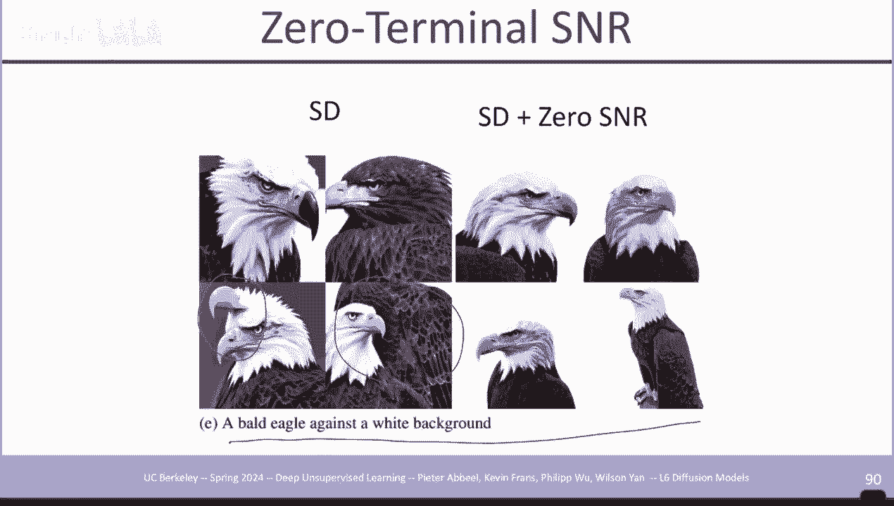

更重要的视频，我在其中，看到你可以看到更大的，差异，所以这是来自元呃的鸸鹋。

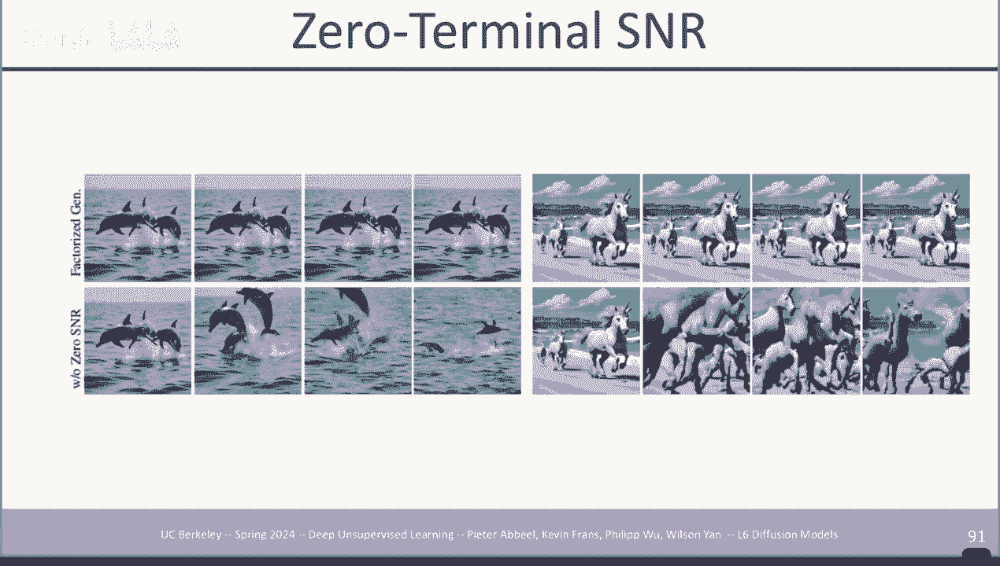

视频，所以这里最上面的一个正在使用，Zer SNR 和底部底部没有，所以帧中存在类似的差异，就像这些海豚在这里一样，它们开始有点转变的地方不太连贯，呃，这里更明显，不清楚，到底发生了什么呃哪里。

视频有点，疯狂，是的，与这里的顶行相比，它，非常流畅，非常连贯的东西，这样给，时间，好吧呃，所以这是一些基础知识和，一些扩散呃细节现在，我将开始谈论不同的，架构和类型 我想，不仅仅是架构，而且就像呃。

设计这些，图像或视频生成，模型的哲学所以彼得我想我，和unet简要讨论了这个所以大多数，图像或视频的扩散模型，现在使用基于联合国的架构嗯，通过一些小的修改，比如呃，也许在这些较低的层中。

你有一些自我关注，然后你还包括，像扩散时间，步长嵌入这样的条件，但除此之外，它们，都非常相似，然后还有，很多东西需要改进。 玩弄像呃，每层需要多少个过滤器你，下采样的速度有多快，你下采样不同。

分辨率的积极性呃类似的东西，调节，在这里工作的确切方式是你只有你的，时间步长T所以 这，基本上就像一个整数，然后呃，你，通过一个与位置基础非常相似的正弦基础来输入它，或者与。

Transformer 正弦位置，Bings 中的几乎完全相同，以获得一个，向量，然后你只需通过一个向量输入它，小，MLP在这里得到一个条件向量，然后你把它输入到，单元中，一旦你进入，单元。

我已经看到了两种通常两种，不同的方法来做到这一点，最简单的方法，是，呃所以H这里就像你的，卷积 特征网络或或，特征，所以它就像高度乘宽度乘，维度然后你的嵌入，只是一个单一的向量你可以。

嗯基本上单一向量然后最，简单的方法就是你只需添加它，这样这就会发生在每一个，像 网络中的 res 块，因此，如果，您的网络有 20 个 res 块，您将看到此操作 20，次，嗯，也使用了一些东西，我。

认为更，频繁的是您使用，条件作为参数来，调节您的，功能，以便您 在你的 H 上有一个组，然后你按照时间步长 Ving 的函数进行缩放和移位，所以这就像一个，这就像一个线性，层所以这就像一个线性层，投影。

然后这也是一个，线性，投影，然后你有新的，参数，好吧，有点像，之后的一些工作，问题出现了，因为过去的模型，比如，ddpm 最初是在像素上的，那么，自然的问题 你知道。

我们在 VQ Gan 上看到的所有工作都，像这样，我们能否让这个像素更，高效，直接，在像素上做事通常有点，昂贵，我们在这里可以做的而，不是学习 VQ Gan 是我们 可以，学习一个与。

我们两周前介绍的完全相同的 vae ，唯一需要注意的是损失，是相同的，但我想在某种意义上，它就像一个 beta ve，其中 K，损失非常低，就像一个，6 基本上，几乎就像 incon 一样，它很，重要。

它说，基本上它说就像你可以一样，你，可以按照你想要的方式设置 Z 结构，但不要让它太疯狂，本质上就像嗯，使它大致可能是它 粗略地保持事物，可能有界可能可能不会有，超级奇怪的尖锐不连续性，或行为，嗯。

这就是这个，想法，但除此之外，它非常，类似于架构方面，它，会非常类似于 VQ 嗯，你有编码器， 然后是 Z，然后是你的解码器，呃，但唯一的，区别是，在这种情况下，Z 是，连续的，这也很重要，我认为。

与自动攻击模型相比，这也是扩散模型更有用的方面之一 两者都可以学习非常，复杂的分布，但是，扩散模型的主要好处是，你不需要，谨慎的数据，所以就像我想喜欢呃，模型一样，就像机器人一样。

参数化的机器人手臂的运动 通过，某种像连续的，联合力量或速度或，类似的东西，这有点，像连续数据嗯，如果我想，用自动攻击模型进行建模，我，必须弄清楚如何，让它以某种方式离散呃这，取决于 你的模态可能。

有点困难呃或者像不明显如何，准确地做到这一点嗯所以，扩散的好处是，在这种情况下它并不重要，你，实际上可以直接对数据建模，嗯我认为为什么 它可能会更有，用，因为它在其他领域看到了更多的关注，在这些领域中。

如何实际制作，离散的东西并不那么明显，这就是 L，融合模型架构，所以这，是你的，Vee，然后这是 本质上只是 ddpm 我，猜或者喜欢也许呃来自开放，人工智能的模型，比如 ADM 模型我记得。

它被称为 U 但只是，某种通用扩散模型，它，是什么并不重要，嗯，这两个模型很漂亮 非常，独特，所以一个不依赖于，另一个呃，事实上，现在在，你学习了你的V之后，你，在空间中的维度l要低得多，然后。

你可以对事物进行更多的建模，呃，就像，更便宜的那样， 之前，可能是 256 x 256，现在是 32x 32 呃，而且，它的失败率要高得多，所以与 VQ Gan 一样，仍然存在速度，质量权衡。

我的 Vee 可以像我一样，可以超级积极地降低，我可以采样的东西 将其采样到单个，向量呃，就在这种情况下，您的，重建开始，重建，就像您的，重建保真度开始，下降一样，但如果您的东西被超级，压缩。

那么您也可以拥有一个，非常像，扩散模型的非常便宜的模型 另一方面，如果你的 vae 没有真正压缩，那么多，可能只是降低样本，两倍，或者甚至可能，降低样本，那么你的，扩散模型的结果会更困难。

会更复杂 模型的分布，它也会是更多的失败，密集型呃这样的东西，所以它，有点像一个最佳点，本质上我，认为在 ldm 中它类似于 ldm，48 所以这个训练曲线，本质上是呃 o 在。

每个训练过程中 模型他们只是，每隔一段时间就采样一次来，测量 FID，在这种情况下，FID 越低越好，所以，你希望曲线基本上，尽可能低，就像这些，曲线通常对应，于 就像我猜中间的三个。

是 ldm 1 和 2 的地方，因为我，认为这些实验也受到失败次数的，限制，所以所有模型都有，相同数量的总训练失败次数，所以我假设他们，为 ld1 制作了模型 两个较小的只是，因为它们在。

更多像素上运行，因此它们的，计算成本更高，因此它们，无法缩放得那么大，呃，与，您可以建模的压缩程度更高的模型相比，嗯，您可以拥有更大的模型 因为，它更便宜，就像，您添加的每个参数的失败次数更少。

然后您可以将其做成，更大的模型，例如 ldm 32，他们将，采样率降低了 32 倍，所以，可能会下降到 8 x8 呃，潜在尺寸嗯但是你的你的，生成质量在这里你可以，在这里看到某种高原嗯可能是。

因为它可能受到，原始图像本身的重建质量的限制，然后在右边我们有，采样，吞吐量，嗯，我认为是的，基本上每种，颜色的每个点都像，不同数量的采样步骤的模型，所以，在最右边，采样步骤非常少，因为你有。

更高的吞吐量，而在最左边，你会有呃 更多的采样，步骤，因为这样就需要，更长的时间来生成每个图像，但是，这些是，这里的更多结果，其中红色和紫色通常，表现得很好，或者绿色、红色和，紫色，所以大约是。

4 左右 到 16 但这是，你通常喜欢玩弄的东西，这是一个权衡，比如，我有多少计算量以及我想要得到多好的结果，呃是的，好吧稳定扩散，呃我确定 你们中的许多人都听说过，甚至尝试过使用这个模型，本质上是。

ldm ，几乎与，我刚才谈到的 ldm 论文一模一样，但在，更多图像上进行文本图像生成，你有一个 VA，它的采样率降低了，8 倍 它可以支持你可以将，样本 2 56 下降到 32 x 32 甚至或。

更一般地呃我认为本机，支持 512 个下降样本 64 64 呃它，仍然是具有自我，意图层的单元架构，然后它们，通过添加额外的内容来实现呃文本调节，每个自注意力层之后的交叉，注意力层和那些交叉。

注意力层只是从，图像特征到文本特征，对于这个模型，我们只是使用剪辑文本，编码的文本特征，是的，你可以得到一些非常，好的 这，是两年前的图像，不久前就发布了，但是是的，从那以后它就变得更好了，这个是。

最近的，我猜是来自，他们发布，稳定视频传播的同一家公司，或者呃 是的，稳定的，视频扩散，嗯，这个，训练方式的核心相当简单，它几乎与稳定扩散相同的模型，他们只是，从中初始化它，主要问题是稳定。

扩散对图像进行操作，所以它就像，二维卷积呃空间，注意这样的东西，那么，问题是如何将其扩展到，视频，视频本身只是，一个堆栈，它只是随着时间的推移而堆叠的帧，所以大多数论文所做的。

就像 SB 在这里所做的那样，就像一些，其他论文，本质上我们，能做的是你可以，在中间插入时间层，这样在，每个呃 2D com 之后，你就会像一个 1D comve，随着时间的推移，在每次空间关注之后。

你可能会随着时间的推移而有另一个关注，甚至可能就像 充分，关注整个，视频，嗯，然后然后是的，你，就这么做了，所以时间层，是从头开始初始化的，空间层（如 2dcs）都是，从原始文本，图像模型开始初始化的。

你只需采用这个模型，你会发现在你的视频数据上进行调整，这可能是，SVD 关注的核心内容之一，这是一种，独特的，因为他们的整个文本到，视频数据集基本上是完全，综合生成的，至少是。

他们刚刚抓取了一堆的文本部分，呃在线视频呃没有文本标签，然后他们只是使用不同的，字幕呃来标记每个视频，然后在像剪辑得分这样的大量数据过滤之后将其用作数据，基本上，这个文本。

生成文本对应的准确度如何 到视频，所以你想保留较高的，Optical Flo flow 分数通常有助于，过滤掉所有没有，运动的视频，你知道也许这是一个视频，有很多人们。

在网上做 PowerPoint 演示的视频，所以知道类似的人的图像甚至视频就像呃是的，就像在，静态图像之间做幻灯片一样，你想排除所有这些，因为，你想生成一个有趣的，视频，所以你想要具有实际。

运动嗯美学分数的视频，我想 如果它，看起来不错，它有点主观，并且难以测量，但我想人们，已经收集了他们的数据集来尝试，测量或尝试收集，具有高图像的数据集，基本上，看起来不错，嗯，OCR 可能是，如果他们。

可能的话 或者可能不想，在他们的pip中包含文本，或者类似的文本生成，或者类似的图像生成，在他们的管道中包含文本是的，我想另一，点值得一提的是，呃，就像这样的一般火车训练，范式并不新鲜，正如我向。

SVD 提到的，唯一的区别是与，之前的一些作品，比如来自 Facebook 的 emu 视频，或来自 Google 的 lumier，它们，也都从文本到图像，模型进行了初始化，但在这些情况下，他们。

实际上对其进行了一些训练，不同的是他们添加了，时间层，但是他们，用冻结的空间参数训练了整个模型，所以他们只训练，那些时间层，嗯，是的，我有两个，问题，你说他们只是将，空间内容本身预先训练到基本上。

每个人 框架就好像它就像一个，图像模型一样，然后在他们，预训练之后将其冻结，然后他们，训练时间方面，这样他们就，不会联合起来，这是针对其他，论文的，是的，他们不这样做，或者他们，不这样做 只是因为它。

可能让我们说在元有一个，完整的团队正在致力于设计一个，非常好的文本图像模型呃，他们已经收集了很多好的数据并且，他们已经制作了这个非常好的模型所以，现在视频团队他们 将采取，这一点，然后他们将添加。

一些层，冻结除新层之外的所有内容，然后在视频上进行训练，然后我的第二个问题是，你，知道相比之下，真正的注意力如何，这就像真正古老的，竞争方式吗？ 就像数据一样，但没有人真正使用，它，所以很好奇。

呃 1C 正在使用，我想它，对于局部时间依赖性很有用，通常它只是两者，它们都有卷积和。

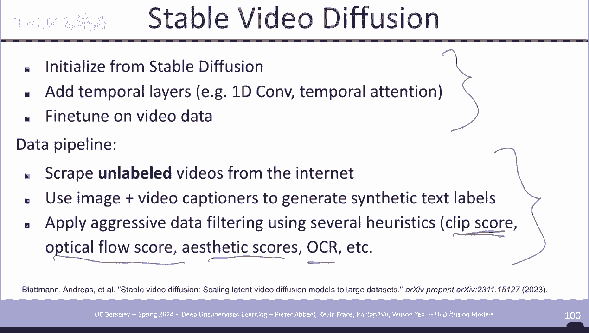

注意力，是的，嗯，这些是视频，我猜哦，我，猜视频不会 不会玩，他们，不会在PD中吗？好吧，我想你可以想象，它会，为这些移动，这并没有太大的不同，就像是的，稍微移动，一点，场景保持不变，这不是，很多事情。

发生，嗯，好吧，好吧，所以 这就是，人们，训练这些模型的一般范式哦，这里让我们，学习一个带有潜在空间的 vae，然后让我们在，这个分布上训练一个模型，所以它有点像，一步生成。

人们探索的另一个领域就是使用，级联模型，好吧，基本上是，逐步生成的，这就是，彼得提到的想象一下，他们，有一个基本模型，然后是，不同的超分辨率模型，可以，生成更大的分辨率 你，可以将其解释为一种潜在。

变量模型，其中较低，分辨率的图像在变量中的纬度不同。

所以是的，我的意思是，这些的架构这些非常简单，你只需，训练一个无条件模型，这，就像标准扩散模型，一样 一个无条件的或仅以，文本类为条件的单元，其余的只是超级超分辨率，模型，然后对于这个呃，架构非常简单。

你可以，只是呃对于一个无条件模型，你只需输入 epsilon 呃或者抱歉，输入 噪声噪声视频或，噪声图像呃，然后如果你想以，低分辨率为条件，你所，要做的就是，使用某种上采样方法对它进行上采样，使其大小。

与你的，输入连接起来相同 就像，提到的 Channel dimens 一样，然后你可以，通过模型提供它，并且知道，其他一切都是，相同的，嗯，这些 casc 模型的一个真正好的事情是，特别是如果你的计算。

预算是我只有 X 可用的 GPS 数量。

嗯，那么你，所做的就是将这个，问题分解为许多独立的小，部分，所以每个模型，嗯，所以，也许如果你想训练整个，模型来生成 256 个模型，整个模型可能必须有 30，亿个参数，但也许，为此，你可以将其分配。

为每个分辨率 10 亿个模型，或者这里可能有 20 亿个，模型，或者这里有 20 亿个参数，就像 0。5b 像 0。5b 或，其他什么，然后每个，模型本身更易于，训练，您还可以进行更具体的，超参数调整。

因为特别是，对于文献中的扩散模型，它已经被证明像更高，分辨率和更低分辨率 需要，非常不同的超参数，就像，噪声计划之类的东西，对于每个分辨率，您想要添加多少噪声，通常都非常不同，所以如果您。

像这样分解问题并使其，更易于管理，但这有点，更烦人的是，因为你必须，训练所有这些不同的模型，并且，你的管道有点，复杂，好吧，我会尝试加快一点速度，让我们跳过这个，所以这里是，这是，他们最初。

结果的一些例子呃 非常我想这仍然，很低，就像，这里的一切仍然是低分辨率一样，基础是 16 x 16，非常模糊，然后他们对 16 到 64x 64 的，超分辨率模型进行了上采样，是的，没什么太令人。

惊讶的，呃我们可以 也可以跳过这个，嗯。

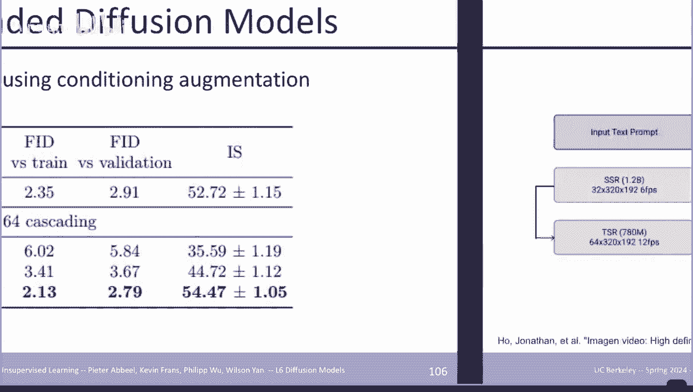

好吧，所以我想，然后是，视频上的放大版本，所以彼得谈到，想象这是一个我谈到的，级联扩散模型的相当放大的版本，想象视频只是，很多级联，你 你可以看到，这是 Tex 部分，左边的所有内容，然后是。

慢慢生成视频，基本上达到 1280 x 768 24，FPS，我猜大概需要 5 秒，嗯，或者，他们有基本模型 是，无条件的，那么他们会随着，时间的推移，然后在，空间上，然后在空间上，然后，时间上。

然后空间上，进行超分辨率，我，不知道他们是如何选择何时做的，嗯，我想这，似乎是合理的，就像某种，内部，然后是一件有趣的事情，你可以看到，当你的分辨率越来越高时，模型大小开始，减小，因为超。

高分辨率就像很多次，失败，就像你需要大量的计算，能力，所以它变得更加，昂贵，直观上你也，可能不这样做 不需要那么多计算来，模拟超分辨率，只是，因为已经有很多信息。

从 320 x 192 到 12 1280 x 768 um，你可能需要，引入一点额外的信息以及它们的方式 他们的，模型工作得有点类似于，稳定的视频扩散，但是这都是，从头开始训练的，所以没有。

从文本到图像的初始化，这一切都是从头开始训练的，你有每个东西，帧，所以你每帧都有类似的空间，操作，然后，这里有类似的时间操作，然后，就像空间然后时间然后空间然后，时间是的，所以这里的一些关键方面。

就像我提到的那样，级联，结构可能允许更好的可扩展性，或者如果你 就像更多的，计算，预算一样，他们，为超分辨率模型添加了一些增强，这是我在，呃Cascada模型中跳过的一个方面，你。

可以在训练超分辨率模型时添加一些噪声，嗯非常，这里很重要，这可能是，更重要的事情之一是视频图像，联合训练，通常是因为图像，文本到图像数据，比文本到视频数据更加多样化，而且，还有更多，所以。

如果你想捕获 某些东西，喜欢不同的风格，比如，像绘画风格一样生成 X 的视频，或者像制作草图，或其他东西，可能没有，实际的文本视频数据，但如果，你联合训练视频和，图像 它通常会在两者，之间传输一些功能。

这，两种模式是一样的，因为，它们非常，接近，而且也像一个像样的，高质量数据，你可以训练其中，非常重要的大约 1400 万，文本视频图像，然后是 5 亿，文本。

图像，好吧，你也可以想象它正在运行我，想大多数视频都是这样的，呃而且它应该。

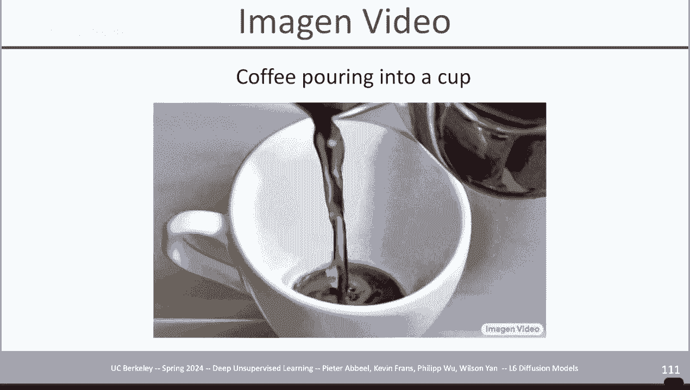

填满好吧我想我会弄清楚，视频生成讲座要做什么，是 是的，嗯，然后就是这样，我想，这些仍然是我，谈论基于卷积的模型的所有单元，我想最新的东西是更多的，变形金刚和所有最新的。

论文基本上我的意思是从架构上来说它，相当简单所以它仍然 与，单位 um 相同的输入和输出，但在这种情况下，它就像一个视觉，Transformer，您可以在其中获取输入，然后将，其分成令牌，因此。

它就像 2 x 2，卷积或 4x4 卷积一样，然后，呃您 压平你通过 Transformer 提供的所有内容，然后它，输出，um it 它输出像 It PRS 一样的，噪声，在这种情况下，它是基于。

像 openi 的论文一样，所以他们，也预测方差，和主要 这里的事情是他们如何，介绍如何对，时间步长进行调节，嗯，这，与我描述的方式非常相似，就像，您所在的时间步长单位中的调制 um 方面，所以。

这是 T 嵌入输出 规模，和偏差，也有点像，你可以应用的每一层之间的门控，这几乎就像，核心，架构，这方面很重要，我，认为他们把它删掉了，但我认为，这里的核心只是转换，架构， 一般来说，正如我们将。

看到的那样，这是一篇论文，我想 12 月发表的，嗯，来自，谷歌的 Walt，使用，Transformers 嗯，第一部分只是，一个 3D CNN VA，非常类似于，稳定的 Vees 扩散，但仅。

对于视频，您只需制作它而，不是 2D conss 您制作 conss，3D 您在空间和时间上进行下采样，uh 以获得，类似 32 x 32 x 4 x，4 的东西，例如 H x，W 通过C或其他，什么。

嗯，除了第一，帧是单独编码的，所以它就像，第一帧是一个图像，然后你，有剩下的像你的视频，编码，所以这是唯一的，因为，它们可以联合转换图像视频，仍然是仍然 重要的是，在那之后，它基本上就像一个。

带有轻微的变压器，可能是，一个稍微更奇特的架构，比如，因子明智的，关注嗯，它们的，信噪比为零，我之前谈到过嗯，而，不是我之前提到的添加的 Len 块，它就像，轻微的东西 不同的是，他们有。

一些叫做 L 和自我调节的东西，我不会真正深入，但如果，你感兴趣的话，有，论文的链接，你稍后会看到，然后他们的模型有 30 亿个，参数，所以这也是，比想象中的视频小得多 想象中的视频。

总共可能有 120 亿或 100，亿，但这也是。

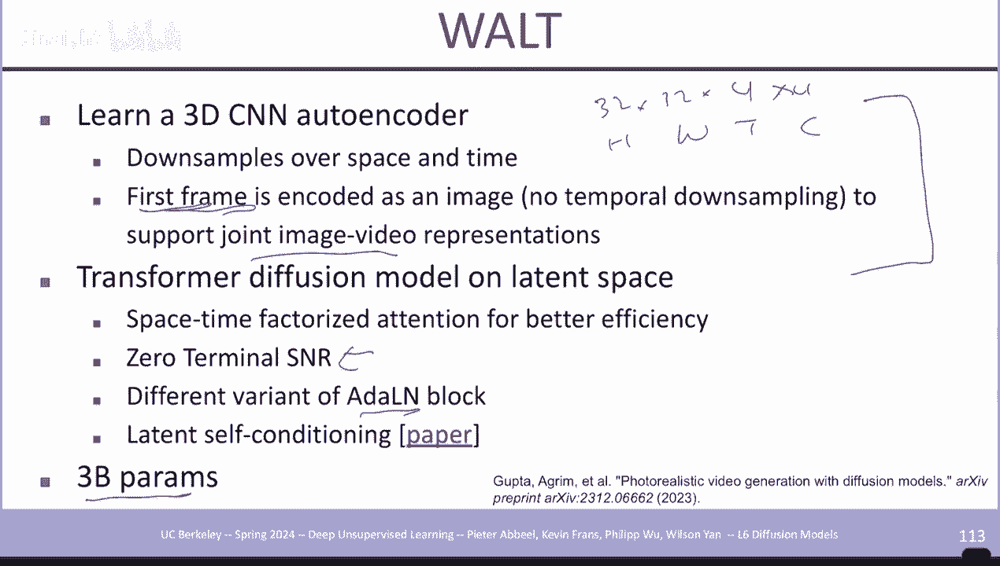

一个单一的模型，一个单一的 Transformer，模型，这是一个，有潜力移动的东西，是的，但总的来说，我认为总体而言 比，想象视频中的其他一些更好的动作，例如，不是没有那么，奇怪的事情，是的，我只是。

好奇，所以对我来说，你展示的东西就像他们，首先进行空间注意，然后，他们做 时间注意力，比 Spa 时间注意力更好，它就像你，可以的那样，我想你可以喜欢，这个，我认为这只是为了，效率，你可以像分解。

拘留一样，就像，计算一样 好处，但你，可以参加所有事情，你，知道吗，如果一个比，另一个更好，我可能会打赌，我的意思是在，有限的情况下，我会打赌，可能会全神贯注，但如果你是，是的。

呃，索拉 P 谈到的，实际上没有任何细节，没有，太多可提的，但它也是一个扩散 Transformer，据说，嗯，其中一个有趣的是它们，我想，作为 Transformer 的其他好处之一，以及如何标记。

事物是，它非常然后，结果是，在你标记，所有东西之后，你会展平成一个长，序列，所以当你展平所有东西时，它变得对原始输入，的原始形状，是什么不可知，你总是可以输入，原始形状的一些信息。

但是 然后你就可以灵活地，在不同的分辨率上做事情，我认为他们可能会在，不同的分辨率下训练东西，也许在不同的，时间尺度上，也许像高分辨率的，图像和较低分辨率的图像，如果一切都像扁平化一样，那就容易多了。

单一，的一维序列与尝试，像一个单元一样做到这一点以及如何，使其同时支持不同的分辨率，我想，这的训练管道将是，可怕的，是的，它也可以，用某种方式进行训练 随机掩码，因为，它们确实具有不同的功能，例如。

视频预测，填充呃，就像某种外推法。

但，谁知道呢，今天他们有了稳定的，扩散 3，它可能是我所，知道的最大的开源文本之一，甚至只是文本图像模型 80，亿个参数，嗯，这也是，一个扩散变压器，所以我不知道，为什么过去两周只是，扩散变压器，嗯。

他们，提到使用流匹配，我们，在本课程中没有介绍，但我认为，就像 像一般范式这样的一代。

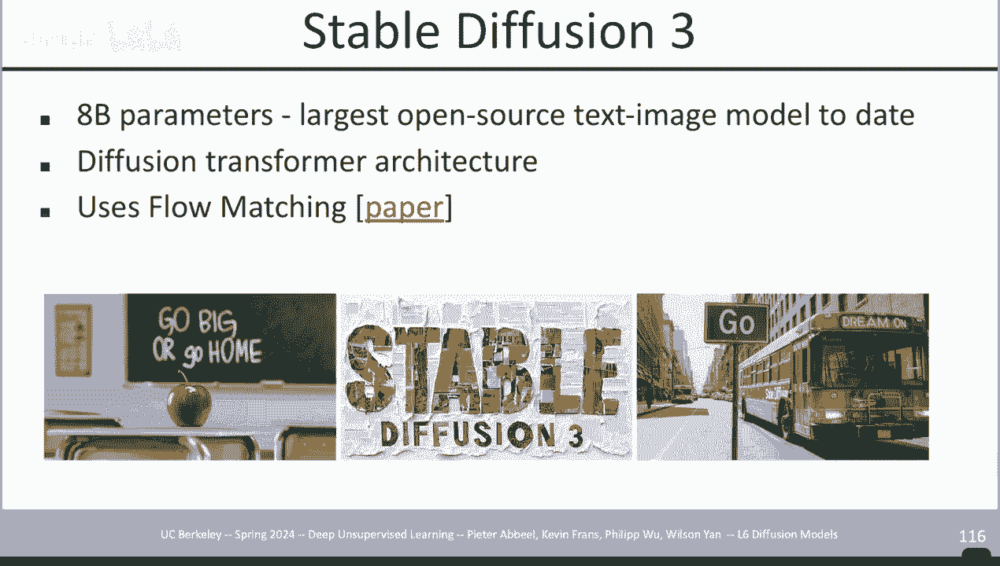

最近越来越受关注，所以，查看这篇论文可能会很有趣，嗯，好吧，酷，是的，我们，很快就会开始，这是一个，非常拥挤的讲座，因为，它是一个 这是一个非常快速发展的，领域，所以我们将。

在实践中完成一些与扩散模型类型相关的主题，所以，我们将讨论一下，如何从扩散模型中采样，然后 我们将讨论一下，扩散模型如何用作，一般表示学习，以及，在图像以外的领域，它们，也可以，达到嗯，所以渐进式蒸馏。

这两个家伙再次，提出来解决这个问题，扩散模型的问题是，它们，很难采样，因为它们需要，很多步骤，所以即使扩散，模型在模式，匹配和图像质量方面做得很好，呃，因为这个假设，你，必须逐步 不表示，扩散模型，呃。

他们需要很长时间，来采样，所以基本上，他们在本文中提出的问题是，我们如何解决，这个问题，所以如果我们看一下原始的 ddpm，论文，甚至这篇后续文章，扩散模型击败了 Gans 论文，他们使用了。

一千个扩散时间步骤，你可以看到这需要很长时间，而如果你使用类似，vae 的东西，或者再次你只需要，一步，所以我们真正想做的一件事，是弄清楚我们如何才能降低这个数字，呃，拥有这个大端，对于训练来说非常好。

呃，基本上，然后，我们将在未来的一张幻灯片中讨论这个，但基本上正如，彼得早些时候所说的那样，高斯噪声，过程的反向过程只是一个，步长足够小的高斯，因此我们确实需要一个，小步骤来正确训练，反向过程。

但是如果我们想，实际评估它，如果我们可以跳过步骤可能会很好 如果我们可以，呃，如果我们，不能采取这些小步骤，而只能采取越来越大的步骤，那么，这里的渐进式，蒸馏的洞察力就很好，让我们采用一个。

具有结束步骤的预训练模型，让我们尝试将其削减 两个，所以如果我们能得到一个好的程序，将，步骤数减少两个，那么我们实际上可以根据，需要多次重复这个过程，然后看看。

我们可以在不损失施工精度的情况下达到多接近的程度，以便快速概览 在，标准扩散建模过程中，我们，将对图像进行采样，对，时间步长和 Epsilon 进行采样，对噪声，参数进行采样。

将 Epsilon 添加到 X，然后更新模型以，预测原始 X，或者在某些情况下，您可以预测 Epsilon 或 或 V，X Epsilon 和 X 的组合，但是如果你，考虑预测原始 X，这是。

一个相当困难的分布，实际上，如果你这里的噪声是完全，噪声扩散模型，那么预测，原始 X 实际上是这个 这是一个非常，困难的问题，那就是完整的，生成问题，你可以，认为这个问题，实际上不能被建模为 gaan。

就像，原始数据从无到有的概率分布，肯定比 aan 更大，这是一个非常，复杂的，分布，所以呃，如果你，只预测后退一步，那就是aan，因为，这更容易，但你走得越远，你的真实，分布实际上离，aan就越远。

但是，渐进式蒸馏的主要思想是，如果你有，这位老师 那么我们能做的就是，我们实际上可以预测呃什么只是，老师，预测的所以在这里假设我们，从这张图像X开始，我们对它进行噪声处理。

以获得让我们称之为x x帽子在这里呃在，标准扩散模型中我们 会，预测回X，所以让我们称之为x0，我们会尝试预测它，但这是，一个非常困难的问题，我们可以做，的是，我们可以在这里得到这个。

x um T减2这样的东西，这样我们就可以 让我们真正，知道，老师给出的这种有点不寻常的版本是什么，我们只是想预测，我们只是想训练我们的学生，来匹配这个，在这里我们实际上只，运行它两次。

所以基本的想法是，你的教师模型并运行，两次 D 噪声过程，然后训练，你的学生模型一步复制两次，扩散过程，所以，这实际上是一种非常，简单的方法，基本上训练，教师，然后训练学生进行。

预测 乘以两倍这可能是一个糟糕的，问题，但我想知道为什么如果，原始模型就像一千个一样，为什么不直接使用 500 个步骤来训练一个新模型，因为当你训练时，你就像对 t 进行采样，然后。

你' 在那个特定的步骤中，我会立即跳到类似的，图像，是的，所以，答案基本上与，这里有关，你尝试的扩散步骤越多，从逆向过程中学习映射的难度，就越大。 问题是，呃，在向后扩散，过程中，我们假设。

真正的向后过程分布是，高斯呃，但它实际上不是，真的呃，而预测，并不是一直回到，unno图像呃，而只是一些步骤，有点接近谨慎，所以这就是，为什么最好，先运行教师模型来实际，学习所有这些边际分布。

然后复制这些分布，而不是，试图一路返回，你可以不，行动，你可以尝试，用更少的步骤训练扩散模型，它，不如先训练完整的模型，然后进行，蒸馏，嗯，所以这是，他们在这里所做的事情的图表，基本上我们从这里开始。

让我们，这样说 是具有，四个时间步骤的扩散步骤的教师模型，我们要做的是我们，基本上将其提炼为第二个，扩散模型，该模型尝试，在一个步骤中对两个步骤进行建模，然后一直，到一个以上，这里，呃。

这里有一些它如何，工作的例子，所以在这里我们首先训练，完整的教师模型，有 256 个，采样步骤呃，你可以看到，质量非常好，事实上他们，可以把它一直降低到 到四，所以从 256 到四步，质量大致相同，你。

可以看到，我的意思是有一些，模糊，但嗯，我的意思是，这张图像，非常接近这里的图像，呃，从四到 一个是它，成为问题的地方，你可以看到像，这里的图像一样，尽管它们具有相同的，语义结构，呃，它们缺少。

很多细节，比如，这里的这只狗丢失了 耳朵，如果你，看得太仔细，你会意识到这是一种，伪造的很多，细节，所以要学习的一种教训，是，你实际上可以将，基于图像的扩散，模型提炼到大约 16 或，18 个步骤。

没有太多技巧，你可以，在这里执行这个过程，但是，从 8 步减少到 2 步或 1 步是，我们真正需要更多，见解的地方，这就是即将，出现的嗯是的，所以这是一个一一的问题，使用我们之前讨论过的方法。

因此在渐进式，蒸馏论文中，我们尝试将，扩散过程的许多步骤蒸馏为一个，步骤，问题是，预测所有这些步骤的模型，仍然被假设为 高斯高斯，模型，所以假设真实，图像是这个以，某个均值为中心的高斯分布，我们知道。

在实践中情况并非如此，我们需要一个更具表现力的，分布，嗯，它是一个 gan，仅适用于小步长呃，这里的真实分布，肯定是它要复杂得多，并且正常扩散，模型的构建方式是按照，密度噪声步骤的顺序构建的，所以如果。

我们想一次完成所有这些，我们，基本上需要一个 更强大，的生成，模型是的，这里是，您遇到的问题的一个例子，当您尝试使，扩散步骤更接近或基本上，您尝试使用更少的扩散步骤时，就像这里是。

我们的分布 从这里开始，假设我的数据看起来，像这样，当我向其中添加越来越多的，高萨噪声时，它，看起来越来越像这样，然后问题是让我们，尝试预测噪声，或者让我们尝试，为了预测这种，添加的噪音，您可以看到。

如果您，处于最后，那么如果您，仅向后扩散一步，则真正的，答案，在这种情况下，我们可以知道，真正的答案 因为它只是一，维，看起来非常像一个 gan，对吧，这是一个很好的 Gan，我们很好。

但是当我们尝试向后跳，越来越多的步骤时，数据的实际真实分布看起来越来越，多 形状和这里我的意思是，基本上它看起来，与我们的 X Z 在那里基本相同所以这是一个这样的，问题，就像这个高斯假设，如果你的。

步长，太小就不成立所以他们在本文中提出的建议，好吧，我们有强大的生成，模型，我们上周在讲座中介绍了甘斯，我们可以在这里使用一个，所以我们将用。

再次呃替换这个嗯这个反向分布的 gussion assion，基本上我们想做的是，我们想要的 这是 G 的鉴别器，用于预测或区分，这种一步 D 噪声过程（，给定噪声图像 um 与。

真实的 d 噪声图像），所以 Q 就是，我们想要的数据，我们想要模仿，它 与，Gan 呃和有点这里有一个，技巧，问题是，如果我们知道 Q 我们，可以运行 q ，那么如何正确得到 Q ，这将。

解决我们的问题，但在，实践中 我们实际上并不知道 q q，实际上是数据下的边际，但我们可以从中采样，所以，技巧是这里的这个 Q 分布，实际上扩展到只是，这里的这个小边际，所以这里的方程是什么。

说的是首先对图像进行采样，只是一个，常规图像，然后，对其进行噪声，一步，然后噪声，然后再对它进行噪声，一步，所以它基本上是这样说的，好吧，假设我有这个原始，图像，我将对其进行噪声n步 然后。

我将对其进行n加一个步骤的噪声处理，所以现在我有了这对图像，该，图像稍微有噪声，并且，噪声稍多，这就是，我们所认为的真实数据，所以这就是，的真实分布，噪声数据到稍微无数据的数据，因此这，是我们希望。

判别器标记为正确的目标，然后标记为，不正确的示例的对象将是，我们的模型生成的对象，因此我们将，训练 就像，我们通常在 Gas 中所做的那样，通过鉴别器来支持生成器，所以这里的主要思想是用 gan 替换。

一个步骤的高斯预测。

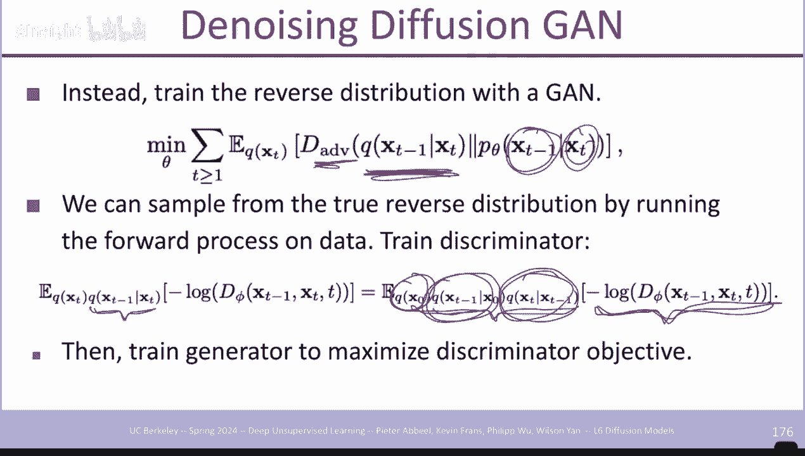

可以产生，更具，表现力的东西，嗯，是的，这是该，方法的图表 基本上就是说，首先让我们获取，样本图像，我们将对，它进行噪声处理，然后我们将对其进行，更多的噪声处理，现在我希望我的 Gan。

能够基本上预测这个版本的图像，该版本的，图像稍微少一些 被判，别器捕获的噪声，所以这个，过程是由 Gan 建模的，所以这个过程，比我们之前的单步 Goan 假设更能表达分布，所以这里有一些例子来说明。

它是如何工作的 这又只需要，四个扩散步骤，我们就可以获得，相当不错的高分辨率结果，所以，这里有一些名人面孔和教堂数据集的图像，抱歉，但它也只经过了，步骤训练吗？是的，它是经过四个。

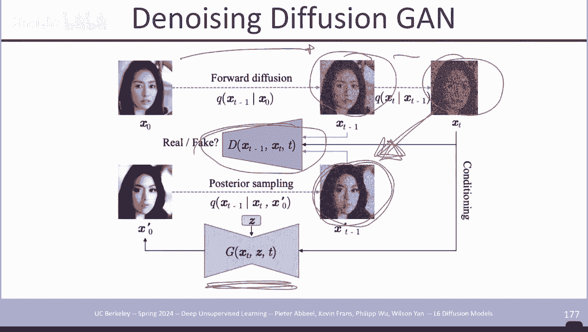

步骤训练的 所以在这篇论文中，他们是的，是的，他们完全从头开始训练这个，扩散可以这样你就可以，交换这个呃的所有网络，我们将在后续论文中看到，你可以使用相同的设置，蒸馏，实际上呃我，认为效果。

更好呃是的所以这里是移动，扩散所以这是，我认为不到一年前出现的东西，但，几周前引入了一系列加速 G 的技巧抱歉不是，几周前 今年，早些时候去年年初，时间移动得非常快，呃，但是，是的。

所以我认为这篇论文很好，因为它为，我们提供了一系列技巧，帮助我们，更快地训练呃扩散模型，所以如果我们能得到推理时间，更快，然后采样变得容易得多，对于这些人来说，他们希望它，在你的手机上运行。

​​他们希望它在，本地运行，所以，参数数量，减少非常重要，所以基本上有一些。

架构技巧可以，基本上减少 可以减少，参数，数量，主要的想法之一是，嗯，只需将你的变形金刚放在，单元的中间，所以我们，之前讨论过一点，但主要的，想法是，如果你看一个单元，你会从，图像开始 非常高的空间。

分辨率，所以你的输入数据，可能是 128 x 128 um，每一步它的，高度和宽度都会折叠，所以也许最后，你处于一个潜在空间，比如说 16 x，16 呃 直观上，内层的特征，更加，压缩，它们更具。

表现力，而，外部的特征更侧重于，高频细节，因此将，Transformer 更多地放在，它们的中间是很有用的 可以执行更，高级的，计算呃，所以如果你必须，分配你的参数计数而不是，像我们过去那样统一执行。

最好将更多的放在，中间，这给我们带来了相当，大的效率增益呃而没有损失，呃，他们，在这里做的另一件事是，他们将自我，注意力和交叉，注意力解耦，这本质上意味着，在文本条件扩散，模型中，呃，每一层都关注自身。

以及文本条件，因此它，关注 基本上是全局，结构，也是，图像的局部结构，所以，文本的交叉注意力非常，重要，你在每一层都需要它，但是自我注意力，你实际上不需要，在每一层，事实上，因为 同样的原因，我们。

处于单元的早期和后期层，你的空间分辨率，太大了，自我注意力占用了，很多时间，而你实际上并不，需要它，所以再次将其切掉 在，外面，然后把它放在，里面呃，然后还有一些，更多的呃建筑细节。

我们不必过多讨论它们，但有一些事情我们可以，摆脱，那就是当你，计算你的注意力，你，可以做的是呃，而不是计算你的，密钥和值作为两个单独的头，你实际上可以只使用一个头，事实证明，为了扩散，这很好呃。

我们可以通过，合并这些头来逃脱 减少参数，数量，我们在这里可以做的一件事是我们，可以摆脱软最大值，所以在，注意力中，当你计算注意力，等待时，你必须获取，所有关键向量之间的点积。

然后通过以下方式将其归一化：所有其他点积的总和，你可以看到这有点烦人，因为你必须等待所有，总和完成才能，真正计算等待，所以，他们在本文中发现的是 呃，我们可以，用 softmax 进行训练，这很好。

我们有，很多时间来训练，呃，但是在，评估过程中，我们想使用，更便宜的东西，他们在这里选择了 ra，事实，证明你可以做的是你可以，微调一个模型， 有softmax，激活来代替使用Rao，激活。

并且微调过程，非常便宜，然后它会加速是的，这里的其余改进是诸如减少，正确位置的宽度U减少，残留块然后使用这个，可分离卷积的想法，基本上可以让你，更快地计算卷积，我们可以在这里看到，这，是原始的稳定扩散。

它具有相当大的模型尺寸，因为参数计数同时，移动扩散能够将其降低，到更多 合理的，你可以看到呃，即使在 pra 中，甚至呃，当你评估它时，每次评估所需的时间都会，下降，所以这有两种，加速扩散模型的途径。

一种，是将你的多步模型提炼，成小的 步骤然后两个，只是让每个步骤运行得更快一点。

呃然后，加起来呃这里是我们不打算，讨论太多细节的沙漏，扩散变压器呃但基本上，它与这个移动扩散类似的想法，其中呃什么 他们所做的是他们，有这个单元，他们在中间附近放置了更多，更多的变压器参数。

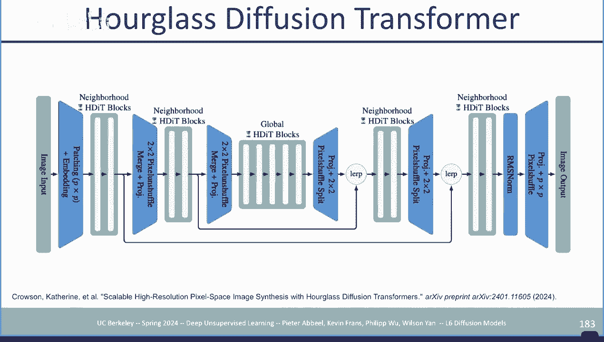

呃，是的，这是一篇有趣的论文，因为，它刚刚出来，两天前就出来了，我想今天是哪一天，但它，刚刚发布得更早 这周呃，昨天哦昨天哦我去耶耶耶耶，好吧所以让我们去看看，他们。

做了什么呃耶所以这里的关键想法是我们，讨论了甘的想法，我们，注意到甘斯如何解决问题，就像你一样 你减少了，扩散步骤的数量，你的高斯假设，消失了，所以这些人说好，好吧，让我们进行蒸馏，但我们。

只使用 gan 来代替，所以让我们用。

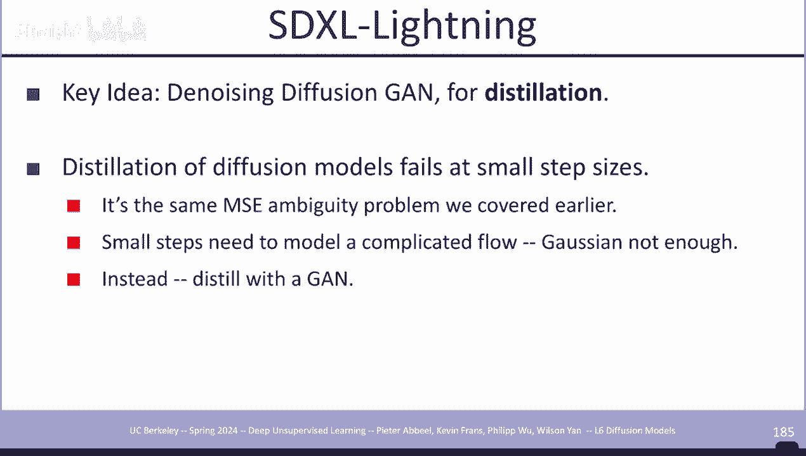

gan 代替这个 gussion 东西，这解决了，呃抱歉这个问题 好吧。

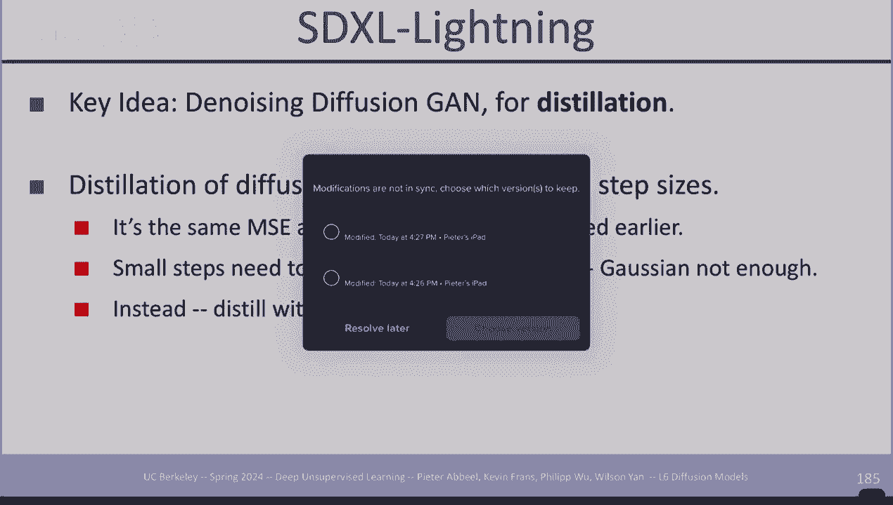

好吧，是的，所以，Gan 还，不够，我们需要使用更，强大的东西，在这种情况下，让我们使用，Gan 呃，那么他们是如何做得很好的，他们基本上做的，事情与我们所说的类似。关于在另一篇扩散甘，论文中。

这次你使用教师，网络作为真理的来源，所以在，我们使用这里数据中的呃某种噪声样本之前，我们只是，直接使用教师网络的输出，所以，你的 嗯，你的鉴别器，基本上会以这个 uh X，噪声图像为条件。

然后 x 与 uh 一起，应用一些去噪，所以这，就是这个存在的原始，图像噪声，然后是，进一步的 D 噪声版本 呃，在这里我们也确保我们告诉，它时间步长和，噪音量，以及，这里的文本条件，然后。

你可以做的一个很好的技巧是如果你曾经做过，这些蒸馏的事情 你，可以重复使用很多权重，这样你就，不必从头开始训练这个鉴别器，我们实际上是，从教师网络初始化它的，所以，教师网络已经有了该，单元的编码部分。

所以如果你还，记得该单元看起来像什么 像，这样呃我们可以采取这部分并重用，这些权重，我们，在这里训练新的网络以用于，鉴别器呃这是一件有趣的事情所以，如果你的学生模型的容量，比你的教师模型少，这几乎。

总是正确的 实际上，你可以在多大程度上建模呃，扩散方向以及，他们称之为Janus，工件的这种不匹配，本质上就像这个，多头上帝，因为，这种显现的方式之一就是你，最终得到的 像这样的图片，呃。

扩散过程本质上试图，准确地模拟老师正在做的事情，但它没有足够的能力来，消除所有错误呃所以你会得到，这样的东西，其中图像是，非常IND分布的，图像的可能的呃 D 噪声版本，但作为一个整体，它不是不。

正确的，所以你会遇到，呃头部被分成，两部分的情况，所以他们在本文中解决它的方法，是，放宽这个模式覆盖假设，呃是 降低，问题复杂性的一个技巧，他们通过对，无条件教师进行微调来做到这一点。

所以他们尝试解决的第一个问题，是优化这个值，给定一个噪声图像，给我，稍微去噪的图像，但，这个问题非常困难，它会，导致这些伪像，所以他们所做的是，首先训练这个，然后在。

这个模型不符合 XT 条件的情况下这样做，只是说只是，让呃给我 D 图像，一般来说，就像在，整个数据中一样，这实际上可以，解决这些图像，因为这里的这些，图像在数据下实际上并不可能，所以第一步。

之后的这种无条件微调，将解决该。

问题，这是详细信息，他们所做的第一，件事就是从，这个 128 步扩散模型开始，他们实际上，用常规的 MSE 损失进行了蒸馏的前几步，所以第一个渐进式，蒸馏论文可以得到 我们在。

没有太多损失的情况下降低到 32，并且更容易，训练，但是如果我们想更好地压缩它，现在我们需要摆脱，这种高斯假设，并需要使用，更具表现力的模型，这就是，我们要使用的模型 Gan，蒸馏，所以他们有这些。

不同的阶段，在每个阶段，他们所做的是他们首先进行以，原始噪声图像为条件的条件训练 Uh 然后他们，微调到无条件以获得，该网络，然后他们使用该网络，网络作为下一个网络的老师，嗯是的，然后他们意识到一件事。

是你也可以使用嗯，劳拉，所以劳拉基本上是用，较低的，参数数量进行微调的技巧，所以基本上是这样的，方式来制作一个，完整，参数的低阶近似基本上它更快，但它会给你的结果表达力较差，但它们在本文中表明。

如果你只是在进行蒸馏，那么，实际上只调整这些 Lowa 参数是完全可以的，呃，你，得到的表现与，他们没有它时的表现差不多，呃，是的，这里有一些结果，所以这是一张晒黑的女性的照片，穿着运动服，戴着墨镜。

与团队一起攀登高峰，呃，我，想他们实际上都没有 得到了，小组部分，但我们要看看，性能下降了多少，所以，这是原始的，这是嗯，或者，这是 sdxl，他们将，与嗯进行比较，然后。

我们就可以了- 将其从 32 步调低，到 8 4 和 2 呃，我们可以看到，是的，这里的生成质量，在 2 级仍然很有表现力，所以你仍然可以获得很多细节，呃，这里 LCM 只是一个。

他们正在比较的不同方法是的，所以是的所以这基本上是如果，你想加速扩散模型我，想很多人，最近都在考虑这个呃肯定有，很多悬而未决的问题，嗯他们评估他们是否，在这个过程中失去多样性，呃我不确定。

我的头脑我想我们可能会，在本文的某个地方提到它，嗯我现在无法给出具体的答案，我想他们，会对这些蒸馏一件好事，过程的关键在于，他们试图，确保噪声到图像，映射保持恒定，因此您可以，在这里看到，即使通过。

蒸馏过程，您仍然可以，从相同的初始噪声中获得相同类型的图像，因为我们正在，做，从噪声到图像的映射是尝试蒸馏，是的，是的，我们正在尝试用 gam 输出的一步来替换，去噪过程的许多步骤，所以我，记得。

模型提供了比你更好的，多样性，是的，这是一个很好的问题，我，认为我无法立即给出一个好的答案，尽管，我们为什么，要使用蒸馏而不是，像第二篇论文那样直接训练扩散 G 的基本原理，是： 当你进行，蒸馏时。

你明确地试图，保持噪声和生成图像之间的这种映射，这，本质上保持了，原始，扩散模型所具有的多样性，因此你可以说，只要我们在初始训练期间获得了所有这些多样性，我们就会尝试，在蒸馏过程中保留它，而如果你一。

开始只是训练扫描，你，可能不会得到，它，嗯是的，所以我们可以，用扩散，模型做的另一件事是，不是将它们用于生成，而是实际上只是为了理解，世界之一 我们，在这个无监督课程中介绍的第一件事，实际上是，我们。

想要使用 UNS 监督方法的原因是，它们为我们提供了良好的表示，学习，因此它们为我们提供了，有关世界的良好信息，而，不必使用标记数据，因此 现在的问题是我们可以为此使用，扩散模型吗？嗯。

我们正在尝试这样，做，抱歉，让我说是的，所以，所以在，这里，我们正在尝试学习，对应关系，因此我们正在尝试了解，图像的哪些部分 对应于，图像的其他部分，所以也许实际上这些幻灯片，应该重新排序，嗯。

我们想做，这样的事情，假设，这里他们突出显示了，鹅的喙，他们想，突出显示其他部分中的相同组件，图像所以基本上这是一种，学习，有关每个图像的某种语义信息的方法，问题是我们训练这个，扩散模型纯粹是为了生成。

图像我们实际上可以重用它来得到，这样的东西呃，这里的主要见解是，扩散模型是使用，噪声图像作为输入进行训练的，因此扩散，模型总是接受一些噪声版本，并输出更清晰的版本，因此如果我们，想提取特征，我们。

实际需要做的就是向我们，关心的任何图像添加噪声，这样我们 需要，添加一些噪声来获得，扩散模型分布中的图像，然后我们可以，通过模型本身运行该图像，这里，他们所做的是他们只是，在某个层取出特征，所以。

他们采取了一些 单元中间的层，并使用这些特征来，计算余弦距离，主要，思想是，我们可以采用这个余弦，距离，并将其用作，我们的语义相互匹配程度的度量，这很有趣，是，的 随着噪声量的，变化。

语义和细节之间的权衡也会发生，变化，因此，如果添加大量，噪声，您可能会获得，与图像的高级部分相对应的特征，例如对象所在的位置 但是如果你，添加少量的噪音，你将，获得与更精细的事物相对应的语义。

例如纹理或，颜色嗯，所以这就是他们可以，使用纯粹的预训练扩散模型来做到的，他们基本上可以找到所有这些，对应关系，他们可以，在这里给出该图像的标记部分，可以，在所有这些测试图像上找到相同的部分，嗯。

一旦您有了这些，语义对应关系，您就可以做另一件有趣的事情，它们为您提供，特征所在位置的位置信息，以便它们是什么 在这篇，论文中他们做了的是，他们拿了脸，他们只是添加了一些呃，他们。

在伸出的舌头上添加了粘糊糊的眼睛，他们说让我们尝试将其添加到，其他图像的同一位置呃，所以这，本质上就像是零镜头方式，进行图像编辑的过程中，如果他们将其添加，到原始图像中，那么他们可以添加。

相同的功能以及，其他图像的语义位置呃，这基本上就会发生，而，无需找到，模型，嗯，是的，这是另一篇，尝试的论文 为了弄清楚我们如何，从扩散模型中提取特征，我们想要进行分类，所以，这里我们想要使用扩散模型。

看看它与，给定图像网络类，甚至文本，标签的对应程度如何，所以我们 想要对图像，进行分类，另一种分类方法，是，如果我们可以学习，这个距离，那么如果您可以学习，图像和文本之间的距离，这。

本质上是我们可以用作，类标签，信息和主要见解的东西 是我们的，扩散模型，是，在这里给我们这个模型，所以其中 C 是你的，类或你的文本条件，我们有，这样的想法，我们在与，该条件匹配的图像上有这个分布。

所以如果我们将其插入 Bas R，我们可以得到，相反的事情，所以我们可以得到，图像上的类条件，只要我们这里有这些边缘，如果我们假设，类都是统一的，我们实际上可以，划掉这些数字，这使得，这更容易处理。

这样做的主要想法是，这些人使用的主要思想，是给定这个输入图像，他们首先要做的就是对它进行噪声处理，所以如果你，想将它用作 divion，模型的输入，你需要先添加一些噪声，然后，再添加一些噪声 他们是否。

扩散了模型，其中，调节的类等于给定的，类，所以假设我正在使用，imag net，我可能会尝试像鸟车，或卡车一样，我会为每个答案得到一个不同的，Epsilon，呃，然后我们，在这里想做的是，我们只想计算。

这个预测的 Epsilon，和我们首先用来对图像进行噪声处理的真实 Epsilon 之间的距离，uh，然后，这里的 epsilon 之间的距离基本上就是，距离 uh 图像和，文本之间，所以现在我们可以。

通过，基本上取这些距离中哪一个是，最小的来计算哪个类是最有可能的，所以这是一种很好的方法来基本上，反转扩散模型并说，如果我们有一个映射模型就可以了 从文本，到图像的方式呃我们可以反向使用它。

从图像到文本并找到，这个。

距离，嗯是的这里还有一项关于，表示学习的工作，这里的问题是我们想要进行，像素级分割所以 我们想要，关心在图像中查找语义映射，其中哪些部分对应于，某些，对象，所以我们可以开始的第一件事，是有一种。

低分辨率的黑客方法来做到这一点，他们，实际上在本文中开始使用它，让我们提取一些特征图，假设我们将图像传递到，扩散模型中，我们有一些壮举，特征，我们可以只使用 K 均值，所以 K，均值是一种很好的廉价的。

聚类方法，如果你在特征空间上使用 K 均值，你会得到，这些特征之间的一些语义相关性，并且，他们在本文中使用的一种很好的技巧是，如果你使用文本条件，扩散模型，你想使用，你的查询向量作为特征，其中。

查询是 用于与，文本交叉关注的查询，所以在某种程度上，这个查询向量的含义就像，我在文本调节中关心什么，这很好地对应于，分割应该，是什么，所以现在我们有了这些，低分辨率特征 地图我们只是想，放大它。

所以我们想找出，特征与图像，中实际像素的对应关系，而做到这一点的方法是我们，可以使用他们所说的，调制策略，即我们添加，这个常数 这些，特征的编号，看看它如何，影响生成的图像，所以，这里的想法是。

如果我们有这些，中间特征，我将其，称为 Z，并且我们有，扩散模型的其余部分，因此输出，是 X 我们想要做的基本上是，测量 Z 加 Delta 如何映射到，新的，x 呃。

我们想要做 Z 减去 Delta 并将，其映射到不同的 X，这两者之间的差异本质上是，该特征，影响多少 相应的，像素这里是，它最终看起来如何的可视化所以给定呃这种，图像这里。

他们使用K意味着定义的低分辨率特征图，最终会变成，这样的东西所以你有这个非常呃，像素化的空间，因为它处于低分辨率 res，但是你有某种起始，分割图，其中的事物，对应于不同的项目，然后使用调制过程。

我们可以，找出哪些像素实际，对应以及，这些特征的权重是什么，所以如果你将，它们组合在一起， 最终，成为我们的分割图，我们，得到这些是一些最终的，分割图，如果你运行，这个，我们会得到一些最终的分割图。

所以我们再次在这里得到很多很好的，语义区域，例如海洋的，分割方式与，浅水区不同， 海滩，呃，所有人都给了我们，不同的，区域，所以我认为这些方法，很有趣，因为它们向我们展示了我们，只是在交易我们。

最初认为是图像生成模型的东西，但实际上是通过解决这个反向，扩散 过程中它必须学习很多，这些特征，它必须学习，很多水泥和内容，嗯，如果，我们使用正确的方法来获取它，它实际上包含它。

你可以从其中获得所有这些，强大的，表示。模型是的，作为结束讲座的一种方式，我可以谈谈，扩散模型如何，在非图像领域中使用，我希望这能打开，你的思维，展示，生成模型 我们在这里做呃，虽然他们。

在图像方面取得了很大的成功，但它们也可以很容易地，在其他应用程序中使用，呃单元垫，这实际上是，由来自，伯克利的雪莉工作的，嗯，这是什么，嗯，是的，他们尝试 这里使用扩散来，生成材料，所以这里的想法。

是我们想要生成这些，结构，这些结构可能，在现实世界中仍然粘在一起，所以在这种情况下，我们可以将，我们的材料定义为这些原子，各种 XYZ 位置，我们的想法，是我们想要在这些材料上训练一个生成模型。

他们所做的就是将，这些细胞的参数基本上视为这个大的矩阵，他们可以在，每个细胞的坐标上进行扩散 每个，元素呃，这里有，一个很好的技巧，有些元素，不应该存在，所以有些元素，不会存在于最终材料中，嗯。

它在那边，你，看不到它，所以它们 使用这个空位置，所以，他们基本上只是说像，这里存在的材料或原子一样，我们，不想实际放入最后的，东西应该映射到这个，区域，所以这是要记住的一件事，扩散 它通常。

是一个连续的过程，所以你，确实希望你的基础数据，具有这种连续的呃表示，如果你有一些更，谨慎的东西，你将不得不使用，一些技巧来移动它，呃这是 一篇论文表明，您可以使用扩散模型来进行，运动规划。

因此这里的扩散过程正在，使用该模拟机器人中关节的 XY 位置，我们，要做的是预测机器人的，行为方式 我们进入未来，呃然后，扩散模型的好处是我们不仅可以预测，它在未来的一步中将如何出现。

而且实际上它会如何，在整个轨迹上出现，所以，整个序列基本上变成了，这个矩阵，其中 你在这里有你的，特征，然后你在，这里有时间，这整个东西可以被，传递到扩散模型中，所以，你可以在这里看到很多关节。

位置开始于这种噪声状态，这对应于，我们之前看过的那个噪声图像状态，嗯，当你做D噪声时，它们逐渐，就位，你得到的轨迹，比你，使用一步轨迹，模型扩散策略更加一致，这也是，很好的 应用呃到，机器人技术中。

我们已经看到扩散的，应用，嗯，当进行天真的呃机器人交易时，会出现这样的问题，假设我们想要一个，机器人克隆一组专家，演示，通常这些，演示实际上是 相当，多模态，人类可以通过多种方式解决问题，但是如果您。

尝试用单个高斯策略捕获所有这些不同的模式，那么您最终将无法，适应它，您最终会遇到这个问题，呃，如果我有，这里和这里有很多概率质量，那么我可能会，像这样对 gu 进行建模，这，实际上并不匹配任何一种模式。

但是如果我们将我们的分布定义，为扩散模型，而不是可以，模型 A 更复杂的分布我们，实际上得到了，正确模拟此处动作的分布，因此这里，有一种激励示例，这里有一个可以，移动两个方向中的任何一个的斑点，并且。

扩散模型实际上捕获了，这两种模式并且能够，到达路线 以正确的，方式控制机器人，而以前的一些方法可能会很，混乱，或者可能只能获得。

其中一种，模式，这里是一个示例，说明了实践中的情况，因此您，可以在这里看到我们正在尝试，控制的机器人 末端执行器，所以我们，基本上可以移动这个东西，我们希望它推动，它旋转到正确的位置。

所以这里的动作对应于，机器人的这个末端尖端，应该在什么位置，所以基本上我们 我们可以做的，是，我们可以扩散所有这些，动作，因此从噪声动作开始，我们将逐渐转向，数据分布内的动作，事实证明，这种。

扩散策略工作是一种非常。

可靠的方法 这种行为，克隆，嗯，看看，这个标签是否在那里，是的，这是丰田，研究所，实际上他们正在，使用它来模拟一大堆，不同类型的行为，所以他们，在我们的网站上有一些视频，如果你想看的话，你会玩的。

但主要的想法是，这实际上是，一种相当可扩展的方式，可以做一些，机器人，训练，好吧，是的，我认为这就是，我们关于，扩散模型的谈话的总结，所以有一些，如果您想，在幻灯片中，更深入地查看它们。

那么这里有更多的链接，嗯要么是推导，要么是，它们的一些更重要的应用程序，嗯是的，如果您感兴趣的话，有，一些相关的高级主题，扩散到其他方面，以及。

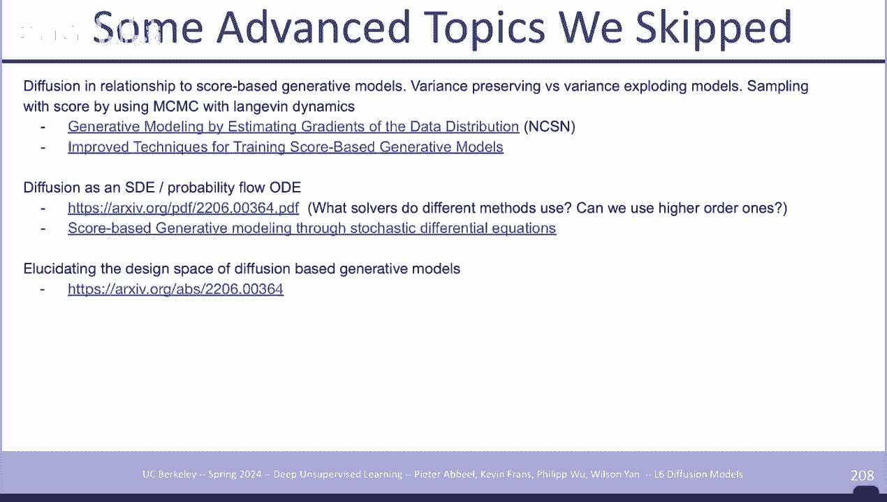