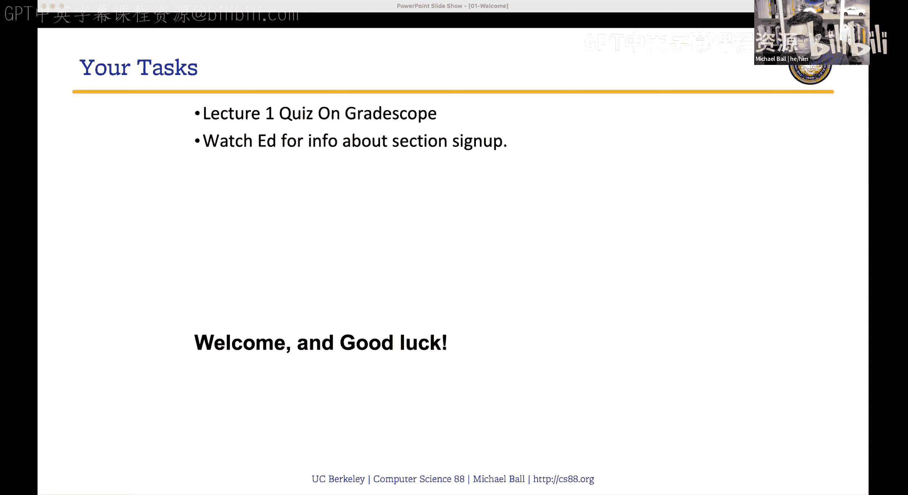
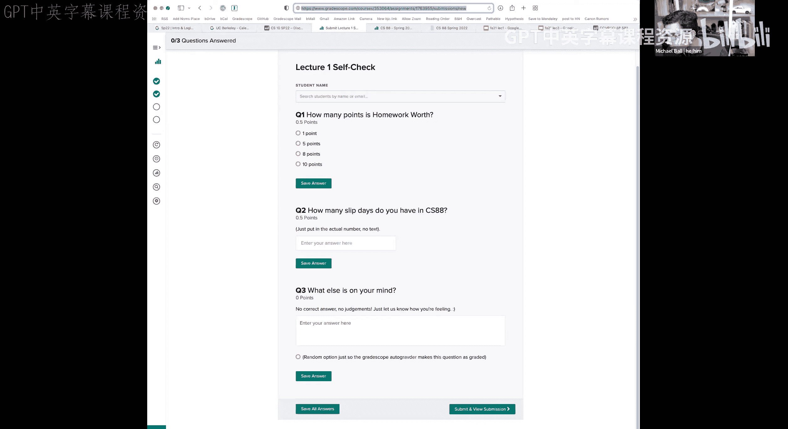
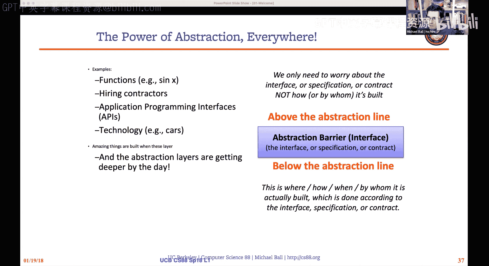
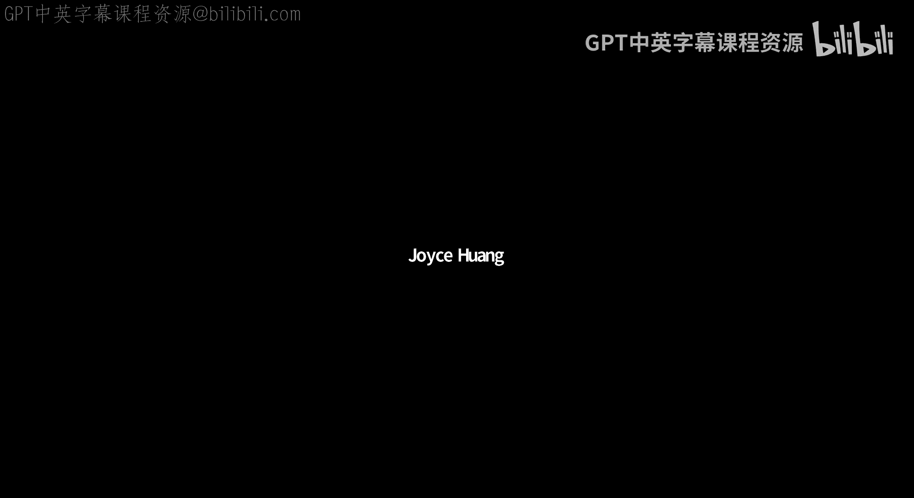

# 1：课程介绍与抽象概念入门 🚀

在本节课中，我们将学习CS 88课程的整体结构、教学团队以及计算机科学中的一个核心思想——抽象。课程将涵盖从课程安排到第一个重要概念的过渡。

## 课程概述与教学团队介绍

大家好，欢迎来到CS 88。今天我们将主要介绍这门课程，并简要讨论抽象这一重要概念。

在开始之前，首先介绍一下课程团队。本学期通常与我共同授课的Gerald无法参与，因此将由我，Michael，作为唯一的讲师。联系我的最佳方式是通过Ed平台发布私信。我的邮箱也已列出。我的办公时间将在本周晚些时候公布，最初几周将通过Zoom进行，待日程确定后，将在Soda Hall我的办公室（目前是625室）进行，具体时间会更新在日历上。

我的办公时间通常更侧重于概念性问题和计算机科学的大思想，而非具体的作业和项目帮助。除了教授这门课，我还深度参与帮助助教团队成长、开发教育软件（如曾参与Gradescope、CS10的Snap!语言），并研究网络无障碍工具。如果大家对网络、互联网的工作原理感兴趣，也欢迎在办公时间提问。

CS 88的顺利开展离不开一支优秀且重要的助教和导师团队。并非所有人都在讲座时间有空，但我知道Matt在这里。Matt，请你介绍一下自己。

> Matt：大家好，我是Matt，计算机科学专业大三学生，这是我第三次教授CS 88。期待与大家见面。

另一位首席助教Sreya目前不在线，她也有三到四次教授本课程的经验。Matt和Sreya除了负责讨论课，也是协助处理课程后勤的主要人员。当然，团队中的每个人都会提供帮助。

讲座幻灯片已链接在课程网站上，通常会在讲座前或讲座后不久发布。我们还有一支很棒的助教团队：Anli、Che、Lucas、Jessica、Minnie和Tommy。此外，我们还有优秀的导师团队，Kevin、Amit和Hell。对于Amit和Hell，这是他们首次正式加入课程团队，如果在讨论课或办公时间见到他们，请欢迎他们。

整个课程团队都致力于帮助大家解答关于CS 88、计算机科学、学习计算机科学或数据科学的体验，以及伯克利生活的问题，特别是对于新同学。

## 课程特色与目标 🎯

上一节我们介绍了课程团队，本节中我们来看看CS 88的课程特色和学习目标。

我们通常以“计算新闻”开始讲座。今天的话题是关于阿姆斯特丹国立博物馆对伦勃朗的《夜巡》进行的超高精度扫描。他们拍摄了数百张照片，创建了一个容量达5.5太字节（即5500千兆字节）的巨型图像，这是对画作最详细的扫描之一。他们利用它来更好地研究画作的创作过程。这个故事很酷，因为它涉及人工智能（深受数据科学影响）、大量编程以及设置、控制和自动化相机等技术。当然，还有艺术和艺术史。这是一个将诸多领域联系在一起的例子。

CS 88的目标之一就是向大家介绍我们能用计算机科学做什么。在本课程中，我们会特别将其与数据科学联系起来，但重点将主要放在计算机科学部分。今天我们将讨论抽象这一首要大概念。

对于担心自身背景的同学，这门课程绝对可以在没有编程背景的情况下完成。CS61A假定学生有一些编程背景，而CS88则会放慢节奏，尤其是在开始时，并重新安排一些主题以确保其易于上手。许多CS88的学生入学时都没有编程经验。

当我们谈论计算机科学时，很大程度上是在讨论：我们能使用计算机解决哪些问题？应该如何解决？以及哪些技术是解决问题的最佳方式？在CS88中，大家会进行大量编程，但这更多是关于问题解决和问题解决技术。当我们在讲座中讨论某个内容时，大家将在实验课、作业和考试中练习类似风格的问题。

大家将使用Python，但我们真正希望你们关注的是我们提供的技术、模式和工具，而不仅仅是具体的例子。CS61A通常确实期望某种编程背景。没有编程经验当然也可以完成61A，但工作量会大得多，而有编程经验的学生在61A中往往表现更好。

如果大家真的喜欢编程和计算机科学，有大量不同的领域和途径可供选择：编程系统（我们如何构建计算机和操作系统）、计算理论、人工智能、安全、网络等。修完CS88后，有很多方式可以结合大家的兴趣深入学习。

关于数据科学作为一个学科，其有趣之处在于它连接了计算机科学的许多内容与统计学、数学，以及对历史、伦理、经济学等特定领域的理解。在CS88中，我们将主要关注计算机科学方面，但随着课程进展，我们也会讨论数据科学的其他方面。

那么，为什么要学习CS88？在Data 8（或Data C8）中，大家通过Jupyter笔记本获得了统计学的实践经验，使用Python编程探索统计学，通常是在笔记本中填写内容。在CS88中，我们希望做的事情之一是走出Jupyter笔记本，使用文本编辑器、Python文件、命令行，并独立运行和编写程序。我们将进行一些更大的项目。例如，在本学期后期，我们将思考如何构建可能在Data 8中使用的`Table`模块，以及如何理解其底层的一些原理。

具体来说，我们将专注于一些计算机科学概念，如递归、面向对象编程、高阶函数等。大家可能听说过其中一些术语，也可能没有。其中一些是超级烧脑的概念，起初可能会感到有些困惑，这完全没关系。但我们为大家提供的，是解决更复杂问题、管理复杂程序的技术。整个学期，我们将探索这些概念和技术。

当然，我们的目标是创建一些有趣的项目。我们将做一个名为“Maps”的项目，它使用基于Yelp收集的餐厅数据的聚类算法。我们还将构建一个名为“Ants vs. SomeBees”的项目，这是“植物大战僵尸”的一个变体，随着项目推进，大家将能够构建一个交互式游戏。因此，大家将有很多机会编写相当多的代码，并运行自己编写的代码。

## 课程结构与协作环境 🤝

上一节我们探讨了课程目标，本节中我们来看看CS 88的课程具体形式和协作环境。

CS 88这门课程，最终目标是希望大家学习知识，同时也希望在过程中彼此协作。我们的许多作业（家庭作业和实验）是单独提交的，但也有与其他人合作的机会。例如，在实验课上，完全是协作式的，大家应该与同伴、助教、学术指导员讨论。对于项目，大家可以结对完成。我们希望给大家与他人合作的机会。家庭作业是单独完成的，但在Ed平台和办公时间有很多机会获得帮助和与他人交流。

当然，这意味着要尊重他人并营造一个支持性的环境。在CS88内部，这意味着参加讨论课、在Ed上礼貌提问（当然可以匿名提问和回复）。Ed是一个非常棒的空间，我们稍后会讨论。在CS88外部，我们将在几周内设立CS Mentors辅导课程，我们自己的CS88也会举办辅导课程。HKN协会将举办复习课程并提供临时办公时间。因此，如果大家需要，每周有数十个小时可以获得帮助和练习。

关于CS61B的问题，我们稍后会讨论，并在整个学期中反复提及。由于新冠疫情，很多事情仍不确定。我们肯定在前两周进行远程教学，之后将根据伯克利的通知进行调整。目前的目标是之后在245 LeConte进行线下讲座。讲座将始终被录制。如果条件允许，我希望支持混合Zoom讲座，但我不确定教室将提供什么支持或效果如何。上学期，混合讲座在让所有人互动方面有些挑战，但我们会继续调整形式。底线是，大家可以通过多种方式参与。

总的来说，关于课程事项，我们希望你们协作。当我们要求与伙伴合作时，我们希望你们共同分担工作，双方应平等贡献。但对于个人作业，请不要查看他人的代码。如果助教表示可以，那没问题；或者如果你已经提交了作业，你可以通过指出如何调试来帮助他人，但不一定要给出解决方案。当然，有时你可能不确定，我们鼓励在Ed上提问。我们有一套检测过度协作的技能。如果我们发现问题，我们会进行沟通，但大多数情况下，我们不会遇到任何问题。因此，我鼓励大家在允许的情况下寻找伙伴合作，并互相帮助。

CS88的运作方式是每周两次讲座和一次实验课。实验课开始时会有一些概述，但实验课的主要重点是具体的Python动手实践。实验课分值不高，但如果不花时间做实验，绝对无法通过CS88，因为那正是学习编程的地方，实验课将指导大家练习概念。因此，尽管它们的分值不高，但并不意味着不重要。家庭作业是实验课的延伸，无论是在概念上还是难度上，它都会应用所学的知识，提出类似风格的问题。

我们将有两个项目：“Maps”项目和“Ants vs. SomeBees”项目。这两个项目都非常有趣，特别是随着你对内容理解的深入，可以不断构建。教材链接为《Composing Programs》，与CS61A使用的教材相同。我们不会涵盖全部内容，顺序也略有不同，但每周网站上都会链接相关阅读材料。

讲座在周一和周三。有些讲座会提前提供预录制版本。去年秋季和春季的讲座内容基本相同。我总是会在这里，讲座期间我们会进行很多演示和问答。前几周可能会有些不同，但我们会花很多时间研究Python。

实验课将在学期后半周进行，时间有所调整，幸好不在周五。Ed和网站上有一个帖子链接供大家选择实验时间。对于候补名单上的学生，我建议暂时不要注册实验时间，但你绝对可以找到Zoom链接加入，尤其是前几周。我们不严格要求出勤，但会将其作为一种参与方式，并了解谁会参加哪个实验。

如果你只看直播讲座而不看预录制的，内容基本是一样的。如果由于某些原因没有直播讲座，我们会分享预录制视频。

关于讲座测验和作业的运作方式：每次讲座测验值1分，最多20分。你可以在讲座发布后一周内提交以获得满分，之后直到学期末都可以获得部分学分。上学期有27个讲座测验，20分计入总分。只要回答了大部分，几乎每个人都能获得满分20分。这些是很容易获得的20分，没有获得这些分数的人通常在课程的其他地方也丢分了。

讲座自测题只是为了让你跟上进度，确保没有遗漏任何内容。每个实验值4分，共有12个，可以放弃一个实验。家庭作业值8分，同样有12个，可以放弃一个作业。

对于实验和家庭作业，以及项目，你有一些“宽限日”可以使用。在CS88中，整个学期你有9个宽限日。除了讲座自测（直到学期末都开放），任何作业都可以最多延迟三天提交，且无惩罚，只需使用宽限日。如果你超出了宽限日，每延迟一天将扣除25%的分数。这意味着，如果你在三天内提交作业，你总是能获得一些学分。宽限日适用于生病、疲倦想睡觉等各种情况。

考试将主要线下进行，但我们也会提供远程选项。我们将有一次期中考试和一次期末考试。期中考试将在三月中旬的晚上进行，时长为两小时。考试信息临近时会公布。考试将在校园规定的时间段进行。如果你远程参加考试，我们将使用Zoom监考，基本上就是在线打开考试并开启屏幕录制。临近每次考试时会有相关信息，但大多数情况下不会太严格，只是一种双重检查。目前，考试允许携带无限的手写笔记（写在iPad上打印出来也算），但必须是手写的。我们也会为每次考试提供参考表。

所有作业（本周实验课会讨论）和讲座测验将通过Gradescope提交。实验、家庭作业和项目将通过一个名为`ok`的交互式工具提交，这是伯克利许多CS课程使用的工具。

## 课程衔接与路径选择 🔀

上一节我们了解了课程结构，本节中我们来看看CS 88与其他课程的衔接以及未来的学习路径。

对于那些思考自己适合哪些课程以及最佳路径的同学：CS61A是主干课程，其中有一个关于解释器和其他编程语言的单元（即如何编写一个能执行其他程序的程序）。这是CS61A中我们在CS88跳过的部分。通过跳过CS61A的最后四分之一内容，我们可以稍微延展课程内容，并将其应用于希望与数据科学更相关的事物上。

CS61A不再教授SQL。而CS88会教授SQL，这是一种用于处理数据库、查询和使用数据的语言，这是我们课程的最后一部分，与数据科学未来的其他工具和技术非常相关。

如果你上过Data 8，Data 8通过Jupyter笔记本对编程做了少量介绍，但你并没有独立编写大量代码。而在CS88中，你将在整个学期中独立编写相当多的代码，这是不同的目标之一。

如果你喜欢计算机科学（我们希望你喜欢），除了数据科学主修和辅修，你也可以将CS88应用于CS辅修或CS主修。CS辅修要求修读CS61B。CS主修则需要修读CS 47A这门课（即CS61A的那第四个单元）。CS88加CS47A等同于CS61A。因此，如果你正在考虑学习CS88并决定以后转向计算机科学，这是一条完全合理且很棒的路径，很多学生都这样做。你可以通过修读CS47A来完成那部分工作。

之前有关于CS61B的问题。对于许多学生来说，课程后半部分当我们讨论数据结构、面向对象编程、树和链表时，这些内容在很多方面都是为了帮助你为CS61B做准备。这些是计算机科学中一些更高级的部分，理解它们非常有用，CS61B正是在此基础上构建的。因此，在下半学期，通过讨论课、实验课、教材深入学习这些内容是为CS61B做准备的最佳方式。

除了CS88，当然还有数据科学主修专业，它仍在不断增长，涵盖了广泛的数学、计算机科学、伦理学以及一个由你决定的领域重点，这是一个将计算机科学与个人兴趣结合的好方法。

CS88不会过多讨论Data 8，但我们会提及它。如果你没有上过Data 8，没关系；如果你上过，那么有些部分会感觉更自然一些。

## 抽象概念详解 🧩

在介绍了课程的整体情况后，现在让我们深入探讨今天要介绍的核心概念——抽象。

抽象是计算机科学中一个基础且经常听到的概念。抽象主要有两层含义：细节移除和泛化。

当我们谈论抽象时，我们试图隐藏那些可能不必要或令人困惑的细节，使问题更容易理解或解决。以汽车为例，汽车通常有两个踏板：油门踏板和刹车踏板。这个接口几百年来（或者说一百多年）一直相当一致。无论汽车如何工作或制造，你都有两个踏板。一个让车加速，一个让车减速。你不需要知道汽车是如何制造的就能操作它。这就是移除细节的一个例子，因为随着汽车技术的变化，接口保持不变。

泛化是使一个问题适用于许多不同场景。例如，可伸缩的淋浴杆，适用于大小不同的淋浴间，你只需要买一个，然后调整到适合你公寓的长度。或者一个手柄可换批头的螺丝刀，一个工具可以完成多种不同的任务。现实世界中有许多不同类型的抽象，有些比其他的更能清晰地映射到计算机科学。

我们将要编写的计算机程序就体现了其中一些思想。我们将编写最初只适用于一种示例的函数，然后扩展它们以处理多种类型的数据。

大家已经在聊天中以几种不同的方式回答了“你今天在哪里”这个问题。现在，花五秒钟说说你来自哪里，你的家乡是哪里，你认同哪里？答案总是很有趣，伯克利、俄亥俄、亚利桑那、伊利诺伊、班加罗尔、圣何塞、中央谷、中国、尼泊尔、香港、旧金山、弗里蒙特、巴基斯坦、阿塞拜疆、埃及、哥伦布、墨西哥、洛杉矶、宾夕法尼亚、菲律宾、长滩、西班牙、纽约、湾区、新西兰……这很有趣，也让我很想拜访所有这些神奇的地方。

这个问题有趣，是因为所有这些答案对于“你来自哪里”都是完全有效的，但它们也处于完全不同的抽象层次。有些人只回答了“中国”，这当然不仅仅是一个国家，还是一个特别大的地理区域。有些人说“旧金山”，如果遵循城市边界，这是一个相当狭窄的7x7平方英里范围。没有人回答他们房子的GPS坐标，这可能是件好事，因为我们不需要知道。所有这些答案都是完全正确的，但它们具有不同的细节层次。在这种情况下，没有绝对的正确或错误答案，你如何认同自己的来源完全取决于你和具体情境。

但是，当我们编程时，我们的任务之一就是找出对于我们要回答的问题，什么是正确的细节层次。当我们开始编写与其他代码片段交互的代码时，我们是否有一个只适用于特定信息的函数？它是否必须适用于所有类型的信息？如果我问你来自哪里，并试图处理这些数据以理解，也许是为了构建一张世界地图并在上面放置标记，我如何从这些广泛的回答中以编程方式理解某些东西？理解如何管理和使用抽象将是我们随时间学习的内容之一。

当然，当我们结合数据科学、编程和计算能力时，我们可以开始做一些可能不那么有帮助的事情。以前有一个网站（幸好现在已不存在），它搜索人们标记当前位置并使用“currently”或“I am at”等词的推文，试图显示不在家的人，以便你可以找到他们，并汇总这些信息。这是利用推文信息进行奇怪汇总的一个相当令人毛骨悚然的用途，但它说明了当我们谈论数据及其一般使用时，需要小心谨慎。

在数据科学和其他领域，像地图这样我们试图呈现信息的地方，是使用抽象传达思想的一个重要场所。这是两张伦敦地铁地图，一张来自1928年，一张来自1933年。1933年的地图是现代交通地图的雏形之一。它显然在地理上不那么精确，伦敦的每条道路和系统（如果你去过伦敦，可能尤其如此）并不像地图上显示的那样笔直。但通过绘制一张移除了许多细节的地图，它可以更容易阅读。当我们将计算应用于此时，像这样的地图或展示我们如何解读和阅读数据的图表通常是程序化生成的。这是讨论细节的一个例子。

在计算机科学中，我们将以这个思想结束，并在周一重温：抽象无处不在。因此，当我们构建程序、与世界互动时，我们必须思考呈现给用户（或程序员作为其函数输入和参数）的接口应该是什么样子，以及这个屏障应该是什么样子。

## 总结与预告 📚

本节课中，我们一起学习了CS 88课程的介绍，包括教学团队、课程目标、结构、协作环境以及与其他课程的衔接。最重要的是，我们初步探讨了计算机科学的核心概念——抽象，它涉及细节移除和泛化，是管理复杂性和构建有效程序的关键。

我们将在下周一的课程中继续深入探讨抽象。实验课将于明天开始，Ed上有链接供大家选择本周适合的实验时间参加。请关注CS88.org网站首页，我们会在那里添加链接。本周五也有实验课。

实验作业通常在前一天发布。CS88网站有一个Google日历链接，随着我们安排办公时间和复习课程，它会更新。Lab 0将通过`ok`工具提交，第一个实验将有指导帮助你设置Python并尝试操作。讲座测验将通过Gradescope提交。

祝大家在CS88一切顺利，我们下次课再见！