# 2：抽象、算法与Python入门

在本节课中，我们将要学习计算机科学中的核心概念——抽象与算法，并开始动手实践，学习Python编程的基础知识，包括表达式、变量、条件语句和自定义函数。

## 抽象与算法

上一节我们介绍了课程的基本框架，本节中我们来看看两个核心概念：抽象与算法。

抽象是一种实践，包含两个层面：**细节隐藏**和**泛化**。其目标是创建一个接口，隐藏具体的实现细节，并允许我们同时解决多个问题。

在数据科学和编程中，我们的目标是将一个复杂的系统（例如一张详细的地图）转化为一个更易读、更有用、更易理解的系统（例如一张简化的地图）。

一个抽象接口通常分为两部分：
*   **接口（如何使用）**：描述函数或工具能做什么。
*   **实现（如何工作）**：隐藏函数或工具内部的具体工作细节。

这种思想广泛应用于编程接口（API）等领域，使得不同系统能够交换信息而无需了解对方的具体实现。

然而，过度抽象也可能带来挑战。如果我们不理解一个系统（例如基于人工智能的招聘系统）的内部工作原理，当它出现错误或做出有偏见的决策时，我们将难以排查和修正。

接下来，我们将讨论算法。算法是**解决问题的一系列明确步骤**，它必须在有限的空间和时间内被描述清楚。我们编写的程序本质上就是算法的体现。

一个经典的例子是算术表达式 `6 / 2(1+2)`，其结果是1还是9？这取决于我们遵循的运算顺序（例如PEMDAS）。这个例子警示我们，计算机非常精确，它会严格按我们编写的指令执行，而非按我们的意图执行。因此，编写清晰、无歧义的算法至关重要。

## Python编程基础

上一节我们介绍了抽象和算法的概念，本节中我们来看看如何在Python中实践这些概念。

Python代码既是给计算机执行的**指令集**，其本身也可以被视为**数据**。Python解释器会将我们编写的代码转换为计算机可以执行的底层指令。

在Python中，我们将接触几种基本元素：
*   **表达式**：会产生一个值的操作，例如 `3.1 * 2.6` 或 `"Hello" + "CS88"`。
*   **调用表达式**：使用括号调用函数，例如 `max(0, x)`。
*   **变量**：用于存储值的名称，例如 `class_name = "CS88"`。
*   **赋值语句**：创建变量并为其赋值，例如 `x = 5`。

让我们在Python解释器中实践一下。打开终端，输入 `python3` 即可进入交互环境。

```python
# 基本表达式
1 + 2                     # 结果为 3
"Hello" + "CS88"          # 结果为 "HelloCS88"

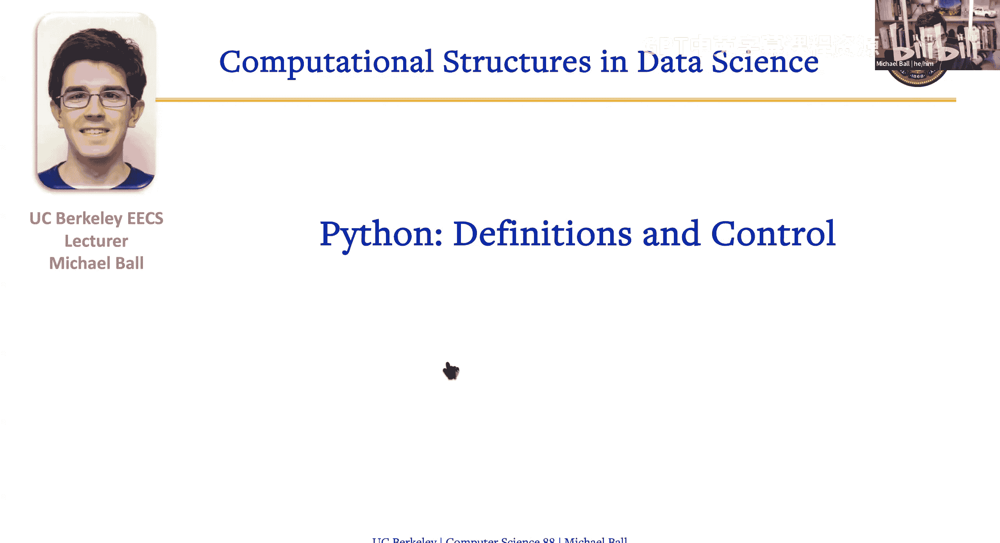

# 变量
class_name = "CS88"
"Hello " + class_name + "!"  # 结果为 "Hello CS88!"

# 使用内置函数
x = 5
y = 3
max(x, y)                 # 结果为 5
# 使用 help() 函数查看帮助
help(max)
```

## 条件语句

在能够创建复杂逻辑之前，我们需要一种让程序做决定的能力。这通过条件语句实现。

条件语句的基本结构是：
```python
if <条件表达式>:
    # 如果条件为真，执行这里的语句
else:
    # 如果条件为假，执行这里的语句
```

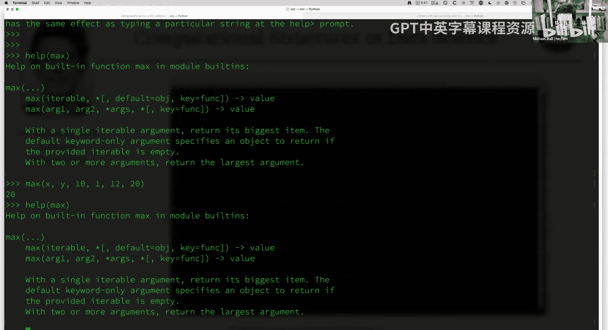

**注意**：在Python中，缩进（通常是一个Tab或4个空格）用于定义代码块，这是语法的一部分。

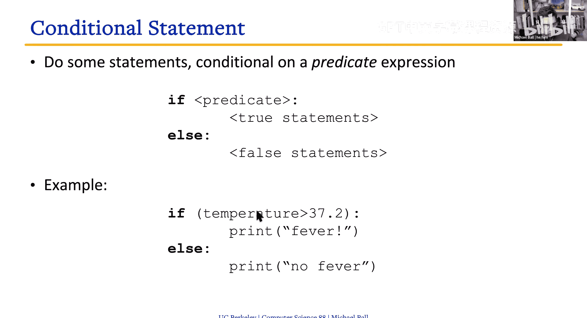

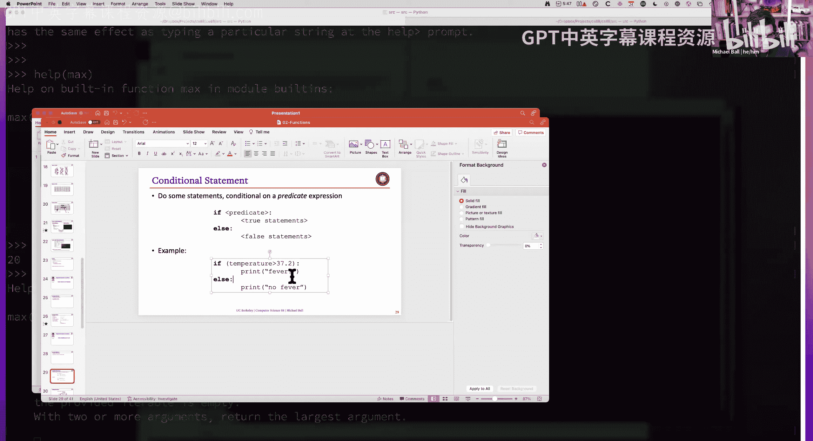

以下是条件语句的示例：
```python
x = 5

# 示例1：判断大小
if x < 10:
    print("x is small")
else:
    print("x is big")  # 输出: x is small

# 示例2：判断奇偶
if x % 2 == 0:         # % 是取模运算符，求余数
    print("x is even")
else:
    print("x is odd")   # 输出: x is odd
```
**关键点**：判断相等使用 `==`（双等号），以区别于赋值语句的 `=`（单等号）。

## 定义与使用函数

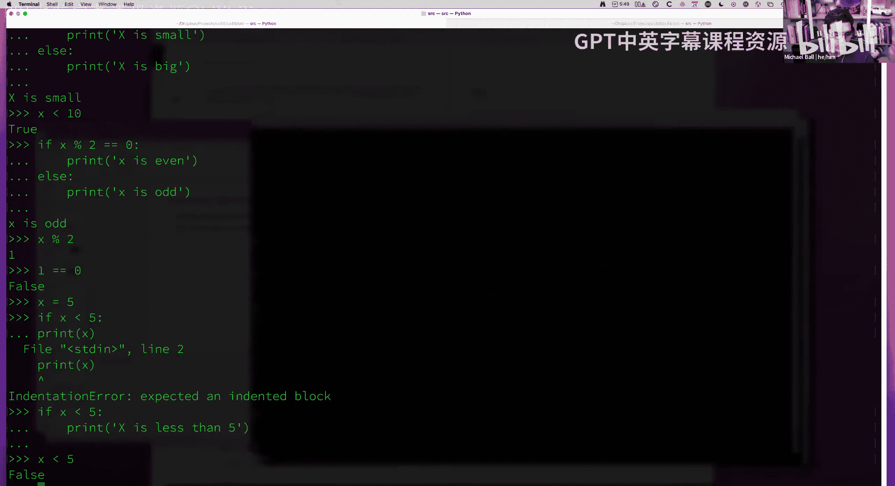

上一节我们学会了让程序做决定，本节中我们来看看如何将一系列操作封装成可重用的代码块——函数。

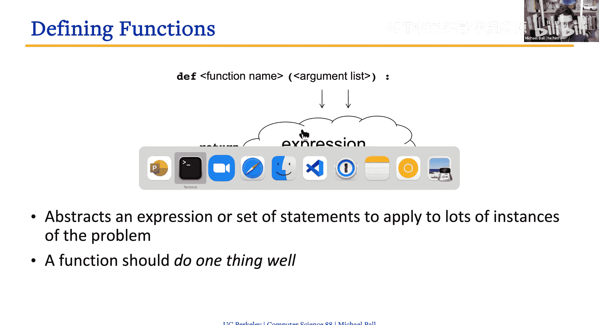

函数是抽象思想的直接体现。我们将复杂的操作细节隐藏在函数内部，对外只提供一个清晰的接口（函数名和参数）。

在Python中，使用 `def` 关键字定义函数：
```python
def <函数名>(<参数1>, <参数2>, ...):
    # 函数体
    return <返回值>
```

让我们定义两个简单的函数：

**1. 问候函数**
```python
def greet(name):
    return "Hello " + name + "!"

# 调用函数
greet("CS88")    # 返回 "Hello CS88!"
greet("RTA")     # 返回 "Hello RTA!"
```

**2. 自定义最大值函数**
```python
def my_max(x, y):
    if x > y:
        return x
    else:
        return y

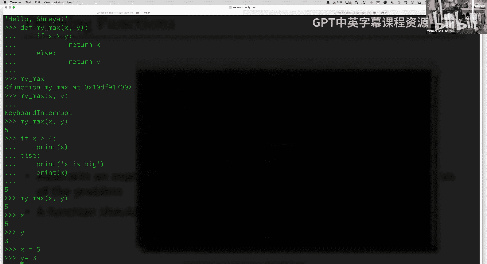

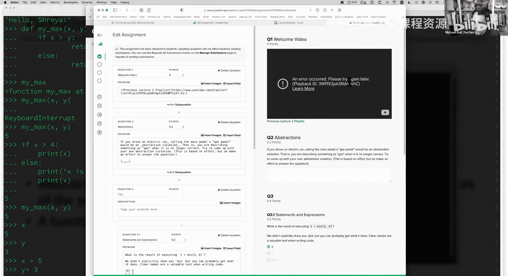

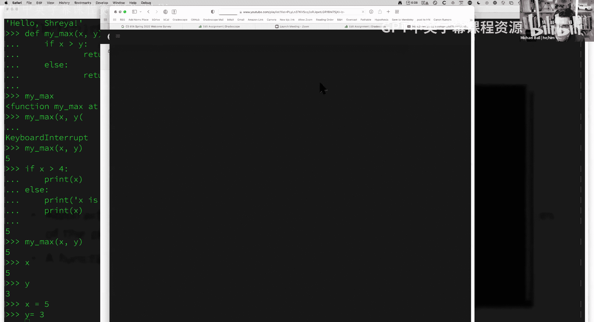

# 调用函数
my_max(5, 3)     # 返回 5
my_max(10, 20)   # 返回 20
```
**函数执行过程**：当我们调用 `my_max(5, 3)` 时，参数 `5` 和 `3` 分别赋值给函数内部的变量 `x` 和 `y`。函数体根据条件判断执行，并通过 `return` 语句将结果返回给调用者。


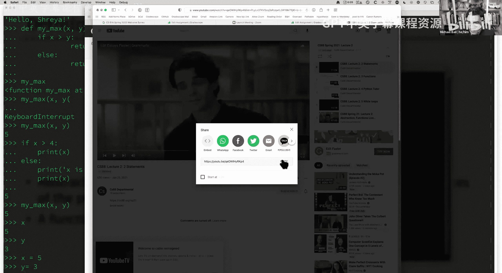

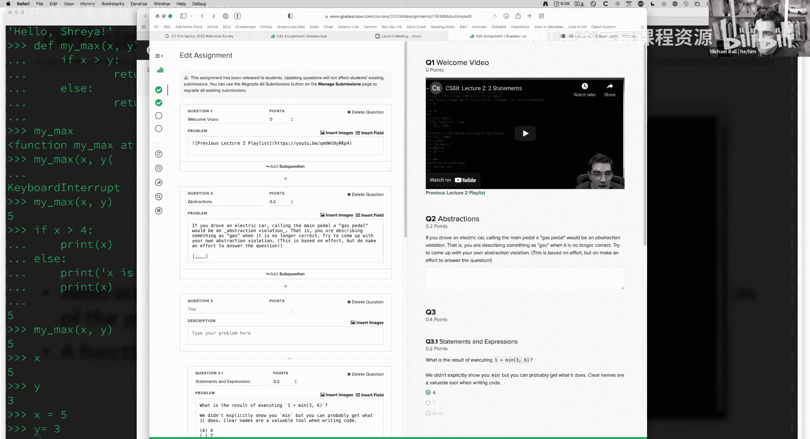

## 总结与后续

本节课中我们一起学习了计算机科学的核心思维模式——抽象，以及算法的概念。我们开始在Python中实践，学习了表达式、变量、条件语句（`if-else`），并成功创建了自己的函数（使用 `def` 和 `return`）。

函数是构建复杂程序的基础砖石。通过将代码组织成一个个功能明确的函数，我们可以让程序更易读、易维护和易复用。在接下来的课程中，我们将继续深入Python，学习更多数据类型和控制流工具，以构建更强大的程序。

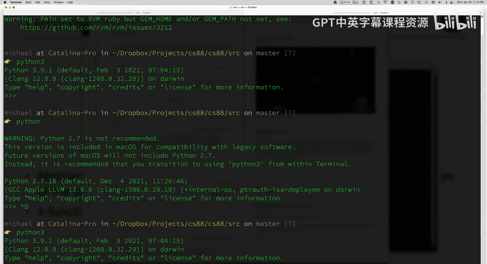

**提示**：练习是学习编程的最佳方式。请务必完成实验（Lab），在编辑器中编写代码文件（`.py`），并使用Python解释器进行尝试和调试。遇到问题时，善用 `help()` 函数和网络搜索。