# 3：函数与while循环 🐍

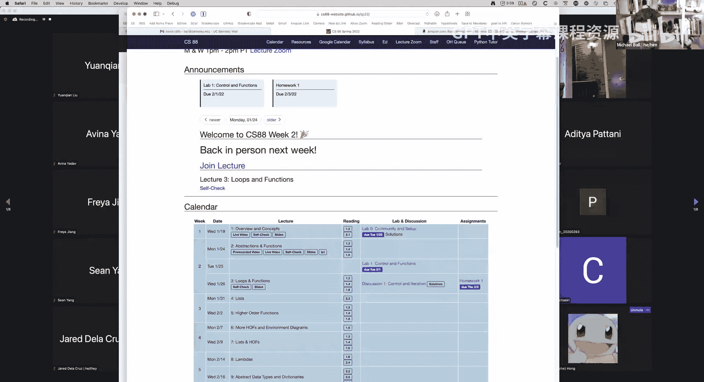

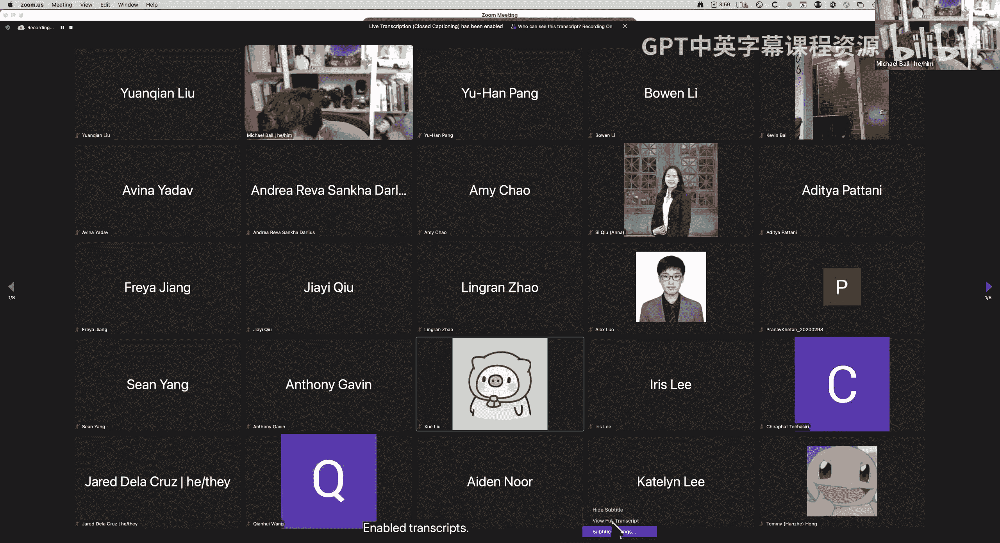

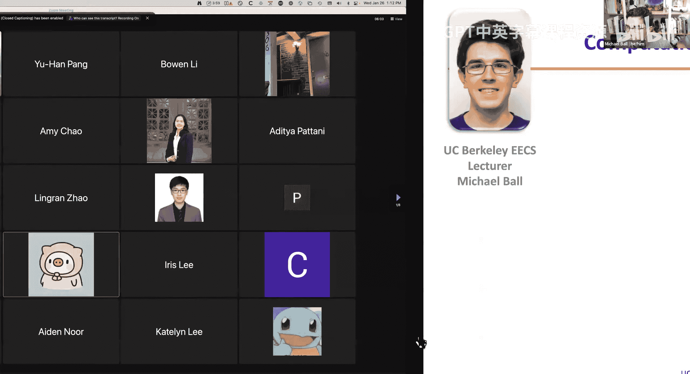

在本节课中，我们将要学习Python中的函数定义与调用，以及如何使用`while`循环来重复执行代码。我们将通过环境图来可视化Python执行代码的过程，并理解变量在不同作用域中的含义。

---

## 函数定义与调用

上一节我们介绍了Python的基本表达式和赋值语句。本节中，我们来看看如何定义和使用函数。

函数用于封装一个特定的功能。定义函数使用`def`语句，其基本结构如下：

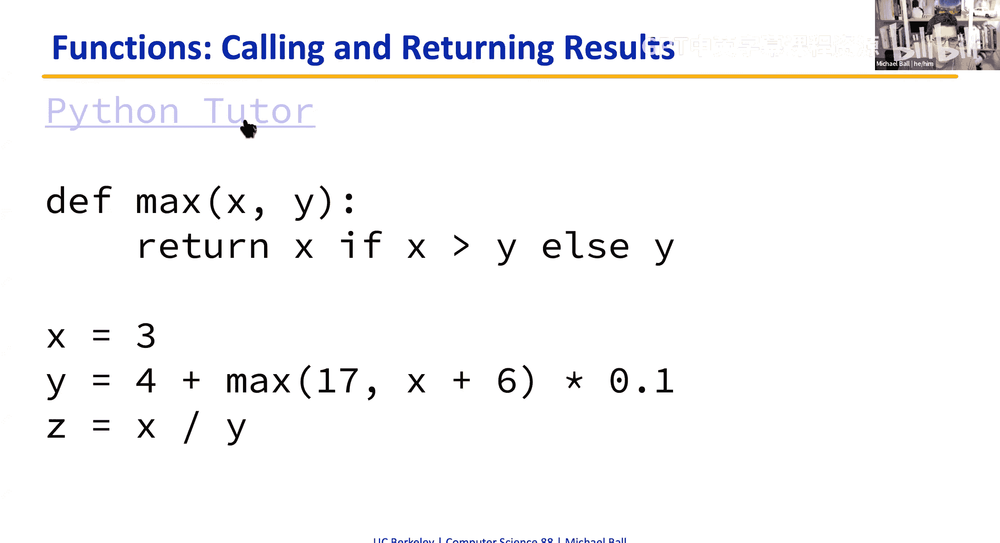

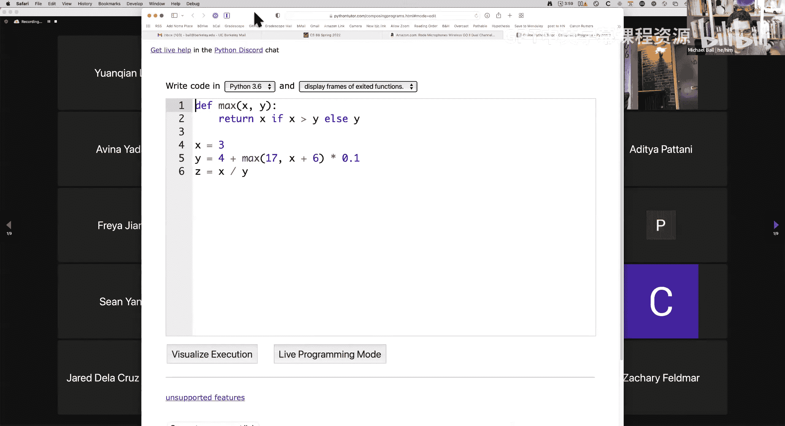

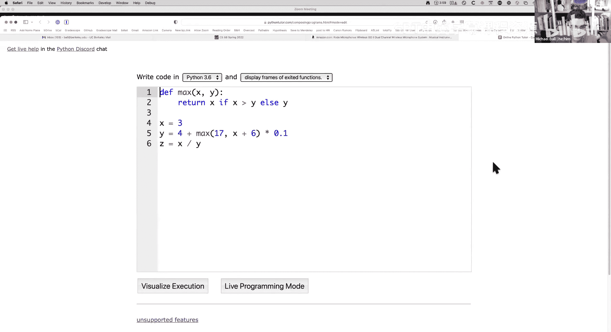


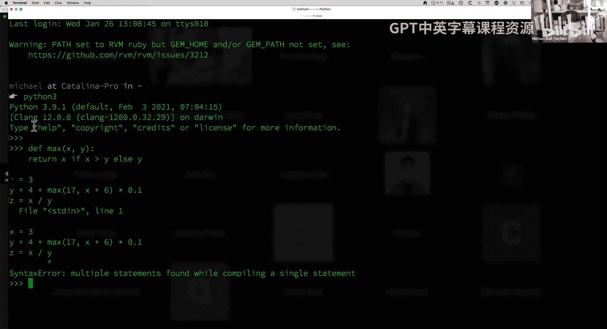


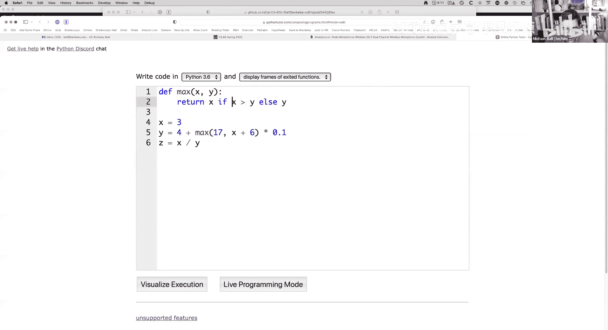


```python
def function_name(argument1, argument2):
    # 函数体
    return result
```

*   **`def`**：定义函数的关键字。
*   **函数名**：遵循变量命名规则，不能以数字开头，通常用下划线连接多个单词。
*   **参数列表**：括号内的变量，用于接收调用函数时传入的值。可以为空。
*   **函数体**：缩进的代码块，描述了函数要执行的操作。
*   **`return`** 语句：指定函数的返回值。每个函数都会返回某个值，如果没有显式`return`，则返回`None`。

函数的目的是将复杂任务分解为小而专一的任务，便于组合和复用。

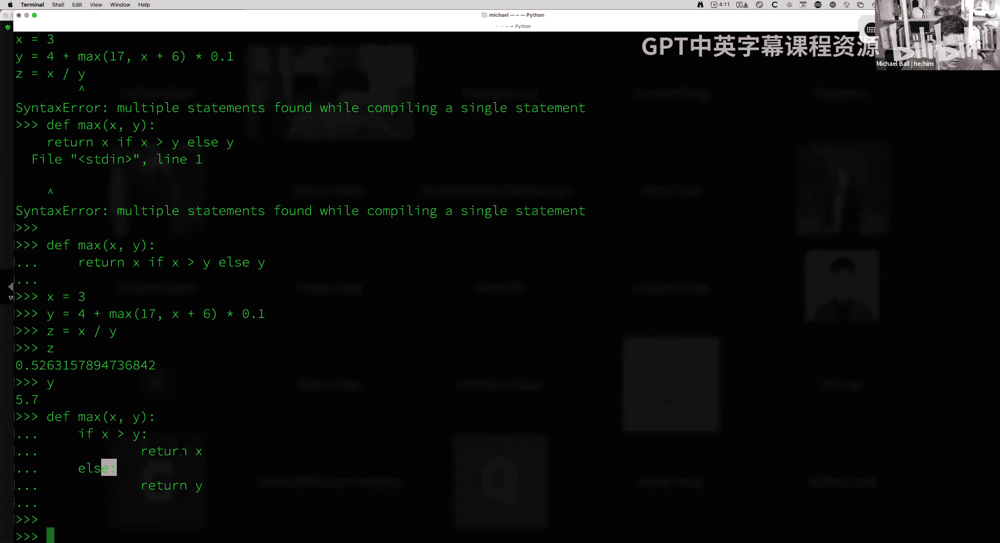

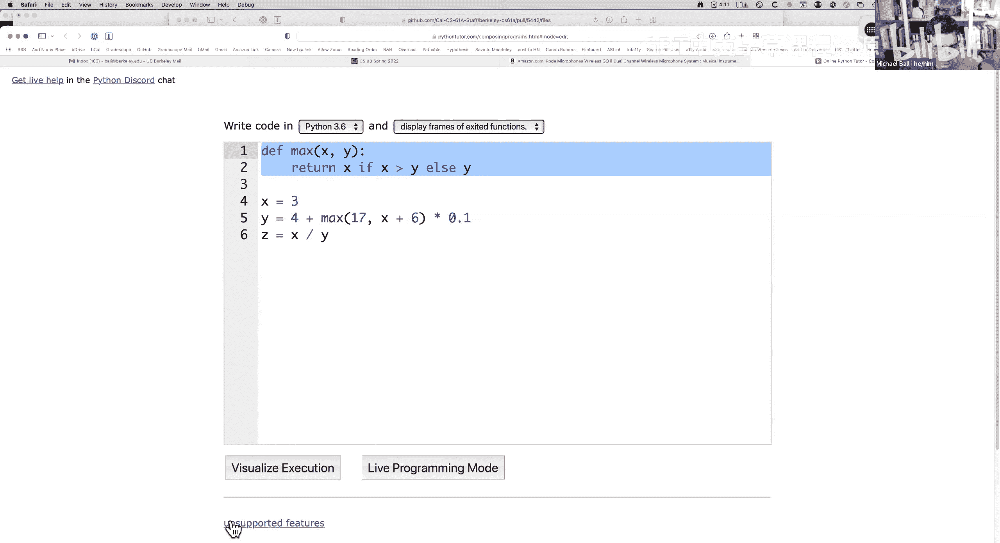

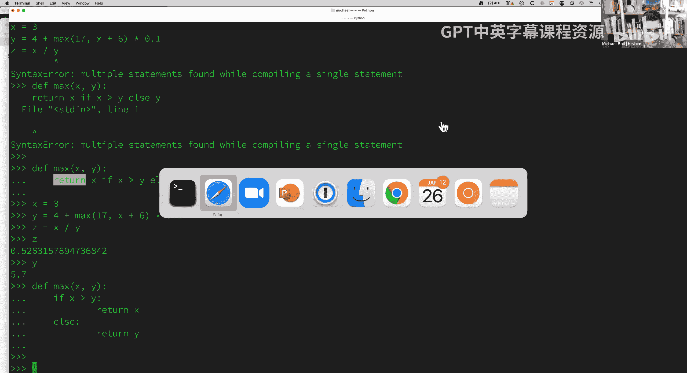

---

## 环境图：理解代码执行

当代码中多次使用同一个变量名（例如`x`）时，如何区分它们的不同含义？环境图是一个强大的可视化工具，可以帮助我们跟踪程序执行过程中变量与值的绑定关系。

环境图的核心组成部分包括：

*   **帧**：一个映射变量名到其值的“盒子”。每次函数调用都会创建一个新的帧。
*   **全局帧**：程序开始执行时的初始帧。
*   **父帧**：对于函数调用创建的帧，其父帧是该函数被定义时所在的帧。

以下是绘制环境图的基本步骤：

1.  从全局帧开始。
2.  执行赋值语句时，先计算等号右边的表达式。
3.  调用函数时，创建一个新帧。
4.  将简单值（数字、布尔值、字符串）直接写在帧的盒子内。
5.  将复杂值（如函数、列表）写在盒子右侧，并用箭头从变量名指向它。
6.  新帧的名称通常是函数名，其父帧是该函数定义所在的帧。
7.  在当前帧中查找变量时，如果找不到，则去其父帧中查找。

通过逐步执行代码并观察环境图的变化，我们可以清晰地看到变量`x`在全局帧和`max`函数帧中指向不同的值，从而理解作用域的概念。

---

## While循环：重复执行代码

在介绍了条件判断`if`语句后，本节我们来看看另一种控制语句：`while`循环。`while`循环用于在某个条件为真时，重复执行一段代码。

其基本语法是：
```python
while condition:
    # 循环体
    # 通常包含改变条件的代码
```

只要`condition`表达式的值为`True`，缩进的循环体就会一直执行。一旦`condition`变为`False`，程序就会跳出循环，继续执行后面的代码。

以下是一个使用`while`循环计算1到10之和的例子：

```python
total = 0
number = 1
while number <= 10:
    total += number  # 等价于 total = total + number
    number += 1      # 改变条件，使循环最终能结束
print(total) # 输出 55
```

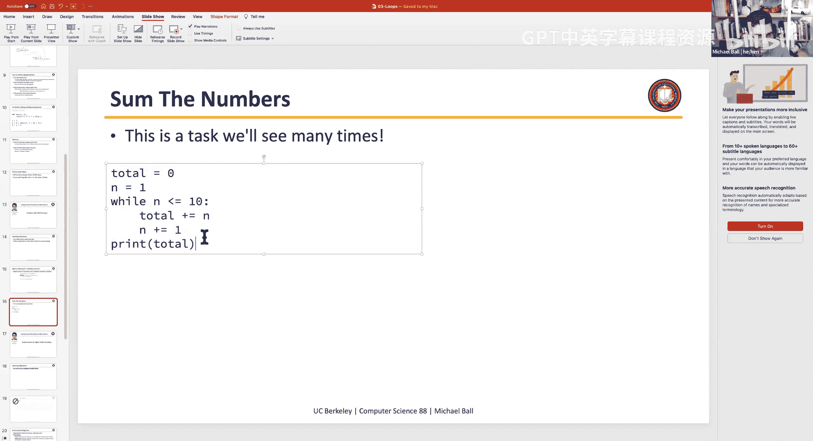

在这个例子中：
1.  初始时`total=0`, `number=1`。
2.  检查条件`number <= 10`，为真，进入循环体。
3.  将`number`加到`total`上，然后将`number`增加1。
4.  再次检查条件，重复步骤2和3，直到`number`变为11，条件为假，循环结束。
5.  打印`total`的值55。

**关键点**：循环体内必须包含能改变循环条件的代码（例如`number += 1`），否则可能导致无限循环。

---

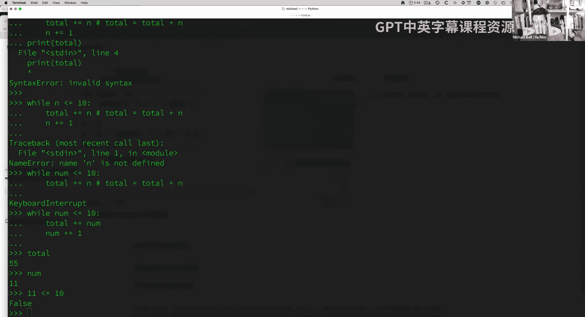

本节课中我们一起学习了如何定义和调用函数，使用环境图来理解代码的执行过程和变量作用域，并初步掌握了使用`while`循环来重复执行代码块。这些是构建更复杂程序的基础模块。下一讲我们将继续探索其他类型的循环和控制结构。