# 4：循环与列表 🐍

在本节课中，我们将要学习 Python 中两个极其有用的结构：**列表** 和 **for 循环**。列表允许我们有序地存储多个数据项，而 for 循环则提供了一种高效的方式来遍历这些数据项。掌握这两者是编写强大、通用程序的关键。

## 概述 📋

本节课我们将从 Python 列表的基础知识开始，包括如何创建、访问和操作列表。接着，我们将探讨如何通过 **切片** 来获取列表的子集。最后，我们将引入 **for 循环**，学习如何用它来遍历列表、字符串等序列，从而对每个元素执行操作。

---

## 列表：创建与基础

列表是 Python 中一种灵活的数据类型，可以容纳从零到数百万个元素。列表用方括号 `[]` 表示，元素之间用逗号分隔。

**创建一个列表的语法如下：**
```python
my_list = [item1, item2, item3]
```

例如，一个课程列表可以这样表示：
```python
courses = [‘CS88‘, ‘Data 8‘, ‘Math 54‘]
```
列表可以包含不同类型的数据，但为了程序清晰，通常存储具有相似用途的数据。

**一个重要概念：索引从0开始**
在 Python 中，列表的第一个元素的索引是 `0`，而不是 `1`。这是一个常见的错误来源，需要时刻牢记。
```python
first_course = courses[0]  # 获取第一个元素 ‘CS88‘
```

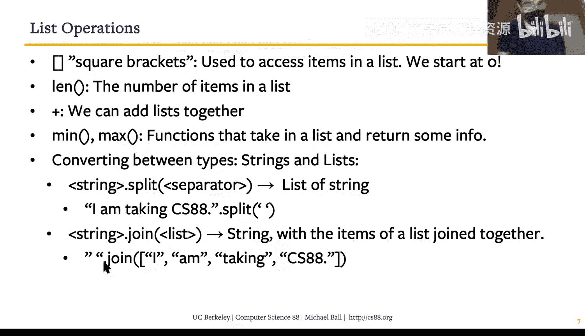

---

## 列表操作：访问与组合

上一节我们介绍了如何创建列表，本节中我们来看看如何访问列表中的元素以及组合多个列表。

Python 为列表提供了多种内置操作。`len()` 函数可以返回列表的长度（即元素个数）。

**获取列表长度：**
```python
num_courses = len(courses)  # 结果为 3
```

我们可以使用加号 `+` 来连接两个列表，生成一个新列表。

**连接列表：**
```python
all_courses = courses + [‘Econ 1‘, ‘Stat 88‘]
```
注意，尝试对列表进行不合逻辑的操作（如相除）会导致错误。

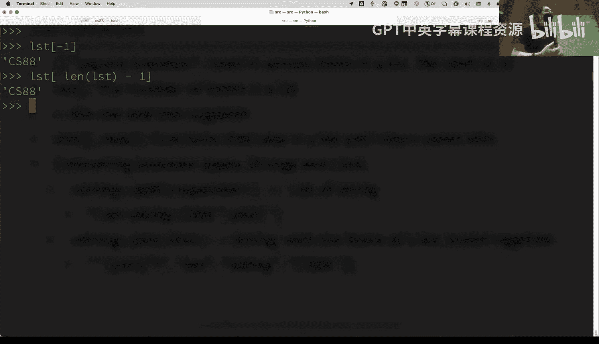

**通过索引访问元素时，如果索引超出列表范围，Python 会抛出 `IndexError`。**
```python
# courses 只有3个元素，索引为 0, 1, 2
# courses[3]  # 这将导致 IndexError: list index out of range
```

**获取最后一个元素的技巧：**
由于索引从0开始，最后一个元素的索引是 `长度 - 1`。Python 也支持负索引，`-1` 直接表示最后一个元素。
```python
last_course = courses[-1]  # 获取最后一个元素 ‘Math 54‘
last_course_alt = courses[len(courses) - 1]  # 另一种方法
```

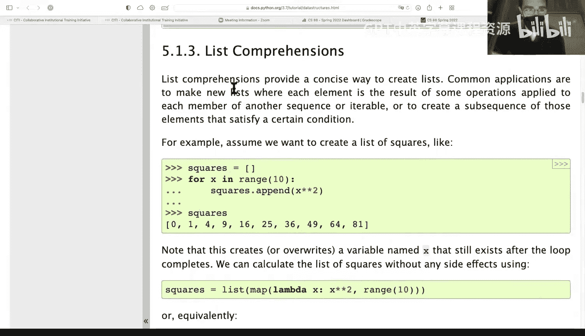

---

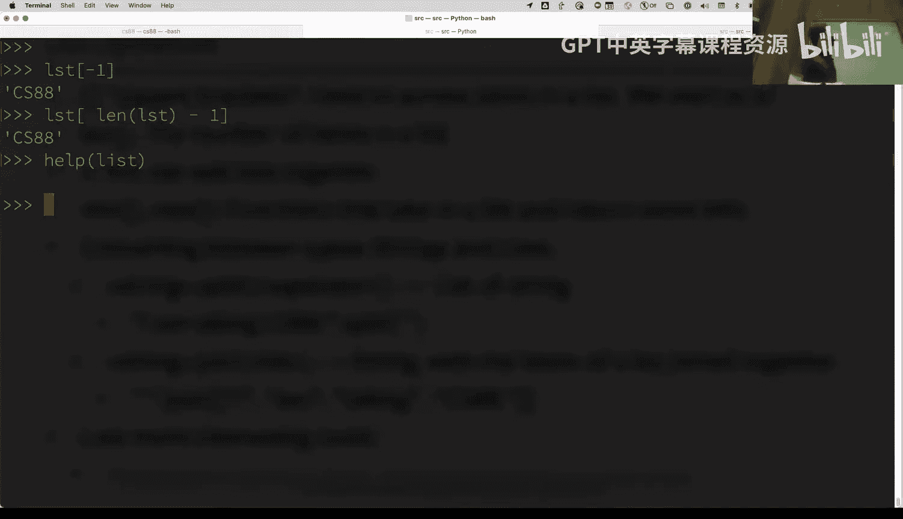

## 字符串与列表的转换

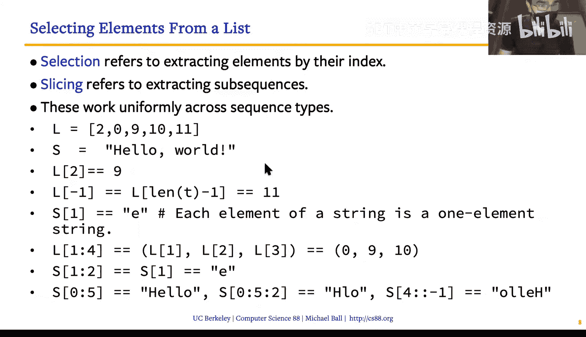

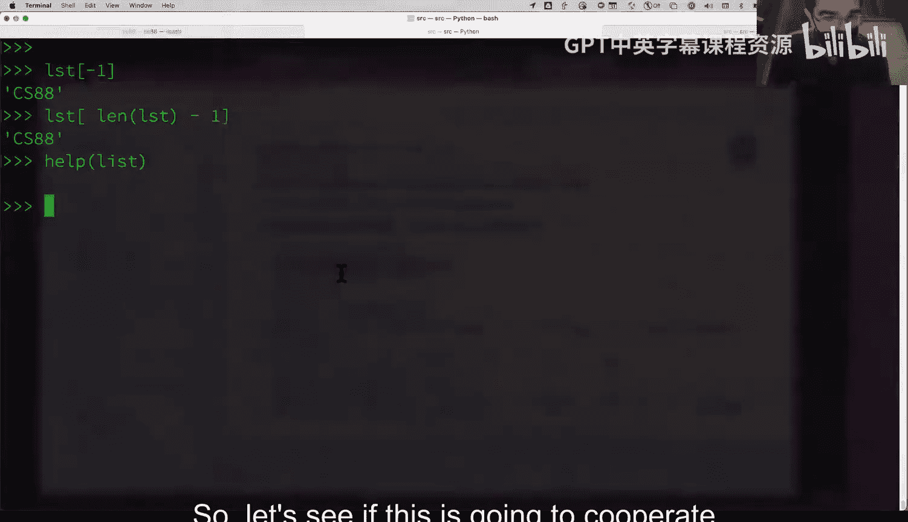

列表和字符串在 Python 中都是“序列”，它们有一些相似的操作。两个特别有用的函数是 `split()` 和 `join()`。

`split()` 方法可以将一个字符串按指定分隔符拆分成一个单词列表。
`join()` 方法则是其逆操作，将一个字符串列表连接成一个单独的字符串。

**字符串分割与连接示例：**
```python
sentence = “I am taking CS88“
word_list = sentence.split(“ “)  # 按空格分割，得到 [‘I‘, ‘am‘, ‘taking‘, ‘CS88‘]

new_sentence = “ “.join(word_list)  # 用空格连接，得到 “I am taking CS88“
```
请注意，变量名应避免使用 Python 的关键字 `list`，常用 `lst` 代替。

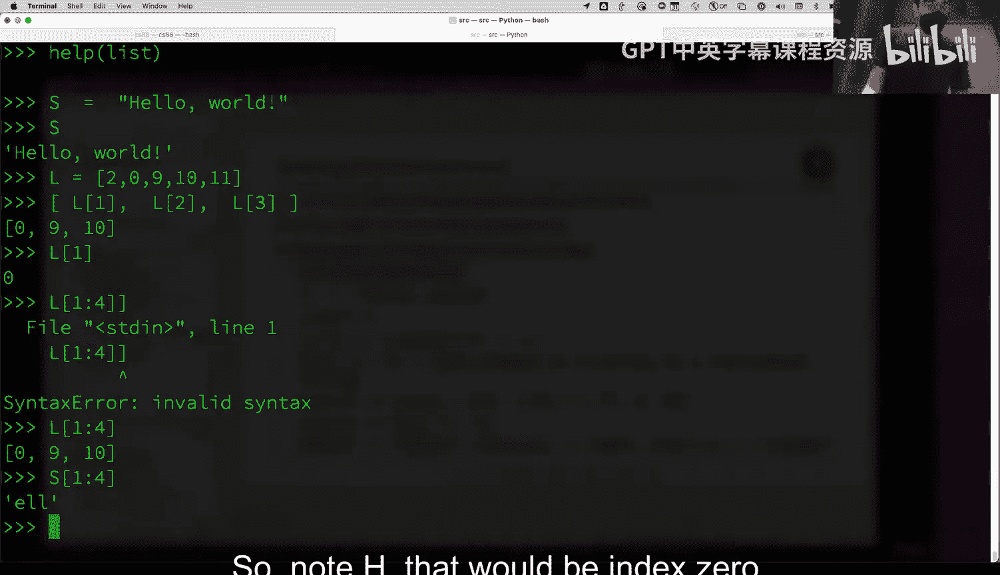

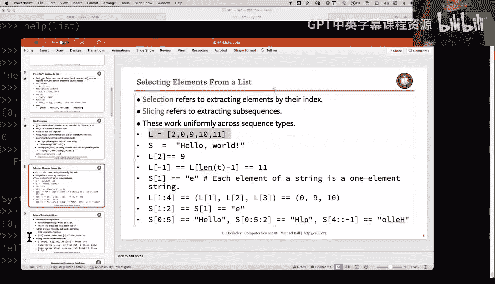


---

## 列表切片：获取子集

之前我们学习了如何访问单个列表元素。切片则允许我们一次性获取列表的一个连续子集。

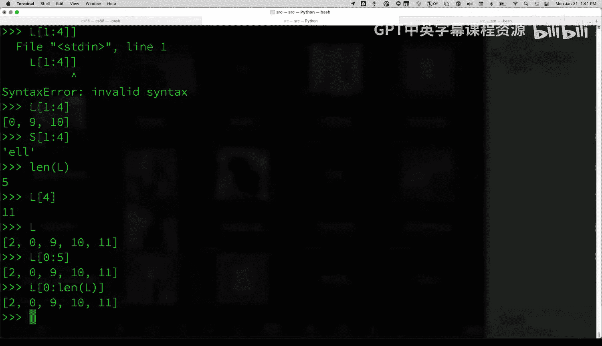

切片使用冒号 `:` 语法，格式为 `list[start:stop]`。**重要规则：切片包含起始索引 `start` 的元素，但不包含结束索引 `stop` 的元素。**

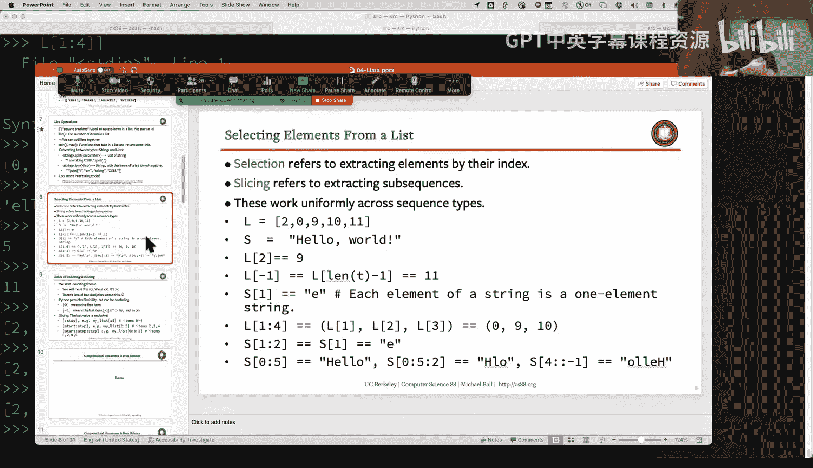

**基本切片示例：**
```python
numbers = [2, 0, 9, 1, 11]
sub_list = numbers[1:4]  # 获取索引 1, 2, 3 的元素，结果为 [0, 9, 1]
# 注意：索引4（值为11）不包含在内
```

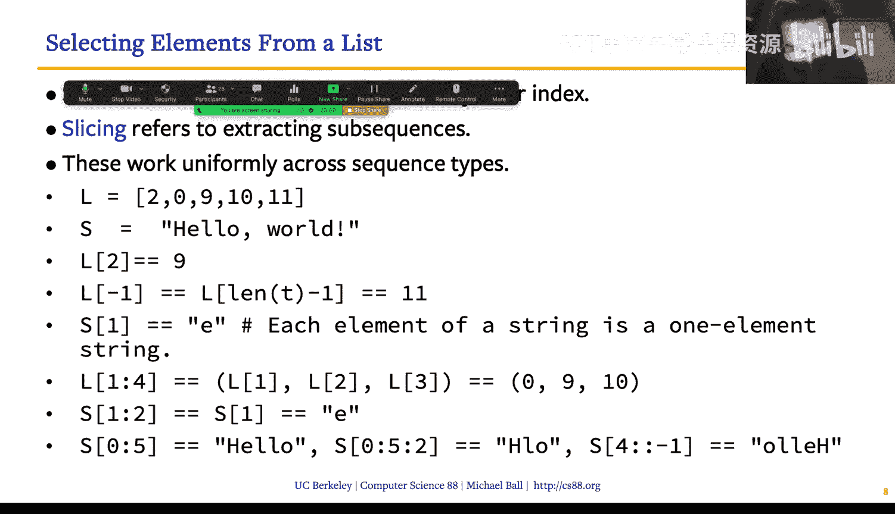

**获取整个列表的切片：**
```python
copy_of_numbers = numbers[0:len(numbers)]  # 等同于 numbers[:]
```

切片还可以指定步长 `step`，格式为 `list[start:stop:step]`。

**带步长的切片示例：**
```python
every_other = numbers[::2]  # 从开始到结束，步长为2，结果为 [2, 9, 11]
```

**一个常用技巧：使用 `[::-1]` 来反转列表。**
```python
reversed_numbers = numbers[::-1]  # 结果为 [11, 1, 9, 0, 2]
```
**关键区别：** 切片操作会返回列表的一个**新副本**，不会修改原列表。而像 `list.reverse()` 这样的方法会**直接修改**原列表。

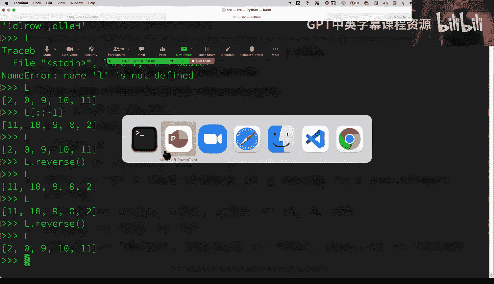

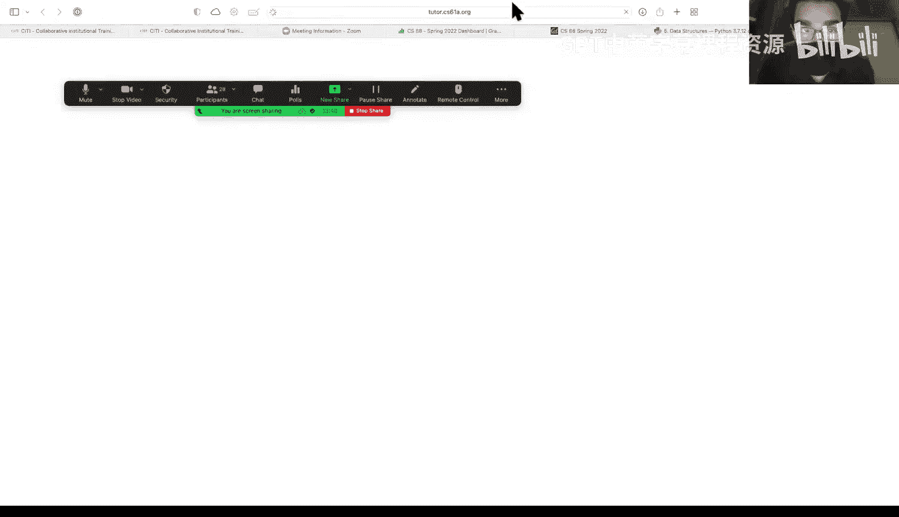

---

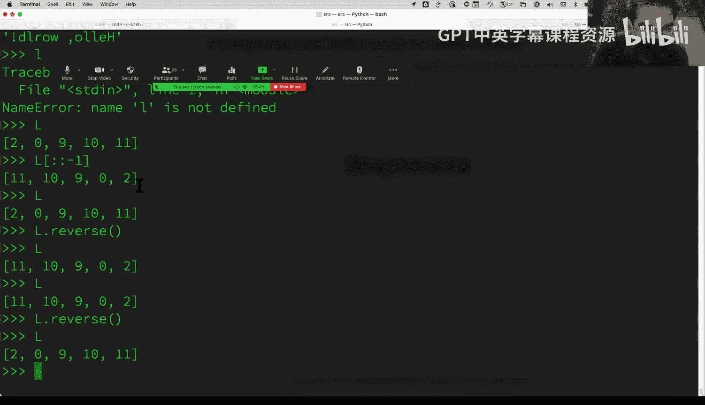

## 序列与 for 循环

我们已接触了两种序列：列表和字符串。现在引入第三种：`range`。`range` 函数生成一个数字序列，常用于控制循环次数。

`range` 的语法与切片类似：`range(start, stop, step)`。同样，它包含 `start`，不包含 `stop`。

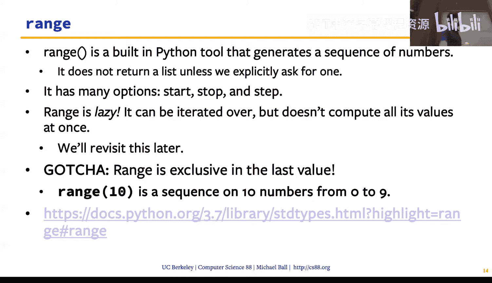

**range 函数示例：**
```python
list(range(5))          # 生成 [0, 1, 2, 3, 4]
list(range(1, 5))       # 生成 [1, 2, 3, 4]
list(range(0, 10, 2))   # 生成 [0, 2, 4, 6, 8]
```

**for 循环** 是遍历序列中每个元素的完美工具。其基本结构如下：
```python
for variable in sequence:
    # 执行操作
```

**遍历 range：**
```python
for number in range(5):
    print(number)  # 依次打印 0, 1, 2, 3, 4
```

**遍历列表：**
```python
for course in courses:
    print(“I am taking “ + course)
```
良好的变量命名习惯（如单数 `course` 遍历复数 `courses`）能使代码更易读。

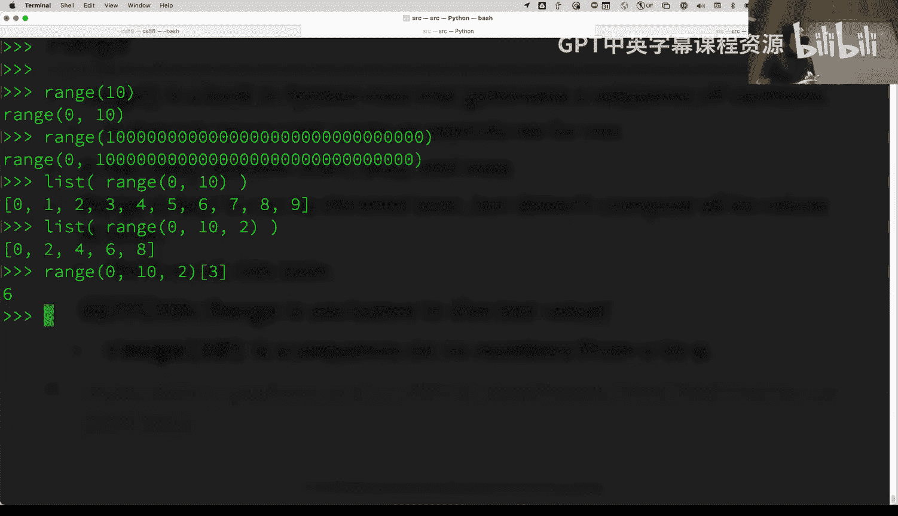

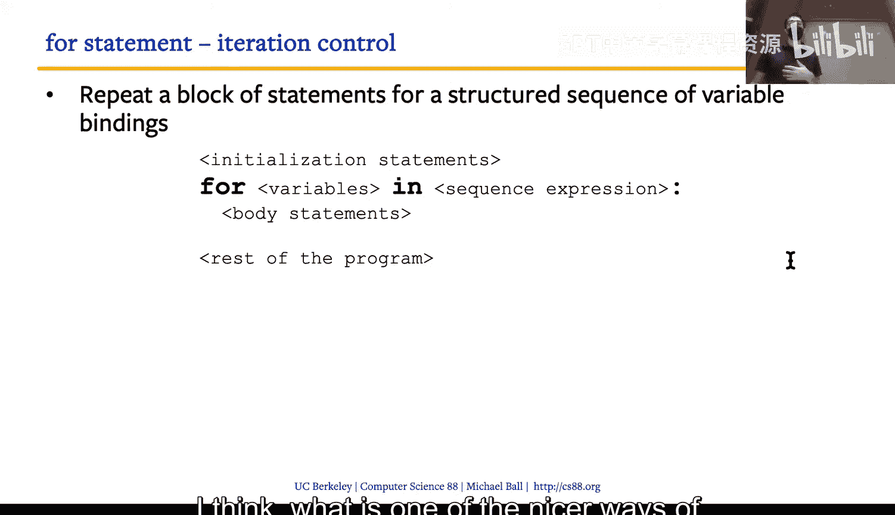

**遍历字符串：**
```python
for char in “hello“:
    print(char)  # 依次打印 h, e, l, l, o
```
for 循环提供了一种清晰、简洁的方式来处理序列中的每一项数据。

---

## 总结 🎯

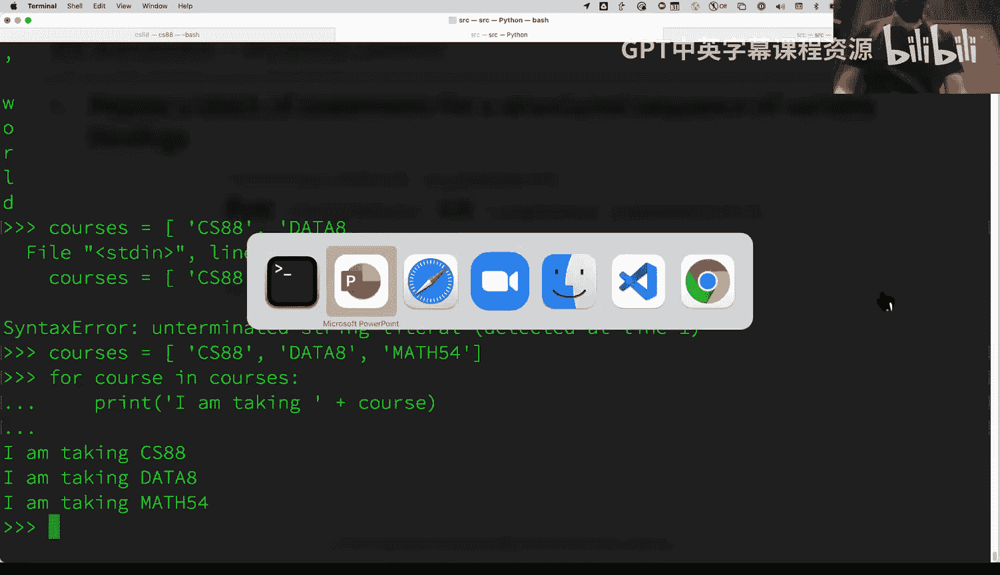

本节课中我们一起学习了 Python 编程的核心组件。我们首先深入了解了**列表**的创建、索引和基本操作，并强调了索引从0开始这一关键点。接着，我们探索了强大的**切片**功能，它能高效地获取列表子集。然后，我们介绍了 `range` 函数和**for 循环**，后者是将操作应用于序列中每个元素的标准化工具。列表与 for 循环的结合，为我们处理各种数据集合奠定了坚实的基础。在接下来的课程中，我们将利用这些工具构建更复杂的程序。