# 6：高阶函数与列表处理 🧮

在本节课中，我们将学习三个非常实用的高阶函数：`map`、`filter` 和 `reduce`。我们将了解它们如何对数据进行处理，以及它们与列表推导式的相似之处。通过组合这些函数，我们可以构建出强大的数据处理流程。

## 概述 📋

上一节我们讨论了函数的基本概念。本节中，我们将重点介绍三个高阶函数：`map`、`filter` 和 `reduce`。这些函数允许我们将一个函数作为参数传递给另一个函数，从而对数据序列进行处理。`map` 和 `filter` 与列表推导式有直接的类比关系，而 `reduce` 则采用了一种完全不同的处理机制。

## `map` 函数：对序列应用函数 🔄

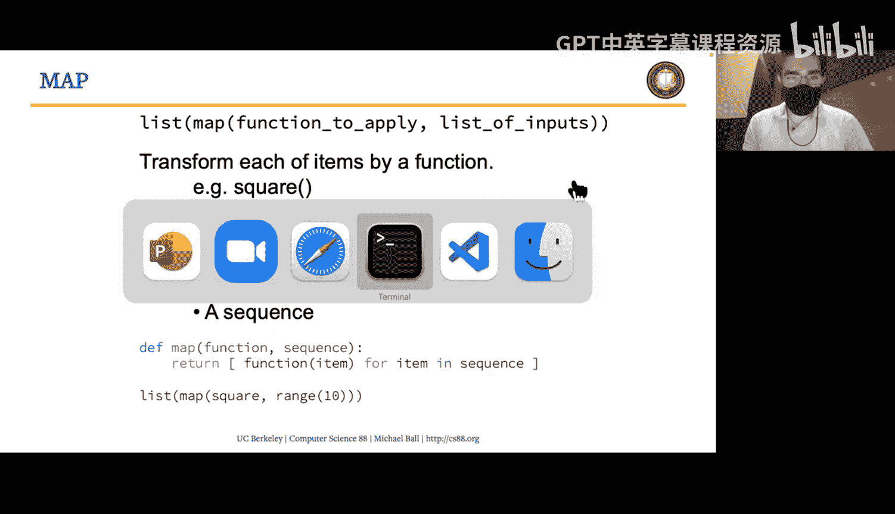

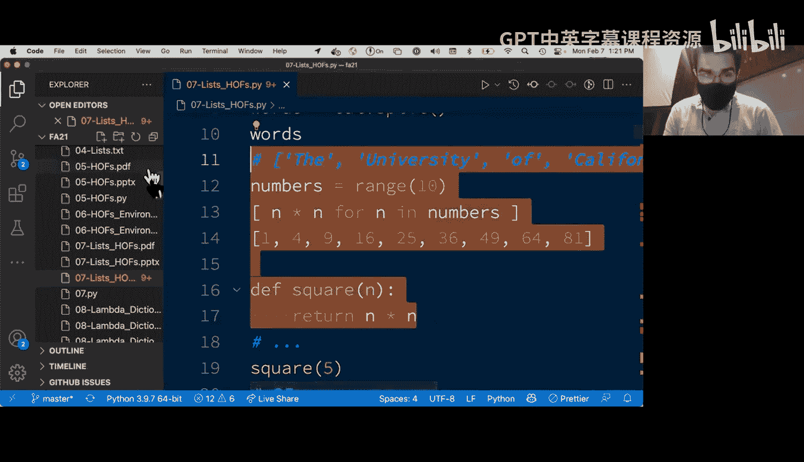

`map` 函数允许我们将一个函数应用到序列中的每一个元素上。我们可以将其视为列表推导式的一种替代方式，但它以“惰性”或“按需”的方式计算结果。

### 工作原理

`map` 函数接收两个参数：一个函数和一个序列。它会对序列中的每个元素应用该函数，并返回一个 `map` 对象。为了查看结果，我们通常需要使用 `list()` 函数将其转换为列表。

以下是 `map` 函数的一个简单示例：

```python
# 定义一个平方函数
def square(x):
    return x * x

# 创建一个数字列表
numbers = list(range(10))  # [0, 1, 2, ..., 9]

# 使用列表推导式计算平方
squares_comprehension = [n * n for n in numbers]

# 使用 map 函数计算平方
squares_map = list(map(square, numbers))

# 两种方法的结果相同
print(squares_comprehension)  # 输出: [0, 1, 4, ..., 81]
print(squares_map)            # 输出: [0, 1, 4, ..., 81]
```

### 关键点

*   `map` 返回一个新的序列，不会修改原始输入列表。
*   传递给 `map` 的函数应该接收一个参数并返回一个值。
*   与 `range` 类似，`map` 对象是惰性求值的，只有在需要时（例如调用 `list()`）才会进行计算。

## `filter` 函数：过滤序列中的元素 🎯

`filter` 函数用于过滤序列中的元素。它接收一个返回布尔值的函数（谓词函数）和一个序列，并保留使该函数返回 `True` 的元素。

### 工作原理

与 `map` 类似，`filter` 也返回一个可迭代对象（`filter` 对象），通常需要转换为列表来查看结果。

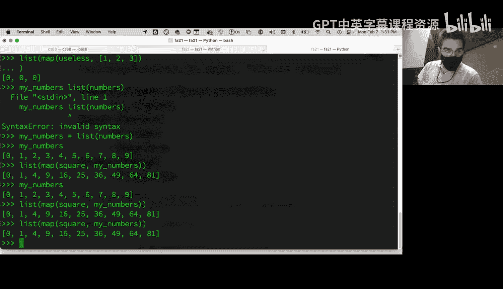

以下是 `filter` 函数的一个示例：

```python
# 定义一个判断偶数的函数
def is_even(n):
    return n % 2 == 0

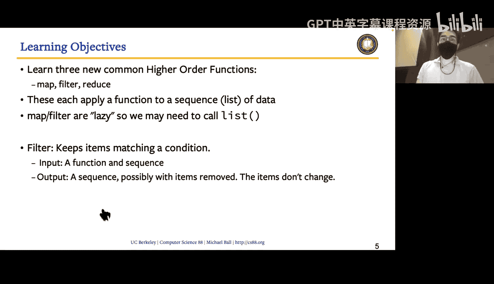

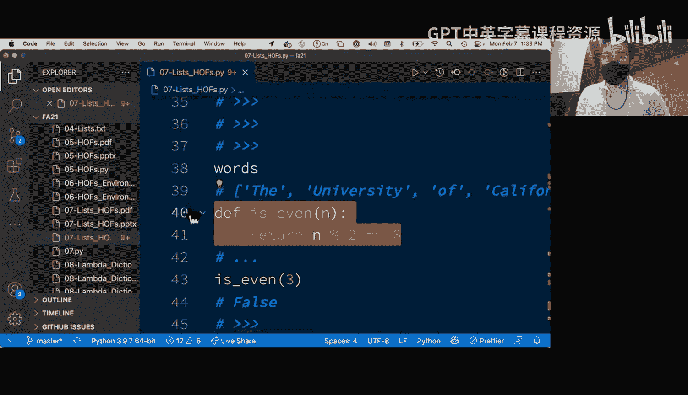

# 使用 filter 过滤偶数
even_numbers = list(filter(is_even, numbers))

# 使用列表推导式实现相同功能
even_numbers_comprehension = [n for n in numbers if is_even(n)]

print(even_numbers)               # 输出: [0, 2, 4, 6, 8]
print(even_numbers_comprehension) # 输出: [0, 2, 4, 6, 8]
```

### 关键点

*   `filter` 函数不会改变元素的值，只会决定是否保留该元素。
*   理想情况下，传递给 `filter` 的函数应始终返回布尔值。

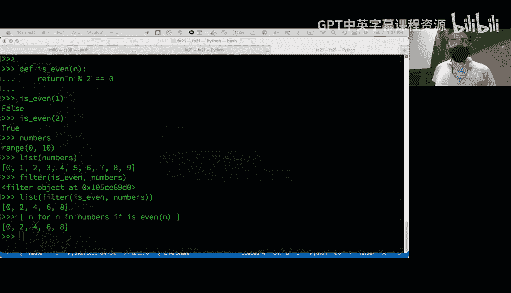

## 组合 `map` 和 `filter` 🧩

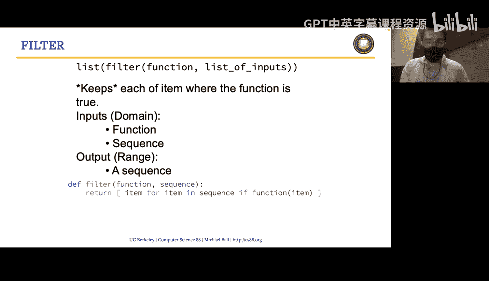

`map` 和 `filter` 的强大之处在于它们可以轻松组合，以构建复杂的数据处理管道。

例如，要计算列表中所有偶数的平方，我们可以先过滤出偶数，然后对结果应用平方函数：

```python
# 先过滤，再映射
evens = filter(is_even, numbers)
squares_of_evens = list(map(square, evens))

print(squares_of_evens)  # 输出: [0, 4, 16, 36, 64]
```

## `reduce` 函数：归约序列为单个值 📉

`reduce` 函数（需要从 `functools` 模块导入）用于将序列中的元素通过某种操作组合（或“折叠”）成一个单一的值。它与 `map` 和 `filter` 有本质不同，因为它考虑的是序列中两个元素之间的关系。

### 工作原理

`reduce` 接收一个接收两个参数的函数和一个序列。它首先对序列的前两个元素应用该函数，然后将结果与下一个元素结合，依此类推，直到序列耗尽，最终返回一个值。

以下是 `reduce` 函数的一个示例：

```python
from functools import reduce
from operator import add, mul

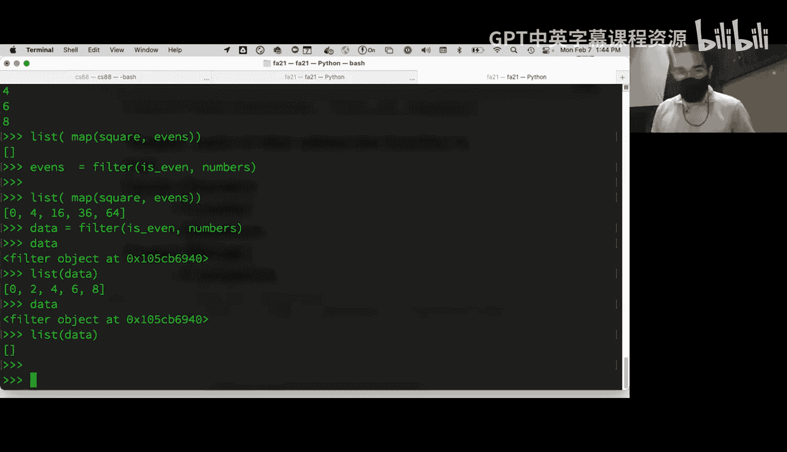

# 使用 reduce 计算列表元素的和
sum_of_numbers = reduce(add, numbers)  # 相当于 0+1+2+...+9
print(sum_of_numbers)  # 输出: 45

# 使用 reduce 计算列表元素的乘积（从1开始）
product_of_numbers = reduce(mul, range(1, 10)) # 相当于 1*2*3*...*9
print(product_of_numbers)  # 输出: 362880
```

### 关键点

*   `reduce` 需要一个接收两个参数并返回一个值的函数。
*   它最终返回一个单一的值，而不是一个序列。
*   常见的用例包括求和、求积、找最大值或最小值。

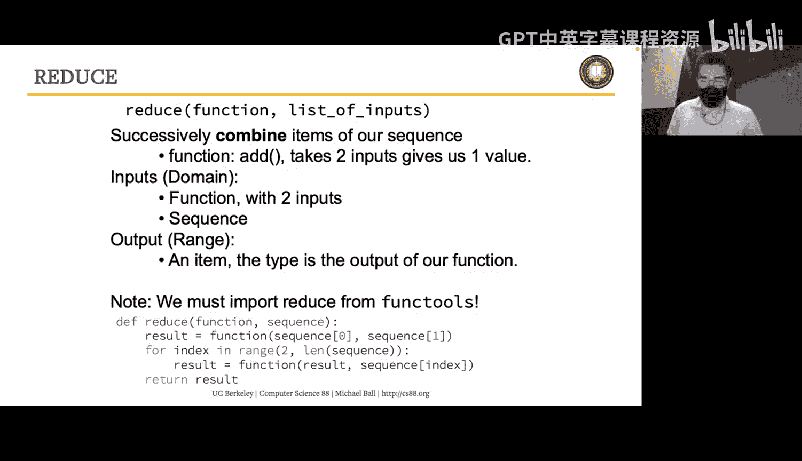

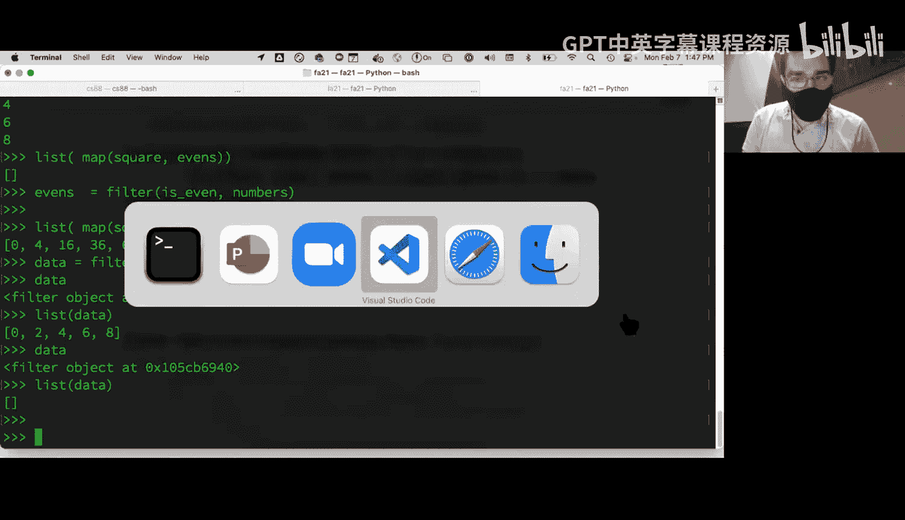

## 综合示例：构建缩写词 🏫

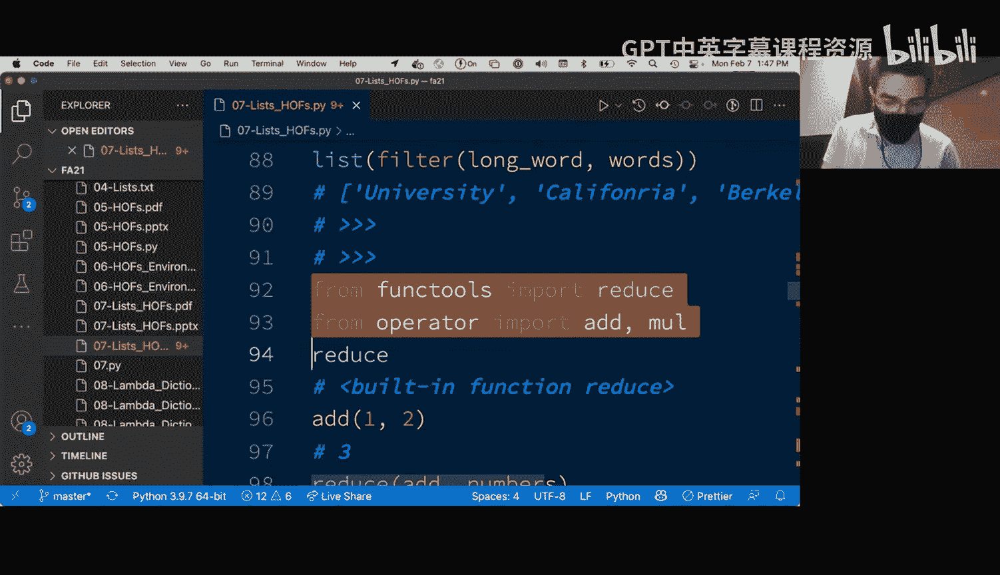

现在，让我们运用所学的三个函数来解决一个实际问题：从一个短语中构建其缩写词（例如，将 “University of California at Berkeley” 转换为 “UCB”）。

我们将问题分解为几个步骤：
1.  **拆分**：将句子拆分成单词列表。
2.  **过滤**：过滤掉短单词（例如，“the”, “of”, “at”）。
3.  **映射**：获取每个保留单词的首字母。
4.  **归约**：将首字母组合成一个字符串。

以下是实现代码：

```python
from functools import reduce
from operator import add

sentence = "the University of California at Berkeley"

# 步骤1: 拆分句子为单词列表
words = sentence.split()  # ['the', 'University', 'of', 'California', 'at', 'Berkeley']

# 步骤2: 过滤，只保留长度大于2的单词
def is_long_word(word):
    return len(word) > 2

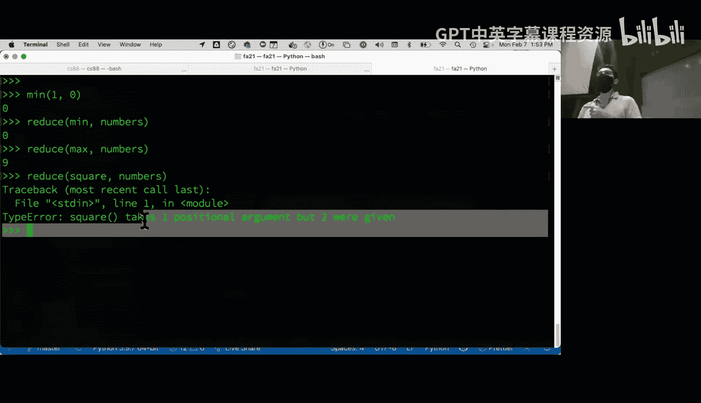

long_words = list(filter(is_long_word, words))  # ['University', 'California', 'Berkeley']

# 步骤3: 映射，获取每个单词的首字母
def first_letter(word):
    return word[0]

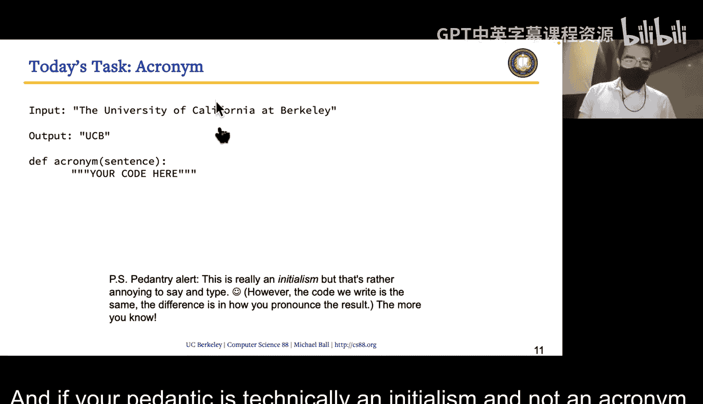

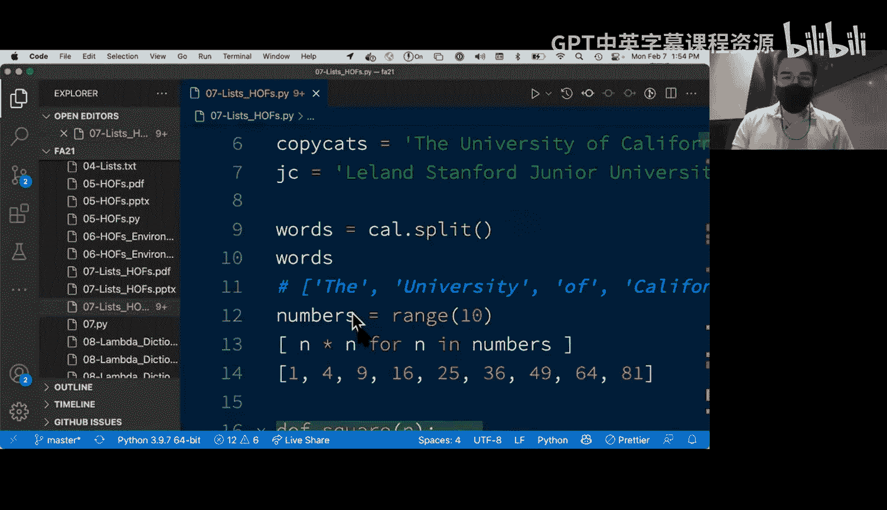

initials = list(map(first_letter, long_words))  # ['U', 'C', 'B']

# 步骤4: 归约，将首字母连接成一个字符串
acronym = reduce(add, initials)  # 'UCB'

print(acronym)  # 输出: UCB
```

我们也可以将步骤链式组合在一行代码中（虽然可能影响可读性）：

```python
acronym_chain = reduce(add,
                       map(first_letter,
                           filter(is_long_word,
                                  sentence.split())))
print(acronym_chain)  # 输出: UCB
```

## 总结 🎓

本节课中我们一起学习了三个核心的高阶函数：
*   **`map(func, seq)`**：将函数 `func` 应用于序列 `seq` 的每个元素，返回一个新的序列。
*   **`filter(func, seq)`**：使用返回布尔值的函数 `func` 过滤序列 `seq`，保留使函数返回 `True` 的元素。
*   **`reduce(func, seq)`**：使用接收两个参数的函数 `func` 将序列 `seq` 的元素依次组合，最终归约成一个单一的值。

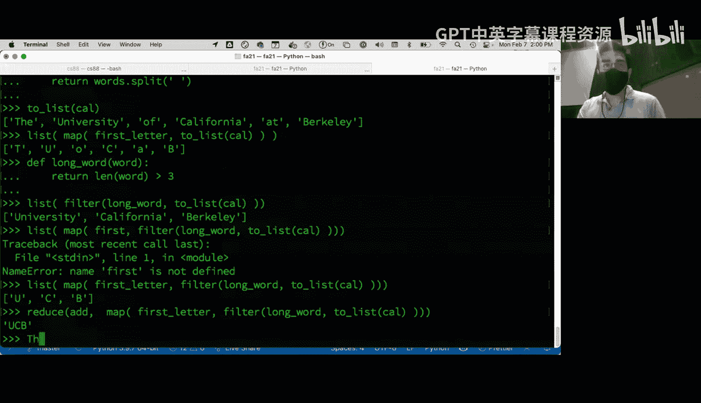

这些函数鼓励我们将复杂问题分解为小的、可组合的步骤，每个步骤专注于一个简单的转换或过滤操作。通过组合 `map`、`filter` 和 `reduce`，我们可以以声明式和函数式的方式构建清晰、强大的数据处理流程，而无需编写复杂的循环结构。