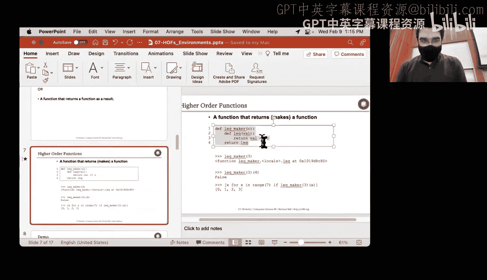
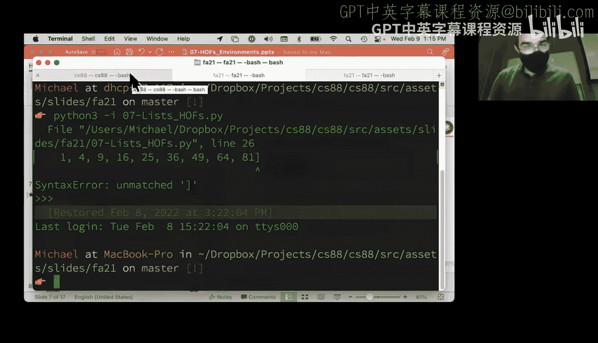
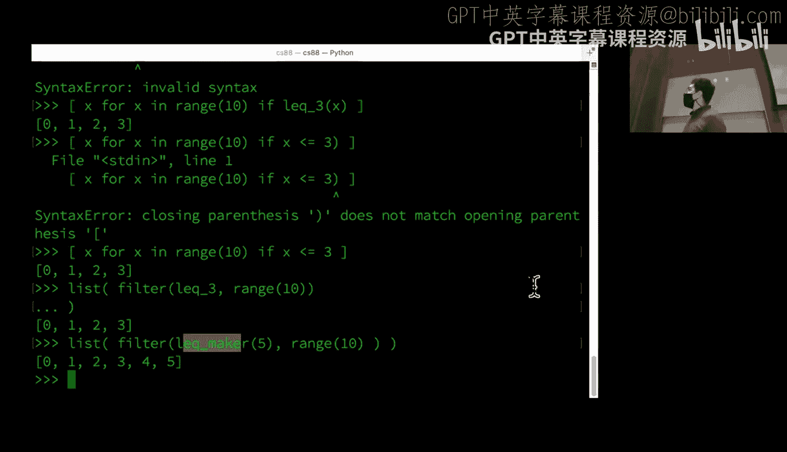
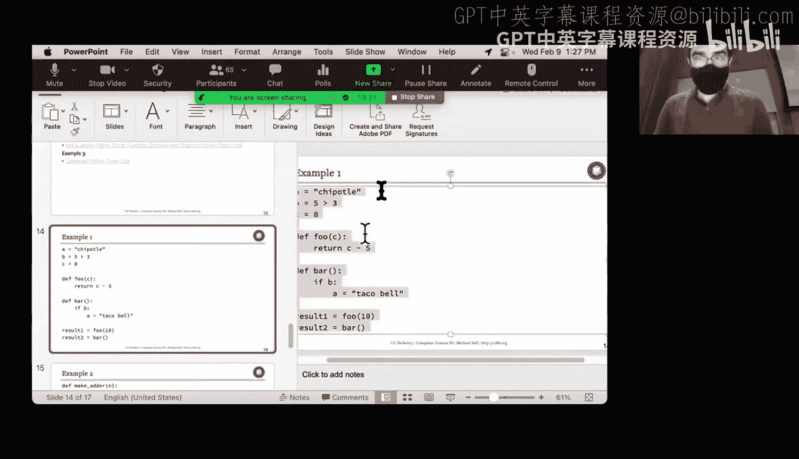
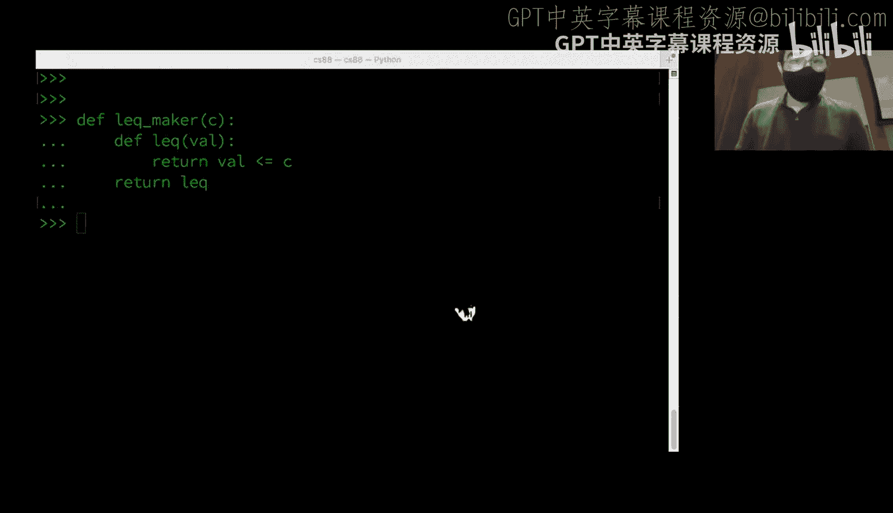
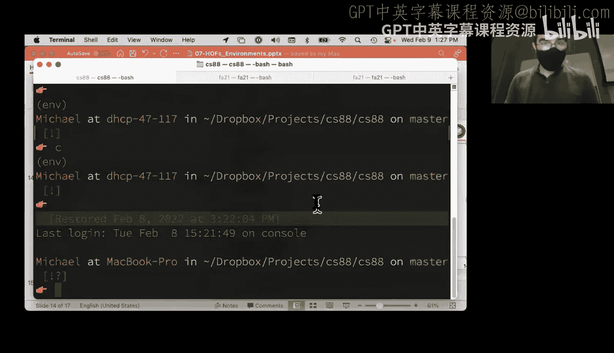
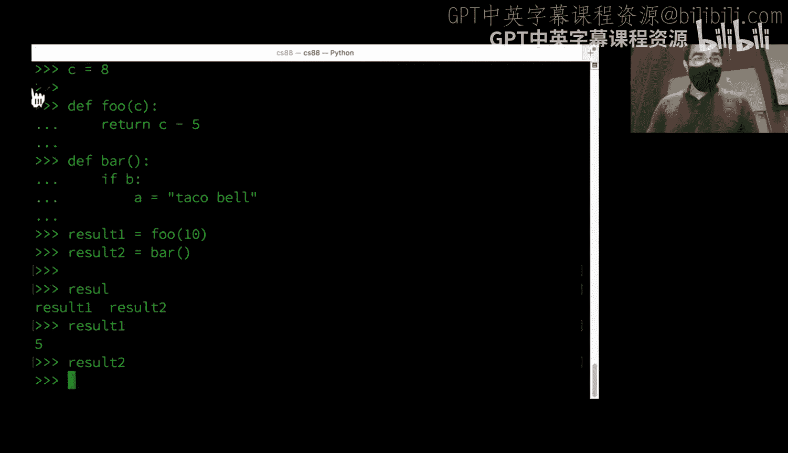
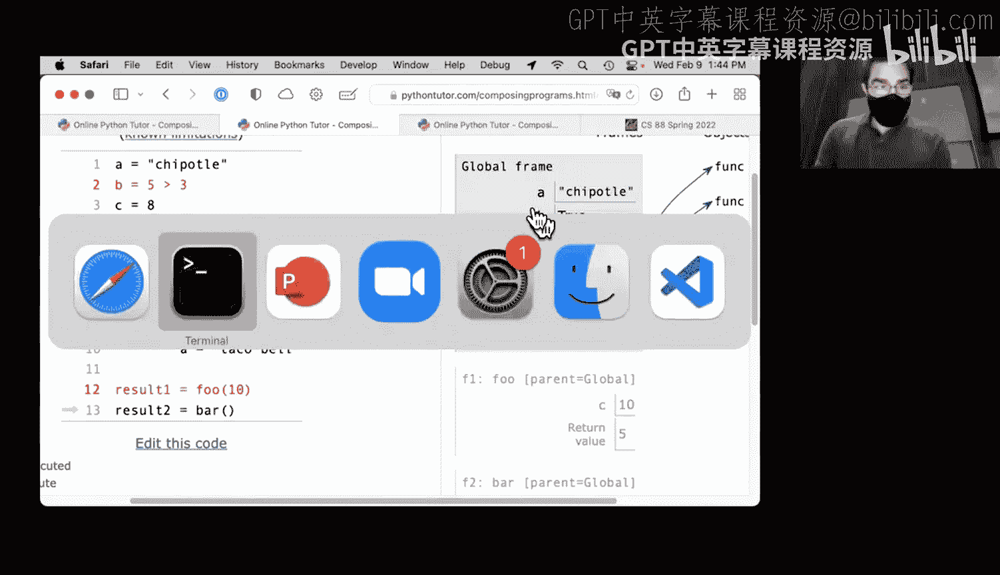
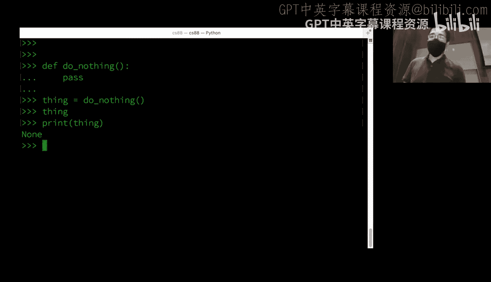
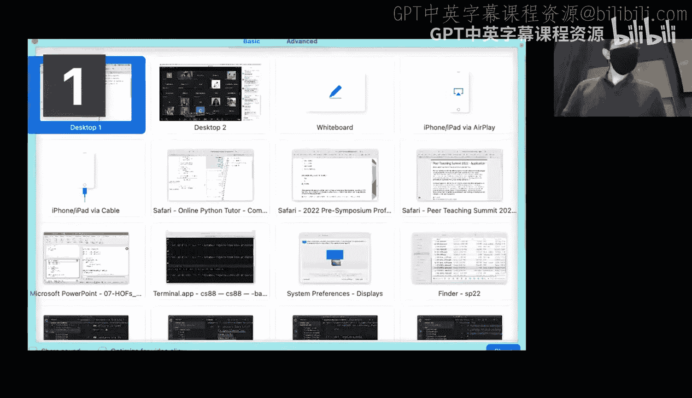

# 7：高阶函数与环境图


在本节课中，我们将学习高阶函数，并利用环境图这一工具来深入理解函数的工作原理。我们将通过回顾上周的例子，并重点分析几个练习，来掌握函数如何作为参数传递以及如何返回新函数。

## 概述：高阶函数的两种形式



上一节我们介绍了高阶函数的基本概念。本节中我们来看看高阶函数的两种主要应用形式：
1.  **函数作为参数**：例如 `map`、`filter`、`reduce` 等函数，它们接收另一个函数作为参数来控制其行为。
2.  **函数作为返回值**：一个函数可以动态地创建并返回一个新的函数，这个新函数的行为可能基于创建时的上下文。



本节课我们将重点探讨第二种形式，即“返回函数的函数”。

## 示例一：`less_than_or_equal_maker` 函数

这是一个返回函数的经典例子。`less_than_or_equal_maker` 函数接收一个参数 `c`，并返回一个新的函数。这个新函数用于判断其输入是否小于等于 `c`。

```python
def less_than_or_equal_maker(c):
    def less_than_or_equal(x):
        return x <= c
    return less_than_or_equal
```



我们可以这样使用它：

```python
less_than_or_equal_to_3 = less_than_or_equal_maker(3)
print(less_than_or_equal_to_3(5))  # 输出：False
print(less_than_or_equal_to_3(0))  # 输出：True
```

这个返回的函数可以方便地用在列表推导式或 `filter` 等高阶函数中：

```python
# 使用列表推导式
result = [x for x in range(10) if less_than_or_equal_to_3(x)]
print(result)  # 输出：[0, 1, 2, 3]

# 使用 filter 函数
result = list(filter(less_than_or_equal_to_3, range(10)))
print(result)  # 输出：[0, 1, 2, 3]
```

**核心机制**：内部函数 `less_than_or_equal` **捕获（capture）** 了外部函数 `less_than_or_equal_maker` 的参数 `c`。即使外部函数调用已经结束，返回的内部函数依然“记得” `c` 的值。







## 环境图：理解代码执行的工具

为了精确理解变量作用域和函数调用，我们使用环境图。环境图模拟了Python执行代码的过程，它由一系列**帧（Frame）** 组成。



以下是环境图的核心概念：
*   **帧（Frame）**：用于跟踪变量名到其绑定值的映射。每个函数调用都会创建一个新的帧。
*   **全局帧（Global Frame）**：程序开始时的帧，包含所有不在任何函数内定义的变量。
*   **父帧（Parent Frame）**：除了全局帧，每个帧都有一个父帧，指明了当在当前帧找不到某个变量时，应该去哪个帧查找。
*   **变量（Variable）**：一个名称（如 `x`）。
*   **值（Value）**：绑定到变量上的数据（如数字 `5`、字符串 `"hello"` 或一个函数对象）。

绘图时需遵循一个关键规则：**当在某个帧内执行赋值语句（如 `x = ...`）时，新变量只存在于该帧内**。

## 示例二：分析简单环境图

让我们通过一个具体例子来练习环境图的绘制。考虑以下代码：

```python
a = "Chipotle"
b = 5 > 3  # 值为 True
c = 8

def foo(c):
    return c - 5

def bar():
    if b:
        a = "Taco Bell"

result1 = foo(10)
result2 = bar()
```

我们将一步步分析其环境图。

**第一步：初始化全局帧**
首先，在全局帧中创建变量 `a`, `b`, `c` 并赋值。然后定义函数 `foo` 和 `bar`，它们作为值（函数对象）被存储在右侧，并由左侧的变量名指向。

**第二步：调用 `foo(10)`**
1.  调用 `foo(10)` 会创建一个新帧，记为 `f1`。其名称是 `foo`，父帧是全局帧。
2.  参数 `c` 成为该帧内的一个局部变量，其值为 `10`。**注意**：这个 `c` 与全局帧中值为 `8` 的变量 `c` 是**两个不同的变量**，互不影响。
3.  执行函数体 `return c - 5`。在帧 `f1` 中查找 `c`，得到 `10`，计算 `10 - 5` 得到 `5`。
4.  函数返回 `5`。在全局帧中，变量 `result1` 被赋值为 `5`。

**第三步：调用 `bar()`**
1.  调用 `bar()` 创建另一个新帧，记为 `f2`。其名称是 `bar`，父帧是全局帧。该函数无参数，所以帧内初始没有局部变量。
2.  执行函数体 `if b:`。在帧 `f2` 中查找变量 `b`，未找到。根据规则，向上查找其父帧（全局帧），找到了值为 `True` 的 `b`。因此条件为真。
3.  执行 `a = "Taco Bell"`。**关键点**：此赋值语句在帧 `f2` 内部执行，因此它创建了一个**新的局部变量 `a`**，并将其值设为 `"Taco Bell"`。这个局部变量 `a` 与全局帧中的变量 `a`（值为 `"Chipotle"`）**完全无关**。
4.  函数 `bar` 没有 `return` 语句，因此默认返回 `None`。
5.  在全局帧中，变量 `result2` 被赋值为 `None`。



**最终结果**：`result1` 为 `5`，`result2` 为 `None`，全局变量 `a` 仍然是 `"Chipotle"`。

## 示例三：`make_adder` 函数与环境图



现在我们来分析一个更典型的返回函数的例子，并绘制其环境图。

```python
def make_adder(n):
    def adder(k):
        return k + n
    return adder

n = 10
add_two = make_adder(2)
x = add_two(5)
```

我们的目标是理解最终 `x` 的值为什么是 `7`，以及各个 `n` 如何起作用。

**第一步：定义函数与全局变量**
1.  在全局帧中，定义函数 `make_adder`。
2.  在全局帧中，创建变量 `n` 并赋值为 `10`。

**第二步：执行 `add_two = make_adder(2)`**
1.  调用 `make_adder(2)`，创建新帧 `f1`。其父帧是全局帧。
2.  参数 `n` 成为帧 `f1` 的局部变量，值为 `2`。
3.  在帧 `f1` 内部，定义了嵌套函数 `adder`。**重要**：此时函数 `adder` 的**父帧被确定为 `f1`**，这意味着 `adder` 将来被调用时，如果需要查找非局部变量（如 `n`），会来帧 `f1` 中寻找。
4.  函数 `make_adder` 返回内部函数 `adder`。因此，全局变量 `add_two` 现在指向这个 `adder` 函数对象。

**第三步：执行 `x = add_two(5)`**
1.  调用 `add_two`（即 `adder` 函数），创建新帧 `f2`。其父帧是多少？不是全局帧，而是该函数定义时所处的帧，即 `f1`。
2.  参数 `k` 成为帧 `f2` 的局部变量，值为 `5`。
3.  执行函数体 `return k + n`。
    *   在帧 `f2` 中找到 `k`，值为 `5`。
    *   在帧 `f2` 中查找 `n`，未找到。
    *   向上查找其父帧 `f1`，找到了 `n`，其值为 `2`。
4.  计算 `5 + 2`，得到 `7` 并返回。
5.  全局变量 `x` 被赋值为 `7`。

**结论**：全局的 `n = 10` 在此过程中从未被使用。函数 `add_two` “记住”了它被创建时捕获的 `n` 值（即 `2`）。这就是**闭包（Closure）** 的体现。

## 总结

本节课中我们一起学习了高阶函数的核心应用之一：返回函数的函数。我们通过 `less_than_or_equal_maker` 和 `make_adder` 等例子，看到了这种模式如何用于创建行为特定的新函数。

更重要的是，我们深入使用了**环境图**作为理解Python执行模型的工具。我们明确了：
*   函数调用会创建新的帧。
*   变量赋值仅在当前帧内创建或修改变量。
*   函数通过其“父帧”链来查找非局部变量，这是实现闭包的关键。
*   返回的函数对象会携带其定义环境（父帧）的信息。



掌握环境图的绘制和分析，能帮助你从原理上理解复杂的函数交互和变量作用域问题，是深入学习编程的基础。