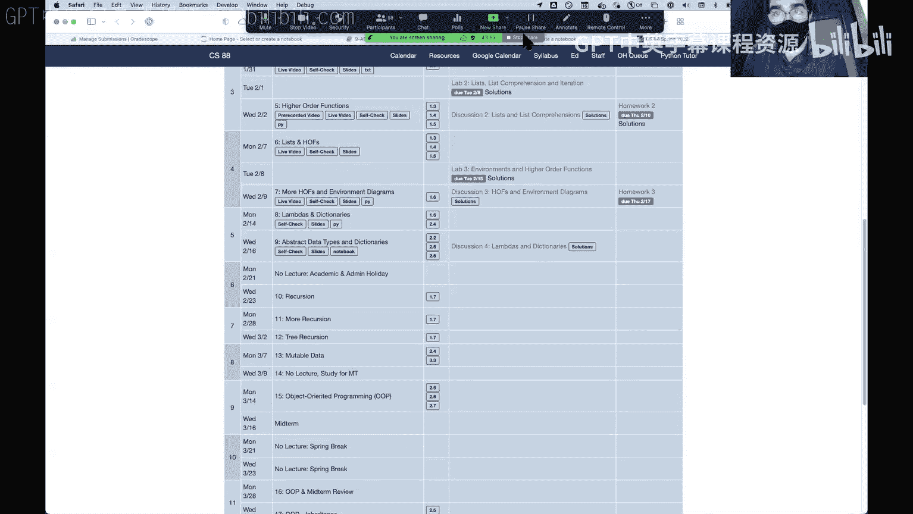
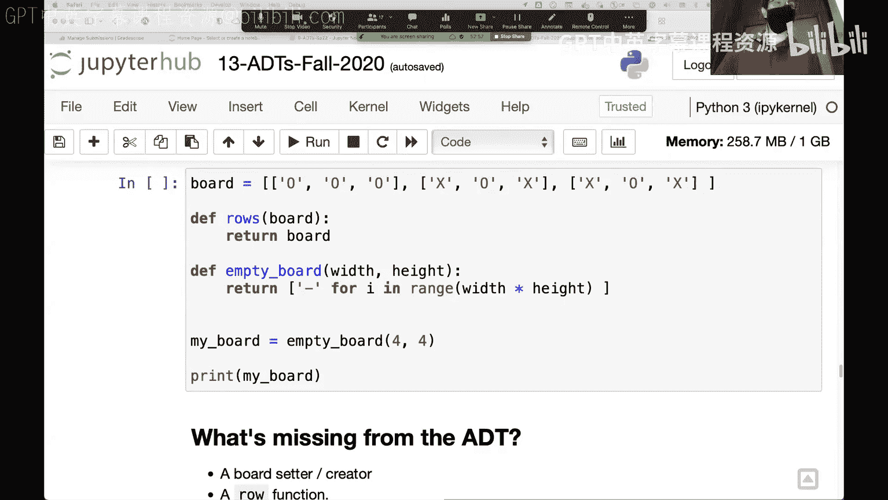

# 9：抽象数据类型 (ADT) 🧱

在本节课中，我们将学习抽象数据类型 (ADT) 的概念。我们将探讨如何通过定义构造函数、选择器和操作符来创建轻量级的抽象，从而让代码更易读、更易维护，并允许我们在不改变高层逻辑的情况下修改底层数据表示。

---

## 课程概述 📋

抽象数据类型是一种编程思想，它允许我们将数据及其相关操作封装起来，形成一个逻辑单元。这样做的好处是，我们可以隐藏数据的内部实现细节，只通过一组定义良好的接口（函数）来与数据交互。这使得代码更清晰、更模块化，也更容易在未来进行修改和扩展。

---

## 为什么需要抽象数据类型？🤔

在编写小型程序或作业时，直接使用列表索引（如 `list[0]`）访问数据可能很直观。但随着项目规模扩大，代码中遍布的 `[0]`、`[1]` 会变得难以理解。例如，`restaurant_review[0]` 代表什么？是名字、分数，还是一个代表完整用户的字典？

抽象数据类型通过为这些操作赋予有意义的名称（如 `get_name(restaurant_review)`），使代码具有“自文档化”的特性，提高了可读性。此外，它还能建立一个“抽象屏障”，允许我们日后更改数据的底层实现（例如，从列表改为字典），而无需修改所有使用该数据的代码。

---

## 抽象数据类型的核心组件 ⚙️

一个抽象数据类型通常包含以下几类函数：

*   **构造函数**：用于创建新的数据实例。公式：`make_xxx(...) -> new_instance`
*   **选择器**：用于访问或读取数据的特定部分。公式：`get_xxx(instance) -> value`
*   **操作符**：用于对数据进行操作或修改。公式：`operate_on_xxx(instance, ...) -> new_instance_or_value`
*   **外部表示**：如何将数据以用户友好的方式显示出来（例如，自定义打印格式）。

---

## 实践：构建一个“点”(Point) ADT 📍

让我们通过一个简单的例子来理解ADT：在二维平面上表示一个点 (x, y)。

### 初始实现：使用列表

首先，我们使用列表作为底层表示。

```python
# 构造函数：创建一个点
def point(x, y):
    return [x, y]

# 选择器：获取x坐标
x = lambda p: p[0]
# 选择器：获取y坐标
y = lambda p: p[1]
```

我们创建几个点实例：

```python
origin = point(0, 0)
my_house = point(5, 5)
campus = point(8, 9)
```

现在，我们可以使用选择器来访问数据，而不是直接使用索引：

```python
print(f"The x-coordinate of my house is: {x(my_house)}")  # 输出: 5
print(f"The y-coordinate of campus is: {y(campus)}")      # 输出: 9
```

直接使用 `my_house[0]` 被称为“抽象违规”，因为我们绕过了定义好的接口（`x` 函数），直接依赖了底层数据结构。

### 为点定义操作

上一节我们介绍了如何构造和选择数据，本节中我们来看看如何定义操作。让我们定义一个函数来计算两点之差（得到一个向量）。

```python
def subtract_points(p1, p2):
    """返回 p2 - p1 得到的新点。"""
    return point(x(p2) - x(p1), y(p2) - y(p1))

# 使用操作
vector = subtract_points(my_house, campus)
print(vector)  # 输出: [3, 4]
```

再定义一个计算两点间距离的函数：

```python
import math
def distance(p1, p2):
    """计算两点间的欧几里得距离。"""
    diff = subtract_points(p1, p2)
    return math.sqrt(x(diff)**2 + y(diff)**2)

print(distance(origin, my_house))  # 输出: 7.0710678118654755
```

### 改变底层实现

抽象数据类型的强大之处在于，我们可以更改数据的内部表示，而无需修改使用它的高级函数。

假设我们决定用字符串 `"x y"` 这种奇怪格式来表示点：

```python
# 新的构造函数
def point(x, y):
    return f"{x} {y}"

# 新的选择器（需要解析字符串）
x = lambda p: float(p.split()[0])
y = lambda p: float(p.split()[1])
```

**关键点来了**：我们不需要修改 `subtract_points` 或 `distance` 函数！因为它们只通过 `point`、`x`、`y` 这三个接口与数据交互。只要这些接口的行为不变，高层逻辑就能继续工作。

```python
# 重新创建点（因为构造函数变了）
origin = point(0, 0)
my_house = point(5, 5)
campus = point(8, 9)

print(distance(origin, my_house))  # 仍然输出: 7.0710678118654755
```

### 换回更合理的实现：使用字典

我们可以轻松地再次改变实现，比如使用字典：

```python
def point(x, y):
    return {'x': x, 'y': y}

x = lambda p: p['x']
y = lambda p: p['y']
```

同样，`subtract_points` 和 `distance` 函数依然无需任何改动即可正常运行。

---

## 另一个例子：井字棋棋盘 🎮

上一节我们用一个简单的点ADT演示了核心概念，本节中我们来看看一个更复杂的例子。在课程的一次期中考试中，有一个关于井字棋棋盘ADT的题目。

我们被告知棋盘是一个“列表的列表”（list of lists），代表行。但我们不直接操作这个结构，而是通过一组ADT函数：

```python
# 假设已有的ADT函数（我们信任它们能工作）
def get_row(board, row_index):
    """返回棋盘的某一行。"""
    # 实现可能是：return board[row_index]
    pass




def get_column(board, col_index):
    """返回棋盘的某一列。"""
    # 需要从每一行中提取对应元素
    pass

def get_diagonal(board, which_diag):
    """返回棋盘的一条对角线。"""
    pass
```

我们的任务是利用这些ADT函数，编写一个判断棋盘是否有赢家的函数 `has_win`，而不必关心棋盘具体的存储方式。

**没有ADT的混乱版本**（直接操作列表）：
```python
def has_win(board):
    # 检查行
    for row in board:
        if row[0] == row[1] == row[2] and row[0] != ' ':
            return True
    # 检查列（容易出错）
    for col in range(3):
        if board[0][col] == board[1][col] == board[2][col] and board[0][col] != ' ':
            return True
    # 检查对角线...
```

**使用ADT的清晰版本**：
```python
def has_win(board, player):
    """检查指定玩家是否获胜。"""
    # 检查所有行
    for i in range(3):
        if all_equal(get_row(board, i), player):
            return True
    # 检查所有列
    for i in range(3):
        if all_equal(get_column(board, i), player):
            return True
    # 检查两条对角线
    if all_equal(get_diagonal(board, 'main'), player) or all_equal(get_diagonal(board, 'anti'), player):
        return True
    return False
```

使用ADT的版本意图更明确，几乎像是在用自然语言描述算法，大大减少了出错的可能性。

---

## 总结 🎯

本节课中我们一起学习了抽象数据类型 (ADT) 的核心思想：

1.  **目的**：通过定义清晰的接口（构造函数、选择器、操作符）来封装数据，提高代码的可读性、可维护性和可修改性。
2.  **关键概念**：建立“抽象屏障”，让使用数据的代码（屏障之上）与实现数据的代码（屏障之下）分离。
3.  **实践方法**：为复合数据（如点、联系人、棋盘）创建有意义的操作函数，避免在代码中直接使用底层数据结构的访问方式（如列表索引），即避免“抽象违规”。
4.  **强大之处**：当需要改变数据底层表示（如从列表改为字典）时，只需更新少数几个接口函数，所有依赖它们的高级功能都能继续工作。



掌握ADT是编写高质量、易协作代码的重要一步，它将帮助你在未来的项目和更大的代码库中游刃有余。