# 10：递归入门 🌀

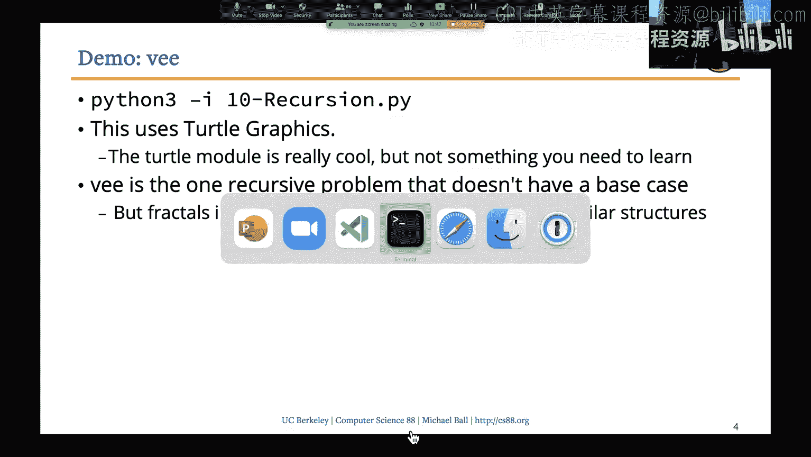

在本节课中，我们将要学习一个计算机科学中既有趣又烧脑的概念——递归。递归是一种全新的问题解决思路，当你学会使用它后，会发现它在处理某些特定类型的问题时，能让解决方案变得异常简洁。在深入探讨之前，我们先通过一个演示来感受递归的魅力。

## 递归的直观感受：V形绘图程序 🎨

为了让大家理解递归为何是一个强大的工具，我们先来看一个有趣的演示程序，它本身并不直接讲解递归，但能展示递归思想的妙处。

这个程序大约有100行Python代码，用于绘制图形。代码本身不难理解，但这不是演示的重点。这个程序叫做“V”，其起源可以追溯到80年代，用于教授编程，并且与伯克利的CS10课程有着有趣的渊源。

程序的工作原理是：每次按下空格键，它就会绘制一个“V”形。在“V”的末端，程序会从一系列可绘制的函数列表中随机选择一个来执行。在投影上可能看不太清，但我们有三角形、圆点和正方形三种基本形状可选。

这本身也是一个高阶函数的绝佳例子：我们可以从一个列表中随机选取一个函数并执行它。目前，这只是一个在终端窗口绘制基本图形的简单程序，它会记录并显示正在绘制的函数。

现在，如果我们按下上箭头键，程序会将两个新函数添加到可执行列表中。除了原有的三角形、圆点、正方形，我们现在还可以选择绘制“V”函数本身。这意味着，在“V”的末端，我们有机会绘制另一个更小的“V”。

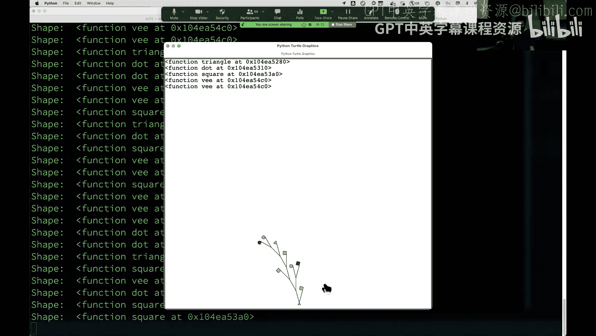

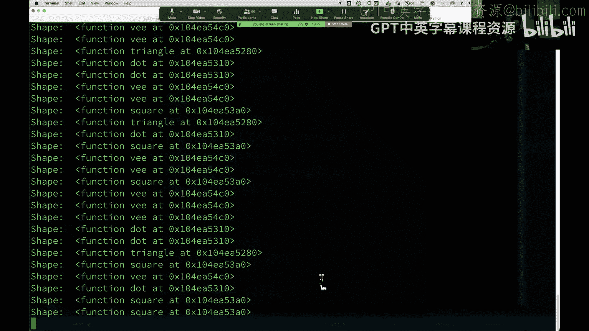

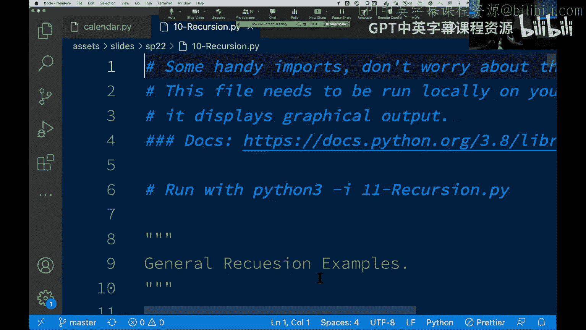

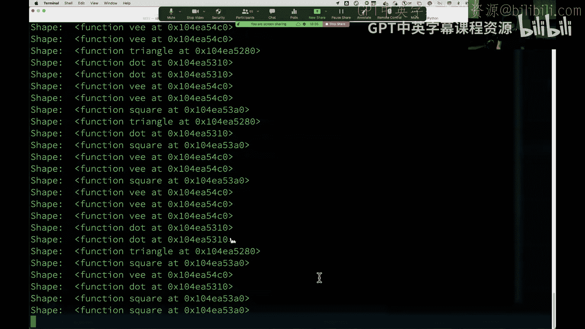

每次我们到达一个分支的末端，都会从五个函数中随机选择一个来执行。现在的不同之处在于，我们不仅可以绘制基本形状，还可以绘制另一个“V”。这就是递归的雏形：一个函数在执行过程中调用了自身。

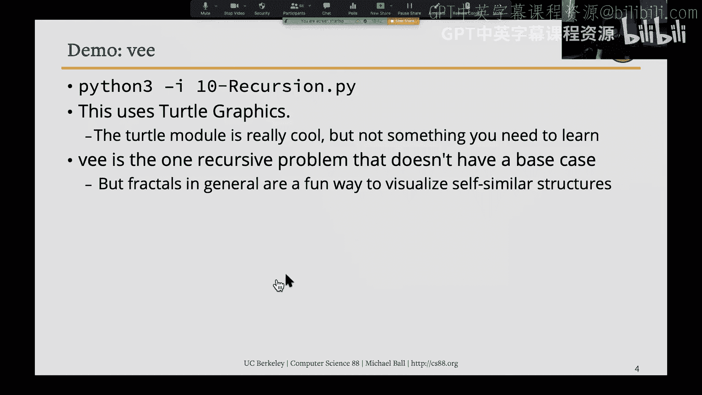

这个程序有趣的地方在于，它属于计算机生成艺术的一种。虽然有些图形看起来不那么“艺术”，但通过扩展可绘制的形状，可以创造出非常有趣和复杂的图案。这个演示有两点启示：对于有艺术倾向的同学，计算机生成艺术是一个有趣的方向；更重要的是，它展示了递归如何简化复杂问题的解决过程。

试想，如果我们想用迭代方法（即我们目前学习的循环方法）来生成这样一棵复杂的“树”，将会非常困难，需要大量的循环和一步步的控制。虽然那样的代码没有错，但使用递归方法，我们可以用更简洁、更优雅的方式解决整类问题。

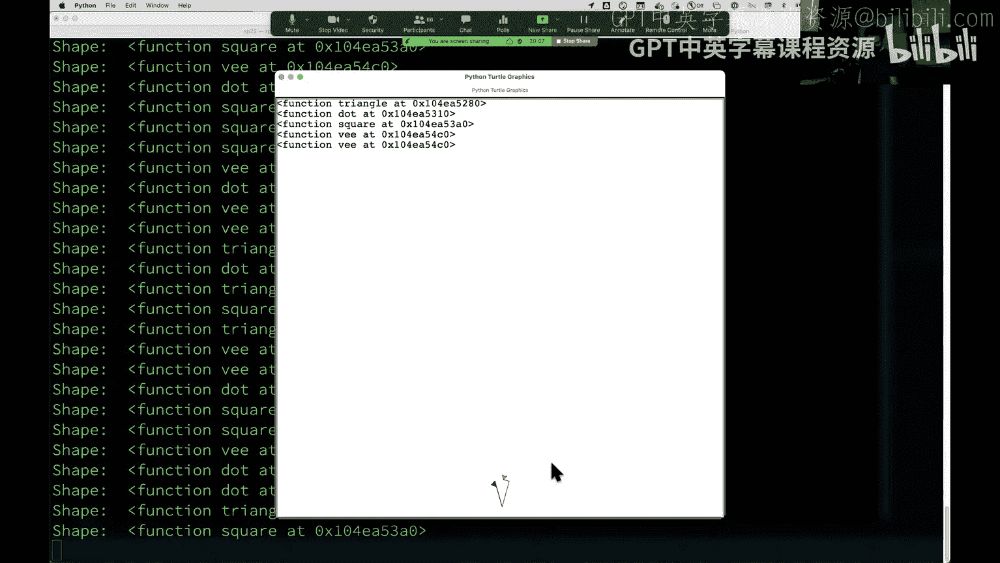

## 分解问题：寻找更小的自己 🔍

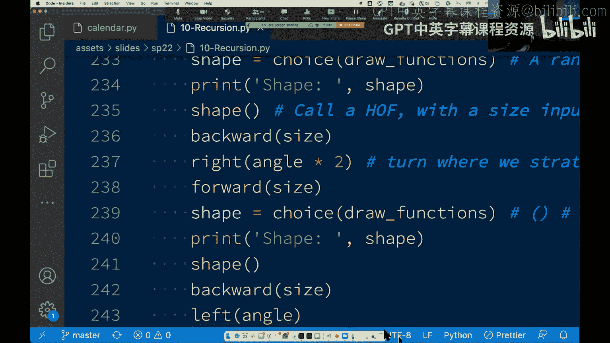

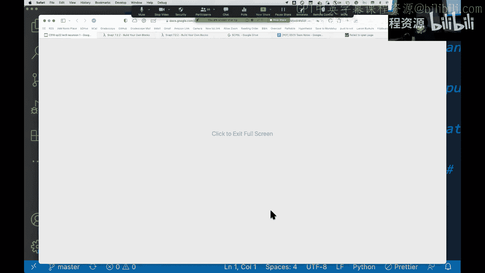

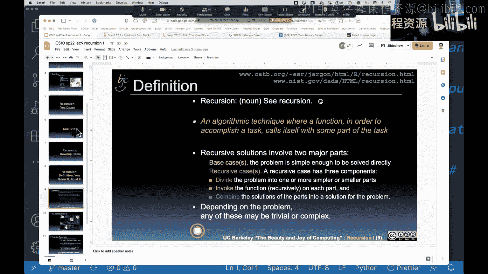

在查看代码之前，让我们思考一下：绘制这棵复杂“树”的问题，是如何分解成多个更小版本的相同问题的？

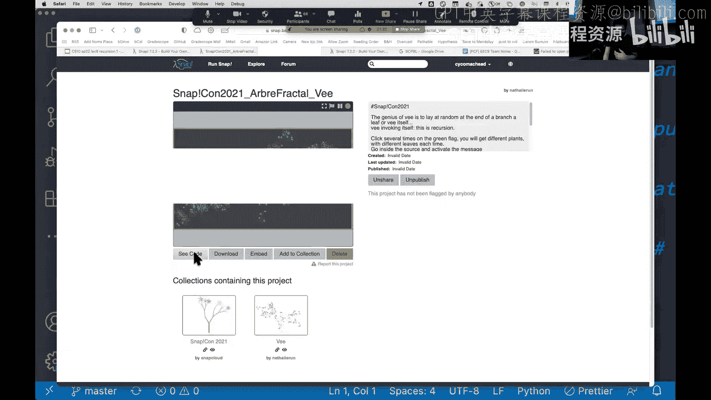

请注意，底部那个简单的左右移动是一个“V”，整个大图形也是一个“V”，而大图形中每一个小的分叉（比如右边的两个分支）本身也是一个更小的“V”。每个“V”都执行着相同类型的移动和工作，只是规模更小。这就是递归的核心思想：将大问题分解为结构相同的小问题。

几周后，我们将在期中考试后学习“树”这种数据结构。那时的树不会随机生成，而是用于有意义地组织数据，但递归同样是处理树结构的关键工具。

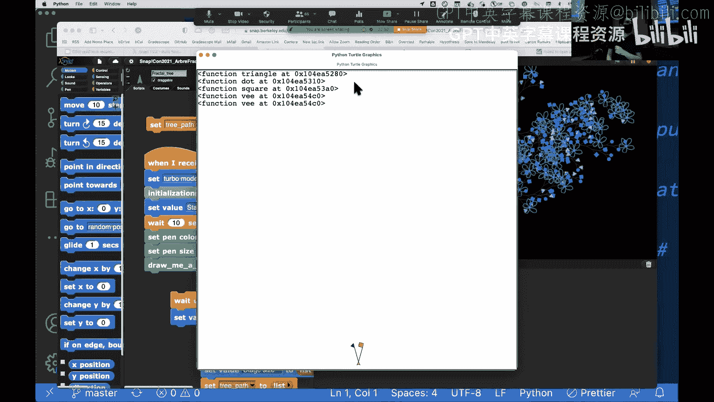

## 代码一瞥与更多可能 💻

这个程序使用了一个Python内置的库叫做Turtle Graphics，它提供了一个简单有趣的接口来创建动画。虽然Turtle Graphics不是CS88的重点，但如果你对用Python进行实验感兴趣，那里有很多好玩的东西。

实际上，CS10课程使用的程序叫SNAP，其网站上有很多类似的项目。例如，一位留尼汪岛的数学老师用类似的思想，调整了几何参数并使用了更美观的颜色（如浅蓝色和紫色），在黑色背景上生成了视觉效果惊人的图形。这类作品是递归能力的最佳体现，用其他方法很难实现。

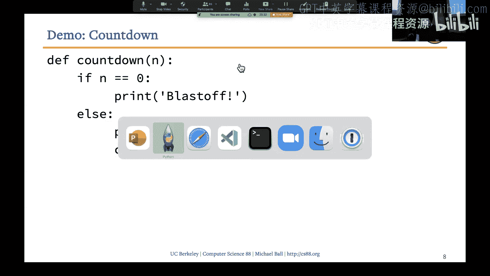

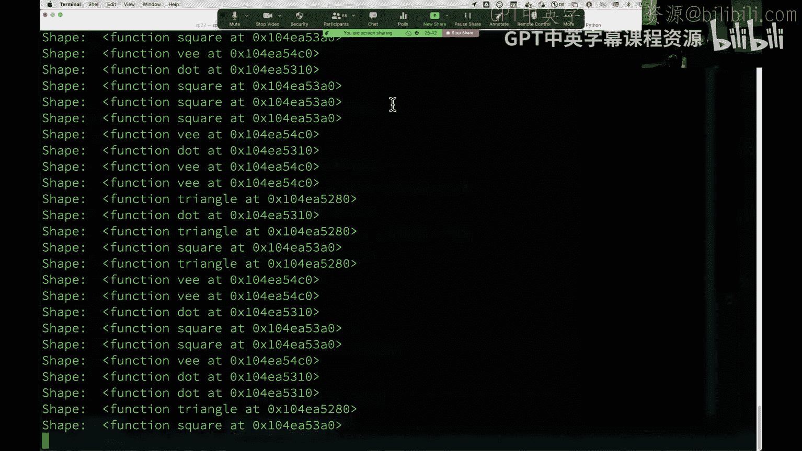

如果你觉得接下来的递归课程很难，或许这些视觉上引人入胜的作品能激发你的学习动力，思考递归能实现的所有可能性。

## 递归的定义与第一个例子 📝

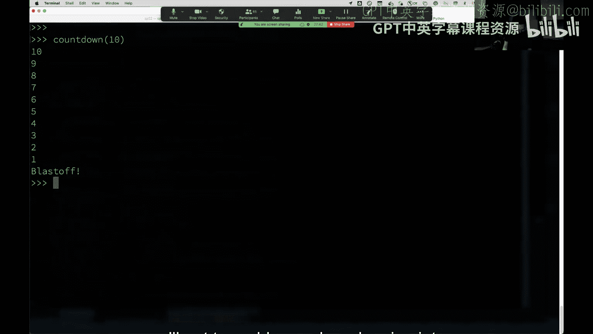

那么，递归究竟是什么？一个递归的定义就是：参见递归本身。这听起来像是个玩笑，但它准确地描述了递归的本质：在自身的定义中引用自身。

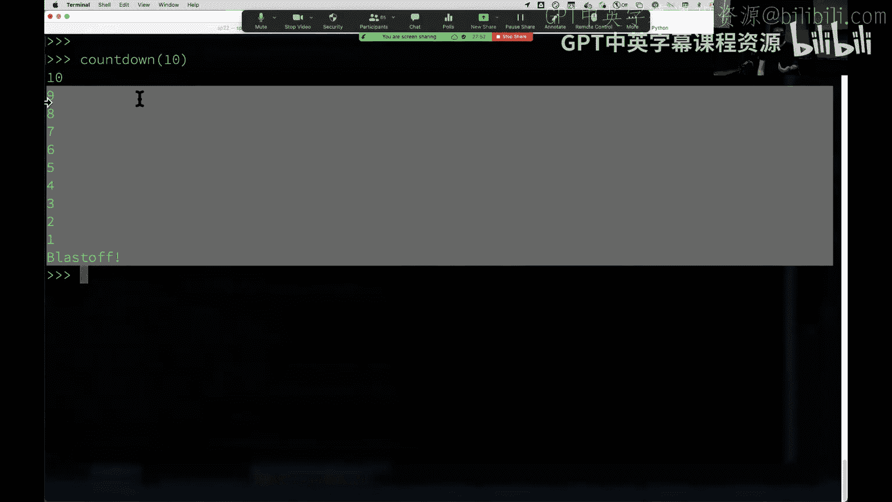

在编程中，一个递归函数就像任何其他Python函数一样，只是它会在函数体内调用自己。

现在，我们不从头构建复杂的程序，而是从一个最简单的递归函数例子开始：倒数（Countdown）。

## 实现倒数函数 ⏱️

我们的任务是编写一个`countdown`函数，它接收一个数字（比如10），然后打印：10, 9, 8, ..., 1，最后打印“发射！”（blast off）。

这个问题当然可以用`for`循环或`while`循环轻松解决。事实上，用循环可能更直观、更容易。但我们现在要探索的是如何用递归的思维来定义和解决它。

当我们编写递归代码时，首先要思考的是：我们试图解决的核心问题是什么？在这里，问题是从10倒数到0并说“发射”。

那么，比“从10开始倒数”更简单的问题是什么？一个更小的问题可能是“从9开始倒数”。这听起来很简单，但正是递归思维的关键：将大问题转化为一个步骤加上一个更小版本的相同问题。

我们可以尝试这样写：
```python
def my_countdown(n):
    print(n)
    my_countdown(n-1)
```
如果我们调用`my_countdown(10)`，它会打印10，然后调用`my_countdown(9)`，再打印9，调用`my_countdown(8)`……但这里有一个大问题：这个函数永远不会停止！它会一直倒数下去，直到Python因防止无限递归而报错。

这就引出了递归中最重要的概念之一：**基准情形（Base Case）**。我们需要一个条件来判断何时不再进行递归调用，从而让函数停止。

修正后的函数如下：
```python
def my_countdown(n):
    if n == 0:
        print("Blast off!")
    else:
        print(n)
        my_countdown(n-1)
```
现在，当我们调用`my_countdown(10)`时，它会打印10，然后调用`my_countdown(9)`，依此类推。当`n`最终变为0时，函数执行基准情形，打印“Blast off!”，然后不再进行任何递归调用，函数执行结束。

## 递归与循环的区别 🔄

一个自然的问题是：既然循环也能解决，为什么用递归？对于像倒数这样简单的问题，使用循环（如`for`循环）确实可能更短、更直接。代码行数通常不是评判解决方案好坏的标准。

递归和循环的关键区别在于思维模式。递归让我们以一种“分而治之”的方式思考问题：解决一个大小为`n`的问题，可以转化为“做一件事”加上“解决一个大小为`n-1`的相同问题”。对于某些复杂问题（如我们之后会看到的树遍历、分治算法），递归思维会让代码逻辑变得异常清晰和简洁。

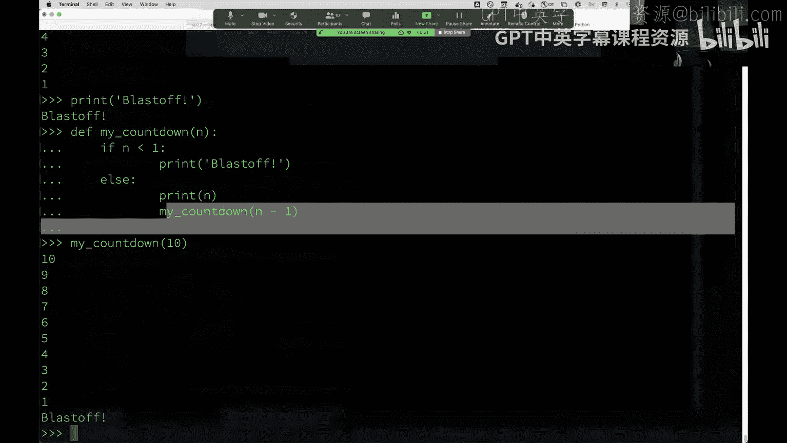

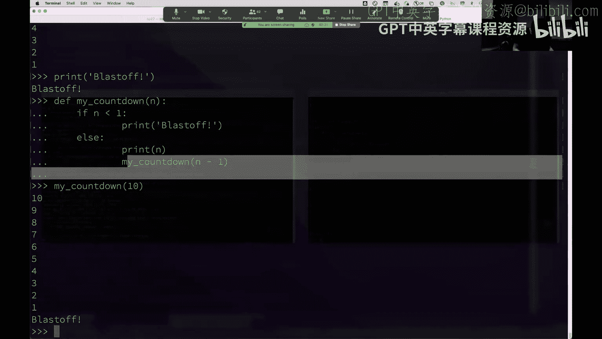

在递归中，我们通过条件判断（如`if-else`）来控制函数的开始和停止，而不是显式的循环变量。

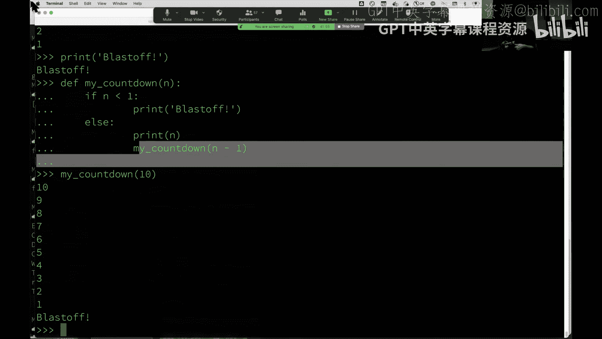

## 递归的三要素 🧩

一个典型的递归解决方案包含三个部分：
1.  **基准情形（Base Case）**：最简单、不可再分的情况，直接给出答案，不再递归。在`countdown`中，就是`n == 0`时打印“Blast off!”。
2.  **递归步骤（Recursive Step）**：将原问题分解成一个或多个更小规模的相同问题。在`countdown`中，就是将“从n倒数”分解为“打印n”和“从n-1倒数”。
3.  **组合结果（Combine）**：有时需要将递归调用的结果组合起来得到最终答案。在简单的`countdown`中，我们只是顺序执行打印，没有复杂的组合。但在后续更复杂的例子（如计算阶乘、斐波那契数列）中，这一步至关重要。

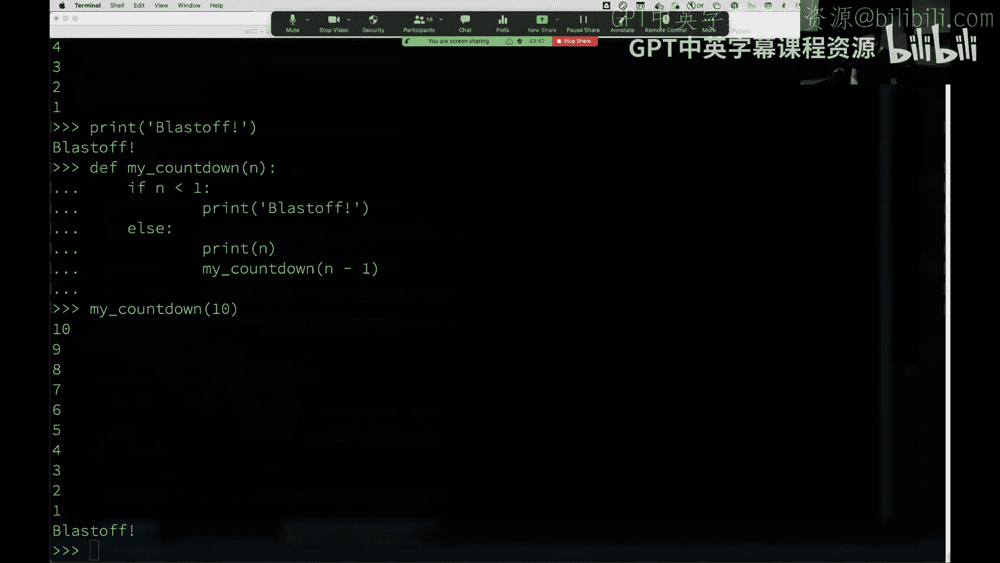

## 总结 📚

本节课我们一起学习了递归的入门知识。我们从一段有趣的“V”形绘图程序开始，直观感受了递归如何通过自相似性构建复杂结构。然后，我们正式定义了递归：一个调用自身的函数。通过实现“倒数”函数，我们学习了递归的核心——基准情形，它确保了递归能够正确终止。我们还比较了递归与循环的思维差异，并了解了递归解决方案的三个关键要素：基准情形、递归步骤和结果组合。

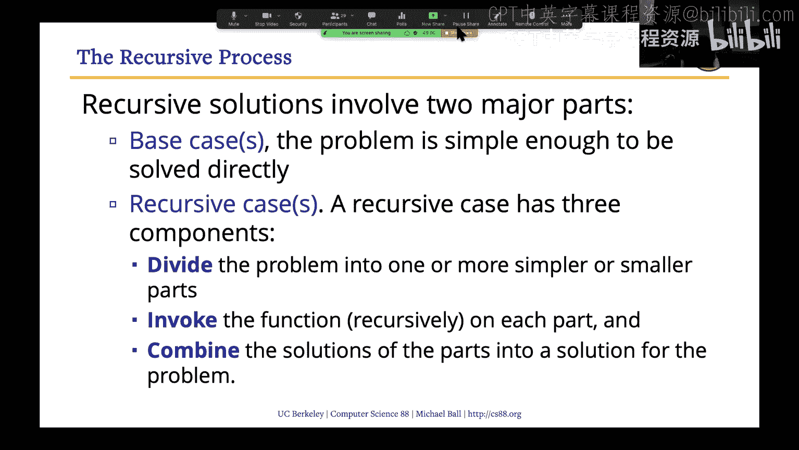

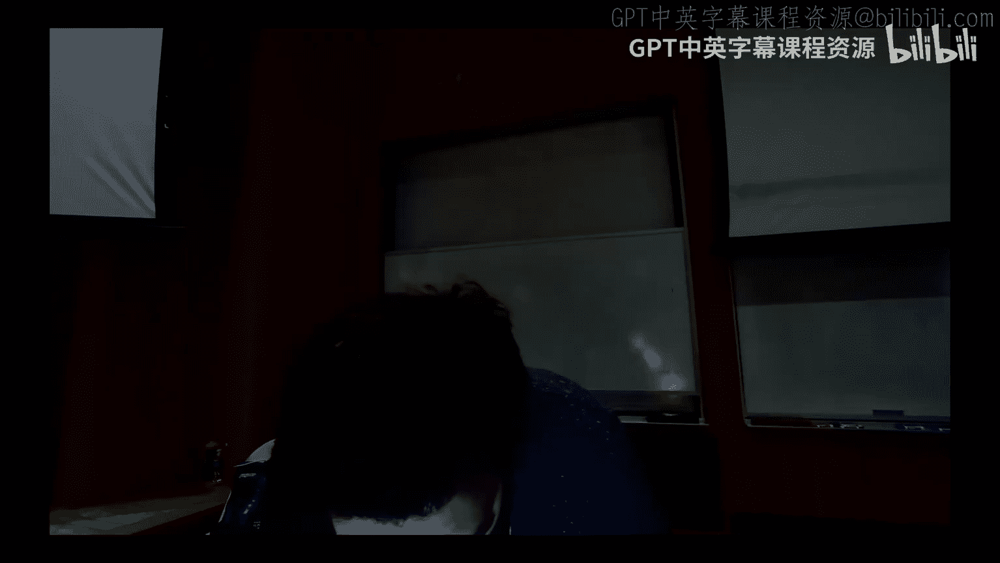

递归是一种强大的问题解决工具，尤其适用于那些可以自然分解为更小子问题的情况。虽然初学时会觉得有些烧脑，但掌握之后，你会发现它为许多复杂问题提供了优雅而高效的解决方案。在接下来的课程中，我们将探索更多递归的经典用例。