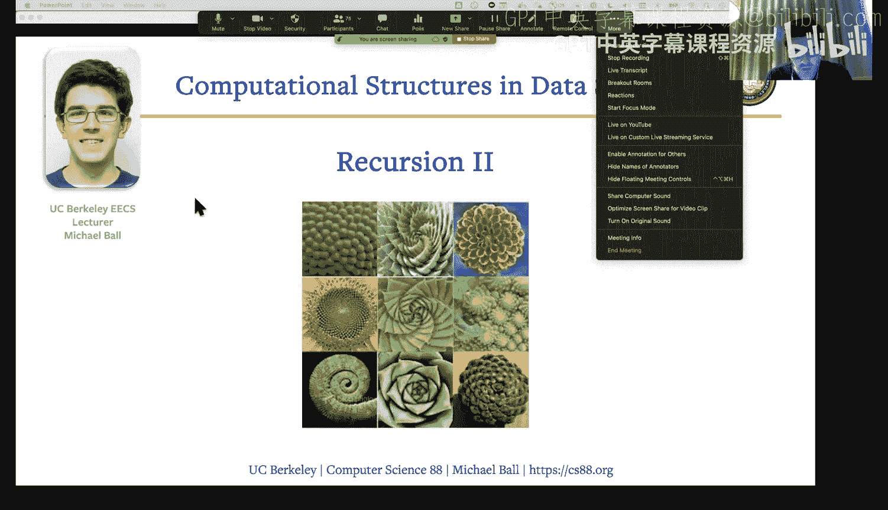
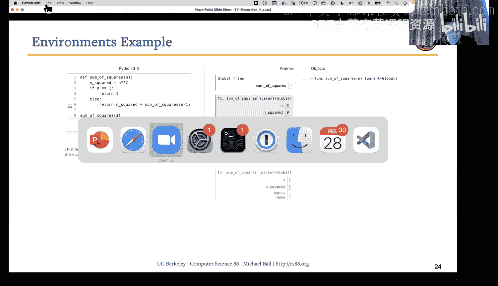
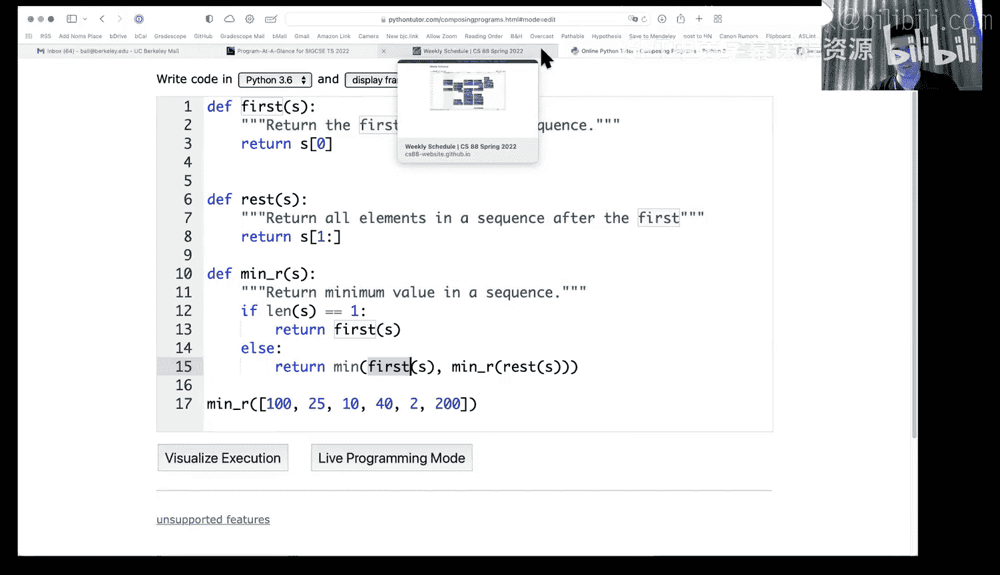

# 11：递归（第二部分） 🧮



在本节课中，我们将深入学习递归的核心概念，包括如何定义递归函数、理解其执行过程，并将其与迭代方法进行比较。我们将通过具体的例子，如计算数字和与列表中的最小值，来掌握递归的“基本情况”和“递归情况”。

---

## 递归的核心结构

上一节我们介绍了递归的基本思想。本节中，我们来看看构成递归函数的两个核心部分。

*   **基本情况**：这是问题的最简单形式，可以直接求解，无需进一步递归。例如，对一个数字列表求和时，基本情况可能是一个空列表或只包含一个元素的列表。
*   **递归情况**：这是将原始问题分解为更小、更简单的子问题的部分。它包含三个关键步骤：
    1.  **分解**：将问题划分为更小的部分。
    2.  **调用**：对更小的部分进行递归调用。
    3.  **合并**：将递归调用的结果与当前步骤的信息结合起来，形成最终答案。

---

## 从迭代到递归：求和示例

为了更好地理解递归，我们将其与熟悉的迭代方法进行比较。让我们看一个计算从1到n的数字和的例子。

**迭代方法（使用循环）**：
```python
def sum_iterative(n):
    s = 0
    for i in range(1, n+1):
        s = s + i
    return s
```
在这个循环中，我们有一个明确的起点（`i=1`）和终点（`i=n`）。

**递归方法**：
```python
def sum_recursive(n):
    if n == 0:          # 基本情况
        return 0
    else:               # 递归情况
        return n + sum_recursive(n-1)  # 分解、调用、合并
```
在递归版本中：
*   **基本情况**：当 `n` 为0时，和就是0。
*   **递归情况**：`n` 的和等于 `n` 加上 `(n-1)` 的和。我们通过 `n-1` 来分解问题，调用自身，然后将结果与 `n` 合并。

递归的思考方向常常是“倒过来”的：从最大的数 `n` 开始，逐步向基本情况 `0` 推进。

---

## 深入递归执行过程

理解递归函数如何执行至关重要。每次递归调用都会创建一个新的**栈帧**，它拥有自己独立的局部变量。

以计算平方和函数为例：
```python
def sum_squares(n):
    if n < 1:          # 基本情况
        return 0
    else:              # 递归情况
        n_squared = n * n
        return n_squared + sum_squares(n-1)
```
以下是计算 `sum_squares(3)` 时栈帧的简化视图：




1.  调用 `sum_squares(3)`：创建帧，`n=3`, `n_squared=9`。需要 `9 + sum_squares(2)` 的结果。
2.  调用 `sum_squares(2)`：创建新帧，`n=2`, `n_squared=4`。需要 `4 + sum_squares(1)` 的结果。
3.  调用 `sum_squares(1)`：创建新帧，`n=1`, `n_squared=1`。需要 `1 + sum_squares(0)` 的结果。
4.  调用 `sum_squares(0)`：创建新帧，满足 `n<1`，直接返回 `0`。
5.  返回值向上传递：
    *   `sum_squares(1)` 返回 `1 + 0 = 1`
    *   `sum_squares(2)` 返回 `4 + 1 = 5`
    *   `sum_squares(3)` 返回 `9 + 5 = 14`

每个帧中的 `n` 和 `n_squared` 都是独立的。递归通过不断创建新的栈帧来推进，直到达到基本情况，然后通过返回值依次“回溯”并合并结果。

---

## 递归处理列表：寻找最小值

递归不仅适用于数字序列，也适用于列表。关键在于如何定义“更小的问题”。对于列表，我们通常将其分解为**第一个元素**和**剩余列表**。

以下是寻找列表最小值的递归函数：
```python
def min_in_list(seq):
    if len(seq) == 1:          # 基本情况：列表只有一个元素
        return seq[0]
    else:                      # 递归情况
        first = seq[0]
        rest = seq[1:]
        # 当前列表的最小值是“第一个元素”和“剩余列表最小值”中的较小者
        return min(first, min_in_list(rest))  # 分解、调用、合并
```

**工作原理**：
*   **基本情况**：如果列表只有一个元素，那么这个元素就是最小值。
*   **递归情况**：列表的最小值，等于其**第一个元素**和**剩余列表的最小值**这两者中的较小值。通过切片 `seq[1:]` 获得“剩余列表”这个更小的问题。

例如，对于列表 `[100, 25, 40, 2, 200]`：
1.  `min_in_list([100,25,40,2,200])` 比较 `100` 和 `min_in_list([25,40,2,200])`
2.  `min_in_list([25,40,2,200])` 比较 `25` 和 `min_in_list([40,2,200])`
3.  ... 以此类推，直到列表长度为1，开始返回并比较。

通过每次递归调用将列表缩短一个元素，我们最终会到达基本情况。

---

## 总结



本节课中我们一起学习了递归的深入应用。我们明确了递归函数由**基本情况**和**递归情况**构成，并通过与迭代方法的对比加深了理解。我们详细追踪了递归函数的执行过程，认识到每次调用都会创建独立的栈帧。最后，我们将递归应用于列表结构，学会了通过分解为“第一个元素”和“剩余部分”来处理序列问题。掌握这些模式是运用递归解决更复杂问题的基础。