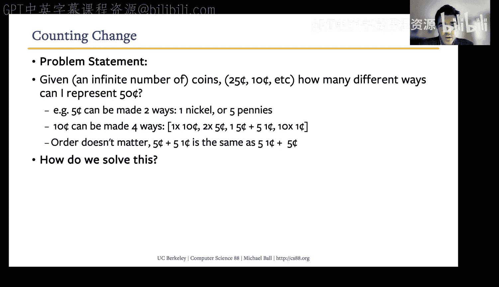
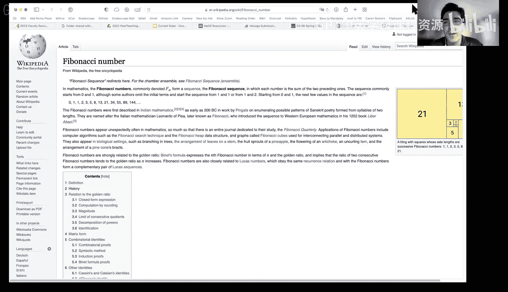

# 12：树形递归

在本节课中，我们将学习一种特殊的递归形式——树形递归。我们将通过斐波那契数列、找零钱问题和快速排序算法等例子，来理解如何使用多个递归调用来解决问题。这种递归方式之所以被称为“树形”，是因为其函数调用路径在视觉上类似于一棵树的分支结构。

## 从单次递归到多次递归

上一节我们介绍了基本的递归概念。本节中，我们来看看当一个问题需要在一个函数内部进行**多次递归调用**时，会是什么样子。这种模式被称为**树形递归**。

树形递归之所以得名，是因为当我们绘制出函数调用的路径时，它看起来就像一棵倒置的树。计算机科学家习惯将树的根画在顶部，分支向下延伸。这种递归方式对于解决某些问题（例如遍历嵌套的文件系统）来说，比单纯使用循环要直观和自然得多。

## 自然递归的例子：文件系统

在深入代码之前，我们可以思考一些自然递归的场景。一个典型的例子是计算机上的文件系统（或Google Drive等云存储）。

*   文件系统是一个**层次结构**：文件夹里可以包含文件和子文件夹，子文件夹里又可以包含更多文件和子文件夹。
*   如果我们想编写一个程序来查找系统中的所有文件（例如，找到最近编辑的文件），递归是一个很自然的思路。

以下是一个简化的伪代码思路，展示了如何递归地处理目录：

```python
def process_directory(directory):
    for item in directory:
        if item is a file:
            # 对文件执行某些操作
            process_file(item)
        elif item is a subdirectory:
            # 递归处理子目录
            process_directory(item)
```

在这个模型中，处理一个文件夹的任务，被分解为处理其内部的项目。如果遇到子文件夹，就再次调用相同的处理过程。这很自然地导致了**多个递归调用**（对应多个子文件夹）。

## 经典案例：斐波那契数列 🐚

现在，让我们来看一个具体的、数学上的树形递归例子：**斐波那契数列**。

斐波那契数列是一个著名的数列，其中每个数字都是前两个数字之和。数列通常以 `F(0) = 0`, `F(1) = 1` 开始。因此，数列如下：0, 1, 1, 2, 3, 5, 8, 13...

其数学定义是：
**F(n) = F(n-1) + F(n-2)**，其中 **F(0) = 0**, **F(1) = 1**。

这个定义本身就是**递归**的：要计算第 `n` 个数，你需要知道第 `n-1` 和第 `n-2` 个数。这直接引导我们写出递归函数。

### 实现递归斐波那契函数

根据定义，我们可以轻松地将其转化为Python代码。我们需要一个**基准条件**（base case）来停止递归，以及一个**递归条件**（recursive case）。

一个简洁的基准条件是：如果 `n < 2`，直接返回 `n`。因为 `F(0)=0`, `F(1)=1`。

递归条件就是数学定义的直接翻译。

```python
def fib(n):
    if n < 2:          # 基准条件
        return n
    else:              # 递归条件
        return fib(n-1) + fib(n-2)  # 两次递归调用！
```

### 可视化递归树与效率问题




当我们计算 `fib(5)` 时，函数调用的过程会形成一棵树。例如，`fib(5)` 调用 `fib(4)` 和 `fib(3)`；`fib(4)` 又调用 `fib(3)` 和 `fib(2)`，依此类推。


通过可视化工具可以看到，这确实形成了一个树状结构。然而，这也暴露了这种简单实现的一个主要问题：**大量的重复计算**。

例如，在计算 `fib(5)` 时，`fib(3)` 被计算了两次，`fib(2)` 被计算了三次。对于更大的 `n`，这种重复会呈指数级增长，导致效率极低。虽然我们目前更关注代码的正确性，但意识到这种效率问题是很重要的。在后续课程中，你会学到像**记忆化**这样的技术来优化这类递归函数。

## 应用：找零钱问题 💰

接下来，我们看一个更复杂的树形递归问题：**找零钱问题**。

**问题描述**：给定一个金额（例如10美分）和一系列硬币面额（例如[25, 10, 5, 1]代表 quarter, dime, nickel, penny），假设每种硬币数量无限，计算**有多少种不同的方式**可以凑出这个金额。

例如，用面额为 [10, 5, 1] 的硬币凑出 10 美分，有 4 种方式：
1. 10
2. 5 + 5
3. 5 + 1 + 1 + 1 + 1 + 1
4. 1 + 1 + 1 + 1 + 1 + 1 + 1 + 1 + 1 + 1

### 递归思路

如何用递归解决这个问题？关键在于将问题分解：

1.  **基准条件**：
    *   如果金额正好为 **0**，说明找到一种有效的组合方式，返回 **1**。
    *   如果金额小于 **0**，或者可用的硬币列表为空但金额大于0，说明当前路径无效，返回 **0**。

2.  **递归分解**：
    对于给定的金额和硬币列表，我们可以考虑两种情况：
    *   **使用第一种硬币**：从总金额中减去这种硬币的面值，然后**递归计算**用**所有硬币**凑出剩余金额的方式数。（因为硬币无限，所以可以继续使用这种硬币）。
    *   **不使用第一种硬币**：**递归计算**用**剩余硬币**（即列表中去掉第一种硬币）凑出**原金额**的方式数。

    总的方式数就是这两种情况之和。

```python
def count_change(amount, coin_denominations):
    if amount == 0:
        return 1  # 一种方式：不使用任何硬币
    elif amount < 0 or not coin_denominations:
        return 0  # 无效路径
    else:
        # 情况1：使用第一种硬币
        with_first = count_change(amount - coin_denominations[0], coin_denominations)
        # 情况2：不使用第一种硬币
        without_first = count_change(amount, coin_denominations[1:])
        return with_first + without_first
```

这个函数的调用树也会是树形结构。它系统地探索了“使用”或“不使用”某种硬币的所有可能分支，最终统计所有能凑出目标金额的路径。这类“组合计数”问题非常适合用树形递归解决。

## 高级示例：快速排序算法 ⚡

最后，我们简要了解一个高效且著名的树形递归算法：**快速排序**。它用于对列表进行排序。

**基本思想**：
1.  从列表中选择一个元素作为“基准”。
2.  将列表分为两部分：所有小于基准的元素，和所有大于等于基准的元素。
3.  对这两个子列表**递归地**应用快速排序。
4.  将排序好的左子列表、基准值、排序好的右子列表连接起来。

```python
def quicksort(lst):
    if len(lst) <= 1:
        return lst  # 基准条件：空列表或单元素列表已有序
    else:
        pivot = lst[0]  # 选择第一个元素作为基准（实际可优化）
        less = [x for x in lst[1:] if x < pivot]
        greater_or_equal = [x for x in lst[1:] if x >= pivot]
        return quicksort(less) + [pivot] + quicksort(greater_or_equal)  # 两次递归调用
```

快速排序展示了树形递归的另一个强大之处：**分而治之**。它将一个大问题（排序长列表）分解为多个小问题（排序短子列表），通过递归解决小问题，再合并结果来解决大问题。虽然其具体实现和性能分析超出了本课范围，但它是树形递归思想的一个经典应用。

---




本节课中我们一起学习了**树形递归**。我们了解到，当一个问题可以通过**多次递归调用**自身来分解时，就构成了树形递归。我们通过**斐波那契数列**看到了其直观定义和潜在的效率问题；通过**找零钱问题**学习了如何用递归思维解决组合计数问题；最后，通过**快速排序**概览了树形递归在“分治”算法中的核心作用。掌握这种递归模式，能帮助你更优雅地解决许多复杂问题。