# 15：期中复习与问题解析 🎯


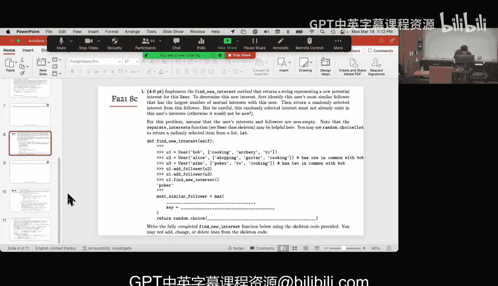

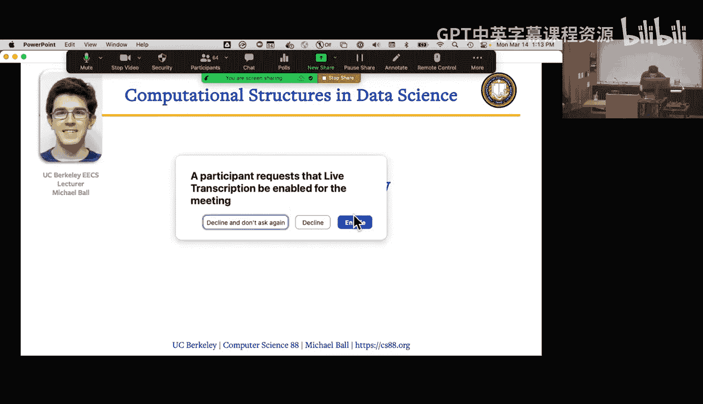

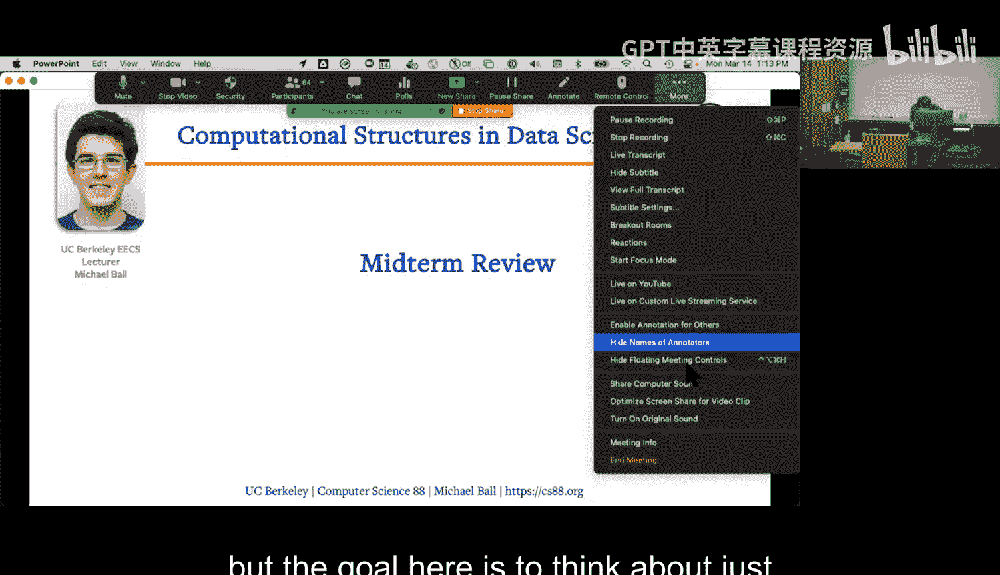

在本节课中，我们将回顾课程Ed讨论区上发布的四个问题，并一起分析解题思路。我们将重点学习如何拆解问题、识别关键技巧，并理解递归、高阶函数、列表操作和面向对象编程等核心概念在考试中的应用。

---

## 课程概述与考试安排 📋

上一节我们介绍了课程的整体结构，本节中我们来看看期中考试的具体安排和复习策略。

考试将安排在两个教室，具体分配将根据学生证号的最后一位数字决定。请留意后续的Ed公告。

关于手写笔记，允许携带不限量的手写笔记。但建议笔记内容不要超过三页，其目的是帮助你学习和记忆，而非在考试中翻找答案。

对于远程考试的同学，请遵循Zoom监考流程，包括开启屏幕录制等。考试工具中会提供CS88参考手册。

我的总体考试建议是：不要匆忙。建议先快速浏览整个试卷，了解题目分布。你可以按自己喜欢的顺序答题。例如，如果你擅长环境图或“Python会打印什么”这类问题，可以先做。解题时，先通读题目，再看提供的函数和文档测试，理解输入输出机制，最后思考解题所需的技巧或路径。

---

## 问题一：递归与列表结构 🔄

上一节我们讨论了考试策略，本节中我们来看看一个具体的递归列表问题。

这个问题来自2020年春季试卷的第6题。题目背景是：你被加州大学伯克利分校聘为数据科学家，需要找到校园里最大的教室来安排期中考试。数据以一种特殊的三元素列表格式存储：第一个元素是房间名，第二个元素是容量，第三个元素是剩余数据（另一个相同结构的列表）或 `None`。假设每个房间的容量是唯一的。

我们的目标是完成 `find_largest` 函数，它接收这样一个列表，返回房间名和容量最大的房间对。

首先，识别问题结构。数据是递归嵌套的列表，这提示我们使用递归来解决。我们需要确定**基例**和**递归情况**。

基例是当列表的第三个元素（`rooms[2]`）为 `None` 时，这意味着没有更多房间需要比较，直接返回当前房间的信息：`(rooms[0], rooms[1])`。

递归情况是当 `rooms[2]` 是另一个列表时。我们需要递归地在剩余数据（即 `rooms[2]`）中寻找最大房间，然后将结果与当前房间比较。

以下是解题的关键步骤排序：

1.  判断是否为基例：`if rooms[2] is None:`。
2.  如果是基例，返回当前房间：`return (rooms[0], rooms[1])`。
3.  否则，进行递归调用：`largest_left = find_largest(rooms[2])`。
4.  比较递归结果与当前房间的容量：`if largest_left[1] > rooms[1]:`。
5.  如果递归结果容量更大，则返回该结果：`return largest_left`。
6.  否则，返回当前房间：`return (rooms[0], rooms[1])`。

核心的递归调用公式是：
```python
largest_left = find_largest(rooms[2])
```
这分离了当前节点（`rooms[0]`, `rooms[1]`）和递归处理的部分（`rooms[2]`），是递归问题的常见模式。

---

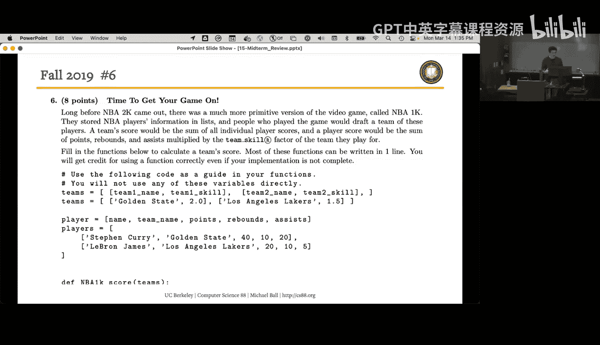

## 问题二：高阶函数与数据抽象 📊

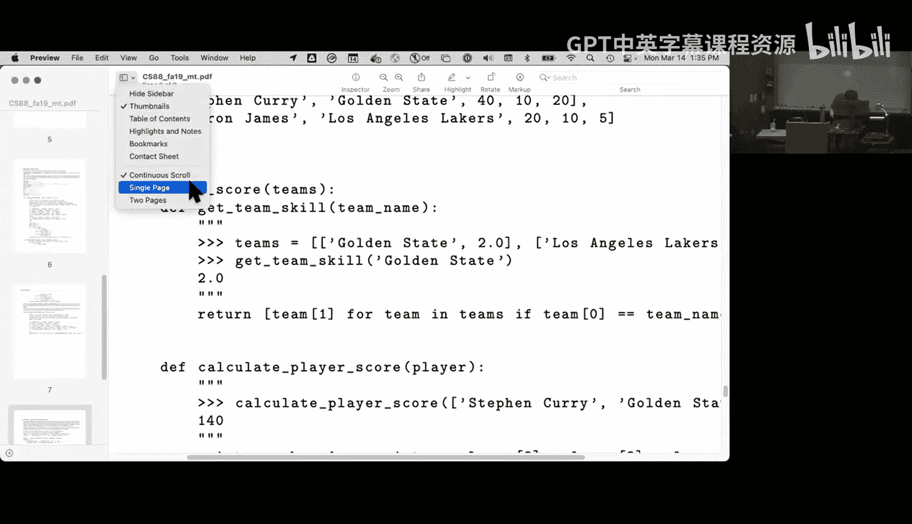

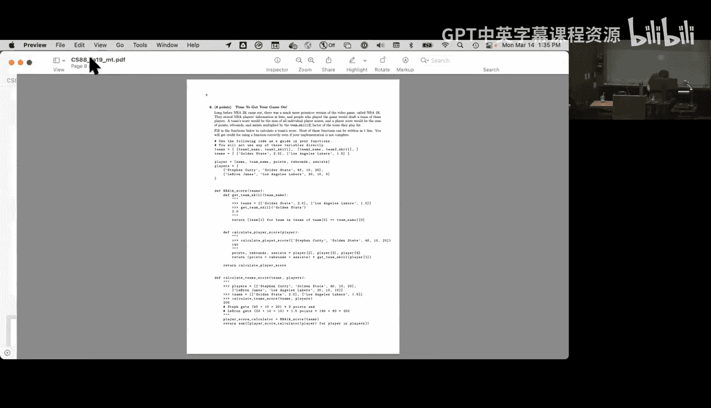

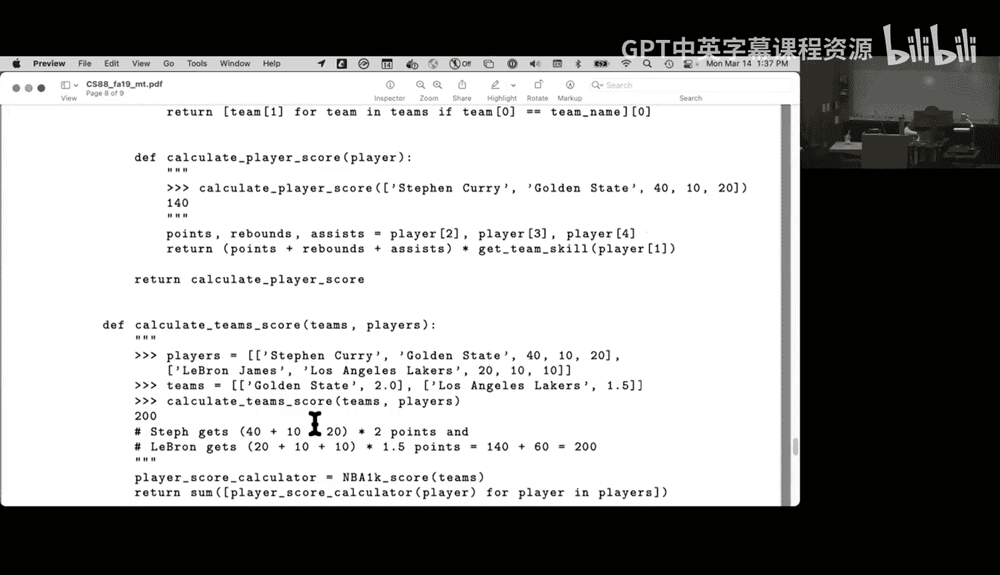

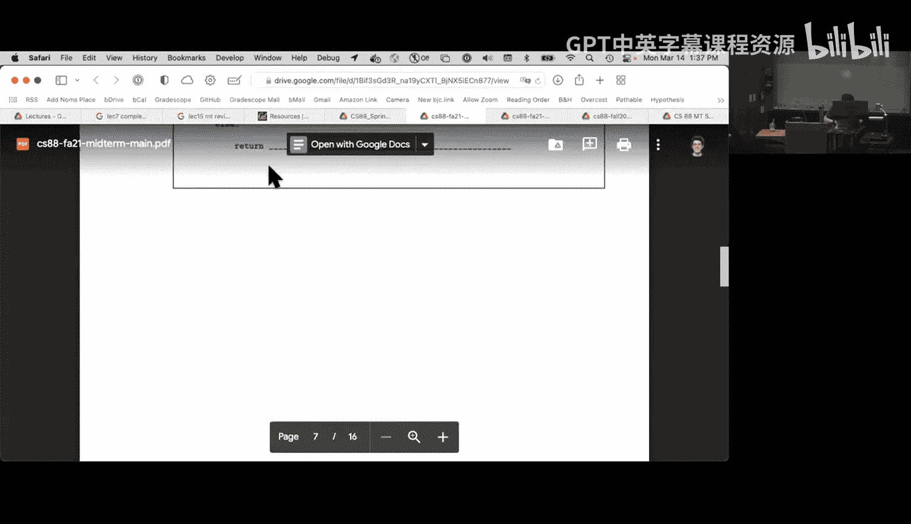

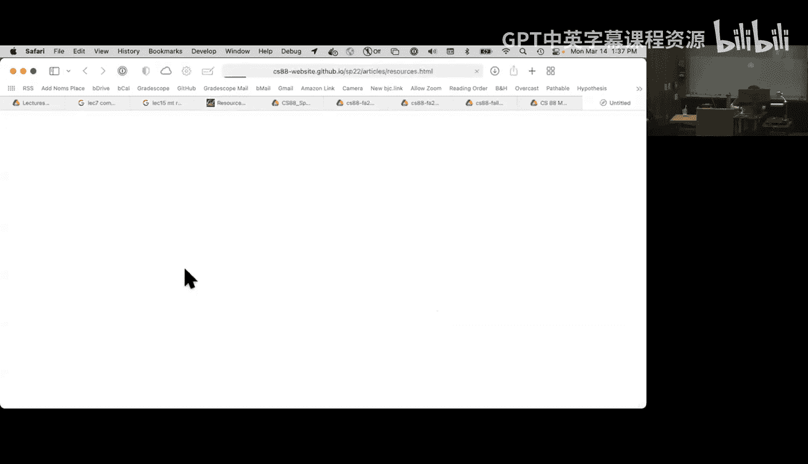

上一节我们分析了递归问题，本节中我们来看看一个结合了列表、数据抽象和高阶函数的复杂问题。

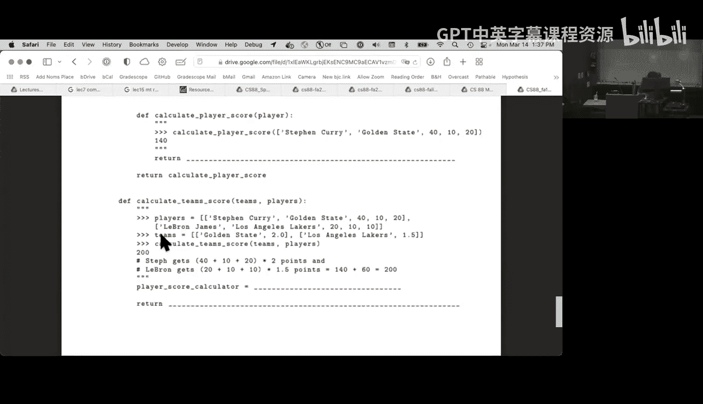

这个问题来自2019年秋季试卷的第6题。题目模拟了一个篮球游戏，我们需要计算球队得分。数据结构包括：
*   **球队列表**：每个球队是 `[名字, 技能值]` 的列表。
*   **球员列表**：每个球员是 `[名字, 所属球队, 得分, 篮板, 助攻]` 的列表。

球员得分是其（得分+篮板+助攻）乘以所属球队的技能值。球队得分是其所有球员得分之和。

题目提供了几个需要填充的函数，它们嵌套在 `nba_1k_score` 函数内部。即使前面的部分答错，正确使用后续函数仍可能得分。

首先看 `get_team_skill(team_name)` 函数。它接收一个球队名，需要从外层函数的 `teams` 列表中找出对应球队的技能值。这可以通过列表推导式完成：
```python
return [team[1] for team in teams if team[0] == team_name][0]
```
我们需要取列表的第一个元素（`[0]`）来返回单个数字。

接着看 `calculate_player_score(player)` 函数。它接收一个球员列表，需要计算该球员的得分。步骤如下：
1.  提取球员的得分、篮板、助攻：`points, rebounds, assists = player[2], player[3], player[4]`。
2.  计算基础数据之和：`total_stats = points + rebounds + assists`。
3.  获取球员所属球队的技能值，这需要调用前面写好的 `get_team_skill` 函数，传入球员的球队名（`player[1]`）。
4.  返回乘积：`return total_stats * get_team_skill(player[1])`。

最后是 `calculate_team_score(teams, players)` 函数。它接收球队和球员列表，需要返回所有球员的总得分。关键提示是使用 `player_score_calculator` 这个函数。

我们需要意识到，`player_score_calculator` 实际上就是 `nba_1k_score(teams)` 返回的 `calculate_player_score` 函数。因此，我们可以这样计算总得分：
```python
player_score_calculator = nba_1k_score(teams)
return sum([player_score_calculator(player) for player in players])
```
或者使用 `map`：
```python
return sum(map(player_score_calculator, players))
```
这个问题的难点在于理解高阶函数的传递和嵌套作用域，以及如何将大问题分解为几个小函数。

---

## 问题三：面向对象与高阶函数应用 👥

上一节我们处理了复杂的高阶函数，本节中我们来看一个结合面向对象编程和高阶函数的实际问题。

这个问题来自2021年秋季试卷。我们有一个 `User` 类，具有 `name`、`interests`（兴趣列表）和 `followers`（关注者用户对象列表）属性。我们需要实现 `find_new_interest` 方法，为用户推荐一个新兴趣。

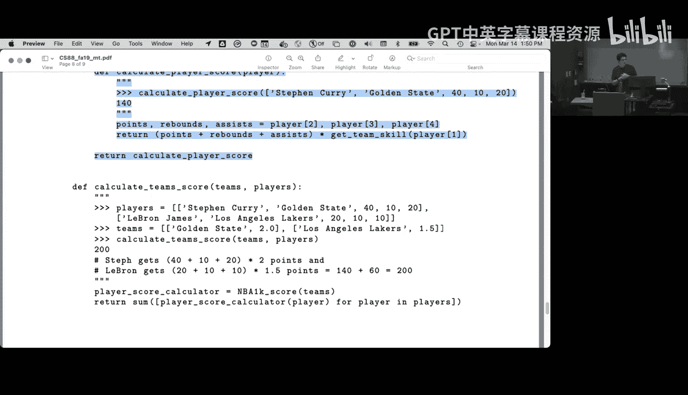

算法步骤如下：
1.  找到与该用户拥有最多共同兴趣的关注者（最相似关注者）。
2.  从该关注者的兴趣中，随机选择一个当前用户没有的兴趣。

题目提供了 `separate_interests(other_user)` 方法，它返回当前用户有而 `other_user` 没有的兴趣列表。我们可以使用 `random.choice(list)` 来随机选择。

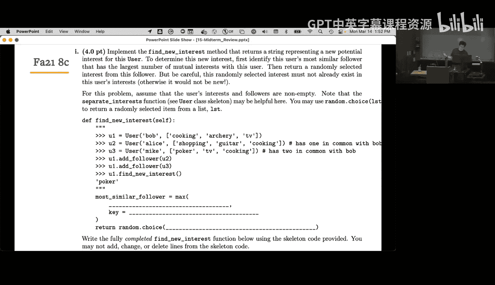

首先，思考如何找到“最相似关注者”。这需要比较当前用户与每个关注者的共同兴趣数量。`User` 类中有一个 `mutual_interests(other_user)` 方法，它返回共同兴趣的列表。

因此，最相似关注者是 `self.followers` 列表中，使得 `len(self.mutual_interests(follower))` 最大的那个用户。这非常适合使用 `max` 函数并指定 `key` 参数：
```python
most_similar_follower = max(self.followers, key=lambda f: len(self.mutual_interests(f)))
```
`key=lambda f: len(self.mutual_interests(f))` 告诉 `max` 函数根据每个关注者 `f` 与当前用户的共同兴趣数量来比较大小。

找到最相似关注者后，我们需要从他/她的兴趣中，排除掉当前用户已有的兴趣，然后随机选择一个。这正是 `separate_interests` 方法的功能，但注意它是当前用户的方法，用于获取“当前用户有而对方没有”的兴趣。我们需要的是“对方有而当前用户没有”的兴趣。因此，应该调用关注者对象的 `separate_interests` 方法，传入当前用户（`self`）：
```python
potential_interests = most_similar_follower.separate_interests(self)
```
最后，从 `potential_interests` 中随机返回一个：
```python
return random.choice(potential_interests)
```
这个方法巧妙地结合了对象间的交互、列表处理以及高阶函数（`max` 与 `lambda`），是考试中可能遇到的综合性较强的题目。

---

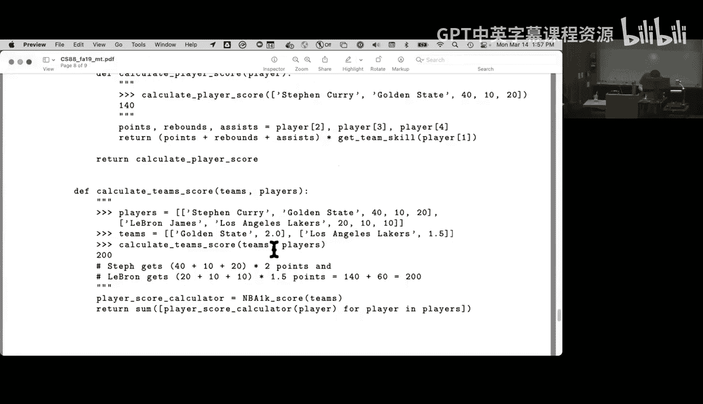

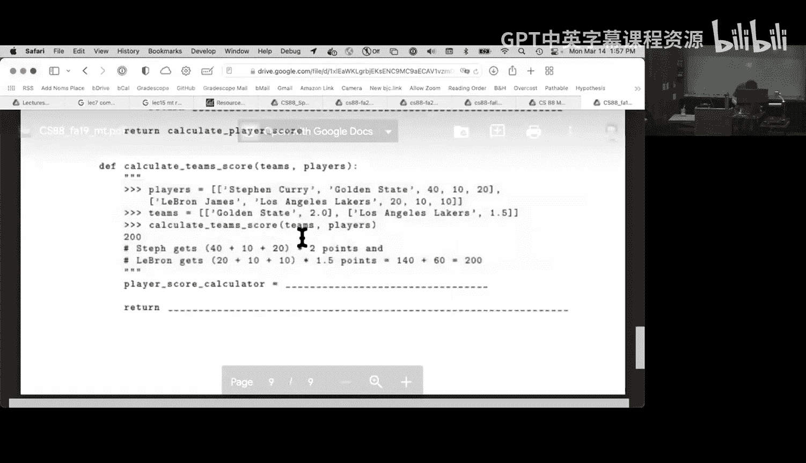

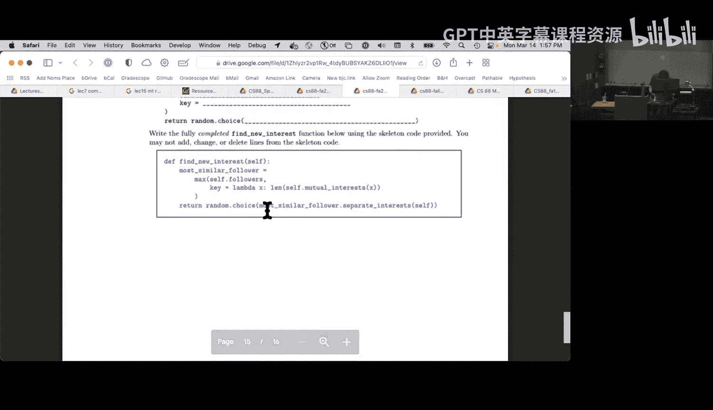

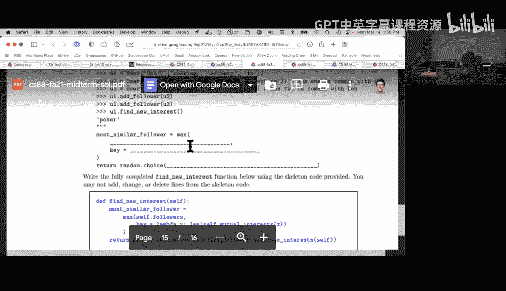

## 课程总结 🎓

本节课我们一起学习了期中考试的复习方法和三个典型问题的解析。

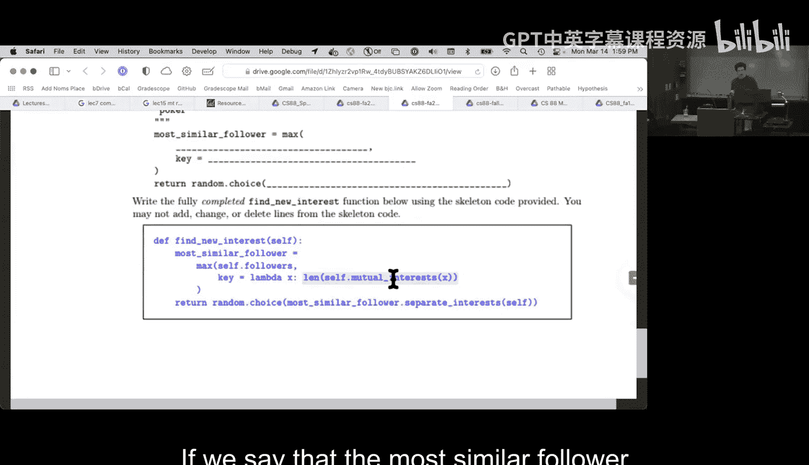

我们首先强调了考试策略，如先浏览试卷、按优势选题、仔细阅读题目和文档测试。接着，我们分析了三个核心问题：
1.  **递归列表问题**：关键在于识别数据的递归结构，定义清晰的基例和递归情况，并正确地进行递归调用和结果比较。
2.  **高阶函数与数据抽象问题**：重点在于理解复杂的数据结构（嵌套列表），将大问题分解为小函数，并注意高阶函数的定义、调用与返回值（可能是另一个函数）。
3.  **面向对象与高阶函数应用问题**：需要熟练运用类的方法和属性，在对象集合上使用像 `max` 这样的高阶函数配合 `key` 参数进行筛选，并实现对象间的逻辑交互。

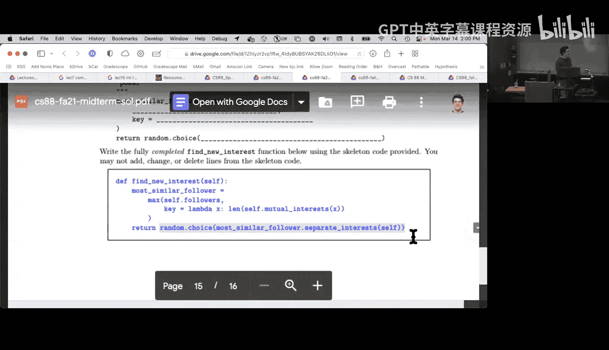

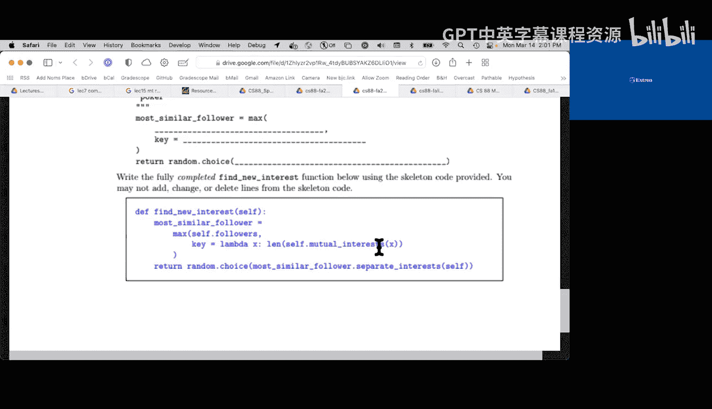

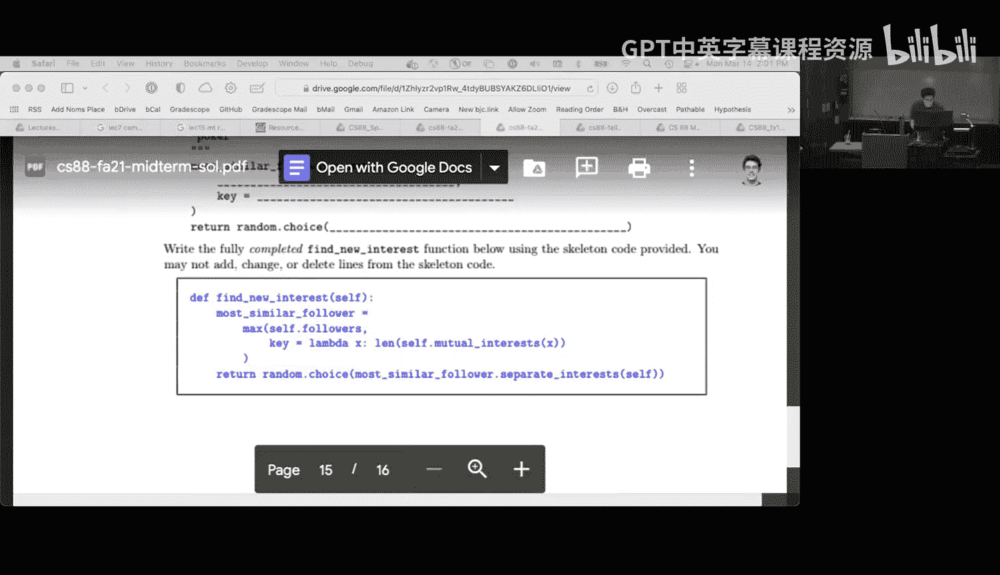

记住，在考试中，如果遇到难题，尝试写出部分思路或使用更直观（可能非一行代码）的方法，通常也能获得部分分数。保持冷静，理清思路，祝你考试顺利！