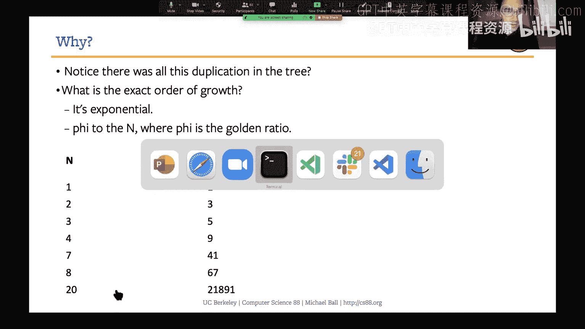
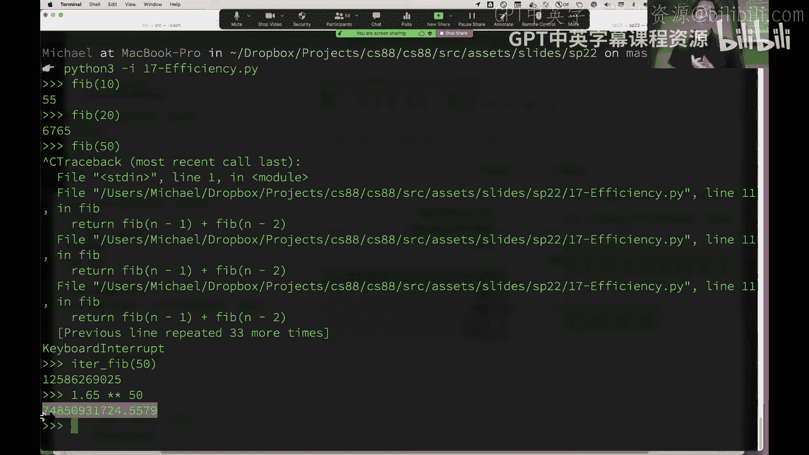
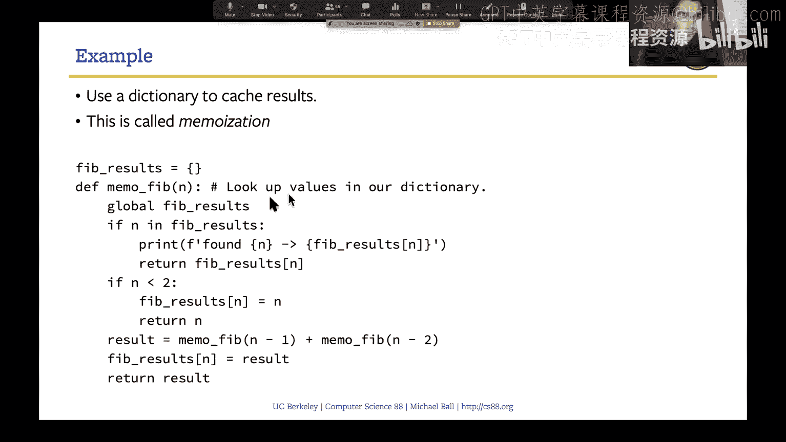
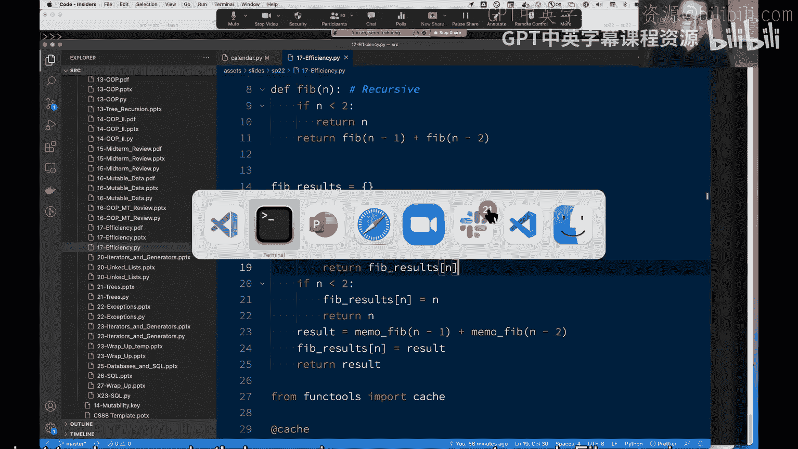
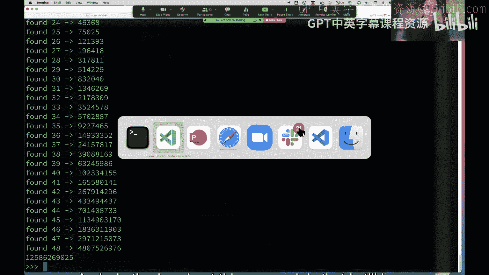
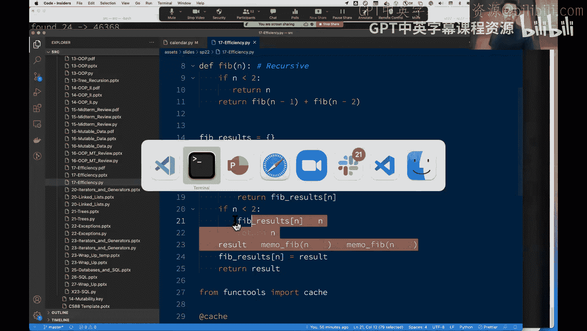
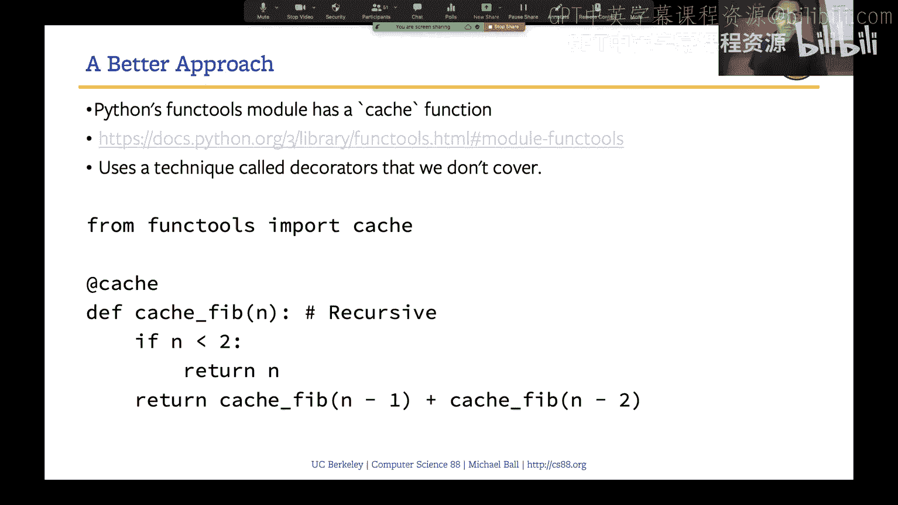
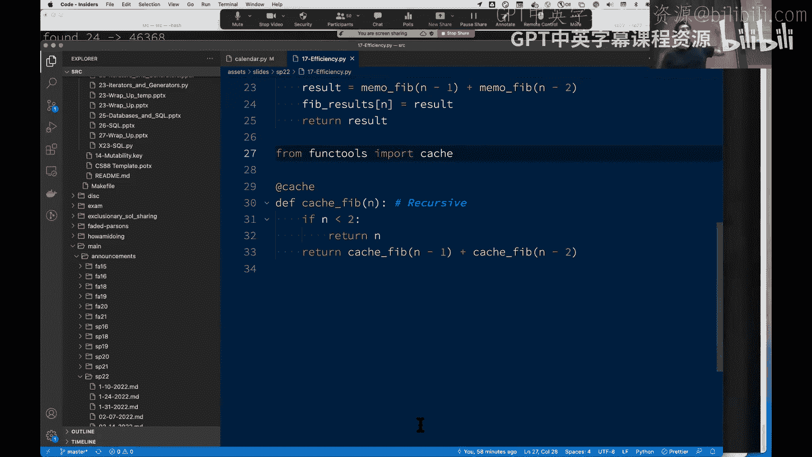
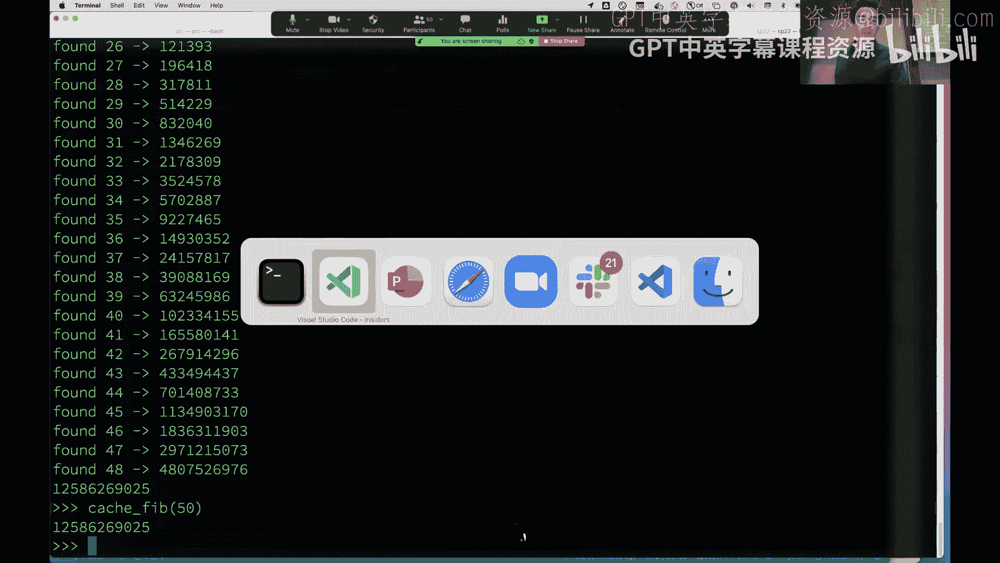
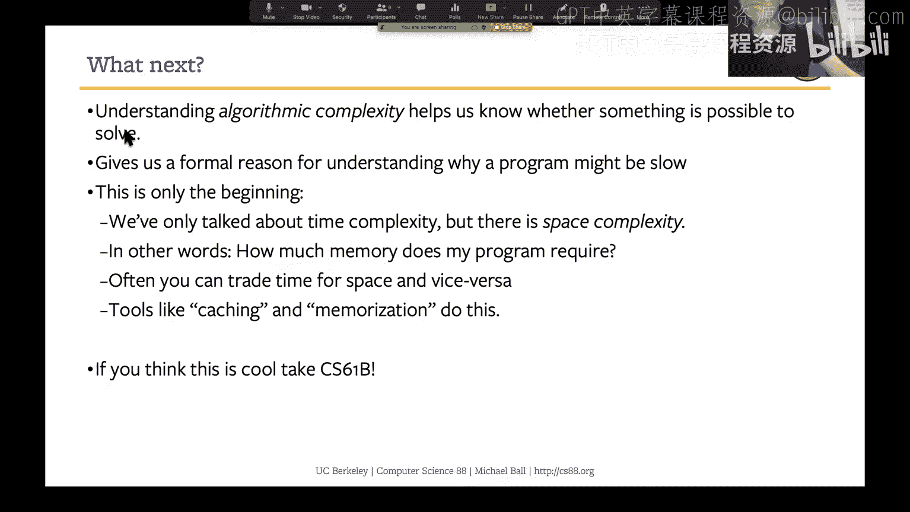

# 17：可变性与效率分析 🧠


在本节课中，我们将要学习两个核心主题。首先，我们将深入探讨列表可变性的一个微妙且容易混淆的方面。随后，我们将转向一个全新的主题——代码效率分析，探讨我们为何以及如何以特定的方式（如计算操作次数而非使用计时器）来衡量程序的性能。

## 可变性的微妙之处 🔍

上一节我们介绍了列表可变性的基本概念，本节中我们来看看一个需要特别注意的细节：当列表作为参数传递给函数时，其行为与不可变数据类型（如字符串）不同。

### 函数内修改列表

当我们将一个列表传递给函数时，函数内部接收到的参数指向的是原始列表对象本身，而非其副本。这意味着，如果在函数内部修改了这个列表（例如使用 `.append()` 方法），原始列表也会被改变。

```python
def add_to_list(a_list):
    a_list.append('more')

my_list = [1, 2]
add_to_list(my_list)
print(my_list)  # 输出: [1, 2, 'more']
```

在 Python Tutor 中逐步执行上述代码，可以看到 `my_list` 和函数参数 `a_list` 的箭头指向同一个列表对象。因此，在函数内对 `a_list` 的修改直接作用于 `my_list`。

### 函数内重新赋值列表

然而，如果在函数内部使用赋值语句（`=`）为参数名关联一个新的列表，情况则不同。这相当于在函数的局部环境中创建了一个新的变量名绑定，它不再指向传入的原始列表。

```python
def return_new_list(lst):
    lst = ['new', 'list']  # 重新赋值，创建新绑定
    return lst

original_list = [1, 2]
new_list = return_new_list(original_list)
print(original_list)  # 输出: [1, 2] (未被修改)
print(new_list)       # 输出: ['new', 'list']
```

这个行为遵循环境图的基本规则：`=` 赋值操作总是创建一个新的名称绑定。

### `+=` 操作符的特殊性

对于列表，`a += b` 操作并不等同于 `a = a + b`。`+=` 会就地修改列表 `a`，而 `a = a + b` 则会创建一个新的列表对象并重新绑定名称 `a`。

```python
# 示例：+= 就地修改
list1 = [1, 2, 3]
list2 = [4, 5]
list1 += list2  # 就地修改 list1
print(list1)    # 输出: [1, 2, 3, 4, 5]

# 示例：a = a + b 创建新对象
list3 = [1, 2, 3]
list4 = [4, 5]
list3 = list3 + list4  # 创建新列表并绑定给 list3
print(list3)           # 输出: [1, 2, 3, 4, 5]
```

这种行为源于 Python 中 `+=` 操作符对应对象的 `__iadd__` 特殊方法，它被设计为进行就地修改以提高效率。

理解了可变性的这些细节后，我们接下来将探讨一个更宏观的主题：如何分析和理解我们代码的效率。

## 效率分析入门 ⚡

为什么我们要关心代码效率？编写高效代码可以节省计算资源（如电池电量），提升用户体验，并在处理大规模数据时避免性能瓶颈。然而，追求极致效率通常需要在代码速度、内存占用和可读性之间做出权衡。

### 为何不用计时器？

你可能会想：要测量代码速度，直接用计时器运行一下不就好了？这种方法存在几个问题：
1.  **硬件差异**：不同计算机的处理器速度不同。
2.  **系统负载**：同一台计算机上运行的其他程序（如 Zoom）会影响计时结果。
3.  **缺乏通用性**：基于特定机器和时刻的测量结果无法形成通用理论。

因此，计算机科学采用了一种更抽象、更可靠的方法：**运行时分析**。我们通过计算程序执行所需的基本操作步骤数量来衡量其效率。

### 输入规模与最坏情况

效率分析总是相对于函数的**输入规模**而言的。输入规模可能是列表的长度、数字 `n` 的大小等。我们主要关注**最坏情况**下的性能，原因如下：
*   **系统规划**：确保系统在最繁忙时（如电商促销日）也能稳定运行。
*   **常见性**：某些最坏情况（如在列表中搜索不存在的元素）发生的频率可能比想象中高。
*   **分析简便**：最坏情况通常比平均情况更容易界定和分析。

### 增长阶（Orders of Growth）

我们根据输入规模 `n` 增大时，运行时间增长的速度来对算法进行分类。在 CS88 中，我们主要关注以下五种增长阶，从最快到最慢排列：

以下是五种主要的增长阶类型：

1.  **常数时间 O(1)**：运行时间不随输入规模变化。例如，访问列表的第一个元素 `list[0]`。
2.  **对数时间 O(log n)**：运行时间随输入规模翻倍而仅增加一步。例如，二分查找。
3.  **线性时间 O(n)**：运行时间与输入规模成正比。例如，遍历列表的 `for` 循环。
4.  **平方时间 O(n²)**：运行时间与输入规模的平方成正比。通常出现在嵌套循环中。
5.  **指数时间 O(cⁿ)**：运行时间随输入规模增加而呈指数级增长。这是非常低效的。

在更高级的分析中（如 CS61B），我们只关心增长最快的主导项。例如，一个时间复杂度为 `n² + 4*log n + n` 的算法，我们简化为 `O(n²)`。

### 算法分析示例

让我们通过两个搜索算法的例子来应用这些概念。

#### 示例1：在无序列表中线性搜索

**问题**：在一个无序的学生 ID 列表中，查找某个 ID 是否存在。
**算法**：从头到尾遍历列表，逐个比较。
**分析**：这是一个典型的线性时间 `O(n)` 算法。列表每增加一个元素，最坏情况下就需要多进行一次比较。

#### 示例2：在有序列表中二分搜索

**问题**：在一个已按 ID 排序的学生列表中，查找某个 ID 是否存在。
**算法**：
1.  查看列表中间的元素。
2.  如果目标 ID 等于中间元素，则找到。
3.  如果目标 ID 小于中间元素，则在列表的前半部分重复此过程。
4.  如果目标 ID 大于中间元素，则在列表的后半部分重复此过程。
5.  当子列表缩小到只有一个元素仍未找到时，则不存在。

**分析**：这是一个对数时间 `O(log n)` 算法。每一步都将搜索范围减半。即使列表规模极大，也能快速找到结果。二分查找是计算机科学中优化搜索的基础算法之一。

### 指数时间案例：递归斐波那契数列

我们之前见过的递归实现斐波那契数列函数是一个指数时间算法的经典例子。

```python
def fib(n):
    if n <= 1:
        return n
    return fib(n-1) + fib(n-2)
```

这个函数虽然代码简洁，但效率极低。计算 `fib(20)` 需要超过 21,000 次函数调用，而计算 `fib(50)` 所需的时间会长得不切实际。其时间复杂度约为 `O(φⁿ)`，其中 φ 是黄金比例。

相比之下，迭代版本的斐波那契数列算法是线性时间 `O(n)` 的，可以瞬间计算出 `fib(50)`。

### 优化策略：记忆化（Memoization）

我们可以通过**记忆化**（或称为缓存）技术来优化递归斐波那契函数，而无需完全重写逻辑。其核心思想是：存储已经计算过的结果，当再次需要时直接查找，避免重复计算。

以下是手动实现记忆化的示例：

```python
cache = {}  # 全局字典用于缓存结果



def memofib(n):
    if n in cache:        # 如果结果已缓存
        return cache[n]   # 直接返回
    if n <= 1:
        result = n
    else:
        result = memofib(n-1) + memofib(n-2)
    cache[n] = result     # 将新结果存入缓存
    return result
```

Python 的 `functools` 模块提供了内置的 `@cache` 装饰器，可以自动实现这一功能，让代码更简洁：



```python
from functools import cache

@cache
def cached_fib(n):
    if n <= 1:
        return n
    return cached_fib(n-1) + cached_fib(n-2)
```

使用记忆化后，递归斐波那契函数的时间复杂度从指数级降低到了线性级，同时保留了递归定义的清晰性。




## 总结 📚





本节课中我们一起学习了两个关键内容。



首先，我们深入探讨了列表可变性的一个高级主题：理解在函数中修改列表与重新为列表参数赋值之间的区别，以及 `+=` 操作符对列表的特殊行为。这些知识有助于我们避免因共享可变对象而导致的意外错误。





随后，我们转向了代码效率分析。我们了解了为何使用操作计数而非实际计时来衡量效率，认识了以输入规模为基础、关注最坏情况的分析方法。我们学习了五种主要的增长阶：常数、对数、线性、平方和指数时间，并通过线性搜索、二分搜索和递归斐波那契数列等例子进行了分析。最后，我们介绍了记忆化这种强大的优化技术，它能显著提升递归函数的性能，而无需牺牲代码的可读性。





效率分析是计算机科学的核心工具，能帮助我们在编写代码时做出更明智的权衡。在接下来的课程中，我们将继续学习更多的面向对象编程技术。