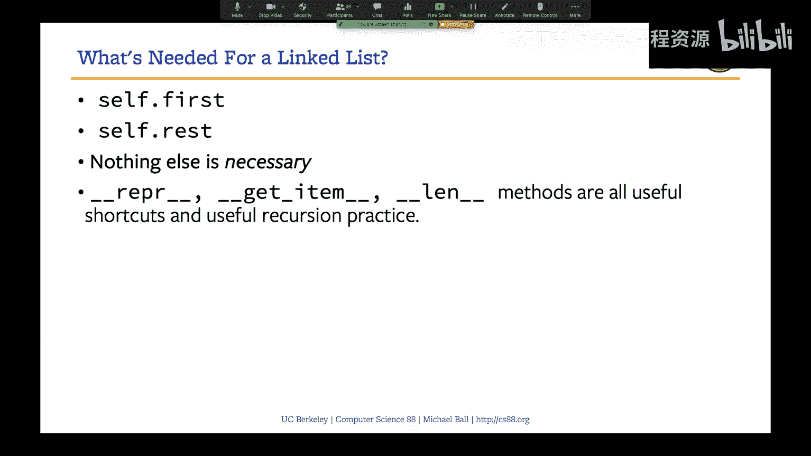

# 18：链表


## 概述
在本节课中，我们将学习一种名为“链表”的数据结构。我们将了解链表的基本概念、如何构建它，以及如何通过递归和面向对象编程的思想来操作链表。链表是理解更复杂数据结构（如树）的重要基础。

## 什么是链表？
链表是一种数据结构，它允许我们将多个数据项组合成一个单一的实体。与Python内置的列表不同，链表是我们自己构建的一种数据结构。每个链表节点包含两个主要部分：`first`（第一个值）和`rest`（指向剩余链表的引用）。

### 链表的结构
链表的结构可以用以下方式表示：
- 每个链表节点包含一个值（`first`）和一个指向下一个节点的引用（`rest`）。
- 链表的最后一个节点的`rest`指向一个特殊的空链表（如空元组）。

例如，一个包含值12、99和37的链表可以表示为：
```
链表节点(12) -> 链表节点(99) -> 链表节点(37) -> 空链表
```

## 构建链表
以下是构建链表的基本步骤：

### 1. 定义链表类
我们首先定义一个链表类，包含`first`和`rest`两个属性。`rest`的默认值为空链表。

```python
class Link:
    empty = ()

    def __init__(self, first, rest=empty):
        self.first = first
        self.rest = rest
```

### 2. 创建链表实例
使用链表类，我们可以创建链表的实例。例如，创建一个包含单个元素的链表：
```python
L1 = Link(1)
```
创建一个包含多个元素的链表：
```python
S = Link(3, Link(4, Link(5)))
```

## 链表的操作
链表支持多种操作，包括插入、删除和遍历。以下是链表的一些常见操作：

### 1. 插入元素
在链表中插入元素非常简单。例如，在链表的第二个位置插入一个值：
```python
S.rest = Link(3.5, S.rest)
```

### 2. 遍历链表
遍历链表可以通过递归或迭代实现。例如，计算链表的长度：
```python
def __len__(self):
    if self.rest is Link.empty:
        return 1
    return 1 + len(self.rest)
```

### 3. 访问元素
我们可以通过索引访问链表中的元素。例如，访问链表的第一个元素：
```python
S.first
```
访问链表的第二个元素：
```python
S.rest.first
```

## 链表的递归表示
链表的递归特性使得许多操作可以通过递归实现。例如，链表的`__repr__`方法可以通过递归生成链表的字符串表示：

```python
def __repr__(self):
    if self.rest is Link.empty:
        return f"Link({self.first})"
    return f"Link({self.first}, {self.rest})"
```

## 链表的优势与劣势
链表作为一种数据结构，有其独特的优势和劣势：

### 优势
- **插入和删除高效**：在链表中插入或删除元素只需要修改指针，时间复杂度为O(1)。
- **动态大小**：链表的大小可以动态调整，不需要预先分配内存。

### 劣势
- **访问元素慢**：访问链表中的元素需要从头开始遍历，时间复杂度为O(n)。
- **内存开销大**：每个节点需要额外的内存存储指针。




## 总结
本节课中，我们一起学习了链表的基本概念、构建方法以及常见操作。链表是一种递归数据结构，通过`first`和`rest`两个属性将数据项链接在一起。我们还探讨了链表的优势与劣势，并了解了如何通过递归实现链表的操作。链表是理解更复杂数据结构（如树）的重要基础，希望你能通过练习进一步掌握它。