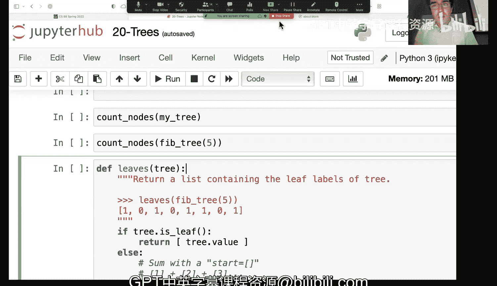

# 数据结构与算法：第20：树结构入门 🌳


在本节课中，我们将学习一种新的数据结构——树。我们将从上周介绍的链表出发，探讨其更通用的形式，并学习如何使用递归来遍历和处理树结构。

## 什么是树？🌲

上一节我们介绍了链表，它是一种线性的数据结构。本节中我们来看看树，它是链表的一种广义形式，允许一个节点有多个“子节点”。

树是一种非常基础且强大的数据结构，用于模拟现实世界中具有层级或“父子”关系的事物。例如：
*   公司的组织架构（CEO -> 经理 -> 员工）
*   文件系统（文件夹 -> 子文件夹 -> 文件）
*   生物分类（界 -> 门 -> 纲）
*   家族谱系

在树结构中，最顶端的节点称为**根节点**。每个节点包含一个**值**和一组指向其子节点的**分支**。没有分支的节点称为**叶节点**。

## 树的Python实现 💻

让我们看看如何在Python中定义一个简单的树类。核心概念是，一个树节点包含一个值和一个子节点（分支）列表。

```python
class Tree:
    def __init__(self, value, *branches):
        self.value = value
        self.branches = list(branches)
        # 确保每个分支本身也是一个Tree实例
        for branch in self.branches:
            assert isinstance(branch, Tree)

    def __repr__(self):
        if self.branches:
            return f‘Tree({self.value}, {self.branches})’
        else:
            return f‘Tree({self.value})’

    def is_leaf(self):
        return not self.branches
```

这里，`*branches` 是Python的一个语法糖，它允许函数接受任意数量的参数，并将它们打包成一个元组。这使得创建具有任意数量子节点的树变得非常方便。

最简单的树是只有一个节点的树：
```python
my_tree = Tree(1)
print(my_tree.is_leaf())  # 输出：True
```

我们可以构建更复杂的树，例如下面这个“讲座树”，它对应课程幻灯片中的示例：
```python
lecture_tree = Tree(2,
                    Tree(7,
                         Tree(2),
                         Tree(6,
                              Tree(5),
                              Tree(11)
                              ),
                         Tree(10)
                         ),
                    Tree(5,
                         Tree(9)
                         )
                    )
```

## 遍历树：深度优先搜索 🔍

处理树结构最常见的方式是遍历，即访问树中的每一个节点。我们将学习一种称为**深度优先搜索**的遍历方法。

其核心思想是：从根节点开始，尽可能深地访问每一分支，直到到达叶节点，然后回溯，再访问下一个分支。

以下是递归遍历并打印所有节点值的函数：

```python
def traverse_recursive(tree):
    print(tree.value)
    for branch in tree.branches:
        traverse_recursive(branch)
```

当我们对 `lecture_tree` 调用此函数时，打印顺序将是：2, 7, 2, 6, 5, 11, 10, 5, 9。这个顺序正是深度优先搜索的体现：它先深入处理完一个分支的所有后代，再处理兄弟分支。

## 计算树的节点数 🧮

现在，让我们尝试一个更具体的任务：计算一棵树总共有多少个节点。

我们的思路是：
1.  **基本情况**：如果树是一个叶节点（没有分支），那么它只有一个节点。
2.  **递归情况**：对于非叶节点，节点总数等于 **1（当前根节点）** 加上 **所有子树节点数的总和**。

以下是实现这个逻辑的代码：

```python
def count_nodes(t):
    if t.is_leaf():
        return 1
    else:
        total = 1  # 计算当前节点
        for branch in t.branches:
            total += count_nodes(branch)  # 递归计算每个分支的节点数并累加
        return total
```

对于 `lecture_tree`，这个函数将返回 10，因为树中恰好有10个节点。

我们也可以用更简洁的列表推导式来实现相同的逻辑：
```python
def count_nodes_concise(t):
    return 1 + sum([count_nodes_concise(branch) for branch in t.branches])
```
这个版本更直接地表达了公式：**树节点数 = 1 + 所有子树节点数之和**。

## 美化打印树结构 🖨️

为了更直观地看到树的层级结构，我们可以编写一个函数，通过缩进来显示不同层级的节点。

关键技巧是：在递归调用时，传入一个表示当前深度的 `indent` 参数，每深入一层，就增加缩进量。

```python
def print_tree(t, indent=0):
    print(‘  ‘ * indent + str(t.value))
    for branch in t.branches:
        print_tree(branch, indent + 1)  # 递归时增加缩进
```

调用 `print_tree(lecture_tree)` 会输出如下格式，清晰地展示了树的层级：
```
2
  7
    2
    6
      5
      11
    10
  5
    9
```

这种在递归中携带额外信息（如当前深度）的模式，对于解决许多树相关问题都非常有用。

## 总结与延伸 📚

本节课中我们一起学习了树数据结构。我们从链表自然过渡到树，理解了树如何通过允许一个节点拥有多个分支来建模更复杂的层级关系。

我们掌握了以下核心技能：
*   定义 `Tree` 类。
*   使用**深度优先搜索**递归地遍历树。
*   编写递归函数来解决树上的问题，例如**计算节点总数**。
*   通过**缩进打印**来可视化树的结构。



树是计算机科学中至关重要的工具，它是数据库、文件系统、搜索算法乃至机器学习中许多模型的基础。本课介绍的递归深度优先遍历是处理树的基石。在课后材料中，你还会看到如何用非递归（迭代）的方式遍历树，以及另一种重要的遍历方法——**广度优先搜索**，它按层级顺序访问节点。鼓励大家深入练习，巩固对这一强大数据结构的理解。