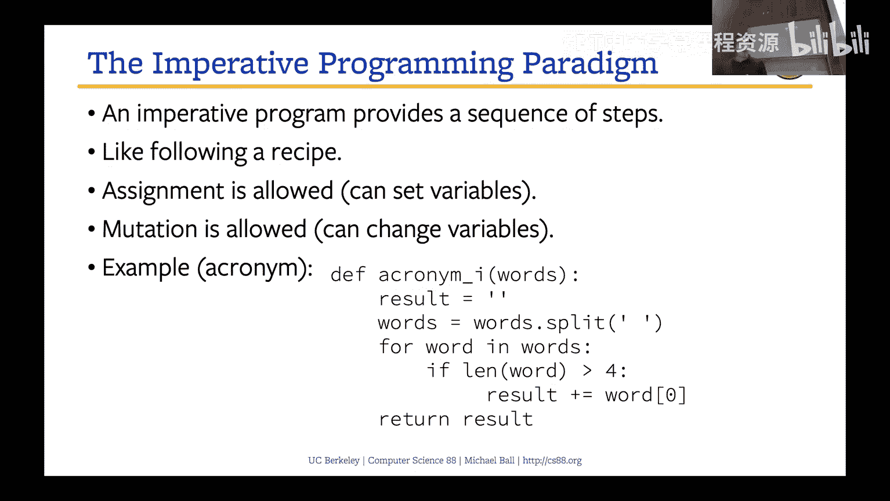
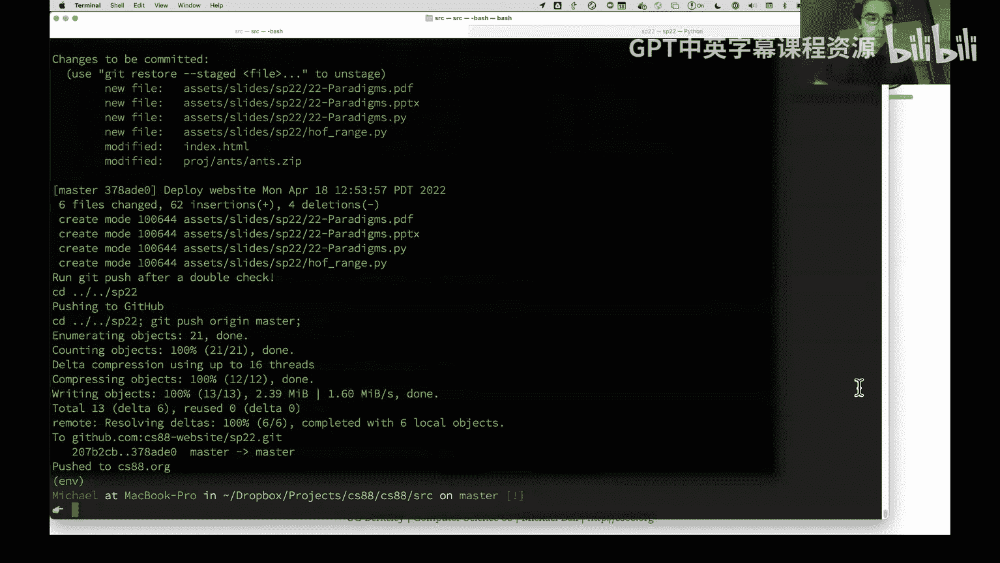
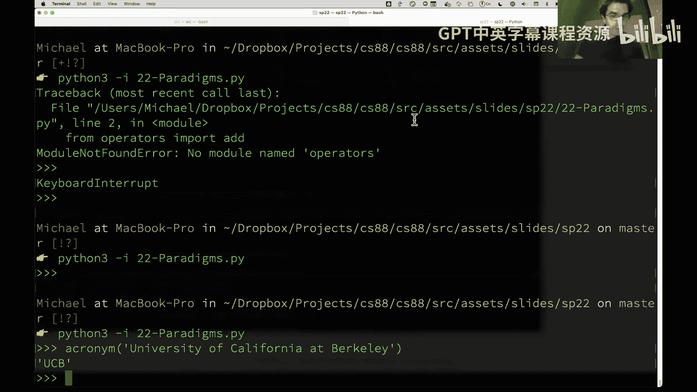
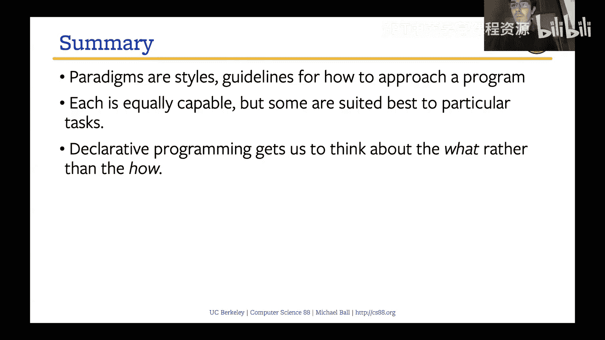

# 22：编程范式与SQL入门 🚀


在本节课中，我们将回顾本学期学习过的多种编程范式，理解它们背后的思想与适用场景，并初步介绍一种在数据科学中至关重要的新范式——声明式编程，以及其代表语言SQL。

## 概述：为何学习编程范式？ 🤔

在CS88课程中，我们不仅学习了Python语言，更重要的是接触了多种编写和思考代码的方式。这背后的核心理念是**编程范式**。一个编程范式是一种编写和推理代码的模式或模型。理解不同的范式，能帮助我们在面对具体问题时，选择最合适的工具，并更好地阅读、理解和构建复杂的程序。

大多数现代编程语言（如Python）都是**多范式**的，它们混合了多种编程风格。了解这些范式有助于我们识别代码的意图，并选择最佳工具来编写、修复或更新代码。

---

## 回顾核心编程范式 🔄

我们已学习过多种编程范式。例如，要生成一个数字列表的平方，可以有多种实现方式：

*   **函数式**：使用 `map` 和 `lambda`。
    ```python
    map(lambda x: x**2, range(5))
    ```
*   **命令式**：通过一系列步骤和变量赋值来实现。
    ```python
    result = []
    for num in range(5):
        result.append(num**2)
    return result
    ```
*   **面向对象**（理论上）：可以设计一个具有特定方法的类。
    ```python
    # 概念性代码
    class MyRange:
        def square_numbers(self):
            return [x**2 for x in self.numbers]
    ```

接下来，我们通过一个具体的例子——**生成句子首字母缩写词**——来深入比较几种范式。

### 示例：生成缩写词程序

该程序的目标是将如 “University of California at Berkeley” 的句子转换为 “UCB”。它需要完成三个步骤：
1.  将字符串拆分为单词列表。
2.  过滤掉短单词（例如长度小于4的单词，如 “of”, “at”）。
3.  提取每个长单词的首字母。
4.  将首字母组合成一个字符串。





以下是三种不同范式的实现：



#### 1. 命令式范式

命令式编程依赖于**按顺序执行的步骤**、**变量赋值**，并经常涉及**改变变量状态**。它类似于遵循一个食谱。

```python
def acronym_imperative(text):
    words = text.split()
    result = ""
    for word in words:
        if len(word) >= 4:
            result += word[0]
    return result
```
**特点**：逻辑清晰，步骤分明，易于按顺序理解。这是最接近我们自然思考过程的方式。

#### 2. 函数式范式

函数式编程强调**函数的组合**，避免状态变化和副作用。数据通过一系列函数传递，每个函数接受输入并产生输出。

```python
from functools import reduce
def acronym_functional(text):
    words = text.split()
    long_words = filter(lambda w: len(w) >= 4, words)
    first_letters = map(lambda w: w[0], long_words)
    return reduce(lambda a, b: a + b, first_letters, "")
```
**特点**：代码简洁，无中间状态变量，易于并行化处理。但需要从内向外理解函数调用顺序。

**函数式编程的优势**：
*   **易于调试**：将问题分解为纯函数，便于独立测试。
*   **利于并行计算**：函数不依赖外部状态，可以安全地分布在多台计算机上执行，这对大数据处理管道（如Apache Spark）至关重要。

#### 3. 混合范式

实际编程中，我们经常混合使用多种范式。例如，下面的代码混合了命令式（变量赋值）、函数式（`filter`, `map`, `lambda`）和面向对象（`str.join`）的风格。

```python
def acronym_hybrid(text):
    words = text.split()                    # 字符串方法，面向对象
    long_words = filter(lambda w: len(w) >= 4, words) # 函数式
    first_letters = map(lambda w: w[0], long_words)   # 函数式
    return "".join(first_letters)           # 字符串方法，面向对象
```
**特点**：结合了多种范式的优点，在可读性和表达力之间取得平衡。它本质上是函数式程序的分解版，为每个步骤赋予了有意义的变量名。

---

## 其他重要范式 🌟

### 数组式编程

这是一种在数据科学领域（如R、MATLAB、Julia语言）常见的范式。它将数组视为一等公民，并直接在数组级别定义操作，而不是遍历每个元素。

**核心思想**：对数组进行原生操作。例如，两个数组相加是元素对应相加，而不是合并数组。
```python
# 概念性操作（在Python中需借助NumPy等库）
# 假设 list1 = [1, 2, 3], list2 = [4, 5, 6]
# 数组式加法结果应为 [5, 7, 9]，而非 [1, 2, 3, 4, 5, 6]
```
这种范式非常适合进行大量的数值计算和矩阵运算。

### 面向对象编程

本学期我们花了大量时间学习OOP。它通过**类**和**对象**来组织代码，将数据（属性）和操作数据的方法捆绑在一起。

**特点**：适合对现实世界实体进行建模，构建层次化的结构（如继承）。在Python中，OOP与其它范式深度集成（例如，`+`操作符对应对象的 `__add__` 方法）。

**注意**：设计良好的面向对象程序需要权衡，如决定对象应该是可变的还是不可变的，避免过度使用类属性导致结构混乱。

---

## 声明式编程与SQL入门 🗃️

现在，我们来看一种截然不同的范式：**声明式编程**。

### 什么是声明式编程？

在声明式编程中，我们**描述想要的结果**，而不是指定达到结果的详细步骤。具体的执行方式由语言或底层系统决定。

一个经典的例子是**地图着色问题**：用四种颜色给德国各州着色，要求相邻州颜色不同。在声明式语言（如Prolog）中，我们只需定义颜色集合和“相邻州颜色不能相同”的规则，系统会自动寻找符合条件的着色方案。

### SQL：数据科学的声明式语言

在CS88的最后阶段，我们将学习 **SQL（结构化查询语言）**。SQL是用于管理和查询数据库的标准化声明式语言。

**为什么学习SQL？**
1.  **数据无处不在**：几乎所有数据科学项目的数据都存储在某种数据库中。
2.  **行业标准**：SQL是查询和操作数据库的通用工具，是数据科学家和工程师的必备技能。
3.  **声明式优势**：我们只需描述需要什么数据，数据库引擎会优化查询过程，高效地返回结果。

### SQL预览

SQL通过**查询**与数据库交互。一个基本的查询语句结构如下：
```sql
SELECT * FROM cones WHERE price > 5;
```
这条语句的意思是：“从 `cones` 表中，选择所有价格大于5的记录。” 我们**声明**了想要的数据特征（价格>5），数据库负责找出所有符合条件的行。

这与我们在Data 8中使用的 `cones.where(‘price’, are.above(5))` 或未来在Data 100中使用Pandas进行过滤的理念是相通的。

---

## 总结 🎯

本节课中，我们一起回顾并梳理了CS88课程中涉及的多种编程范式：
*   **命令式编程**：关注“如何做”，通过一系列步骤和状态改变来解决问题。
*   **函数式编程**：关注“做什么”，通过组合纯函数来解决问题，避免状态和副作用。
*   **面向对象编程**：通过对象封装数据和行为，对现实世界进行建模。
*   **数组式编程**：将数组作为核心，进行原生的批量数据操作。
*   **声明式编程**：关注“要什么”，描述目标结果，由系统决定执行过程。

理解这些范式，能让我们成为一个更具洞察力的程序员。在阅读或编写代码时，我们可以思考其使用的范式，从而选择最清晰、最有效的工具来解决问题。



在接下来的课程中，我们将深入探索**声明式编程**的实践，学习如何使用**SQL**这门强大的语言来查询和操作数据，为你的数据科学之旅打下坚实的基础。