# 23：SQL与数据库入门 🗄️


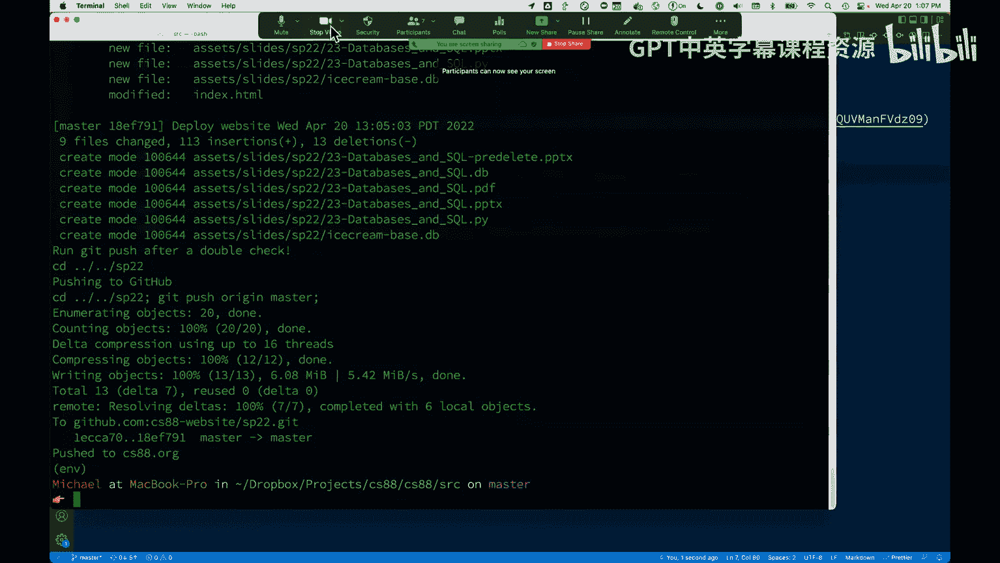

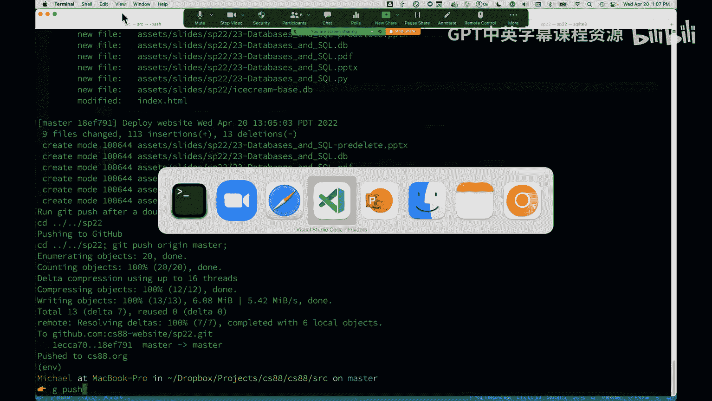

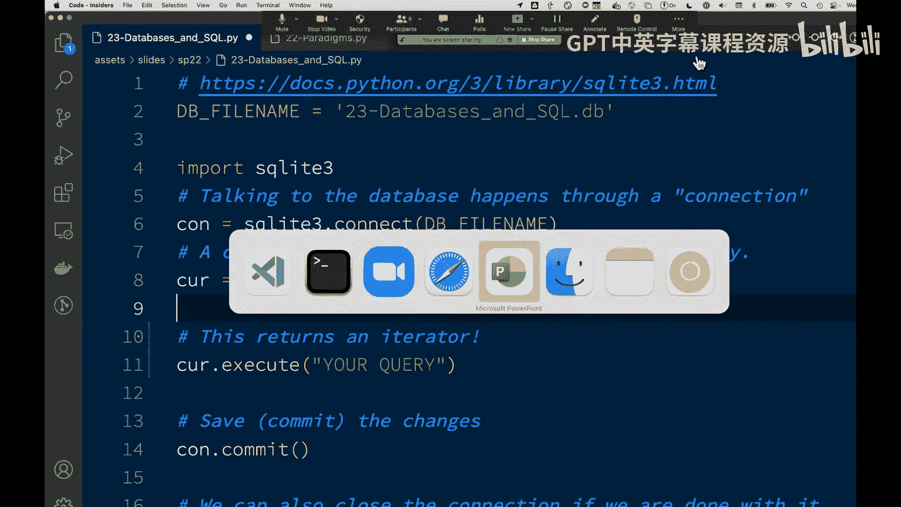

在本节课中，我们将学习如何使用SQL与数据库进行交互。SQL是一种声明式编程语言，广泛应用于数据科学领域，用于查询和管理存储在数据库中的数据。我们将从基础概念开始，逐步探索如何执行查询、筛选数据以及排序结果。

---

## 数据库与SQL概述

上一节我们介绍了不同的编程范式。本节中，我们来看看SQL作为一种声明式语言，如何用于与数据库交互。

SQL（结构化查询语言）是一种用于管理和查询关系型数据库的语言。它的核心思想是描述我们想要计算什么，而不是具体如何计算。数据库管理系统（如SQLite）在后台处理查询的优化和执行，使我们能够高效地处理数据。

在数据科学中，SQL是一项极其重要的技能。无论是学术研究还是工业应用，数据通常都存储在数据库中。例如，电子邮件服务、学校管理系统等都依赖数据库来存储和检索信息。

---

## 数据库的基本概念：表

在深入SQL查询之前，我们需要理解数据库的基本组成单元：表。

表是数据的集合，以行和列的形式组织。每一列代表一个属性（例如“姓名”、“价格”），并且具有特定的数据类型。每一行代表一个记录，包含与该记录相关的所有属性值。

以下是一个示例表的结构：

| 城市 | 纬度 | 经度 |
|------|------|------|
| Berkeley | 37.87 | -122.27 |
| Cambridge | 42.37 | -71.11 |
| Minneapolis | 44.98 | -93.27 |

在这个表中：
*   “城市”、“纬度”、“经度”是列名。
*   每一行数据（如 `Berkeley, 37.87, -122.27`）描述了一个特定城市的属性。
*   同一列中的所有值（如所有纬度值）都是相同的数据类型。

数据库可以包含多个这样的表，每个表存储不同类型的信息。

---

## 实践工具：SQLite控制台与Python

我们将使用两种主要工具与SQLite数据库进行交互：SQLite控制台和Python。

### 1. SQLite控制台

SQLite控制台是一个命令行工具，类似于Python解释器，但专门用于执行SQL命令。启动控制台并连接到一个数据库文件后，我们可以直接输入SQL查询。

以下是启动控制台并执行一些基本命令的示例：
```bash
# 启动SQLite控制台并连接到数据库文件
sqlite3 database.db

# 在控制台内，打开列名显示以便阅读结果
.headers on

# 列出数据库中的所有表
.tables

# 执行一个简单的查询：选择`cones`表中的所有数据
SELECT * FROM cones;
```
在控制台中，命令如 `.tables` 和 `.headers on` 是SQLite特有的元命令，而非标准SQL语句。

### 2. 通过Python连接SQLite

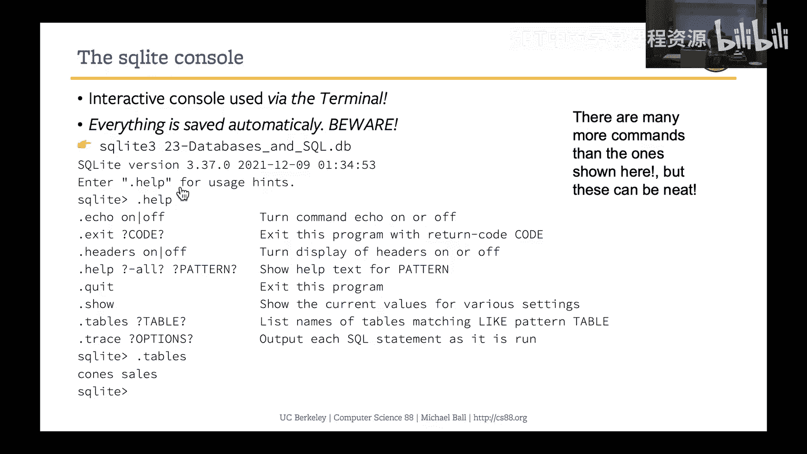

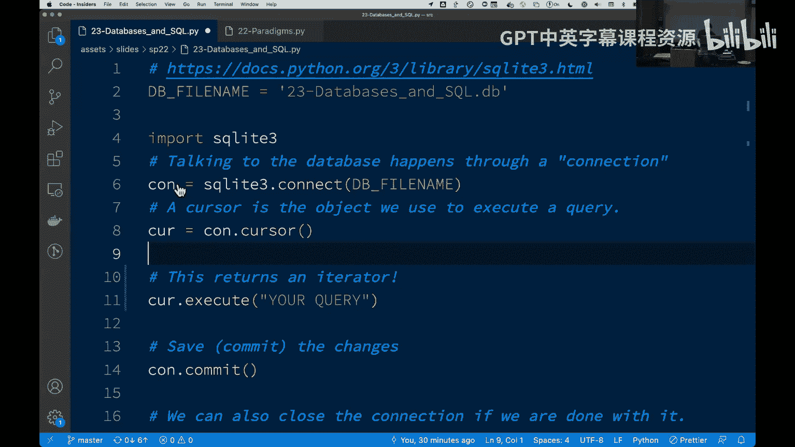

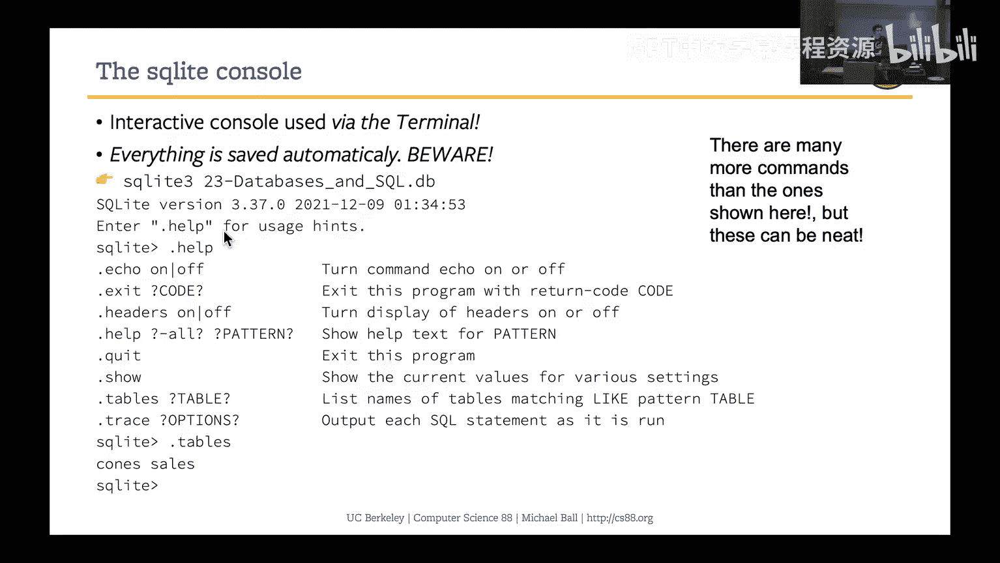

我们也可以在Python脚本中执行SQL查询，这对于将数据库操作集成到数据分析流程中非常有用。

以下是通过Python连接SQLite数据库并执行查询的基本步骤：
```python
import sqlite3

# 1. 连接到数据库文件
connection = sqlite3.connect('database.db')

# 2. 创建一个游标对象，用于执行查询
cursor = connection.cursor()

# 3. 执行一个SQL查询字符串
query = "SELECT * FROM cones;"
cursor.execute(query)

# 4. 获取结果。`cursor.execute()`返回一个迭代器
for row in cursor:
    print(row)  # 每一行是一个元组，包含各列的值

# 5. 如果执行了修改数据的操作，需要提交更改
# connection.commit()

# 6. 关闭连接
connection.close()
```
需要注意的是，通过Python接口，我们主要使用标准的SQL语句。SQLite控制台特有的元命令（如 `.tables`）在Python中无法直接使用。

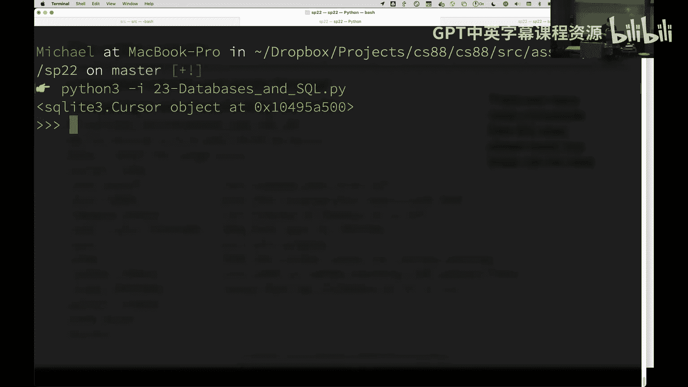

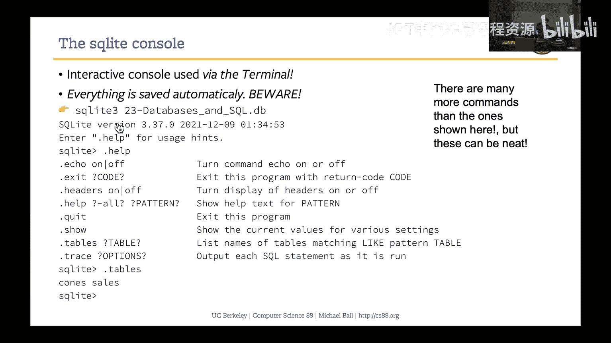

---

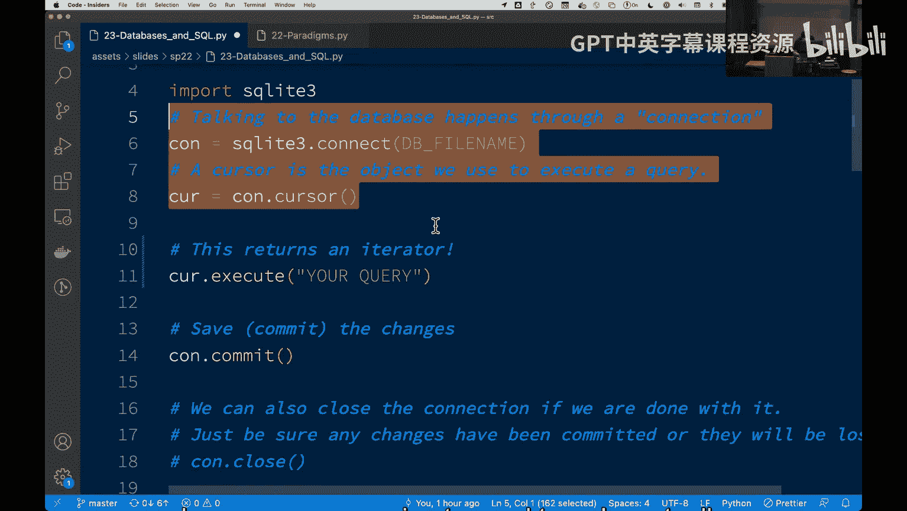

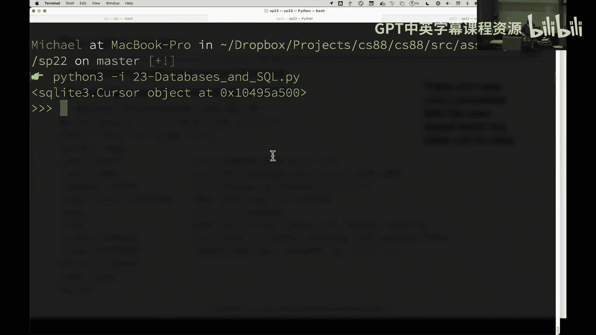

## SQL查询的核心：SELECT语句

`SELECT` 语句是SQL中最常用、最核心的命令，用于从数据库表中检索数据。它的基本结构是描述我们想要哪些列、从哪个表获取、以及满足什么条件。

一个完整的 `SELECT` 语句遵循以下基本结构，其中 `[]` 内的部分是可选的：
```sql
SELECT [DISTINCT] 列名或表达式
FROM 表名
[WHERE 条件]
[ORDER BY 列名 [ASC | DESC]];
```

### 选择特定列

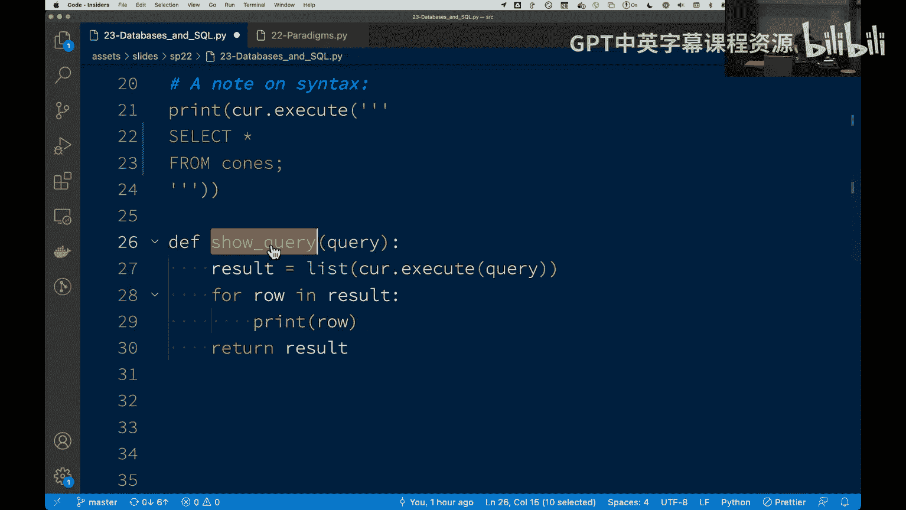

我们可以指定要检索的列名，用逗号分隔。
```sql
-- 只选择`flavor`和`price`两列
SELECT flavor, price FROM cones;
```

### 使用星号(*)选择所有列

使用 `*` 可以快捷地选择表中的所有列。
```sql
-- 选择`cones`表中的所有列
SELECT * FROM cones;
```

### 使用WHERE子句筛选行

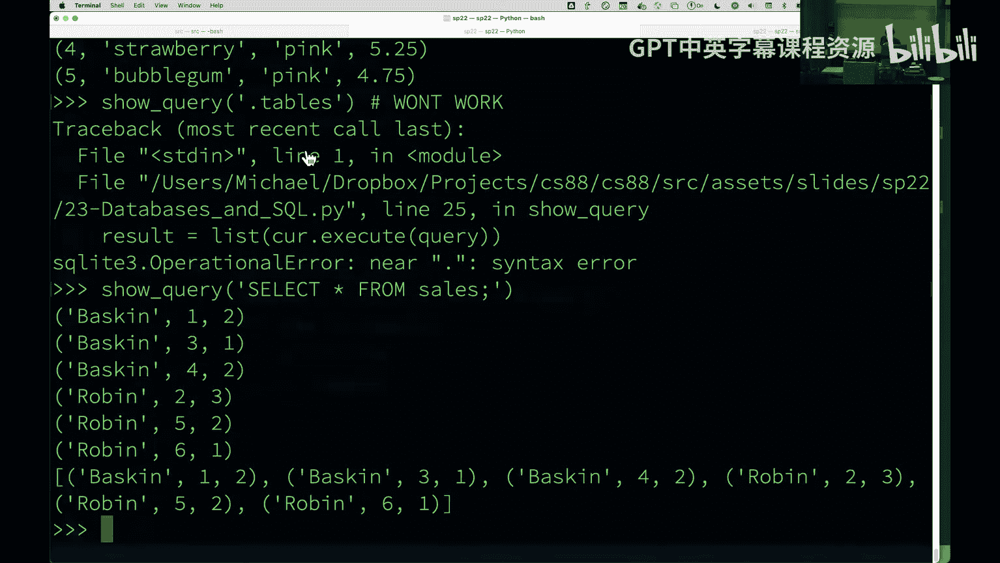

`WHERE` 子句允许我们根据指定条件过滤行。
```sql
-- 选择价格大于5美元的冰淇淋甜筒
SELECT * FROM cones WHERE price > 5;
```

### 使用ORDER BY子句排序结果

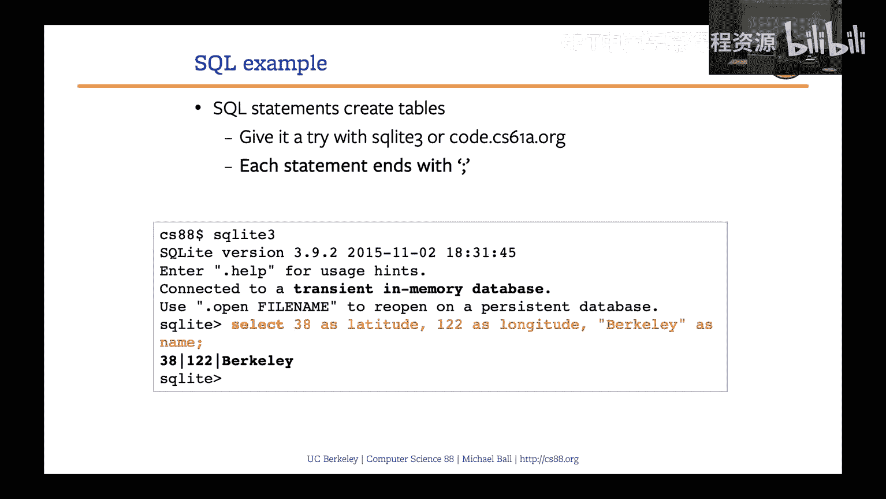

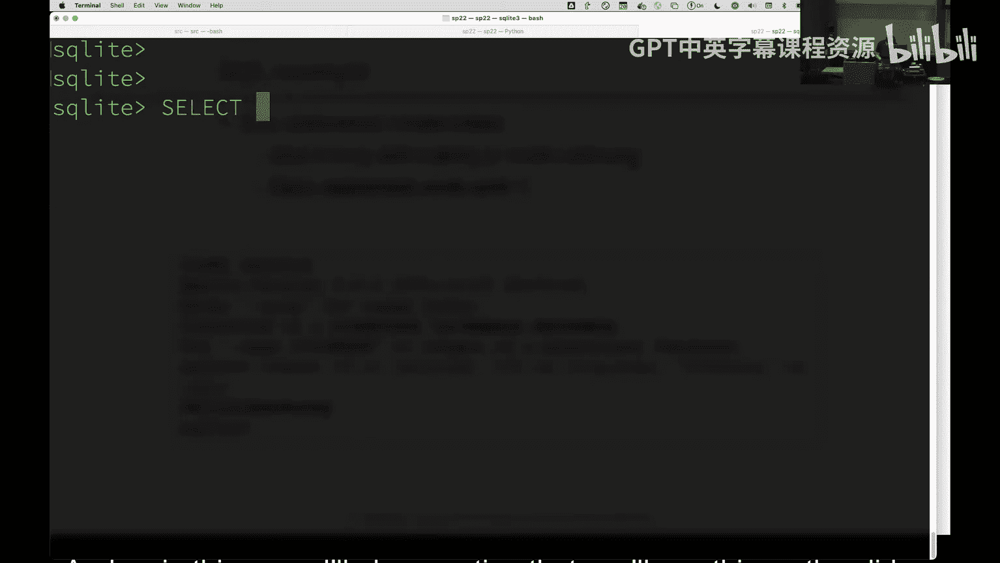

`ORDER BY` 子句用于根据一列或多列对结果集进行排序。默认是升序（`ASC`），可以使用 `DESC` 指定降序。
```sql
-- 按价格从低到高排序所有甜筒
SELECT * FROM cones ORDER BY price;

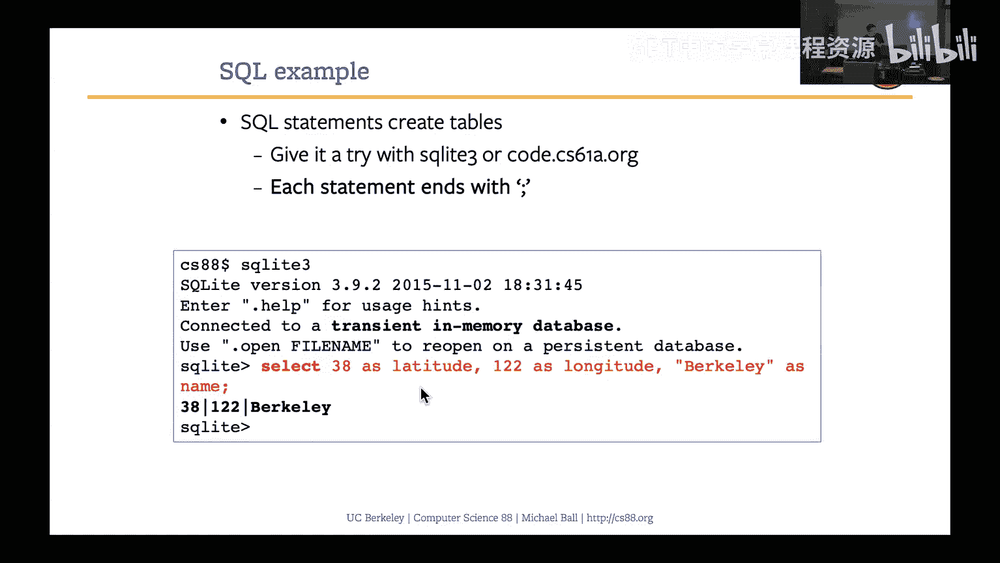

-- 按价格从高到低排序
SELECT * FROM cones ORDER BY price DESC;

-- 先按颜色排序，颜色相同的再按价格降序排序
SELECT * FROM cones ORDER BY color, price DESC;
```

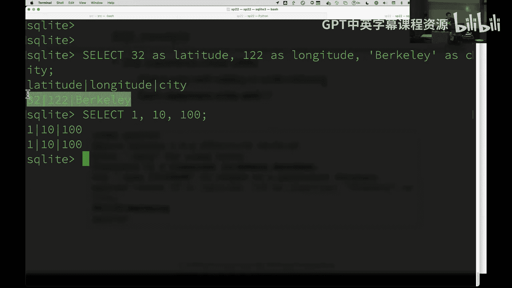

### 组合使用

我们可以将 `SELECT`、`FROM`、`WHERE` 和 `ORDER BY` 组合起来，构建复杂的查询。
```sql
-- 选择价格超过4.5美元的甜筒，只显示口味和价格，并按价格降序排列
SELECT flavor, price FROM cones WHERE price > 4.5 ORDER BY price DESC;
```

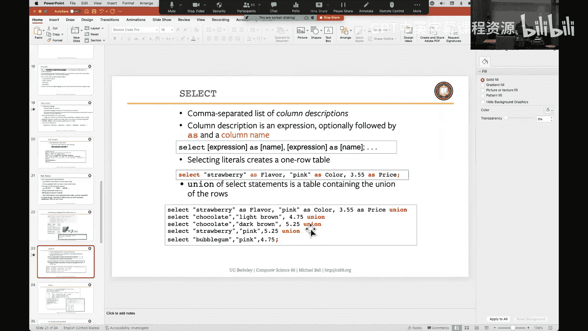

---

## 创建临时数据与UNION操作

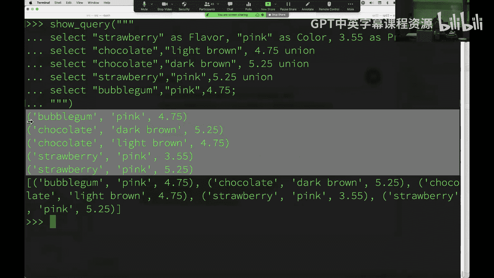

`SELECT` 语句不仅可以查询现有表，还可以直接“创建”临时的数据表。

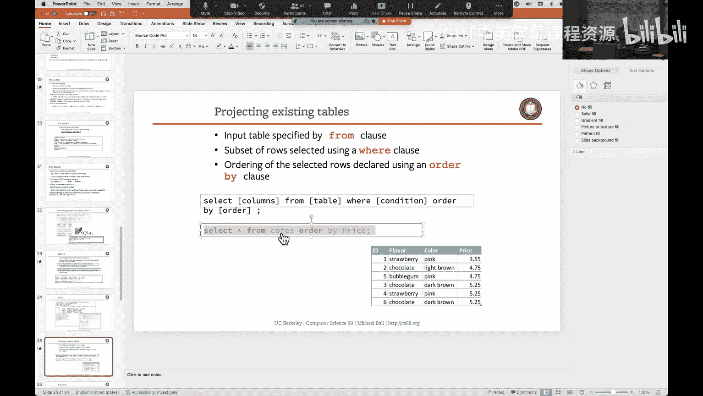

### 选择字面量值

我们可以直接选择具体的值，SQL会将其作为一行数据返回。
```sql
-- 创建一个临时行，包含指定的纬度、经度和城市名
SELECT 37.87 AS latitude, -122.27 AS longitude, 'Berkeley' AS city;
```
这里使用 `AS` 关键字为列指定了别名，使结果更易读。

### 使用UNION组合多个SELECT

`UNION` 操作符用于合并两个或多个 `SELECT` 语句的结果集。每个 `SELECT` 语句必须拥有相同数量的列，且列的数据类型必须兼容。
```sql
-- 创建一个小型临时表，包含几种甜筒信息
SELECT 'strawberry' AS flavor, 'pink' AS color, 3.55 AS price
UNION
SELECT 'chocolate' AS flavor, 'brown' AS color, 4.75 AS price
UNION
SELECT 'vanilla' AS flavor, 'white' AS color, 4.25 AS price;
```
这将返回一个包含三行数据的表。

---

## 总结

本节课中我们一起学习了SQL与数据库的基础知识。我们首先了解了数据库和表的基本概念，即数据以行和列的形式组织。接着，我们介绍了两种与SQLite数据库交互的工具：SQLite控制台和Python的sqlite3模块。

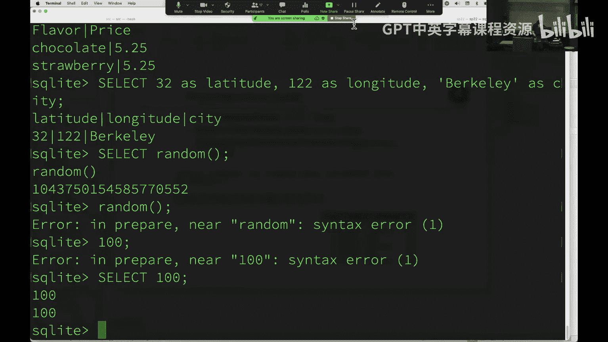

我们深入探讨了SQL的核心——`SELECT`查询语句，学习了如何选择特定列、使用`WHERE`子句过滤数据、以及用`ORDER BY`对结果进行排序。最后，我们还看到了如何使用`SELECT`直接创建临时数据，并通过`UNION`操作符合并多个查询结果。

这些基础操作构成了与数据库交互的基石。掌握了这些，你就已经能够从数据库中提取和初步处理所需的信息。在接下来的课程中，我们将在此基础上，学习更高级的操作，例如连接多个表、分组聚合数据以及修改数据库内容。