# 25：课程总结与展望 🎓

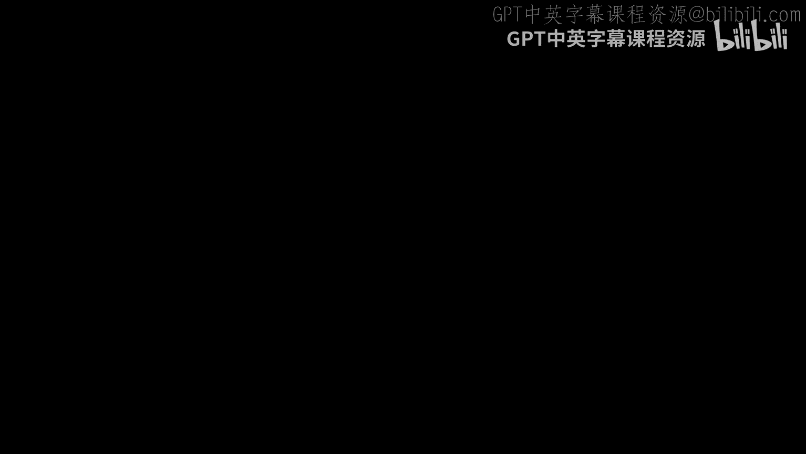

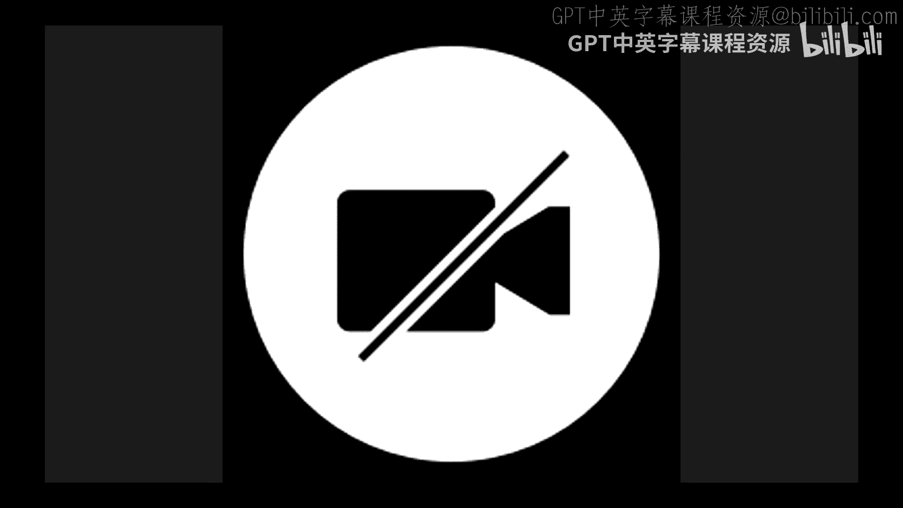

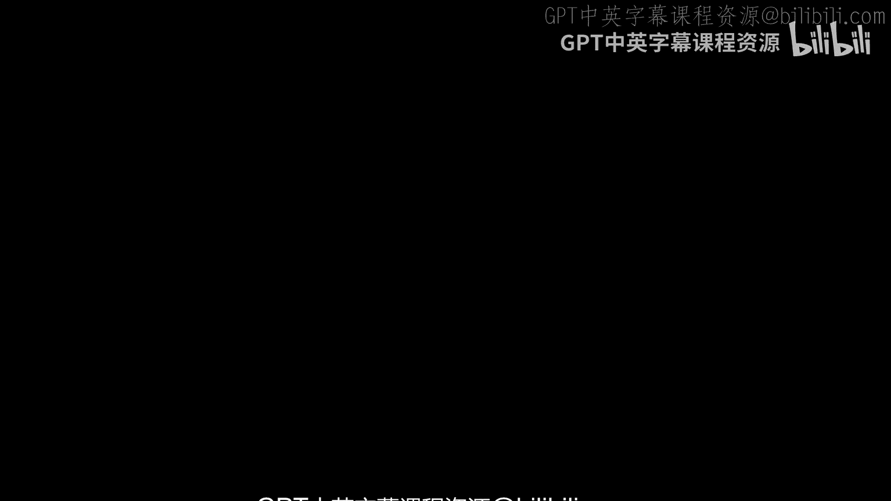

在本节课中，我们将对本学期的学习内容进行回顾，并展望CS 88课程之后的学习路径与机会。我们将涵盖课程要点、未来课程选择建议以及如何继续提升编程技能。

---

## 课程回顾：我们学到了什么？ 📚

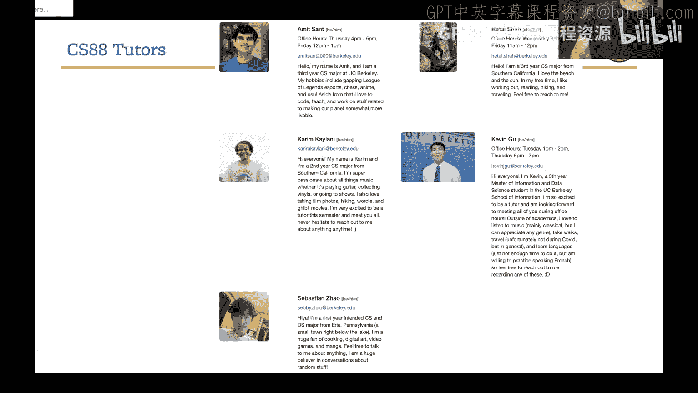

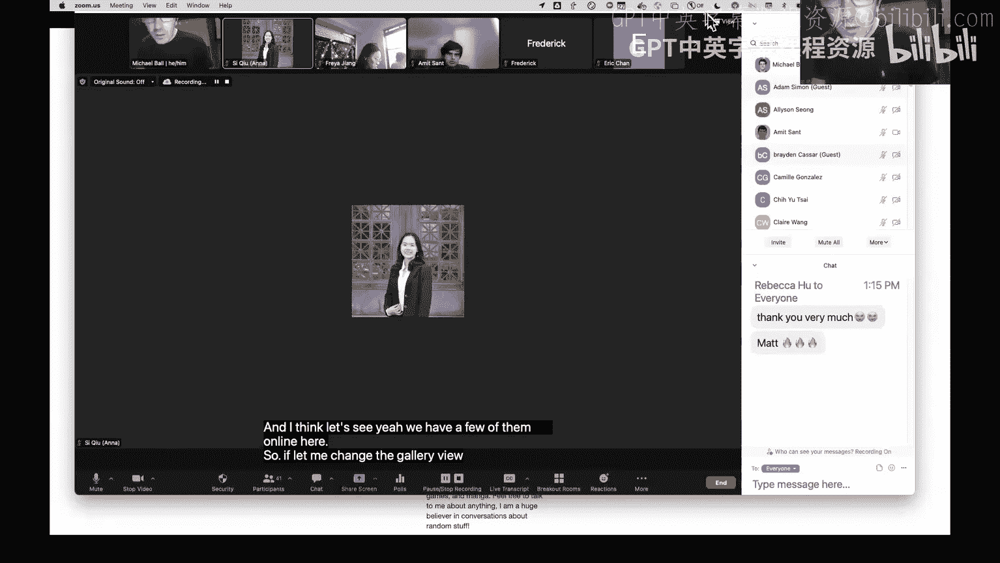

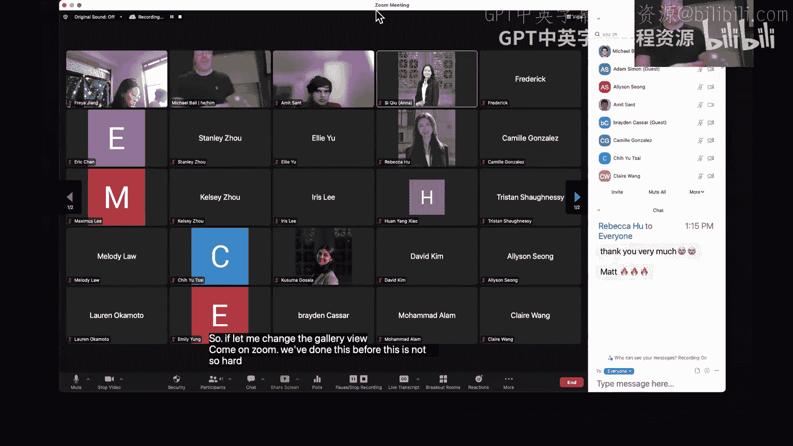

上一节我们介绍了课程的基本信息。本节中，我们来回顾本学期所涵盖的核心计算概念。

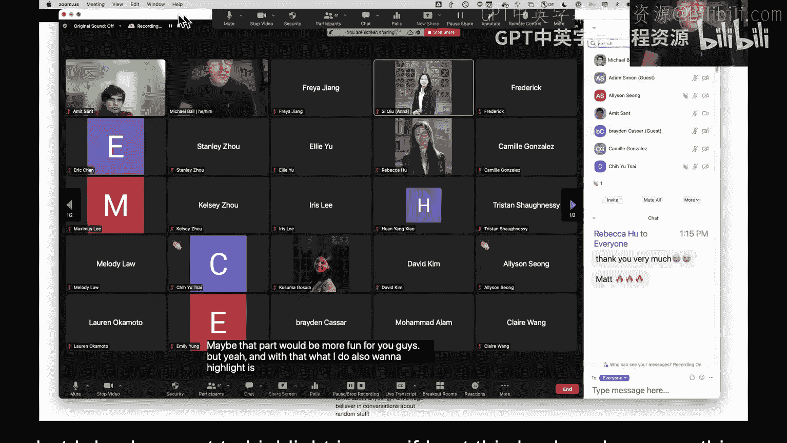

CS 88不仅教授Python语言，更重要的是教授如何通过**抽象**来构建和分解问题。课程中的所有主题都围绕着使用抽象来解决问题。

以下是本学期涵盖的主要主题列表：
*   **数据与表达式**：数据类型、表达式、函数调用、变量与赋值语句。
*   **数据结构**：元组、列表、序列、字典。
*   **程序控制**：函数定义、条件语句、迭代、`while`循环、列表推导式。
*   **高阶抽象**：Lambda表达式、高阶函数（将函数作为参数或返回值）、`map`、`filter`、`reduce`等模式。
*   **递归与复杂结构**：递归、树结构上的递归。
*   **面向对象与设计**：抽象数据类型、可变性、面向对象编程、继承、异常处理。
*   **迭代器与生成器**：构建迭代器和生成器。
*   **新语言**：结构化查询语言（SQL）。

这个列表展示了课程内容的广度，体现了伯克利课程一贯的深度与强度。

---

## 未来之路：CS 88之后学什么？ 🛣️

了解了我们已掌握的知识后，本节我们来看看在伯克利有哪些后续的学习方向。

对于考虑数据科学方向的同学，最自然的下一步是学习**CS 61B**课程。这门课是数据科学和计算机科学专业的共同要求。数据科学主修/辅修是一个真正跨学科的项目，它不仅结合了计算机科学和统计学，还涉及经济学、物理学、历史学等多个领域，并包含人文背景与伦理要求。

以下是在数据科学路径上可以探索的课程：
*   **核心课程**：Data 100（CS 88和Data 8之后的自然衔接）、Data 101（数据工程新课程）、Data 102/103/104（统计学与伦理课程）。
*   **连接课程**：在修完Data 8后，可以随时选修连接课程（如Data 88E, Stat 88），将编程应用于不同领域。
*   **信息学院课程**：例如INFO C103（信息的历史），探讨从语言到互联网的信息系统演变。
*   **计算机科学高阶课程**：在修完CS 61B后，可以探索计算机安全、操作系统、人机交互等课程。
*   **其他选择**：CS 1**9**5（计算的社会影响）、电气工程与计算机科学（EECS）硬件相关课程、以及众多学生主导的Decal课程。

---

## 实践探索：用Python还能做什么？ 🚀

除了学术课程，本节我们来看看如何利用现有的Python技能进行自主实践和项目开发。

通过一些自学（如谷歌搜索、观看教程），你已具备探索以下有趣领域的基础：
*   **网站后端开发**：构建能连接数据库的网站。
*   **网络爬虫**：使用如`Beautiful Soup`等库程序化地抓取和解析网页内容。
*   **自然语言处理**：从文本中提取意义。
*   **数据分析与机器学习**：应用于研究或实际问题。
*   **科学计算**：解决科学研究中的计算问题。
*   **游戏开发**：使用Python库构建游戏。
*   **数据可视化**：生成图表和图形。

这些领域都有丰富的库和工具支持，是应用和深化编程技能的绝佳途径。

---

## 问答与建议 💡

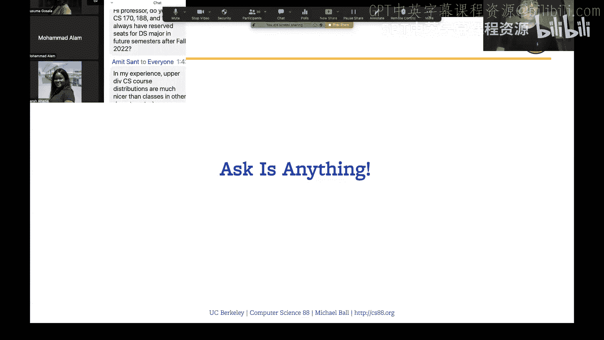

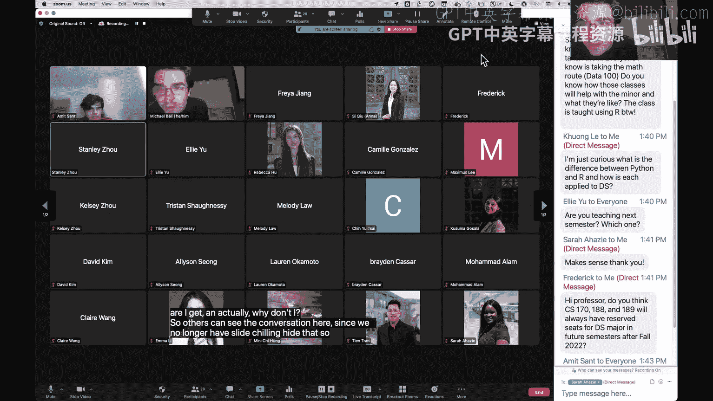

在最后的问答环节，讲师针对学生的问题提供了具体建议。

关于**课程选择**，对于在Data 100和CS 61B之间犹豫的同学，建议是：若对编程信心稍弱，可先选Data 100以保持在Python环境中；若已有学习伙伴，结伴选课可能是更重要的决定因素。

关于**准备CS 61B**，建议在开学前几周预习Java语言，尝试用Java重写一些CS 88的作业题目，并重视组建学习小组。

关于**成为课程助教**，成绩（通常要求A-或以上）是基本门槛，但更看重的是帮助学生的意愿、持续学习的能力以及参与课程社区（如担任辅导员、学术实习生）的经验。

关于**编程语言**，Python和R在数据科学中都很流行。Python生态庞大、资源丰富；R则为统计计算原生设计。掌握两者都是宝贵的技能。

---

## 总结与致谢 🙏

本节课中，我们一起回顾了CS 88学期所学的广泛的计算结构和抽象思想，展望了在数据科学、计算机科学及其他领域的后续学习路径，并探讨了利用Python技能进行实践探索的可能性。

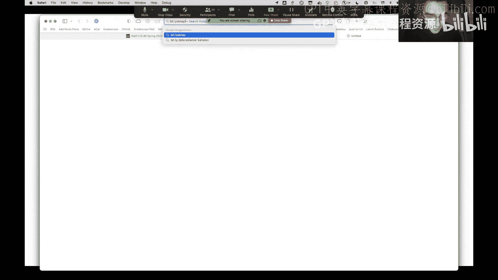

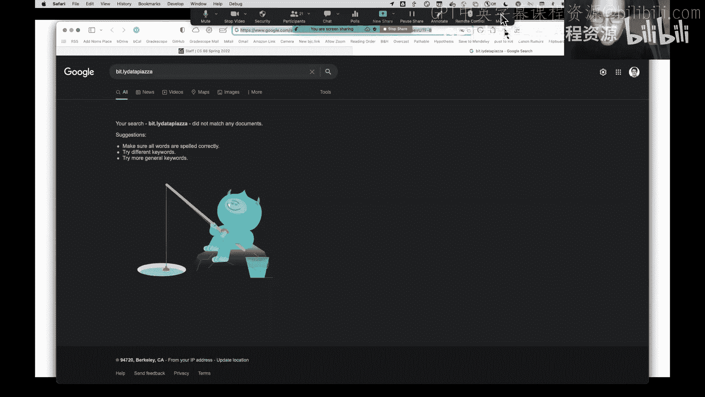

最后，衷心感谢所有课程助教、辅导员和学术实习生，是他们的辛勤工作使这门课程得以顺利运行。也感谢所有学生的参与和包容。祝大家在期末考试中好运，并享受接下来的假期。

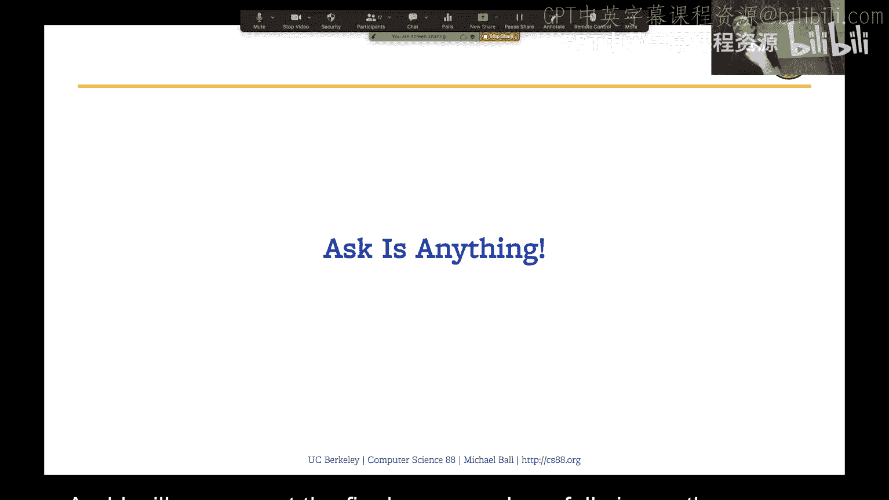

**记住，编程是一项可以通过不断实践而持续增长的技能。保持好奇心，继续构建，继续探索。**