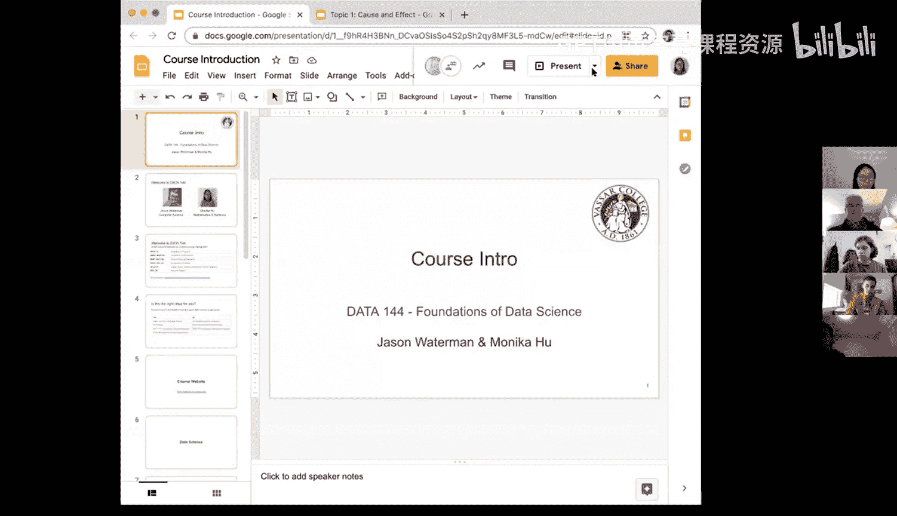
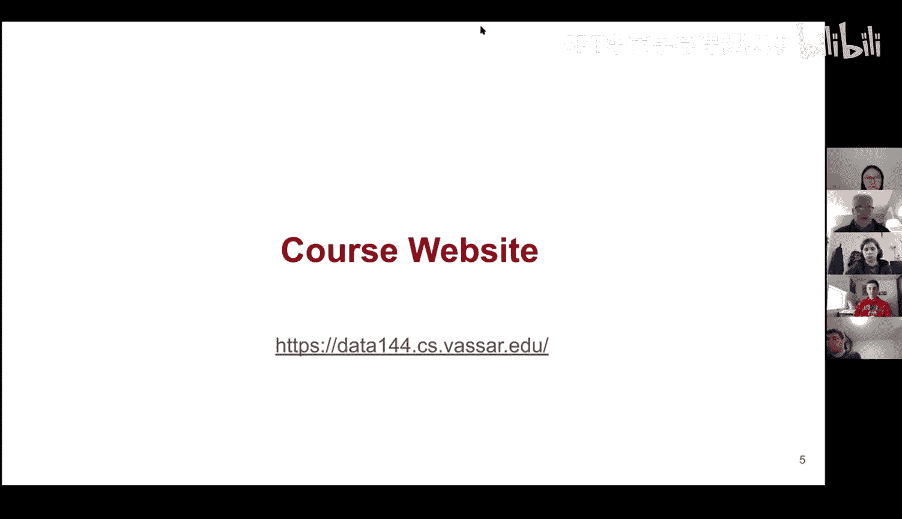
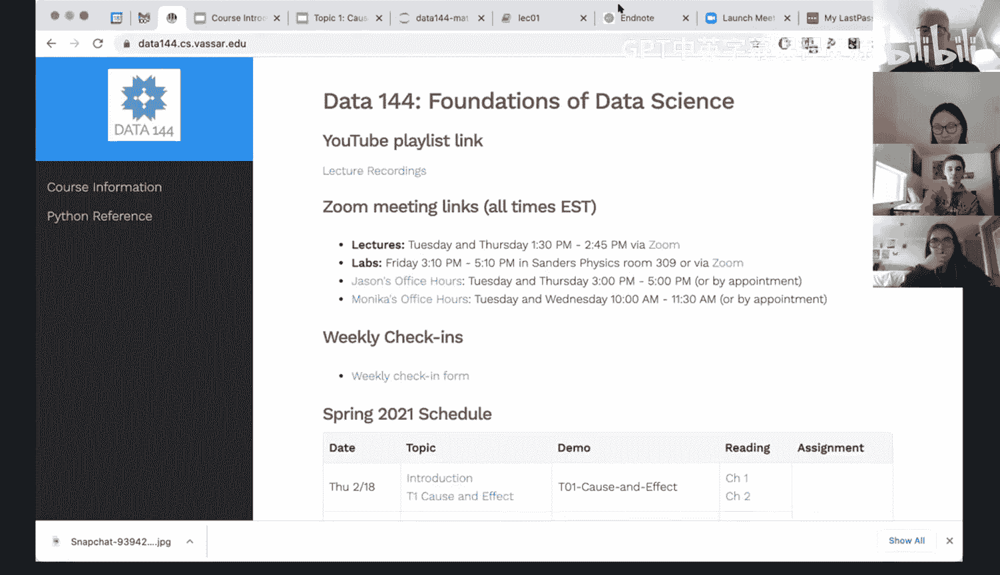
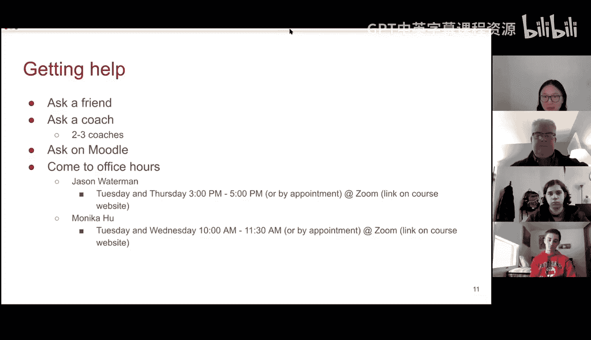
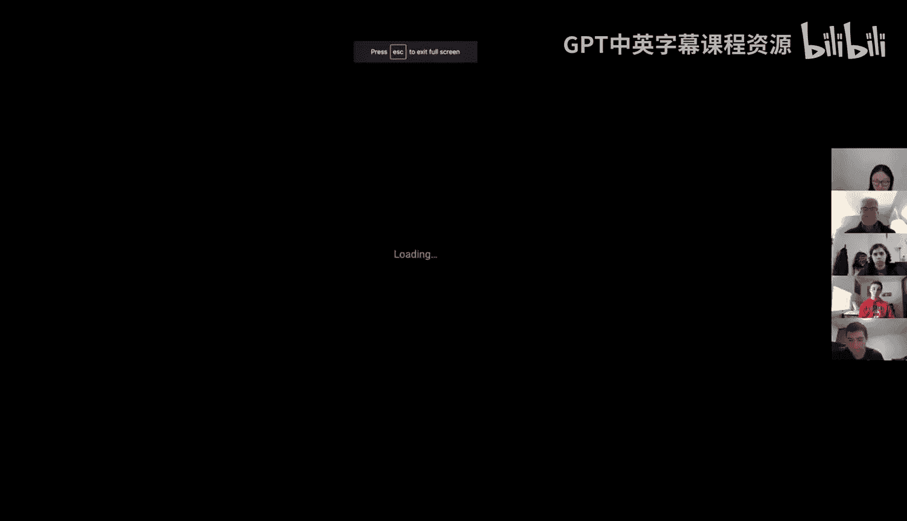
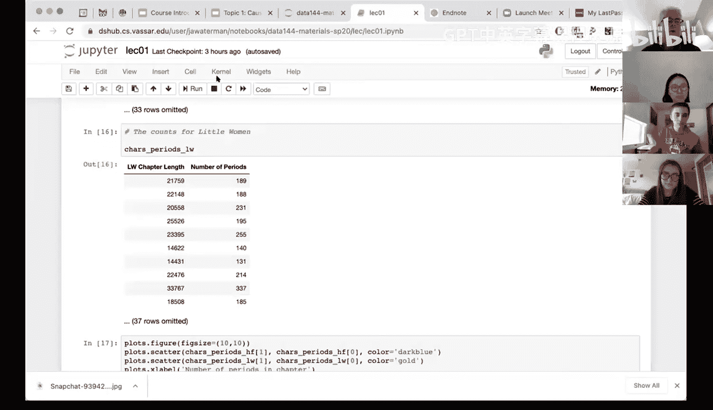
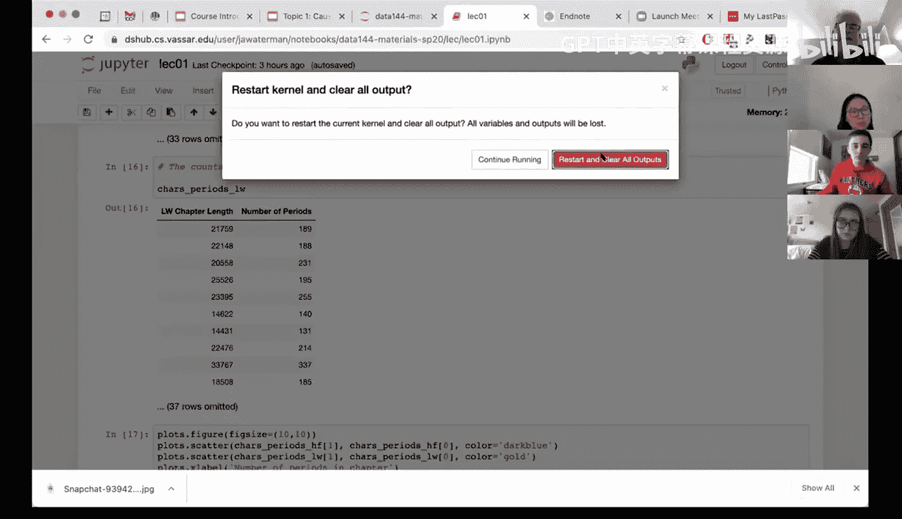
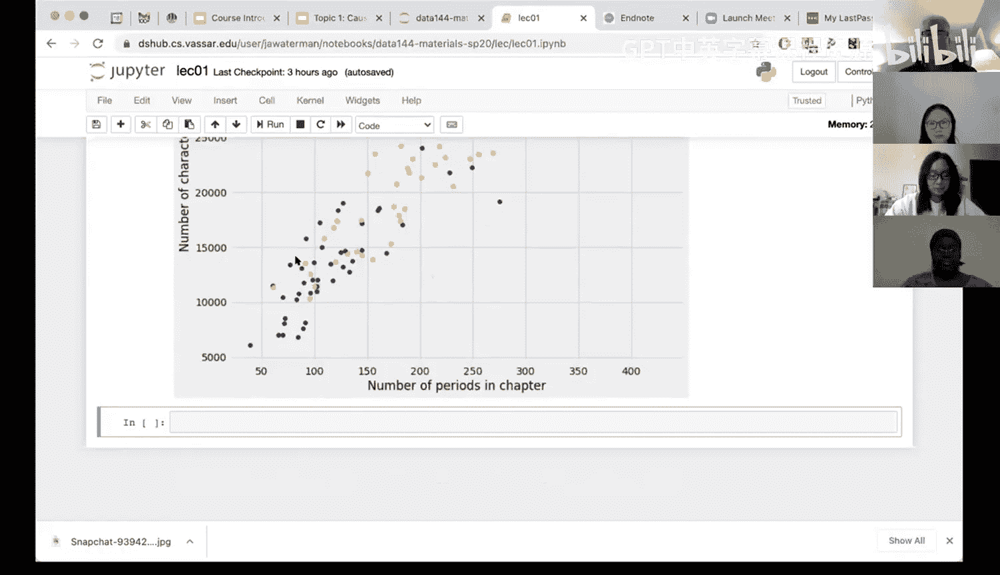

# 1：课程介绍




在本节课中，我们将介绍DATA 144《数据挖掘与分析》课程的整体结构、教学目标以及核心概念，并通过一个简单的数据分析演示，让大家对数据科学有一个直观的认识。

---

## 课程概述与教师介绍

本课程是DATA 144，由计算机科学系与数学与统计系联合开设。

我是Jason Waterman，是计算机科学系的助理教授。我的研究领域是云计算和虚拟机，主要关注云环境中虚拟机的安全性与效率。



我是Monica，在数学与统计系工作。我的研究方向是从统计学角度出发的数据隐私与数据保密性。

我们两人于2015年同时加入瓦萨学院，并共同担任本课程的讲师。

---

## 课程背景与定位

本课程是HHMI“气候变化”重大挑战项目的一部分，这是我们第二次开设此课程。



我们希望通过以下列表，帮助你判断本课程是否适合你：
*   **适合选课的情况**：本课程没有先修要求。如果你没有相关经验，本课程非常适合你。如果你已修过COMP 101、AP统计学、MATH 141或PSYC 200等课程，虽然内容有部分重叠，但你仍能学到很多新知识。
*   **可能不适合选课的情况**：如果你已修过MATH 240、MATH 242或暑期数据科学入门课程（INDEP 103/183），课程内容可能会有过多重叠，我们建议你选择其他课程。

如果你对自己的情况有任何疑问，请随时联系我们进行个别讨论。

---

## 课程网站与资源

课程网站是所有课程相关信息的中心。以下是网站的主要组成部分：
*   **课程安排与幻灯片**：课程时间表和每次讲座的幻灯片都会提前发布在网站上。
*   **实时演示**：许多课程会包含现场代码演示，我们将使用Jupyter Notebook进行。
*   **教材**：我们将使用一本优秀的免费在线教材，它来自加州大学伯克利分校的数据科学项目，内容经过充分验证且实例丰富。
*   **作业与链接**：所有作业、Zoom讲座链接、办公室时间链接都会在网站上公布。
*   **本科生助教**：我们有一组上过此课程的本科生助教，他们将在实验课和办公室时间为大家提供帮助。

我们主要使用课程网站来发布信息，可能不会使用Moodle。

---

## 什么是数据科学？🔍

我们将数据科学定义为：**使用计算从数据中得出有用的结论**。

数据科学包含三个重要方面：
1.  **探索**：这通常涉及数据可视化。在获得数据后，你需要开始识别数据集中的信息模式，最常用的方法就是数据可视化。我们将通过Python及相关库教你多种可视化方法。
2.  **推断**：这通常指统计推断，即基于已有数据量化已发现的模式是否可靠。我们将大量使用一种称为“随机化”的技术进行推断，这同样依赖于计算。
3.  **预测**：在探索和推断之后，我们利用已知信息进行预测，即做出有根据的猜测。根据课程进度，我们可能会涉及机器学习的预测方法，也会包括更传统的预测方式。

这三个方面可以看作是递进关系，但在实际数据科学工作中，你需要同时考虑并协同推进它们。

---

## 后续学习路径

数据科学是一个新兴且重要的跨学科领域。我们希望这门课是瓦萨学院数据科学相关课程体系的第一步。

以下是相关课程的列表，供你参考：
*   **计算机科学方向**：如果你对计算机科学感兴趣，COMP 101是很好的下一步选择。我们也在与计算机科学系讨论在课程体系中融入更多数据科学内容。
*   **数学与统计方向**：我们已有完善的统计课程体系。完成本课程后，你可以考虑MATH 240（统计学导论，使用R语言），然后是MATH 242（应用统计建模）。如果你对推断方面特别感兴趣，可以选择MATH 241（概率论），之后可以选修300级别的统计课程。
*   **其他院系课程**：生物学、认知科学、经济学等院系也开设了许多相关课程。

我们正在与多个院系进行更广泛的讨论，以期开设更多面向更广泛背景学生的跨学科数据科学课程。

---

## 课程结构与要求

接下来，我们详细介绍本课程的各个组成部分。





**讲座**
*   讲座将于每周二和周四下午通过Zoom直播进行。
*   讲座是互动式的，我们会穿插使用幻灯片讲解概念和在Jupyter Notebook中进行代码演示。

**实验课**
*   每周五下午3:10至5:10进行实验课。
*   我们同时提供线下和线上实验课选项，内容相同。Jason负责线下，Monica负责线上，双方均有助教协助。

**作业**
*   课程前半段每周有作业，需使用Jupyter Notebook完成。
*   我们鼓励你利用办公室时间、助教时间以及在实验课中讨论作业问题。协作受到鼓励，但需独立提交作业。

**每周反馈表**
*   我们新增了一个每周反馈的Google表单，链接在课程网站首页。
*   请每周日午夜前完成。它不计入成绩，但能帮助我们了解你的学习情况并及时解决问题。

**个人项目**
*   有两个个人项目，可视为开卷考试。要求独立完成，不得与他人讨论或向助教提问（可向讲师询问澄清性问题）。

**期末项目**
*   期末项目将以三人小组形式进行。我们将提供可选数据集列表，并指导你们完成项目提案、实施和最终展示。这是对学期所学知识的综合应用。





---

## 如何获取帮助

我们强烈鼓励你通过以下方式获取帮助：
*   **询问同学**：与同伴讨论。
*   **使用Slack**：在课程Slack频道中提问。
*   **参加办公室时间**：参加讲师或助教的办公室时间。

在远程教学环境下，我们需要更主动地建立联系。请充分利用Slack频道建立学习社区，并积极与讲师和同学沟通。提前考虑并组建期末项目小组也将使学习过程更高效。

---

## 课程政策与协作

课程政策详情请参阅课程网站上的“课程信息”页面。我们强调以下几点：
*   **鼓励协作与提问**：除了个人项目，我们鼓励在所有环节（课堂问题、实验、作业）进行讨论和提问。
*   **作业反馈**：许多作业设置了自动评分，以便你即时获得反馈，了解是否掌握了正确方向。
*   **协作界限**：协作的底线是禁止直接复制他人的代码或答案。请运用常识判断，如果你觉得某种做法不妥，那很可能就是不当的。

---

## 技术演示：初识数据科学 🚀

上一节我们介绍了课程要求，本节中我们通过一个简单的演示，让大家感受数据科学的魅力。我们将在明天的实验课中深入讲解这些工具。

我们将使用 **Jupyter Notebook** 和 **Python** 语言。Jupyter Notebook允许你在浏览器中编写和运行代码，无需复杂安装。Python是当前数据科学领域最流行的编程语言之一。

以下是一个快速演示，分析两本书籍的文本数据：

**1. 读取数据**
我们使用几行代码从古登堡计划网站读取《哈克贝利·费恩历险记》和《小妇人》的全文，并将其按章节分割。这个过程在不到一秒内完成。

**2. 数据整理与查询**
我们可以轻松查询特定词汇的出现频率。例如，查找“Tom”在《哈克贝利·费恩历险记》各章节的出现次数：
```python
# 示例代码：统计名字“Tom”在各章节的出现次数
tom_counts = np.array([chapter.count('Tom') for chapter in huck_finn_chapters])
```
同样，我们可以快速统计“Jim”的出现次数，并将结果整理成表格以便比较。

**3. 数据可视化**
通过数据科学库，我们可以用很少的代码将数据可视化。例如，绘制各角色名字随章节累积出现次数的折线图：
```python
# 示例代码：绘制累积出现次数图
cumulative_tom = np.cumsum(tom_counts)
# ... 绘图代码
```
通过图表，我们可以直观地看到角色出场模式的差异（例如，叙述者“Huck”自己的名字被提及的次数反而最少），甚至可以对未读过的故事内容进行推测（例如，在《小妇人》中，通过名字出现频率的模式猜测Laurie最终与哪位姐妹结婚）。

**4. 跨数据源分析**
我们还可以整合不同数据源进行分析。例如，比较两本书中每章的字符数与句号数量的关系，并通过散点图可视化：
```python
# 示例代码：创建字符数与句号数的散点图
# ... 数据处理与绘图代码
```
从散点图中，我们可以观察到章节长度与句子数量之间存在大致线性的关系，并能直观对比两本书的章节特点。

这个演示展示了如何通过少量代码，完成数据加载、清理、分析和可视化的完整流程，这正是本课程将教会你的核心技能。

---

## 总结

本节课中，我们一起学习了DATA 144课程的基本框架。我们了解了课程的目标是教授如何**使用计算从数据中得出有用结论**，涵盖了**探索、推断和预测**三个核心方面。我们介绍了课程结构、资源获取方式、协作政策，并通过一个生动的文本分析演示，让大家对数据科学的力量有了初步的直观感受。



在接下来的课程中，我们将从基础开始，逐步深入这些主题。请大家准备好参加明天的实验课，我们将亲手开始使用Jupyter Notebook和Python。