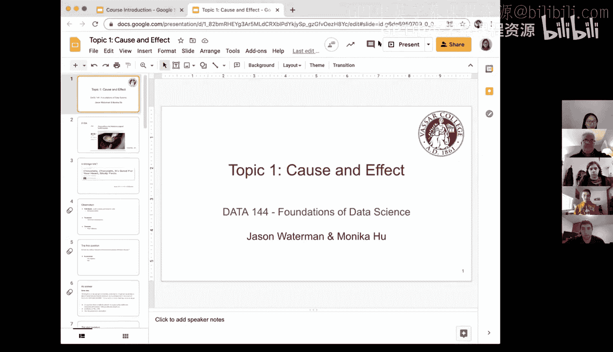
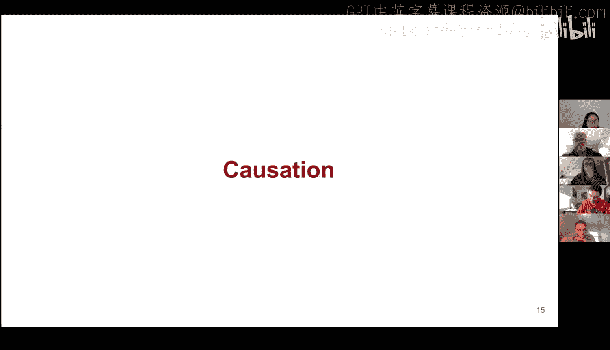

# 2：因果关系与关联

在本节课中，我们将学习数据分析中两个核心但截然不同的概念：**关联**与**因果关系**。理解它们的区别对于正确解读数据、避免常见误区至关重要。

---

## 关联：事物之间的联系

上一节我们介绍了课程的基本框架，本节中我们来看看数据分析中最基础的关系类型：关联。

关联描述的是两个或多个变量之间存在某种联系或模式。它只说明它们“一起变化”，但**不指明一个变量是否导致另一个变量发生变化**。在新闻报道中，常用“与...有关”、“链接到”等词语描述关联。

以下是两个体现关联关系的新闻标题示例：
*   《卫报》报道：“每日三杯咖啡与一系列健康益处有关。”
*   另一项研究称：“研究发现巧克力有益心脏健康。”

在这些表述中，我们只能推断“咖啡/巧克力”与“健康”之间存在某种联系，但无法确定是前者直接导致了后者。

---

## 核心概念定义

在深入探讨之前，我们需要明确几个基础术语。

**观测对象**：指研究中的个体单元，可以是人、家庭、班级等。在巧克力研究中，观测对象是“欧洲成年人”。

**处理**：指研究中施加的干预或条件。在巧克力研究中，“处理”是“摄入巧克力”。接受处理的组称为**处理组**，未接受的称为**对照组**。

**结果**：指我们关注并测量的变量。在上述研究中，结果是“是否患有心脏病”。

---

## 从数据看关联

让我们基于一项具体研究的数据来审视关联。一项关于巧克力的研究发现：

> 在巧克力摄入量最高的人群中，有12%在研究期间患上或死于心血管疾病；而在不吃巧克力的人群中，这一比例为17.4%。

基于这组数据，我们提出第一个问题：**你认为巧克力摄入与心脏病之间存在关系吗？**

以下是分析思路：
1.  我们观察到两个比例存在差异：12% 与 17.4%。
2.  这个差异表明，巧克力摄入量不同的群体，心脏病发生率也不同。
3.  因此，数据**支持两者之间存在关联**。摄入巧克力更多的人群，心脏病发生率似乎更低。

然而，这**仅能证明关联**，不能证明因果关系。我们不知道是吃巧克力降低了心脏病风险，还是心脏更健康的人更倾向于吃巧克力，亦或是存在其他共同因素（如收入、整体饮食结构）同时影响了巧克力消费和心脏病风险。

---

## 因果关系：更难回答的问题

认识到关联存在后，我们自然会问第二个、也是更困难的问题：**巧克力摄入是否导致了心脏病风险的降低？**

这就是**因果关系**问题。它要求证明一个变量（原因）的变化直接引发了另一个变量（结果）的变化。要确立因果关系，需要更严谨的研究设计（如随机对照实验）和更充分的证据，以排除其他可能的解释。

研究原文中也谨慎地指出：“该研究并未证明巧克力与降低心脏病和中风风险之间存在因果关系。”这正体现了从关联推断因果的挑战。

---

## 案例分析：约翰·斯诺与霍乱

历史上一个著名的例子完美诠释了从关联推断因果的过程。1854年，伦敦霍乱爆发，当时主流观点认为“瘴气”（恶臭空气）是病因。

医生约翰·斯诺采取了数据科学的方法。他将伦敦苏荷区的霍乱死亡病例标注在地图上。

通过观察地图，他发现死亡病例高度聚集在**宽街水泵**周围。这揭示了**死亡地点与水泵位置之间存在强烈的空间关联**。

基于这一关联，他提出了一个假设：病因可能来自受污染的水，而非空气。随后，他说服当局移除了水泵的把手，切断了水源，该地区的霍乱病例果然大幅下降。

这个干预结果加强了因果关系的证据，但单凭此事后观察仍非最严谨的因果证明。在下节课中，我们将继续探讨斯诺如何通过更精细的调查（例如，比较从不同水源取水的群体）来进一步确立因果关系。

---

## 总结

本节课中我们一起学习了：
1.  **关联**与**因果关系**是数据分析中两种根本不同的关系。关联指变量间存在联系，因果则指一个变量直接导致另一个变量变化。
2.  新闻报道常混淆两者，使用暗示因果的语言描述仅有关联的发现。
3.  确立因果关系远比证明关联困难，需要更严格的研究设计来排除其他解释。
4.  约翰·斯诺的霍乱地图研究是历史上通过数据发现关联，进而探索因果关系的经典案例。

理解这一区别是成为严谨数据科学家的第一步。在接下来的课程中，我们将学习如何设计研究和分析数据，以恰当地识别关联并推断因果。