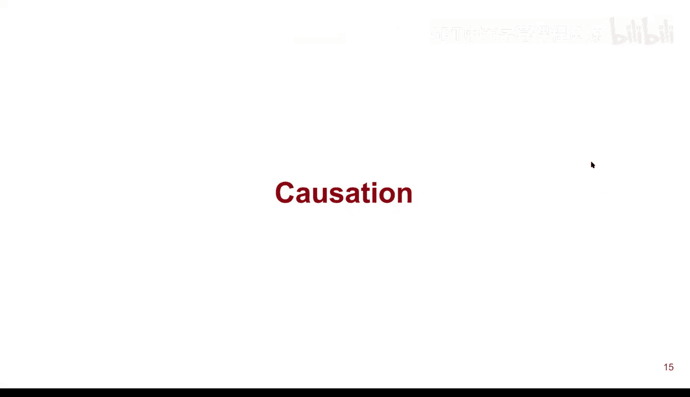
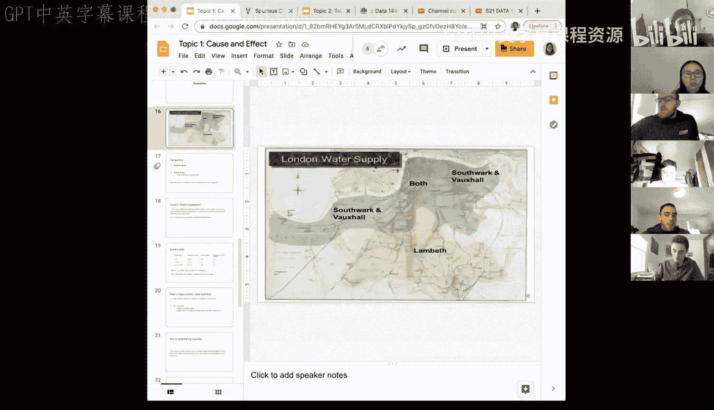
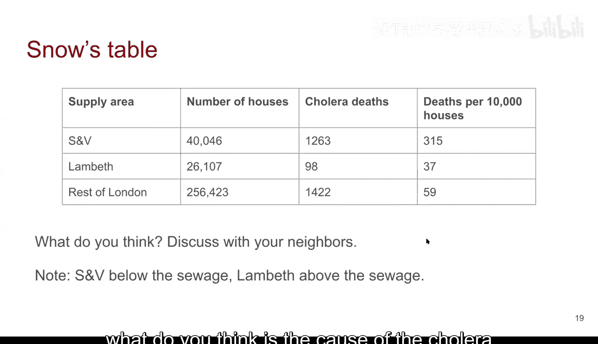
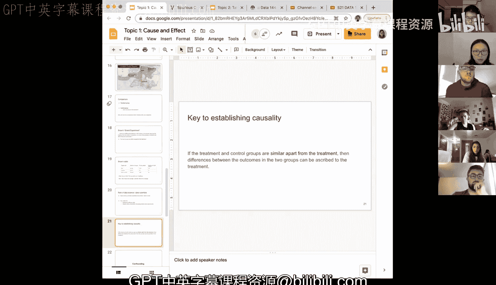

# 3：因果关系与实验设计 🔬

在本节课中，我们将继续学习“因果关系”这一主题。上一节我们介绍了约翰·斯诺通过地图上的死亡计数发现了霍乱与水源的关联。然而，关联不等于因果。本节我们将探讨斯诺如何通过一项巧妙的研究设计，最终确立了水源是导致霍乱的**原因**。

---

## 伦敦供水地图与自然实验 🗺️

上一节我们提到，斯诺怀疑霍乱与水源有关。为了验证这一点，他研究了伦敦的供水系统。下图展示了当时伦敦的供水情况：

伦敦有两家主要的供水公司：
*   **南华克与沃克斯霍尔公司**：简称S&V，其取水口位于城市**污水排放口的下游**。
*   **兰贝斯公司**：其取水口位于城市**污水排放口的上游**。

地图上有一个关键区域被标记为“Both”（两者皆有）。这个区域的住户情况特殊：**有些家庭由S&V公司供水，有些则由兰贝斯公司供水**。

为了建立因果关系，我们需要进行比较实验，就像上节课讨论巧克力和心脏病的例子一样。我们需要一个**处理组**（接受某种“处理”）和一个**控制组**（不接受该处理），然后比较两组的结局。

现在，请思考一个问题：基于这张地图，如果你想比较不同水源对霍乱的影响，你应该选择哪个区域的住户进行比较？为什么？

---

## 选择“Both”区域进行比较的原因 🎯

答案是选择 **“Both”（两者皆有）** 区域。原因如下：

在“Both”区域内，住户们共享几乎相同的居住环境、食物供应和其他生活条件。他们之间的**主要区别只有一个：供水公司不同**（即水源不同）。这完美地满足了一个良好实验设计的关键原则：

> 处理组和控制组应该在所有方面都相似，**除了**是否接受处理（在本例中是水源）这一点。

斯诺在他的报告中写道：“这两组房屋或居民在接收两家公司的供水方面，或在他们所处的任何物理条件上，**都没有任何差异**。” 这意味着他成功“控制”了其他可能的影响因素，使得水源成为唯一被系统改变的因素。

---

## 数据分析与结论 📊

基于“Both”区域的数据，斯诺制作了如下表格进行比较：

| 供水区域 | 房屋数量 | 霍乱死亡数 | **每万房屋死亡数** |
| :--- | :--- | :--- | :--- |
| S&V公司 | 40,046 | 1,263 | **315** |
| 兰贝斯公司 | 26,107 | 98 | **37** |
| 伦敦其他区域 | 256,423 | 1,422 | **59** |

**注意**：为了公平比较规模不同的群体，我们关注的是**每万房屋死亡数**这个比率。

以下是数据分析的核心步骤：
1.  **控制变量**：我们已经确定，“Both”区域内的S&V用户和兰贝斯用户在其他条件上基本一致。
2.  **比较结果**：S&V用户的死亡率为**315**，而兰贝斯用户的死亡率仅为**37**，前者是后者的近10倍。
3.  **推断因果**：由于两组唯一的系统差异是水源（S&V取水于污水下游，兰贝斯取水于污水上游），那么死亡率的巨大差异只能归因于**水源**。数据强有力地表明，被污水污染的水源（S&V供水）导致了霍乱。

---

## 数据科学家的角色与总结 💡

通过这个案例，我们可以看到数据科学和数据分析师的两个关键角色：

1.  **知道观察什么**：斯诺的智慧在于，他知道应该聚焦于“Both”区域进行分析，因为只有这里能提供一个近乎完美的自然实验场景。在其他区域，我们无法有效控制其他变量的干扰。
2.  **参与研究设计**：虽然斯诺的研究是一个“自然实验”，但在现代数据科学中，分析师常常需要**主动设计实验或观察性研究**，以确保收集到的数据能够用于有效的因果推断。

**本节课总结**：
我们一起学习了如何从关联推断到因果。关键在于设计或找到一个场景，使得**处理组和控制组尽可能相似，仅在接受的处理上不同**。在这种情况下，观察到的结果差异才能被可靠地归因于处理本身。约翰·斯诺对伦敦霍乱的研究是历史上利用这种逻辑确立因果关系的经典范例。