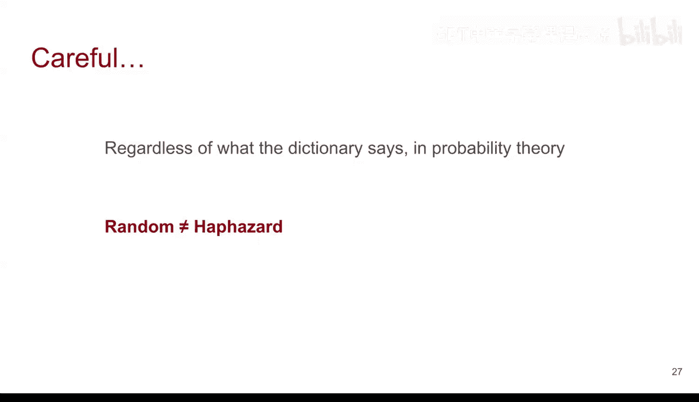

# 4：因果关系与混杂变量

在本节课中，我们将学习如何确保实验中的处理组和对照组具有可比性，并深入探讨一个关键概念——混杂变量。我们将了解混杂变量如何干扰因果关系的判断，以及如何通过随机化设计实验来避免这一问题。

## 混杂变量：干扰因果判断的“第三者”

上一节我们讨论了确保处理组与对照组特征一致的重要性。本节中，我们来看看如果未能控制这些特征，可能会遇到什么问题。

当处理组和对照组之间存在除处理本身之外的**系统性差异**时，就会出现问题。例如，在之前的水源供应例子中，如果SMV地区的家庭不仅从SMV获得水源，还从一个特定的供应商处购买肉类；而Lambmbeth地区的家庭则从另一个供应商处购买肉类。这就是系统性差异，意味着两组之间存在其他系统性的不同特征。

在这种情况下，很难确定真正的因果关系。然而，这种差异在**观察性研究**中经常出现。观察性研究是指研究者不进行任何控制，仅进行观察的研究。在这些情况下，我们无法建立因果关系，最多只能确定关联性。更重要的是，这些混杂因素不仅影响观察性研究，也会影响旨在确定因果关系的实验研究。因此，我们必须确保在实验中，除了处理本身，处理组和对照组没有其他系统性差异。

## 一个经典的混杂案例：冰淇淋与谋杀案

让我展示一个例子，你可能会对这两者为何如此相关感到困惑。

下图将冰淇淋销量和谋杀案数量放在同一尺度上进行比较（时间跨度为5月至7月）。仅看此图，你可能会说两者高度相关或具有强关联性。

但如果你试图找出原因，或判断是谋杀案导致冰淇淋销量增加，还是反之，可能会感到困惑。因为这并不直观。实际上，另一个变量——**温度**——可能是一个混杂变量。温度既与冰淇淋销量相关，也与谋杀案数量相关。但如果你像我们现在这样，只关注冰淇淋和谋杀案的关系图，就会误以为两者直接相关，而实际上它们可能只是都与温度相关，彼此之间并无必然联系。这就是我们所说的**混杂**。

## 虚假相关性的世界

有一个非常有趣的网站，我鼓励你去看看，它展示了各种虚假相关性。人们找出了许多有趣但可能毫无意义的关联结果。

该网站展示了所谓的**相关系数**（我们将在后续课程中学习）。其核心思想是，如果你有两个变量，可以计算它们之间的相关系数。系数越接近1，表示正相关性越强。

以下是该网站展示的一些虚假相关性示例：

*   **美国在科学、太空和技术上的支出** 与 **因上吊、勒颈和窒息导致的自杀人数** 相关，相关系数高达99.79%。
*   **淹死在游泳池中的人数** 与 **尼古拉斯·凯奇出演的电影数量** 相关（时间跨度为1999年至2009年）。

很多时候，我们收集数据并希望展示其模式。但如果不确保没有混杂变量存在，你所看到的结果可能并非真实情况。这是一个重要的教训。

## 解决方案：随机化控制实验

最后，再次强调，我们如何确保消除这些系统性差异呢？

你可以做的是**随机化**。想象一下，我们正处于设计实验或研究的阶段。如果你能够将个体**随机分配**到处理组和对照组，那么这两组除了处理之外，很可能在其他所有方面都非常相似。

其推理逻辑是：如果我们在对处理组施加处理之前，能够将个体随机分配到两组中，那么这两组在其他任何方面都高度相似的可能性就大大增加。唯一的区别是，一组之后会接受处理，另一组则不会。

这是建立因果关系的**关键**。在这种情况下，我们能够从数学上解释分配中的变异性。我们称这种实验为**随机化控制实验**。

*   **“随机化”** 指的是我们进行随机分配。
*   **“控制”** 一词主要指我们能够控制处理组和对照组之间除处理本身之外的其他特征。

在本课程后续部分，你将看到如何使用Python编程来帮助我们随机将个体或受试者分配到不同组中，然后进行类似于斯诺的霍乱实验中那样的比较。

请务必小心，“随机”这个词在数据科学和统计学领域有特定含义。它并不意味着随意或胡乱安排，而是指一种无其他因素干扰的分配方式。Python编程将极大地帮助你实现这一点。

## 总结

本节课中，我们一起学习了：
1.  **混杂变量**：指那些与处理变量和结果变量都相关的变量，如果未被控制，会干扰对因果关系的判断。
2.  **虚假相关性**：两个变量之间表面上的关联，实际上是由一个共同的混杂变量引起的，而非直接的因果关系。
3.  **解决方案**：通过**随机化控制实验**，将受试者随机分配到处理组和对照组，可以最大程度地确保两组在除处理外的其他特征上相似，从而有效建立因果关系。