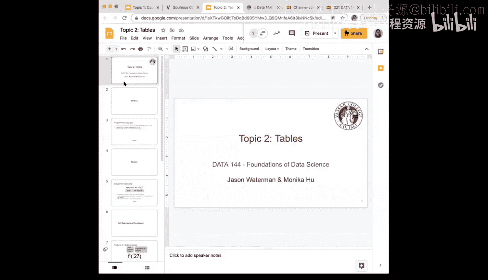
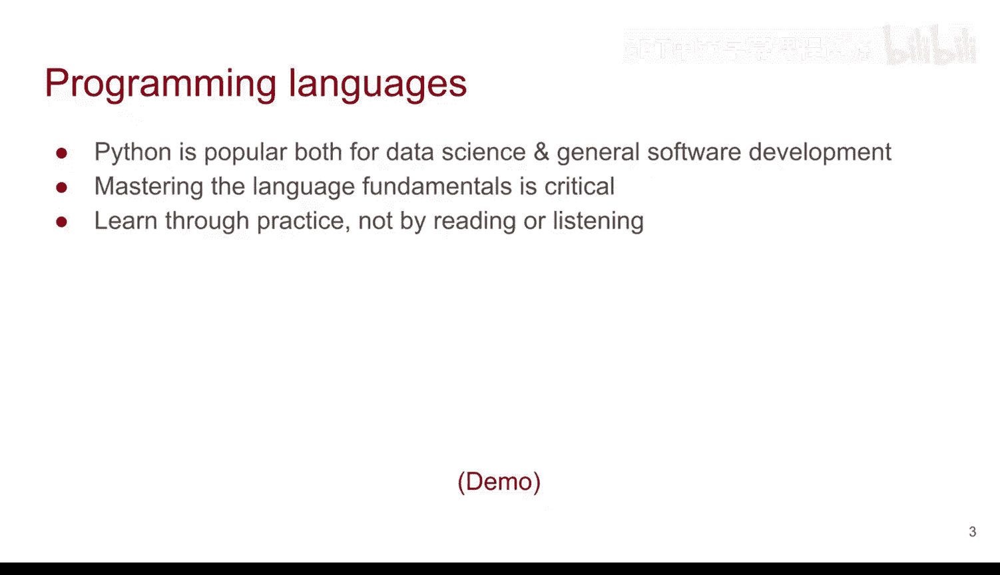
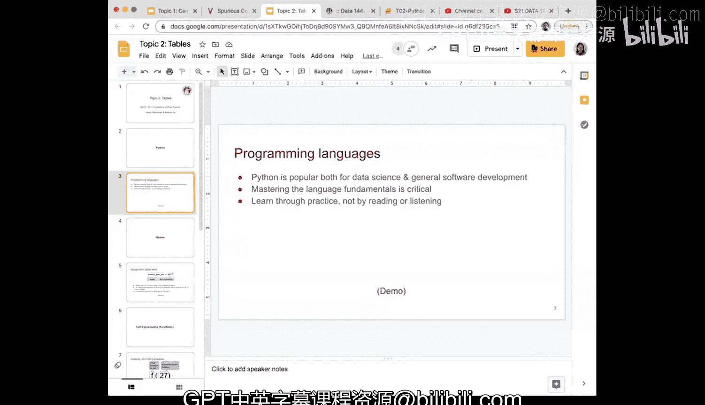

# 5：Python编程基础与Jupyter Notebook使用 🐍

在本节课中，我们将学习Python编程语言的基础知识以及如何在Jupyter Notebook环境中进行数据科学操作。课程内容涵盖Python的基本表达式、算术运算规则以及Jupyter Notebook的核心操作。我们将通过简单的示例和练习，帮助你快速掌握这些基础概念。

---

## Python编程语言概述

Python是一种当前非常流行的编程语言，尤其在数据科学领域。与R语言类似，Python是免费且开源的，这意味着任何人都可以编写并在线分享自己的软件包。这是开源编程语言日益流行和广泛应用的原因之一。Python不仅适用于数据科学和统计，也适用于通用软件开发。相比之下，R语言则主要专注于数据科学和统计领域。

我们希望你能够在本课程中尽快掌握Python语言的基础。后续你将能够学习更多高级功能。学习编程的最佳方式是通过实践，而不仅仅是阅读代码或听讲解。很多时候，从错误中学习同样重要。如果在学习过程中遇到问题，请随时提问。同时，那些具有挑战性的问题和错误也是宝贵的学习机会，能帮助你更好地理解Python。

随着编程越来越熟练，每个人都会形成自己的编程风格。有些人喜欢以特定方式编写函数，而另一些人则偏好其他方式。这没有绝对的对错或优劣之分。我们鼓励你通过练习，发展出自己感到舒适和喜欢的编程风格。

---

## Jupyter Notebook 环境与基本操作

上一节我们介绍了Python语言的基本情况，本节中我们来看看如何在Jupyter Notebook中进行实际操作。许多同学可能已经在实验课中接触过Jupyter Notebook，但为了确保术语和操作的一致性，我们仍然需要详细回顾一些关键主题。

首先，在进行任何操作之前，请务必运行第一步：加载本课程所需的数据科学库。这是一个重要的注意事项。

在Jupyter Notebook中运行单元格有两种主要方法：
1.  点击单元格上方的“运行”按钮。你会看到一个星号出现，运行完成后，单元格左侧会显示执行的序号。
2.  按下 `Shift + Enter` 组合键，这也会运行当前单元格。

你可以多次运行同一个单元格，其左侧的序号会相应增加。

---

## Python表达式与算术运算

现在，让我们进入Python表达式的学习。在接下来的演示中，我们将把Python当作一个高级计算器来使用。

以下是Python支持的基本算术运算示例：

*   **加法**：`2 + 3`
*   **减法**：`5 - 1`
*   **乘法**：`4 * 7`
*   **除法**：`10 / 2`

Python遵循标准的算术运算顺序规则，即乘法和除法优先于加法和减法。例如，在表达式 `2 + 3 * 4` 中，Python会先计算 `3 * 4`，得到12，然后再加2，最终结果为14。

你可以使用括号 `()` 来改变运算顺序。例如，`(2 + 3) * 4` 会先计算括号内的加法得到5，然后再乘以4，结果为20。

此外，Python使用双星号 `**` 来表示幂运算。例如，`2 ** 3` 表示2的3次方，计算结果为8。

通过这些示例可以看出，Python的运算方式非常灵活，其规则与你使用常规计算器或手算时遵循的规则是一致的。

---

## 总结

本节课中我们一起学习了Python编程语言的基础知识和Jupyter Notebook的基本操作。我们了解到Python在数据科学领域的重要性，并实践了如何将Python作为计算器进行基本的算术运算，包括加法、减法、乘法、除法和幂运算。同时，我们熟悉了Jupyter Notebook中运行代码单元格的两种方法。掌握这些基础是后续进行更复杂数据挖掘和分析任务的关键第一步。