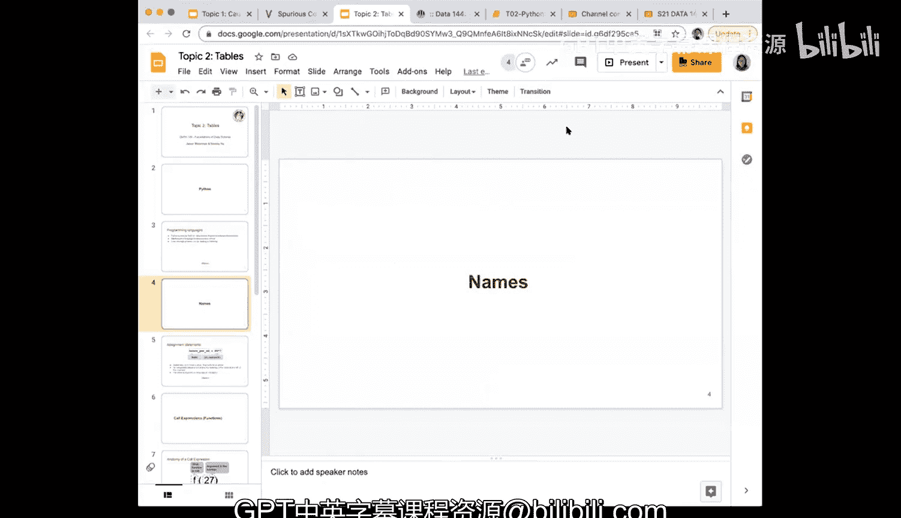
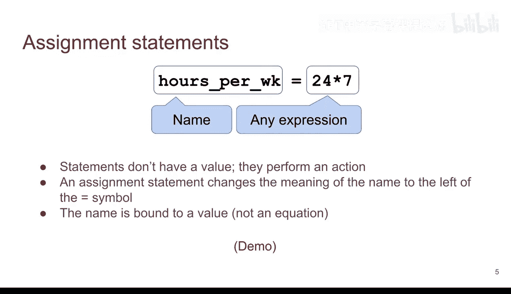
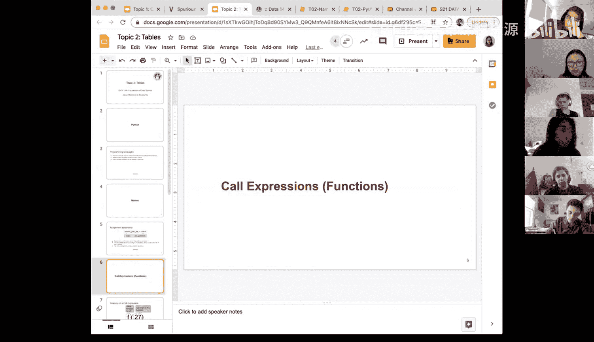

# 6：表格与命名




在本节课程中，我们将学习Python编程中的一个核心概念：**命名**。我们将了解如何为数据或计算结果赋予一个有意义的名称，以便在后续的代码中重复使用，这比单纯使用计算器模式要高效得多。

---

## 命名与赋值语句



上一节我们介绍了表格的基本操作，本节中我们来看看如何为数据赋予名称。在Python中，我们可以使用赋值语句将一个表达式的结果存储在一个名称下。

赋值语句的语法是：`名称 = 表达式`。这里的等号 `=` 是**赋值**操作，而不是数学意义上的相等。它执行一个动作：计算右侧表达式的值，然后将这个值绑定到左侧的名称上。

例如，计算每周的小时数：
```python
hours_per_week = 24 * 7
```
运行这行代码后，名称 `hours_per_week` 就代表了值 `168`。赋值语句本身不产生输出，它只是执行一个操作。

---

## 名称的使用与重新赋值

一旦我们为数据赋予了名称，就可以在后续的表达式中使用这些名称。这大大增强了代码的复用性和可读性。

以下是几个使用名称的例子：

```python
a = 6
b = 4
total = a + b  # 此时 total 的值为 10
```

现在，如果我们改变 `b` 的值：
```python
b = 3
```
此时，`b` 的值变成了3，但 `total` 的值**不会自动更新**，它仍然是之前计算出的10。这是因为 `total = a + b` 这条语句只在它被执行的那一刻进行计算和赋值。

要让 `total` 反映 `b` 的新值，我们需要**重新执行**赋值语句：
```python
total = a + b  # 重新赋值后，total 变为 9
```
这个例子说明了代码的执行顺序至关重要。在Jupyter Notebook等环境中，你可以随时返回并重新运行之前的单元格来更新结果。

---

## 命名的优势

你可能会问，为什么要使用名称？直接计算不就行了吗？随着学习的深入，使用有意义的名称会变得越来越重要。

考虑一个计算年工作收入和最低工资的例子：
```python
# 定义基础数据
hours_per_week = 8 * 5          # 每周工作40小时
weeks_per_year = 52             # 每年52周
ny_hourly_min_wage = 11.8       # 纽约最低时薪

# 使用名称进行计算
hours_per_year = hours_per_week * weeks_per_year
weekly_wages = hours_per_week * ny_hourly_min_wage  # 周薪
yearly_wages = hours_per_year * ny_hourly_min_wage  # 年薪
```

使用名称的好处显而易见：
1.  **可读性**：`weekly_wages` 比 `40 * 11.8` 更容易理解其含义。
2.  **可维护性**：如果“每周工作小时数”或“最低时薪”发生变化，你只需要在定义处修改一次，所有相关计算都会自动更新。
3.  **复用性**：定义好的名称（如 `hours_per_week`）可以在程序的多个地方使用，避免重复计算和输入错误。

---

## 总结

本节课中我们一起学习了Python中的**命名**与**赋值**。
*   我们掌握了赋值语句 `name = expression` 的用法，它用于将值绑定到一个名称上。
*   我们理解了名称的值只有在赋值语句被执行时才会更新，代码的运行顺序是关键。
*   我们探讨了使用有意义名称的三大优势：**提高代码可读性、便于维护、增强复用性**。



养成使用清晰、 informative 的名称的习惯，是写出优秀代码的第一步。在接下来的学习中，我们将继续依赖这一强大工具来处理更复杂的数据。