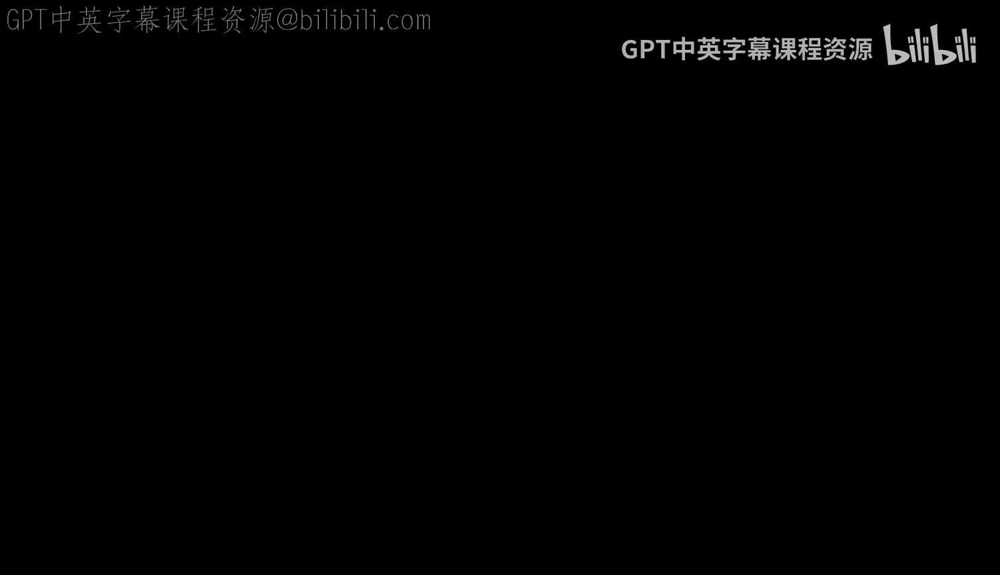
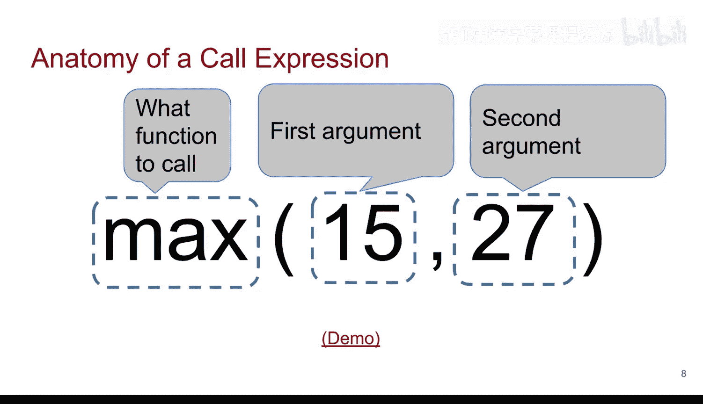
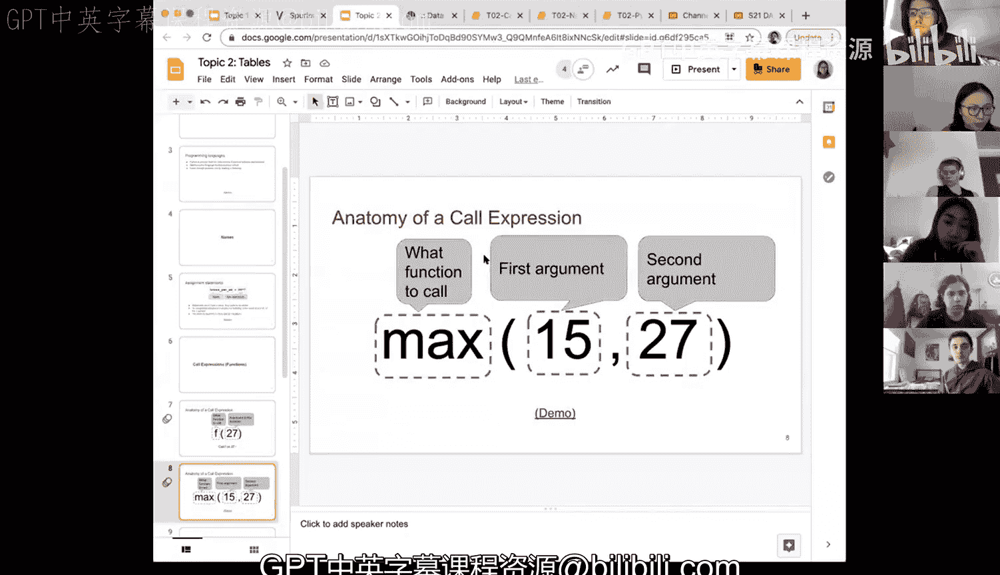

# 7：调用表达式与函数 🧮



在本节课中，我们将学习Python中一个核心概念：调用表达式，也就是我们常说的函数。我们将了解函数的基本结构、工作原理，并通过几个具体例子来加深理解。

## 函数的解剖结构

上一节我们介绍了变量和表达式，本节中我们来看看如何通过函数来执行更复杂的操作。一个调用表达式的基本结构如下：

**`函数名(参数)`**

*   **`F`**：代表函数名。在Python中，`F`可以是任何函数的名字，例如 `max`、`min` 或 `abs`。
*   **`27`**：代表参数。参数是传递给函数的数据，函数将对这些数据进行处理。参数的数量可以是一个，也可以是多个，具体取决于函数本身。

例如，如果我们有一个函数 `F`，其功能是将输入参数除以3，那么调用 `F(27)` 的结果就是 `27 / 3 = 9`。函数的具体行为完全取决于它的定义。

## 常用函数示例

以下是几个在数据分析和本课程中非常实用的内置函数示例。



### 绝对值函数 `abs`

`abs` 函数用于计算一个数的绝对值。对于任何数值，它返回其非负形式。

**`abs(-5)`** 的结果是 **`5`**。

我们可以将其应用于之前的变量计算中。例如，计算长度与宽度之差的绝对值：
```python
abs(length - width)
```
即使 `length - width` 在物理意义上可能没有直接解释，Python依然可以执行这个计算并返回结果 `2`。

### 最小值函数 `min`

`min` 函数用于从一组值中找出最小值。

**`min(14, 15)`** 的结果是 **`14`**。

### 四舍五入函数 `round`

`round` 函数用于对数字进行四舍五入。它有一个有趣的特性：可以接受可选参数来控制精度。

*   **`round(123.45456)`**：默认情况下（即不指定第二个参数），它会舍入到最接近的整数，结果是 **`123`**。
*   **`round(123.45456, 1)`**：第二个参数 `1` 指定保留一位小数，结果是 **`123.5`**。
*   **`round(123.45456, 2)`**：第二个参数 `2` 指定保留两位小数，结果是 **`123.45`**。

这里，第二个参数（小数位数）的默认值是 `0`。这种带有默认参数的函数为我们提供了灵活性。

## 总结与展望

本节课中我们一起学习了调用表达式（函数）的基本概念。我们掌握了函数 `函数名(参数)` 的标准形式，并实践了 `abs`、`min`、`round` 等几个常用函数。



理解函数是编程的关键。目前我们使用的是Python内置的函数。大约在本课程进行到三分之一时，你们将开始学习如何编写自己的函数。届时，你们将能定义函数名、指定输入参数、在函数体内编写处理逻辑，并最终返回计算结果。这将极大地扩展你们解决问题的能力，希望你们会喜欢那个部分。