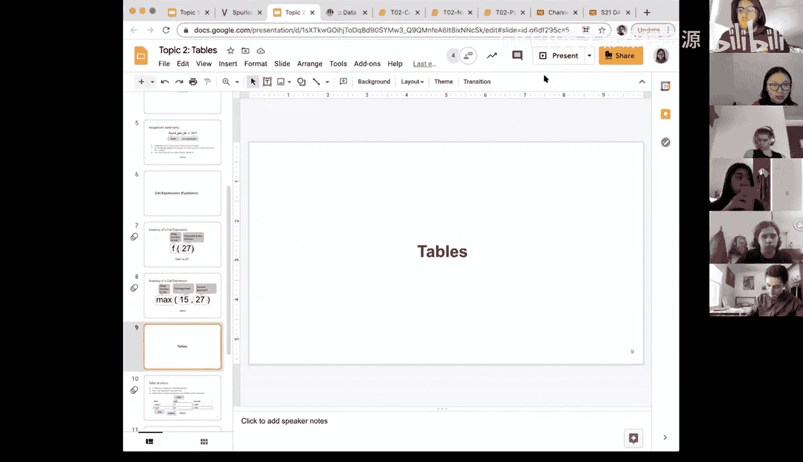
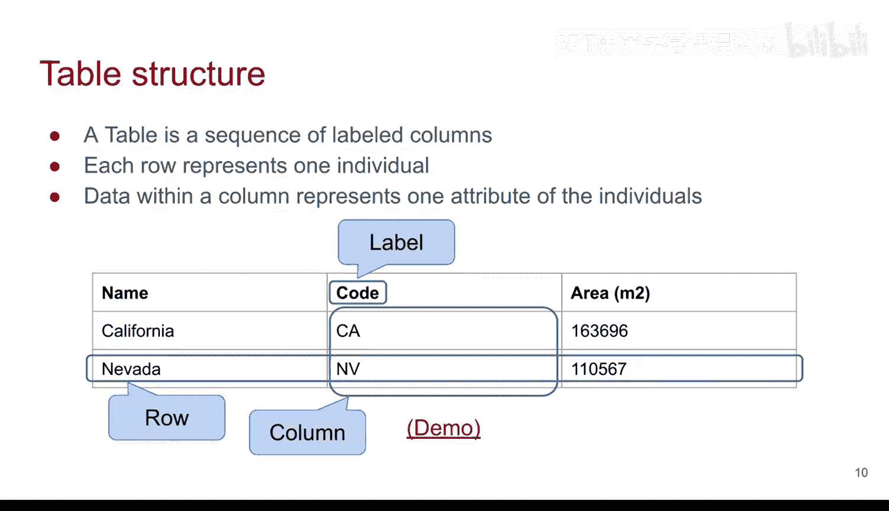
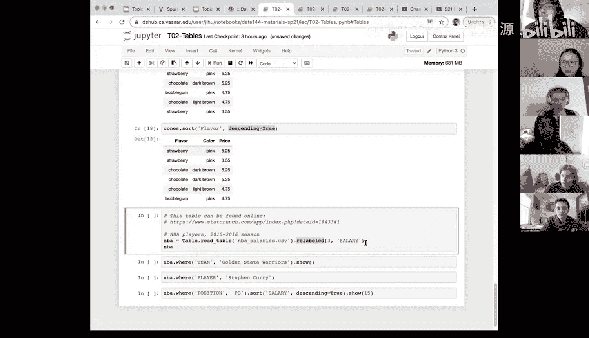

# 8：数据表操作 📊

在本节课中，我们将学习数据科学中一个核心概念：数据表。我们将了解数据表的基本结构，并学习如何使用Python库中的函数来读取、查看、选择和操作数据表。




---

## 数据表的基本概念

上一节我们介绍了数据科学的基础知识，本节中我们来看看数据表的具体结构。

数据表是一种组织数据的结构。在数据表中，每一行代表一个**观测值**或**个体**，每一列代表一个**标签**或**变量**，用于描述该个体的某种信息。

例如，考虑以下数据表：



| 州名 | 代码 | 面积（平方英里） |
|------|------|------------------|
| 加利福尼亚 | CA | 163696 |
| 内华达 | NV | 110572 |

在这个例子中：
*   每一行代表一个州（个体）。
*   每一列代表该州的一个属性（变量）：名称、缩写代码和面积。

数据表通常以这种行列结构呈现，是数据科学中最常用的数据组织形式。

---

## 数据表操作：基础函数演示

理解了数据表的结构后，本节我们将通过一个具体的数据集来学习如何操作数据表。我们将使用一个关于冰淇淋甜筒的数据集。

首先，我们需要加载必要的库并读取数据。

```python
# 加载数据科学库
from datascience import *

# 读取CSV文件并将其赋值给一个名为`cones`的对象
cones = Table.read_table('cones.csv')
```

代码说明：
*   `Table.read_table()` 函数用于读取CSV格式的文件并将其转换为数据表。
*   将读取的结果赋值给变量 `cones` 至关重要，这样我们才能在后续代码中访问和操作这个数据表。

运行上述代码后，我们可以打印 `cones` 来查看整个数据表的内容。

以下是 `cones` 数据表示例：

| 口味 | 颜色 | 价格 |
|------|------|------|
| 巧克力 | 棕色 | 4.75 |
| 草莓 | 粉色 | 5.25 |
| 香草 | 白色 | 4.50 |
| 巧克力 | 粉色 | 5.25 |
| 巧克力 | 粉色 | 5.25 |
| 香草 | 粉色 | 4.75 |

这个表有6行（6个观测值）和3列（3个变量：口味、颜色、价格）。

---

### 查看数据：`show()` 函数

数据表对象有许多有用的函数。第一个是 `show()` 函数，它可以控制显示数据的行数。

```python
# 显示数据表的前3行
cones.show(3)
```
执行上述代码将只显示数据表的前3行，并提示省略了后续行。

```python
# 显示整个数据表
cones.show()
```
如果不指定行数，`show()` 将显示整个数据表。其效果与直接打印 `cones` 变量类似，但 `show()` 在控制显示内容方面更灵活。

---

### 选择列：`select()` 函数

接下来，我们学习如何从数据表中选择特定的列。这通过 `select()` 函数实现。

```python
# 选择并显示“口味”这一列
cones.select('flavor')
```
这行代码会创建一个只包含“口味”列的新数据表并显示它。

```python
# 选择并显示“口味”和“颜色”两列
cones.select('flavor', 'color')
```
同样，这行代码会创建一个包含“口味”和“颜色”两列的新数据表。

**重要提示**：`select()` 函数本身不会修改原始数据表 `cones`。它只是基于原表创建了一个新的、只包含所选列的数据视图。如果你希望后续使用这个新表，需要将其赋值给一个新的变量。

```python
# 将只包含口味和颜色的新表保存下来
cones_flavor_color = cones.select('flavor', 'color')
```

---

### 删除列：`drop()` 函数

与选择列相反，我们可以使用 `drop()` 函数来删除不需要的列。

```python
# 删除“颜色”列并显示结果
cones.drop('color')
```
这行代码会创建一个不包含“颜色”列的新数据表并显示它。同样，原始表 `cones` 并没有被改变。

如果你想永久移除某列，需要将结果赋值给一个新变量（或覆盖原变量）。

```python
# 创建一个没有“颜色”列的新表
cones_no_color = cones.drop('color')
# 现在打印 cones_no_color，它将没有“颜色”列
print(cones_no_color)
# 但原始的 cones 表依然包含所有列
print(cones)
```

---

### 筛选行：`where()` 函数

在实际分析中，我们经常需要根据条件筛选出特定的行。`where()` 函数用于实现这一功能。

```python
# 找出所有口味为“巧克力”的甜筒
cones.where('flavor', 'chocolate')
```
`where()` 函数接受两个参数：
1.  第一个参数是列名（`'flavor'`）。
2.  第二个参数是要在该列中查找的值（`'chocolate'`）。

执行后，它会返回一个包含所有满足条件（口味等于巧克力）的行的新数据表。

你可以根据任何列进行筛选。例如，找出所有颜色为“粉色”的甜筒：

```python
cones.where('color', 'pink')
```

---

### 排序数据：`sort()` 函数

最后，我们学习如何对数据表进行排序，这通过 `sort()` 函数完成。

```python
# 按“价格”从低到高排序
cones.sort('price')
```
默认情况下，`sort()` 按升序（从小到大）排列。

```python
# 按“价格”从高到低排序
cones.sort('price', descending=True)
```
通过添加参数 `descending=True`，可以改为降序排列（从大到小）。

排序功能对数值型变量（如价格）最为直观，但也可以用于文本型变量（如口味），此时会按字母顺序排序。

```python
# 按“口味”字母降序排序
cones.sort('flavor', descending=True)
```



---

## 总结

本节课中我们一起学习了数据表的基本操作。我们首先了解了数据表的结构：行代表观测，列代表变量。然后，我们通过一个冰淇淋甜筒的数据集，实践了以下几个核心操作：
*   使用 `show(n)` 查看特定行数的数据。
*   使用 `select(column_name, ...)` 选择需要的列。
*   使用 `drop(column_name)` 删除不需要的列。
*   使用 `where(column_name, value)` 根据条件筛选行。
*   使用 `sort(column_name, descending=False)` 对数据进行排序。

掌握这些基础函数是进行数据清洗、探索和分析的第一步。请记住，大多数函数（如 `select`, `drop`, `where`, `sort`）都会返回一个新的数据表，而不会修改原始表，除非你将结果明确赋值给一个变量。