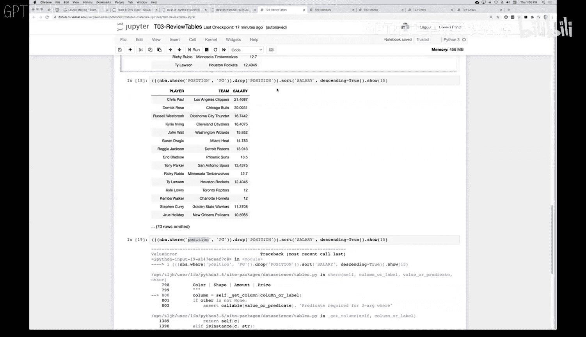

# 9：表格操作回顾与演示 🧮

在本节课中，我们将回顾并演示如何使用Python进行表格（Table）的基本操作，包括读取数据、筛选行、删除列、排序以及理解函数链式调用。


---

## 概述 📋

上一节我们介绍了表格的基本概念。本节中，我们将通过一个具体的Jupyter Notebook演示，学习如何对表格进行一系列操作。我们将使用一个关于NBA球员薪资的CSV文件作为数据源。

## 准备工作 ⚙️

首先，我们需要导入必要的Python库。`datascience`库提供了表格操作功能，`numpy`库提供了数学函数支持。

```python
from datascience import *
import numpy as np
```

运行上述代码单元格，完成库的导入。

## 读取数据 📂

创建表格最简单的方法之一是读取CSV文件。CSV是“逗号分隔值”的文本文件。第一行通常是标题行，包含各列的名称。

以下代码读取名为`nba_salaries.csv`的文件，并创建一个表格对象。同时，我们使用`.relabel`方法将第三列的名称改为更易读的“salary”。

```python
nba = Table.read_table('nba_salaries.csv').relabeled(2, 'salary')
nba
```

运行此单元格后，Jupyter Notebook会显示表格的前10行，包含`player`、`position`、`team`和`salary`四列。

## 筛选行 🔍

我们可以使用`.where`方法筛选出符合特定条件的行。例如，以下代码筛选出所有位置（`position`）为“PG”（控球后卫）的球员，并将结果保存为一个新表格。

```python
point_guards = nba.where('position', 'PG')
point_guards
```

`.where`方法返回一个新的表格，不会修改原始表格。新表格`point_guards`只包含85行数据。

## 删除列 🗑️

使用`.drop`方法可以删除表格中的指定列。该方法同样返回一个新表格。

```python
# 尝试删除‘position’列（注意大小写）
point_guards_dropped = point_guards.drop('Position') # 列名大小写不匹配，操作无效
point_guards_dropped = point_guards.drop('position') # 正确删除‘position’列
point_guards_dropped
```

**重要提示**：Python是大小写敏感的语言。列名必须完全匹配，否则`.drop`操作不会执行，也不会报错。

## 排序与显示 📊

我们可以使用`.sort`方法对表格进行排序。以下代码将`point_guards`表格按`salary`降序排列。

```python
# 按薪资降序排序，并显示前10行
point_guards.sort('salary', descending=True)
```

如果想查看排序后的完整表格，可以使用`.show`方法。以下是一个函数链式调用的例子：

```python
# 链式操作：筛选 -> 删除列 -> 排序 -> 显示前15行
nba.where('position', 'PG').drop('position').sort('salary', descending=True).show(15)
```

## 理解函数链式调用 ⛓️

链式调用允许我们将多个操作连接在一行代码中。理解链式调用的关键是**从左到右依次执行**，每一步操作的结果都是一个表格，可以作为下一步操作的输入。

虽然链式调用简洁，但当操作步骤很多时，为了代码的可读性和可维护性，建议将中间结果赋值给有意义的变量名。

## 关于Jupyter Notebook输出的说明 💡

在Jupyter Notebook中，一个代码单元格只默认显示**最后一行表达式**的输出。如果需要对变量进行赋值并查看其内容，需要单独在一个单元格中输出变量名。

```python
# 单元格1：执行赋值，无输出
my_table = nba.where('position', 'PG')

# 单元格2：输出表格内容
my_table
```

## 总结 🎯

本节课中我们一起学习了表格的核心操作：
1.  使用`Table.read_table()`读取CSV文件创建表格。
2.  使用`.where(column_name, value)`筛选符合条件的行。
3.  使用`.drop(column_name)`删除指定的列。
4.  使用`.sort(column_name, descending=True/False)`对表格进行排序。
5.  理解了**函数链式调用**的执行顺序和优势。
6.  掌握了在Jupyter Notebook中查看变量输出的方法。
7.  牢记Python是**大小写敏感**的，所有列名必须精确匹配。



这些操作是进行数据清洗、转换和分析的基础，后续我们将在此基础上学习更复杂的数据处理技术。