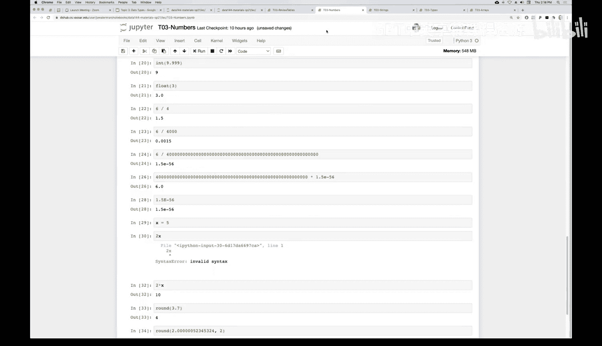

# 10：数字类型

在本节课中，我们将深入学习数字类型。数字是数据科学和计算机工作的基础，因此理解如何在系统中表示和操作数字至关重要。

我们已经介绍了多种数据类型，包括表格类型，并简要提及了数字。现在，我们将更深入地探讨数字类型。

## 算术运算

计算机非常擅长执行算术运算。Python支持所有常见的算术运算，包括加法、减法、乘法和除法。好消息是，这些运算的行为都符合我们的直觉。

以下是基本的算术运算：
*   **加法**：`2 + 3` 结果为 `5`
*   **减法**：`5 - 2` 结果为 `3`
*   **乘法**：`3 * 4` 结果为 `12`
*   **除法**：`7 / 3` 结果为 `2.3333333333333335`

除法运算有一个特别之处。除了常规除法，Python还支持**整数除法**，使用两个斜杠 `//` 表示。整数除法会返回除法结果的整数部分，忽略任何余数。

例如，`7 // 3` 的结果是 `2`。

如果你需要获取余数，可以使用**取模运算符** `%`。它返回除法运算后的余数。

例如，`7 % 3` 的结果是 `1`。

另一个有用的运算是**幂运算**，使用两个星号 `**` 表示。一个星号 `*` 是乘法，两个星号 `**` 是指数运算。

例如，`10 ** 3` 的结果是 `1000`（即10的3次方）。

## 关于空格的说明

在Python中，空格用于分隔不同的元素（如变量名、数字和运算符），这有助于解释器理解代码的结构。

关于空格和命名，有两条重要规则：
1.  变量名中不能包含空格。
2.  变量名不能以数字开头（但可以包含数字）。

例如，`2plus3` 不是一个合法的变量名，因为它以数字开头。而 `plus2and3` 则是合法的。运算符（如 `+`, `//`, `**`）和操作数之间可以有空格，也可以没有，Python都能正确解析。例如，`2+3` 和 `2 + 3` 都是有效的。

## 数字类型：整数与浮点数

在Python中，数字主要分为两种类型：**整数** 和 **浮点数**。
*   **整数** 是不带小数点的数字，如 `5`, `-10`, `1000`。
*   **浮点数** 是带有小数点的数字，如 `3.14`, `2.0`, `-0.001`。

进行除法运算时，即使结果是整数，Python也会返回一个浮点数。

例如，`10 / 2` 的结果是 `5.0`，而不是 `5`。你可以通过数字是否包含小数点来区分它是整数还是浮点数。

## 精度限制

浮点数在计算机中的表示有精度限制。这意味着对于无限循环小数或非常长的小数，计算机只能存储一个近似值。

例如，`10 / 3` 在数学上是 `3.333...`（无限循环）。在Python中，它被表示为 `3.3333333333333335`，在大约16位小数后出现了细微的差异。对于本课程的大多数应用，这个精度已经足够，但了解这一限制很重要。

相反，**Python的整数可以非常大，几乎没有上限**。例如，计算 `123456 ** 890` 会得到一个极其庞大的数字，但Python能够精确地表示和计算它。

## 类型转换

我们可以在整数和浮点数之间进行转换。
*   使用 `int()` 函数将浮点数转换为整数。注意，`int()` 是直接**截断**小数部分，而不是四舍五入。
    *   例如，`int(9.999)` 的结果是 `9`。
*   使用 `float()` 函数将整数转换为浮点数。
    *   例如，`float(3)` 的结果是 `3.0`。

如果你需要进行四舍五入，可以使用 `round()` 函数。
*   `round(9.999)` 默认四舍五入到最接近的整数，结果为 `10`。
*   你还可以指定保留的小数位数，例如 `round(3.14159, 2)` 结果为 `3.14`。

## 科学计数法

对于非常大或非常小的数字，Python支持科学计数法。使用字母 `e` 或 `E` 表示“乘以10的幂次”。

例如：
*   `1.5e-6` 表示 `1.5 × 10⁻⁶`，即 `0.0000015`。
*   `2.3e8` 表示 `2.3 × 10⁸`，即 `230,000,000`。

## 赋值操作

理解赋值语句 `=` 的机制非常重要。它不是一个数学等式，而是一个操作指令。
*   **左边**必须是一个变量名。
*   **右边**是一个表达式，Python会先计算这个表达式的值。
*   操作过程是：计算右边表达式的值，然后将这个值存储到左边变量名所代表的内存空间中。

例如，`x = 2 + 3` 的执行过程是：先计算 `2 + 3` 得到 `5`，然后将值 `5` 赋给变量 `x`。

请注意，在数学中我们可能写 `2x` 表示 `2` 乘以 `x`，但在Python中这是无效语法。你必须明确写出乘法运算符：`2 * x`。

## 运算结果的类型

当进行混合类型运算时，结果类型遵循一定规则：
*   如果一个操作数是浮点数，那么运算结果通常是浮点数。
    *   例如，`3 * 4.0` 的结果是浮点数 `12.0`。
*   如果所有操作数都是整数，那么加、减、乘的结果是整数。除法的结果总是浮点数。

## 总结

本节课我们一起深入学习了Python中的数字类型。我们回顾了基本的算术运算，包括加法、减法、乘法、除法、整数除法和取模运算。我们区分了**整数**和**浮点数**，并了解了浮点数的精度限制以及整数可以任意大的特性。我们还学习了如何使用 `int()`、`float()` 和 `round()` 函数进行类型转换和四舍五入。最后，我们巩固了赋值语句的“先求值，再赋值”机制，以及混合运算时的类型规则。掌握这些基础知识对于后续的数据处理和分析至关重要。