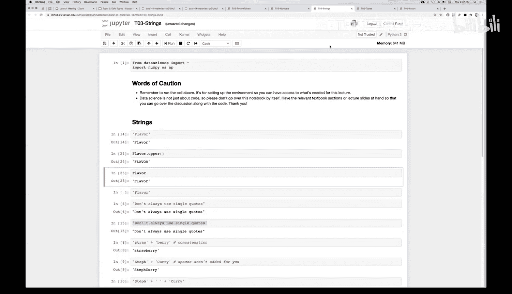

# 11：字符串类型

在本节课中，我们将学习Python中的第四种数据类型：字符串。字符串用于表示文本数据，是编程中处理文字信息的基础。我们将了解如何创建字符串、对字符串进行基本操作，以及如何在字符串与其他数据类型之间进行转换。

---

## 什么是字符串？📝

上一节我们介绍了整数、浮点数和表格对象。本节中，我们来看看字符串。

字符串是任意长度的文本。在Python中，我们使用单引号 `'` 或双引号 `"` 将文本内容括起来，以此表示一个字符串。

例如，`'A'` 是一个长度为1的字符串，包含字母A。字符串可以是任意长度，只要其内容被引号包围。Python不关心你使用单引号还是双引号，但必须保持一致性：以单引号开始的字符串必须以单引号结束，双引号亦然。

你几乎可以在引号内放入任何字符，包括表情符号（emoji）。我们在第一次实验课中已经见过这样的例子。

---

## 字符串与数字的转换 🔄

如果字符串的内容看起来像一个数字，Python提供了转换函数，可以将其转换为对应的数字类型。

以下是转换方法：
*   **`int()` 函数**：尝试将字符串解释为整数。例如，`int('12')` 会将字符串 `'12'` 转换为整数值 `12`。注意，括号内的 `'12'` 是字符“1”和“2”，而不是数字12。
*   **`float()` 函数**：将字符串转换为浮点数（小数）。例如，`float('3.14')` 会得到浮点数 `3.14`。
*   **`str()` 函数**：将任何值转换为字符串。例如，`str(5)` 会返回字符串 `'5'`。

---

## 字符串的基本操作 ➕✖️

你可以对字符串执行一些操作，最常用的是拼接和重复。

以下是字符串支持的操作：
*   **拼接（加法）**：使用加号 `+` 可以将多个字符串连接成一个新字符串。例如，`'Hello' + ' ' + 'World'` 的结果是 `'Hello World'`。请注意，拼接不会自动添加空格，如果需要空格，你必须将其作为一个独立的字符串（如 `' '`）加入拼接。
*   **重复（乘法）**：使用乘号 `*` 可以将一个字符串重复多次。例如，`'Ha' * 3` 会得到 `'HaHaHa'`。这可以看作是多次拼接的快捷方式。需要注意的是，乘数必须是一个整数。

这些操作也有其限制。例如，不能将字符串与数字相加（如 `'text' + 10`），也不能用小数去乘一个字符串（如 `'word' * 2.5`），这些都会导致错误。

---

## 字符串中的引号处理 💬

当字符串本身包含引号时，需要小心处理以避免语法错误。

处理字符串内引号的方法如下：
*   **使用另一种引号**：如果字符串内包含单引号，那么用双引号定义整个字符串会更方便，反之亦然。例如，`"Don't worry"`。
*   **使用转义字符**：如果你坚持使用同种引号，可以在字符串内的引号前加上反斜杠 `\` 进行转义。例如，`'Don\'t worry'`。反斜杠告诉Python，后面的引号是字符串内容的一部分，而不是字符串的结束标记。

---

## 字符串方法 📞

就像表格对象有方法（如 `.show()`）一样，字符串也是一种对象，拥有自己的方法。你可以使用点号 `.` 来调用它们。

字符串方法示例：
*   **`.upper()` 方法**：调用此方法会返回一个全新的字符串，其中所有字母都被转换为大写。原始字符串保持不变。例如，如果 `flavor = 'chocolate'`，那么 `flavor.upper()` 会返回 `'CHOCOLATE'`，而 `flavor` 本身仍然是 `'chocolate'`。

理解数据类型非常重要，因为数据的**类型决定了你可以对它执行哪些操作**。现在我们已经认识了整数、浮点数、表格和字符串，在编程时，请时刻思考你正在操作的对象的类型。

---

本节课中我们一起学习了Python的字符串类型。我们了解了如何创建字符串，如何通过`int()`、`float()`、`str()`函数在字符串与数字间转换，掌握了字符串的拼接与重复操作，学会了处理字符串中的引号，并初步接触了字符串方法。字符串是处理所有文本数据的基础，在后续的数据分析和输出展示中会经常用到。