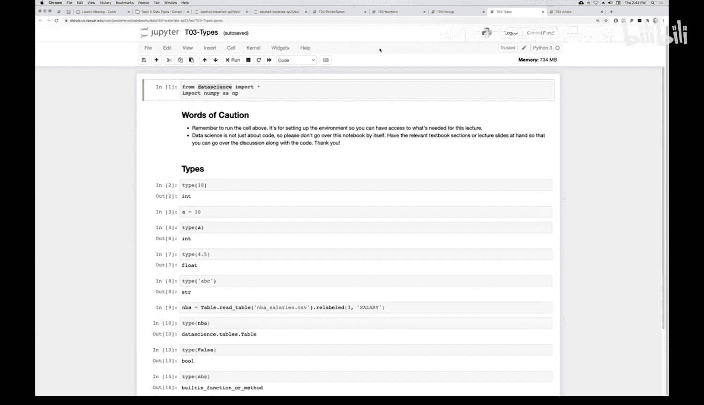

# 12：数据类型


在本节课中，我们将要学习Python中的不同数据类型。理解数据类型是编程的基础，它决定了我们可以对数据执行哪些操作。

## 概述

每个变量名或值都与一个特定的数据类型相关联。我们已经接触过几种类型，包括整数、浮点数、字符串、表格以及内置函数。本节将系统地介绍这些类型，并学习如何使用`type()`函数来检查任何表达式或变量的类型。

## 数据类型介绍

上一节我们介绍了变量和赋值，本节中我们来看看这些变量可以存储哪些不同类型的数据。

Python中的每个值都有一个特定的类型。我们已经见过以下五种类型：
*   **整数**：例如 `2`, `10`, `-5`
*   **浮点数**：例如 `4.5`, `3.14`, `-0.001`
*   **字符串**：例如 `"hello"`, `"4.5"`
*   **表格**：来自`datascience`库的特殊对象，用于存储和操作表格数据。
*   **内置函数**：例如 `str()`, `int()`, `float()`, `abs()`

## 使用`type()`函数

要确定任何表达式或变量的类型，我们可以使用内置的`type()`函数。

**公式**：`type(expression)`

这个函数接受一个表达式（可以是值、变量名或更复杂的表达式），并返回其类型。

### 类型由值决定

一个关键点是，**表达式的类型由其实际值决定，而非其书写形式**。

以下是几个示例：

```python
x = 2
type(x)        # 返回 <class 'int'>，因为值2是整数
type(10)       # 返回 <class 'int'>
type(4.5)      # 返回 <class 'float'>
```

即使一个字符串看起来像数字，它的类型依然是字符串：

```python
type("4.5")    # 返回 <class 'str'>，因为引号使其成为字符串
```

## 表格类型

当我们从文件读取数据创建表格时，该变量的类型就是表格。

```python
# 假设已导入 datascience 库
from datascience import *
mba = Table.read_table('mba.csv')
mba_relabeled = mba.relabeled('Old Name', 'New Name')
type(mba_relabeled)  # 返回 <class 'datascience.tables.Table'>
```

在上面的操作中，`mba`和`mba_relabeled`都是表格对象。

## 布尔类型

我们尚未深入讨论但即将用到的一种类型是**布尔型**。它只有两个可能的值：`True`（真）和`False`（假）。在计算机科学中，布尔值常用于条件判断。

```python
type(True)   # 返回 <class 'bool'>
type(False)  # 返回 <class 'bool'>
```

## 函数也是对象

在Python中，函数名本身也是一个指向“函数对象”的名称。因此，我们也可以检查函数的类型。

```python
type(abs)  # 返回 <class 'builtin_function_or_method'>
type(min)  # 返回 <class 'builtin_function_or_method'>
type(max)  # 返回 <class 'builtin_function_or_method'>
```

## 如何获取函数

函数主要通过两种方式获得：
1.  **内置函数**：Python默认提供的，如`abs()`, `min()`, `max()`。
2.  **导入库**：通过`import`语句从外部库引入。例如：
    *   `import numpy as np` 引入数值计算库。
    *   `from datascience import *` 引入数据科学库，其中包含`Table`等对象和函数。

对于本课程而言，`datascience`库和`numpy`库将提供我们所需的大部分功能。

## 总结



本节课中我们一起学习了Python中的核心数据类型。我们明确了类型由值本身决定，并掌握了使用`type()`函数进行检查的方法。我们回顾了整数、浮点数、字符串、表格和布尔型，也了解到函数本身也是一种对象类型。理解这些基础类型是后续学习数组操作、条件判断等更复杂概念的关键。下一节，我们将开始学习**数组**，这将解锁更多强大的数据操作功能。