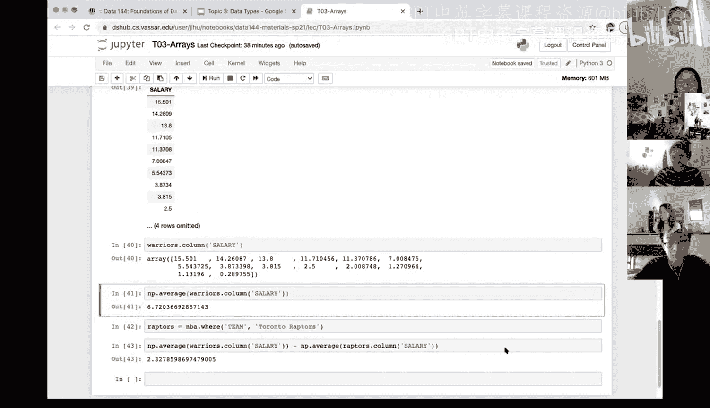

# 13：数组


在本节课中，我们将学习数组（Arrays）这一核心数据结构。数组是数据科学中处理序列化数据的基础，理解其特性和操作对于后续的数据处理至关重要。

## 概述

数组包含一系列值。在开始操作数组之前，我们需要了解其几个关键特性，以避免后续出现混淆或错误。

首先，数组的所有元素必须具有相同的数据类型。这与我们之前讨论的数据表（Data Table）概念类似，数据表中的每一列（即一个属性或变量）也都具有相同的数据类型。例如，在冰淇淋销售数据中，“口味”列的所有值都是字符串，而“价格”列的所有值都是数字。

其次，对数组进行的算术运算会独立地应用于其中的每一个元素。例如，将数组 `[1, 2, 3, 4]` 乘以 2，会得到新数组 `[2, 4, 6, 8]`。

此外，当两个数组相加时，它们必须具有相同的大小（即元素数量相同），否则会引发错误。运算结果是两个数组对应位置元素相加得到的新数组。

最后，一个重要的联系是：从数据表中提取出的单个列，其本质就是一个数组。理解这一点对于后续使用数据表进行数据分析非常关键。

## 数组的创建与基本操作

现在，让我们通过示例来具体看看如何创建和操作数组。首先，我们需要导入必要的库。

```python
import numpy as np
```

以下是创建数组和进行基本算术运算的示例。

```python
# 使用 make_array 函数创建数组
my_array = np.make_array(1, 2, 3, 4)
```

我们可以对数组进行各种算术运算，这些运算会作用于每个元素。

```python
# 每个元素乘以2
my_array * 2
# 结果: array([2, 4, 6, 8])

# 每个元素求平方（2次幂）
my_array ** 2
# 结果: array([1, 4, 9, 16])

# 每个元素加1
my_array + 1
# 结果: array([2, 3, 4, 5])
```

需要注意的是，上述操作并没有改变原始的 `my_array`。如果你想保存运算结果，需要将其赋值给一个新的变量。

```python
my_array_new = my_array + 1
```

如果你想直接修改原始数组，可以将其运算结果重新赋值给原变量名，但这会覆盖旧值。

```python
my_array = my_array + 1  # my_array 现在变为 [2, 3, 4, 5]
```

## 数组间的运算

上一节我们介绍了对单个数组的运算，本节中我们来看看两个数组之间的运算。数组相加要求两个数组大小必须相同。

```python
# 创建另一个数组
another_array = np.make_array(5, 6, 7, 8)

# 两个数组相加（对应元素相加）
my_array + another_array
# 结果: array([6, 8, 10, 12])
```

如果尝试对大小不同的数组进行运算，程序会报错。

```python
array_a = np.make_array(1, 2, 3)
array_b = np.make_array(4, 5, 6, 7)
# array_a + array_b  # 这会引发 ValueError
```

## 其他数据类型与数组函数

除了数值数组，我们也可以创建其他数据类型的数组，例如字符串数组。

```python
string_array = np.make_array(“Hello”, “World”)
```

然而，对字符串数组能进行的算术运算是非常有限的。数值数组则支持更多有用的函数。

以下是针对数值数组的一些常用汇总函数：

```python
# 计算数组所有元素的和
np.sum(my_array)

# 找出数组中的最大值
np.max(my_array)

# 计算数组元素的平均值（使用numpy库的average函数）
np.average(my_array)

# 获取数组的长度（元素个数）
len(my_array)
```

## 数据表与数组的联系

在数据科学中，我们经常从数据表中提取数据进行分析。数据表中的列本质上就是数组。有两种主要方法可以从数据表中提取列信息。

假设我们有一个关于NBA球员薪资的数据表 `nba`，包含`球员姓名`、`位置`、`球队`和`薪资`等列。

如果我们想获取金州勇士队（Golden State Warriors）的所有球员数据，可以使用 `where` 方法进行筛选。

```python
warriors = nba.where(“Team”, “Golden State Warriors”)
```

现在，如果我们想专门分析勇士队球员的薪资，有两种方式提取`薪资`列：

1.  **`select` 方法**：返回一个只包含所选列的新数据表（子表）。
    ```python
    warriors_salary_table = warriors.select(“Salary”)
    # 返回的是一个数据表（DataFrame）
    ```

2.  **`column` 方法**：直接将该列作为一个数组（Array）返回。
    ```python
    warriors_salary_array = warriors.column(“Salary”)
    # 返回的是一个数组
    ```

选择哪种方法取决于你的后续操作。如果你想构建一个包含多列的新数据表，使用 `select`。如果你要对某一列进行数值计算或汇总统计（如求平均值），则需要使用 `column` 方法将其转为数组。

例如，计算勇士队球员的平均薪资：

```python
avg_warriors_salary = np.average(warriors.column(“Salary”))
```

我们可以将此方法应用于更复杂的分析。例如，比较勇士队和多伦多猛龙队（Toronto Raptors）的平均薪资差异：

```python
# 获取猛龙队数据
raptors = nba.where(“Team”, “Toronto Raptors”)
# 计算猛龙队平均薪资
avg_raptors_salary = np.average(raptors.column(“Salary”))
# 计算薪资差异
salary_difference = avg_warriors_salary - avg_raptors_salary
```

这个流程概括了常见的数据分析步骤：使用 `where` 筛选特定行，使用 `column` 将数值列转为数组，然后对数组进行算术或统计运算。

## 总结



本节课中我们一起学习了数组的核心概念。我们了解到数组是元素类型相同的序列，支持逐元素的算术运算。我们练习了数组的创建、基本运算以及数组间的操作。更重要的是，我们建立了数据表与数组之间的联系，明白了如何从数据表中提取列数据作为数组，并利用数组方法进行数据分析，例如计算球队的平均薪资。掌握数组是进行高效数据操作和计算的基石。