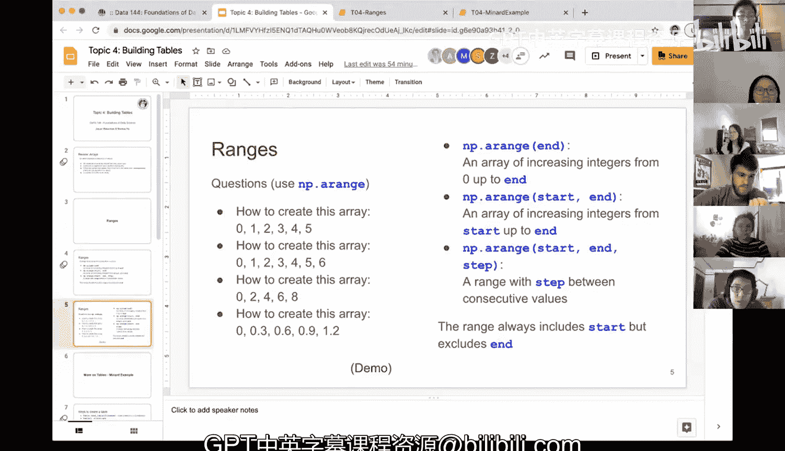

# 14：构建表格


在本节课中，我们将学习如何构建和操作表格。我们将从回顾数组的基本概念开始，然后引入一个非常实用的新工具：范围（Ranges）。通过掌握范围，我们可以更高效地创建包含连续数字的数组，这是构建表格数据的基础。

## 回顾：数组

上一节我们介绍了数组。数组是包含**相同数据类型**元素的集合。对数组进行算术运算时，运算会**应用于每个元素**。如果要对两个数组进行加法或减法等操作，它们必须**具有相同的大小**。此外，表格中的一列本质上就是一个数组，因此我们可以直接对列进行算术运算。

## 引入新概念：范围

在深入探讨表格构建之前，我们需要引入一个新概念：范围。

范围（Ranges）是**连续数字组成的数组**。之前我们通过手动输入每个元素（如 `np.array([1, 2, 3, 4])`）来创建数组。但如果需要创建像1到100这样的长序列，手动输入会非常繁琐。`numpy` 库提供了一个便捷的函数 `np.arange()` 来高效生成这类序列。

`np.arange()` 函数可以生成等差序列。其核心行为由三个参数控制：
*   **起始值 (start)**：序列开始的数字（包含）。
*   **结束值 (stop)**：序列结束的数字（**不包含**）。
*   **步长 (step)**：相邻两个数字的差值，默认为1。

以下是几种常见的调用方式及其对应的数学描述：

**1. 仅指定结束值**
`np.arange(stop)` 生成从 **0** 开始，到 `stop`（不含）结束，步长为1的序列。
公式：`[0, 1, 2, ..., stop-1]`
代码示例：`np.arange(5)` 生成 `[0, 1, 2, 3, 4]`。

**2. 指定起始值和结束值**
`np.arange(start, stop)` 生成从 `start`（包含）开始，到 `stop`（不含）结束，步长为1的序列。
公式：`[start, start+1, start+2, ..., stop-1]`
代码示例：`np.arange(1, 5)` 生成 `[1, 2, 3, 4]`。

**3. 指定起始值、结束值和步长**
`np.arange(start, stop, step)` 生成从 `start`（包含）开始，到 `stop`（不含）结束，相邻元素差为 `step` 的序列。
公式：`[start, start+step, start+2*step, ...]` (最后一个值 < stop)
代码示例：`np.arange(0, 10, 2)` 生成 `[0, 2, 4, 6, 8]`。

**关键点**：范围**总是包含起始值**，但**从不包含结束值**。如果需要包含结束值，通常需要将 `stop` 参数设置为比目标值大一个步长。

## 练习与演示

为了加深理解，我们来看几个具体的例子。

以下是几个创建特定数组的练习题：

1.  创建数组 `[0, 1, 2, 3, 4, 5]`
    *   答案：`np.arange(6)` 或 `np.arange(0, 6)`

2.  创建数组 `[0, 1, 2, 3, 4, 5, 6]`
    *   答案：`np.arange(7)`

3.  创建数组 `[0, 2, 4, 6, 8]`
    *   答案：`np.arange(0, 10, 2)`。注意，`np.arange(0, 9, 2)` 同样有效，因为结果 `[0, 2, 4, 6, 8]` 中的最大值8小于结束值9。

4.  创建数组 `[0, 0.3, 0.6, 0.9, 1.2]`
    *   答案：`np.arange(0, 1.5, 0.3)`。结束值需要略大于最后一个目标值1.2。

现在，让我们在代码中演示这些例子和一些特殊情况：

```python
import numpy as np

# 示例 1: 0 到 5
print(np.arange(6))
# 输出: [0 1 2 3 4 5]

# 示例 2: 5 到 17
print(np.arange(5, 18))
# 输出: [ 5  6  7  8  9 10 11 12 13 14 15 16 17]

# 示例 3: 0 到 20 的偶数
print(np.arange(0, 21, 2))
# 输出: [ 0  2  4  6  8 10 12 14 16 18 20]

# 示例 4: 使用非整数结束值
print(np.arange(0, 19.5, 2))
# 输出: [ 0.  2.  4.  6.  8. 10. 12. 14. 16. 18.]

# 示例 5: 步长为小数
print(np.arange(0, 1.5, 0.3))
# 输出: [0.  0.3 0.6 0.9 1.2]
```

## 访问数组元素

创建数组后，我们可能需要访问其中的特定元素。可以使用 `.item()` 方法，但必须注意Python的**索引从0开始**的规则。

```python
# 创建一个数组并赋值给变量 a
a = np.arange(8)  # [0, 1, 2, 3, 4, 5, 6, 7]

# 要获取第一个元素（索引为0）
print(a.item(0))  # 输出: 0

# 要获取最后一个元素（第8个，索引为7）
print(a.item(7))  # 输出: 7

# 注意：a.item(8) 会引发错误，因为索引8超出了数组范围（有效索引是0到7）。
```

**重要提示**：无论数组的起始值是多少，其索引始终从0开始。例如，对于数组 `b = np.arange(1, 9)`（即 `[1, 2, 3, 4, 5, 6, 7, 8]`），`b.item(0)` 返回 `1`，`b.item(7)` 返回 `8`。

## 总结



本节课中我们一起学习了构建表格的重要基础——范围（`np.arange`）。我们掌握了如何使用 `np.arange(start, stop, step)` 函数高效生成连续数字序列，并理解了其**包含起始值、不包含结束值**的核心特性。我们还复习了通过索引（从0开始）访问数组元素的方法。这些技能对于后续创建和操作表格数据至关重要。