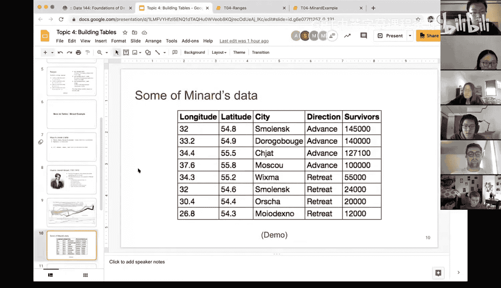

# 15：表格构建与Minard示例 📊


在本节课中，我们将学习如何构建和操作表格，并以著名的Minard图表数据为例，演示如何通过Python进行数据操作，例如计算百分比并添加新列。

---

## 表格的创建方式

上一节我们介绍了表格的基本概念，本节中我们来看看创建表格的几种方法。

以下是创建表格的几种方式：

1.  **从外部文件读取**：使用 `table.read_table("文件名.csv")` 读取CSV或类似电子表格格式的文件。这是我们最常用的方法。
2.  **创建空表**：可以创建一个空的表格对象，然后逐步添加数据。
3.  **赋值给对象**：无论是读取还是创建的表格，都应将其赋值给一个变量（如 `mba_data`），以便后续通过 `变量名.方法()` 的形式进行操作。

创建表格后，我们之前学过的 `select` 等函数可以应用于任何表格，无论其来源。

---

## Minard示例介绍

现在，让我们引入一个具体的数据集作为示例。我们将使用Charles Joseph Minard绘制的拿破仑1812年远征俄罗斯的著名图表数据。

这张图表被誉为史上最伟大的信息图之一，因为它在一个可视化中融合了多种信息：
*   军队行进路径的经纬度（地理信息）。
*   城市名称与日期。
*   军队人数（规模信息）。
*   进军与撤退的方向。
*   撤退时的气温。

这展示了在缺乏现代计算资源的年代，人们如何富有创造力地进行数据可视化。作为数据科学家，我们也应鼓励自己跳出常规，为信息丰富的数据设计创新的可视化方式。

---

## 加载与查看数据

回到我们的Python操作，有人已经将Minard图表的数据整理成了结构化的表格。以下是该数据集的部分截图，包含以下列：`longitude`（经度）、`latitude`（纬度）、`city`（城市）、`direction`（方向）、`survivors`（幸存士兵数）。

我们将通过演示来学习如何操作这个表格。

首先，我们加载必要的库并读取数据文件 `minard.csv`。

```python
# 从CSV文件读取数据并赋值给变量 minard
minard = table.read_table('minard.csv')
# 显示表格
minard
```

**注意**：在课程项目中，如果你有自己的CSV文件，需要将其放在工作目录中，才能使用 `table.read_table` 方法读取。

---

## 数据操作：计算存活百分比

假设我们想分析在远征的每个阶段，士兵数量相对于初始人数的存活百分比。

从数学上讲，我们需要将 `survivors` 列中的每个值，除以该列的第一个值（即初始军队人数）。以下是实现步骤的思考与操作。

### 步骤1：获取数据列

我们需要对 `survivors` 列进行数值运算。`select` 函数会返回包含该列的新表格，而 `column` 方法则直接返回该列值的数组，更适合进行数学计算。

```python
# 使用 .column() 获取 survivors 列，得到一个数组
survivors_array = minard.column('survivors')
```

### 步骤2：获取初始人数

我们需要获得数组的第一个元素作为初始人数。

```python
# 获取数组的第一个元素，索引为0
initial_size = survivors_array.item(0)
# initial_size 的值应为 340000
```

### 步骤3：计算百分比数组

用整个幸存者数组除以初始人数，得到百分比数组。

```python
# 进行数组运算，计算百分比
percentage_array = survivors_array / initial_size
```

### 步骤4：将新列添加到原表格

我们使用 `with_column` 方法将计算出的百分比数组作为新列添加回原表格。

```python
# 添加名为 ‘PCT alive’ 的新列，并将结果赋值回 minard，更新原表格
minard = minard.with_column('PCT alive', percentage_array)
# 查看添加新列后的表格
minard
```

**关键点**：`with_column` 方法接受两个参数：新列的名称和包含列数据的数组。为了永久改变 `minard` 表格，我们必须将结果重新赋值给 `minard`。

### （可选）步骤5：格式化百分比显示

如果你想以百分数形式（如“50%”）显示该列，可以使用 `set_format` 函数。

```python
# 将 ‘PCT alive’ 列设置为百分比格式显示
minard.set_format('PCT alive', formatter=percent_formatter)
```

**再次提醒**：如果你希望格式化更改在后续操作中生效，可能需要将结果重新赋值。

---

## 总结

本节课中我们一起学习了表格的高级操作。我们以Minard数据集为例，完成了以下任务：
1.  回顾了创建表格的几种方式。
2.  学习了使用 `.column()` 方法获取列数据以进行数值计算。
3.  掌握了通过 `.item(0)` 获取数组首个元素的方法。
4.  实践了如何通过数组运算（如除法）生成新的数据序列。
5.  学会了使用 `.with_column()` 方法将计算出的新数组作为列添加到原有表格中，并理解了重新赋值以更新表格的重要性。
6.  简要了解了如何使用 `.set_format()` 对列进行格式化显示。



数据处理常常需要先明确目标（如“计算百分比”），再分解步骤，并组合运用所学方法。这需要练习和耐心，请务必多运行演示代码，理解其原理，并在遇到问题时及时寻求帮助。