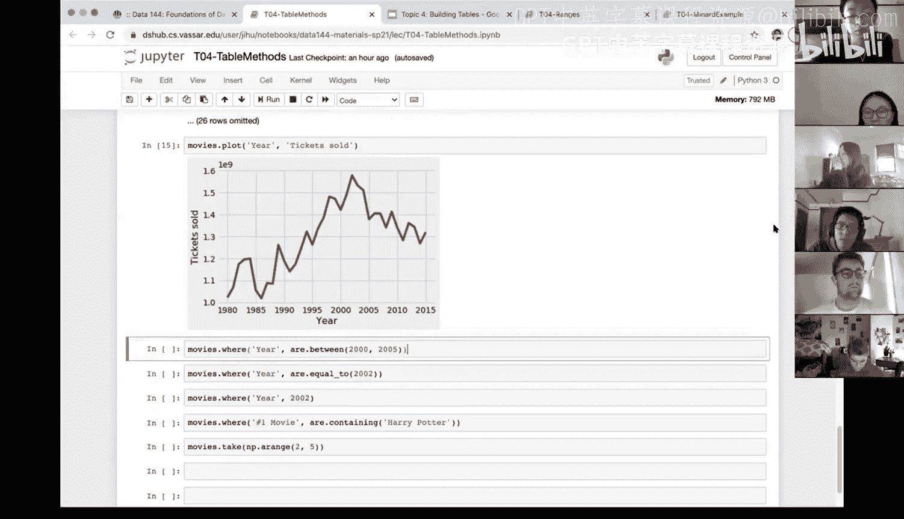

# 16：表格方法（第一部分）📊


在本节课中，我们将学习表格（Table）的基本操作方法。我们将从创建表格开始，逐步介绍如何获取表格信息、访问列数据以及使用数组方法处理数据。这些技能是进行数据分析和挖掘的基础。

---

## 创建与扩展表格

上一节我们介绍了表格的基本概念，本节中我们来看看如何从零开始创建一个表格，以及如何向现有表格添加新的列。

创建一个表格主要有两种方式：从外部数据源读取，或者使用代码从头构建。当我们谈论“扩展”表格时，通常指的是添加新的列，这可以通过 `.with_column` 方法实现。

以下是创建一个包含宿舍名称和建造年份的表格的步骤：

1.  **创建数组**：表格的每一列本质上都是一个数组。因此，我们首先需要创建包含数据的数组。
    ```python
    dorm_names = make_array("Strong", "Raymond", "Davisson", "Noise")
    years_built = make_array(1962, 1959, 1968, 1971)
    ```

2.  **构建表格**：使用 `Table()` 构造函数和 `.with_column` 方法将数组组合成表格。
    ```python
    dorms = Table().with_column("Name", dorm_names)
    dorms = dorms.with_column("YearBuilt", years_built)
    ```
    请注意，`.with_column` 方法会返回一个新的表格，因此需要将其赋值给一个变量（如 `dorms`）才能保存更改。

---

## 获取表格信息

创建表格后，了解其结构非常重要。我们可以轻松地获取表格的行数、列数以及列标签。

以下是获取表格信息的方法：

*   **获取列标签**：使用 `.labels` 属性可以查看表格所有列的名称。
    ```python
    dorms.labels  # 返回：('Name', 'YearBuilt')
    ```
*   **获取表格尺寸**：使用 `.num_rows` 和 `.num_columns` 属性可以分别获取表格的行数和列数。
    ```python
    dorms.num_rows   # 返回：4
    dorms.num_columns # 返回：2
    ```
    对于大型数据集，这些方法能帮助你快速把握数据规模。

---

## 访问与处理列数据

掌握了表格的基本信息后，我们来看看如何访问和操作其中的数据列。这是进行数据计算和转换的关键。

访问列数据主要有两种方式，它们返回的结果类型不同：

1.  **`.column(column_label)`**：此方法根据列标签提取数据，并**返回一个数组（Array）**。一旦数据变为数组，你就可以使用各种数组方法进行计算。
    ```python
    name_array = dorms.column("Name") # 返回一个数组
    ```

2.  **`.select(column_labels)`**：此方法用于选择一列或多列，但**返回的是一个新的表格（Table）**。这在需要保留表格结构进行后续操作时非常有用。
    ```python
    name_table = dorms.select("Name") # 返回一个只包含“Name”列的单列表格
    ```

---

## 应用实例：计算电影票销售量

为了巩固所学，让我们通过一个实际例子来应用这些方法。假设我们有一个电影年度数据表 `movies`，包含`年份`、`平均票价`和`总票房（百万美元）`等列。我们想计算每年的总售票量。

计算逻辑是：**总售票量 = 总票房（美元） / 平均票价（美元）**。

以下是实现步骤：

1.  **统一单位并计算**：首先将总票房从“百万美元”转换为“美元”，然后进行计算。
    ```python
    # 获取总票房数组并转换为美元
    gross_dollars = movies.column("Total Gross") * 1e6
    # 获取平均票价数组
    avg_ticket_price = movies.column("Average Ticket Price")
    # 计算总售票量
    tickets_sold = gross_dollars / avg_ticket_price
    ```

2.  **将结果添加为新列**：使用 `.with_column` 方法将计算出的售票量数组作为新列添加到原表格中。
    ```python
    movies = movies.with_column("Tickets Sold", tickets_sold)
    ```

3.  **数据可视化**：表格对象也支持简单的绘图方法 `.plot`，可以快速可视化数据趋势。
    ```python
    movies.plot("Year", "Tickets Sold")
    ```
    通过生成的折线图，我们可以直观地看到每年售票量的变化趋势，例如可能发现在某个年份之后售票量开始下降，这为进一步的数据分析提供了线索。



---

## 总结

本节课中我们一起学习了表格操作的核心方法：
1.  我们学会了如何**从零创建表格**以及使用 `.with_column` **扩展表格**。
2.  我们掌握了使用 `.labels`、`.num_rows` 和 `.num_columns` 来**获取表格的基本信息**。
3.  我们区分了 `.column()` 和 `.select()` 在**访问列数据**时的不同：前者返回数组，后者返回新表格。
4.  我们通过一个计算电影售票量的完整实例，综合应用了这些方法，并演示了如何利用 `.plot` 方法进行**快速的数据可视化**。

这些是处理和分析表格数据的基础工具，熟练掌握它们将为学习更复杂的数据挖掘技术打下坚实的基础。下节课我们将继续探讨更多高级的表格方法。