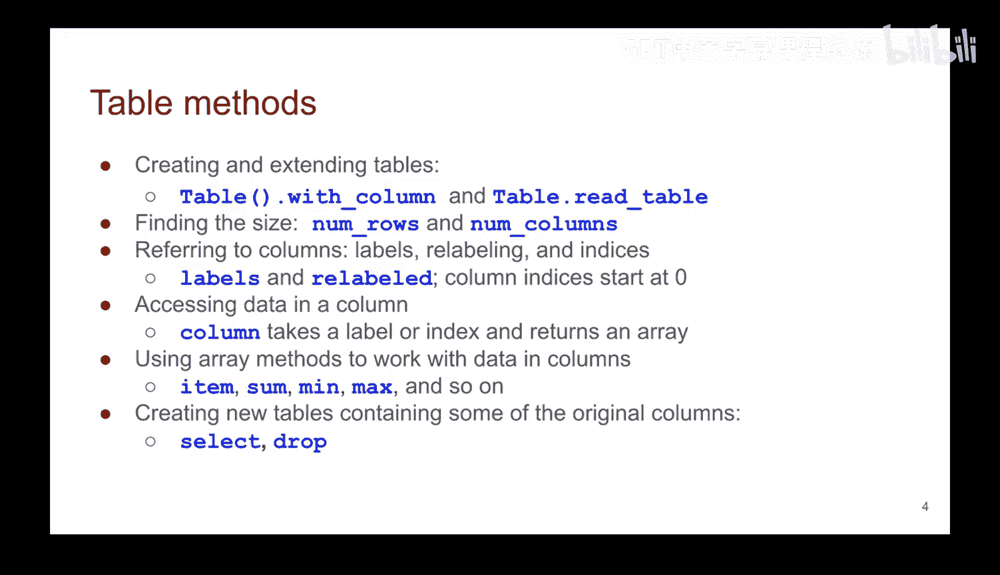
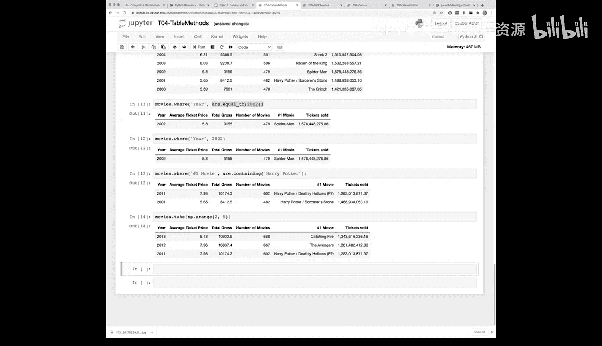

# 17：表格回顾与操作 🗂️


在本节课中，我们将回顾并深入学习表格（Tables）这一核心数据结构。表格是本课程中组织数据的主要形式，也是我们进行分析和可视化的基础。我们将重点理解表格的概念、操作方法，并通过实际代码演示来巩固这些知识。

---

## 表格的核心概念

上一节我们介绍了数组和表格的基本概念。本节中，我们来看看表格的具体结构和它在数据分析中的核心地位。

表格本质上是一种二维数据结构，由一系列带标签的列（Columns）组成。

*   **列（Column）**：每一列代表一个特定的属性（Attribute）。例如，在一个关于美国各州的表格中，可能有一列是“州名缩写”，另一列是“面积”。
*   **行（Row）**：每一行代表一个独立的数据点或个体（Individual）。将所有行的数据组合起来，就构成了我们的数据集。



本课程使用一个围绕表格概念构建的定制化数据科学包。因此，我们需要将数据视为以表格形式组织，并熟练掌握表格的各种方法。

从计算机科学的角度学习新语言或库时，需要关注两点：语法（Syntax）和核心对象（Primary Objects）。在本课程中，我们使用Python，因此需要了解变量、方法/函数调用、命名约定和赋值等语法。同时，我们需要掌握Python中的原生类型（如整数、浮点数、字符串）以及通过数据科学库引入的**表格**对象。

在Python中，一旦拥有了对象，就可以对其执行操作。表格对象有许多可用的操作，我们将深入探讨数据科学包提供的这些表格操作方法。

---

## 学习资源与语法要点

学习表格操作就像学习一门外语，最好的熟悉方式是通过练习、阅读代码和编写自己的代码。实验课和作业正是为此而设。

在熟练掌握之前，记住所有操作和方法名称需要时间，这很正常。我们的课程网站提供了一个“Python参考”页面，它是Python和数据科学库语法的一站式查询中心。

以下是访问和使用该资源的一些要点：
*   如果您忘记了某个操作如何工作，可以随时返回课程网站的“Python参考”页面。
*   该页面列出了本课程中将使用的所有表格函数和方法。
*   您也可以通过回顾课件或教材中的相关章节来查找信息。
*   该参考涵盖了本课程中使用的大部分语法。

---

## 表格的基本操作

以下是一些我们将对表格执行的基本操作。首先，我们来看看如何创建和获取表格的基本信息。

**创建与读取表格**
*   `Table()`：调用`Table`方法可以创建一个空表格。
*   `read_table()`：通常，我们通过读取CSV文件来创建表格。此方法接收一个已存在的数据文件路径，并为我们填充表格数据。

**获取表格信息**
*   `num_rows`：获取表格的行数。
*   `num_columns`：获取表格的列数。
**注意**：`num_rows`和`num_columns`在Python中被称为属性（Attributes），调用时**不需要**括号`()`。其他方法调用则需要括号。

---

## 操作表格的列

现在，我们来看看如何对表格的列进行操作。提取列数据是我们最常做的操作之一。

对列的思维模型是：每一列定义了一个特定属性，我们可以从表格中提取该列。使用表格的`.column()`方法可以提取指定列，该方法返回一个数组（Array），该数组为表格中的每个个体包含一个条目。

数组的优势在于我们可以在其上执行大量操作，例如求和、求最小值、求最大值，或对数组进行加减乘除等运算。通常，在进行数据操作或分析时，我们会将所需的列提取为数组，然后进行各种计算。

我们还可以在表格级别进行操作：
*   `.select()`：选择指定的列以创建一个包含这些列的新表格。
*   `.drop()`：删除指定的列，保留其他所有列。如果数据包含不需要的列，删除它们可以简化操作。

---

## 操作表格的行

上一节我们介绍了如何操作列，本节中我们来看看如何对表格的行进行操作。

**排序与选择行**
*   `.sort()`：根据指定列的值对表格行进行排序。默认按升序排列，可以添加参数改为降序。
*   `.take()`：选择指定行编号的行。**重要提示**：Python的索引从0开始。这意味着第一行的索引是0，第二行是1，依此类推。索引号可以理解为该元素距离起始位置的距离。

**条件筛选行**
*   `.where()`：此方法非常常用，它允许我们根据条件筛选行。我们指定要查看的列以及条件，该方法将只保留满足条件的行。条件谓词非常丰富，包括等于、大于、小于、介于等。如果您忘记了具体谓词，可以参考Python参考页面。
*   **语法快捷方式**：如果只想筛选某列等于特定值的行，可以直接将值作为参数传递给`.where()`，这等同于使用“等于”谓词。

---

## 实战演示：电影数据分析

让我们通过一个实战演示来巩固以上知识。我们将完成上次课程开始的演示，分析一个电影数据表格。

首先，我们读取数据并查看表格结构。

```python
# 读取CSV文件创建表格
movies = read_table('movie_data.csv')
# 显示表格
movies.show()
```
该表格包含年份、平均票价、总票房（以百万美元计）、电影总数和年度票房冠军等信息。

**步骤1：数据转换与列操作**
我们注意到“总票房”列是以百万美元为单位的。如果我们想将其转换为美元，可以提取该列，进行数学运算，然后添加回表格。

```python
# 1. 提取“总票房”列并转换为美元
gross_in_dollars = movies.column('total gross') * 1e6 # 1e6 即 1,000,000

# 2. 计算售出门票数（总票房 / 平均票价）
tickets_sold = gross_in_dollars / movies.column('average ticket price')

# 3. 将新列添加回表格
movies = movies.with_column('Tickets Sold', tickets_sold)
```

**步骤2：改善数据显示格式**
新添加的“售出门票数”列可能以科学计数法显示，不易阅读。我们可以使用`.set_format()`方法来设置列的显示格式。

```python
# 将“Tickets Sold”列设置为数字格式，使其更易读
movies.set_format('Tickets Sold', NumberFormatter)
```

**步骤3：数据可视化预览**
可视化数据能让我们更直观地发现规律。数据科学库内置了绘图功能，可以轻松创建图表。

```python
# 绘制年份与售出门票数的关系图
movies.plot('year', 'Tickets Sold')
```
这将生成一个折线图，直观展示历年电影票销售情况。

**步骤4：数据钻取与筛选**
我们可以使用之前学过的方法来深入查看特定时间段的数据。

```python
# 筛选2000年至2004年（不包括2005年）的数据
movies_2000_to_2004 = movies.where('year', are.between(2000, 2005))

# 查找年度票房冠军包含“Harry Potter”的年份
harry_potter_years = movies.where('number one movie', are.containing('Harry Potter'))

# 选择特定的行（例如，第2行到第4行，索引从0开始）
selected_rows = movies.take(np.arange(2, 5)) # 取索引为2,3,4的行
```

---

## 总结



本节课中，我们一起深入学习了表格（Tables）这一核心数据结构。我们回顾了表格的构成（行与列），强调了它是本课程数据组织和分析的基础。我们介绍了如何创建、读取表格，以及获取其基本信息（行数、列数）。重点学习了如何操作表格的列（如提取、添加、删除）和行（如排序、选择、条件筛选）。最后，通过一个电影数据分析的实战演示，我们综合运用了这些操作，包括数据转换、格式化、可视化预览以及条件查询，展示了表格在数据分析中的强大能力。记住，熟练掌握这些操作需要持续的练习，课程提供的“Python参考”页面是您随时查阅语法的好帮手。