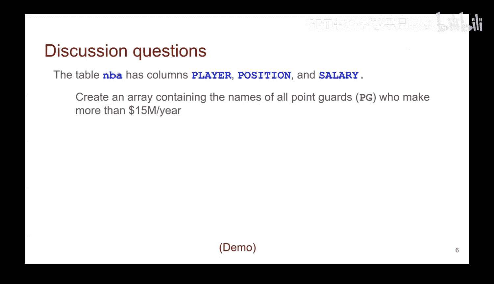

# 18：NBA薪资数据与可视化 🏀

在本节课中，我们将学习如何对NBA薪资数据表进行操作，具体任务是筛选出年薪超过1500万美元的控球后卫球员姓名。我们将通过回顾表格操作的核心概念，并引导你动手练习，来巩固所学知识。

## 回顾表格操作 📊

上一节我们介绍了表格的基本操作。本节中，我们来看看如何将这些操作组合起来，完成一个具体的查询任务。

我们拥有一个名为 `nba` 的数据表。该表包含以下列：球员姓名（`player`）、场上位置（`position`）和薪资（`salary`）。

## 动手练习：编写查询 ✍️

有时，在纸上尝试编写代码有助于确保语法正确并加深理解。因此，请你花点时间完成以下任务。

我们的目标是：基于上述表格，创建一个数组，该数组包含所有年薪超过1500万美元的控球后卫的姓名。

以下是完成此任务所需的步骤思路：

1.  从 `nba` 表开始。
2.  筛选出 `position` 为 “Point Guard” 的行。
3.  在上一步的结果中，进一步筛选出 `salary` 大于 15,000,000 的行。
4.  从最终筛选出的行中，选择 `player` 列，并将其转换为数组。

请花几分钟时间，参考Python文档，尝试自己写出这段代码。

我将在此暂停，给你思考和实践的时间。

---

本节课中，我们一起学习了如何对数据表进行链式操作，通过组合条件筛选和列选择，提取出满足特定条件的数据子集。核心在于理解操作顺序：先筛选行，再选择列。