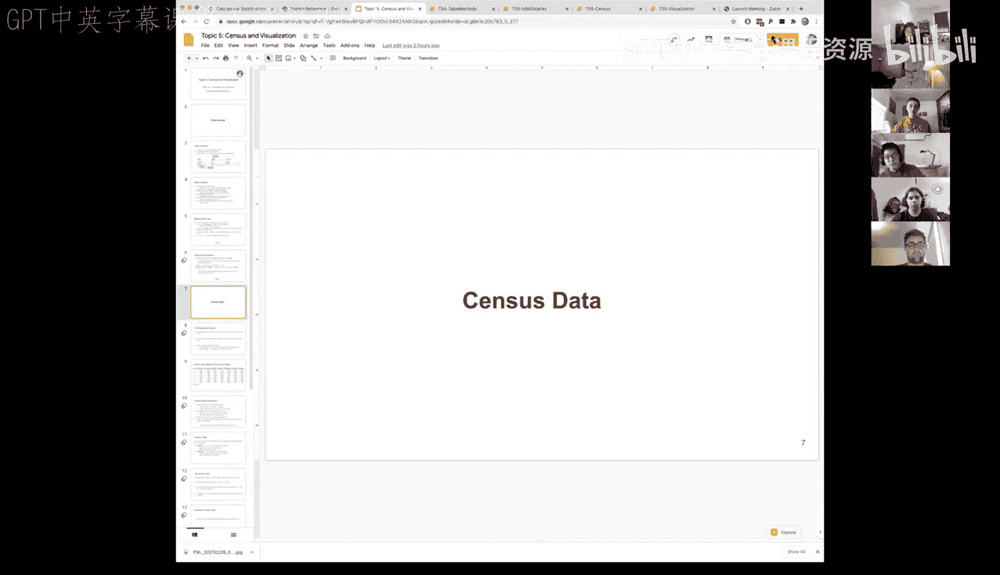
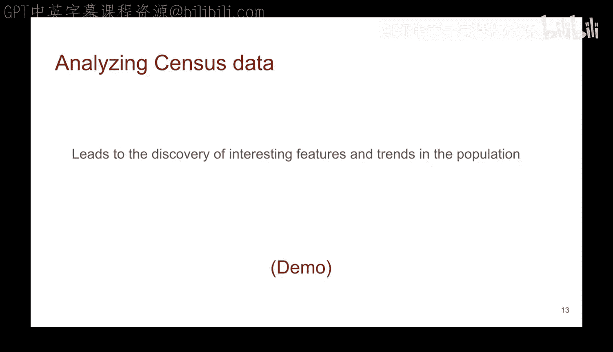
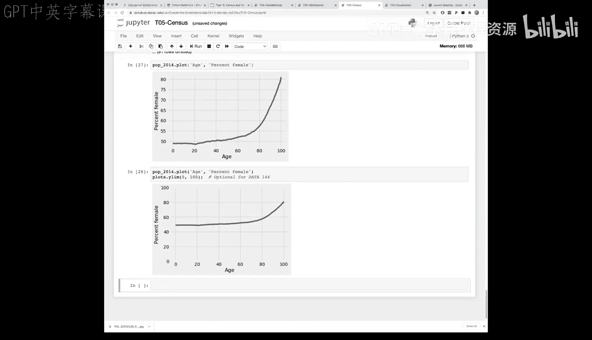

# 19：人口普查数据与可视化





在本节课中，我们将学习如何利用Python和表格操作来处理真实的人口普查数据，并通过可视化来揭示数据背后的故事。我们将从理解数据背景开始，逐步进行数据清洗、操作，并最终通过图表直观地展示人口趋势。

## 数据背景与理解

上一节我们介绍了课程的整体目标，本节中我们来看看我们将要使用的具体数据——美国人口普查数据。

美国每十年进行一次人口普查。我们使用的是2010年的普查数据，因为2020年的数据尚未完全公布。人口普查至关重要，因为它决定了各州在众议院的席位数量以及从联邦政府获得的资金比例。

在开始分析任何数据集之前，理解数据的背景、组织格式和具体含义至关重要。如果不理解数据就进行计算，最坏的情况可能导致基于错误假设的分析。

对于我们使用的这个人口普查数据表，每一列的值都依赖于该列的定义。我们需要了解每列的含义才能正确解读数据。

以下是关于此数据表的一些关键说明：

*   **`sex`（性别）列**：虽然用数字表示，但它是一个分类变量。`0`代表总计（男性+女性），`1`代表男性，`2`代表女性。
*   **`age`（年龄）列**：`0`表示未满周岁的婴儿。`999`是一个特殊代码，表示所有年龄的总计。
*   **数据来源**：`popestimate2010`（2010年人口估计值）指的是当年7月1日的数据。

## 数据类型：数值型与分类型

理解了数据的具体含义后，我们需要从更宏观的角度理解数据的**类型**。数据应被组织成每列具有相同且可比较的类型。

我们主要会遇到两种数据类型：

1.  **数值型数据**：来自某种尺度，表示事物的实际数量或测量值。例如人口数量。数值型数据本质上是**可排序**的（可以比较大小），并且进行数学运算（如求差、求平均）是**有意义**的。
    *   **公式示例**：`平均人口 = 总人口 / 州数量`

2.  **分类型数据**：数据代表不同的类别或桶，个体被划分到这些固定的类别中。例如性别（男/女）、满意度等级（非常满意/满意/不满意）。分类数据可能有序（如满意度等级），也可能无序（如性别）。**关键点在于**：即使类别用数字编码（如用1代表“男性”），对其进行算术运算也通常是**无意义**的。
    *   **代码示例**：`sex_code = 1 # 代表“男性”，这是一个分类标签，而非可计算的数值`

## 数据清洗与操作实践

现在我们已经掌握了基本概念，让我们通过实际代码来加载、查看和清洗人口普查数据。

首先，我们导入必要的库并加载数据。

```python
# 导入数据科学库
from datascience import *
# 导入绘图库
import matplotlib.pyplot as plt

# 加载人口普查数据表
census = Table.read_table('path/to/census_data.csv') # 请替换为实际文件路径
census.show(5)
```

数据包含许多年份的估计值。假设我们重点关注2010年实际普查人口和2014年的估计人口。

```python
# 选择我们感兴趣的列：性别、年龄、2010年人口、2014年人口
selected_data = census.select('sex', 'age', 'popestimate2010', 'popestimate2014')
selected_data.show(5)
```

为了方便，我们可以重命名列。



```python
# 重命名列，使其更简洁
renamed_data = selected_data.relabeled('popestimate2010', '2010').relabeled('popestimate2014', '2014')
renamed_data.show(5)
```

我们可以对数据排序，例如按年龄排序。

```python
# 按年龄升序排序
sorted_by_age = renamed_data.sort('age')
sorted_by_age.show(10)
```

数据中包含代表总计的特殊行（`age`为999）。为了进行纯粹的数值分析，我们需要移除它们。

```python
# 移除年龄为999的行（总计行）
no_total_age = renamed_data.where('age', are.below(999))
```

如果我们不关心性别区分，只想看总人口数据，可以筛选并删除性别列。

```python
# 选择总人口数据（sex == 0），然后删除‘sex’列
everyone_data = no_total_age.where('sex', 0).drop('sex')
everyone_data.show(5)
```

## 数据可视化探索

数据清洗完成后，我们就可以开始通过可视化来探索数据了。图表能以数字表格无法实现的方式讲述故事。

让我们绘制2010年的人口年龄分布图。

```python
# 绘制2010年人口随年龄变化的折线图
everyone_data.plot('age', '2010')
plt.title('2010年美国人口年龄分布') # 添加图表标题
plt.show() # 显示图表
```

从图中我们可以观察到一个明显的“凸起”部分。通过计算，我们发现这个凸起对应的是1947年左右出生的人群，这正好是“婴儿潮”时期的开始。可视化清晰地展示了这一历史人口现象。

我们可以比较不同年份的人口结构。

```python
# 在同一图中绘制2010年和2014年的人口年龄分布，进行对比
everyone_data.plot('age')
plt.title('2010年 vs 2014年美国人口年龄分布')
plt.show()
```

可以看到，2014年的曲线整体比2010年“老”了4岁，人口高峰也相应右移，这符合预期。

## 深入分析：性别比例

最后，让我们进行更深入的分析，计算并可视化2014年各年龄段的性别比例。

首先，我们需要分别提取男性和女性的数据。

```python
# 从清洗后的数据开始（已移除999）
base_data = no_total_age

# 获取男性数据 (sex == 1)，并删除‘sex’列
males_2014 = base_data.where('sex', 1).drop('sex').select('age', '2014')
# 获取女性数据 (sex == 2)，并删除‘sex’列
females_2014 = base_data.where('sex', 2).drop('sex').select('age', '2014')
```

然后，创建一个包含年龄、男性人口、女性人口的新表。

```python
# 创建新表，合并数据
population_2014 = Table().with_columns(
    'age', males_2014.column('age'),
    'male', males_2014.column('2014'),
    'female', females_2014.column('2014')
)
population_2014.show(5)
```

绘制男女人口随年龄变化的对比图。

```python
population_2014.plot('age')
plt.title('2014年美国分性别人口年龄分布')
plt.show()
```

图中显示，在较低年龄段男性略多，大约在40岁左右曲线交叉，之后女性人口超过男性，且随着年龄增长，差距越拉越大。

为了更精确地展示，我们可以计算并绘制女性比例。

```python
# 计算总人口和女性比例
total = population_2014.column('male') + population_2014.column('female')
percent_female = (population_2014.column('female') / total) * 100

# 将比例添加到表中（并保留3位小数）
results = population_2014.with_column('percent_female', np.round(percent_female, 3))
results.select('age', 'percent_female').plot('age', 'percent_female')
plt.title('2014年各年龄段女性人口百分比')
plt.ylim(0, 100) # 设置Y轴范围从0到100，以显示完整比例
plt.show()
```

这张百分比图强烈地揭示出，在高龄阶段（如80岁以上），女性占比高达60%-80%，直观地印证了女性预期寿命更长的现象。

## 总结



本节课中我们一起学习了如何处理和分析真实世界的数据集。我们从理解美国人口普查数据的背景和结构开始，区分了数值型和分类型数据。接着，我们使用Python进行了数据加载、筛选、清洗和重组。最后，我们利用可视化工具绘制了折线图，不仅直观展示了人口年龄分布和“婴儿潮”现象，还通过对比分析和比例计算，深入揭示了人口性别结构随年龄变化的趋势。整个过程展示了数据科学从理解、清洗到分析和可视化的基本工作流程。