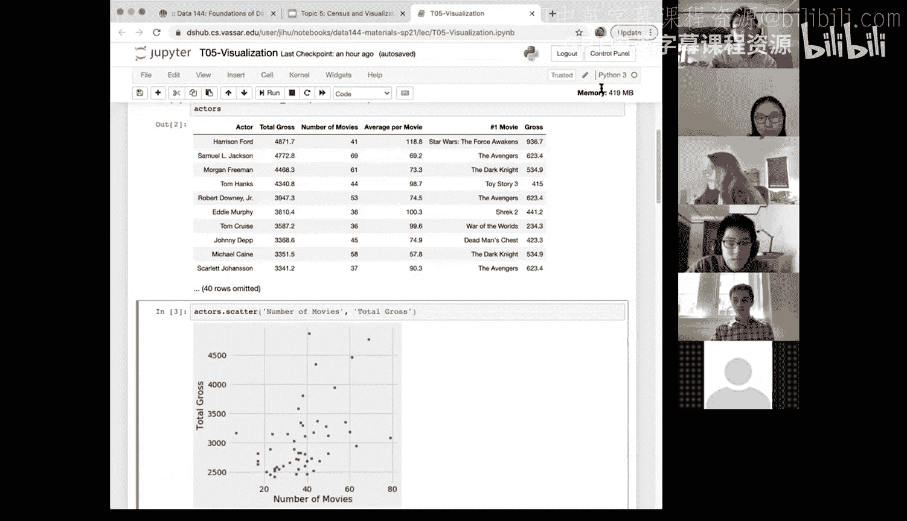
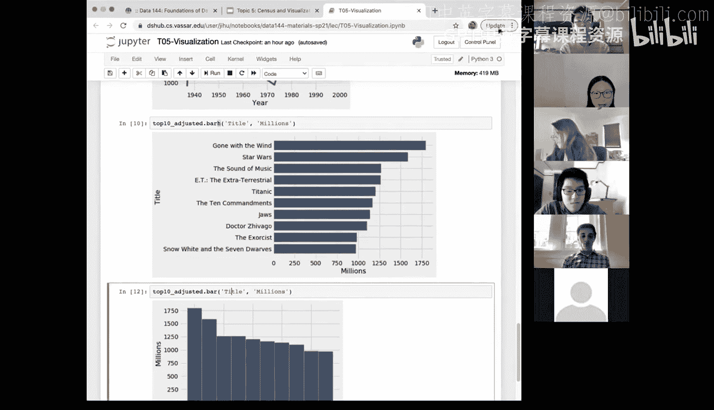

# 20：数据可视化 📊

在本节课中，我们将学习数据可视化的核心概念，并通过具体示例演示如何使用散点图和条形图来探索不同类型的数据。我们将看到，选择哪种可视化方法高度依赖于我们正在处理的数据类型。


上一节我们介绍了人口普查数据的分析方法，本节中我们来看看如何通过可视化更直观地呈现数据。

## 可视化方法的选择

可视化数据的方式多种多样，而选择哪种方式很大程度上取决于你正在处理的数据类型。到目前为止，我们讨论过数值型数据和分类型数据，今天我们将看到更多关于这些类型的示例。

以下是两种常见的数据类型及其对应的可视化方法：
*   **数值型数据**：通常使用散点图或折线图来探索变量间的关系。
*   **分类型数据**：通常使用条形图来比较不同类别的数值。

随着你对这些方法越来越熟悉，你会形成一种“自动反应”：处理分类型数据时选择条形图，处理数值型数据时则考虑散点图或折线图。

## 散点图示例：探索演员数据

我们从一个关于演员的数据集开始。这个数据集包含了约50位总收入最高的演员和女演员的信息。

每一行代表一位演员，每一列则包含关于他们的信息，例如：
*   `name`：演员姓名（字符串类型）
*   `# movies`：参演电影数量（数值型）
*   `total gross`：总收入（数值型）
*   `average per movie`：平均每部电影收入（数值型）

我们的目标是使用散点图来可视化数据中包含的信息。散点图非常适合探索两个**数值型变量**之间的关系。

### 散点图绘制方法

绘制散点图的方法是 `Table.scatter()`。该方法接受两个输入参数：
*   第一个参数对应散点图的 **x 轴**。
*   第二个参数对应散点图的 **y 轴**。

**公式：** `table_name.scatter(x_column_name, y_column_name)`

让我们尝试探索电影数量与总收入之间的关系。

```python
# 绘制电影数量（x轴）与总收入（y轴）的散点图
actors.scatter(‘# movies‘, ‘total gross‘)
```

从生成的图中，我们可能看到数据点比较分散，这正是“散点图”名称的由来。变量之间的关系有时可能更强或更弱。

接下来，我们看看平均每部电影收入与电影数量之间的关系。

```python
# 绘制电影数量（x轴）与平均每部电影收入（y轴）的散点图
actors.scatter(‘# movies‘, ‘average per movie‘)
```

这个关系看起来更有趣一些。总体呈现**下降趋势**：随着参演电影数量的增加，平均每部电影的收入似乎在减少。图中还有一个明显的**异常值**，它远离其他数据点。

我们可以使用 `Table.where()` 方法来快速找出这个异常值。

```python
# 找出平均每部电影收入高于400的演员
actors.where(‘average per movie‘, are.above(400))
```

查询结果显示这位演员是 **Anthony Daniels**。尽管他参演的电影不多，但都是像《星球大战》系列这样的超级大片。这个发现凸显了可视化的重要性：仅仅浏览数据表格很难发现这样的模式，而可视化能帮助我们快速识别数据中的规律和异常，这是数据科学家理解数据的第一步。

## 条形图示例：分析电影数据

现在，我们转向另一种常见的可视化类型：条形图。条形图非常适合用于**分类型数据**。

我们使用另一个数据集：2017年票房收入最高的200部电影（经通货膨胀调整后）。为了演示更清晰，我们首先提取排名前10的电影。

### 提取数据子集

我们可以使用 `Table.take()` 方法来选择特定的行。

```python
# 提取前10行数据（索引0到9）
top_10_adjusted = movies.take(np.arange(10))
```

### 数据格式化

原始数据中的收入列（如 `Gross Adjusted`）以美元为单位，数字很长，不易阅读。我们可以创建一个以“百万美元”为单位的新列。

步骤如下：
1.  从表中提取 `Gross Adjusted` 列，并将其转换为数组。
2.  将该数组除以 10^6（即100万）。
3.  使用 `np.round()` 将结果四舍五入到指定小数位。
4.  使用 `Table.with_column()` 方法将新数组作为新列添加回原表。

**代码：**
```python
# 1. 提取并转换数据
millions_array = top_10_adjusted.column(‘Gross Adjusted‘) / 10**6
millions_array = np.round(millions_array, 3) # 保留三位小数

# 2. 将新列添加回表格
top_10_adjusted = top_10_adjusted.with_column(‘Millions‘, millions_array)
```

现在，`Millions` 列中的数据更易于阅读和后续可视化。

### 绘制条形图

如果我们想比较这10部电影的调整后收入，散点图（比如用年份对收入）可能不是最佳选择，因为它无法清晰展示电影之间的排名对比。

此时，**条形图**是理想的选择。由于电影片名通常较长，我们使用**水平条形图**（`barh`）来确保片名清晰可读。

```python
# 绘制水平条形图：y轴为电影标题，x轴为收入（百万）
top_10_adjusted.barh(‘Title‘, ‘Millions‘)
```

`barh` 方法同样接受两个参数：
*   第一个参数（`‘Title‘`）决定了条形标签（y轴）。
*   第二个参数（`‘Millions‘`）决定了条形的长度（x轴）。



水平条形图能很好地展示从高到低的排名对比。如果使用默认的垂直条形图（`bar`），过长的电影片名将难以完整显示。


## 总结与核心要点 🎯

本节课中我们一起学习了数据可视化的两种基本方法：

1.  **散点图**：用于探索和展示两个**数值型变量**之间的关系。使用 `Table.scatter(x, y)` 方法绘制。
2.  **条形图**：用于比较**分类型数据**不同类别的数值。当类别标签较长时，使用水平条形图 `Table.barh(category, value)` 更为合适。




选择哪种可视化方法，核心取决于你的**分析目标**和**数据类型**。记住，好的可视化应该易于理解、信息清晰，并能有效传达数据背后的故事。在后续的课程和你的最终项目中，你将有机会更创造性地运用这些工具，自主提出问题并通过可视化来寻找答案。