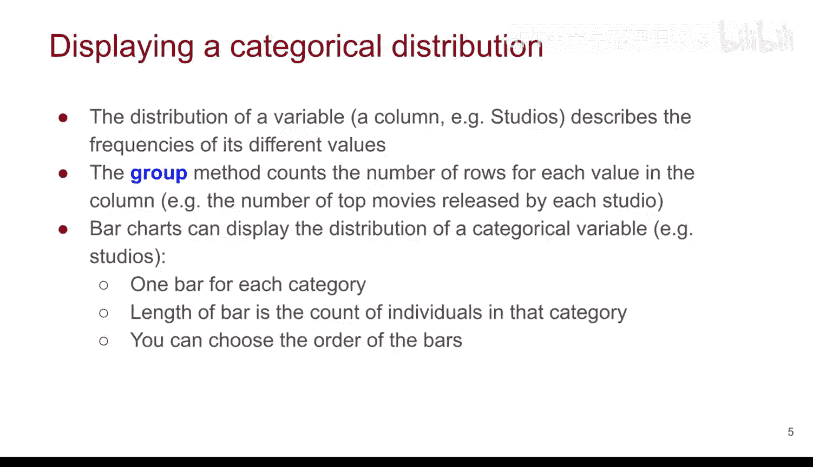

# 21：直方图


在本节课中，我们将学习一种重要的数据可视化方法——直方图。直方图是展示数据分布的有效工具，尤其适用于数值型数据。为了理解如何创建和解读直方图，我们需要先掌握一些核心概念和术语。我们将从回顾数据表的基本结构开始，然后探讨“分布”的含义，最后学习如何为分类数据和数值数据创建可视化图表。

## 数据表与变量

上一节我们介绍了课程主题，本节中我们来看看理解直方图所需的基础知识。首先，我们需要对数据表有清晰的认识。

一个数据表由行和列组成。
*   **行**：代表一条记录或一个个体。例如，在电影数据集中，每一行可能代表一部电影。
*   **列**：代表一个**变量**。变量也可以被视为特征、属性或关于每个观测值的一条信息。例如，在演员数据集中，“姓名”和“总票房”都是变量。

变量有以下特点：
1.  一个变量可以有不同的值。例如，“姓名”变量中，每个演员的名字通常都不同；“总票房”变量中，不同电影的值可能相同也可能不同。
2.  变量的值可以是**数值型**或**分类型**。
    *   **数值型变量**：如年龄、年份、总票房。它们内部还有子类型，例如年龄通常是整数，而票房可能包含小数。
    *   **分类型变量**：如冰淇淋口味、性别。它们也可以进一步细分：
        *   **无序分类变量**：类别间没有顺序，如冰淇淋口味。
        *   **有序分类变量**：类别间有内在顺序，如调查问卷中的满意度选项（非常差、差、一般、好、非常好）。
3.  每个个体在某个变量上有且仅有一个值。在数据表中，这体现为每个单元格只有一个值。

理解了这些术语后，我们就可以开始探讨“分布”的概念了。

## 什么是分布？

一个变量的**分布**，描述的是该变量各个不同值出现的频率。例如，在冰淇淋口味的例子中，如果我们有3行记录是“巧克力”，2行是“草莓”，那么这些计数就构成了“口味”变量的分布。



数据可视化的一个核心目标，就是帮助我们直观地理解这种分布。接下来，我们将先学习如何可视化分类变量的分布，然后再过渡到本节课的重点——用于连续数值型变量的直方图。

## 分类变量的可视化：条形图

以下是使用条形图可视化分类变量分布的步骤。我们将以分析2017年票房前200名电影的制片公司分布为例。

首先，我们需要导入必要的库并加载数据集。

```python
# 导入必要的库并加载‘top_movies_2017’数据集
```

我们感兴趣的是`studio`（制片公司）这一列，这是一个分类变量。我们想知道这200部电影是由哪些公司制作的，以及每家公司的电影数量。

第一步，从数据表中选取我们关心的列。这里我们使用`.select()`方法，它会返回一个新的数据表，方便后续进行链式操作。

```python
studios = top_movies_2017.select('studio')
```

接下来，使用`.group()`方法来计算每家制片公司出现的次数，即频率分布。

```python
studio_distribution = studios.group('studio')
```
执行上述代码后，我们会得到一个新的数据表`studio_distribution`，它包含两列：
*   `studio`：不同的制片公司名称（分类变量）。
*   `count`：该公司电影出现的次数（数值变量）。

为了验证计算是否正确，我们可以对`count`列求和，结果应等于总电影数200。

```python
sum(studio_distribution.column('count')) # 应返回 200
```

现在，我们可以用条形图来可视化这个分布。由于公司名称通常较长，使用水平条形图`barh`能让标签更易阅读。

```python
studio_distribution.barh('studio')
```

默认情况下，条形图按公司名称的字母顺序排列。为了更直观地展示排名，我们可以先按`count`列进行降序排序，再绘图。这里展示了Python中链式方法的强大之处。

```python
studio_distribution.sort('count', descending=True).barh('studio')
```

当然，你也可以按升序排序。

```python
studio_distribution.sort('count', descending=False).barh('studio')
```

总结一下，对于分类数据：
*   **分布**指不同类别出现的频率。
*   **`.group()`方法**用于计算分类变量各值的频数。
*   **条形图**用于展示分类变量的分布，每个条代表一个类别，条的长度代表该类别的计数。我们可以根据需要选择条形的排序方式（升序或降序），并优先使用`barh`来更好地显示长标签。

## 总结


本节课中我们一起学习了数据可视化的重要工具。我们首先回顾了数据表的结构和变量的类型（数值型与分类型）。接着，我们明确了“分布”是指变量各取值出现的频率。然后，我们深入探讨了如何使用`.group()`方法和条形图来可视化**分类变量**的分布。掌握这些是为下一节学习**数值变量**的核心可视化方法——直方图——打下坚实的基础。