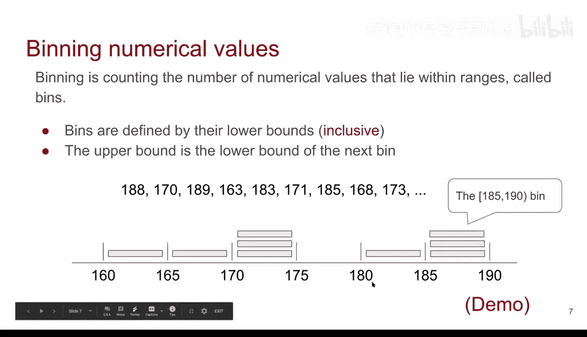
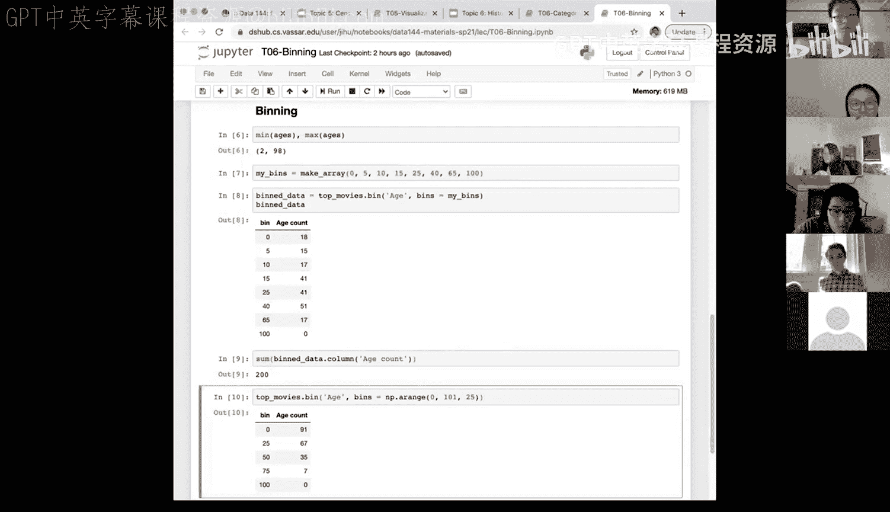
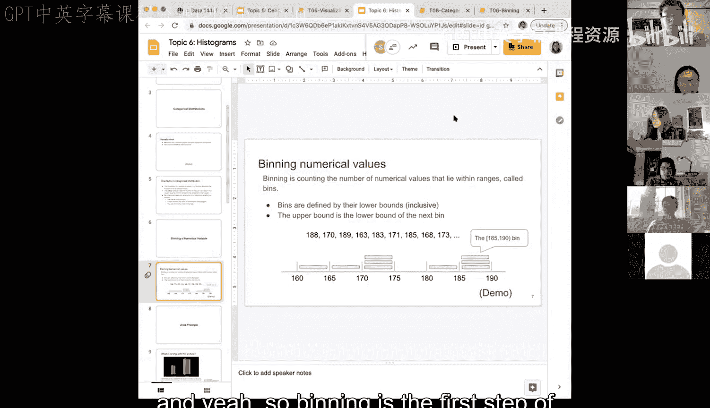

# 22：数值变量的分箱与直方图基础 🧮


在本节课中，我们将要学习如何对数值变量进行“分箱”，这是构建直方图以可视化数值数据分布的关键第一步。我们将从理解分箱的概念开始，并通过具体示例和代码演示其实现过程。

## 概述：从条形图到直方图

上一节我们介绍了用于分类变量的条形图。条形图通过 `.group` 方法统计每个类别的数量，然后进行可视化。

对于数值数据，我们之前学习过折线图和散点图。另一种常见的可视化方法是查看数值变量的分布，例如，我们可能想知道总票房在0-1000万、1000-2000万等区间内的电影数量。这就需要先将连续的数值划分到不同的“箱子”中，然后统计每个箱子里的数据点数量，最后用类似条形图的方式展示，这就是直方图。


与分类变量不同，数值变量的分箱需要我们主动创建这些区间（即“分箱”），然后才能进行计数和可视化。本节中我们来看看如何对数值变量进行分箱。

## 分箱的核心概念

分箱是指将数值变量的值划分到一系列连续的区间（称为“箱”或“段”）中，并统计每个区间内数值的个数（即频率）的过程。

以下是分箱过程的关键点：
*   **箱的定义**：在Python的实现中，箱由其**下界**（包含）定义。箱的标签就是其下界值。
*   **上界的处理**：一个箱的上界（不包含）是下一个箱的下界。例如，如果定义箱为 `[10, 20)` 和 `[20, 30)`，那么第一个箱包含10（含）到20（不含）的值，标签为“10”；第二个箱包含20（含）到30（不含）的值，标签为“20”。

## 一个简单的分箱示例

让我们通过一个身高（厘米）数据的小例子来理解分箱：
`[188, 170, 189, 163, 183, 171, 185, 168, 173]`



假设我们创建以下分箱区间：
`[160, 165), [165, 170), [170, 175), [175, 180), [180, 185), [185, 190)`

根据规则，我们将每个身高值放入对应的箱中：
*   188 → `[185, 190)` 箱
*   170 → `[170, 175)` 箱（因为下界170包含在内）
*   189 → `[185, 190)` 箱
*   163 → `[160, 165)` 箱
*   183 → `[180, 185)` 箱
*   171 → `[170, 175)` 箱
*   185 → `[185, 190)` 箱（因为下界185包含在内）
*   168 → `[165, 170)` 箱
*   173 → `[170, 175)` 箱

统计每个箱的计数（频率）：
*   `[160, 165)`：1
*   `[165, 170)`：1
*   `[170, 175)`：3
*   `[175, 180)`：0
*   `[180, 185)`：1
*   `[185, 190)`：3

这样，我们就得到了数值数据的频率分布，离创建直方图更近了一步。

## 实战演示：电影年龄的分箱

现在，让我们在一个真实数据集上实践。我们使用2017年Top 200电影数据集，并创建一个“电影年龄”变量（计算到2019年）。

首先，查看数据的基本范围：

```python
# 假设 `movies` 是包含‘year’列的数据表
movies_with_age = movies.with_column(‘age‘, 2019 - movies.column(‘year‘))
age = movies_with_age.column(‘age‘)
min_age = min(age) # 例如：2
max_age = max(age) # 例如：98
```

### 方法一：创建不等宽分箱

根据数据特点，我们可能希望在近期（电影较多）使用更窄的箱宽以观察细节，在早期使用更宽的箱宽。

以下是创建不等宽分箱并计数的代码：

```python
# 定义分箱的下界
bin_edges = np.array([0, 5, 10, 15, 20, 40, 65, 100])
# 使用 .bin 方法进行分箱计数
binned_data = movies_with_age.bin(‘age‘, bins=bin_edges)
binned_data
```

`.bin` 方法返回一个数据表，其中第一列是分箱标签（下界），第二列（默认名为“变量名 count”）是该箱内的数据计数。所有箱的计数之和应等于总数据量（200）。

### 方法二：创建等宽分箱



我们也可以创建宽度相同的分箱。

```python
# 使用 np.arange 创建从0到100，步长为25的等宽分箱下界
equal_bins = np.arange(0, 101, 25) # 0, 25, 50, 75, 100
equal_binned_data = movies_with_age.bin(‘age‘, bins=equal_bins)
equal_binned_data
```

不同的分箱方式会得到不同的分布结果。等宽分箱可能将大量近期电影集中在一个箱内，从而掩盖细节。


### 重要注意事项：分箱范围必须覆盖数据

创建分箱时，必须确保分箱范围覆盖了整个数据集的最小值和最大值。否则，部分数据将无法被统计，导致信息丢失和计数总和错误。

例如，如果数据年龄最大为98，但分箱只到60：

```python
# 错误示范：分箱未覆盖全部数据范围
incomplete_bins = np.arange(0, 60, 25) # 只生成 0, 25, 50
bad_binned_data = movies_with_age.bin(‘age‘, bins=incomplete_bins)
bad_binned_data
# 此时计数总和将小于200，且年龄大于50的数据无法被正确显示。
```

## 总结




本节课中我们一起学习了数值变量分箱的核心知识。我们了解到，分箱是将连续数值划分为离散区间并统计频率的过程，它是绘制直方图来可视化数值分布的基础。关键点包括：分箱由其包含的下界定义，上界是下一箱的下界；我们可以使用 `.bin` 方法并传入下界数组来实现分箱；分箱可以是等宽的或不等宽的，取决于分析需求；最重要的是，分箱范围必须完整覆盖数据，否则会导致计数错误和信息缺失。掌握了分箱，我们就为下一节学习直方图的构建打下了坚实的基础。